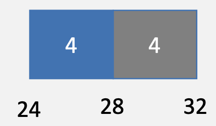
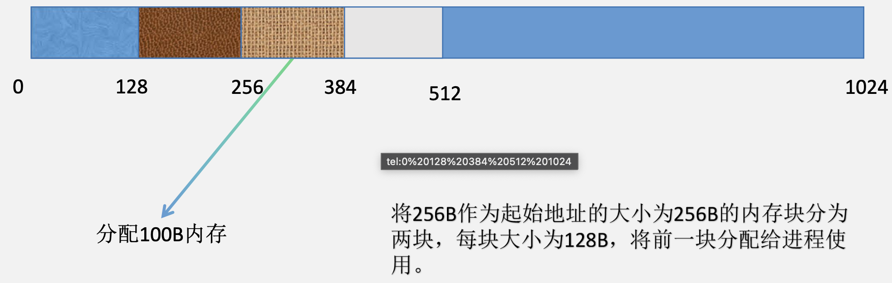
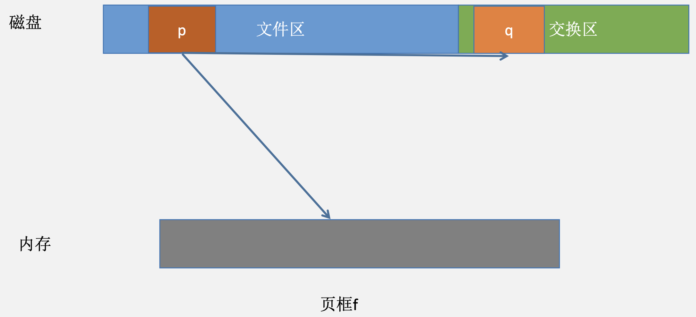

# 内存管理

## 逻辑地址与重定位

&emsp;&emsp;&ensp;磁盘中保存的程序是利用逻辑地址进行寻址的，当程序以进程的形式执行时，指令和数据均进入了内存中，计算机为了使用给定的指令或数据，必须能够将程序给出的逻辑地址转化为对应的物理地址，**这个转化过程即为重定位过程**。

### 逻辑地址在磁盘中的保存方式

### 从逻辑地址到物理地址

&emsp;&emsp;&ensp;程序必须装入内存中才能执行，一个程序的所有内容可以装入内存中的连续区域。

&emsp;&emsp;&ensp;也可以装入内存中不连续的区域。

&emsp;&emsp;&ensp;但是无论是连续存放还是非连续存放，程序都必须能够将逻辑地址转化为物理地址。

## 内存管理的特征

* 抽象：进程通过逻辑地址访问自身的内存地址空间。
* 保护：每个进程有自己的独立地址空间。
* 共享：进程间也可以通过某些方式**共享相同的物理内存**。
* 虚拟化：进程可以访问比物理内存空间更大的虚拟内存空间。

## 本章主要解决的问题：

* 源代码文件及其依赖的库函数如何整合为磁盘上的逻辑程序？

* 逻辑程序需要被放置在内存上才能执行？操作系统如何为程序分配内存空间？进程不需要使用内存的时候如何回收？

* 逻辑程序是由逻辑地址写成的，计算机中访问数据和指令使用的是内存物理地址，如何实现这种转换？

## 地址空间定义

&emsp;&emsp;&ensp;物理地址空间-**硬件支持**的地址空间：起始地址 ${0}$，直到 ${MAXsys}$。
&emsp;&emsp;&ensp;逻辑地址空间-在 ${CPU}$ 运行的进程看到的地址：起始地址 ${0}$，直到 ${MAXprog}$。

## 从源代码到程序的执行过程解析

### 静态链接

&emsp;&emsp;&ensp;链接完成时，**程序的逻辑地址**便已经形成了。

### 装载与重定位

&emsp;&emsp;&ensp;程序中的指令和数据需要装载到内存中才能够访问或执行，**将程序装入内存的过程叫做装载**。当程序被装载到内存时，每一条指令和数据**便都有了自己所在的物理地址**，计算机程序由逻辑地址进行寻址（基址寻址），然而对物理存储器的访问则需要提供内存物理地址。**逻辑地址向物理地址的转换过程被称为重定位**。

#### 绝对装入（很少用）

&emsp;&emsp;&ensp;绝对装入中程序直接给出各数据和指令的物理地址，**没有逻辑地址和物理地址的区分**，数据和指令的物理地址在编译时便已形成。

#### 静态重定位（可重定位装入）

&emsp;&emsp;&ensp;静态重定位的物理地址在**装载的时候形成**，一旦形成便不能再随运行时间变化。也可以不连续。

#### 动态重定位（动态运行时装入）

&emsp;&emsp;&ensp;动态重定位的物理地址在运行的时候形成，且物理地址可以随运行时间改变，程序浮动就是动态重定位的意思。

#### 物理地址生成时机和限制

&emsp;&emsp;&ensp;编译时生成：假设起始地址已知，如果起始地址改变，必须重新编译。
&emsp;&emsp;&ensp;加载时生成（静态重定位）：如编译时起始位置未知，编译器需生成可重定位的代码（${relocatable\quad code}$），加载时，生成**绝对地址**。
&emsp;&emsp;&ensp;执行时生成（动态重定位）：执行时代码可移动，**需地址转换（映射）硬件支持**。

### 静态链接与动态链接

&emsp;&emsp;&ensp;共享库函数同时位于而这逻辑空间中，但是在物理空间中只需要载入一份。

&emsp;&emsp;&ensp;第一种情况：动态链接下共享库链接时机：**装载时链接**（当每个程序装入内存的时候，将库函数链接到进程里去。）

&emsp;&emsp;&ensp;第二种情况：动态链接下共享库链接时机：**运行时链接**

### 地址生成过程

* CPU
    * ${ALU（Arithmetic Logic Unit）}$：需要逻辑地址的内存内容。
    * ${MMU（Memory Management Unit）}$：进行逻辑地址和物理地址的转换，地址映射过程是由硬件来完成的。
    * ${CPU}$ 控制逻辑：给总线发送物理地址请求。
* 内存：发送物理地址的内容给 ${CPU}$ 或接收 ${CPU}$ 数据到物理地址。
* 操作系统：建立逻辑地址 ${LA}$ 和物理地址 ${PA}$ 的映射关系。

* 地址检查、地址越界与地址越权：**操作系统可以支持的逻辑寻址范围被称为操作系统位数**。然而，并不是寻址范围内的每一个逻辑地址都属于进程的逻辑地址空间，因此，逻辑地址在访问前需要先经过**地址检查**，来确保它属于合法地址范围。若进程访问的逻辑地址不在允许访问的合法地址范围，则这次访问会触发**地址越界异常**。
* 上下界寄存器

* 重定位寄存器和界地址寄存器

* 地址越权：即使进程访问的逻辑地址在合法范围内，若该进程在用户态下访问了属于内核空间的地址或以未被赋权的方式访问了某地址，则会触发地址越权异常。

## 内存分配

&emsp;&emsp;&ensp;进程的执行需要内存空间，操作系统会根据进程的需要**分配对应的物理内存空间**，即内存分配问题。

### 连续内存分配

#### 连续内存分配和内存碎片

* 连续内存分配：给进程分配一块不小于指定大小的连续的物理内存区域。
* 内存碎片：空闲内存不能被利用。
* 外部碎片：分配单元之间的未被使用内存。
* 内部碎片：分配单元内部的未被使用内存，取决于分配单元大小是否与所需内存大小相同。

#### 连续内存分配的种类

* 单一连续分配：单一连续分配只用于单道处理程序，它将整个内存分为内核区域和用户区域，操作系统内核连续存放在内核区域中，用户程序放在用户区域中。

* 固定分区分配：固定分区分配是最简单的一种多道程序存储管理方式，它将用户内存空间划分为**若干固定大小的区域**，每个分区只装入一道作业。当有空闲分区时，便可再从外存的后备作业队列中选择适当大小的作业装入该分区；它们可能分区大小相等，也可能分区大小不相等；${P4}$ 请求 ${400B}$ 物理内存。

* 动态分区分配：又称可变分区分配，它是进程装入内存时，根据进程的实际需要，动态地为之分配内存，并使分区的大小正好适合进程的需要。因此，系统中分区的大小和数目是可变的。

&emsp;&emsp;&ensp;初始状态

&emsp;&emsp;&ensp;当将 ${64MB}$ 到 ${72MB}$ 分配给进程 ${P1}$ 后。

&emsp;&emsp;&ensp;再来一个进程

&emsp;&emsp;&ensp;进程 ${P1}$ 结束时

&emsp;&emsp;&ensp;产生外部碎片的情况

&emsp;&emsp;&ensp;根据选择内存块的方式不同，动态分区分配分为：

##### 首次适应算法

* 思路：分配 ${n}$ 个字节，使用第一个可用的空间比 ${n}$ 大的空闲块。
* 示例：分配 ${400}$ 字节，使用第一个 ${1KB}$ 的空闲块。

* 原理和实现：空闲分区列表按地址顺序排序；分配过程时，搜索一个合适的分区；释放分区时，检查是否可与临近的空闲分区合并。
* 优点：简单；在高地址空间有大块的空闲分区。
* 缺点：外部碎片；分配大块时较慢。

##### 临近适应算法

* 思路：由首次适应算法演变而来，从上次查找结束位置开始查找；空闲分区链表按照地址递增次序排列（可为循环链表）。
* 优点：不用每次都从低地址的小分区开始查找；算法开销小，每次回收后不需要对分区队列进行重新排列。
* 缺点：会把高地址的大分区也用完。

##### 最佳适应算法

* 思路：分配 ${n}$ 字节分区时，查找并使用不小于 ${n}$ 的最小空闲分区。
* 示例：分配 ${400}$ 字节，使用第三个空闲块（最小）。

* 原理和实现：空闲分区列表按照大小排序；分配时，查找一个合适的分区；释放时，查找并且合并临近的空闲分区（如果找到）。
* 优点：大部分分配的尺寸较小时，效果很好。可避免大的空闲分区被拆分；可减小外部碎片的大小；相对简单。
* 缺点：外部碎片；放分区较慢；容易产生很多无用的小碎片。

##### 最坏适应算法

* 思路：分配 ${n}$ 字节，使用尺寸不小于 ${n}$ 的最大空闲分区。
* 示例：分配 ${400}$ 字节，使用第二个空闲块（最大）。

* 原理是实现：空闲分区列表按由大到小排序；分配时，选最大的分区；释放时，检查是否可与临近的空闲分区合并，进行可能的合并，并调整空闲分区列表顺序。
* 优点：中等大小的分配较多时，效果最好；避免出现太多的小碎片。
* 缺点：释放分区较慢；外部碎片；容易破坏大的空闲分区，因此后续难以分配大的分区。

##### 碎片整理：紧凑（compaction）

&emsp;&emsp;&ensp;碎片整理：通过减少进程占用的分区位置来减少或避免分区碎片。
&emsp;&emsp;&ensp;碎片紧凑：通过移动分配给进程的内存分区，以合并外部碎片；碎片紧凑的条件：**所有的应用程序可动态重定位**。

### 非连续分配

#### 非连续分配的设计目标

&emsp;&emsp;&ensp;连续分配的缺点：分配给程序的物理内存必须连续；存在外部碎片和内部碎片；内存分配的动态修改困难；内存利用率较低。
&emsp;&emsp;&ensp;非连续分配的设计目标：提高内存利用效率和管理灵活性；允许一个程序的使用非连续的物理地址空间；允许共享代码和数据；支持动态加载和动态链接。

#### 非连续内存分配的实现

&emsp;&emsp;&ensp;非连续分配需要解决的问题：如何实现虚拟地址和物理地址的转换：软件实现（灵活、开销大）；硬件实现（够用、开销小）
&emsp;&emsp;&ensp;非连续分配的硬件辅助机制：如何选择非连续分配中的内存分块大小段式存储管理（${segmentation}$）页式存储管理（${paging}$）

#### 非连续内存分配的分类

##### 基本页式管理

&emsp;&emsp;&ensp;页面（页、逻辑页面，${Page}$）把逻辑地址空间划分为相同大小的基本分配单位；每个页的大小都是相同的。进程逻辑地址空间被划分为大小相等的页，假设页面大小为 ${512B}$，访问逻辑地址 ${2026B}$：

&emsp;&emsp;&ensp;继而可以将进程的逻辑地址转化为“逻辑页号+页内偏移”的形式。

&emsp;&emsp;&ensp;页框（页帧、物理页面）：把物理地址空间划分为**大小相同的基本分配单位**；页框和页面大小必须是**相同**的。

&emsp;&emsp;&ensp;地址转换：

* 页面（页、逻辑页面，${Page}$）：把逻辑地址空间划分为相同大小的基本分配单位；每个页的大小都是相同的。
* 页框（页帧、物理页面）：把物理地址空间划分为大小相同的基本分配单位；页框和页面大小必须是相同的。
* 逻辑地址转换为物理地址：逻辑页面转换为物理页面逻辑地址和物理地址的页内偏移相同 ${MMU/TLB}$。

###### 页表

&emsp;&emsp;&ensp;页表结构：每个进程都有一个页表，每个页面对应一个页表项；随进程运行状态而动态变化；页表基址寄存器（${PTBR：Page\quad Table\quad Base\quad Register}$），保存当前使用页表在内存当中的首地址（**物理地址**），**发生进程切换的时候需要改变 ${PTBR}$ 中的值**，这里就是进程切换时候所涉及到的地址空间的切换，即逻辑地址和物理地址的映射关系的切换，${PTBR}$ 就是**地址空间寄存器的一个实例**。页表项只有帧号f，**页号是隐式存在的**。页表是存放在内存中的，存放在内核内存中。

&emsp;&emsp;&ensp;补充：进程要访问页表项的时候，先根据页表始址在 ${cache}$ 里**找页表项**，没找到然后在主存里找，**这个时候可能会发生缺页**，缺页后调入，之后访问这一页的数据就是正常了。

&emsp;&emsp;&ensp;页表地址转换实例

###### 页式存储管理机制的性能问题

&emsp;&emsp;&ensp;内存访问性能问题：访问一个内存单元需要 ${2}$ 次内存访问。第一次访问：获取页表项；第二次访问：访问数据。
&emsp;&emsp;&ensp;页表大小问题：页表可能非常大；${64}$ 位逻辑地址空间如果每页 ${1024}$ 字节，那么一个页表的大小会是多少？
&emsp;&emsp;&ensp;如何处理：缓存（${Caching}$）：快表（${TLB}$）
&emsp;&emsp;&ensp;不管采用几级页表，在有 ${TLB}$ 的时候都是使用**完整的虚拟页号**进行访问的。

##### 间接（Indirection）访问

###### 多级页表

&emsp;&emsp;&ensp;二级页表实例

##### 段式地址空间

&emsp;&emsp;&ensp;段式地址空间的不连续二维结构：

&emsp;&emsp;&ensp;段式地址空间的逻辑视图：

###### 段访问机制

&emsp;&emsp;&ensp;段的概念：段表示访问方式和存储数据等属性相同的一段地址空间（让逻辑上在一起的程序代码部分在物理上也真正在一起）；对应一个连续的内存“块”；若干个段组成进程逻辑地址空间。
&emsp;&emsp;&ensp;段访问：逻辑地址由二元组 ${(s, addr)}$ 表示：${s-段号；addr-段内偏移}$。
&emsp;&emsp;&ensp;段式管理的特点：段式管理下的用户地址是二维的，不同于页式管理下的用户地址是一维的。

&emsp;&emsp;&ensp;页面的大小是程序员不可决定的，逻辑地址转化为物理地址的映射过程对用户程序员是透明的。而段对用户程序员来说就是**不透明**的，可见的。因为用户程序员**本身就会将程序分段，并使用段号+段内偏移的方式访问**。段内部有更强的逻辑性，因此更**有利于内存保护与内存共享**。

&emsp;&emsp;&ensp;段访问的硬件实现：

##### 段页式存储

&emsp;&emsp;&ensp;段页式存储管理的需求：段式存储在内存保护方面有优势，页式存储在内存利用和优化转移到后背存储方面有优势。段式存储、页式存储能否结合？
&emsp;&emsp;&ensp;段页式存储管理：在段式存储管理基础上，给每个段加一级页表。

&emsp;&emsp;&ensp;段页式存储管理中的内存共享：通过指向相同的页表基址，实现进程间的段共享。

## 虚拟存储

&emsp;&emsp;&ensp;计算机系统时常出现内存空间不够用。
&emsp;&emsp;&ensp;虚拟存储：在有限容量的内存中，以页为单位自动装入更多更大的内存。
&emsp;&emsp;&ensp;虚拟存储技术利用的原理：
&emsp;&emsp;&ensp;局部性原理：程序在执行过程中的一个较短时期，所执行的指令地址和指令的操作数地址，分别局限于一定区域。
&emsp;&emsp;&ensp;时间局限性：一条指令的一次执行和下次执行，一个数据的一次访问和下次访问都集中在一个较短时期内。
&emsp;&emsp;&ensp;空间局部性：当前指令和邻近的几条指令，当前访问的数据和邻近的几个数据都集中在一个较小的区域内。
&emsp;&emsp;&ensp;局部性原理的意义：从理论上来说，虚拟存储技术是能够实现的，而且可取得满意的效果。

### 虚拟页式存储管理

&emsp;&emsp;&ensp;在页式存储管理的基础上，增加请求调页和页面置换。
&emsp;&emsp;&ensp;思路：当用户程序要装载到内存运行时，只装入部分页面，就启动程序运行。进程在运行中发现有需要的代码或数据不在内存时，则向系统发出缺页异常请求。操作系统在处理缺页异常时，将外存中相应的页面调入内存，使得进程能继续执行。

#### 虚拟页式存储中的页表项结构

&emsp;&emsp;&ensp;存在位：表示该页是否在内存。${1}$ 表示该页位于内存中，该页表项是有效的，可以使用；${0}$ 表示该页当前在外存中，访问该页表项将导致缺页异常。
&emsp;&emsp;&ensp;访问位：表示该页面是否被访问过（读或写）。
&emsp;&emsp;&ensp;保护位：表示该页的允许访问方式。只读、可读写、可执行等。
&emsp;&emsp;&ensp;修改位：表示在内存中的该页是否被修改过。回收该物理页面时，据此判断是否要把它的内容写回外存。
&emsp;&emsp;&ensp;外存地址（可能有可能无）：指向该页在外存中的地址。发生缺页时根据该地址去外存中交换页面。

#### 虚拟页式存储中的地址转换

#### 缺页异常（缺页中断）的处理流程

&emsp;&emsp;&ensp;除了重新执行，以及开头的访问逻辑页面 ${p}$ 是地址转换，其他都属于地址映射。**${map}$ 是操作系统干的（建立映射关系），转换是硬件干的**。

#### 页框分配

&emsp;&emsp;&ensp;当发生缺页异常时，进程需要向操作系统申请一个空闲的内存页框来放置从外存中换入的页，操作系统选择空闲的页框分配给进程。

##### 分配方法

&emsp;&emsp;&ensp;固定分配：为每个进程分配固定个数的物理页框数。
&emsp;&emsp;&ensp;可变分配：每个进程拥有的物理页框数可能发生改变。
&emsp;&emsp;&ensp;全局置换：进程可以从整个内存空间中获取空闲的页框来使用。
&emsp;&emsp;&ensp;局部置换：进程只能使用操作系统分配给进程的页框，若无空闲页框，则进行页面置换。

##### 分配方法的搭配策略

&emsp;&emsp;&ensp;**固定分配局部置换**：为每个进程分配固定个数的物理页框数，在进程执行过程中，若没有空闲页框而需要分配新页框时，只能从已经分配的页框中做置换操作。
&emsp;&emsp;&ensp;**可变分配局部置换**：操作系统根据具体情况为进程分配一定数目的页框，为每个进程分配固定个数的物理页框数，在进程执行过程中，若没有空闲页框而需要分配新页框时，只能从已经分配的页框中做置换操作。但是操作系统会根据进程缺页率等动态调节进程拥有的页框数量。
&emsp;&emsp;&ensp;**可变分配全局置换**：全局置换指所有物理页框均作为公共资源可以供所有进程使用，当进程需要分配物理页框时，只需要从整个物理内存中获取一个空闲页框即可。根据这个分配方式可以看到，每个进程拥有的页框数量不可能限制不变，因此不存在固定分配全局置换。

##### 连续页框分配的伙伴算法

&emsp;&emsp;&ensp;在进程实际运行过程中，可能会出现一次需要分配多个物理页框的情况，在这种情况下，操作系统一般会为进程分配连续的物理页框来加速分配过程。其中，现代操作系统中常用的页框分配算法为伙伴算法（${buddy-system}$）。

&emsp;&emsp;&ensp;伙伴算法将所有的页框组织成不同大小的页框块，页框块内页框数均为 ${2}$ 的整数次幂（${2^0\~\ 2^{10}}$）。
&emsp;&emsp;&ensp;每次页框号相关的结构只需要给出页框块的起始页框号即可。
&emsp;&emsp;&ensp;要求：每个页框块的起始页框号必须是页框块大小的整数倍。
&emsp;&emsp;&ensp;分配：当需要分配一定数量的页框时，从所有可以获取的页框块中分配刚好满足需要的页框块即可。若不存在刚好满足的页框块，比如需要 ${88}$ 个页框，但是由于页框块内页框数均为 ${2}$ 的整数次幂，所以将分配有 ${128}$ 个页框的页框块（产生内部碎片）。若不存在有 ${128}$ 个页框的页框块，则对更大的页框块进行分裂，例如：如果此时存在有 ${256}$ 个页框的页框块，则对该页框块进行分裂，分成2个有128个页框的页框块。
&emsp;&emsp;&ensp;回收：若进程不再使用某页框块时，将该块回收，挂入对应的链表中。注意：若存在大小相同的连续页框块，则可尝试进行页框块合并。
&emsp;&emsp;&ensp;合并的条件：二者合并后的起始页框号为合并后页框块大小的整数倍。
&emsp;&emsp;&ensp;例如下列例子就不可合并：

&emsp;&emsp;&ensp;例如下列例子就可以合并：

&emsp;&emsp;&ensp;伙伴算法实例

#### 虚拟页式存储管理的性能

&emsp;&emsp;&ensp;在何处保存未被映射的页？
&emsp;&emsp;&ensp;应能方便地找到在外存中的页面内容；交换空间（磁盘或者文件）；使用页面缓存技术（缺页率不会下降，但是 ${io}$ 次数会下降）。
&emsp;&emsp;&ensp;有效存储访问时间（${effective\quad memory\quad access\quad time\quad EAT}$）
${EAT = 访存时间*（1-p） + 缺页异常处理时间*缺页率p}$
&emsp;&emsp;&ensp;例子：
&emsp;&emsp;&ensp;访存时间：${10ns}$
&emsp;&emsp;&ensp;磁盘访问时间：${5ms}$
&emsp;&emsp;&ensp;缺页率 ${P}$
&emsp;&emsp;&ensp;页修改概率 ${q}$
&emsp;&emsp;&ensp;${EAT = 10（1 - p） + 5, 000, 000 p(1+q)}$

&emsp;&emsp;&ensp;通过以下方法可以减少缺页率：设置合适的页面大小；选择合适的页面置换算法；增大内存空间。

#### 页面置换算法

&emsp;&emsp;&ensp;在 ${408}$ 中页面置换算法通常指局部置换的算法。

##### 最优页面置换算法（OPT，optimal）

&emsp;&emsp;&ensp;需要预测未来

##### 先进先出算法（First-In First-Out，FIFO）

&emsp;&emsp;&ensp;思路：选择在内存驻留时间最长的页面进行置换。
&emsp;&emsp;&ensp;实现：维护一个记录所有位于内存中的逻辑页面链表；链表元素按驻留内存的时间排序，链首最长，链尾最短；出现缺页时，选择链首页面进行置换，新页面添加到链尾。
&emsp;&emsp;&ensp;特征：实现简单；性能较差，调出的页面可能是经常访问的；进程分配物理页面数增加时，缺页并不一定减少（${Belady}$ 现象）；先进先出算法很少单独使用。

###### Belady现象

&emsp;&emsp;&ensp;${Belady}$ 现象指进程按照某种顺序访问时，给进程分配的页框数量增加反而会导致其缺页率增加的反常现象。
&emsp;&emsp;&ensp;假设进程初始没有被分配任何页，访问页面的序列为：${1, 2, 3, 4, 1, 2, 5, 1, 2, 3, 4, 5 }$。
&emsp;&emsp;&ensp;假设进程被分配页框数为 ${3}$，则缺页情况为：${1, 2, 3, 4, 1, 2, 5, 1, 2, 3, 4, 5}$
&emsp;&emsp;&ensp;共缺页 ${9}$ 次。
&emsp;&emsp;&ensp;假设进程被分配页框数为 ${4}$，则缺页情况为：${1, 2, 3, 4, 1, 2, 5, 1, 2, 3, 4, 5}$
&emsp;&emsp;&ensp;共缺页 ${10}$ 次。
&emsp;&emsp;&ensp;会发生 ${belady}$ 现象的算法（队列式算法）：${FIFP、CLOCK、改进版 CLOCK}$。
&emsp;&emsp;&ensp;不会发生 ${belady}$ 的算法（堆栈式算法）：${LRU、OPT}$。

##### 最近最少使用算法（Least Recently Used，LRU）

&emsp;&emsp;&ensp;思路：选择最长时间没有被引用的页面进行置换；如某些页面长时间未被访问，则它们在将来还可能会长时间不会访问。
&emsp;&emsp;&ensp;实现：缺页时，计算内存中每个逻辑页面的上一次访问时间；选择上一次使用到当前时间最长的页面。
&emsp;&emsp;&ensp;特征：最优置换算法的一种近似。

##### 时钟置换算法（Clock）

&emsp;&emsp;&ensp;思路：仅对页面的访问情况进行大致统计。
&emsp;&emsp;&ensp;数据结构：在页表项中增加访问位，描述页面在过去一段时间内的访问情况；各页面组织成环形链表；指针指向最先调入的页面。
&emsp;&emsp;&ensp;算法：访问页面时，在页表项记录页面访问情况；缺页时，从指针处开始顺序查找未被访问的页面进行置换。
&emsp;&emsp;&ensp;特征：时钟算法是 ${LRU}$ 和 ${FIFO}$ 的折中。
&emsp;&emsp;&ensp;时钟置换算法的实现：

* 页面装入内存时，访问位初始化为 ${0}$.
* 访问页面（读/写）时，访问位置 ${1}$。
* 缺页时，从指针当前位置顺序检查环形链表。访问位为 ${0}$，则置换该页；访问位为 ${1}$，则访问位置 ${0}$，并指针移动到下一个页面，直到找到可置换的页面。

&emsp;&emsp;&ensp;此处，为什么缺页后调入的页面访问位为 ${1}$？
&emsp;&emsp;&ensp;因为缺页之后，在完成页面调度会重新执行发生缺页的那条指令，此页会再次被访问。

##### 改进版时钟置换算法

&emsp;&emsp;&ensp;为每个页面的页表项增加修改位 ${M}$，假设访问位为 ${A}$。
&emsp;&emsp;&ensp;第一步扫描：从当前指针位置扫描（扫描过程指针变化规律同原版 ${Clock}$）所有的页面，寻找第一个 ${A=M=0}$ 的页面，扫描过程中不改变 ${A}$ 的值，若找到，则淘汰它，否则进行第二次扫描。
&emsp;&emsp;&ensp;第二步扫描：从当前指针位置扫描所有页面，将第一个扫描到的 ${A=0，M=1}$ 的页面淘汰，扫描过程中的所有页面的访问位 ${A}$ 置 ${0}$，若未找到目标页面，则返回第一步。

#### 全局置换算法

&emsp;&emsp;&ensp;思路：全局置换算法为进程分配可变数目的物理页面。
&emsp;&emsp;&ensp;全局置换算法要解决的问题：进程在不同阶段的内存需求是变化的；分配给进程的内存也需要在不同阶段有所变化；全局置换算法需要确定分配给进程的物理页面数。
&emsp;&emsp;&ensp;为什么需要全局置换算法？
&emsp;&emsp;&ensp;${CPU}$ 利用率与并发进程数的关系
&emsp;&emsp;&ensp;${CPU}$ 利用率与并发进程数存在相互促进和制约的关系

&emsp;&emsp;&ensp;进程数少时，提高并发进程数，可提高 ${CPU}$ 利用率；并发进程导致内存访问增加；并发进程的内存访问会降低访存的局部性特征；局部性特征的下降会导致缺页率上升和 ${CPU}$ 利用率下降。

##### 工作集置换算法

&emsp;&emsp;&ensp;工作集：一个进程当前正在使用的逻辑页面集合，可表示为二元函数 ${W(t, Δ)}$。
* t是当前的执行时刻；
* Δ称为工作集窗口（working-set window），即一个定长的页面访问时间窗口。
* W(t, Δ)是指在当前时刻t前的Δ时间窗口中的所有访问页面所组成的集合。|W(t, Δ)|指工作集的大小，即页面数目。

&emsp;&emsp;&ensp;进程的工作集示例

&emsp;&emsp;&ensp;常驻集：在**当前时刻，进程实际驻留在内存当中的页面集合**。
&emsp;&emsp;&ensp;工作集与常驻集的关系：工作集是进程在运行过程中**固有的性质**。常驻集取决于**系统分配给进程的物理页面数目和页面置换算法**。
&emsp;&emsp;&ensp;缺页率与常驻集的关系：

* 常驻集包含工作集时，缺页较少；
* 工作集发生剧烈变动（过渡）时，缺页较多；
* 进程常驻集大小达到一定数目后，缺页率也不会明显下降。

&emsp;&emsp;&ensp;工作集置换算法:
&emsp;&emsp;&ensp;思路：换出不在工作集中的页面。
&emsp;&emsp;&ensp;窗口大小 ${𝞽}$：当前时刻前 ${𝞽}$ 个内存访问的页引用是工作集，${𝞽}$ 被称为窗口大小。
&emsp;&emsp;&ensp;实现方式：访存链表（维护窗口内的访存页面链表）。
&emsp;&emsp;&ensp;访存时，换出不在工作集的页面；更新访存链表。
&emsp;&emsp;&ensp;缺页时，换入页面；更新访存链表。

##### 抖动问题（trashing）

&emsp;&emsp;&ensp;抖动：进程物理页面太少，不能包含工作集。造成大量缺页，频繁置换。进程运行速度变慢。
&emsp;&emsp;&ensp;产生抖动的原因：随着驻留内存的进程数目增加，分配给每个进程的物理页面数不断减小，缺页率不断上升。
&emsp;&emsp;&ensp;操作系统需在并发水平和缺页率之间达到一个平衡，选择一个适当的进程数目和进程需要的物理页面数。

##### 概念辨析

&emsp;&emsp;&ensp;地址映射与地址转换：

* 地址映射（${address mapping}$）：指建立逻辑地址与物理地址之间的映射关系，在虚拟页式管理中对应了页框分配和修改页表的过程。
* 地址转换（${address translation}$）：指通过 ${MMU}$ 实现从虚拟地址向物理地址转换的过程，其具体过程与 ${TLB}$ 等硬件息息相关。

&emsp;&emsp;&ensp;缺页异常与地址越界：

* 地址越界：对进程来说，对进程来说，并非任意一个可以取得的虚拟地址都属于进程的地址空间，比方说 ${32}$ 位操作系统的可寻址范围是 ${0 \~\ 2^{32}-1B}$，但是并不是其中每一个虚拟地址都是合法的地址。如果进程访问了不在虚拟地址空间中的地址，则会触发**地址越界，此次访问一般会以失败告终**。
* 缺页异常：当进程访问的虚拟地址位于进程虚拟地址空间中，是合法地址，但是该地址所在的虚拟页并没有被放入内存时，会触发**缺页异常**，操作系统会把该页从外存中换入内存中，**此次访问最终会访问到目标数据**。

---

## 场景1（强化）

&emsp;&emsp;&ensp;${M}$ 是一台支持二级页表的计算机，物理内存大小为 ${4MB}$，包含 ${TLB}$ 和 ${cache}$，其中 ${cache}$ 使用直接映射的方式，共有 ${16}$ 个 ${cache}$ 行，每个 ${cache}$ 行的数据部分容量为 ${256B}$。${M}$ 按字节编址，使用定长指令，每条指令的大小均为 ${4B}$。使用操作系统 ${N}$ 对 ${M}$ 进行管理，该操作系统支持多进程和内核级线程，采用虚拟页式存储管理，进程的寻址空间为 ${256MB}$，页面大小为 ${1KB}$，页目录表和页表的大小均为一个页，且表项大小均为 ${2B}$，表项包含存在位和物理页框号以及访问权限位，其中最高位开始的连续 ${k}$ 位为物理页框号，最低位为存在位，剩下的则全部为权限位。

&emsp;&emsp;&ensp;想要获取虚拟地址格式，需要利用哪些信息？

&emsp;&emsp;&ensp;在这个场景中，物理地址有几种值得讨论的格式？分别是什么？

&emsp;&emsp;&ensp;为了与虚拟地址关联，物理地址需要划分为什么格式？

&emsp;&emsp;&ensp;为了与直接映射下的 ${cache}$ 关联，物理地址需要划分为什么格式？

&emsp;&emsp;&ensp;1）${k}$ 的取值是多少？

&emsp;&emsp;&ensp;访问逻辑地址 ${2000400H}$

&emsp;&emsp;&ensp;${PTBR}$ 保存的是顶级页表（页目录表）的起始物理地址。

&emsp;&emsp;&ensp;对应页表项地址：${000C00B+040H*2B=000C80H}$

&emsp;&emsp;&ensp;对应二级页表的起始物理地址是多少？

&emsp;&emsp;&ensp;页表基地址为 ${114800H}$，页号为 ${001H}$，因此对应页表项为 ${E811H}$，存在位为 ${1}$，因此对应的物理页框号为 ${E81H}$。

&emsp;&emsp;&ensp;对应的物理地址为：${E81H*1KB+000H=3A0400H}$

&emsp;&emsp;&ensp;物理地址的 ${Cache}$ 形式

&emsp;&emsp;&ensp;${Cache}$ 访问：命中

&emsp;&emsp;&ensp;${Cache}$ 访问：缺失

&emsp;&emsp;&ensp;依据同样的方法，会获取二级页表项的值为：${C2A8}$，因此，存在位的值为 ${0}$，会发生**缺页中断**。对于缺页中断的具体过程会在场景三具体介绍。

## 连续内存分配：伙伴算法（强化）

&emsp;&emsp;&ensp;在基础课阶段绍的伙伴算法是用于**连续页框分配的**，实际上，对此稍作等价修改，**伙伴算法就可以同样运用于连续内存分配**。

&emsp;&emsp;&ensp;伙伴算法将所有内存组织成不同大小的连续内存块，块大小均为 ${2}$ 的整数次幂（${2^0\~\ 2^k}$）。
&emsp;&emsp;&ensp;每个连续内存块相关的数据结构**只需要给出内存块的起始地址即可**。
&emsp;&emsp;&ensp;要求：**每个内存块的起始地址必须是内存块大小的整数倍**。
&emsp;&emsp;&ensp;分配：当需要分配一定数量的内存时，从所有可以获取的内存块中**分配刚好满足需求的内存块即可**。若不存在刚好满足的内存块，则**对更大的内存块进行分裂**。
&emsp;&emsp;&ensp;回收：若进程不再使用某内存块时，将该块回收，挂入对应的链表中。注意：若存在**大小相同的连续内存块**，则可以尝试进行内存块合并。合并的条件为：**二者合并后的起始地址为合并后内存块大小的整数倍**。
&emsp;&emsp;&ensp;不能合并的情况：

&emsp;&emsp;&ensp;可以合并的情况：

&emsp;&emsp;&ensp;分配 ${100B}$ 内存

&emsp;&emsp;&ensp;最小只有 ${1024B}$ 的内存块，太大，因此分割成两个 ${512B}$ 的内存块。此时最小只有 ${512B}$ 的内存块，太大，因此分割成两个 ${256B}$ 的内存块。最小只有 ${256B}$ 的内存块，太大，因此分割成两个 ${128B}$ 的内存块。

&emsp;&emsp;&ensp;将 ${0}$ 作为起始地址的 ${128B}$ 的内存块分配给进程，进程使用其中的 ${100B}$，剩下的 ${28B}$ 成为内部碎片。
&emsp;&emsp;&ensp;此时又需要分配 ${100B}$，将 ${128B}$ 作为起始地址的 ${128B}$ 的内存块分配给进程，进程使用其中的 ${100B}$，剩下的 ${28B}$ 成为内部碎片。

&emsp;&emsp;&ensp;此时又需要分配 ${100B}$，将 ${256B}$ 作为起始地址的 ${256B}$ 的内存块分为两块，每块大小为 ${128B}$，将 ${256B}$ 作为起始地址的 ${256B}$ 的内存块分配给进程，进程使用其中的 ${100B}$，剩下的 ${28B}$ 成为内部碎片。

&emsp;&emsp;&ensp;回收 ${128B}$ 作为起始地址的内存块。

&emsp;&emsp;&ensp;回收 ${256B}$ 作为起始地址的内存块，此时能否合并？

&emsp;&emsp;&ensp;不能，合并后大小为 ${256B}$，而该块起始地址为 ${128B}$，因此不能合并。

## 缺页中断（强化）

&emsp;&emsp;&ensp;缺页中断在什么条件下触发？

&emsp;&emsp;&ensp;缺页中断

### 页面交换

&emsp;&emsp;&ensp;页面交换的具体过程：
&emsp;&emsp;&ensp;假设页面在磁盘中的位置已经获取，放置在页面的内存页框位置也已经获取，控制页面具体交换的程序是什么程序？
&emsp;&emsp;&ensp;**驱动程序**

#### DMA方式

1. ${DMA}$ 控制器向磁盘控制器发出读命令，读取内容为磁盘中的字 ${1}$。
2. 磁盘 ${I/O}$ 完成，字 ${1}$ 进入控制器中的磁盘缓冲，磁盘控制器向 ${DMA}$ 控制器发出 ${DMA}$ 请求，${DMA}$ 控制器向 ${CPU}$ 发出总线请求。**这一整个过程叫做 ${DMA}$ 请求。**
3. ${DMA}$ 获取总线后，将字 ${1}$ 从**磁盘控制器**中读入 **${DMA}$ 缓冲中**，再**通过总线将其读入内存区域**中。
4. 周期挪用下，${DMA}$ 释放总线，${DMA}$ 控制器继续向磁盘控制器发出读字 ${2}$ 的命令，重复上述过程，直到将五个字都读出。

&emsp;&emsp;&ensp;进程阻塞、唤醒时机

&emsp;&emsp;&ensp;问题：在 ${DMA}$ 传送的过程中，正在被传输数据的物理页框能否被其他进程抢占？为什么？若采用页缓冲的方式进行传送，是否会有
不一样的答案呢？为什么？
&emsp;&emsp;&ensp;前者不能，会导致数据错误；后者可以。

&emsp;&emsp;&ensp;页缓冲方式

#### 真题分析

&emsp;&emsp;&ensp;此处第一点：设置传送参数到底是由设备驱动程序所做还是由 ${CPU}$ 所做？
&emsp;&emsp;&ensp;一般认为，所有的软件程序都是由 ${CPU}$ 来控制执行的（通道程序由通道执行）。其次，硬件程序分为两类，一类是由 ${CPU}$ 自动控制，一类是由其他硬件自动完成。中断响应就属于 ${CPU}$ 完成的硬件程序，但是不需要写入指令，这就是即属于硬件也属于 ${CPU}$ 完成的。不需要 ${CPU}$ 给出控制信号的，比如 ${IO}$ 设备键盘按下一个键位后，数据会自动进入 ${IO}$ 端口中，甚至就算这个 ${IO}$ 端口并没有接入一台计算机中；或例如 ${DRAM}$ 的自动刷新也是其他硬件自动完成的。
&emsp;&emsp;&ensp;而此处显然属于软件（程序），所以可以说是 ${CPU}$ 控制完成的，同时也是由驱动程序设置的。

### 不同类型设备的访问流程

&emsp;&emsp;&ensp;与设备访问相关的程序包括**用户程序、用户系统调用或异常处理程序、设备驱动程序、设备中断处理程序**等，对于不同类型的设备，关于他们的访问流程也有可能不同。

#### 输出设备

&emsp;&emsp;&ensp;输出设备（如打印机），通常由用户程序直接给出输出信息和输出命令。若无特殊说明，进程对输出设备的命令完成后，进程并不需要因等待 ${I/O}$ 结果而进入阻塞态。但是由于输出设备一般是独占设备，因此对输出设备的访问需要在互斥条件下进行。若输出设备被占用，则进程被临界区的保护机制（如信号量）阻塞（而不是被输出设备本身阻塞）。

#### 输入设备

&emsp;&emsp;&ensp;输入设备（如键盘），通常**由用户程序发起请求输入的系统调用**，在获取输出之前，请求输入的进程会进入**阻塞态**，直到被键盘输入后**产生的中断的服务程序唤醒**，由中断服务程序调用设备驱动程序中的接口来完成数据的读入内存缓冲，此后，系统调用将获取缓冲区中的数据并返回，此过程详见强化课 ${1}$ 场景三。

&emsp;&emsp;&ensp;关于 ${IO}$ 是否会直接从 ${IO}$ 端口到用户空间，还是经由内核空间缓冲到达用户空间，都是有可能的。如页面置换就是直接进入用户空间，因此用户可以重新继续执行该指令，键盘输入是后者。当然，具体情况具体分析。

#### 存储设备（DMA方式）

#### 存储设备（中断控制方式）

&emsp;&emsp;&ensp;中断控制方式下的存储设备，获取其数据既需要通过驱动程序**发送取数据的命令**，也需要通过驱动程序的接口**从其 ${I/O}$ 端口中获取数据**。

