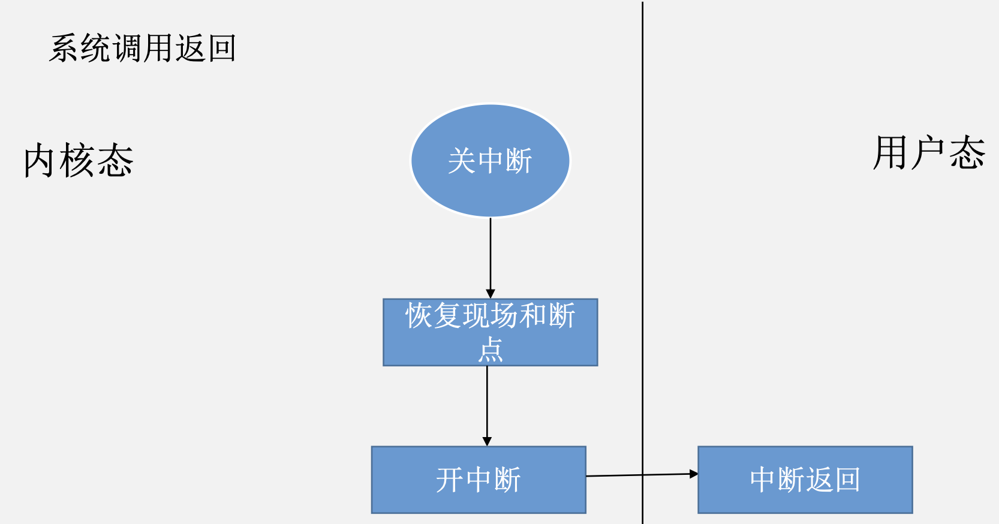
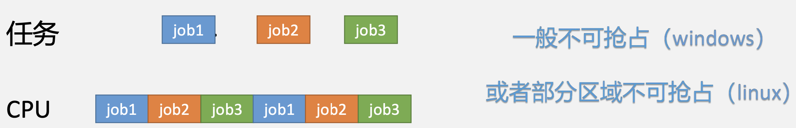
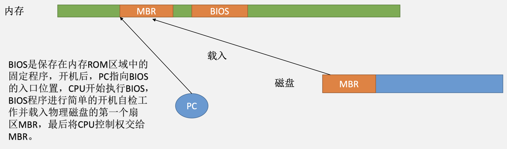
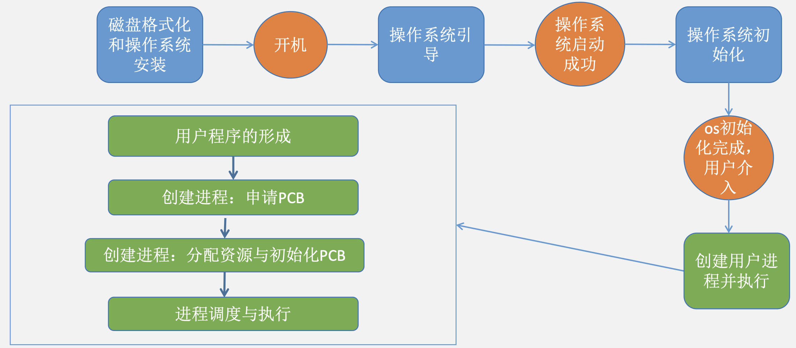
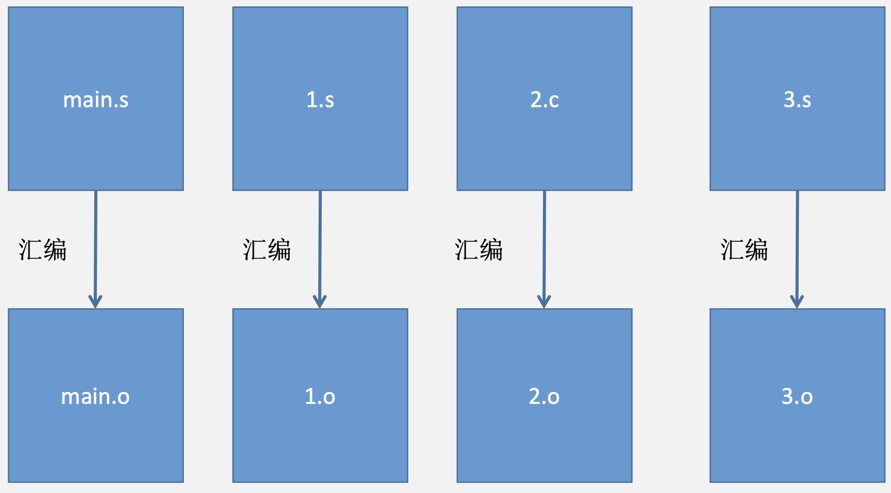

# 前言

## 程序、进程与线程

### 程序与任务

&emsp;&emsp;&ensp;计算机软件通过指令控制计算机的执行，指令执行需要哪些条件？
&emsp;&emsp;&ensp;内存和 ${CPU}$（${ALU}$、通用寄存器、专用寄存器等）。

<div style=" margin: 0 auto; max-width: 70%;">

</div>

&emsp;&emsp;&ensp;对于有些指令来说，可能会使用其它寻址方式。

<div style=" margin: 0 auto; max-width: 70%;">

</div>

&emsp;&emsp;&ensp;程序：存放在磁盘中的可执行文件，包含指令、数据和其他执行信息。

<div style=" margin: 0 auto; max-width: 50%;">

</div>

&emsp;&emsp;&ensp;程序代码：程序中包含的指令，执行程序即按一定顺序执行这些指令。
&emsp;&emsp;&ensp;程序数据：程序执行时需要使用的数据。
&emsp;&emsp;&ensp;程序头：程序执行相关的信息，如程序的入口地址。

&emsp;&emsp;&ensp;任务：程序执行需要加载到内存中并配备 ${CPU}$ 及其它所需资源，执行中的程序便成为了一个任务，操作系统对任务直接进行管理。

<div style=" margin: 0 auto; max-width: 70%;">

</div>

#### 多任务并发

&emsp;&emsp;&ensp;当计算机中需要执行多个任务时，我们可以采用一个接一个执行的方案，但是更多时候我们希望多个任务可以同时存在，并发执行。因此，就涉及到了内存的分配和 ${CPU}$ 的分配问题。

<div style=" margin: 0 auto; max-width: 40%;">

</div>

### 进程与线程

&emsp;&emsp;&ensp;将不同的任务完全从内存上分离开即为进程的设计方式，每个进程占据完全隔离开的独立内存空间，轮流使用 ${CPU}$ 资源。

<div style=" margin: 0 auto; max-width: 40%;">

</div>

&emsp;&emsp;&ensp;线程则是另一种设计，将进程内部的任务分配成多个任务分别交给不同的线程使用，线程共享进程的代码区和数据区，但是也会轮流使用 ${CPU}$ 资源并**占用独立的堆栈**。

<div style=" margin: 0 auto; max-width: 40%;">

</div>

### 调度与切换

&emsp;&emsp;&ensp;不同的进程（线程）轮流占用 ${CPU}$，所以需要确定当前应该由哪个进程（线程）占用 ${CPU}$，这便涉及到了调度算法。与此同时，**当前进程（线程）放弃 ${CPU}$ 后必须确保重新获取 ${CPU}$ 后能够继续执行，所以涉及到了进程（线程）切换的方法。**

### 进程间通信

&emsp;&emsp;&ensp;进程 ${1}$ 与进程 ${2}$ 可能存在信息交互，但是两个进程占用的内存地址被隔离开了，所以如何实现通信是值得讨论的问题。

### 同步与互斥

&emsp;&emsp;&ensp;多任务访问共享区域时，可能涉及互斥访问和同步访问的问题。
&emsp;&emsp;&ensp;互斥访问：两个线程不能同时访问共享区域，只有一个线程离开另一个线程才能进入。
&emsp;&emsp;&ensp;同步访问（互斥访问的特例）：线程 ${1}$ 和线程 ${2}$ 必须由 ${T1}$ 先访问，随后 ${T2}$ 才能访问。

<div style=" margin: 0 auto; max-width: 40%;">

</div>

### 死锁问题

&emsp;&emsp;&ensp;资源和进程（线程）的循环依赖可能造成死锁问题。

<div style=" margin: 0 auto; max-width: 30%;">

</div>

## 内存管理

### 内存分配

&emsp;&emsp;&ensp;当磁盘中的程序放入内存中执行时，需要为此创建进程并分配进程执行所需要的内存空间。因此，操作系统需要具备管理空闲内存、从空闲内存中分配内存、回收内存的能力。

<div style=" margin: 0 auto; max-width: 30%;">

</div>

### 虚拟地址与物理地址

&emsp;&emsp;&ensp;在计组中，指令通过直接寻址方式查找数据 ${a}$ 时，会在地址码字段中给出数据 ${a}$ 的物理地址，因此 ${addr(a)}$ 的值为 ${a}$ 的物理地址。但是对于存放在磁盘中的程序来说，如果我们采用这种方式，那将程序放入内存时，就只能将 ${a}$ 放入物理内存地址为 ${addr(a)}$ 的存储单元，这显然十分不方便。

<div style=" margin: 0 auto; max-width: 20%;">

</div>

&emsp;&emsp;&ensp;在虚拟地址存储中，指令中给出的 ${addr(a)}$ 为某一个虚拟地址，与此同时，计算机中维护一个从虚拟地址到物理地址到映射关系，当a被装入内存时，映射关系中会增加 ${addr(a)}$ 到对应内存的映射。此后执行指令 ${addi\quad addr(a),1}$ 时，对 ${addr(a)}$ 进行访问时，会先**通过映射关系将虚拟地址转化为物理地址，再从物理内存中获取数据 ${a}$**。
&emsp;&emsp;&ensp;操作系统维护这种**虚拟地址与物理地址的映射关系**，主要采用的方案为**段式管理、页式管理和段页式管理**。

<div style=" margin: 0 auto; max-width: 80%;">

</div>

### 虚拟存储器与页面置换
&emsp;&emsp;&ensp;当内存空间不足时，操作系统会把程序的一部分内容先放入内存使用，需要使用其它部分时则将暂时不用的部分置换出去。这部分对应“虚拟存储器”和“页面置换”算法相关的内容。

## 文件系统

### 目录系统

&emsp;&emsp;&ensp;现代操作系统中，程序和数据是以文件的方式存储在磁盘中的，而用户通常用文件路径的方式访问文件。如何通过路径找到文件呢？这是文件系统中的目录系统研究的内容。

### 逻辑文件与物理文件

&emsp;&emsp;&ensp;文件中的信息分布在磁盘中，找到文件后又如何访问到所需的文件信息呢？

### 文件操作

&emsp;&emsp;&ensp;作为用户可以对文件进行打开、关闭、访问等操作。

## I/O管理

### 设备的分配

&emsp;&emsp;&ensp;外部设备（如打印机）由各进程共同使用，所以操作系统需要具备维护和分配、回收设备的功能。

### 设备的抽象

&emsp;&emsp;&ensp;在计算机组成原理中我们知道对设备的访问需要依靠对I/O端口的访问，但是这种访问方式对上层系统和用户并不友好，因此我们增加了**设备驱动程序（接口）和设备独立性软件（逻辑物理设备名）**等层次来让上层可以使用更抽象与更便利的功能。 

<div style=" margin: 0 auto; max-width: 50%;">

</div>

## 特权级与中断机制

&emsp;&emsp;&ensp;上述对进程（线程）、内存、文件、设备等进行管理的软件即为操作系统，操作系统必须运行在更高的优先级防止被用户程序访问，同时又需要操作系统在必要的时机为用户程序和整个系统提供服务，这就依赖**中断机制**来实现。

<div style=" margin: 0 auto; max-width: 60%;">

</div>

&emsp;&emsp;&ensp;一个实例：用户点开桌面上的一个 ${exe}$ 程序并执行了程序功能时大致涉及哪些操作系统功能？

<div style=" margin: 0 auto; max-width: 80%;">

</div>

## 前置知识

### 指令系统的功能与边界

<div style=" margin: 0 auto; max-width: 70%;">

</div>

&emsp;&emsp;&ensp;操作系统是软件，因此是用指令系统来控制和管理资源的，所以操作系统的作用范围边界就是指令系统功能的边界。

<div style=" margin: 0 auto; max-width: 40%;">

</div>

&emsp;&emsp;&ensp;区分哪些功能是软件功能，哪些功能是硬件功能是学习操作系统的重中之重。在操作系统学习过程中，硬件机制可以看作是可以直接使用的黑盒子，而指令可以控制的部分才是操作系统需要关注的部分。

<div style=" margin: 0 auto; max-width: 80%;">

</div>

&emsp;&emsp;&ensp;**汇编程序员代表了指令系统，也就是操作系统的权限。**

### 程序的编译和链接

<div style=" margin: 0 auto; max-width: 50%;">

</div>

<div style=" margin: 0 auto; max-width: 50%;">

</div>

<div style=" margin: 0 auto; max-width: 50%;">

</div>

### 程序的装载与执行

&emsp;&emsp;&ensp;给程序分配内存空间以及寄存器等资源。

<div style=" margin: 0 auto; max-width: 70%;">

</div>

### 程序内存映像

<div style=" margin: 0 auto; max-width: 60%;">

</div>

<div style=" margin: 0 auto; max-width: 60%;">

</div>

### 计算机层次结构

<div style=" margin: 0 auto; max-width: 40%;">

</div>

### CPU的特权级

&emsp;&emsp;&ensp;**特权级是 ${CPU}$ 的硬件特征**，分为用户态和内核态。用户程序运行在用户态，操作系统运行在内核态。代码和数据也具备特权级，只有 ${CPU}$ 此时的特权级高于想要访问的代码或数据的特权级时才能访问。

### 用户空间和内核空间

#### 内核空间

&emsp;&emsp;&ensp;操作系统程序和数据占用的内存空间，只有内核态下才可以访问。

#### 用户空间

&emsp;&emsp;&ensp;用户代码所占用的内存空间，用户态下可访问。

#### 特权指令

##### 特权级切换方式

<div style=" margin: 0 auto; max-width: 50%;">

</div>

##### 用户栈和内核栈

<div style=" margin: 0 auto; max-width: 70%;">

</div>

### 中断、异常和系统调用

#### 外中断（中断）

&emsp;&emsp;&ensp;中断信号来自于 ${CPU}$ 之外，可能来自于外设请求或者人工干预。

<div style=" margin: 0 auto; max-width: 60%;">

</div>

#### 内中断（异常）
&emsp;&emsp;&ensp;中断信号来自于 ${CPU}$ 内部，跟 ${CPU}$ 内执行的指令有关。
&emsp;&emsp;&ensp;故障：可以被修复，如缺页异常。
&emsp;&emsp;&ensp;终止：出现了无法修复的问题，需要紧急处理。
&emsp;&emsp;&ensp;陷入：由访管指令引发。

#### 中断重要概念

&emsp;&emsp;&ensp;中断源：指中断或异常的来源，例如键盘输入、时钟信号、程序除 ${0}$ 错等。

<div style=" margin: 0 auto; max-width: 40%;">

</div>

&emsp;&emsp;&ensp;中断号：${CPU}$ 为中断源编号，根据不同的中断源，${CPU}$ 都会接收到一个对应的中断号。

<div style=" margin: 0 auto; max-width: 60%;">

</div>

&emsp;&emsp;&ensp;中断向量表：又称为中断描述符表，由特殊的寄存器记录其表首地址，存放内容为中断向量（或中断描述符）。

<div style=" margin: 0 auto; max-width: 80%;">

</div>

## 中断处理机制

### 硬件处理

1. 关中断；
2. 保存断点：把原先程序的 ${PC}$ 和 ${PSW}$ 保存下来，以便中断完成后可以返回原来执行的位置；
3. 根据中断源跳转到中断服务程序处（${x86}$）；
&emsp;&emsp;&ensp;注意：
   1. 如果是用户程序响应的中断或异常，会由硬件完成特权级切换和堆栈切换（在此之前 ${sp}$ 就被 ${tss}$ 保存了，也是硬件），这是第 ${0}$ 步。 
   2. 堆栈的切换的本质是将 ${sp}$ 中保存的值进行改变，${sp}$ 指示堆栈的地址范围。
   3. 如果是 ${mips}$ 则第三步是软件完成的，${mips}$ 很少采用向量中断的模式，虽然其有这一部分的功能。向量中断就是考研所涉及到的，主要是 ${x86}$ 指令集使用的中断方式，即中断隐指令；${mips}$ 主要采用软件识别异常，即查询 ${cause}$ 寄存器，且其中断处理程序入口送 ${pc}$、堆栈保存都是软件即指令完成的，并且 ${mips}$ 架构将所有中断流水线的事件都称为异常。（来自袁书，但是真题考察的是按照 ${x86}$ 处理）

<div style=" margin: 0 auto; max-width: 90%;">

</div>

### 软件处理

1. 保存现场和屏蔽字；
2. 开中断；
3. 执行中断服务程序；
4. 关中断；
5. 恢复现场和屏蔽字；
6. 开中断，中断返回（在 ${x86}$ 中，依赖 ${iret}$ 指令恢复断点）。
&emsp;&emsp;&ensp;**注意：如果中断结束后返回用户态，则由硬件完成特权级和堆栈的切换，这是第 ${10}$ 步。**

### 过程分析

<div style=" margin: 0 auto; max-width: 60%;">

</div>

&emsp;&emsp;&ensp;触发中断后，需要去对应的内核空间去执行中断服务程序，为了返回时能回到中断位置继续执行，所以需要保存断点，即把中断返回后应该赋给 ${PC}$ 的值和当前的 ${PSW}$ 保存到内核堆栈中。因此，除了特权级和堆栈切换外，前三步为：关中断，保存断点，跳转到中断服务程序。
&emsp;&emsp;&ensp;断点：中断返回时应当继续执行的指令地址 ${PC}$ 和程序中断时的状态 ${PSW}$。 
&emsp;&emsp;&ensp;保存断点：将断点存入内核堆栈，以便中断返回时继续执行。 

<div style=" margin: 0 auto; max-width: 60%;">

</div>

&emsp;&emsp;&ensp;运行中断服务程序也需要使用 ${CPU}$ 中的寄存器等，为了中断返回时能够恢复到中断前的状态，因此运行真正的服务程序前需要先**保存现场到内核堆栈中**。而所有的保存断点、现场等操作都需要**在关中断环境下来完成**，真正执行中断服务程序时则不必，因此这个阶段的几个步骤为：保存现场、开中断，执行中断服务程序。

<div style=" margin: 0 auto; max-width: 60%;">

</div>

&emsp;&emsp;&ensp;恢复现场同样需要在关中断环境下，返回中断时CPU会把内核栈顶的断点给 ${PC}$ 和 ${PSW}$。

#### 注意事项

   1. 中断响应**不一定都是在用户态下响应**，也可能是内核态下响应形成中断嵌套，所以响应中断和中断返回均不一定发生特权级切换。
   2. 堆栈的切换是与特权级切换同步的**硬件功能**（${x86}$ 架构下）。
   3. 关中断和开中断之间的操作必然是**保存或者恢复断点或环境**。
   4. 此模型为**中断嵌套模型**，若题干提及“单级中断”或“不允许嵌套”，则整个中断周期全过程均应处于**关中断**状态下。

### 中断过程的软硬件配合

&emsp;&emsp;&ensp;硬件功能：中断响应

<div style=" margin: 0 auto; max-width: 60%;">

</div>

&emsp;&emsp;&ensp;软件功能：中断服务

<div style=" margin: 0 auto; max-width: 60%;">

</div>

&emsp;&emsp;&ensp;补充：**中断向量表的内存区域**由一个叫做 ${IDTR}$ 寄存器来指向的，这个寄存器是**由程序员指定的**。

## 系统调用

### 功能

&emsp;&emsp;&ensp;应用程序通过系统调用请求操作系统的服务。系统中的各种共享资源都由操作系统统一掌管，因此在用户程序中，**凡是与资源有关的操作**（如存储分配、${I/O}$ 操作、文件管理等），都**必须通过系统调用**的方式向操作系统提出服务请求，由**操作系统代为完成**。

<div style=" margin: 0 auto; max-width: 40%;">

</div>

<div style=" margin: 0 auto; max-width: 60%;">

</div>

### 系统调用表

<div style=" margin: 0 auto; max-width: 60%;">

</div>

### 系统调用相关

#### 命令接口

<div style=" margin: 0 auto; max-width: 60%;">

</div>

<div style=" margin: 0 auto; max-width: 60%;">

</div>

#### 程序接口

&emsp;&emsp;&ensp;即系统调用，是操作系统暴露给用户程序使用的获取操作系统服务的接口。

#### 图形接口

&emsp;&emsp;&ensp;即图形界面，用户对图形进行的操作会被解析为系统调用，由操作系统提供服务。

### 系统调用利用的指令机制

#### 自陷指令（x86架构）

&emsp;&emsp;&ensp;自陷指令别名：自陷指令= ${trap}$ 指令=陷阱指令=陷入指令=访管指令
&emsp;&emsp;&ensp;自陷指令引发的异常又称为访管中断。
&emsp;&emsp;&ensp;自陷指令特点：
1. 自陷指令只能在**用户态**下使用。
2. 自陷指令触发异常时**保存的断点为下一条指令的地址**。

### 系统调用参数

&emsp;&emsp;&ensp;系统调用号：标识当前系统调用的类型。（注意与中断号区分）
&emsp;&emsp;&ensp;其他参数：系统调用需要用到的其他参数，例如想要读取的文件名。

### 系统调用的参数传递

<div style=" margin: 0 auto; max-width: 60%;">

</div>

<div style=" margin: 0 auto; max-width: 50%;">

</div>

<div style=" margin: 0 auto; max-width: 50%;">

</div>

<div style=" margin: 0 auto; max-width: 50%;">

</div>

<div style=" margin: 0 auto; max-width: 60%;">

</div>

<div style=" margin: 0 auto; max-width: 50%;">

</div>

<div style=" margin: 0 auto; max-width: 50%;">

</div>

### 系统调用的流程

&emsp;&emsp;&ensp;${传递系统调用参数\to 调用trap指令\to}$ ${内核运行系统调用服务程序\to 返回用户态并获取系统调用服务的结果}$

### 函数调用与系统调用的不同处

&emsp;&emsp;&ensp;系统调用：${INT}$ 和 ${IRET}$ 指令用于系统调用（系统调用时，有**堆栈切换和特权级的转换**）。
&emsp;&emsp;&ensp;函数调用：${CALL}$ 和 ${RET}$ 用于常规调用（常规调用时**没有堆栈切换**）。

### 系统调用全流程详细版

1. 在传参、陷入、执行系统调用处理程序时，进程处于运行态；
   1. 系统调用处理程序：陷入指令引发的中断的中断处理程序，会根据系统调用参数，引出对应系统调用处理程序。
   2. 执行系统调用处理程序时候，拿创建新进程或者进行 ${IO}$ 操作当例子。如创建资源不够或者正在 ${IO}$，那么此时操作系统会将进程调下 ${cpu}$ 进入阻塞态，然后等待事件完成后，这个进程被唤醒进入就绪队列，然后调度其上 ${cpu}$，完成系统调用。
2. 在处理一些事件时，需要等待，不能立即完成就返回，就会阻塞当前进程，进程处于阻塞态；
3. 然后进程等待事件完成，进入就绪态；
4. 调度上 ${cpu}$，最终完成系统调用。

&emsp;&emsp;&ensp;这一整个过程，都属于系统调用。

## 场景3（强化）

&emsp;&emsp;&ensp;假设在计算机系统中有 ${4}$ 种类型的可屏蔽中断 ${I1、I2、I3、I4}$，其中断响应的优先级为 ${I1>I2>I3>I4}$，其中断处理的优先级为 ${I2>I3>I1>I4}$，其中，${I4}$ 表示键盘设备中断。进程 ${P1}$ 的代码如下：

<div style=" margin: 0 auto; max-width: 40%;">

</div>

&emsp;&emsp;&ensp;尝试分析 ${scanf()}$ 执行过程中 ${P1}$ 进程的状态变化和底层执行过程。

<div style=" margin: 0 auto; max-width: 60%;">

</div>

### 用户库函数转化为系统调用

&emsp;&emsp;&ensp;从 ${scanf()}$ 到 ${sys\_ read()}$：${scanf()}$ 的语义为接收键盘输入直到出现“回车”，这里我们分析每一次接收键盘输入字符的情况，它需要借助接口 ${sys\_ read()}$ 来读取键盘输入的字符。

<div style=" margin: 0 auto; max-width: 60%;">

</div>

### 系统调用：参数传递

<div style=" margin: 0 auto; max-width: 60%;">

</div>

### 系统调用：主动陷入

&emsp;&emsp;&ensp;陷入内核

<div style=" margin: 0 auto; max-width: 30%;">

</div>

### 中断隐指令（硬件完成）

&emsp;&emsp;&ensp;用户态下响应中断才包含本步骤。

<div style=" margin: 0 auto; max-width: 50%;">

</div>

&emsp;&emsp;&ensp;保存断点

<div style=" margin: 0 auto; max-width: 50%;">

</div>

&emsp;&emsp;&ensp;跳转到中断服务程序

<div style=" margin: 0 auto; max-width: 45%;">

</div>

### 系统调用服务程序预处理

<div style=" margin: 0 auto; max-width: 40%;">

</div>

&emsp;&emsp;&ensp;中断服务程序：开中断
&emsp;&emsp;&ensp;开中断和关中断的时机？

<div style=" margin: 0 auto; max-width: 30%;">

</div>

&emsp;&emsp;&ensp;系统调用处理程序：区分系统调用类型

<div style=" margin: 0 auto; max-width: 50%;">

</div>

### 系统调用的参数获取与函数跳转

&emsp;&emsp;&ensp;系统调用处理程序：${sys\_ read()}$ 获取参数， 读取键盘数据写入对应内存地址。

<div style=" margin: 0 auto; max-width: 50%;">

</div>

### 自阻塞：等待键盘输入

&emsp;&emsp;&ensp;进程 ${P1}$ 试图获取键盘输入前，必须先等待键盘输入，因此在键盘设备产生输入前，进程 ${P1}$ 将被阻塞，直到被键盘输入事件唤醒。

<div style=" margin: 0 auto; max-width: 30%;">

</div>

&emsp;&emsp;&ensp;进程阻塞

<div style=" margin: 0 auto; max-width: 50%;">

</div>

<div style=" margin: 0 auto; max-width: 50%;">

</div>

### 获取键盘输入

<div style=" margin: 0 auto; max-width: 50%;">

</div>

&emsp;&emsp;&ensp;键盘设备与 ${I/O}$ 控制器

<div style=" margin: 0 auto; max-width: 35%;">

</div>

&emsp;&emsp;&ensp;按键后键盘设备的自处理

<div style=" margin: 0 auto; max-width: 50%;">

</div>

<div style=" margin: 0 auto; max-width: 50%;">

</div>

### 键盘设备中断处理程序

&emsp;&emsp;&ensp;键盘输入的中断处理函数：键盘数据首先应该送入哪里？

<div style=" margin: 0 auto; max-width: 40%;">

</div>

&emsp;&emsp;&ensp;不合理，因为键盘输入时当前进程不是 ${P1}$，数据想要进入 ${P1}$ 的用户空间必须先切换到 ${P1}$。

<div style=" margin: 0 auto; max-width: 50%;">

</div>

&emsp;&emsp;&ensp;由于各个进程都具有**内核区域的相同映射**，因此，可以利用内核内存空间作为中介来进行数据的传递，通常我们在内核中分配一个**多进程均可读写的内存区域作为内核缓冲区**。

<div style=" margin: 0 auto; max-width: 50%;">

</div>

&emsp;&emsp;&ensp;在中断处理之前数据在哪里？
&emsp;&emsp;&ensp;${I/O}$ 端口中的数据接口（数据寄存器）中。
&emsp;&emsp;&ensp;键盘输入的**中断处理函数：将数据读入缓冲区**

<div style=" margin: 0 auto; max-width: 40%;">

</div>

&emsp;&emsp;&ensp;设备驱动程序：访问 ${I/O}$ 端口的方式
&emsp;&emsp;&ensp;独立编址方式：通过 ${I/O}$ 端口号访问设备寄存器，特殊的 ${CPU}$ 指令：${out\quad 0x21,AL}$
&emsp;&emsp;&ensp;统一编址方式：设备的寄存器/存储被映射到内存物理地址空间中；通过内存 ${load/store}$ 指令完成 ${I/O}$ 操作；${MMU}$ 设置映射，硬件跳线或程序在启动时设置地址。

<div style=" margin: 0 auto; max-width: 40%;">

</div>

&emsp;&emsp;&ensp;如何读取？
&emsp;&emsp;&ensp;设备驱动程序将对 ${I/O}$ 端口的具体访问细节封装成供外部访问的 ${read()}$ 接口，键盘设备的中断处理程序**只需要调用 ${read()}$ 接口即可实现将键盘数据读入内核缓冲区**。这也是中断服务程序与设备驱动程序的联系。

<div style=" margin: 0 auto; max-width: 40%;">

</div>

### 键盘设备中断处理全流程

&emsp;&emsp;&ensp;进程接收键盘中断和处理中断流程展示：

<div style=" margin: 0 auto; max-width: 60%;">

</div>

### 唤醒P1并调度

&emsp;&emsp;&ensp;键盘设备的中断处理程序：唤醒等待键盘输入的进程 ${P1}$

<div style=" margin: 0 auto; max-width: 50%;">

</div>

### 获取键盘输入后的系统调用处理

&emsp;&emsp;&ensp;系统调用处理程序：数据传输

<div style=" margin: 0 auto; max-width: 50%;">

</div>

<div style=" margin: 0 auto; max-width: 40%;">

</div>

### 场景3问题

&emsp;&emsp;&ensp;请给出题设涉及到的中断类型的中断屏蔽字表。响应优先级：${I1>I2>I3>I4}$；处理优先级：${I2>I3>I1>I4}$

<div style=" margin: 0 auto; max-width: 40%;">

</div>

&emsp;&emsp;&ensp;${P1}$ 进程在执行语句 ${scanf()}$ 前后，请简述进程 ${P1}$ 的状态变化过程。

<div style=" margin: 0 auto; max-width: 40%;">

</div>

&emsp;&emsp;&ensp;${scanf()}$ 执行，键盘输入了 ${5}$ 并按下回车，键盘输入的数据被传递到了 ${IO}$ 端口，对于这个过程，回答以下问题：
1. 计算机系统通过什么方式得知键盘产生了输入的？
    中断
2. 键盘输入后，若无其它中断产生，计算机会进入哪几个处理阶段？
    中断隐指令、响应、处理
3. ${CPU}$ 是如何从键盘设备取出输入数据的？控制取数据的过程是由什么程序来完成的？这个程序是在中断过程的哪个阶段被调用的？
    当数据被输入到 ${IO}$ 端口后，${CPU}$ 通过 ${IO}$ 指令将其取到内核缓冲区；驱动程序；中断服务程序执行时，即中断处理阶段
4. 在这个过程中，硬件完成了哪些功能？
    中断隐指令
5. 响应键盘设备中断后，外设又产生了 ${I1}$ 中断，${CPU}$ 一定会立刻响应 ${I1}$ 中断吗？为什么？
    不一定，要考虑 ${I1}$ 中断的中断处理优先级

&emsp;&emsp;&ensp;从用户程序视角来看，${scanf()}$ 实际上就是把键盘存放的数据读入到变量 ${a}$ 中，对于这个过程，请回答以下问题：
1. 传送变量 ${a}$ 的地址发生在用户态还是内核态？
    用户态
2. 用户程序触发的是中断还是异常？是如何触发中断或异常的？
    异常；通过陷入指令
3. 系统捕捉用户申请系统调用的具体类型依靠的是硬件还是软件功能？
    软件
4. 系统是如何跳转到系统调用服务程序的执行位置的？
    通过中断隐指令
5. **简述在此例中系统调用执行过程是如何与键盘外设中断发生联动的**。
    用户执行 ${scanf()}$ 并传递相关参数后，触发 ${trap}$ 指令，通过查询中断向量表进入中断处理步骤，由中断服务程序保存断点、开中断并传递参数后，查找系统调用表找到对应的系统调用，让外设开始工作等待输入，进程被阻塞。当输入产生后，外设将数据传入数据寄存器并通过状态寄存器发出中断信号，中断信号被检测响应后，唤醒之前被阻塞的进程并调度上处理机，系统通过驱动程序提供的 ${read}$ 指令将数据从数据寄存器读入到内存缓冲区，再读入进程的用户空间中，再关中断保存断点并中断返回进程用户态。
    袁书版本：${I/O}$ 子系统工作的大致过程如下：首先，${CPU}$ 在用户态执行用户进程，当 ${CPU}$ 执行到系统调用的封装函数对应的指令序列中的**陷阱指令**时，会从**用户态陷入到内核态**；转到内核态执行后，${CPU}$ 根据陷阱指令执行时 ${EAX}$ 寄存器中的系统调用号，选择执行一个**相应的系统调用服务例程**；在系统调用服务例程的执行过程中可能需要调用具体设备的驱动程序；在设备驱动程序执行过程中启动外设工作，外设准备好后**发出中断请求**，${CPU}$ 响应中断后，就调出中断服务程序执行，在中断服务程序中控制主机与设备进行具体的数据交换。

<div style=" margin: 0 auto; max-width: 80%;">

</div>

### 场景3：真题解析

<div style=" margin: 0 auto; max-width: 50%;">

</div>

&emsp;&emsp;&ensp;存储型设备与输入型设备的访问流程有什么区别？

<div style=" margin: 0 auto; max-width: 50%;">

</div>

<div style=" margin: 0 auto; max-width: 50%;">

</div>

## 虚拟机

### 第一类虚拟机（内核态）

<div style=" margin: 0 auto; max-width: 50%;">

</div>

### 第二类虚拟机（用户态）

<div style=" margin: 0 auto; max-width: 50%;">

</div>

&emsp;&emsp;&ensp;观察架构图，若虚拟机软件依托于硬件上服务于操作系统，虚拟机软件虚拟的就是硬件；若虚拟机软件服务于应用程序（比如将第二类虚拟机架构图中的虚拟机软件上面的“${windows2010}$”“${windows7}$”删去后的效果），此时**虚拟软件虚拟的就是操作系统**。

## 操作系统的演变

### 手工操作系统

<div style=" margin: 0 auto; max-width: 60%;">

</div>

### 批处理系统（无交互能力）

#### 单道批处理系统

##### 顺序执行与批处理

<div style=" margin: 0 auto; max-width: 50%;">

</div>

<div style=" margin: 0 auto; max-width: 60%;">

</div>

#### 多道程序系统

1. 保持多个工作在内存中并且在各工作间复用 ${CPU}$。
2. **引入了中断机制。**

<div style=" margin: 0 auto; max-width: 60%;">

</div>

<div style=" margin: 0 auto; max-width: 50%;">

</div>

<div style=" margin: 0 auto; max-width: 50%;">

</div>

<div style=" margin: 0 auto; max-width: 50%;">

</div>

### 实时操作系统

<div style=" margin: 0 auto; max-width: 60%;">

</div>

### 分时操作系统

<div style=" margin: 0 auto; max-width: 60%;">

</div>

&emsp;&emsp;&ensp;定时中断用于工作对 ${CPU}$ 的复用。

<div style=" margin: 0 auto; max-width: 60%;">

</div>

### 个人计算机

&emsp;&emsp;&ensp;每个用户一个系统。

### 分布式计算机

&emsp;&emsp;&ensp;每个用户多个系统。

<div style=" margin: 0 auto; max-width: 50%;">

</div>

## 操作系统引导

&emsp;&emsp;&ensp;开机后完成的步骤。

<div style=" margin: 0 auto; max-width: 40%;">

</div>

### 执行BIOS

&emsp;&emsp;&ensp;开机时执行的第一个程序是BIOS，由于开机只能执行内存中的指令，所以BIOS保存在内存中。

<div style=" margin: 0 auto; max-width: 70%;">

</div>

<div style=" margin: 0 auto; max-width: 70%;">

</div>

<div style=" margin: 0 auto; max-width: 70%;">

</div>

### 磁盘分区表

&emsp;&emsp;&ensp;系统盘：**装入操作系统的就是系统盘**。

<div style=" margin: 0 auto; max-width: 50%;">

</div>

<div style=" margin: 0 auto; max-width: 70%;">

</div>

<div style=" margin: 0 auto; max-width: 70%;">

</div>

<div style=" margin: 0 auto; max-width: 70%;">

</div>

## 场景1（强化）

&emsp;&emsp;&ensp;该场景描述了应用程序执行前的所有准备工作，按时间顺序来看依次产生了如下操作：

<div style=" margin: 0 auto; max-width: 60%;">

</div>

### 场景1.1（磁盘格式化和操作系统安装）

<div style=" margin: 0 auto; max-width: 60%;">

</div>

#### 物理格式化

<div style=" margin: 0 auto; max-width: 40%;">

</div>

&emsp;&emsp;&ensp;**低级格式化（物理格式化）**：就是将空白的磁盘划分出盘面和磁道，再将磁道划分为若干个扇区，每个扇区又划分出标识部分 ${ID}$、间隔区 ${GAP}$ 和数据区 ${DATA}$ 等。只有物理格式化后，程序才能使用盘面号、磁道号、扇区号。


#### 磁盘分区

<div style=" margin: 0 auto; max-width: 60%;">

</div>

&emsp;&emsp;&ensp;磁盘分区是指将磁盘的整体存储空间划分成多个独立的区域，分别用来**安装操作系统、安装应用程序以及存储数据文件等**；硬盘分区是在一块物理硬盘上创建多个独立的逻辑单元，这些逻辑单元就是 ${C}$ 盘、${D}$ 盘、${E}$ 盘等，在**磁盘分区的过程中会产生 ${MBR}$ 并创建磁盘分区表来标识各分区信息**。

#### 逻辑格式化

&emsp;&emsp;&ensp;逻辑格式化的对象是磁盘分区，通过逻辑格式化，**分区被填入了分区引导块 ${PBR}$ 和文件系统相关信息**。主要是安装文件系统，其中创建根目录、文件系统信息的产生、${PBR}$（也叫引导块）的装入都是逻辑格式化做的。

<div style=" margin: 0 auto; max-width: 60%;">

</div>

&emsp;&emsp;&ensp;${MBR}$ 中包含着磁盘分区表，记录了不同磁盘分区的信息，依靠磁盘分区表和内部的引导程序，**${MBR}$ 可以选择任意一个磁盘分区中的 ${PBR}$ 来加载和执行**。

#### 操作系统的安装

<div style=" margin: 0 auto; max-width: 60%;">

</div>

&emsp;&emsp;&ensp;操作系统作为由指令和数据形成的集合被安装到某个磁盘分区中，**被安装了操作系统的分区将在 ${MBR}$ 内的磁盘分区表中被标记为系统盘**。通过加载和执行 ${PBR}$，该分区中存放的操作系统将**被加载到内存中并获取 ${CPU}$ 控制权**。被装入操作系统的磁盘分区被称为**系统盘**。

#### 场景1.1问题

1. 物理磁盘的存储区域被划分为盘面、磁道、扇区是哪个过程实现的？该过程的提供者是？
    物理格式化；厂商
2. 将磁盘物理空间划分为不同的逻辑磁盘的步骤是？
    磁盘分区
3. 根据文件系统为各个逻辑磁盘装入文件系统相关信息的过程被称为？
    逻辑格式化

### 场景1.2（操作系统引导）

<div style=" margin: 0 auto; max-width: 60%;">

</div>

#### 执行BIOS并加载MBR

<div style=" margin: 0 auto; max-width: 60%;">

</div>

<div style=" margin: 0 auto; max-width: 60%;">

</div>

&emsp;&emsp;&ensp;${BIOS}$ 是**保存在内存 ${ROM}$ 区域中的固定程序**。开机后，${PC}$ 指向 ${BIOS}$ 的入口位置，${CPU}$ 开始执行 ${BIOS}$。${BIOS}$ 程序进行简单的**开机自检工作并载入物理磁盘的第一个扇区 ${MBR}$**，最后将 ${CPU}$ 控制权交给 ${MBR}$。

#### 执行MBR并加载PBR

<div style=" margin: 0 auto; max-width: 60%;">

</div>

&emsp;&emsp;&ensp;${MBR}$ 中包含磁盘分区表，${MBR}$ 依据磁盘分区表**选择合适的系统盘的 ${PBR}$**，将其载入内存并**将 ${CPU}$ 控制权交给 ${PBR}$**。

##### 磁盘分区表（硬盘分区表）

<div style=" margin: 0 auto; max-width: 50%;">

</div>

<div style=" margin: 0 auto; max-width: 60%;">

</div>

#### 执行PBR并加载OS

<div style=" margin: 0 auto; max-width: 60%;">

</div>

&emsp;&emsp;&ensp;${PBR}$ 程序将操作系统装入内存（此时各种中断服务程序已经在内存中排布了），并将 ${CPU}$ 控制权转交给操作系统。此后，操作系统正式在计算机中发挥作用。

<div style=" margin: 0 auto; max-width: 60%;">

</div>

#### 场景1.2问题

1. 为何 ${MBR}$ 可以根据操作系统类型加载对应的逻辑磁盘分区？
    因为 ${MBR}$ 中包含磁盘分区表，知道哪些操作系统对应哪些磁盘分区，磁盘分区表对应磁盘分区信息，因此可以对其进行加载
2. ${BIOS}$ 被存放在内存还是外存中？存储介质是 ${ROM}$ 还是 ${RAM}$？为什么？
    在内存中；${ROM}$；因为PC指向的第一个程序就是 ${BIOS}$ 的地址，如果 ${BIOS}$ 放在外存，则不可以开机就立刻执行，需要用别的程序将其加载到内存；${BIOS}$ 是一开机就执行，也就是在断电状态下也不会丢失信息，所以存在 ${ROM}$ 中。

### 场景1.3（操作系统初始化）

<div style=" margin: 0 auto; max-width: 60%;">

</div>

#### 定义

&emsp;&emsp;&ensp;操作系统的各子模块想要正常工作，都需要进行初始化的工作。例如对一些全局变量进行初始化赋值、为系统资源分配内存等。其中 ${superblock}$ 的信息写入就是在操作系统初始化下进行的（单文件系统），多文件系统是在文件系统挂载时候进行的。

#### 中断异常初始化

&emsp;&emsp;&ensp;**构建中断向量表**：操作系统程序中包含了大量对于特定中断（异常）的中断（异常）服务例程。它们被加载到了内存中的不同位置。为了这些中断服务历程能够正常发挥作用，**操作系统需要在初始化过程中就填写好中断向量表**。在操作系统被装入内存时中断服务成已经存在于内存中，**中断异常初始化是使其在中断向量表中一一对应的过程**。

<div style=" margin: 0 auto; max-width: 50%;">

</div>

&emsp;&emsp;&ensp;初始化时钟：时钟中断是操作系统中的重要中断，为了时钟中断的正常触发，需要在**操作系统初始化的过程中设置好时钟中断触发时间间隔等信息**。

#### 内存管理初始化

<div style=" margin: 0 auto; max-width: 50%;">

</div>

&emsp;&emsp;&ensp;**内存分配机制**：操作系统的正常执行需要能够动态分配内存，而这些动态分配的内存**通常都是通过某种策略从给定的内存池中获取的**。所以，在操作系统初始化的过程中，需要**为内存的动态分配器分配内存池**，才能支持操作系统的进一步操作。
&emsp;&emsp;&ensp;同时，操作系统在不同的硬件环境中分配器的全局配置（如**最大可分配页框号**）也不相同，因此**需要依据探测到的内存信息做初始化配置**。

<div style=" margin: 0 auto; max-width: 40%;">

</div>

&emsp;&emsp;&ensp;**页表初始化**：内核程序写入内存后，在地址映射机制生效之前，必须**先将内核空间进行特定的映射**。这样才能在地址映射机制生效后正常映射内核程序。

#### 进程管理初始化

&emsp;&emsp;&ensp;进程管理初始化（创建 ${0}$ 号内核进程）：${0}$ 号内核进程是**操作系统创建的第一个进程**，也是唯一一个不是由其他进程所创建的进程。

&emsp;&emsp;&ensp;进程管理初始化：创建 ${idle\_ proc}$ 和其它初始化用户进程。

&emsp;&emsp;&ensp;调度器初始化：调度器想要正常工作，**必须为调度器中的数据结构（如就绪队列等）分配内存空间，同时与调度器相关的全局变量**等也需要依据实际情况进行配置。

#### 文件系统初始化

&emsp;&emsp;&ensp;**虚拟文件系统初始化**：通过**逻辑格式化**，不同的磁盘分区中**装入了不同的文件系统**。操作系统启动的分区中存在的文件系统作为**根文件系统**，需要在 ${VFS}$ 中进行一些初始化工作，如创建 ${VFS}$ 的根结点。

&emsp;&emsp;&ensp;文件系统初始化（注意）：文件系统在**磁盘上的初试信息构建**（如文件系统布局信息、根目录等）均为**逻辑格式化的工作**，不是操作系统初始化的工作。

#### I/O管理初始化

<div style=" margin: 0 auto; max-width: 50%;">

</div>

#### 场景1.3问题

1. 图形界面相关的程序运行在用户态还是内核态？
    内核态
2. 用户点开图形文件本质上还是与文件系统发生了交互从而访问了目录系统中的某个文件，请问目录系统中的根目录是何时被写入磁盘的？
    逻辑格式化
3. 用户双击鼠标后，操作系统会对这次鼠标操作行为进行处理，并最终与文件系统产生了某种交互。请问操作系统对鼠标行为进行反馈利用了何种机制？计算机为何可以对鼠标点击行为作出对应的反馈？这种建立鼠标操作与系统反馈联系的步骤发生在正文提及的哪个过程中？
    中断机制；通过触发中断后，在对应的中断向量表中找到相应的中断处理函数；中断和异常初始化（操作系统初始化）

### 场景1.4（创建用户进程并执行）

<div style=" margin: 0 auto; max-width: 60%;">

</div>

#### 用户程序的形成

<div style=" margin: 0 auto; max-width: 45%;">

</div>

<div style=" margin: 0 auto; max-width: 45%;">

</div>

<div style=" margin: 0 auto; max-width: 45%;">

</div>

&emsp;&emsp;&ensp;用户通过终端、图形界面或其它方式试图打开和执行程序后，若该操作成功，**操作系统便会依据该程序创建一个进程**。

```cpp
parent process(){
    创建进程(path:"xxx/myproject.out", ...);
}
```

<div style=" margin: 0 auto; max-width: 60%;">

</div>

#### 申请pid和空白PCB

&emsp;&emsp;&ensp;系统中允许同时存在的**进程数量一般是有限的**，因此，创建进程之前一般会先试图申请一个没被占用的 ${pid}$ 和 ${PCB}$。若该操作失败，则说明系统中不适合产生新的进程，创建进程的操作失败。若该操作成功，则**新进程的 ${PCB}$ 出现在了系统的 ${PCB}$ 队列中，该进程进入创建态**。

#### 申请其他资源与初始化PCB

<div style=" margin: 0 auto; max-width: 70%;">

</div>

&emsp;&emsp;&ensp;进程运行需要分配多种资源，以内存资源为例，进程只有获取了初试运行所需的内存空间，才可以满足最初的执行条件。若初试运行的资源无法得到满足，则**创建该进程的父进程进入阻塞态**，等待其他进程释放足够的资源后再继续创建该进程，而**该进程本身则保持在创建态直到创建工作完成**。
&emsp;&emsp;&ensp;与此同时，依据操作系统给进程所分配的资源，**进程 ${PCB}$ 也会进行一定的初始化工作**。

<div style=" margin: 0 auto; max-width: 60%;">

</div>

#### 进程的调度与执行

<div style=" margin: 0 auto; max-width: 35%;">

</div>

#### 场景1.4问题

1. 操作系统完成加载和初始化后，应用程序将在操作系统的支持下工作，应用程序的本质为可执行的二进制文件，形成可执行文件经过了**预处理、编译、汇编、链接**四个过程，而可执行程序只有**在加载后才能够运行**，关于这个过程，请回答以下几个问题：
   1. 程序在加载到内存时，会被分为代码段、数据段、.bss段、堆栈区，这些区域哪些是程序加载前就在逻辑上存在的，哪些是在加载后重新分配的？
    代码段、数据段加载前就在逻辑上存在；.bss段、堆栈区加载后重新分配的。
   2. 静态链接下，程序的虚拟地址空间是何时形成的？
    链接时候
   3. 在静态重定位和动态重定位下，数据的物理地址分别是在什么时候形成的？
    装入；执行

2. 在现代操作系统中，程序的执行与进程有什么关系？
    进程就是程序的执行
3. 在上述表述中，我们有时候会说是 ${BIOS}$ 程序加载了 ${MBR}$，有时候会描述为 ${CPU}$ 加载了 ${MBR}$，这两种表述有什么联系？在后续操作系统学习中你还可以举出类似的例子吗？
    通过 ${CPU}$ 执行 ${BIOS}$ 程序加载了 ${MBR}$；

## 操作系统类型

### 操作系统的层次结构

&emsp;&emsp;&ensp;非核心内核功能：比如图形界面 ${GUI}$。

<div style=" margin: 0 auto; max-width: 50%;">

</div>

&emsp;&emsp;&ensp;分层结构：对于每个分层来说，只能调用下一层提供的接口，不能反向调用。
&emsp;&emsp;&ensp;优点：

1. 便于调试和验证。
2. 扩展性强，易维护。

&emsp;&emsp;&ensp;缺点：逐层传递信息的性能较低。

### 操作系统模块化设计

&emsp;&emsp;&ensp;模块化设计指的是将内核划分为不同的功能模块，各模块间通过设置和调用约定好的接口进行通信，各模块也可以继续划分为更细致化的子模块。

<div style=" margin: 0 auto; max-width: 50%;">

</div>

<div style=" margin: 0 auto; max-width: 50%;">

</div>

### 宏内核与微内核

#### 宏内核

&emsp;&emsp;&ensp;各内核模块都运行在内核态下且处于同一地址空间下，相互之间采用函数调用的方式即可。

<div style=" margin: 0 auto; max-width: 50%;">

</div>

#### 微内核

&emsp;&emsp;&ensp;只有必须在内核态下才能完成的功能才运行在内核态，其他功能则运行在用户态，每一个运行在用户态的操作系统功能模块均以独立进程的方式运行。

<div style=" margin: 0 auto; max-width: 50%;">

</div>

&emsp;&emsp;&ensp;进程切换和进程调度的辨析：进程调度是一种策略性的功能，在就绪队列中选择进程，**无需内核态**；进程切换需要访问地址相关寄存器，**只能在内核态**。或者换种说法，可以将用户态中的功能解释为策略，策略是使用高级语言即可完成的，是进行选中的一个功能；而内核态的功能则可称之为实现，拿内存管理举例子，策略选中某一个磁盘块后，对该内存块进行各种操作（比如写操作）时候，**实现，就是必须要内核态才能完成的功能**。

&emsp;&emsp;&ensp;微内核和宏内核的优缺点：
&emsp;&emsp;&ensp;微内核缺点：

1. 各个功能模块运行在不同的地址空间，所以调用不同模块需要进行频繁的地址空间切换，且模块通信不能再用过程调用而必须依靠进程间通信；
2. 同一功能模块分别在用户态（策略）和内核态（实现），使特权级切换更频繁；
3. 基于以上两个原因，微内核的性能较宏内核更低。

&emsp;&emsp;&ensp;微内核优点：不同功能模块分别属于不同的用户进程，即使崩溃也不会影响到整个内核，因此安全性和稳定性更高，适用于对安全性有较高要求的场景。

### 外核

&emsp;&emsp;&ensp;外核会给每一个进程分配一定的硬件资源，各进程可以直接使用未经抽象的硬件资源，进程与内核共同运行在内核态。用户程序可以看作是内核的一种延伸，所以称之为外核。这是一种类似于虚拟机的分配方式，每个用户程序使用函数调用访问资源，当完成分配的任务后，该用户程序与其内核、虚拟机会被一起宕掉，安全性很高。

<div style=" margin: 0 auto; max-width: 50%;">

</div>
