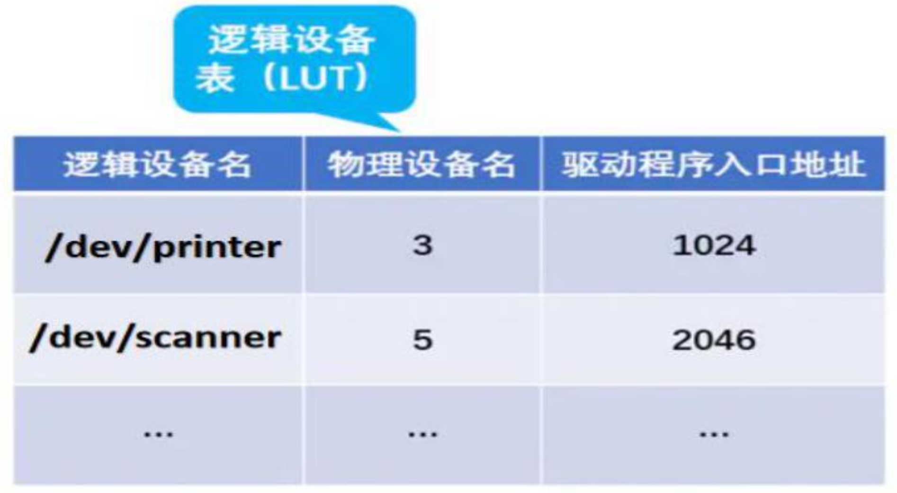
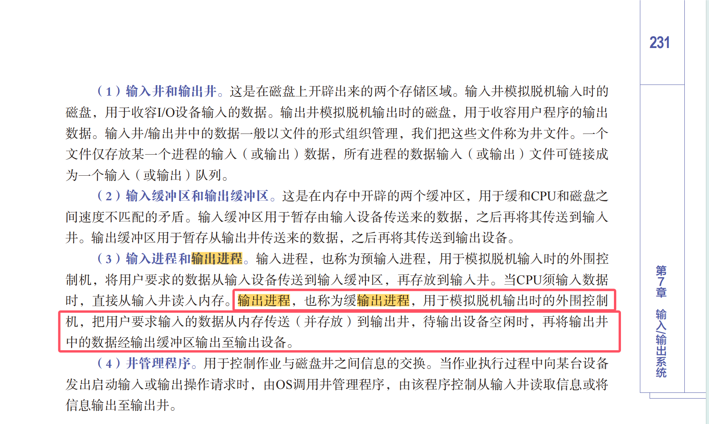
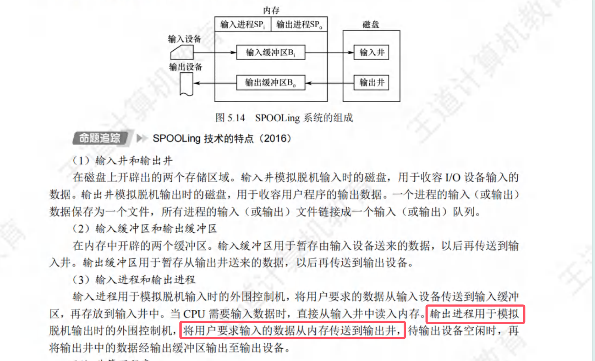
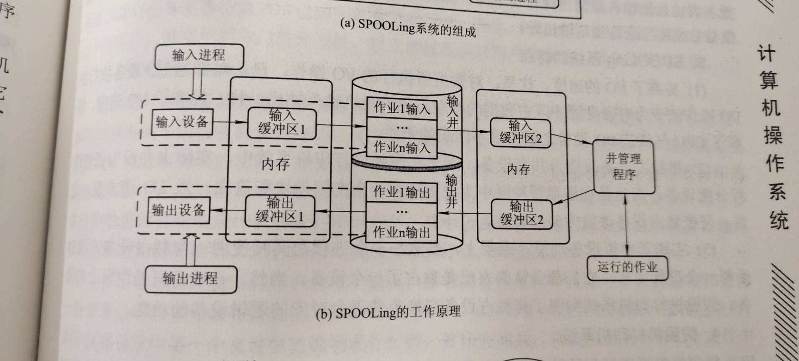

# I/O管理

## 设备的分类

&emsp;&emsp;&ensp;按使用特性分类：人机交互类；存储设备；网络设备
&emsp;&emsp;&ensp;按传输速度分类：低速设备：鼠标、键盘等；中速设备；高速设备：磁盘机、磁带机等
&emsp;&emsp;&ensp;按信息交换单位分类：块设备：磁盘；字符设备：打印机

## I/O接口与I/O端口

&emsp;&emsp;&ensp;${I/O}$ 接口与 ${I/O}$ 端口组成：设备控制器与 ${CPU}$ 的接口；设备控制器与设备的接口；${I/O}$ 逻辑
&emsp;&emsp;&ensp;功能：接收和标识 ${CPU}$ 命令；数据交换；标识和报告设备状态；地址识别；数据缓冲与差错控制
&emsp;&emsp;&ensp;${I/O}$ 端口：即 ${I/O}$ 接口中**可以访问的寄存器**

## I/O子系统层次结构

&emsp;&emsp;&ensp;用户层：用户层I/O软件是应用程序可以使用的接口，用户调用封装在用户层的与I/O相关的库函数进行I/O操作，这些操作通常需要发出相应的系统调用来获取I/O服务。与此同时，因为虚拟内存机制的存在，用户程序可以通过访问实际存放在外设中的数据来发起I/O操作，也就是访存指令可能会引起I/O操作。

&emsp;&emsp;&ensp;设备独立性软件：设备独立性程序位于用户I/O软件与设备驱动程序之间，用于实现用户程序与设备驱动器的统一接口，使用设备的保护、分配与释放，以及为设备数据传输提供缓冲区等。设备独立性又称设备无关性，指应用程序可以使用逻辑设备名而不是物理设备名便可以使用设备。

&emsp;&emsp;&ensp;设备驱动程序层：设备驱动程序通常由设备的生产厂商提供，为内核提供统一的标准接口的同时隐藏了设备操作的细节。

&emsp;&emsp;&ensp;设备驱动程序做了哪些工作？

&emsp;&emsp;&ensp;使用磁盘例子理解设备驱动程序
&emsp;&emsp;&ensp;文件系统在进行文件 ${read()}$ 操作时，可能要读取磁盘上特定磁盘块的内容到内存上，而对不同种类的磁盘而言，${CPU}$ 需要给出的命令字和地址形式差异非常大。然而，上层文件系统实际上只需要一个统一的可以读取特定磁盘块的接口 ${read\_ block(block\_ num)}$，而并不关心具体的实现细节。因此，不同的设备驱动程序都将各自的操作特性隐藏起来，**只提供给上层统一的规范接口**，当不同的磁盘设备的驱动程序被装入系统后，上层文件系统便可以**通过统一的接口来读取任意一款键盘设备特定数据块的磁盘数据**。

&emsp;&emsp;&ensp;设备驱动程序接口规范：操作系统设计者会给每一类设备一个需要提供的接口规范，由设备提供者根据规范设计驱动程序，为操作系统提供接口。**只有设备驱动程序与操作系统需求的接口规范一致，设备才能被操作系统使用**。设备驱动程序被装入内核后，驱动程序对规范接口的实现也被链接到了内核上。当操作系统需要对应功能时，只需要跳转到对应的位置执行驱动程序对接口的实现即可。

&emsp;&emsp;&ensp;中断处理程序：例如，当磁盘完成输入后，中断处理程序会进行如下操作。

### 磁盘缓冲

&emsp;&emsp;&ensp;缓冲区的作用：缓和 ${CPU}$ 与 ${I/O}$ 设备间速度不匹配的矛盾；减少对 ${CPU}$ 的中断频率，放宽对 ${CPU}$ 中断响应时间的限制；解决基本数据单元大小（即数据粒度）不匹配的问题；提高 ${CPU}$ 和 ${I/O}$ 设备间的并行性。
&emsp;&emsp;&ensp;传输和处理两个数据的时间？
计算缓冲时间的注意事项：同一个部件的使用必须是互斥的（传入、传出、数据处理）。
&emsp;&emsp;&ensp;单缓冲：${T+M+max(T, C)+M+C}$

&emsp;&emsp;&ensp;双缓冲：${T+max(T, M+C)+M+C}$

&emsp;&emsp;&ensp;如果是传输和处理 ${n}$ 个数据的时间呢？

&emsp;&emsp;&ensp;循环缓冲区：缓冲区构成一个循环，${in}$ 指向输入位置，${out}$ 指向输出位置，类似于管道和循环队列。

&emsp;&emsp;&ensp;缓冲池

## 按物理设备分配设备

### 设备固有属性

&emsp;&emsp;&ensp;独占设备：一个时段只能分配给一个进程。（如打印机）
&emsp;&emsp;&ensp;共享设备：可同时分配给多个进程使用（如磁盘），各进程往往是宏观上同时共享使用设备，而微观上交替使用。
&emsp;&emsp;&ensp;虚拟设备：采用 ${SPOOLing}$ 技术将独占设备改造成虚拟的共享设备，可同时分配给多个进程使用。（如采用 ${SPOOLing}$ 技术实现的共享打印机）

### 设备安全分配方式

&emsp;&emsp;&ensp;为进程分配一个设备后就将进程阻塞，本次 ${I/O}$ 完成后才将进程唤醒。（${eg}$：考虑进程请求打印机打印输出的例子）
&emsp;&emsp;&ensp;优点：**破坏了“请求和保持”条件，不会死锁**。
&emsp;&emsp;&ensp;缺点：对于一个进程来说，${CPU}$ 和 ${I/O}$ 设备只能串行工作。

### 设备不安全分配方式

&emsp;&emsp;&ensp;进程发出 ${I/O}$ 请求后，系统为其分配 ${I/O}$ 设备，进程可继续执行，**之后还可以发出新的 ${I/O}$ 请求**。只有某个 ${I/O}$ 请求得不到满足时才将进程阻塞。
&emsp;&emsp;&ensp;优点：进程的**计算任务和 ${I/O}$ 任务可以并行处理**，使进程迅速推进。
&emsp;&emsp;&ensp;缺点：有可能发生死锁。（死锁避免、死锁的检测和解除）

### 静态分配与动态分配

&emsp;&emsp;&ensp;静态分配：进程运行前**为其分配全部所需资源**，运行结束后**归还资源**。破坏了“请求和保持”条件，不会产生死锁。
&emsp;&emsp;&ensp;动态分配：**进程运行过程中动态申请设备资源**。

### 设备分配所需资源

### 设备控制表

### 控制器控制表

### 通道控制表

### 分配物理设备的步骤

### 按物理设备分配的缺陷

&emsp;&emsp;&ensp;用户编程时必须使用“物理设备名”，底层细节对用户不透明，不方便编程。
&emsp;&emsp;&ensp;如果换了一个物理设备，即使是同类型的设备（如都是打印机，但是打印品牌不同），则程序将无法运行。
&emsp;&emsp;&ensp;如果进程请求的物理设备正在忙碌，即使系统中还有同类型的设备，进程也必须阻塞等待。

## 按设备类型实现设备的分配

### 按逻辑设备名分配设备

### 逻辑设备表（LUT）

### 设备独立性软件

## I/O控制方式

### 轮询方式

&emsp;&emsp;&ensp;计算机从外部设备读取数据到存储器，每次读一个字的数据。对读入的每个字，${CPU}$ 需要对外设状态进行循环检查，直到确定该字已经在 ${I/O}$ 控制器的数据寄存器中。
&emsp;&emsp;&ensp;特点：${CPU}$ 与 ${I/O}$ 设备串行操作，效率低下。

### 中断方式

&emsp;&emsp;&ensp;设备独立完成对自身设备寄存器的读写操作，完成该操作后，**向 ${CPU}$ 发出中断信号**，由 ${CPU}$ 来完成**设备寄存器与内存的数据交换**。
&emsp;&emsp;&ensp;特点：有中断机制参与，设备寄存器与内存的数据交换借助 ${CPU}$ 的寄存器，**依然需要 ${CPU}$ 参与具体的传输过程**。

### DMA方式

&emsp;&emsp;&ensp;${DMA}$ 方式以数据块为基本单位进行块设备与内存之间的数据传输，由 ${CPU}$ 发出传输命令后，传输任务便由 ${DMA}$ 控制器来控制完成，不需要 ${CPU}$ 的参与。直到传输任务完成，才会向 ${CPU}$ 发出中断来通知块传输工作的完成。

#### DMA方式全过程

&emsp;&emsp;&ensp;初始化DMA参数

&emsp;&emsp;&ensp;数据传输

1.	${DMA}$ 控制器向**磁盘控制器**发出读命令，读取内容为磁盘中的字 ${1}$。
2.	磁盘 ${I/O}$ 完成，字 ${1}$ 进入控制器中的磁盘缓冲。磁盘控制器向 ${DMA}$ 控制器发出 **${DMA}$ 请求**，${DMA}$ 控制器向 ${CPU}$ 发出**总线请求**（该操作被合并称之为 **${DMA}$ 请求**）。
3.	${DMA}$ **获取总线**后，将字 ${1}$ 从磁盘控制器中读入 ${DMA}$ 缓冲中，再**通过总线将其读入内存区域中**。
4.	${DMA}$ 释放总线，${DMA}$ 控制器继续向磁盘控制器发出读字 ${2}$ 的命令，重复上述过程，直到将 ${5}$ 个字都读出。

### 进程阻塞、唤醒时机

## 输入输出应用程序接口

&emsp;&emsp;&ensp;接口：计算机不同功能层之间的**通信规则**被称为接口。
&emsp;&emsp;&ensp;系统调用：操作系统提供给用户程序的接口。
&emsp;&emsp;&ensp;指令系统：**硬件层提供给软件层的接口**。
&emsp;&emsp;&ensp;字符设备用户接口：${I/O}$ 控制方式为**中断驱动方式**

&emsp;&emsp;&ensp;块设备用户接口：${I/O}$ 控制方式通常为 **${DMA}$ 方式**

&emsp;&emsp;&ensp;网络设备用户接口：通常为套接字方式

### 不同的I/O方式

&emsp;&emsp;&ensp;阻塞 ${I/O}$：读数据（${read}$）时，进程**将进入阻塞状态**，直到完成数据读出。写数据（${write}$）时，进程将进入阻塞状态，直到设备完成数据写入处理。

&emsp;&emsp;&ensp;非阻塞 ${I/O}$：读写数据时，${CPU}$ **一直轮询设备**。若还未完成 ${I/O}$，则返回一个 ${erro}$。若完成了 ${I/O}$，则返回完成操作。在整个过程中，**进程一直占用 ${CPU}$**。

### 不同类型设备的访问流程

&emsp;&emsp;&ensp;与设备访问相关的程序包括**用户程序、用户系统调用或异常处理程序、设备驱动程序、设备中断处理程序**等，对于不同类型的设备，关于它们的**访问流程也有可能不同**。

#### 输出设备

&emsp;&emsp;&ensp;输出设备（如打印机），通常由**用户程序直接给出输出信息和输出命令**。若无特殊说明，进程对输出设备的命令完成后，进程**并不需要因等待 ${I/O}$ 结果而进入阻塞态**。但是由于输出设备一般是独占设备，因此对输出设备的访问需要在**互斥条件**下进行；若输出设备被占用，则进程**被临界区的保护机制**（如信号量）阻塞（**而不是被输出设备本身阻塞**）。

#### 输入设备

&emsp;&emsp;&ensp;输入设备（如键盘），通常由用户程序发起请求输入的系统调用。在获取输入之前，**请求输入的进程会进入阻塞态**，直到被键盘输入后产生的中断的服务程序唤醒，由中断服务程序调用**设备驱动程序中的接口**来完成数据的读入内存缓冲。此后，**系统调用将获取缓冲区中的数据并带回**。

#### 存储设备（DMA方式）

&emsp;&emsp;&ensp;${DMA}$ 方式下的存储设备（如磁盘）。

#### 存储设备（中断控制方式）

&emsp;&emsp;&ensp;中断控制方式下的存储设备，获取其数据即需要**通过驱动程序发送取数据的命令**，之后还要**通过驱动程序的接口从其 ${I/O}$ 端口中获取数据**（与 ${DMA}$ 方式不同，**${DMA}$ 方式调用一次驱动程序接口后，其数据已经在内存之中了**，而中断控制方式需要**两次**）。（**只要要访问设备控制器，就需要调用驱动程序接口**，且需要注意的是，这个过程是需要经过 ${CPU}$ 的通用寄存器的过渡，且无须向 ${IO}$ 控制器传送内存地址）

#### SPOOLing假脱机技术

&emsp;&emsp;&ensp;功能和效果：可以将独占设备改造成共享设备。可以缓解 ${CPU}$ 与低速设备之间的速度差异矛盾。即使输出设备忙碌，进程也可以对设备进行输出操作。即使输入设备的数据没有被特定的用户进程取走，输入设备也可以持续输入后面的数据。

##### 输出

##### 输入

&emsp;&emsp;&ensp;缓冲区作为磁盘和外设的中介，因为两个 ${I/O}$ 设备之间不存在直接进行交互的功能，必须通过缓冲区。
&emsp;&emsp;&ensp;关于输入输出进程的职能范畴：

#### 固态硬盘（SSD）

&emsp;&emsp;&ensp;结构

&emsp;&emsp;&ensp;读写特点：以页为单位读写，以块为单位擦除。**已经写入的页不能再写，除非整个块被擦除**。

&emsp;&emsp;&ensp;磨损均衡
&emsp;&emsp;&ensp;动态磨损均衡：尽可能让擦除次数少的块来写入数据。
&emsp;&emsp;&ensp;静态磨损均衡：${SSD}$ 检测并自动进行数据迁移、分配，让老旧的块来承担更多的读任务，让新块承担更多的写任务。 

