# 进程与线程

## 进程

### 理解进程

&emsp;&emsp;&ensp;程序主要是存放在磁盘中的指令和数据，为了执行程序，需要将程序的指令和数据放入内存中，并分配 ${CPU}$ 和堆栈等资源支持其执行。 

<div style=" margin: 0 auto; max-width: 50%;">

</div>

<div style=" margin: 0 auto; max-width: 50%;">

</div>

&emsp;&emsp;&ensp;进程：程序执行过程中的程序内部状态信息的总和。
&emsp;&emsp;&ensp;**内存空间：代码、数据、堆栈等。**
&emsp;&emsp;&ensp;${CPU}$ 内部状态信息：通用寄存器、${PC、SP}$ 等。
&emsp;&emsp;&ensp;正在占用的其他资源：文件、设备等。 

<div style=" margin: 0 auto; max-width: 50%;">

</div>

&emsp;&emsp;&ensp;进程访存实际上使用的是**逻辑地址**，因此就涉及到了逻辑地址向物理内存的映射。

### 进程地址空间

<div style=" margin: 0 auto; max-width: 40%;">

</div>

<div style=" margin: 0 auto; max-width: 50%;">

</div>

&emsp;&emsp;&ensp;进程访存实际上使用的是逻辑地址，涉及到了逻辑地址向物理内存的映射，因此还需要**保存与进程地址相关的寄存器值**，即地址空间寄存器，**维护的是物理地址与逻辑地址之间的关系**。

### 进程的抽象：进程控制块（PCB）

&emsp;&emsp;&ensp;操作系统管理控制进程运行所用的信息集合。操作系统用 ${PCB}$ 来描述进程的基本情况以及运行变化的过程；${PCB}$ 是**进程存在的唯一标志**，每个进程都在操作系统中有一个对应的 ${PCB}$。

<div style=" margin: 0 auto; max-width: 40%;">

</div>

#### 进程控制块的组织

<div style=" margin: 0 auto; max-width: 40%;">

</div>

##### 链表

&emsp;&emsp;&ensp;同一状态的进程其 ${PCB}$ 成一链表，多个状态对应多个不同的链表。各状态的进程形成不同的链表：就绪链表和阻塞链表。

##### 索引表

&emsp;&emsp;&ensp;同一状态的进程归入一个索引表（由索引指向 ${PCB}$），多个状态对应多个不同的索引表。各状态的进行形成不同的索引表：就绪索引表和阻塞索引表。

---

## 场景2（强化）

&emsp;&emsp;&ensp;该场景以进程控制块 ${PCB}$ 为切入点，串联了**进程管理**相关的各个部分。

<div style=" margin: 0 auto; max-width: 40%;">

</div>

### 场景2.1（进程控制块的组织）

<div style=" margin: 0 auto; max-width: 60%;">
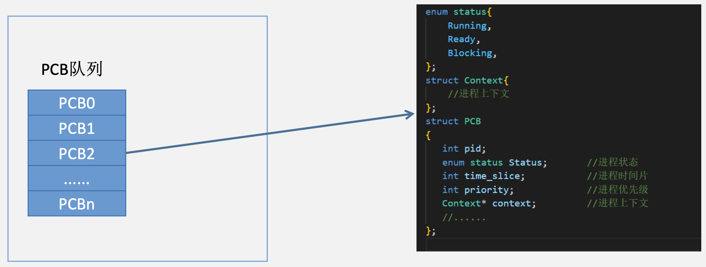
</div>

&emsp;&emsp;&ensp;一般而言，不同的阻塞原因对应不同的阻塞队列。

<div style=" margin: 0 auto; max-width: 60%;">
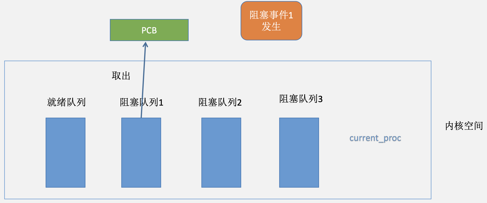
</div>

<div style=" margin: 0 auto; max-width: 60%;">
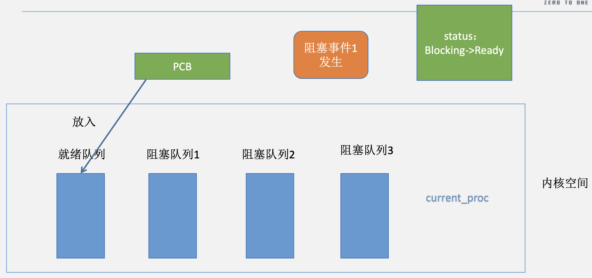
</div>

<div style=" margin: 0 auto; max-width: 60%;">
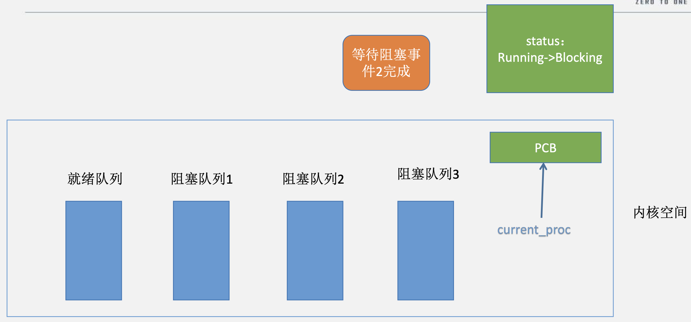
</div>

<div style=" margin: 0 auto; max-width: 60%;">
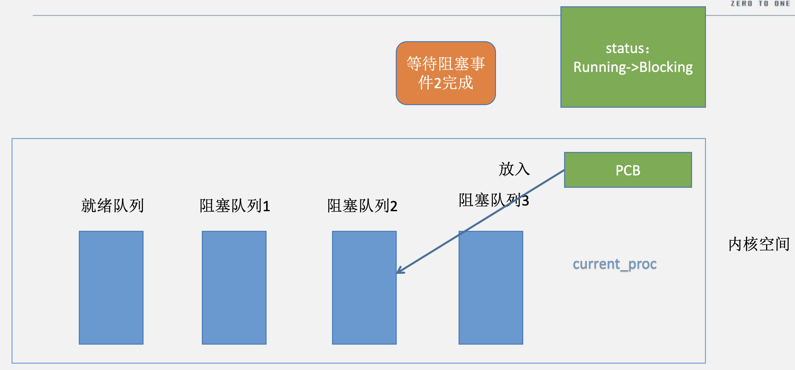
</div>

<div style=" margin: 0 auto; max-width: 60%;">
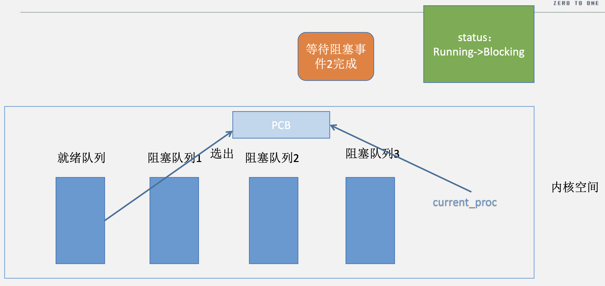
</div>

#### 场景2.1问题

1. 用户程序能够访问自身 ${PCB}$？为什么？
    不能，用户程序运行在用户态，${PCB}$ 是只有内核态才能访问的控制信息集合。
2. 所有位于阻塞态的进程是否应该位于同一个阻塞队列中？为什么？
    不是，不同的阻塞原因会在不同的阻塞队列。

### 场景2.2（调度器与PCB）

&emsp;&emsp;&ensp;调度相关数据结构：

<div style=" margin: 0 auto; max-width: 45%;">
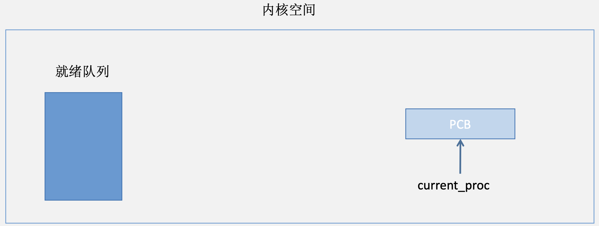
</div>

&emsp;&emsp;&ensp;如：时间片轮转法下的 ${PCB}$：

```cpp
struct PCB{
    ...
    int time_slice;
    bool NEED_RESCHED;
    ...
}
```

&emsp;&emsp;&ensp;时钟中断与时间片调度

<div style=" margin: 0 auto; max-width: 50%;">
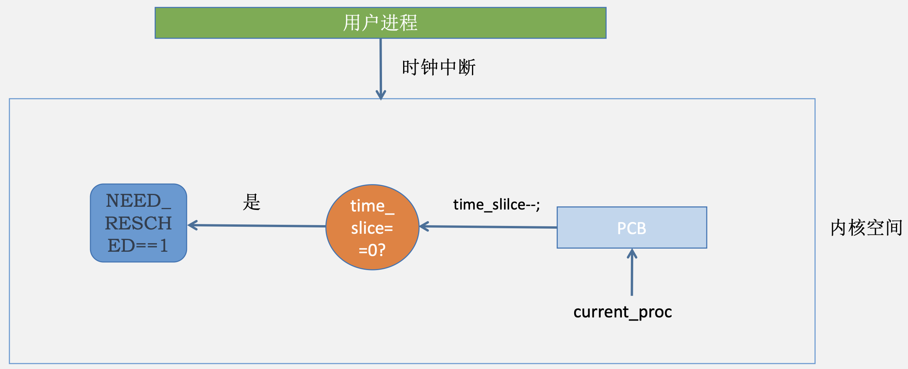
</div>

<div style=" margin: 0 auto; max-width: 40%;">
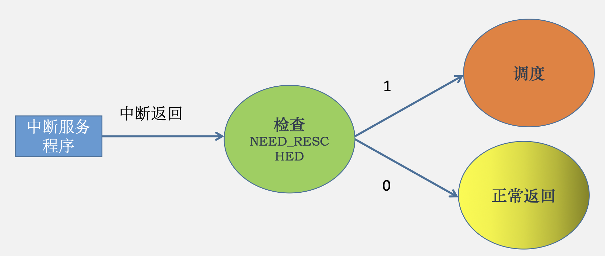
</div>

&emsp;&emsp;&ensp;调度过程：选出目标进程的 ${PCB}$

<div style=" margin: 0 auto; max-width: 50%;">
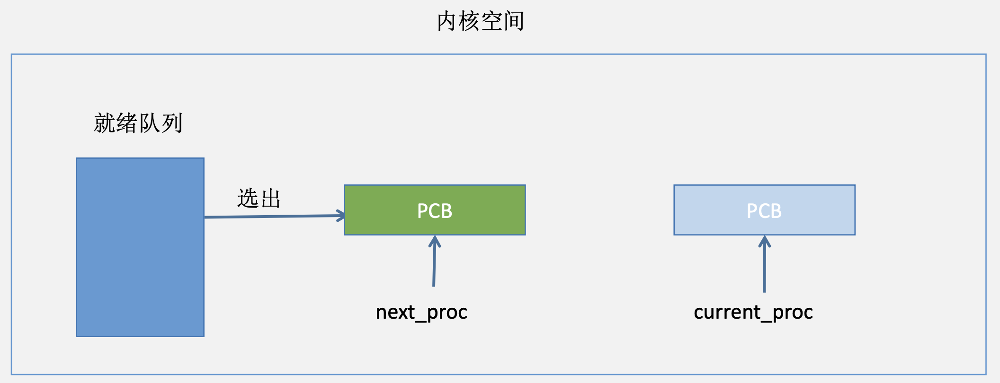
</div>

&emsp;&emsp;&ensp;调度过程：上下文切换

<div style=" margin: 0 auto; max-width: 50%;">
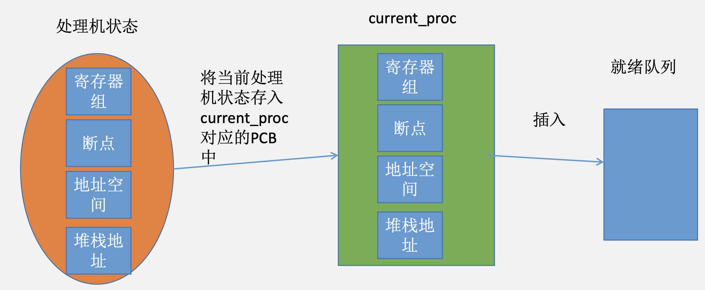
</div>

<div style=" margin: 0 auto; max-width: 50%;">
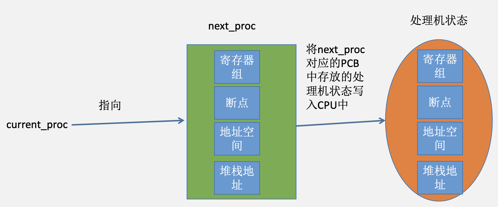
</div>

#### 场景2.2问题

1. 进程切换完成后，${current}$ 变量会发生什么变化？原本的当前进程如何处理呢?
    指向新进程的 ${PCB}$；变成就绪态插入就绪队列
2. 同一进程的不同线程发生线程切换时，上文描述的上下文切换、地址空间切 换和堆栈切换哪些会发生哪些不会发生？为什么？
    上下文切换、堆栈切换会发生，地址空间切换不会发生；因为线程共享进程的地址空间，但是拥有属于自己的堆栈空间和通用寄存器。
3. 若使用优先级调度算法，应该用什么数据结构来组织就绪队列效率最高？为什么？
    优先级队列或者说堆，能够快速选出最值。
4. 若根页表总是占用一个完整的页框，则 ${PCB}$ 中保存的 ${PTR}$ 的值可以做哪种优化？
    只装入页框号

&emsp;&emsp;&ensp;同一进程线程各自有栈，各自栈实际还是在给进程分配的内存空间，故**线程还是能访问修改到别的同进程线程的栈**，因为不知道其他线程的栈指针，所以不知道自己修改了其他线程的栈内元素。

### 场景2.3（进程状态的转化）

<div style=" margin: 0 auto; max-width: 50%;">
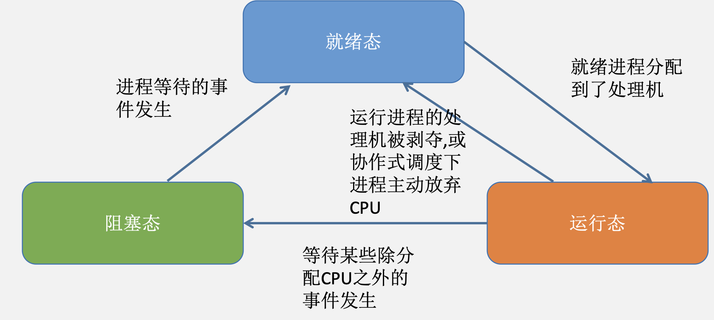
</div>

&emsp;&emsp;&ensp;等待事件

1. 发起 ${I/O}$，等待 ${I/O}$ 完成；
2. 对 ${≤0}$ 的信号量进行 ${P}$ 操作，等待 ${V}$ 操作；
3. 条件变量 ${wait()}$ 操作，等待 ${signal()}$ 操作释放；
4. 创建进程的过程中资源不够，等待释放；
5. 等待输入设备的数据输入等。

&emsp;&emsp;&ensp;运行进程的处理机被剥夺，或协作式调度阻塞态下进程主动放弃 ${CPU}$：

1. 当前进程**时间片用完**；
2. 更高优先级的进程进入了就绪态。
   1. ${阻塞态\to 就绪态}$
   2. ${创建态\to 就绪态}$
3. 协作式调度下进程**主动放弃** ${CPU(yield())}$。

#### 场景2.3问题

1. 在抢占式调度的系统中，考虑下面各种情况可能造成的进程状态变化（只考虑阻塞态、运行态和就绪态三种情况）：
   1. ${I/O}$ 设备完成一次 ${I/O}$；
    ${阻塞态\to 就绪态}$
    ${运行态\to 就绪态}$
   2. 某进程时间片用完；
    ${运行态\to 就绪态}$
    ${就绪态\to 运行态}$
   3. 一个新的进程完成了创建；
    ${创建态\to 就绪态\to 运行态}$
    ${运行态\to 就绪态}$
   4. 当前运行的进程申请一次 ${I/O}$；
    ${运行态\to 阻塞态}$
    ${就绪态\to 运行态}$
   5. 当前进程被强行终止；
    ${就绪态\to 运行态}$
   6. 当前进程做了一次 ${P()/V()}$ 操作；
    ${运行态\to 阻塞态}$
    ${就绪态\to 运行态}$
    ${阻塞态\to 就绪态}$
   7. 当前进程做了一次条件变量的 ${wait()/signal()}$ 操作。
    ${运行态\to 阻塞态}$
    ${就绪态\to 运行态}$
    ${阻塞态\to 就绪态}$
2. 就绪态进程有可能直接进入阻塞态或者退出态吗？
    不可能，只可能从运行态进入阻塞态或者退出态。

### 场景2.4（PCB与文件系统）

&emsp;&emsp;&ensp;在 ${PCB}$ 中找到进程的打开文件表。

<div style=" margin: 0 auto; max-width: 60%;">
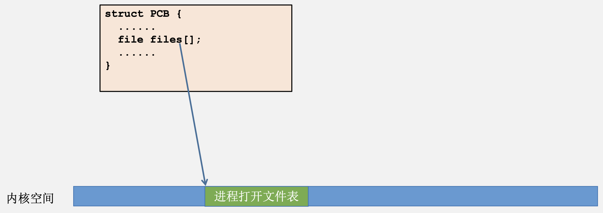
</div>

#### 场景2.4问题

&emsp;&emsp;&ensp;请选出下列选项中可能保存在 ${PCB}$ 中的内容，并总结与 ${PCB}$ 有关联的资源的特征。

1. 系统级打开文件表的入口地址
    不在 ${PCB}$ 中
2. 与进程有关联的资源列表
    在  ${PCB}$ 中
3. 磁盘块在内存中的缓冲区
    不在  ${PCB}$ 中
4. 系统时间
    不在  ${PCB}$ 中
5. 进程创建时的系统时间
    在  ${PCB}$ 中
6. 进程是否应该被调度的标识
    在  ${PCB}$ 中

&emsp;&emsp;&ensp;属性属于进程的则保存在 ${PCB}$，跟操作系统相关的就不保存在 ${PCB}$ 中。

---

### 进程的特征

#### 动态性

&emsp;&emsp;&ensp;进程是程序的一次执行，它有着创建、活动、暂停、终止等过程，具有一定的生命周期，是动态地产生、变化和消亡的。动态性是进程**最基本的特征**。

#### 并发性

&emsp;&emsp;&ensp;指多个进程实体同存于内存中，能在一段时间内同时运行。引入进程的目的就是使进程能和其他进程并发执行。**并发性是进程的重要特征，也是操作系统的重要特征**。

#### 独立性

&emsp;&emsp;&ensp;指进程实体是一个**能独立运行、独立获得资源和独立接受调度的基本单位**。凡未建立 ${PCB}$ 的程序，都不能作为一个独立的单位参与运行。

#### 异步性

&emsp;&emsp;&ensp;由于进程的相互制约，使得进程按照各自独立的、不可预知的速度向前推进。异步性会导致执行结果的不可再现性，为此在操作系统中**必须配置相应的进程同步机制**。

### 进程的用户态与内核态

&emsp;&emsp;&ensp;程序内存空间包含用户空间和内核空间，对进程来说同样如此，进程的虚拟内存空间同样包含**用户空间和内核空间**。其中，内核空间中存放着操作系统的代码与数据，由所有进程共享使用，**只有 ${CPU}$ 处于内核态时才允许访问**。

<div style=" margin: 0 auto; max-width: 70%;">

</div>

&emsp;&emsp;&ensp;当进程 ${P1}$ 在用户态下响应中断，**只发生特权级的变化并不会发生地址空间的变化**，因此，响应中断后占用 ${CPU}$ 的进程依然是 ${P1}$，只不过 ${P1}$ 获取了内核空间的访问权限，此时我们称为 ${P1}$ 处于内核态。响应中断后 ${P1}$ 会**跳转到位于内核空间中的中断服务程序处去执行**。

### 五状态进程模型

<div style=" margin: 0 auto; max-width: 20%;">

</div>

#### 创建态

&emsp;&emsp;&ensp;进程正在创建的状态，此时进程**已经分配好了 ${PCB}$，正在分配进程执行所需要的除 ${CPU}$ 外的其他资源**。

#### 退出态

&emsp;&emsp;&ensp;进程运行终止后，操作系统会**回收其所占用的资源和 ${PCB}$ 等，被回收过程中的进程处于退出态**。
&emsp;&emsp;&ensp;进程退出的情况：

1. 正常退出（自愿退出）
2. 主动退出（自愿），比如 ${Linux}$ 中的 ${exit()}$。
3. 致命错误（强制退出）
4. 被系统或其他进程杀死（强制退出）

#### 就绪态

&emsp;&emsp;&ensp;进程所有除 ${CPU}$ 以外的条件均已满足，等待获取 ${CPU}$ 后便可以直接运行。

#### 运行态

&emsp;&emsp;&ensp;进程占用 ${CPU}$ 处于运行中的状态。

#### 阻塞态

&emsp;&emsp;&ensp;又称为等待态，指进程**等待某些事件或者除 ${CPU}$ 以外的某些资源得到满足后才能运行的状态**。
&emsp;&emsp;&ensp;${408}$ 范围内阻塞常见情况：

1. 进程发起 ${I/O}$ 操作等待 ${I/O}$ 设备分配或等待其完成的过程中；
2. 进程对值小于等于 ${0}$ 的信号量执行 ${P}$ 操作；
3. 对管程中的条件变量执行 ${wait()}$ 操作；
4. **试图创建一个新进程却无法申请到足够的资源**。

#### 五状态进程模型状态转化

##### 启动

<div style=" margin: 0 auto; max-width: 30%;">
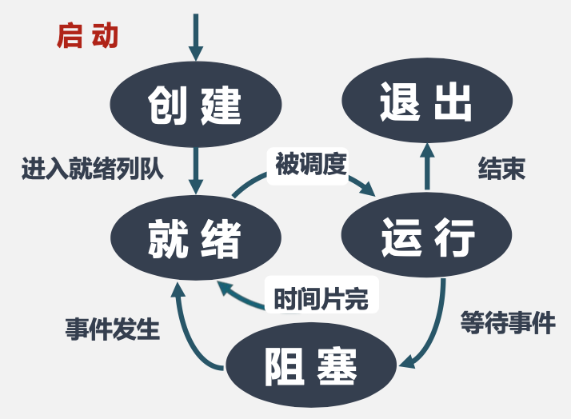
</div>

&emsp;&emsp;&ensp;${NULL\to 创建}$：一个新进程被产生出来执行一个程序。

##### 进程创建

<div style=" margin: 0 auto; max-width: 15%;">

</div>

&emsp;&emsp;&ensp;引起进程创建的情况，**创建成功即进入就绪态**：

1. 系统初始化时；
2. 用户请求创建一个新进程；
3. 正在运行的进程执行了创建进程的系统调用。

<div style=" margin: 0 auto; max-width: 30%;">
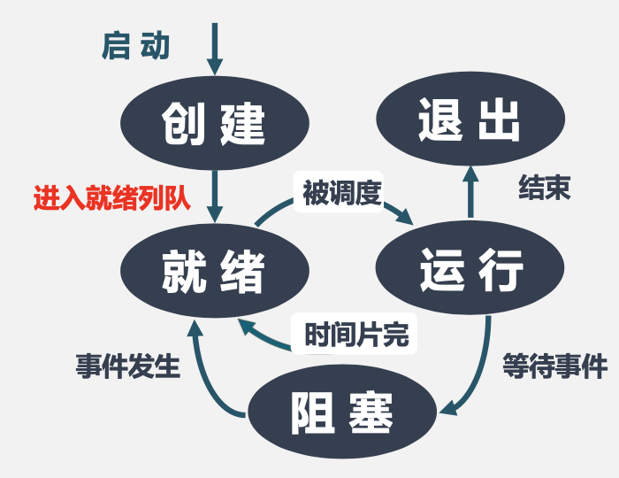
</div>

&emsp;&emsp;&ensp;进程创建过程：

1. **申请 ${pid}$ 和空白 ${PCB}$**：系统中可以同时容纳的进程个数是有限的，若申请失败，则创建失败。
2. **申请进程所需其他资源**：其他资源包含内存、文件、${I/O}$ 设备和 ${CPU}$ 时间等。这些资源或从操作系统获得，或仅从其父进程获得。注意：若当前没有足够的资源，**创建不会失败，只会将创建该进程的进程阻塞**。
3. **初始化 ${PCB}$**：按照分配到的各类资源初始化 ${PCB}$。
4. **将新进程 ${PCB}$ 加入就绪队列**：若就绪队列可接受新进程，则将新进程 ${PCB}$ 加入就绪队列，并将其状态设置为就绪态。**若暂时无法插入，则父进程被阻塞**。

<div style=" margin: 0 auto; max-width: 60%;">

</div>

##### 进程执行

<div style=" margin: 0 auto; max-width: 20%;">

</div>

&emsp;&emsp;&ensp;内核选择一个就绪的进程，让它占用处理机并执行。
&emsp;&emsp;&ensp;如何选择？（即进程调度）

<div style=" margin: 0 auto; max-width: 30%;">
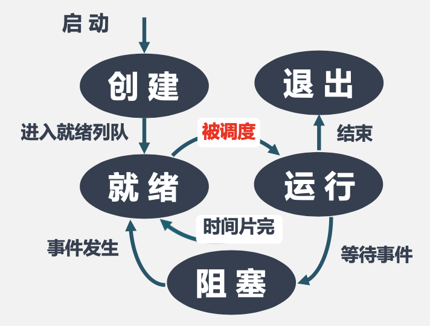
</div>

##### 进程阻塞

<div style=" margin: 0 auto; max-width: 20%;">

</div>

&emsp;&emsp;&ensp;进程进入等待（阻塞）的情况：

1. ${I/O}$ 阻塞；
2. 信号量、条件变量阻塞；
3. 其他资源申请阻塞。

&emsp;&emsp;&ensp;只有进程自身才能知道何时需要等待某种事件的发生，因此**只能由运行态转为阻塞态**。

<div style=" margin: 0 auto; max-width: 50%;">

</div>

##### 进程抢占

<div style=" margin: 0 auto; max-width: 20%;">

</div>

&emsp;&emsp;&ensp;进程会被抢占的情况：

1. 高优先级进程就绪；
2. 进程执行当前时间用完。

&emsp;&emsp;&ensp;只在抢占式调度下才存在。

##### 进程唤醒

<div style=" margin: 0 auto; max-width: 50%;">

</div>

&emsp;&emsp;&ensp;唤醒进程的情况：

1. 被阻塞进程需要的资源可被满足；
2. 被阻塞进程等待的事件到达。

&emsp;&emsp;&ensp;**进程只能被别的进程或操作系统唤醒**。

##### 进程终止

${运行\to 结束}$：当进程表示它已经完成或者因出错，当前**运行进程**会**由操作系统作结束处理**。

<div style=" margin: 0 auto; max-width: 30%;">
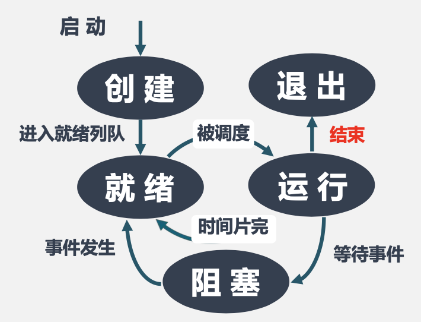
</div>

&emsp;&emsp;&ensp;不同 ${OS}$ 对进程终止对处理不完全相同，以上四个过程属于各 ${OS}$ 共有的操作。另外：当 ${windows}$ 终止父进程时，子进程也会被终止；而 ${Linux}$ 中父进程被终止时，子进程不会终止，会变成孤儿进程，被一个叫 ${init}$ 的进程接收。（真题有考察，父进程终止子进程是否会终止，真题对于这个给出了否定的选择。）

<div style=" margin: 0 auto; max-width: 60%;">

</div>

#### 带挂起的进程状态模型

##### 挂起与激活

&emsp;&emsp;&ensp;计算机中的内存空间是有限的。
&emsp;&emsp;&ensp;当**内存空间不足时**，操作系统需要将一部分短时间内可能不执行的进程**换回到外存中，这种操作叫做挂起**；
&emsp;&emsp;&ensp;阻塞挂起状态（${Blocked-suspend}$）：进程在外存并等待某事件的出现。
&emsp;&emsp;&ensp;就绪挂起状态（${Ready-suspend}$）：进程在外存，但只要进入内存并分配 ${CPU}$，即可运行。
&emsp;&emsp;&ensp;同时把更有可能执行的进程从外存中放入内存，这种操作叫做**激活**。

<div style=" margin: 0 auto; max-width: 30%;">

</div>

### 进程调度的含义

&emsp;&emsp;&ensp;在多道程序设计系统中，内存中有多道程序运行，他们相互争夺处理机这一重要的资源。处理机调度就是从就绪队列中，按照一定的算法选择一个进程并将处理机分配给它运行，以**实现进程并发地执行**。

<div style=" margin: 0 auto; max-width: 40%;">

</div>

### 进程切换

#### 进程切换（上下文切换）

1. 暂停当前运行进程，从运行状态变成其他状态；
2. 调度另一个进程从就绪状态变成运行状态。

#### 进程切换的要求

1. 切换前，保存进程上下文；
2. 切换后，恢复进程上下文；
3. 快速切换。

#### 进程生命周期的信息

1. **寄存器（${PC, SP, …}$）**
2. **${CPU}$ 状态**
3. **内存地址空间**

#### 保存上下文

<div style=" margin: 0 auto; max-width: 50%;">

</div>

&emsp;&emsp;&ensp;地址空间寄存器在不同管理方式下的不同名称：

1. 页式管理中叫页表基址寄存器
2. 段式管理中叫段基址寄存器
3. 其他管理方式可能叫基址寄存器

&emsp;&emsp;&ensp;总之，实现的功能是控制物理地址和逻辑地址之间的转换。

#### 恢复上下文

<div style=" margin: 0 auto; max-width: 50%;">

</div>

#### 进程切换

<div style=" margin: 0 auto; max-width: 40%;">

</div>

### 用户进程切换全过程

<div style=" margin: 0 auto; max-width: 70%;">

</div>

&emsp;&emsp;&ensp;中断响应与进程切换的上下文切换区别：

1. 中断响应保存和恢复上下文是**分开进行的**，分别位于中断响应和中断返回的过程中。而进程切换的上下文保存和上下文恢复**几乎是同时进行的**。
2. 中断响应保存的上下文是**中断前进程执行的上下文**，进程切换保存的是当前中断服务程序正在执行过程的上下文。更进一步说，中断响应维护的上下文可能是用户态下的上下文，进程切换维护的一定是内核态下的上下文。 
3. 中断响应**不涉及地址空间切换**，进程切换**涉及地址空间切换**，所以**中断不会进入一个新的进程**。
4. 中断响应可能发生特权级切换，进程切换全程在内核态下进行。

### 父进程与子进程

&emsp;&emsp;&ensp;若 ${A}$ 进程创建了 ${B}$ 进程，则称 ${A}$ 为 ${B}$ 的父进程，${B}$ 为 ${A}$ 的子进程。

#### 父进程和子进程共享部分全局资源

&emsp;&emsp;&ensp;某些操作系统全局资源是存在父子继承的，例如后面会学到的文件、管道、设备等。对这些特定的全局资源来说，**子进程通常会继承父进程对它们的访问权限**。

#### 父进程和子进程并不共享地址空间

<div style=" margin: 0 auto; max-width: 40%;">

</div>

&emsp;&emsp;&ensp;在某些操作系统的设计下，父进程创建的子进程会**复制父进程的代码、数据和虚拟地址空间（注意不同）**，但是二者并**不共享地址空间**。

## 线程

<div style=" margin: 0 auto; max-width: 30%;">

</div>

### 单进程的实现方法

<div style=" margin: 0 auto; max-width: 20%;">

</div>

&emsp;&emsp;&ensp;存在的问题：
1. 播放出来的声音能否连贯？
2. 各个函数之间不是并发执行，影响资源的使用效率。

### 多进程的实现方法

<div style=" margin: 0 auto; max-width: 40%;">

</div>

&emsp;&emsp;&ensp;存在的问题：
1. 进程之间如何通信、共享数据？
2. 系统开销较大
    1. 创建进程
    2. 进程结束
    3. 进程切换

### 多线程的解决思路

&emsp;&emsp;&ensp;在进程内部增加一类实体，满足以下特性：

1. 实体之间可以并发执行。
2. 实体之间共享相同的地址空间，这种实体就是线程（${Thread}$）。

### 线程的概念

&emsp;&emsp;&ensp;线程是进程的一部分，**描述指令流执行状态**。它是进程中的指令执行流的最小单元，是 ${CPU}$ 调度的基本单位。
&emsp;&emsp;&ensp;进程的资源分配角色：进程由一组相关资源构成，包括地址空间（代码段、数据段）、打开的文件等各种资源。
&emsp;&emsp;&ensp;线程的处理机调度角色：线程描述在进程资源环境中的**指令流执行状态**。
&emsp;&emsp;&ensp;不同的线程**需要使用不同的寄存器和堆栈**，线程切换时也要**进行寄存器和堆栈的切换**。
&emsp;&emsp;&ensp;主要的区别是**是否需要地址空间的切换，进程需要，线程不需要**。

<div style=" margin: 0 auto; max-width: 30%;">

</div>

### 用户级线程

&emsp;&emsp;&ensp;由一组**用户级的线程库函数**来完成线程的管理，包括线程的创建、终止、同步和调度。
&emsp;&emsp;&ensp;用户级线程的特征：

1. 不依赖于操作系统的内核。内核不了解用户线程的存在；可用于不支持线程的多进程操作系统。
2. 在用户空间实现的线程机制。每个进程有私有的线程控制块（${TCB}$）列表；${TCB}$ **由线程库函数维护**。
3. 同一进程内的用户线程切换速度快。**无需用户态/核心态切换**。
4. 允许每个进程拥有自己的线程调度算法。

&emsp;&emsp;&ensp;用户级线程的不足：

1. **线程发起系统调用而阻塞时，则整个进程进入等待**。
2. 不支持基于线程的处理机抢占。除非当前运行线程主动放弃，它所在进程的其他线程无法抢占 ${CPU}$。
3. **只能按进程分配 ${CPU}$ 时间**。多个线程进程中，每个线程的时间片较少。

<div style=" margin: 0 auto; max-width: 30%;">

</div>

### 内核级线程

&emsp;&emsp;&ensp;由内核通过系统调用实现的线程机制，由内核完成线程的创建、终止和管理。
&emsp;&emsp;&ensp;内核级线程的特征：

1. 由**内核维护 ${PCB}$ 和 ${TCB}$**。
2. 线程执行系统调用而被阻塞不影响其他线程。
3. **线程的创建、终止和切换相对较大**。通过系统调用/内核函数，**在内核实现**。
4. **以线程为单位进行 ${CPU}$ 时间分配**。多线程的进程可获得更多 ${CPU}$ 时间。

<div style=" margin: 0 auto; max-width: 30%;">

</div>

### 混合方式

&emsp;&emsp;&ensp;进程的一部分线程依赖用户线程库来实现，在用户态下管理。一部分线程通过内核态来实现，由**操作系统管理**。

#### 多线程模型

##### 多对一模型

1. 由一个内核线程来管理同一进程的所有线程，线程管理是由用户空间的线程库来完成的，**因此效率更高**。
2. 如果一个线程执行阻塞系统调用，那么整个进程将会阻塞。
3. 因为任一时间只有一个线程可以访问内核，所以多个线程不能并行运行在多处理核系统上。

<div style=" margin: 0 auto; max-width: 20%;">

</div>

##### 一对一模型

1. 对**每个线程都用一个内核线程来管理**，该模型在一个线程执行阻塞系统调用时，能够允许另一个线程继续执行，所以**它提供了比多对一模型更好的并发功能**；
2. 它也**允许多个线程并行运行在多处理器系统上**。
3. 这种模型的唯一缺点是，创建一个用户线程就要创建一个相应的内核线程。由于**创建内核线程的开销会影响应用程序的性能**，所以这种模型的大多数实现**限制了系统支持的线程数量**。

<div style=" margin: 0 auto; max-width: 20%;">

</div>

##### 多对多模型

&emsp;&emsp;&ensp;多路复用多个用户级线程到同样数量或更少数量的内核线程。

<div style=" margin: 0 auto; max-width: 20%;">

</div>

### 进程与线程的关系

<div style=" margin: 0 auto; max-width: 40%;">

</div>

### 进程与线程的比较
&emsp;&emsp;&ensp;进程是**资源分配单位，线程是 ${CPU}$ 调度单位。**
&emsp;&emsp;&ensp;进程拥**有一个完整的资源平台，而线程只独享指令流执行的必要资源，如寄存器和栈**。
&emsp;&emsp;&ensp;线程具有**就绪、等待和运行**三种基本状态和状态间的转换关系。
&emsp;&emsp;&ensp;线程能减少并发执行的时间和空间开销。因为：

1. 线程的创建时间比进程短。
2. 线程的终止时间比进程短。
3. 同一进程内的线程切换时间比进程短。
4. 由于同一进程的各线程间共享内存和文件资源，**可不通过内核进行直接通信**。

## 进程间通信

&emsp;&emsp;&ensp;一个进程与另一个进程之间进行数据交换。
&emsp;&emsp;&ensp;问题：为什么只有进程间通信，而没有线程间通信这个说法？

<div style=" margin: 0 auto; max-width: 50%;">

</div>

### 共享存储系统

<div style=" margin: 0 auto; max-width: 50%;">

</div>

<div style=" margin: 0 auto; max-width: 40%;">

</div>

&emsp;&emsp;&ensp;进程 ${1}$ 映射下的 ${4}$ 号逻辑单元和进程 ${2}$ 映射下的 ${3}$ 号逻辑单元均映射到物理内存单元 ${2}$。这样，进程 ${1}$ 在自身对应的 ${4}$ 号逻辑单元中存入数据，进程 ${2}$ 也可以在自己的 ${3}$ 号逻辑单元中访问到。

<div style=" margin: 0 auto; max-width: 60%;">

</div>

<div style=" margin: 0 auto; max-width: 50%;">

</div>

<div style=" margin: 0 auto; max-width: 40%;">

</div>

### 建立过程

1. 进程 ${A}$ 通过**系统调用**创建一块共享内存；
2. ${A、B}$ 进程分别通过**系统调用**将建立好的**共享内存链接进自己的用户地址空间中**。

&emsp;&emsp;&ensp;系统调用发起时机：**共享内存建立时和用户链接共享内存时**。
&emsp;&emsp;&ensp;共享内存的释放：进程取消与共享内存关联时，共享内存不会被释放。只有操作系统**接收到释放共享内存的系统调用时，共享内存才会被释放**。
&emsp;&emsp;&ensp;共享内存的访问方式：共享内存位于进程的用户地址空间中，用户进程访问共享内存时，**使用虚拟地址直接访问即可**，不一定需要切换特权级。

### 内核空间共享

<div style=" margin: 0 auto; max-width: 60%;">

</div>

&emsp;&emsp;&ensp;基于内核空间共享，有了后面的**消息传递系统**和**管道通信**。

### 消息传递系统

&emsp;&emsp;&ensp;内核缓冲区：由于各个进程都**具有内核区域的同映射**，因此，**可以利用内核内存空间作为中介来进行数据的传递**。通常我们在内核中分配一个多进程均可读写的内存区域作为**内核缓冲区**。

#### 直接通信方式

<div style=" margin: 0 auto; max-width: 50%;">

</div>

#### 间接通信方式

<div style=" margin: 0 auto; max-width: 50%;">
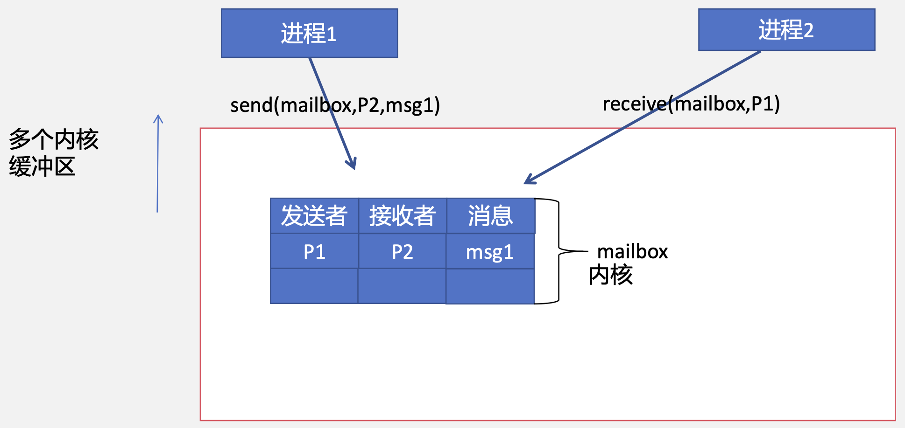
</div>

### 管道通信

&emsp;&emsp;&ensp;管道存放数据依靠内核空间中的**环形缓冲区**（循环队列）。

<div style=" margin: 0 auto; max-width: 30%;">

</div>

&emsp;&emsp;&ensp;管道的几大特点：
* 管道每个数据只可以**读一次便会失效**；
* 管道是环形的数据缓冲区（循环队列）；
* 管道只能读当前读指针指向的数据，只能在当前写指针指向的区域写入（队尾写入，队头读出）。
* **读空管道，进程阻塞；写满管道，进程阻塞**。

#### 环形数组的一种实现方式

<div style=" margin: 0 auto; max-width: 60%;">

</div>

&emsp;&emsp;&ensp;管道是一种**特殊文件**，一般文件是存在磁盘中的，但是**管道存在于内存中**。使用**系统调用创建管道**，创建之后会获得两个端口，也就是两个文件描述符 ${f1}$ 和 ${f2}$，其代表了两个文件 ${f1}$ 和 ${f2}$。这两个文件**一个代表读端的文件一个代表写端的文件**。我们可以通过**对读端文件进行读操作，这个读操作会被转化为读管道的操作**；写操作同理。从上层系统来看，**管道似乎被封装成了一个可以进行读写的文件**。

<div style=" margin: 0 auto; max-width: 60%;">

</div>

#### 管道的读写权限

&emsp;&emsp;&ensp;进程可以关闭自己的权限，一旦关闭就不能再打开了（在文件章节有详解）。

<div style=" margin: 0 auto; max-width: 40%;">
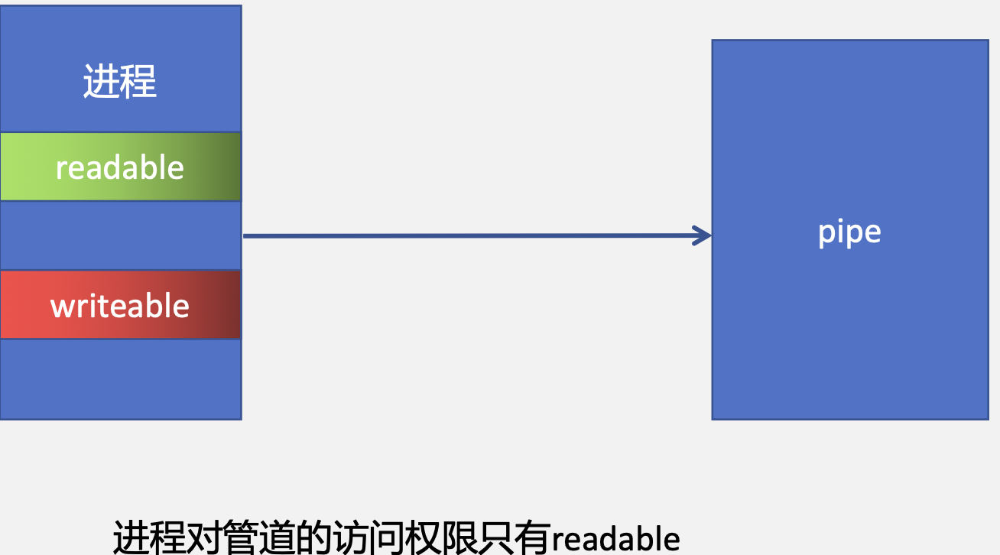
</div>

<div style=" margin: 0 auto; max-width: 40%;">
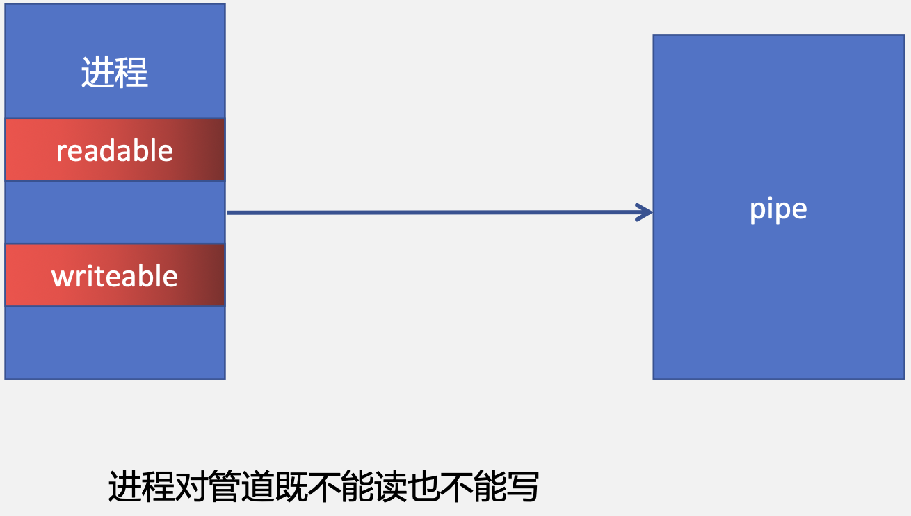
</div>

#### 半双工通信方式

&emsp;&emsp;&ensp;任务要求：

$${P1\to P2: “abcde”}$$

$${P2\to P1: “12345”}$$

&emsp;&emsp;&ensp;进程 ${1}$ 将想要传输给进程 ${2}$ 的数据写入管道后，**必须等进程 ${2}$ 全部读取完毕**，进程 ${1}$ 才可以读取数据，否则的话进程 ${1}$ 会读取自己写入的数据使其失效，进程 ${2}$ 同理。因此进程 ${1}$ 和进程 ${2}$ 之间通过管道进行信息传递是**半双工的**，也就是说**在同一段时间内只能单向传递，说支持双向通信则绝对是错的**。

<div style=" margin: 0 auto; max-width: 40%;">

</div>

#### 管道的继承

&emsp;&emsp;&ensp;管道只能在父子进程之间继承，且**继承对管道的访问权限**。
&emsp;&emsp;&ensp;某两个进程要是想使用管道通信，该管道**必须由其公共祖先创建，否则必定有一管道无法使用这个管道进行通信。**

<div style=" margin: 0 auto; max-width: 40%;">
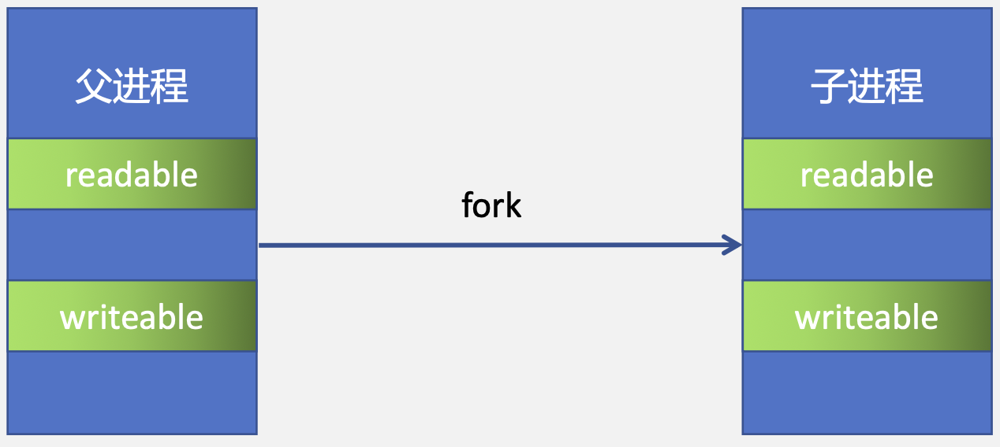
</div>

#### 管道的引用

<div style=" margin: 0 auto; max-width: 50%;">
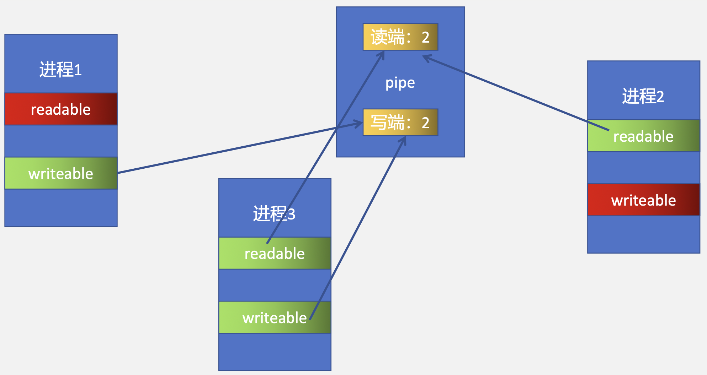
</div>

#### 管道的释放

&emsp;&emsp;&ensp;思考：为什么当前无 ${readable}$ 的进程，就直接关闭读端，而不考虑后续可能存在需要读该管道的进程？
&emsp;&emsp;&ensp;因为管道**只能被进程的子孙进程继承**，而且会继承管道的访问权限。前文提到管道的**访问权限一经关闭就不能再开启**，属于“绝后”的状态，所以**所有权限关闭后，管道即被释放**。
&emsp;&emsp;&ensp;思考：如果**读端关闭，是否可以提前释放管道**？
&emsp;&emsp;&ensp;合理的，**如果再也没有进程可以读这个管道，那么管道就失去了意义**。

<div style=" margin: 0 auto; max-width: 50%;">
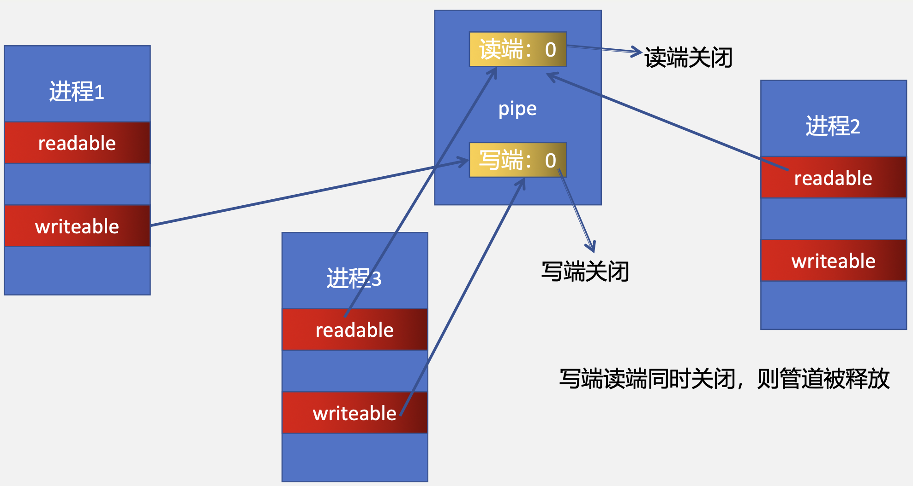
</div>

#### 多进程读写管道

&emsp;&emsp;&ensp;${P1}$ 写完 ${message}$ 后，${P2}$ 必须全部读完，其它进程才能读，否则会造成 ${P2}$ 接收的信息有丢失。
&emsp;&emsp;&ensp;读、写管道**必须解决同步互斥问题**，否则会读取不到各自的正确信息或写入的数据很难准确获取。

<div style=" margin: 0 auto; max-width: 50%;">

</div>

#### 匿名管道和命名管道

&emsp;&emsp;&ensp;前面介绍的管道为匿名管道，**命名管道可以在无亲缘关系的进程之间传递信息**。

---

## 场景4（强化）

&emsp;&emsp;&ensp;该场景主要是进程管理章节中的一些细碎知识点的罗列。

<div style=" margin: 0 auto; max-width: 60%;">
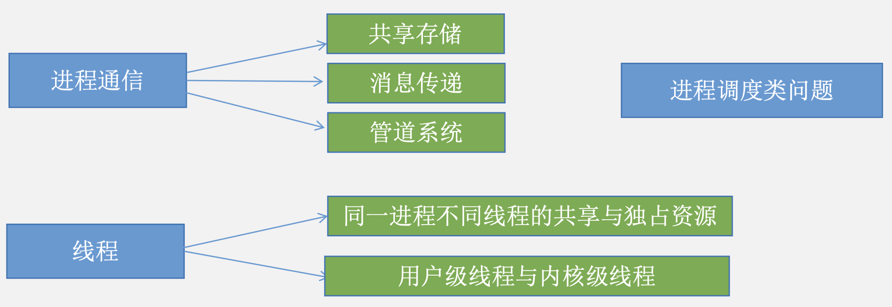
</div>

### 场景4.1（共享存储）

<div style=" margin: 0 auto; max-width: 50%;">
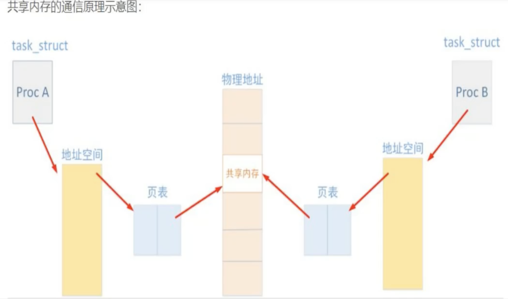
</div>

1. 共享的内存是位于内核空间还是进程的用户空间？
    用户空间
2. 建立共享内存的操作是在用户态还是内核态下完成的？为什么？
    内核态，因为地址映射是在内核态下完成的
3. 访问共享数据的操作是在用户态还是内核态完成的？为什么？
    用户态，因为是用户空间

### 场景4.2（消息传递）

&emsp;&emsp;&ensp;直接通信

<div style=" margin: 0 auto; max-width: 50%;">
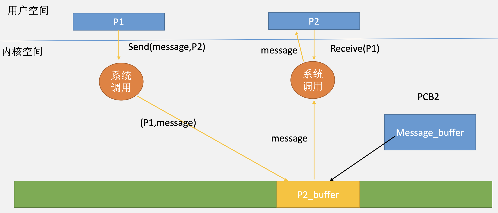
</div>

&emsp;&emsp;&ensp;间接通信

<div style=" margin: 0 auto; max-width: 50%;">
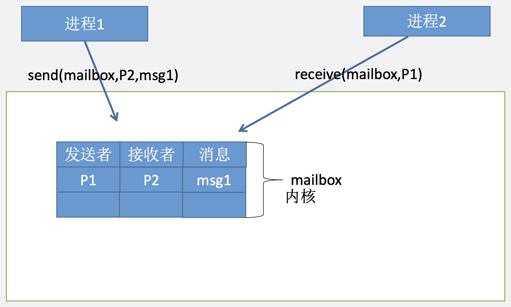
</div>

### 4.2问题

1. 直接通信方式下，进程的 ${PCB}$ 应该增加什么属性？进程发送的 ${message}$ 至少应该附加什么属性？进程发送和接收消息的区域属于用户空间还是内核空间？
    增加该进程的邮箱地址；发送方是谁；内核空间
2. 间接通信方式下，除了 ${message}$ 以外，发送接口还需要提供哪些信息？接收方呢？信箱中的消息还应该包含哪些附加属性？
    邮箱地址、接收方信息；邮箱地址、发送方信息；发送方、接收方信息

### 场景4.3（管道）

&emsp;&emsp;&ensp;进程 ${A}$ 建立了一个匿名管道 ${pipe}$，进程 ${B}$ 通过 ${pipe}$ 与进程 ${A}$ 进行通信，请回答以下问：
1. 进程 ${B}$ 与进程 ${A}$ 是什么关系？二者是通过什么样的接口来访问管道的？
    ${B}$ 与 ${A}$ 有血缘关系，有共同的祖先进程。二者通过文件的读和写来访问管道。
2. 进程 ${A}$ 希望给进程 ${B}$ 传送一串二进制字符“${abcd}$”，而进程 ${B}$ 也希望给进程 ${A}$ 传送字符“${1234}$”，二者都使用管道 ${pipe}$ 来传送的话，在 ${A}$ 写入 ${pipe}$ 的数据被 ${B}$ 读出前，${B}$ 能够写入数据吗？为什么？
    不能，管道通信是半双工通信，
3. 管道容量为 ${4}$，如果 ${A}$ 写入了“${abcd}$”之后继续写，会发生什么？而 ${B}$ 在读完这 ${4}$ 个字符以后依然读管道，则会发生什么？这些状态什么时候会发生改变？
    阻塞；阻塞；直到管道不满 ${A}$ 才会被唤醒，直到管道不空 ${B}$ 才会被唤醒。
4. 当前所有进程都关闭了管道的读端，则管道实际上就已经可以被撤销了，为什么？
    因为若没有了读端，管道就失去了通信的意义。
5. 对管道的读操作需要互斥进行吗？为什么？
    需要，对缓冲区的访问需要互斥进行。

### 场景4.4（线程）

&emsp;&emsp;&ensp;线程的独占资源

<div style=" margin: 0 auto; max-width: 40%;">
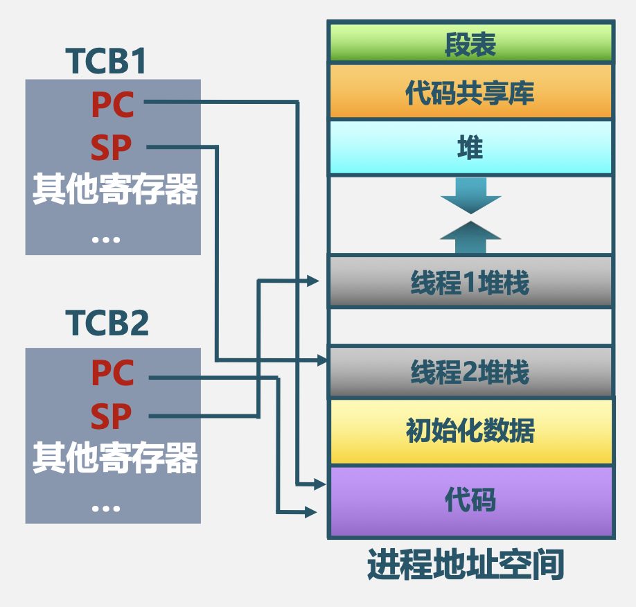
</div>

&emsp;&emsp;&ensp;线程的共享资源

```cpp
P1(){
    int a=0;    // 全局变量
    int ptr=(int)(&a);  // 假设ptr的值为10086
    T1();
    T2();
    ...
}
T1(){
    *((int*)10086)+=1;
}
T2(){
    *((int*)10086)+=1;
}
P2(){
    T3();
    T4();
    ...
}
T3(){
    *((int*)10086)+=1;
}
T4(){
    *((int*)10086)+=1;
}
```

#### 线程的共享资源：地址空间

<div style=" margin: 0 auto; max-width: 70%;">
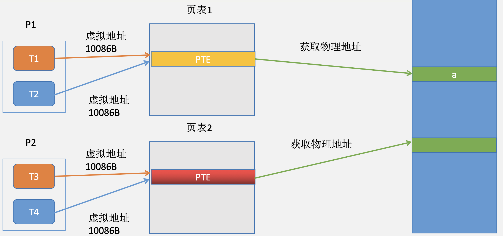
</div>

### 场景4.5（线程类型相关问题）

&emsp;&emsp;&ensp;实现线程的方式包含**用户级线程、内核级线程和组合方式**，请问：
1. 用户级线程和内核级线程是否都具有线程控制块 ${TCB}$，为什么？
    若这个 ${TCB}$ 是指操作系统管理的，那么只有内核级线程有，若没指定，则内核级线程肯定有，用户级线程可能有。
2. 用户级线程和内核级线程谁需要更大的线程切换开销？
    内核级需要更大的线程切换开销
3. 用户级线程中一个线程被操作系统阻塞，会发生什么？
    整个进程都会被阻塞
4. 内核级线程中一个线程被操作系统阻塞，会发生什么？
    只阻塞该线程，该进程其余线程正常运转

&emsp;&emsp;&ensp;用户级线程不支持跨进程的线程切换，而内核级线程支持。

<div style=" margin: 0 auto; max-width: 70%;">
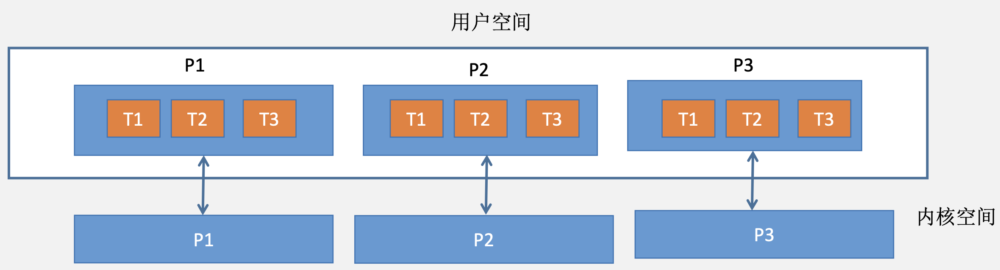
</div>

<div style=" margin: 0 auto; max-width: 70%;">
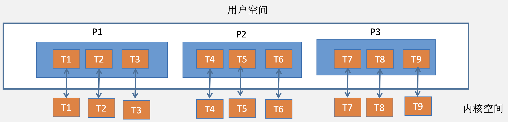
</div>

---

## 调度的层次

### 作业调度（高级调度）

&emsp;&emsp;&ensp;作业调度的主要功能是根据作业控制块中的信息，**审查系统能否满足用户作业的资源需求**，以及按照一定的算法，从外存的后备队列中**选取某些作业调入内存**，并**为它们创建进程、分配必要的资源。然后再将新创建的进程插入就绪队列，准备执行**。
&emsp;&emsp;&ensp;关键词：外存调入内存，创建进程，分配资源。
&emsp;&emsp;&ensp;作业：在多用户系统中，**用户可以以作业为单位提交任务**。操作系统**通过作业控制块来管理作业。**

<div style=" margin: 0 auto; max-width: 50%;">

</div>

&emsp;&emsp;&ensp;若作业被作业调度选中，则操作系统会为作业构建进程来完成任务。

<div style=" margin: 0 auto; max-width: 50%;">

</div>

&emsp;&emsp;&ensp;作业调度就是从各用户提交的作业中选中一个作业，再根据作业的要求为其创建进程。
&emsp;&emsp;&ensp;注意：**作业调度产生进程 ${PCB}$**。

### 中级调度（中程调度、内存调度）

&emsp;&emsp;&ensp;内存中不能有太多的进程，把进程从内存移到外存，当内存有足够空间时，再将合适的进程换入内存，等待进程调度。**中级调度与进程挂起的概念息息相关**。

<div style=" margin: 0 auto; max-width: 60%;">

</div>

#### 作业调度和中级调度的区别

&emsp;&emsp;&ensp;作业调度是第一次为作业分配内存和其他资源，此后作业才被称为进程。**作业调度在一个进程的生命周期中只有一次**，而中级调度只会引发进程状态的变化（挂起与非挂起）。

### 进程调度（低级调度）

&emsp;&emsp;&ensp;在内存中处于**就绪态的进程中选择一个分配处理机**运行。

<div style=" margin: 0 auto; max-width: 70%;">

</div>

#### 处理机调度（低级调度、线程调度、进程调度）的定义

&emsp;&emsp;&ensp;在多道程序设计系统中，内存中有多道程序运行，他们相互争夺处理机这一重要的资源。**处理机调度就是从就绪队列中，按照一定的算法选择一个进程并将处理机分配给它运行，以实现进程并发地执行。**

#### 调度器Scheduler

&emsp;&emsp;&ensp;${current\_ proc}$：代表当前占用 ${CPU}$ 的进程的 ${PID}$。

<div style=" margin: 0 auto; max-width: 50%;">
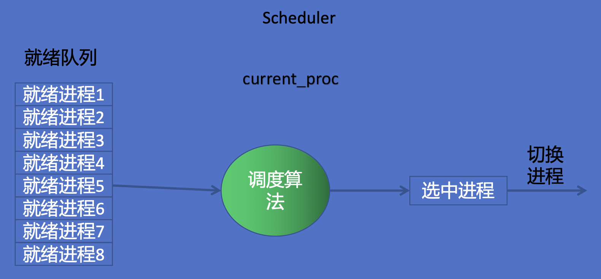
</div>

&emsp;&emsp;&ensp;闲逛进程 ${idle\_ proc}$

<div style=" margin: 0 auto; max-width: 40%;">
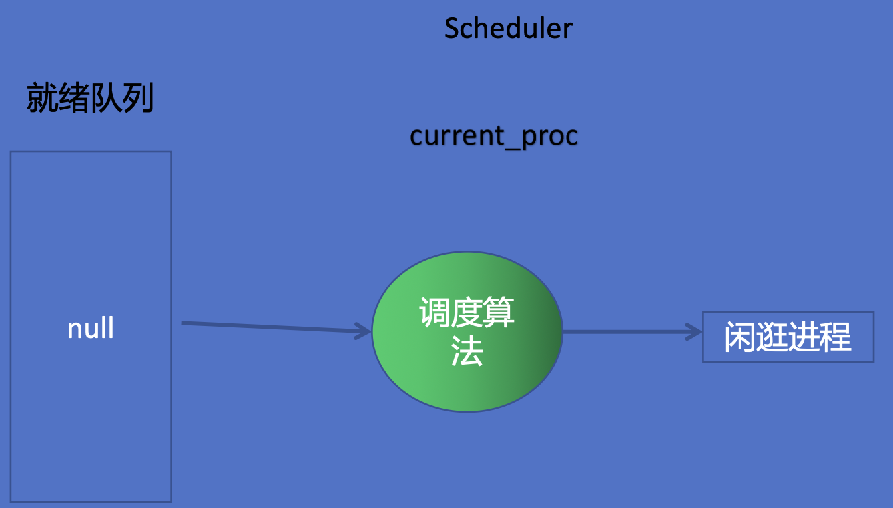
</div>

 &emsp;&emsp;&ensp;作用：防止 ${CPU}$ 空转，通常只有一条指令，用来减少 ${CPU}$ 损耗。
 &emsp;&emsp;&ensp;优先级：最低。
 &emsp;&emsp;&ensp;进程属性：只运行在内核态，是内核线程。
 &emsp;&emsp;&ensp;资源：不需要 ${CPU}$ 以外的资源，不会被阻塞；${Linux}$ 中其有自己的 ${PCB}$，但是比较简单（大概率不会这么问）。
 
#### 处理机的调度方式

##### 非抢占式调度

&emsp;&emsp;&ensp;定义：**一个进程，除非运行结束或者自己主动放弃 ${CPU}$，否则不会被其他进程抢占 ${CPU}$**。
&emsp;&emsp;&ensp;调度时机：当前进程运行结束或者主动放弃 ${CPU}$ 时。
&emsp;&emsp;&ensp;放弃 ${CPU}$ 的原因：进程因不满足执行条件进入了阻塞态或因为其他原因退出执行。
&emsp;&emsp;&ensp;特点：调度不太频繁，**${CPU}$ 利用率一般更高**；**实时性比较差，一般用于批处理操作系统**，不能用于大部分实时操作系统和分时操作系统；**系统开销小**。
&emsp;&emsp;&ensp;注意：在非抢占式调度下，不考虑进程执行主动放弃 ${CPU}$ 的系统调用（**${yield(c)}$，主动放弃 ${CPU}$ 进入就绪态**），**进程不会出现从运行态向就绪态的切换**。进程退出运行态只可能进入**退出态或阻塞态**（写真题时，如果不考虑某种条件无法选出正确选项，那么就要考虑这种情况）。

##### 抢占式调度

&emsp;&emsp;&ensp;定义：进程在执行过程中，也可能**因为时间片用完或者有更高优先级进程进入就绪态而被抢占 ${CPU}$**。
&emsp;&emsp;&ensp;调度时机：当前进程**主动放弃 ${CPU}$**（运行结束或者进入阻塞态）；当前进程时间片用完或有更高优先级的进程进入就绪态。
&emsp;&emsp;&ensp;特点：**频繁调度；实时性强**。
&emsp;&emsp;&ensp;实现方式：当前进程需要被调度的时候设置“需要调度”标识：**${NEED\_ RESCHED}$**。

<div style=" margin: 0 auto; max-width: 30%;">

</div>

&emsp;&emsp;&ensp;在某个时机（如中断服务程序处理完要中断返回）时插入一个检查条件，同时满足后，进行进程调度并切换。

<div style=" margin: 0 auto; max-width: 60%;">

</div>

###### NEED_RESCHED置位时机

&emsp;&emsp;&ensp;有进程进入就绪态时，若就绪态进程优先级大于当前进程，置位 ${NEED\_ RESCHED}$。

<div style=" margin: 0 auto; max-width: 60%;">

</div>

<div style=" margin: 0 auto; max-width: 60%;">

</div>

&emsp;&emsp;&ensp;响应时钟中断时：当前进程时间片用完，置位 ${NEED\_ RESCHED}$。

<div style=" margin: 0 auto; max-width: 60%;">

</div>

#### 不能调度的情况：

1. 当前进程处于**中断处理过程**中；
2. 进程在**操作系统内核程序临界区**中；
3. **屏蔽中断**过程中。

#### 调度相关参数

&emsp;&emsp;&ensp;${CPU}$ 利用率：在 ${cs}$ 中，利用率始终代表执行有效操作时间占总时间的比率，${CPU}$ 利用率表示用于进程实际运行的时间/总时间。
&emsp;&emsp;&ensp;系统吞吐率：单位时间完成作业的个数。
&emsp;&emsp;&ensp;作业周转时间：作业从提交到完成的时间间隔。
&emsp;&emsp;&ensp;平均周转时间：${\frac{作业1周转时间+作业2周转时间+…+作业n周转时间}{n}}$
&emsp;&emsp;&ensp;带权周转时间：作业周转时间/作业实际运行时间
&emsp;&emsp;&ensp;平均带权周转时间：${\frac{作业1带权周转时间+作业2带权周转时间+…+作业n带权周转时间}{n}}$
&emsp;&emsp;&ensp;等待时间：进程从创建到完成，处于就绪状态的时间之和。该参数不受作业执行和输入/输出等时间的影响，**只取决于调度算法**。
&emsp;&emsp;&ensp;响应时间：用户提交请求到系统首次响应的时间间隔。

#### 调度算法

##### 先来先服务调度算法

&emsp;&emsp;&ensp;依据进程进入就绪状态的先后顺序排列，进程进入等待或结束状态时，就绪队列中的下一个进程占用 ${CPU}$。

###### FCFS算法的周转时间

&emsp;&emsp;&ensp;示例：${3}$ 个进程，计算时间分别是 ${12，3，3}$。

<div style=" margin: 0 auto; max-width: 40%;">

</div>

&emsp;&emsp;&ensp;优点：简单
&emsp;&emsp;&ensp;缺点：平均等待时间波动较大，短进程可能排在长进程后面；I/O资源和CPU资源的利用率较低，CPU密集型进程会导致I/O设备闲置时，I/O密集型进程也等待。

##### 优先级调度算法

###### 优先级类型

1. 静态优先级：进程创建之初便确定了优先级，随着进程运行，静态优先级也不会发生改变。
2. 动态优先级：在执行过程中，动态优先级会发生改变。

###### 常见的优先级比较：

1. 计算密集型<I/O密集型
2. 后台进程<前台进程
3. 用户进程<系统进程

###### 算法分类：

1. 非抢占式算法：依据就绪进程的优先级顺序排列，进程进入等待或结束状态时，就绪队列中的下一个进程占用CPU。
   * 非抢占式算法的算法周转时间
   * 示例：${3}$ 个进程，优先级大小为 ${P2>P3>P1}$，同时到达。

<div style=" margin: 0 auto; max-width: 60%;">

</div>

2. 抢占式算法：调度时，选择就绪队列中优先级最高的进程作为下一个执行进程。
   * 调度时机：当有新的进程进入就绪态时，可以抢占当前进程的 ${CPU}$。

##### 短进程优先调度算法

&emsp;&emsp;&ensp;选择就绪队列中执行时间最短进程占用 ${CPU}$ 进入运行状态，就绪队列按预期的执行时间来排序。

<div style=" margin: 0 auto; max-width: 50%;">

</div>

&emsp;&emsp;&ensp;短剩余时间优先算法：${SPN}$ 算法的可抢占改进，短进程优先算法具有最优平均周转时间，${SPN}$ 算法中一组进程的平均周转时间：

<div style=" margin: 0 auto; max-width: 50%;">

</div>

&emsp;&emsp;&ensp;修改进程执行顺序可能减少平均等待时间吗？

<div style=" margin: 0 auto; max-width: 50%;">

</div>

&emsp;&emsp;&ensp;短进程优先算法的缺点：可能导致饥饿，连续的短进程流会使长进程无法获得 ${CPU}$ 资源；需要预知未来，如何预估下一个 ${CPU}$ 计算的持续时间？简单的解决办法：用户欺骗就杀死相应进程；用户不知道怎么办？

##### 最高响应比优先算法（解决饥饿）

&emsp;&emsp;&ensp;响应比：${\frac{等待时间+计算时间}{计算时间}}$

<div style=" margin: 0 auto; max-width: 60%;">

</div>

&emsp;&emsp;&ensp;选择响应比最高的进程作为目标执行进程。

##### 时间片轮转算法

&emsp;&emsp;&ensp;时间片：分配处理机资源的**基本时间单元**。

<div style=" margin: 0 auto; max-width: 40%;">

</div>

&emsp;&emsp;&ensp;算法思路：时间片结束时，按 ${FCFS}$ 算法切换到下一个就绪进程。每执行若干个时钟，进程时间片减 ${1}$。**当一个进程时间片用完，并把它放到就绪队列时，会把它的时间片恢复**。

&emsp;&emsp;&ensp;时间片为 ${20}$ 的 ${RR}$ 算法示例：${4}$ 个进程的执行时间如下。

<div style=" margin: 0 auto; max-width: 45%;">

</div>

&emsp;&emsp;&ensp;时间片长度如何设置?
&emsp;&emsp;&ensp;${RR}$ 算法开销：额外的上下文切换。
&emsp;&emsp;&ensp;时间片太大：等待时间过长；极限情况退化成 ${FCFS}$。
&emsp;&emsp;&ensp;时间片太小：反应迅速，但产生大量上下文切换；大量上下文切换开销影响到系统吞吐量。
&emsp;&emsp;&ensp;时间片长度选择目标：选择一个合适的时间片长度。
&emsp;&emsp;&ensp;经验规则：维持上下文切换开销处于 ${1\%}$ 以内。

###### 时钟中断简介

&emsp;&emsp;&ensp;**由特权指令设置的时钟时间**.

<div style=" margin: 0 auto; max-width: 40%;">

</div>

&emsp;&emsp;&ensp;时钟中断是进程感知时间的基本方式，任何与时间相关的变量都会在处理时钟中断时进行更新，如进程创建时间、系统时间、进程时间片、${sleep()}$（也是取决于时间片）等。任何与时钟有关的算法也都需要时钟中断的辅助。

###### 时间片轮转法的主动调度实现

&emsp;&emsp;&ensp;主动式的，需要与抢占式对比来看，此时时间片用完，可以理解为进程被阻塞后主动换下处理机，真题中默认为抢占式的。

<div style=" margin: 0 auto; max-width: 65%;">

</div>

###### 时间片轮转法的抢占式调度实现

&emsp;&emsp;&ensp;是将“需要调度”置 ${1}$ 后，则会先到中断返回阶段，再通过之前所说的判断检查条件去检测是否进程调度，这是被动式的操作。

<div style=" margin: 0 auto; max-width: 35%;">

</div>

##### 多级队列调度算法（MQ）

&emsp;&emsp;&ensp;就绪队列被划分成多个独立的子队列,每个队列拥有自己的调度策略。如：前台（交互）、后台（批处理）。

* 队列间的调度如：前台-${RR}$、后台-${FCFS}$
  * 固定优先级：先处理前台，然后处理后台；可能导致饥饿。
  * 时间片轮转：每个队列都得到一个确定的能够调度其进程的 ${CPU}$ 总时间。
* 如：${80\% CPU}$ 时间用于前台，${20\% CPU}$ 时间用于后台。

##### 多级反馈队列算法（MLFQ）

&emsp;&emsp;&ensp;进程可在不同队列间移动的多级队列算法。
&emsp;&emsp;&ensp;算法特征：${CPU}$ 密集型进程的优先级下降很快；时间片大小随优先级级别增加而增加；如进程在当前的时间片没有完成，则降到下一个优先级；${I/O}$ 密集型进程停留在高优先级。

<div style=" margin: 0 auto; max-width: 40%;">

</div>

##### 传统调度算法总结
&emsp;&emsp;&ensp;先来先服务算法：不公平，平均等待时间较差
&emsp;&emsp;&ensp;短进程优先算法：不公平，平均周转时间最少；需要精确预测计算时间；可能导致饥饿。
&emsp;&emsp;&ensp;最高响应比优先算法：基于 ${SPN}$ 调度；不可抢占。
&emsp;&emsp;&ensp;时间片轮转算法：公平，但是平均等待时间较差。
&emsp;&emsp;&ensp;多级反馈队列：多重算法的集成。

## 进程同步与互斥

### 背景

&emsp;&emsp;&ensp;在多道程序设计中，多个进程并发执行，执行的先后顺序无法确定，在某些情况下，由于特定的任务需要，各进程的执行可能**需要遵循某种执行顺序**；与此同时，在各进程共享的资源中有很多临界资源，需要实现互斥访问。这就为我们的操作系统提出了新的要求。
&emsp;&emsp;&ensp;临界资源：多道程序系统中存在许多进程，他们共享各种资源。然而有很多资源一次只能供一个进程使用，**一次仅允许一个进程使用的资源称为临界资源**。许多物理设备都属于临界资源，如输入机、打印机、磁带机等。
&emsp;&emsp;&ensp;临界区：临界区指的是一个访问共用资源（例如：共用设备或是共用存储器）的程序片段，而这些共用资源有无法同时被多个线程访问的特性。**当有线程进入临界区段时，其他线程或是进程必须等待**。因为临界区会访问临界资源，且同一时间临界资源只能被一个进程访问。
&emsp;&emsp;&ensp;原子操作：原子操作是指**不会被进程调度机制打断的操作**。这种操作一旦开始，就一直运行到结束，中间不会有任何进程切换。
&emsp;&emsp;&ensp;锁：保证进程持续运行的一种机制。对于任何一个锁来说，**只有第一个申请到锁的进程才可以继续执行**。除非申请到锁的进程主动释放锁，否则其他的进程都会被阻塞且进入该锁的阻塞队列。**锁的本质是由一位内存、一个阻塞队列和申请锁、释放锁的方法组成的数据结构**。

### 临界区

<div style=" margin: 0 auto; max-width: 30%;">

</div>

&emsp;&emsp;&ensp;临界区的访问规则：

* 空闲让进：**没有进程在临界区时，任何进程可进入**。
* 忙则等待：有进程在临界区时，其他进程**均不能进入临界区**。
* 有限等待：等待进入临界区的进程**不能无限期等待**。
* 让权等待（可选）：不能进入临界区的进程，应释放 ${CPU}$（如转到阻塞态）。

### 进程同步

&emsp;&emsp;&ensp;并发的多个进程（线程）需要**按照某种次序执行某些程序以合作完成某种功能的制约关系**。

#### 基于软件的同步解决方法

<div style=" margin: 0 auto; max-width: 25%;">

</div>

&emsp;&emsp;&ensp;进程可通过**共享一些共有变量**来同步它们的行为。
&emsp;&emsp;&ensp;软件同步问题的产生原因和核心分析思路：由于进程调度的存在，**任意一个进程都有可能在执行某一条指令后被抢占 ${CPU}$**，因此当涉及到多个进程对共享区域的访问时，可能因为指令执行顺序的不同而产生不同的结果；在该类问题中，每个进程内部的语句执行顺序不会逆转，但是进程间的切换是随机发生的。

<div style=" margin: 0 auto; max-width: 50%;">
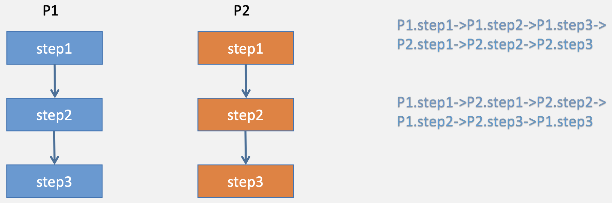
</div>

##### 穷举法

&emsp;&emsp;&ensp;利用“进程内部次序不变，进程间切换随机发生”这一特性进行所有可能执行顺序的穷举。 

##### 断点分析法

&emsp;&emsp;&ensp;抓住问题中的关键步骤，在此处设置断点，在此基础上进行分析和分类讨论。
&emsp;&emsp;&ensp;软件方法中的关键步骤：

<div style=" margin: 0 auto; max-width: 50%;">

</div>

* ${while(表达式)}$ 后加分号，代表如果表达式为真，则会重复执行这个循环直到表达式为假时才能够跳出循环。 
* 测试“忙则等待”：当 ${P1}$ 通过 ${while}$ 循环而没有进入退出区时，看 ${P2}$ 能否通过循环，再反向检查。 
* 测试“空闲则入”：看有没有一种可能性使表达式 ${1}$ 和表达式 ${2}$ 同时成立；如果没有 ${P2}$ 的话 ${P1}$ 能否通过循环，如果没有 ${P1}$ 的话 ${P2}$ 能否通过循环。 
* 测试“有限等待”：因 ${P2}$ 位于临界区，${P1}$ 卡在进入区，此时新来了一个 ${P2}$ 后依然会比 ${P1}$ 先进入临界区，则 ${P1}$ 不满足“有限等待”，会饥饿。 

##### 设置方案
* 第一次尝试：
    * 满足“忙则等待”，但是有时不满足“空闲则入”。
    * P0不在临界区，P1想要继续运行，但是必须等待P0。

<div style=" margin: 0 auto; max-width: 60%;">

</div>

* 第二次尝试：
  * 不满足“忙则等待”，存在软件操作的弊端，在修改标记之前可能会因进程调度未完成，导致别的进程查看标记时误入。

<div style=" margin: 0 auto; max-width: 60%;">

</div>

* 第三次尝试：
  * 满足“忙则等待”，但是不满足“空闲则入”。

<div style=" margin: 0 auto; max-width: 60%;">

</div>

* ${Peterson}$ 算法
  * 满足进程 ${Pi}$ 和 ${Pj}$ 之间互斥的经典的基于软件的解决方法（1981年）。

<div style=" margin: 0 auto; max-width: 35%;">

</div>

<div style=" margin: 0 auto; max-width: 60%;">

</div>

* ${Peterson}$ 算法分析
* 穷举法

<div style=" margin: 0 auto; max-width: 50%;">

</div>

<div style=" margin: 0 auto; max-width: 50%;">

</div>

* 断点分析法

<div style=" margin: 0 auto; max-width: 60%;">

</div>

<div style=" margin: 0 auto; max-width: 60%;">

</div>

<div style=" margin: 0 auto; max-width: 60%;">

</div>

<div style=" margin: 0 auto; max-width: 60%;">

</div>

<div style=" margin: 0 auto; max-width: 60%;">

</div>

* 基于软件方法的特点：复杂，需要考虑所有可能的执行顺序。；需要忙等待，浪费 ${CPU}$ 时间。

#### 基于硬件的同步解决方法

##### 互斥锁

&emsp;&emsp;&ensp;申请锁：若锁还没有被别的进程占用，则占用锁，否则一直等待到占用锁的进程释放锁。
&emsp;&emsp;&ensp;释放锁：占用锁的进程将被锁释放。

<div style=" margin: 0 auto; max-width: 30%;">

</div>

##### 互斥锁的实现

<div style=" margin: 0 auto; max-width: 50%;">

</div>

&emsp;&emsp;&ensp;思考：如果完全采用上述代码实现，会出现什么问题？
&emsp;&emsp;&ensp;回答：测试和实现分开进行，会导致因进程调度产生错误。

##### 自旋锁

<div style=" margin: 0 auto; max-width: 20%;">

</div>

&emsp;&emsp;&ensp;当进程申请锁失败时，会一直循环申请锁直到申请成功。
&emsp;&emsp;&ensp;进程申请锁失败时进程处于什么状态？（运行态+就绪态）
&emsp;&emsp;&ensp;运行态：**不停轮询时候属于运行态**。
&emsp;&emsp;&ensp;就绪态：如果因为进程调度（如时间片调度）使得进程下 ${CPU}$ 运行，此时属于就绪态。

##### 无忙等待锁

<div style=" margin: 0 auto; max-width: 20%;">

</div>

<div style=" margin: 0 auto; max-width: 20%;">

</div>

&emsp;&emsp;&ensp;当进程申请锁失败时，**会将进程阻塞等待其它进程释放锁后再将其唤醒**。

##### 锁的实现方法

&emsp;&emsp;&ensp;方法一：关中断

<div style=" margin: 0 auto; max-width: 50%;">

</div>

* 只对单 ${CPU}$ 系统有效。
* 关中断会导致其他问题。

&emsp;&emsp;&ensp;方法二：原子操作指令

<div style=" margin: 0 auto; max-width: 40%;">

</div>

* 现代 ${CPU}$ 体系结构都提供一些特殊的原子操作指令。
* 测试和置位（${Test-and-Set}$）指令：从内存单元中读取值；测试该值是否为 ${1}$（然后返回真或假）；内存单元值设置为 ${1}$。
* 交换指令（${exchange}$）：交换内存中的两个值。

<div style=" margin: 0 auto; max-width: 40%;">

</div>

* 使用 ${TS}$ 指令实现自旋锁（${spinlock}$）：自旋锁也不能实现 ${FCFS}$。

<div style=" margin: 0 auto; max-width: 30%;">

</div>

* 使用 ${TS}$ 指令实现无忙等待锁

<div style=" margin: 0 auto; max-width: 30%;">

</div>

#### 同步方法总结

&emsp;&emsp;&ensp;锁是一种高级的同步抽象方法，互斥可以使用锁来实现，需要硬件支持。
&emsp;&emsp;&ensp;常用的三种同步实现方法：禁用中断（仅限于单处理器）；软件方法（复杂）；原子操作指令（单处理器或多处理器均可）

### 信号量

&emsp;&emsp;&ensp;信号量（${semaphore}$）：信号量是操作系统提供的一种协调共享资源访问的方法。软件同步是平等线程间的一种同步协商机制，${OS}$ 是管理者，地位高于进程，用信号量表示系统资源的数量。
&emsp;&emsp;&ensp;信号量是一种抽象数据类型

* ${P()}$：由一个整形（${sem}$）变量和两个原子操作组成。${sem}$ 减 ${1}$，如果 ${sem<0}$，进入等待，否则继续。
* ${V()}$：${sem}$ 加 ${1}$，如果 ${sem≤}$，唤醒一个等待进程。

&emsp;&emsp;&ensp;信号量的特性：信号量是被保护的整数变量。初始化完成后，只能通过 ${P()}$ 和 ${V()}$ 操作修改；由操作系统保证，${PV}$ 操作是原子操作。${P()}$ 可能阻塞，${V()}$ 不会阻塞；通常假定信号量是“公平的”。线程不会被无限期阻塞在 ${P()}$ 操作，假定信号量等待按 ${FCFS}$ 排队。

#### 信号量的实现

<div style=" margin: 0 auto; max-width: 60%;">

</div>

#### 信号量分类

&emsp;&emsp;&ensp;可分为两种信号量：二进制信号量，资源数目为 ${0}$ 或 ${1}$；资源信号量，资源数目为任何非负值。两者等价，基于一个可以实现另一个
 
#### 信号量的使用
 
&emsp;&emsp;&ensp;互斥访问：临界区的互斥访问控制。
&emsp;&emsp;&ensp;条件同步：线程间的事件等待。

#### 用信号量实现临界区的互斥访问

&emsp;&emsp;&ensp;每个临界区设置一个信号量，其**初值为 ${1}$**。

<div style=" margin: 0 auto; max-width: 30%;">

</div>

##### 生产者-消费者问题

<div style=" margin: 0 auto; max-width: 40%;">

</div>

&emsp;&emsp;&ensp;有界缓冲区的生产者-消费者问题描述：一个或多个生产者在生成数据后放在一个缓冲区里，单个消费者从缓冲区取出数据处理，任何时刻只能有一个生产者或消费者可访问缓冲区。

##### 用信号量解决生产者-消费者问题

&emsp;&emsp;&ensp;问题分析：

1. 先写出不包含同步互斥条件的流程。

<div style=" margin: 0 auto; max-width: 60%;">

</div>

2. 分析每一步操作需要的前置条件。

<div style=" margin: 0 auto; max-width: 30%;">

</div>

3. 将前置条件转化为数学不等式。

<div style=" margin: 0 auto; max-width: 50%;">

</div>

4. 移项，变成 ${S>0}$ 的形式。

<div style=" margin: 0 auto; max-width: 50%;">

</div>

5. 将 ${S}$ 设置成信号量，按具体含义赋值。

<div style=" margin: 0 auto; max-width: 70%;">

</div>

6. 转化成代码形式

<div style=" margin: 0 auto; max-width: 50%;">

</div>

7. 消费者为上面的镜像步骤

<div style=" margin: 0 auto; max-width: 50%;">

</div>

8. 分析每一种信号量在什么操作后数值会增加，在此操作后加入对应 ${V}$ 操作。

<div style=" margin: 0 auto; max-width: 50%;">

</div>

<div style=" margin: 0 auto; max-width: 50%;">

</div>

&emsp;&emsp;&ensp;问题：${PV}$ 操作的顺序有影响吗？
                * 包有的，如上述 ${P(mutex)}$ 和 ${P(empty)}$ 如果调换顺序可能会导致死锁。如果 ${P}$ 完 ${mutex}$，但是缓冲区内没有空位，就没法 ${P}$ 掉 ${empty}$，此时需要消费者进程 ${V}$ 一个 ${empty}$ ；但是因为消费者需要先 ${p}$ 一个 ${mutex}$，而此时 ${mutex}$ 还未被生产者释放，于是产生死锁。

##### 读者写者问题

&emsp;&emsp;&ensp;问题描述：有一个文件，有读者和写者两种进程，有多个读者写者。当一个读者在读的时候，再来读者也可以进去读。但是有读者进程在读的时候，写者进程不能去写。如果有写者进程在写，读者进程也不能读，而且同时只能有一个写者进程在写。
&emsp;&emsp;&ensp;问题分析：
1. 先写出不包含同步互斥条件的流程。

<div style=" margin: 0 auto; max-width: 30%;">

</div>

2. 分析读者进程每种操作的前置条件。

<div style=" margin: 0 auto; max-width: 50%;">

</div>

<div style=" margin: 0 auto; max-width: 50%;">

</div>

<div style=" margin: 0 auto; max-width: 50%;">

</div>

3. 读写锁只应由读进程和写进程竞争，而读操作之间不应该对其进行竞争，对于这种同类型进程内部不竞争，不同类型进程之间竞争的资源，**通常会配套计数器来使用**。

<div style=" margin: 0 auto; max-width: 50%;">

</div>

<div style=" margin: 0 auto; max-width: 50%;">

</div>

4. 在同步互斥问题中，对多进程**共同修改的共享变量同样需要互斥访问**（如果有任何一个变量，**不管是信号量还是辅助变量，需要被修改，都应该是在互斥的环境下**）。


<div style=" margin: 0 auto; max-width: 30%;">

</div>

5. 分析写者进程每种操作的前置条件。

<div style=" margin: 0 auto; max-width: 50%;">

</div>

<div style=" margin: 0 auto; max-width: 50%;">

</div>

6. 分析各资源的释放条件。

<div style=" margin: 0 auto; max-width: 50%;">

</div>

<div style=" margin: 0 auto; max-width: 50%;">

</div>

7. 整合上述步骤，转化成代码的形式。

<div style=" margin: 0 auto; max-width: 50%;">

</div>

&emsp;&emsp;&ensp;问题进阶：同时只能有 ${4}$ 个进程读，阁下将如何应对？

<div style=" margin: 0 auto; max-width: 60%;">

</div>

<div style=" margin: 0 auto; max-width: 60%;">

</div>

&emsp;&emsp;&ensp;信号量和辅助变量的区别：
1. 对信号量只能进行初始化、${P}$ 操作和 ${V}$ 操作三种操作，**不能进行判断操作**，而**对 ${int}$ 型变量可以进行任何算术运算和判等操作**；
2. 信号量与一种竞争资源相对应，**可能引起进程的阻塞**；${int}$ 型变量作为分支的依据，通常要用在 ${if}$ 语句中，无论 ${if}$ 条件是否满足，**均不会造成进程的阻塞**，只会**形成不同的程序路径**；
3. 信号量的数值变化在**内核态下由操作系统完成**，${int}$ 型变量**由用户态来完成修改**。
&emsp;&emsp;&ensp;注意：特征 ${2}$ 是做题时判定选用信号量还是辅助变量的**根本因素**。

##### 理发师问题

&emsp;&emsp;&ensp;问题描述：理发店里有一位理发师、一把理发椅和 ${n}$ 把供等候理发的顾客坐的椅子。若没有顾客，理发师便在理发椅上睡觉，一位顾客到来时，顾客必须叫醒理发师。理发师正在理发时又有顾客来到，若有空椅子可坐，则坐下来等待，否则就离开。试用 ${PV}$ 操作实现，并说明信号量的定义和初值。
&emsp;&emsp;&ensp;“若有空椅子可坐，则坐下来等待，否则就离开”这个条件需要使用信号量还是 ${int}$ 型辅助变量来限制？为什么？

<div style=" margin: 0 auto; max-width: 20%;">

</div>

<div style=" margin: 0 auto; max-width: 40%;">

</div>

&emsp;&emsp;&ensp;后续转化为基本 ${PV}$ 问题，先不考虑同步互斥。

<div style=" margin: 0 auto; max-width: 40%;">

</div>

&emsp;&emsp;&ensp;“若没有顾客则睡觉”需要通过信号量还是辅助变量来实现？
&emsp;&emsp;&ensp;若没有顾客，则理发师进程被阻塞（睡觉），所以此处需要通过信号量来标识顾客。

<div style=" margin: 0 auto; max-width: 40%;">

</div>

&emsp;&emsp;&ensp;“若理发师在工作，则顾客休息”需要通过信号量还是辅助变量来实现？
&emsp;&emsp;&ensp;若理发师在工作，则顾客进程被阻塞（休息），所以此处需要通过信号量来标识理发师。

<div style=" margin: 0 auto; max-width: 40%;">

</div>

&emsp;&emsp;&ensp;补充 ${chairs}$ 变量相关的一些细节。

<div style=" margin: 0 auto; max-width: 40%;">

</div>

##### 利用信号量实现先来先服务

&emsp;&emsp;&ensp;先进先出控制可以保证后入的进程被阻塞，而且按被阻塞的顺序被唤醒。

<div style=" margin: 0 auto; max-width: 40%;">

</div>

<div style=" margin: 0 auto; max-width: 60%;">

</div>

### 管程

&emsp;&emsp;&ensp;管程（${Monitor}$）
&emsp;&emsp;&ensp;管程是一种用于多线程互斥访问共享资源的程序结构。采用面向对象方法，简化了线程间的同步控制；任一时刻**最多只有一个线程执行管程代码**；正在管程中的线程可临时放弃管程的互斥访问，等待事件出现时恢复。
&emsp;&emsp;&ensp;管程的使用：在对象/模块中，收集相关共享数据；定义访问共享数据的方法。
&emsp;&emsp;&ensp;管程的组成：一个锁，控制管程代码的互斥访问；${0}$ 或者多个条件变量，管理共享数据的并发访问。

<div style=" margin: 0 auto; max-width: 40%;">

</div>

#### 条件变量（Condition Variable）

&emsp;&emsp;&ensp;条件变量是管程内的等待机制。进入管程的线程因资源被占用而进入等待状态。**每个条件变量表示一种等待原因，对应一个等待队列**。
&emsp;&emsp;&ensp;${Wait()}$ 操作：将自己阻塞（无条件阻塞）在等待队列中，唤醒一个等待者或释放管程的互斥访问。
&emsp;&emsp;&ensp;${Signal()}$ 操作：将等待队列中的一个线程唤醒，如果等待队列为空，则等同空操作。

#### 条件变量的实现

&emsp;&emsp;&ensp;当某个进程在管程中阻塞了，别的进程也可以进入管程，详情看 ${wait}$ 中对锁的释放和获得。

<div style=" margin: 0 auto; max-width: 60%;">

</div>

#### 用管程解决生产者-消费者问题

<div style=" margin: 0 auto; max-width: 60%;">

</div>

#### 信号量与管程的对比

<div style=" margin: 0 auto; max-width: 60%;">

</div>

---

## 同步互斥（强化）

### 基本PV问题

&emsp;&emsp;&ensp;程序的执行流确定，对每个进程来说，若走完整个程序流程，则每一行代码都会执行到。进程只有可能阻塞，不可能改变执行路径。

#### 生产者消费者问题

&emsp;&emsp;&ensp;生产者消费者（${producer-customer}$）问题是一个非常著名的进程同步问题。它描述的是：生产者进程在生产“产品”，消费者进程则消费者这些“产品”，在生产者进程和消费者进程之间存在一个缓冲池（生产者将生产的产品放入缓冲池，消费者则消费该缓冲池中的产品）。所有生产者进程、消费者进程都是相互独立的（即以异步的方式运行），但他们之间同时必须保持同步（即不允许消费者进程到空缓冲区取产品，也不允许生产者进程向满缓冲区存入产品），与此同时对缓冲区的访问也必须是互斥的。

&emsp;&emsp;&ensp;不考虑同步、互斥条件，生产者消费者进程分别如何实现?

```cpp
producer() {
    produce an item;
    add the item into buffer;
}
```
```cpp
consumer() {
    get an item from buffer;
    consume the item;
}
```

&emsp;&emsp;&ensp;执行 ${add\quad the\quad item\quad into\quad buffer}$ 需要哪些条件？
&emsp;&emsp;&ensp;缓冲区空闲且缓冲区有空位。
&emsp;&emsp;&ensp;所以，“空位数 ${>0}$”是操作执行的必要条件，若不满足，则进程阻塞。因此，需要设计信号量 ${empty}$ 的取值等于“空位数”，显然，${empty}$ 的初始值为 ${n}$。

```cpp
Semaphore empty=n;
```
```cpp
producer() {
    produce an item;
    add the item into buffer;
}
```
```cpp
consumer() {
    get an item from buffer;
    consume the item;
}
```

&emsp;&emsp;&ensp;显然，“空位”的数量在“${get\quad an\quad item\quad from\quad buffer}$”时增加。

```cpp
Semaphore empty=n;
```
```cpp
producer() {
    produce an item;
    P(empty);
    add the item into buffer;
}
```
```cpp
consumer() {
    get an item from buffer;
    V(empty);
    consume the item;
}
```

&emsp;&emsp;&ensp;缓冲区空闲应该如何用信号量抽象？
&emsp;&emsp;&ensp;空闲条件可以抽象成初值为 ${1}$ 的信号量 ${mutex}$，其取值等于“${1-缓冲区中进程数}$”。显然，进程进入缓冲区时该取值减少，进程离开缓冲区时该取值增加。

```cpp
Semaphore empty=n;
Semaphore mutex=1;
```
```cpp
producer() {
    produce an item;
    P(empty);
    P(mutex);
    add the item into buffer;
    V(mutex);
}
```
```cpp
consumer() {
    P(mutex);
    get an item from buffer;
    V(empty);
    V(mutex);
    consume the item;
}
```

##### 占用共享空间的信号量抽象：锁

&emsp;&emsp;&ensp;对于一个共享区域，对它的访问可以抽象成一个互斥性信号量---锁。访问共享区相当于对该区域上锁，即 ${P(lock)}$，离开临界区则会解开锁，即 ${V(lock)}$，其它进程若检测到共享区上锁，**则进入阻塞态等待共享区域中的进程解锁**。为了与其它教材保持一致，本课程中我们有时也用 ${mutex}$ 作为共享区占用的抽象。

&emsp;&emsp;&ensp;执行 ${get\quad an\quad item\quad from\quad buffer}$ 需要哪些条件？
&emsp;&emsp;&ensp;缓冲区空闲且缓冲区有产品。
&emsp;&emsp;&ensp;同理，应当设置“产品”为信号量，并加入对应的 ${PV}$ 操作。

```cpp
Semaphore empty=n;
Semaphore mutex=1;
Semaphore full=1;
```
```cpp
producer() {
    produce an item;
    P(empty);
    P(mutex);
    add the item into buffer;
    V(mutex);
    P(full);
}
```
```cpp
consumer() {
    P(full);
    P(mutex);
    get an item from buffer;
    V(empty);
    V(mutex);
    consume the item;
}
```

#### 进程合作问题

&emsp;&emsp;&ensp;如图所示，三个合作进程 ${P1、P2、P3}$ 分别通过独占设备获取各自的数据 ${a、b、c}$，输入设备必须互斥的使用。
&emsp;&emsp;&ensp;三个设备对输入数据分别做如下计算：${P1:\quad x=a+b;}$ ${P2:\quad y=a*b;}$ ${P3:\quad z=y+c-a;}$
&emsp;&emsp;&ensp;最后，${P1}$ 进程通过所连接的打印机将 ${x、y、z}$ 都打印出来。请用信号量完成它们的同步。

<div style=" margin: 0 auto; max-width: 65%;">

</div>

&emsp;&emsp;&ensp;不考虑同步、互斥条件，进程 ${P1、P2、P3}$ 的各操作如何实现？

```cpp
P1() {
    输入 a;
    计算 x=a+b;
    打印 x、y、z;
}
```
```cpp
P2() {
    输入 b;
    计算 y=a*b;
}
```
```cpp
P3() {
    输入 c;
    计算 z=y+c-a;
}
```

&emsp;&emsp;&ensp;${P1}$ 进程“输入 ${a}$”、${P2}$ 进程“输入 ${b}$”、${P3}$ 进程“输入 ${c}$”需要什么条件？

```cpp
Semaphore mutex=1;
```
```cpp
P1() {
    P(mutex);
    输入 a;
    V(mutex);
    计算 x=a+b;
    打印 x、y、z;
}
```
```cpp
P2() {
    P(mutex);
    输入 b;
    V(mutex);
    计算 y=a*b;
}
```
```cpp
P3() {
    P(mutex);
    输入 c;
    V(mutex);
    计算 z=y+c-a;
}
```

&emsp;&emsp;&ensp;“计算 ${x=a+b}$”需要什么条件？
&emsp;&emsp;&ensp;${a、b}$ 已经输入。

```cpp
Semaphore mutex=1;
Semaphore Sb=0;
```
```cpp
P1() {
    P(mutex);
    输入 a;
    V(mutex);
    P(Sb);
    计算 x=a+b;
    打印 x、y、z;
}
```
```cpp
P2() {
    P(mutex);
    输入 b;
    V(Sb);
    V(mutex);
    计算 y=a*b;
}
```
```cpp
P3() {
    P(mutex);
    输入 c;
    V(mutex);
    计算 z=y+c-a;
}
```

&emsp;&emsp;&ensp;“打印 ${x、y、z}$”需要什么条件？
&emsp;&emsp;&ensp;${a、b}$ 已经输入。

```cpp
Semaphore mutex=1;
Semaphore Sb=0;
Semaphore Sy=0;
Semaphore Sz=0;
```
```cpp
P1() {
    P(mutex);
    输入 a;
    V(mutex);
    P(Sb);
    计算 x=a+b;
    P(Sy);
    P(Sz);
    打印 x、y、z;
}
```
```cpp
P2() {
    P(mutex);
    输入 b;
    V(Sb);
    V(mutex);
    计算 y=a*b;
    V(Sy);
}
```
```cpp
P3() {
    P(mutex);
    输入 c;
    V(mutex);
    计算 z=y+c-a;
    V(Sz);
}
```

&emsp;&emsp;&ensp;“计算 ${y=a*b}$”需要什么条件？
&emsp;&emsp;&ensp;${a、b}$ 已经输入。

```cpp
Semaphore mutex=1;
Semaphore Sb=0;
Semaphore Sy=Sz=0;
Semaphore Sa=0;
```
```cpp
P1() {
    P(mutex);
    输入 a;
    V(Sa);
    V(mutex);
    P(Sb);
    计算 x=a+b;
    P(Sy);
    P(Sz);
    打印 x、y、z;
}
```
```cpp
P2() {
    P(mutex);
    输入 b;
    V(Sb);
    V(mutex);
    P(Sa);
    计算 y=a*b;
    V(Sy);
}
```
```cpp
P3() {
    P(mutex);
    输入 c;
    V(mutex);
    计算 z=y+c-a;
    V(Sz);
}
```

&emsp;&emsp;&ensp;“计算 ${z=y+c-a}$”需要什么条件？
&emsp;&emsp;&ensp;${a、c、y}$ 已经输入或计算。

```cpp
Semaphore mutex=1;
Semaphore Sb=0;
Semaphore Sy=Sz=0;
Semaphore Sa=0;
```
```cpp
P1() {
    P(mutex);
    输入 a;
    V(Sa);
    V(mutex);
    P(Sb);
    计算 x=a+b;
    P(Sy);
    P(Sz);
    打印 x、y、z;
}
```
```cpp
P2() {
    P(mutex);
    输入 b;
    V(Sb);
    V(mutex);
    P(Sa);
    计算 y=a*b;
    V(Sy);
}
```
```cpp
P3() {
    P(mutex);
    输入 c;
    V(mutex);
    P(Sa);
    P(Sy);
    计算 z=y+c-a;
    V(Sz);
}
```

&emsp;&emsp;&ensp;${Sa}$ 和 ${Sy}$ 需要 ${P}$ 两次，因此也需要 ${V}$ 两次。

```cpp
Semaphore mutex=1;
Semaphore Sb=0;
Semaphore Sy=Sz=0;
Semaphore Sa=0;
```
```cpp
P1() {
    P(mutex);
    输入 a;
    V(Sa);
    V(Sa);
    V(mutex);
    P(Sb);
    计算 x=a+b;
    P(Sy);
    P(Sz);
    打印 x、y、z;
}
```
```cpp
P2() {
    P(mutex);
    输入 b;
    V(Sb);
    V(mutex);
    P(Sa);
    计算 y=a*b;
    V(Sy);
    V(Sy);
}
```
```cpp
P3() {
    P(mutex);
    输入 c;
    V(mutex);
    P(Sa);
    P(Sy);
    计算 z=y+c-a;
    V(Sz);
}
```

&emsp;&emsp;&ensp;有没有可以优化的点？

<div style=" margin: 0 auto; max-width: 35%;">
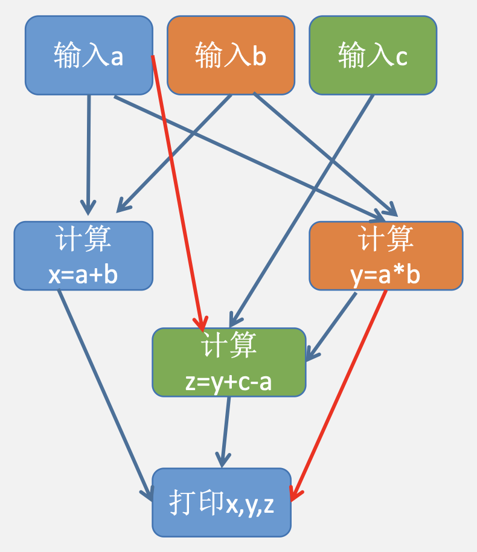
</div>

&emsp;&emsp;&ensp;标红部分 ${PV}$ 操作（对应图中红色的边）是否有意义？
&emsp;&emsp;&ensp;前向边：若有路径 ${a\to c}$ 有另一路径 ${a\to d\to e\to c}$ 则称前者为后者的前向边。${DFS}$ 可以找到前向边。
&emsp;&emsp;&ensp;对于较为复杂的依赖关系，可以转化为有向无环图来分析，并且可以通过去除图中的“前向边”来简化代码。

```cpp
Semaphore mutex=1;
Semaphore Sb=0;
Semaphore Sy=Sz=0;
Semaphore Sa=0;
```
```cpp
P1() {
    P(mutex);
    输入 a;
    V(Sa);
    V(mutex);
    P(Sb);
    计算 x=a+b;
    P(Sz);
    打印 x、y、z;
}
```
```cpp
P2() {
    P(mutex);
    输入 b;
    V(Sb);
    V(mutex);
    P(Sa);
    计算 y=a*b;
    V(Sy);
}
```
```cpp
P3() {
    P(mutex);
    输入 c;
    V(mutex);
    P(Sy);
    计算 z=y+c-a;
    V(Sz);
}
```

#### 自行车问题

&emsp;&emsp;&ensp;设自行车生产线上有一个箱子，其中有 ${N}$ 个位置（${N>3}$），每个位置可存放一个车架或一个车轮。又设有 ${3}$ 名工人，其活动分别为：

<div style=" margin: 0 auto; max-width: 60%;">

</div>

&emsp;&emsp;&ensp;请用信号量和 ${PV}$ 操作完成三位工人的协作，要求**不包含死锁**。
&emsp;&emsp;&ensp;首先，不考虑同步、互斥条件，各进程的各操作如何实现？

```cpp
worker1() {
    while(1) {
        加工一个车架;
        车架放入箱中;
    }
}
```
```cpp
worker2() {
    while(1) {
        加工一个车轮;
        车轮放入箱中;
    }
}
```
```cpp
worker3() {
    while(1) {
        箱中取一车架;
        箱中取俩车轮;
        组装成一台车;
    }
}
```

&emsp;&emsp;&ensp;何时会死锁？
&emsp;&emsp;&ensp;例如箱子中有 ${n-1}$ 个车架；例如箱子里全是轮子。但是由于 ${worker3}$ 的“箱中取一车架；箱中取俩车轮；组装成一台车；”操作是原子操作，所以会发生死锁。
&emsp;&emsp;&ensp;${worker1}$ 中“车架放入箱中”这个操作能够正常执行的条件是什么？
&emsp;&emsp;&ensp;箱子是空闲的；箱子中有空位；**箱子中车架数量 ${<n-2}$**。注意为什么是 ${<n-2}$，因为此时设置的信号量要保证操作能够继续进行，依题意可知当箱中车架数量等于 ${n-2}$ 时，就已经不能再放入了，因此只有在 ${<n-2}$ 时才可以继续放入。
&emsp;&emsp;&ensp;**移项**：${n-2-车架数>0}$，则信号量 ${E\_shelf}$ 的取值为“${n-2-车架数}$”，显然它在放入车架时减少，取出车架时增加。

```cpp
Semaphore mutex=1;
Semaphore empty=n;
Semaphore E_shelf=n-2;
```
```cpp
worker1() {
    while(1) {
        加工一个车架;
        p(E_shelf);
        P(empty);
        P(mutex);
        车架放入箱中;
        V(mutex);
    }
}
```
```cpp
worker2() {
    while(1) {
        P(empty);
        P(mutex);
        加工一个车轮;
        车轮放入箱中;
        V(mutex);
    }
}
```
```cpp
worker3() {
    while(1) {
        P(mutex);
        箱中取一车架;
        V(E_shelf);
        箱中取俩车轮;
        V(mutex);
        V(empty)*3;
        组装成一台车;
    }
}
```

&emsp;&emsp;&ensp;车轮放入箱中同理。要确保箱子是空闲的；箱子中有空位；**箱子中车轮数量 ${<n-1}$**

```cpp
Semaphore mutex=1;
Semaphore empty=n;
Semaphore E_shelf=n-2;
Semaphore E_wheel=n-1;
Semaphore shelfs=wheels=0;
```
```cpp
worker1() {
    while(1) {
        加工一个车架;
        P(E_shelf);
        P(empty);
        P(mutex);
        车架放入箱中;
        V(shelfs);
        V(mutex);
    }
}
```
```cpp
worker2() {
    while(1) {
        加工一个车轮;
        P(E_wheel);
        P(empty);
        P(mutex);
        车轮放入箱中;
        V(wheels);
        V(mutex);
    }
}
```
```cpp
worker3() {
    while(1) {
        P(shelfs);
        P(wheels)*2;
        P(mutex);
        箱中取一车架;
        V(E_shelf);
        箱中取俩车轮;
        V(E_wheel)*2;
        V(mutex);
        V(empty)*3;
        组装成一台车;
    }
}
```

#### 水果问题

&emsp;&emsp;&ensp;桌子上有一只盘子，每次只能向其中放入一只水果。爸爸专向盘子中放苹果，妈妈专向盘子中放桔子，儿子专等吃盘子中的桔子，女儿专等吃盘子中的苹果。只有盘子为空时，爸爸或妈妈才可向盘子中放一只水果；仅当盘子中有自己需要的水果时，儿子或女儿才可以从盘子中取出。用信号量机制解决该问题。

&emsp;&emsp;&ensp;首先，不考虑同步、互斥条件，各进程的各操作如何实现？
&emsp;&emsp;&ensp;这里只考虑妈妈和儿子，爸爸和女儿类似。

```cpp
mother() {
    while(1) {
        放入苹果;
    }
}
```
```cpp
son() {
    while(1) {
        取出苹果;
        吃苹果;
    }
}
```

&emsp;&emsp;&ensp;${mother}$ 放苹果有什么限制条件？
&emsp;&emsp;&ensp;盘子为空；水果数 ${<1}$
&emsp;&emsp;&ensp;${son}$ 取苹果有什么限制条件？
&emsp;&emsp;&ensp;有苹果。

```cpp
Semaphore mutex=1;
Semaphore apple=0;
```
```cpp
mother() {
    while(1) {
        P(plate);
        放入苹果;
        V(apple);
    }
}
```
```cpp
son() {
    while(1) {
        P(apple);
        取出苹果;
        V(plate);
        吃苹果；
    }
}
```

#### 小球问题

<div style=" margin: 0 auto; max-width: 70%;">
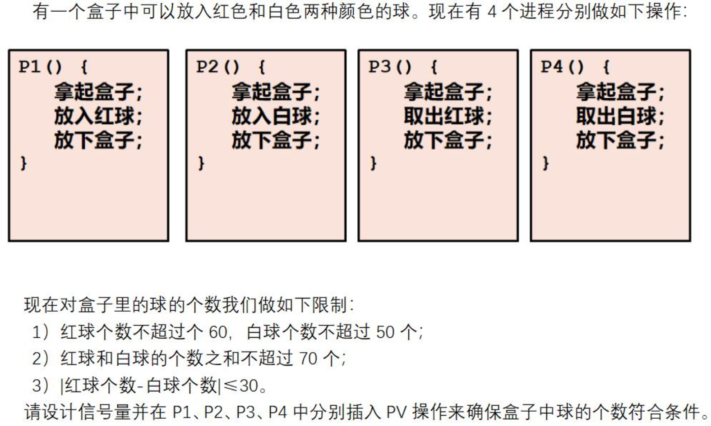
</div>

&emsp;&emsp;&ensp;首先，只考虑盒子间的互斥。

```cpp
Semaphore mutex=1;
```
```cpp
P1() {
    while(1) {
        P(mutex);
        拿起盒子;
        放入红球;
        放下盒子;
        V(mutex);
    }
}
```
```cpp
P2() {
    while(1) {
        P(mutex);
        拿起盒子;
        放入白球;
        放下盒子;
        V(mutex);
    }
}
```
```cpp
P3() {
    while(1) {
        P(mutex);
        拿起盒子;
        取出红球;
        放下盒子;
        V(mutex);
    }
}
```
```cpp
P4() {
    while(1) {
        P(mutex);
        拿起盒子;
        取出白球;
        放下盒子;
        V(mutex);
    }
}
```

&emsp;&emsp;&ensp;为了满足红球的条件：${红球个数<60；红球+白球<70；|红球-白球|≤30}$。其中 ${|红球-白球|≤30}$ 怎么去绝对值？应该考虑当放入红球时候，此时是应该关注“红球-白球”还是“白球-红球”的数量？显然是放入红球时，“红球-白球”才可能不满足条件。

```cpp
Semaphore mutex=1;
Semaphore E_red=60; // 距离红球上限数
Semaphore E_white=50;   // 距离白球上限数
Semaphore E_sum=70; // 距离总球数上限数
Semaphore E_red_A_white=30; // 红-白≤30
Semaphore E_white_A_red=30; // 白-红≤30
Semaphore red=0;    // 红球数量
Semaphore white=0;    // 白球数量
```
```cpp
P1() {
    while(1) {
        P(E_red);
        P(E_sum);
        P(E_red_A_white);
        P(mutex);
        拿起盒子;
        放入红球;
        V(red);
        V(E_white_A_red);
        放下盒子;
        V(mutex);
    }
}
```
```cpp
P2() {
    while(1) {
        P(E_white);
        P(E_sum);
        P(E_white_A_red);
        P(mutex);
        拿起盒子;
        放入白球;
        V(white);
        V(E_red_A_white);
        放下盒子;
        V(mutex);
    }
}
```
```cpp
P3() {
    while(1) {
        P(red);
        P(E_white_A_red);
        P(mutex);
        拿起盒子;
        取出红球;
        V(E_red);
        V(E_sum);
        V(E_red_A_white);
        放下盒子;
        V(mutex);
    }
}
```
```cpp
P4() {
    while(1) {
        P(white);
        P(E_red_A_white);
        P(mutex);
        拿起盒子;
        取出白球;
        V(E_white);
        V(E_sum);
        V(E_white_A_red);
        放下盒子;
        V(mutex);
    }
}
```

### 带条件分支的PV问题

&emsp;&emsp;&ensp;需要进行同步互斥的进程可能会因为当前条件的不同而选择不同的程序执行路径，甚至可能在某些分支下跳过对信号量的 ${P}$ 操作和 ${V}$ 操作。

<div style=" margin: 0 auto; max-width: 25%;">
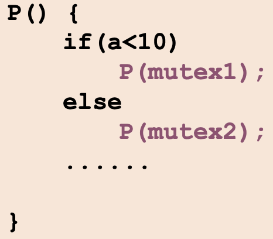
</div>

#### 读者、写者问题

&emsp;&emsp;&ensp;有一个文件，可以允许同时有多个进程进行读操作，但是只允许一个进程同时进行写操作，并且文件也不能够在读操作的同时进行写操作。请设计读进程和写进程，以满足上述条件。
&emsp;&emsp;&ensp;仅考虑读者写者需要竞争文件的访问权限，如何设计读者写者？

```cpp
Semaphore rwlock=1;
```
```cpp
reader() {
    读文件;
}
```
```cpp
writer() {
    P(rwlock);
    写文件;
    V(rwlock);
}
```

&emsp;&emsp;&ensp;读文件需要满足什么条件？是否一定要申请 ${rwlock}$？
&emsp;&emsp;&ensp;有其他读者在读时候会直接进入，否则申请 ${rwlock}$。
&emsp;&emsp;&ensp;在 ${PV}$ 问题中，“是否存在”问题通常依靠引入计数器来实现。而计数器作为全局变量同样需要一把专用的锁来保证互斥访问。

```cpp
Semaphore rwlock=1;
int count=0;
Semaphore mutex=1;
```
```cpp
reader() {
    P(mutex);
    if(count==0)
        P(rwlock);
    count++;
    V(mutex);
    读文件;
    P(mutex);
    count--;
    if(count==0)
        V(mutex);
}
```
```cpp
writer() {
    P(rwlock);
    写文件;
    V(rwlock);
}
```

&emsp;&emsp;&ensp;信号量和辅助变量的区别：
1. 对信号量只能进行初始化、${P}$ 操作和 ${V}$ 操作三种操作，**不能进行判断操作**，而**对 ${int}$ 型变量可以进行任何算术运算和判等操作**；
2. 信号量与一种竞争资源相对应，**可能引起进程的阻塞**；${int}$ 型变量作为分支的依据，通常要用在 ${if}$ 语句中，无论 ${if}$ 条件是否满足，**均不会造成进程的阻塞**，只会**形成不同的程序路径**；
3. 信号量的数值变化在**内核态下由操作系统完成**，${int}$ 型变量**由用户态来完成修改**。
&emsp;&emsp;&ensp;注意：特征 ${2}$ 是做题时判定选用信号量还是辅助变量的**根本因素**。

#### 理发师问题

&emsp;&emsp;&ensp;理发店里有一位理发师、一把理发椅和 ${n}$ 把供等候理发的顾客坐的椅子。若没有顾客，理发师便在理发椅上睡觉，一位顾客到来时，顾客必须叫醒理发师。理发师正在理发时又有顾客来到，若有空椅子可坐，则坐下来等待，否则就离开。试用 ${PV}$ 操作实现，并说明信号量的定义和初值。
&emsp;&emsp;&ensp;无论有无空椅子，进程都不会阻塞，只会影响执行路径，因此应该用辅助变量来标识椅子数量，并配套互斥信号量。

```cpp
Semaphore mutex=1;
int chairs=n;
```
```cpp
customer() {
    P(mutex);
    if(chairs==0) {
        V(mutex);
        离开;
    }
    else {
        chairs--;
        V(mutex);
        理发;
    }
}
```
```cpp
baber() {
    while(1) {
        // 若没有顾客则睡觉
        理发;
    }
}
```

&emsp;&emsp;&ensp;“若没有顾客则睡觉”需要通过信号量还是辅助变量来实现？“若理发师工作则顾客休息”需要通过信号量还是辅助变量来实现？

```cpp
Semaphore mutex=1;
int chairs=n;
Semaphore customer=0;
```
```cpp
customer() {
    P(mutex);
    if(chairs==0) {
        V(mutex);
        离开;
    }
    else {
        chairs--;
        V(mutex);
        V(customer);
        P(barber);  // 等待理发师工作结束
        P(mutex);
        chairs++;
        V(mutex);
        理发;
    }
}
```
```cpp
baber() {
    while(1) {
        // 若没有顾客则睡觉
        P(customer);
        理发;
        V(barber);
    }
}
```

#### 读者写者问题（01版）

&emsp;&emsp;&ensp;在读者写者问题的基础上增加如下条件：若写者写完的内容**还没有被任何一个读者读取**，则新的写进程不能进行写操作，直到有至少一个读进程进行了读操作。“上一个访问文件的是读者”这个条件应该用信号量还是辅助变量来实现？

```cpp
Semaphore rwlock=1;
int count=0;
Semaphore mutex=1;
Semaphore writable=1;
```
```cpp
reader() {
    P(mutex);
    if(count==0) P(rwlock);
    count++;
    V(mutex);
    读文件;
    P(mutex);
    count--;
    if(count==0){
        V(mutex);
    }
}
```
```cpp
writer() {
    P(writable);
    P(rwlock);
    写文件;
    V(rwlock);
}
```

&emsp;&emsp;&ensp;读进程读完文件后是否一定会进行 ${V(writable)}$？
&emsp;&emsp;&ensp;**不是**！只有之前一个进程是 ${writer}$ 进程，才会 ${V(writeable)}$。否则会导致 ${writable}$ 的值 ${>1}$。
&emsp;&emsp;&ensp;标识条件“前一个进程是否为 ${writer}$ 进程”应该用辅助变量还是信号量？
&emsp;&emsp;&ensp;**辅助变量**！因为无论前一个进程是否为 ${writer}$，读者进程本身都不会被阻塞，只是会选择是否 ${V(writeable)}$。一般而言，${flag}$ 变量因为会被修改，所以需要配套的信号量。但是我们可以通过一些小 ${trick}$ 让它蹭其他信号量完成互斥访问。

```cpp
Semaphore rwlock=1;
int count=0;
Semaphore mutex=1;
Semaphore writable=1;
bool flag=true;
```
```cpp
reader() {
    P(mutex);
    if(count==0) {
        P(rwlock);
        if(flag==true) {
            V(writable);
            flag=false;
        }
    }
    count++;
    V(mutex);
    读文件;
    P(mutex);
    count--;
    if(count==0){
        V(rwlock);
        V(mutex);
    }
}
```
```cpp
writer() {
    P(writable);
    P(rwlock);
    flag=true;
    写文件;
    V(rwlock);
}
```

### 进阶PV模型

#### 先进先出模型

&emsp;&emsp;&ensp;“先进先出”模型又称为“公平策略模型”，指先申请进入共享区域的进程最终将先进入共享区域。

<div style=" margin: 0 auto; max-width: 25%;">
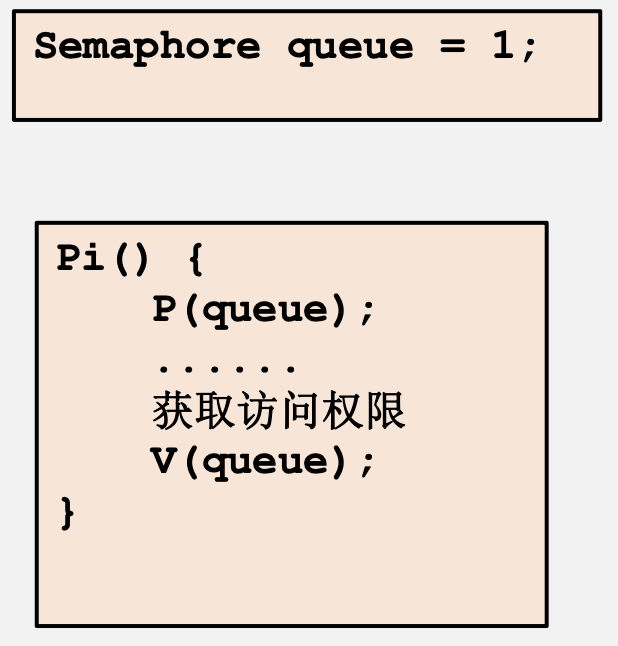
</div>

&emsp;&emsp;&ensp;“公平策略”下的读者写者问题实际上是先进先出模型和普通读者写者模型的嵌套。
&emsp;&emsp;&ensp;读写进程应该何时执行 ${V(queue)}$？
&emsp;&emsp;&ensp;获取 ${rwlock}$ 后！因为此时后序进程不可能抢先当前读写进程进入访问区了。

```cpp
Semaphore rwlock=1;
int count=0;
Semaphore mutex=1;
Semaphore queue=1;
```
```cpp
reader() {
    P(queue);
    P(mutex);
    if(count==0)
        P(rwlock);
    V(queue);
    count++;
    V(mutex);
    读文件;
    P(mutex);
    count--;
    if(count==0)
        V(mutex);
}
```
```cpp
writer() {
    P(queue);
    P(rwlock);
    V(queue);
    写文件;
    V(rwlock);
}
```

&emsp;&emsp;&ensp;利用信号量 ${queue}$ 本身先进先出的特性，第一个想要访问共享区的进程通过了 ${P(queue)}$ 并获取访问权限，其他进程则按先来后到的顺序阻塞在了信号量 ${queue}$ 的内置队列上。当进程 ${P_i}$ 获取了访问权限不用担心被别的进程后来居上时，则释放 ${queue}$ 信号量，此时队列中最先进入的进程将被唤醒并做出同样的操作，以此类推，因此实现了对共享区的“先进先出”式访问。

##### 双向道路问题

&emsp;&emsp;&ensp;有一条道路，从左往右最多可以走三辆车，从右往左最多可以走两辆车，而且道路上不能出现相向而行的车，并且无论是左行的车还是右行的车，必须满足“先来先行”的规则，请设计信号量和算法完成这一任务。
&emsp;&emsp;&ensp;如何实现同类型进程可以同时进入共享区，不同类型进程必须互斥进入共享区？

```cpp
Semaphore mutex_L=mutex_R=passLock=1;
int count_L=count_R=0;
Semaphore limit_L=3;
Semaphore limit_R=2;
Semaphore queue=1;  // 实现先进先出
```
```cpp
from_L() {
    P(queue);
    P(mutex_L);
    count_L++;
    if(count_L==1)
        P(passLock);
    V(queue);
    V(mutex_L);
    P(limit_L);
    pass;
    V(limit_L);
    P(mutex_L);
    count_L--;
    if(count_L==0)
    V(passLock);
    V(mutex_L);
}
```
```cpp
from_R() {
    P(queue);
    P(mutex_R);
    count_R++;
    if(count_R==1)
        P(passLock);
    V(queue);
    V(mutex_R);
    P(limit_R);
    pass;
    V(limit_R);
    P(mutex_R);
    count_L--;
    if(count_L==0)
    V(passLock);
    V(mutex_R);
}
```

#### 单向阻塞模型

&emsp;&emsp;&ensp;当有进程 ${P_1}$ 触发条件后，所有进程 ${P_2}$ 都会在某处被阻塞直到 ${P_1}$ 对其唤醒，而 ${P_2}$ 不能反向阻塞 ${P_1}$。

<div style=" margin: 0 auto; max-width: 40%;">
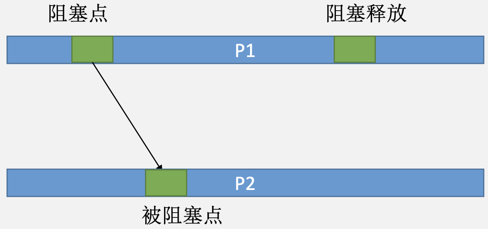
</div>

&emsp;&emsp;&ensp;如何实现阻塞所有 ${P_2}$ 类型的进程而**只需要释放一次就可以释放全部被阻塞的 ${P_2}$ 进程**？
&emsp;&emsp;&ensp;通过一个互斥信号量 ${mutex}$，只有第一个 ${P_2}$ 进程会进入到被阻塞点并检查阻塞条件决定是否被阻塞，而由于第一个 ${P_2}$ 进程被阻塞后依然占用了 ${mutex}$，所以后续的 ${P_2}$ 进程并不能进入与 ${P_1}$ 进程相关的检测区域，直到第一个 ${P_2}$ 进程被释放通过被阻塞点，才会唤醒另一个 ${P_2}$ 进程，让其进入监测点。若此时阻塞条件已经消失，则后续所有的 ${P_2}$ 进程都会通过；若阻塞条件重新出现了，则后续的 ${P_2}$ 进程会再次被阻塞并阻止其他 ${P_2}$ 进程进入。

```CPP
Semaphore mutex=1;
```
```cpp
P2() {
    P(mutex);
    // 实现该进程被P1阻塞和释放
    V(mutex);
}
```

&emsp;&emsp;&ensp;${P_2}$ 每个时间点只有一个进程可以申请访问共享区，因此 ${P_1}$ 先天占优。

<div style=" margin: 0 auto; max-width: 45%;">
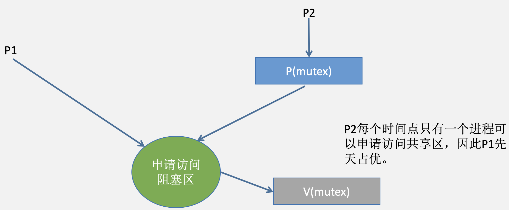
</div>

&emsp;&emsp;&ensp;在 ${P_1}$ 之前，即使有无数个 ${P_2}$ 申请 ${queue}$，也只有唯一一个 ${P_2}$ 能够先进入 ${queue}$。

<div style=" margin: 0 auto; max-width: 50%;">
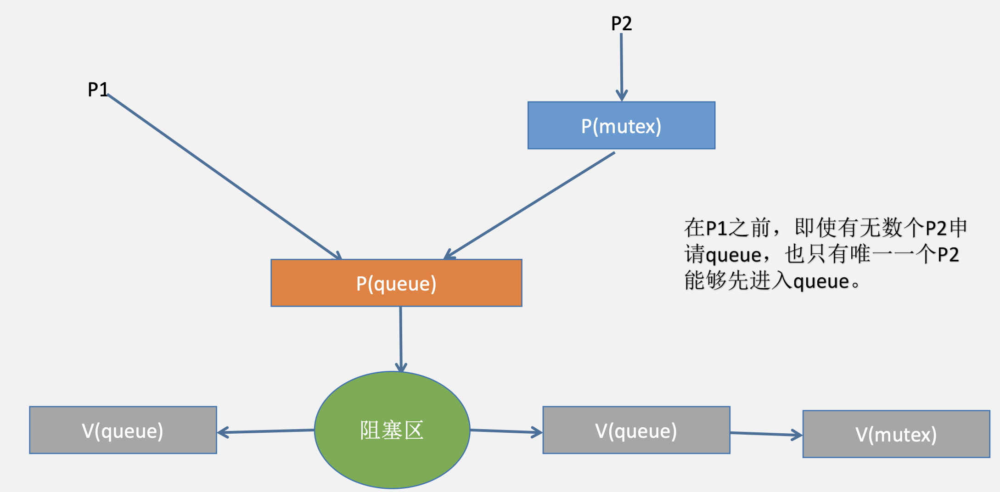
</div>

&emsp;&emsp;&ensp;只有 ${P_1}$ 在执行完阻塞点处的代码，${P_2}$ 才能执行被阻塞区的代码。 

```cpp
Semaphore mutex=1;
Semaphore queue=1;
Semaphore cmutex=1;
int cnt=0;
```
```cpp
P1(){
    P(cmutex);
    if(cnt==0)
        P(queue);
    cnt++;
    V(cmutex);
    // 阻塞点
    P(cmutex);
    cnt--;
    if(cnt==0)
        V(queue);
    V(cmutex);
}
```
```cpp
P2() {
    P(mutex);
    P(queue);
    V(queue);
    V(mutex);
    // 被阻塞区
}
```

##### 单向阻塞模型的应用

&emsp;&emsp;&ensp;读者写者问题（写者优先）：有一个文件，可以允许同时有多个进程进行读操作，但是只允许一个进程同时进行写操作，并且文件也不能够在读操作的同时进行写操作。请设计读进程和写进程，以满足上述条件。并且满足：当有写进程在等待时，读进程不能访问文件。

```cpp
Semaphore mutex=1;
int count=0;
Semaphore cmutex=1;
Semaphore queue=1;
Semaphore rwlock=1;
int cnt=0;
Semaphore rmutex=1;
```
```cpp
reader() {
    
}
writer(){
    P(cmutex);
    if(cnt==0)
        P(queue);
    cnt++;
    V(cmutex);

    P(rwlock);
    写文件;
    V(rwlock);

    P(cmutex);
    cnt--;
    if(cnt==0)
        V(queue);
    V(cmutex);
}
```
```cpp
reader() {
    P(mutex);
    P(queue);
    V(queue);
    V(mutex);
    P(mutex);

    if(count==0)
        P(rwlock);
    count++;
    V(rmutex);
    读文件;
    P(rmutex);
    count--;
    if(count==0)
        V(rmutex);
}
```

&emsp;&emsp;&ensp;死锁相关的 ${PV}$ 问题

<div style=" margin: 0 auto; max-width: 80%;">

</div>

```cpp
Semaphore chopsticks[n] = {1,1,...,1};
Semaphore plate = m;
```
```cpp
philosopher i(){
    while(1){
        思考;
        P(plate);
        if(i%2==0){
            P(chopsticks[(i+n-1)%n]);
            P(chopsticks[i]);
        }
        else{
            P(chopsticks[i]);
            P(chopsticks[(i+n-1)%n]);
        }
        吃饭;
        V(plate);
        V(chopsticks[(i+n-1)%n]);
        V(chopsticks[i]);
    }
}
```

<div style=" margin: 0 auto; max-width: 80%;">
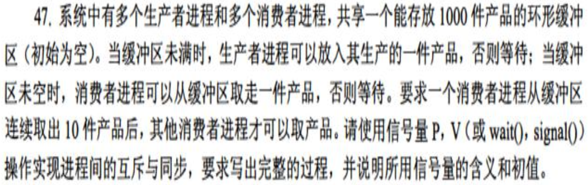
</div>

&emsp;&emsp;&ensp;一个进程连续取 ${10}$ 次如何实现呢?
&emsp;&emsp;&ensp;只需要消费者进程占有缓冲区之后，禁止别的消费者进程进入缓冲区即可。因为可以设置一个信号量 ${cmutex}$ 来阻止其它消费者进程进入。

```cpp
Semaphore mutex=1, cmutex=1;
Semaphore empty=n, full=0;
```
```cpp
producer() {
    P(empty);
    P(mutex);
    // produce
    V(full);
    V(mutex);
}
```
```cpp
consumer() {
    P(cmutex);
    for(i=1; i<=10; i++) {
        P(full);
        P(mutex);
        // consume
        V(empty);
        V(mutex);
    }
    V(cmutex);
}
```

&emsp;&emsp;&ensp;信号量的实现与特征
&emsp;&emsp;&ensp;信号量**可以实现**先进先出和让权等待。

```cpp
class Semaphore {
    int sem;
    waitqueue q;
}
```
```cpp
Semaphore::P() {
    sem--;
    if(sem<0) {
        Add this thread t to q;
        block(p);
    }
}
```
```cpp
Semaphore::V() {
    sem++;
    if(sem<=0) {
        Remove a thread t from q;
        wake(t);
    }
}
```

&emsp;&emsp;&ensp;真题：下图给出了整数型信号量 ${S}$ 的 ${wait()}$ 和 ${signal()}$ 的功能描述以及两种实现。

1. 为什么在 ${wait()}$ 和 ${signal()}$ 操作中对信号量 ${S}$ 必须互斥访问？
    这样可以防止对 ${S}$ 的修改出现错误。
2. 分别说明方法 ${1}$ 和方法 ${2}$ 是否正确？为什么？
    方法一错误方法二正确。方法一会造成进程一直占用 ${CPU}$。
3. 用户程序能够使用开/关中断指令实现临界区互斥访问？为什么？
    不能，因为开关中断是特权指令。如果让用户可以使用开关中断，可能导致用户进程一直占用 ${CPU}$。

```cpp
// 功能描述
Semaphore S;
```
```cpp
wait(S) {
    while(S<=0);
    S=S-1;
}
```
```cpp
signal(S) {
    S=S+1;
}
```
```cpp
// 方法1
Semaphore S;
```
```cpp
wait(S) {
    关中断;
    while(S<=0);
    S=S-1;
    开中断;
}
```
```cpp
signal(S) {
    关中断;
    S=S+1;
    开中断;
}
```
```cpp
// 方法2
Semaphore S;
```
```cpp
wait(S) {
    关中断;
    while(S<=0){
        开中断;
        关中断;
    }
    S=S-1;
}
```
```cpp
signal(S) {
    关中断;
    S=S+1;
    开中断;
}
```

&emsp;&emsp;&ensp;样例代码分析：

```cpp
process i{
    while(Test&Set(&lock));
    Critical section;
    lock=0;
}
```

&emsp;&emsp;&ensp;${Test\& Set}$：原语，执行期间不会被中断。若 ${lock}$ 为 ${1}$ 则一直循环，若 ${lock}$ 为 ${0}$ 则置为 ${1}$ 并跳过循环。所以此代码可以实现若 ${lock}$ 初始为 ${1}$ 则执行 ${while}$ 死循环而无法进入临界区；若 ${lock}$ 为 ${0}$ 则置位进入临界区并阻止别的进程进入临界区。此方法阻止进程进入的方式是**让其执行死循环，这个过程不涉及对进程的阻塞和唤醒，进程状态处于就绪态和运行态的交替中**。
&emsp;&emsp;&ensp;此方法**不能实现让权等待，不能节约 ${CPU}$ 资源，不能节约调度和切换资源，不能阻塞和唤醒进程**，所有此类说法均为错误。
&emsp;&emsp;&ensp;此方法不能实现先进先出，因为当 ${lock}$ 为 ${0}$ 的时候，被卡在死循环上的进程能进入临界区取决于谁正好第一个被调度。

&emsp;&emsp;&ensp;并发进程的指令执行顺序问题
&emsp;&emsp;&ensp;有两个并发执行的进程 ${P_1}$ 和 ${P_2}$，共享初值为 ${1}$ 的变量 ${x}$。加 ${1}$ 和减 ${1}$ 操作的指令序列分别如下所示：

```cpp
P1 {    // 对 x 执行加一操作
    load R1, x
    inc R1
    store R1
}
P2 {    // 对 x 执行减一操作
    load R2, x
    dec R2
    store R2
}
```

&emsp;&emsp;&ensp;两个操作完成后，${x}$ 的值为？
&emsp;&emsp;&ensp;原则：同一进程指令的先后顺序不能改变，不同进程指令的执行顺序随机组合，**即任何时间点都可能发生进程切换**。

&emsp;&emsp;&ensp;死锁概念易错点：

1. 死锁避免**并不限制进程申请资源的顺序**，而是判定进程的申请资源请求是否需要满足，**限制资源申请顺序的方法属于死锁预防**。
2. 银行家算法的起点是进程给出一个资源申请序列，操作系统判断如果同意该申请是否会造成不安全状态。如果不会造成不安全状态则满则该申请，否则不满足。检测当前状态是否为不安全状态检测算法，它**是银行家算法的主体，但不是全部**。
3. 死锁状态一定是不安全状态，不安全状态不一定是死锁状态。
4. 死锁检测看的是当前各进程实际上申请的资源是否能够得到满足，而不安全状态检测则关注各进程可能需要的最大的资源数，这是二者的不同，请注意区分。

&emsp;&emsp;&ensp;**证明**：若一个进程按 ${pid}$ 来分配资源：即有多个进程请求同一类资源时，优先满足 ${pid}$ 较小的那个进程，则不存在死锁情况。
&emsp;&emsp;&ensp;对任何一个资源来说，它不可能被小 ${pid}$ 的资源请求而被大 ${pid}$ 的资源占有，也就是说只看进程的话，资源分配图存在拓扑排序 ${0，1，2，3.......}$。而**存在拓扑排序的图不存在环**，因此破坏了循环等待条件。

---

## 死锁问题

&emsp;&emsp;&ensp;由于竞争资源或者通信关系，两个或更多线程在执行中出现，永远相互等待只能由其他进程引发的事件。
&emsp;&emsp;&ensp;死锁示例：单向通行桥梁

<div style=" margin: 0 auto; max-width: 25%;">

</div>

&emsp;&emsp;&ensp;桥梁只能单向通行；桥的每个部分可视为一个资源。对向行驶车辆在桥上相遇可能出现死锁，解决方法：一个方向的车辆倒退（资源抢占和回退）。对向行驶车辆在桥上相遇，由于一个方向的持续车流，另一个方向的车辆无法通过桥梁。可能发生饥饿

### 进程访问资源的流程

&emsp;&emsp;&ensp;资源类型 ${R_1，R_2，…，R_m}$，如：${CPU}$ 执行时间、内存空间、${I/O}$ 设备等。
&emsp;&emsp;&ensp;每类资源 ${R_i}$ 有 ${W_i}$ 个实例。
&emsp;&emsp;&ensp;进程访问资源的流程：

1. 请求/获取，申请空闲资源；
2. 使用/占用，进程占用资源；
3. 释放，资源状态由占用变成空闲。

### 资源分类

&emsp;&emsp;&ensp;可重用资源（${Reusable\quad Resource}$）：资源不能被删除且在任何时刻只能有一个进程使用。进程释放资源后，其他进程可重用。
&emsp;&emsp;&ensp;可重用资源示例：
* 硬件：处理器、${I/O}$ 通道、主和副存储器、设备等。
* 软件：文件、数据库和信号量等数据结构。
&emsp;&emsp;&ensp;可能出现死锁：每个进程占用一部分资源并请求其他资源。

&emsp;&emsp;&ensp;消耗资源（${Consumable\quad Resource}$）：资源创建和销毁。
&emsp;&emsp;&ensp;消耗资源示例：${I/O}$ 缓冲区的中断、信号、消息等；
&emsp;&emsp;&ensp;可能出现死锁：进程间**相互等待接收对方的消息**。

### 资源分配图

&emsp;&emsp;&ensp;描述资源和进程间的分配和占用关系的有向图。
&emsp;&emsp;&ensp;两类顶点：

* 系统中的所有进程：${P = \{P_1, P_2, …, P_n \}}$
* 系统中的所有资源：${R = \{R_1, R_2, …, R_n \}}$

&emsp;&emsp;&ensp;两类有向边：

* 资源请求边：进程 ${P_i}$ 请求资源 ${R_j：P_i \to R_j}$
* 资源分配边：资源 ${R_j}$ 已分配给进程 ${P_i：R_j \to P_i}$ 

<div style=" margin: 0 auto; max-width: 25%;">
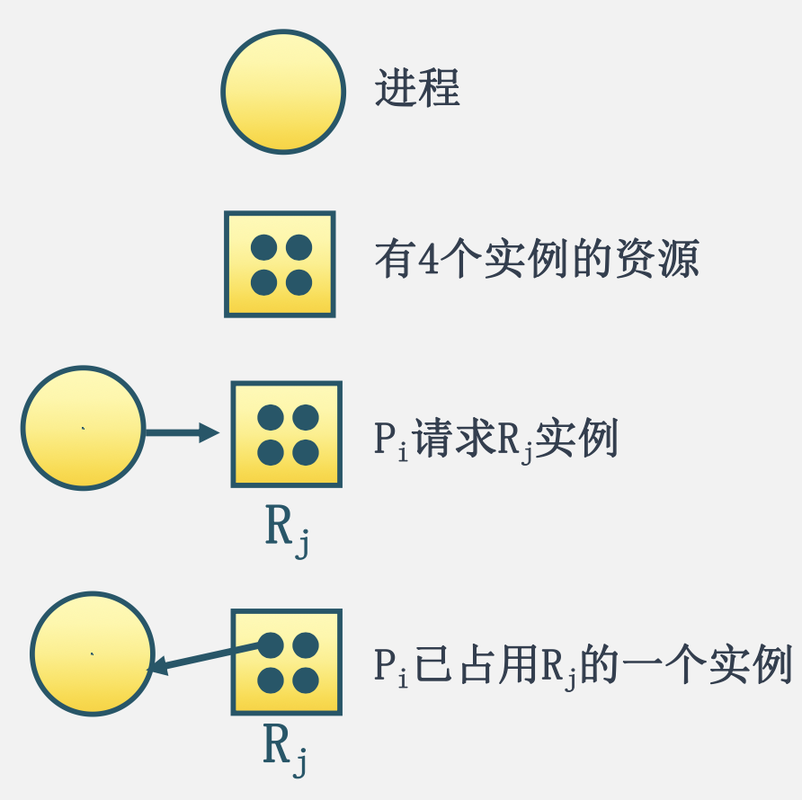
</div>

### 出现死锁的必要条件

* **互斥**：任何时刻**只能有一个进程使用一个进程资源实例**。
* **持有并等待**：进程保持至少一个资源，并**正在等待获取**其他进程持有的资源。
* **非抢占**：资源**只能在进程使用后自愿释放**。
* **循环等待**：存在等待进程集合 ${\{P_0，P_1，…，P_n\}}$，${P_0}$ 正在等待 ${P_1}$ 所占用的资源，${P_1}$ 在等待 ${P_2}$ 所占用的资源，…，${P_{n-1}}$ 在等待 ${P_n}$ 所占用的资源，${P_n}$ 在等待 ${P_0}$ 所占用的资源。

### 死锁处理方法

#### 死锁预防（Deadlock Prevention）

&emsp;&emsp;&ensp;确保系统永远不会进入死锁状态。
&emsp;&emsp;&ensp;死锁预防的方法：

##### 限制申请方式

&emsp;&emsp;&ensp;**互斥**：把互斥的共享资源封装成**可同时访问**。
&emsp;&emsp;&ensp;**持有并等待**：进程请求资源时，要求它不持有任何其他资源；仅允许进程在开始执行时，一次请求所有需要的资源；资源利用率低。
&emsp;&emsp;&ensp;**非抢占**：如进程请求不能立即分配的资源，**则释放已占有的资源**；只在**能够同时获得所有需要资源时，才执行分配操作**。
&emsp;&emsp;&ensp;**循环等待**：对资源排序，要求进程按顺序请求资源。

##### 信号量问题中的死锁预防

&emsp;&emsp;&ensp;信号量天然具备的特性：

* 互斥：一个信号量**同时只能被一个进程获取**。
* 持有并等待：可以在 ${P()}$ 完一个信号量后 ${P()}$ 另一个信号量。
* 非抢占：信号量除非资源进行 ${V()}$ 操作，否则不会被释放。
* 循环等待：因此信号量问题中必须破坏循环等待条件，**否则可能造成死锁**。

#### 哲学家就餐问题

<div style=" margin: 0 auto; max-width: 80%;">

</div>

&emsp;&emsp;&ensp;筷子资源申请图：

<div style=" margin: 0 auto; max-width: 20%;">

</div>

<div style=" margin: 0 auto; max-width: 50%;">

</div>

&emsp;&emsp;&ensp;死锁产生原因：循环等待。

<div style=" margin: 0 auto; max-width: 20%;">

</div>

&emsp;&emsp;&ensp;若规定**奇数号先取右边再取左边，偶数号先取左边再取右边**，则可以破坏环状结构，即循环等待。

<div style=" margin: 0 auto; max-width: 20%;">

</div>

&emsp;&emsp;&ensp;规定先取盘子再取筷子的话，资源分配图会因为盘子的加入而产生环吗？

<div style=" margin: 0 auto; max-width: 20%;">

</div>

&emsp;&emsp;&ensp;具体实现：

```cpp
Semaphor chopsticks[4]={1, 1, 1, 1};
Semaphor plate=m;
```
```cpp
philosopheri(){
    // 思考
    P(plate);
    if(i%2==0){
        P(chopsticks[(i+n-1)%n]);
        P(chopsticks[i]);
        // 吃饭
    }
    else {
        P(chopsticks[i]);
        P(chopsticks[(i+n-1)%n]);
        // 吃饭
    }
}
```

#### 死锁避免（Deadlock Avoidance）

&emsp;&emsp;&ensp;在使用前进行判断，只允许不会出现死锁的进程请求资源。利用额外的先验信息，在分配资源时判断是否会出现死锁，只在不会死锁时分配资源：要求进程申明需要资源的最大数目；限定提供与分配的资源数量，确保满足进程的最大需求；**动态检查的资源分配状态，确保不会出现环形等待**。
&emsp;&emsp;&ensp;系统分配资源的安全状态：当进程请求资源时，系统判断分配后是否处于安全状态。若系统处于安全状态，则针对所有已占用进程，存在安全序列。
&emsp;&emsp;&ensp;如：序列 ${<P_1, P_2, …, P_n>}$ 是安全的:

* ${P_i要求的资源≤当前可用资源+所有P_j持有资源，其中j<i；}$
* ${如P_i的资源请求不能立即分配，则P_i等待所有P_j（j<i）完成；}$
* ${P_i完成后，P_{i+1}可得到所需资源，执行并释放所分配的资源；}$
* ${最终整个序列的所有P_i都能获得所需资源。}$

#### 安全状态与死锁的关系

<div style=" margin: 0 auto; max-width:15%;">

</div>

&emsp;&emsp;&ensp;系统处于安全状态，一定没有死锁；系统处于不安全状态，可能出现死锁，避免死锁就是确保系统不会进入不安全状态。

#### 银行家算法（Banker’s Algorithm）

&emsp;&emsp;&ensp;银行家算法是一个**避免死锁**产生的算法。以银行借贷分配策略为基础，判断并保证系统处于安全状态。
&emsp;&emsp;&ensp;客户在第一次申请贷款时，申明所需最大资金量，在满足所有贷款要求并完成项目时，及时归还。
&emsp;&emsp;&ensp;在客户贷款数量不超过银行拥有的最大值时，银行家尽量满足客户需要。
&emsp;&emsp;&ensp;类比：

* 银行家 - 操作系统
* 资金  - 资源
* 客户  - 申请资源的线程

&emsp;&emsp;&ensp;数据结构：

* ${n}$ = 线程数量，${m}$ = 资源类型数量；
* ${Max}$（总需求量）：${n*m}$ 矩阵，线程 ${T_i}$ 最多请求类型 ${R_j}$ 的资源 ${Max[i,j]}$ 个实例；
* ${Available}$（剩余空闲量）：长度为 ${m}$ 的向量，当前有 ${Available[j]}$ 个类型 ${R_j}$ 的资源实例可用。
* ${Allocation}$（已分配量）：${n*m}$ 矩阵，线程 ${T_i}$ 当前分配了 ${Allocation[i, j]}$ 个 ${R_j}$ 的实例。
* ${Need}$（未来需要量）：${n*m}$ 矩阵，线程 ${T_i}$ 未来需要 ${Need[i, j]}$ 个 ${R_j}$ 资源实例。${Need[i, j] = Max[i, j] - Allocation[i, j]}$

##### 安全状态判断（脑补的，并不是真实存在）

<div style=" margin: 0 auto; max-width: 60%;">

</div>

&emsp;&emsp;&ensp;安全判断示例 ${1}$

<div style=" margin: 0 auto; max-width: 50%;">

</div>

<div style=" margin: 0 auto; max-width: 50%;">

</div>

<div style=" margin: 0 auto; max-width: 50%;">

</div>

<div style=" margin: 0 auto; max-width: 50%;">

</div>

&emsp;&emsp;&ensp;安全判断示例 ${2}$

<div style=" margin: 0 auto; max-width: 50%;">

</div>

<div style=" margin: 0 auto; max-width: 50%;">

</div>

##### 银行家算法实现

<div style=" margin: 0 auto; max-width: 50%;">

</div>

#### 死锁检测和恢复（Deadlock Detection&Recovery）

&emsp;&emsp;&ensp;在检测到运行系统进入死锁状态后，进行恢复。
&emsp;&emsp;&ensp;特点：

* 允许系统进入死锁状态。
* 维护系统的资源分配图。
* 定期调用死锁检测算法来搜索图中是否存在死锁。
* 出现死锁时，用死锁恢复机制进行恢复。

##### 死锁检测算法

&emsp;&emsp;&ensp;数据结构：

* ${Available}$：长度为 ${m}$ 的向量，每种类型可用资源的数量。
* ${Allocation}$：一个 ${n*m}$ 矩阵，当前分配给各个进程每种类型资源的数量。

&emsp;&emsp;&ensp;具体实现：

<div style=" margin: 0 auto; max-width: 50%;">

</div>

&emsp;&emsp;&ensp;死锁检测算法的使用：
&emsp;&emsp;&ensp;死锁检测的时间和周期选择依据：死锁多久可能会发生；多少进程需要被回滚。
&emsp;&emsp;&ensp;资源图可能有多个循环：难以分辨“造成”死锁的关键进程

##### 死锁恢复

&emsp;&emsp;&ensp;进程终止：终止所有的死锁进程，一次只终止一个进程直到死锁消除，终止进程的顺序应该是：

* 进程的优先级
* 进程已运行时间以及还需运行时间
* 进程已占用资源
* 进程完成需要的资源
* 终止进程数目
* 进程是交互还是批处理

&emsp;&emsp;&ensp;资源抢占：**选择最小成本目标为被抢占进程**；**进程回退**，返回到一些安全状态，重启进程到安全状态；**可能出现饥饿**，同一进程可能一直被选作被抢占者。

&emsp;&emsp;&ensp;由应用进程处理死锁：通常操作系统忽略死锁，这是大多数操作系统（包括 ${UNIX}$）的做法。

---

## 进程地址空间与线程（强化）

<div style=" margin: 0 auto; max-width: 60%;">
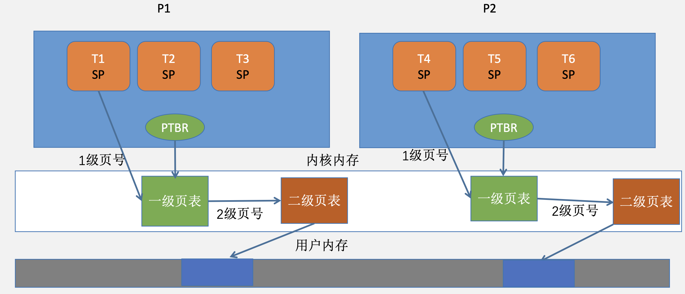
</div>

&emsp;&emsp;&ensp;进程切换后，由于逻辑页向物理页的**映射关系**发生了变化，所以 ${TLB}$ 会失效。又因为访问的物理地址也不相同，所以 **${Cache}$ 也不一定会命中**。
&emsp;&emsp;&ensp;访问的权限检查：该过程与地址映射过程一样，由 ${MMU}$ 硬件自动完成。

<div style=" margin: 0 auto; max-width: 60%;">
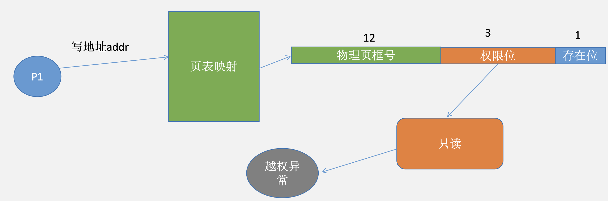
</div>

### 内存管理模拟题

<div style=" margin: 0 auto; max-width: 70%;">

</div>

&emsp;&emsp;&ensp;1）上述表格中哪一项不是页表项中真实存在的内容？
&emsp;&emsp;&ensp;虚拟页号，页表的本质是页表项构成的数组，虚拟页号是作为下标来索引页表项的，因此页表项中不需要包含虚拟页号。
&emsp;&emsp;&ensp;2）进程先后访问了以下地址，请画出每次访问后的页表内容，并给出缺页次数。
&emsp;&emsp;&ensp;${C5FH}$;${B83H}$;${4ABH}$;${1CCH}$。
&emsp;&emsp;&ensp;依据存在位可以知道，进程此时拥有的两个物理页框是 ${7}$ 号物理页框和 ${8}$ 号物理页框。而操作系统给进程分配的物理页框数为 ${2}$，在局部置换算法中，分配给该进程的物理页框是不会发生变化的。存在位为 ${0}$ 的页表项中保存的物理页框号**没有实际意义**。
&emsp;&emsp;&ensp;初始时物理页框中的页面情况如下所示：页框上方的数字表示物理页框号，二元组分别表示该页框中放入的虚拟页面号和访问位。

<div style=" margin: 0 auto; max-width: 20%;">
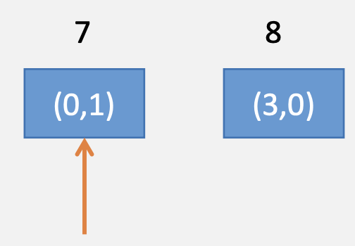
</div>

1. 访问 ${C5FH}$，页面号为高 ${2}$ 位，即 ${(11)=3}$；

<div style=" margin: 0 auto; max-width: 70%;">
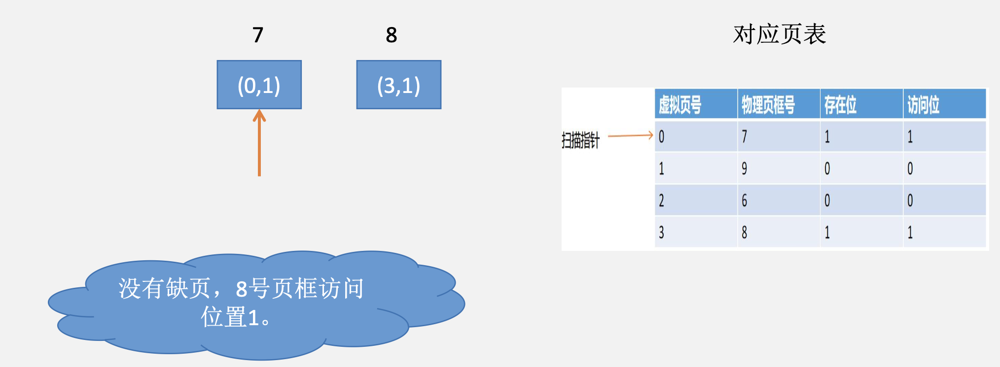
</div>

2. 访问 ${B83H}$，页面号为高 ${2}$ 位，即 ${(10)=2}$，发起缺页置换算法；

<div style=" margin: 0 auto; max-width: 30%;">
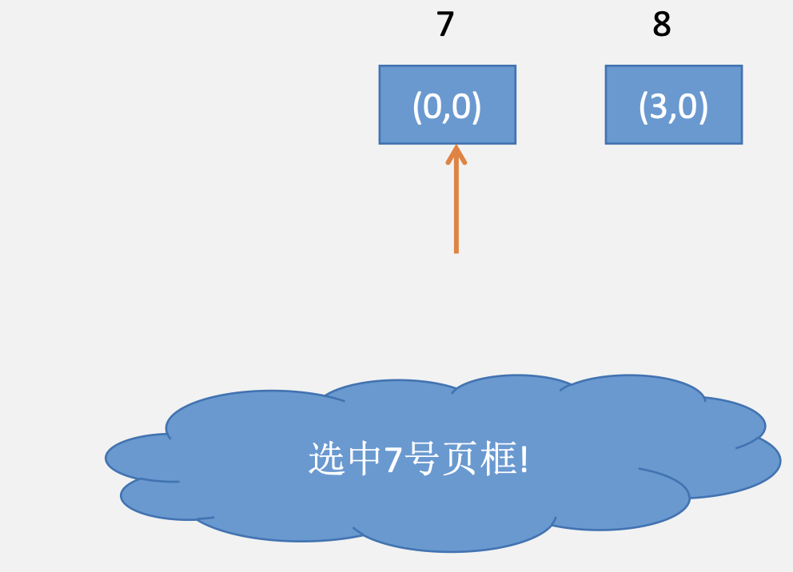
</div>

<div style=" margin: 0 auto; max-width: 70%;">
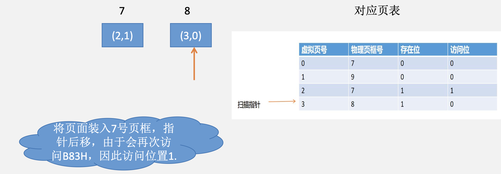
</div>

3. 访问 ${4ABH}$，页面号为高 ${2}$ 位，即 ${(01)=1}$，发起缺页置换算法；

<div style=" margin: 0 auto; max-width: 30%;">
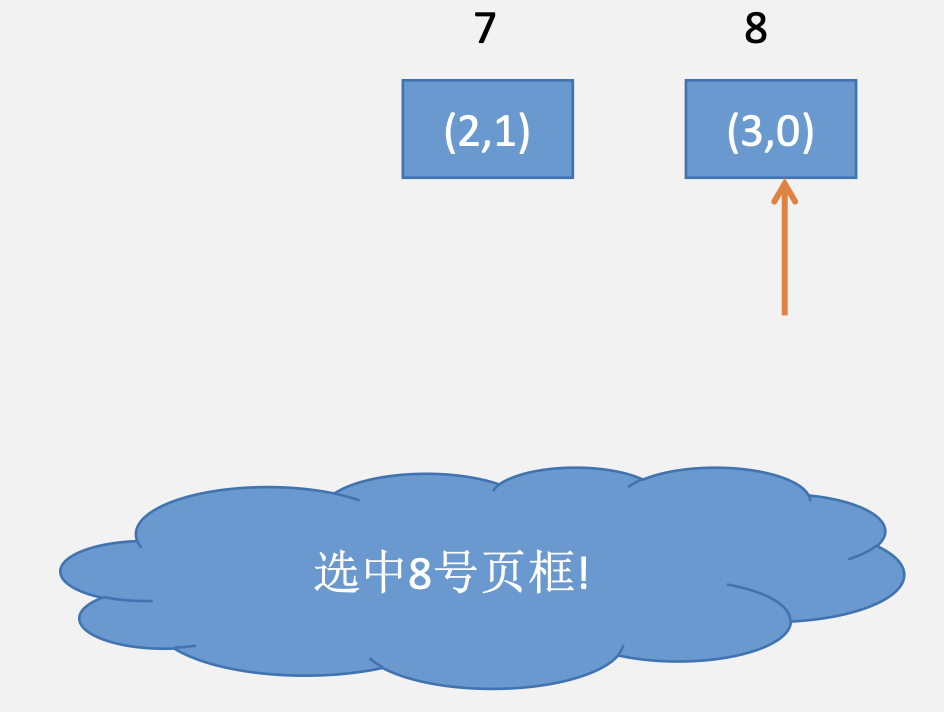
</div>

<div style=" margin: 0 auto; max-width: 70%;">
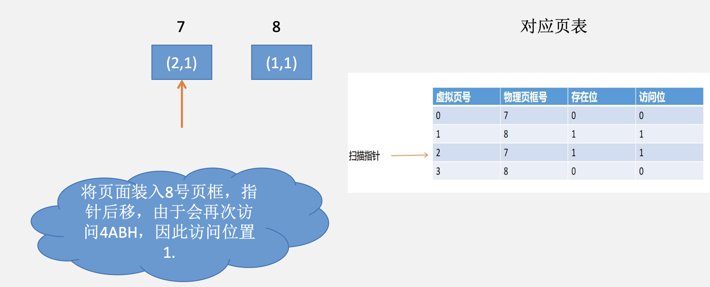
</div>

3. 访问 ${1CCH}$，页面号为高 ${2}$ 位，即 ${(00)=0}$，发起缺页置换算法；

<div style=" margin: 0 auto; max-width: 30%;">
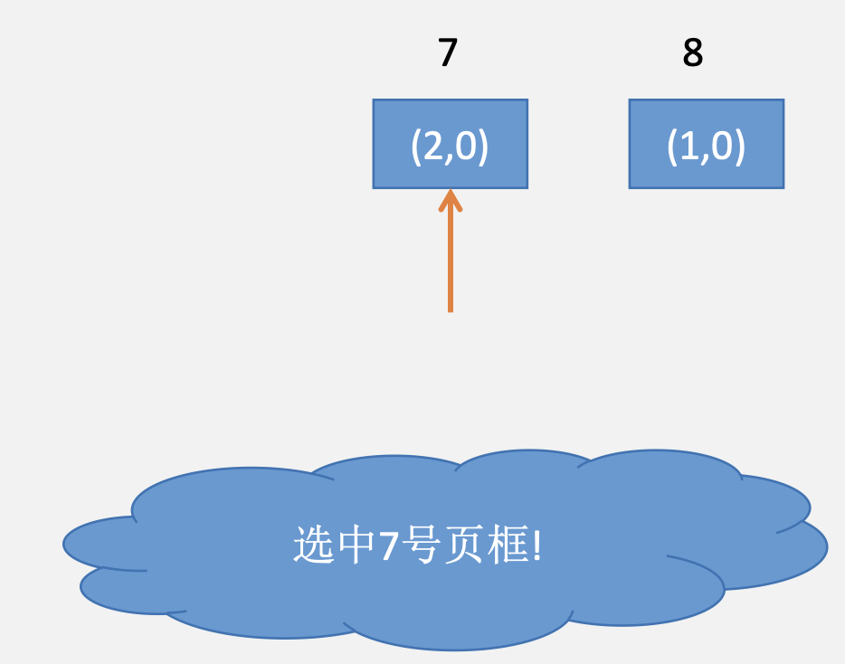
</div>

<div style=" margin: 0 auto; max-width: 70%;">
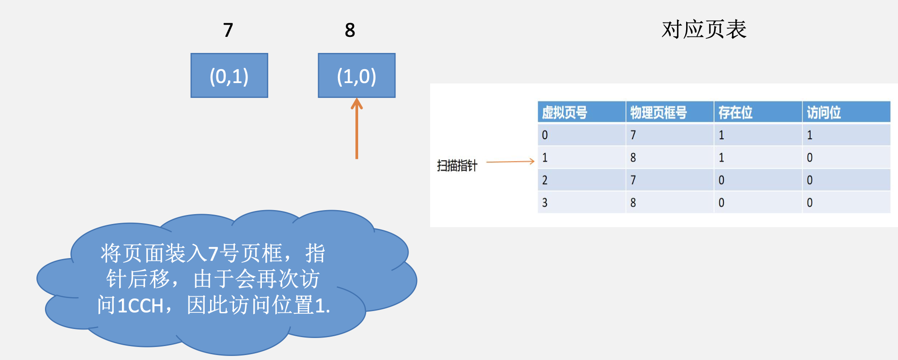
</div>

## 内存分配相关知识点导图（强化）

<div style=" margin: 0 auto; max-width: 90%;">
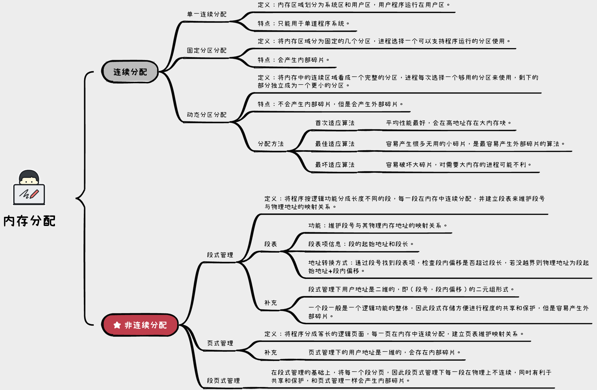
</div>

### 内部碎片和外部碎片

&emsp;&emsp;&ensp;内部碎片的产生原因：

<div style=" margin: 0 auto; max-width: 40%;">
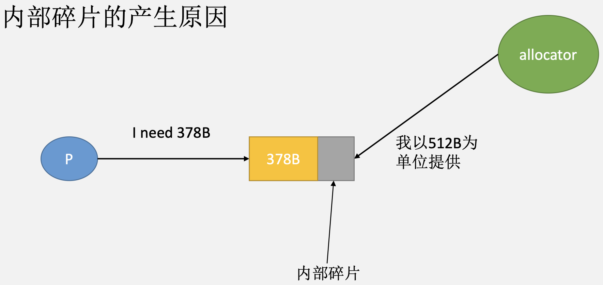
</div>

&emsp;&emsp;&ensp;内部碎片是由于采用固定大小的内存分区，当一个进程不能完全使用分给它的固定内存区域时就产生了内部碎片，通常内部碎片难以完全避免。文件分配文件块的情况同理。
&emsp;&emsp;&ensp;哪些地方会出现内部碎片？

<div style=" margin: 0 auto; max-width: 40%;">

</div>

&emsp;&emsp;&ensp;外部碎片的产生原因：

<div style=" margin: 0 auto; max-width: 40%;">

</div>

&emsp;&emsp;&ensp;分析算法存不存在外部碎片的方法：考虑一些**很小的分配单位被释放后是否很难再被使用**。
&emsp;&emsp;&ensp;哪些地方会出现内部碎片？

<div style=" margin: 0 auto; max-width: 40%;">
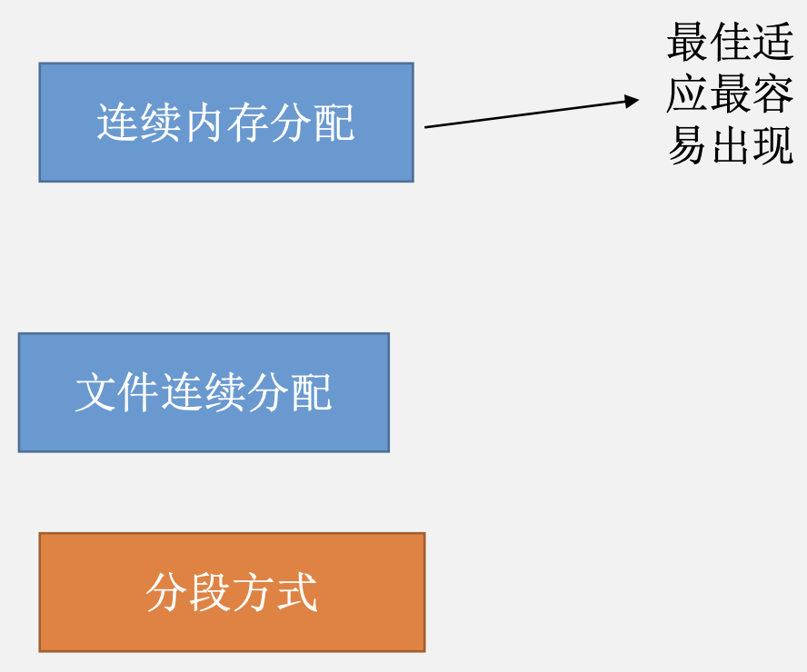
</div>

### 分段方式易错点

&emsp;&emsp;&ensp;段对用户程序员可见（页是不可见的），段是由用户程序员划分的。
&emsp;&emsp;&ensp;段不仅仅是一个基本存储单位，更是一个**基本功能单位**。
&emsp;&emsp;&ensp;段比页更容易**实现程序共享和保护**，因为可以。

### 真题分析

<div style=" margin: 0 auto; max-width: 70%;">
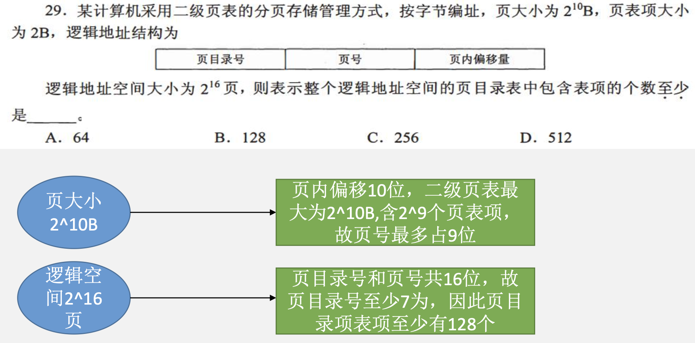
</div>

&emsp;&emsp;&ensp;除了顶级页表外，下面的页表最多只能占一个页。