# 图

## 图的定义

定义：图G由顶点的有穷非空集合V和边的集合E组成，记为${G=(V, E)}$。
简单图：图中不存在某顶点到自身的边，且不存在重复的边。

<div style=" margin: 0 auto; max-width: 30%;">
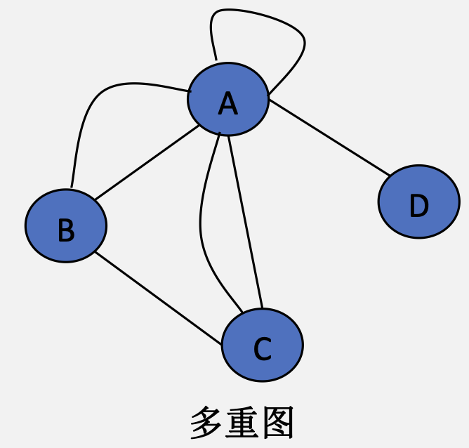
</div>

多重图：顶点有直接与自身相连的边（自环），或无向图中任意两个顶点之间有多余的边直接相连。

<div style=" margin: 0 auto; max-width: 30%;">
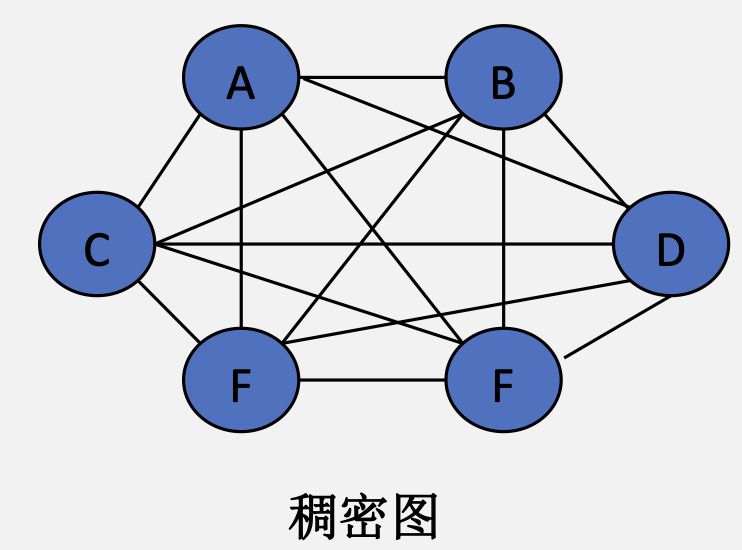
</div>

稠密图、稀疏图：根据边的数目进行界定，一般图G满足${|E|<|V|*log|V|}$，可以将图G看为稀疏图。

<div style=" margin: 0 auto; max-width: 60%;">
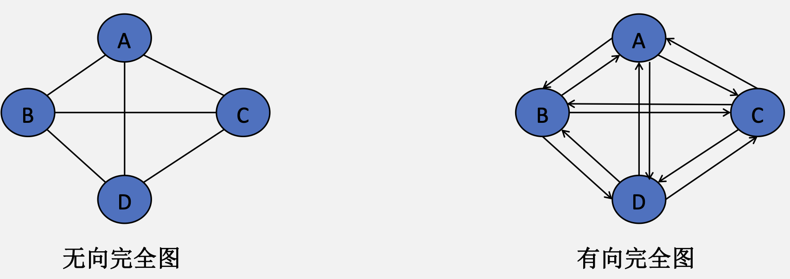
</div>

无向完全图：由n个顶点组成的无向图中，任意两顶点之间都存在边，共有${\frac{n(n-1)}{2}}$条边。
有向完全图：由n个顶点组成的有向图中，任意两顶点之间存在方向相反的两条 边，共有${n(n-1)}$条边。

### 有向图

<div style=" margin: 0 auto; max-width: 30%;">
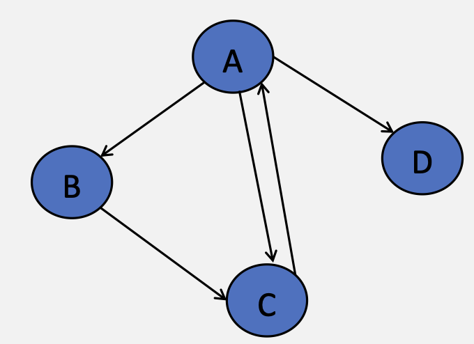
</div>

&emsp;&emsp;&ensp;每条边(弧)都有方向。
&emsp;&emsp;&ensp;如：顶点对<A,C>是有序的，表示从A到C的一条弧，A为弧尾，C为弧头。<A,C>与<C,A>是不同的两条弧。

### 无向图

<div style=" margin: 0 auto; max-width: 30%;">
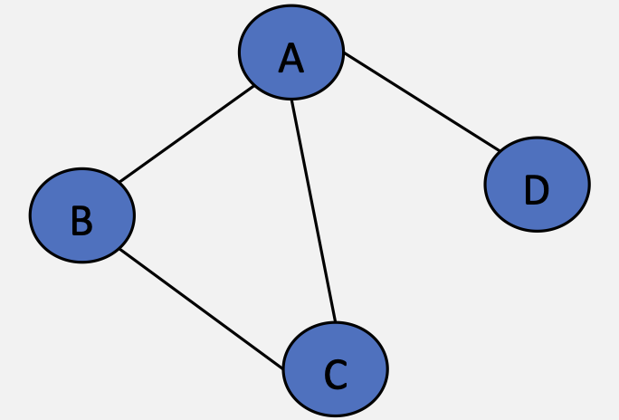
</div>

每条边都没有方向。
如：顶点对(A,C)是无序的(A,C)与(C,A)是同一条边，A，C互为邻接点。

### 生成树

<div style=" margin: 0 auto; max-width: 70%;">
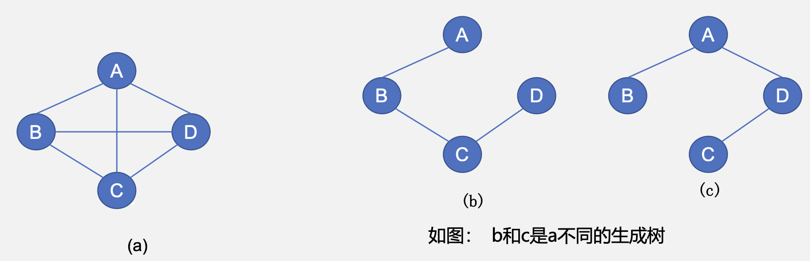
</div>

生成树（针对无向图）：连通图的生成树是包含图中**全部顶点**的一个**极小连通子图**。若图中的顶点数为n，则它的生成树有n-1条边，生成树**不一定唯一**。

生成森林：非连通图中，连通分量的生成树构成了非连通图的生成森林。

名词辨析：极大连通子图、极小连通子图、连通分量、生成树、生成森林。

<div style=" margin: 0 auto; max-width: 30%;">
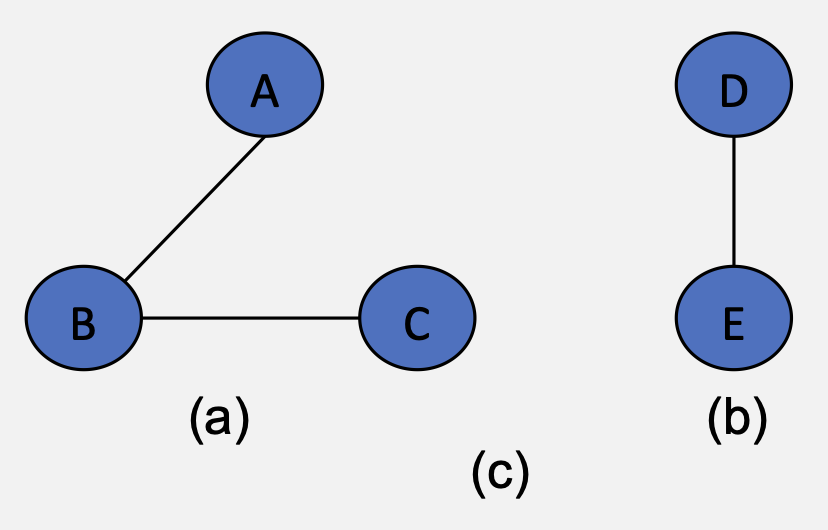
</div>

如图：c是一个非连通图，其由a和b两个连通图组成。对于c来说，a和b是它的两个**连通分量**，a和b分别是两棵生成树，共同组成了生成森林。
极大连通子图=连通分量
极小连通子图=生成树

---

## 图的基本概念

**顶点的度**：图中以该顶点为一个端点的边的数目。
**无向图中**：顶点v的度是指依附于该顶点的边的条数，记为${TD(v)}$。具有n个顶点，e条边的无向图中，**所有顶点的度总和是边数的二倍**，即${\sum_{i=1}^nDT(v_i)=2e}$。
**有向图中**：顶点v的度分为出度和入度。入度是以顶点v为终点的有向边的条数记为${ID(V)}$；出度是以顶点v为起点的有向边的数目，记为${OD(v)}$。具有n个顶点，e条边的有向图中，全部顶点的**入度之和与出度之和相等**，等于边数。即${\sum_{i=1}^nID(v_i)=\sum_{i=1}^nOD(v_i)=e}$。
**路径**：在图中，顶点${V_p}$到顶点${V_q}$之间的顶点序列${V_p,V_a,V_b,\dots,V_q}$。
**路径长度**：路径上边的数字，若该路径最短则称之为距离。
**简单路径**：序列中顶点不重复出现的路径, 而且自身不存在环。
**回路（环）**：第一个顶点和最后一个顶点相同的路径。注意：若无向图有n个顶点，并且有大于${n-1}$条边，则**此图一定有环**。
**权**：图中边具有与之相关的数值，称之为权重，权重可以表示从一个顶点到另一个顶点的距离、花费的代价等。这种带权图也叫做网络。
**子图**：设有两个图${G=(V,E)}$和${G'=(V',E')}$，若V'是V的子集，且E'是E的子集，则称G'为G的子图。
**连通**：无向图中，若从顶点v到顶点w有路径存在，则称v和w是连通的。
**连通图**：**无向图G**中**任意两个顶点**都是连通的。注意：如果一个无向图有n个顶点和小于${n-1}$条边，必然是非连通图。

<div style=" margin: 0 auto; max-width: 60%;">
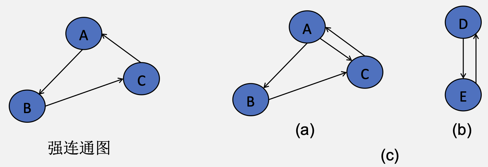
</div>

**强连通**：有向图中，若从顶点v到顶点w和顶点w到顶点v之间都有路径，则称v和w是强连通的。
**强连通图**：有向图G中任意两个顶点都是强连通的。
**强连通分量**：有向图中的极大强连通子图。

---

## 图的存储

### 邻接表

&emsp;&emsp;&ensp;在邻接矩阵法中，空间复杂度为${O(n^2)}$，存储稀疏图会存在空间浪费。
&emsp;&emsp;&ensp;邻接表法是图的链式存储结构，对图中的每个顶点建立一个单链表，第i个单链表中的结点表示依附于顶点${v_i}$的边（有向图则为以顶点${v_i}$为尾的弧）。
&emsp;&emsp;&ensp;邻接表中存在两种结点：**顶点表结点**和**边表结点**。
&emsp;&emsp;&ensp;顶点表：采用**顺序存储**，存储顶点的数据信息和边表的头指针。
&emsp;&emsp;&ensp;边表：采用**链式存储**，存储邻接点域和指向下一条邻接边的指针域。

<div style=" margin: 0 auto; max-width: 60%;">
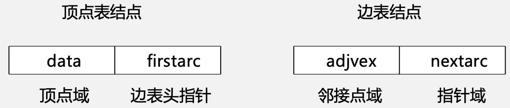
</div>

```cpp
#define Max_Vertex_Num 100  // 图中顶点数目的最大值
typedef struct ArcNode{     // 边表结点
    int adjvex;             // 该弧所指向的顶点的位置 
    struct ArcNode *next;   // 指向下一条弧的指针
}ArcNode;

typedef struct Vnode{       // 顶点表结点
    VertexType data;        // 顶点信息
    ArcNode *first;         //指向第一条依附于该顶点的弧的指针
}Vnode, AdjList[Max_Vertex_Num];

typedef struct {
    AdjList vertices;       // 邻接表
    int vexnum,arcnum;      // 图的顶点数和弧数
}ALGraph;                   // ALGraph是以邻接表存储的图
```

#### 无向图的邻接表法

<div style=" margin: 0 auto; max-width: 60%;">
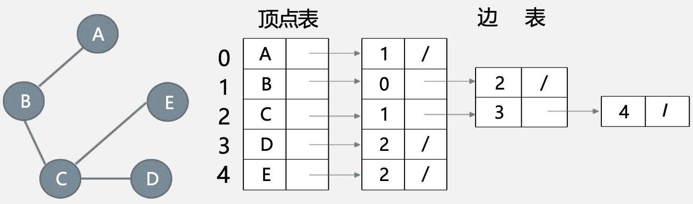
</div>

1. 无向图中，存储空间为${O(|V|+2|E|)}$。
2. 无向图中，结点的度为该结点**边表的长度**。
3. 邻接表不唯一，边表结点的顺序是任意的，取决于建立邻接表的算法及边的输入次序。

#### 有向图的邻接表法

<div style=" margin: 0 auto; max-width: 60%;">
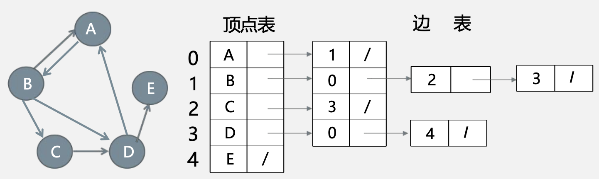
</div>

1. 有向图中，存储空间为${O(|V|+|E|)}$。
2. 有向图中，结点的**出度为该结点边表的长度**，计算入度则要**遍历整个邻接表**。
3. 邻接表不唯一，边表结点的顺序是任意的，取决于建立邻接表的算法及边的输入次序。
---
1. 无向图的邻接表存储需要${O(|V|+2|E|)}$的空间，而有向图为${O(|V|+|E|)}$；
2. 邻接表存储易于知道某个顶点的所有邻边，而不方便查找某两个顶点之间是否存在边；
3. 对于邻接表存储的有向图，易于计算某个顶点的出度，而难于计算**入度**；
4. **稀疏图**建议使用**邻接表**的方式存储。
---
### 邻接矩阵

&emsp;&emsp;&ensp;邻接矩阵存储，即用一个一维数组存储图中顶点的信息，用一个二维数组存储图中边的信息（即各顶点间的邻接关系），存储顶点间邻接关系的二维数组称为邻接矩阵。
&emsp;&emsp;&ensp;设图G=(V, E)包含n个顶点， 图顶点编号为V1,V2,V3 ...Vn ， 图G的邻接矩阵是一个二维数组${A[n][n]}$，其定义为：${A[i][j]=
\begin{cases}
0,& 若(v_i, v_j)或<v_i,v_j>不是E(G)的边\\[3ex]
1,& 若(v_i, v_j)或<v_i,v_j>是E(G)的边
\end{cases}}$

<div style=" margin: 0 auto; max-width: 60%;">
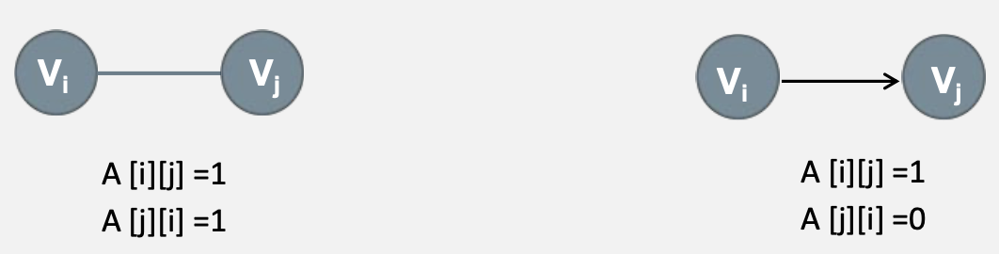
</div>

```cpp
#define MAX_VERTEX_NUM 100 // 最大顶点个数
typedef char VertexType; //顶点数据类型
typedef int EdgeType; //带权图边权值数据类型
typedef struct{
    VertexType Vex[MAX_VERTEX_NUM]; // 顶点表
    EdgeType Edge[MAX_VERTEX_NUM][MAX_VERTEX_NUM]; // 邻接矩阵,边表
    int vexnum, arcnum; //图的当前顶点数,弧数
}Mgraph;
```

&emsp;&emsp;&ensp;邻接矩阵法的空间复杂度为${O(n^2)}$，适用于**边稠密图**。
&emsp;&emsp;&ensp;注：这里主要是为了和邻接表法所使用的存储空间做对比，所以使用了”空间复杂度”这个名词，在实际的算法题中，**存储图所使用的空间并不会算入整个算法的空间复杂度**。

#### 无向图的邻接矩阵法

<div style=" margin: 0 auto; max-width: 80%;">
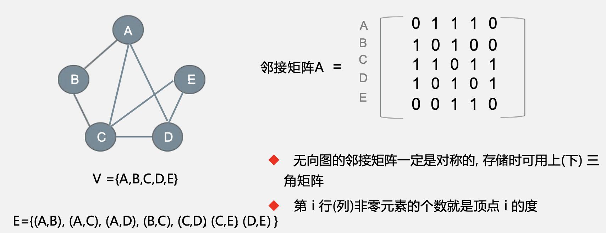
</div>

1. 无向图的邻接矩阵一定是对称的, 存储时可用上（下）三角矩阵。
2. 第i行（列）非零元素的个数就是顶点i的度。

#### 有向图的邻接矩阵法

<div style=" margin: 0 auto; max-width: 80%;">
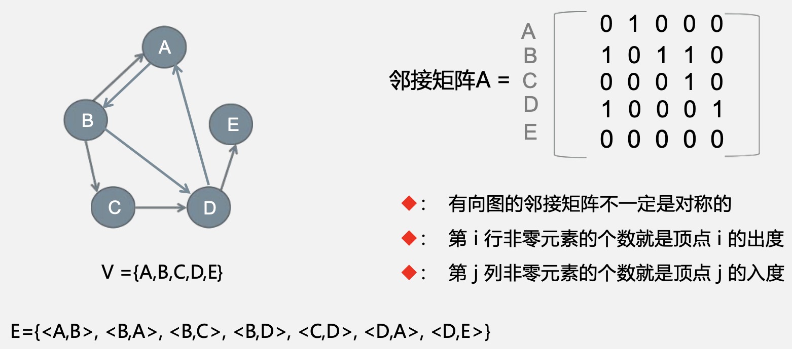
</div>

1. 有向图的邻接矩阵不一定是对称的。
2. 第i行非零元素的个数就是顶点i的出度。
3. 第j列非零元素的个数就是顶点j的入度。

#### 带权图的邻接矩阵法

<div style=" margin: 0 auto; max-width: 80%;">
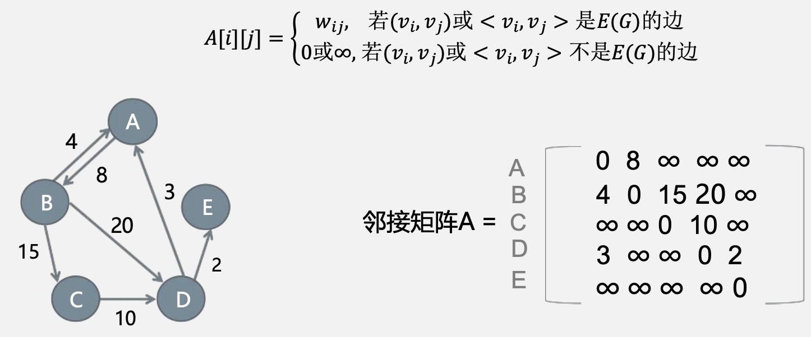
</div>

#### 扩展知识

&emsp;&emsp;&ensp;设图G的邻接矩阵为A，${A^n}$的元素${A^n[i][j]}$等于由顶点i到顶点j的长度为n的路径的数目。

<div style=" margin: 0 auto; max-width: 70%;">
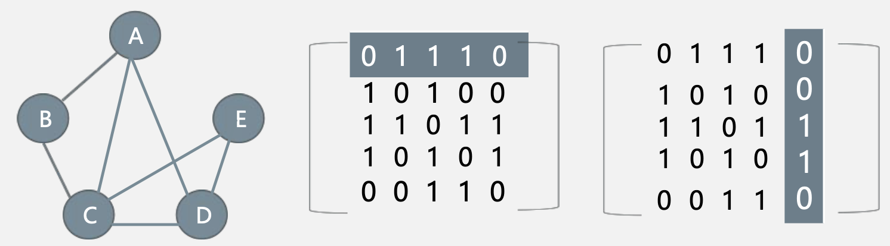
</div>

如：${A^2[0][4]=0\times0+1\times0+1\times1+1\times1+0\times0}$表示从顶点A到顶点E**长度为2**的路径有两条：${A,C,E}$和${A,D,E}$。

---

1. 无向图的邻接矩阵一定是对称矩阵，常采用压缩存储；
2. 对于无向图，邻接矩阵的第i行/列非零元素的个数对应顶点i的度；
3. 对于有向图，邻接矩阵的第i行非零元素的个数对应顶点i的出度，第i列的非零元素对应顶点i的入度；
4. 采用邻接矩阵存储的图，易于确定图中任意顶点之间是否有边，但是难于计算边的总数；
5. 稀疏图不建议使用邻接矩阵的方式存储。

---

### 十字链表

&emsp;&emsp;&ensp;有向图的一种链式存储结构，由**顶点表结点**和**弧结点**组成。
&emsp;&emsp;&ensp;**顶点表结点**：由三个域组成，data域存放顶点相关信息，firstin和firstout两个域分别指向以该顶点为弧头或弧尾的第一个弧结点。
&emsp;&emsp;&ensp;**弧结点**：由五个域组成，尾域（tailvex）和头域（headvex）分别指示**弧尾和弧头**这两个顶点在图中的位置，链域（hlink）指向弧头相同的下一条弧，链域（tlink）指向弧尾相同的下一条弧，info域指向该弧的相关信息。

<div style=" margin: 0 auto; max-width: 80%;">
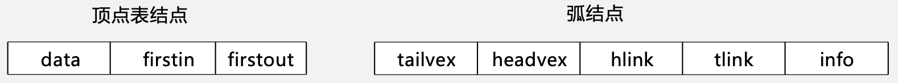
</div>
<div style=" margin: 0 auto; max-width: 80%;">
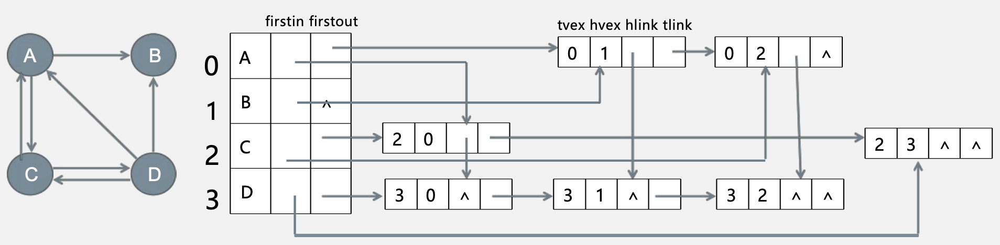
</div>

&emsp;&emsp;&ensp;在十字链表中，容易求得各顶点的出度和入度。

---

### 邻接多重表

&emsp;&emsp;&ensp;无向图的一种链式存储结构，由**顶点表结点**和**边表结点组成**。
&emsp;&emsp;&ensp;**顶点表结点**：存储顶点的数据信息和指示第一条依附于该顶点的边。
&emsp;&emsp;&ensp;**边表结点**：由六个域组成，mark标记域，标记该边**是否被搜索过**，ivex和jvex为该边依附的两个顶点。
&emsp;&emsp;&ensp;在图中的位置，ilink指向下一条依附于顶点ivex的边，jlink指向下一条依附于顶点jvex的边，info为指向和边相关的信息的指针域。

<div style=" margin: 0 auto; max-width: 80%;">

</div>

<div style=" margin: 0 auto; max-width: 80%;">
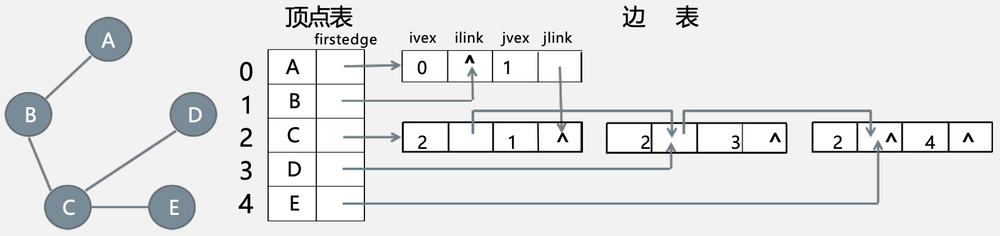
</div>

&emsp;&emsp;&ensp;相比于邻接表，邻接多重表对边进行删除操作时效率更高。

---

## 图的遍历

### 深度优先遍历（DFS）

&emsp;&emsp;&ensp;图的深度优先搜索（Depth First Search），也叫图的深度优先遍历，它的思想类似于树的先序遍历，即尽可能“深”地遍历图的顶点，伴随回溯操作，直至所有顶点都被访问过。

<div style=" margin: 0 auto; max-width: 60%;">
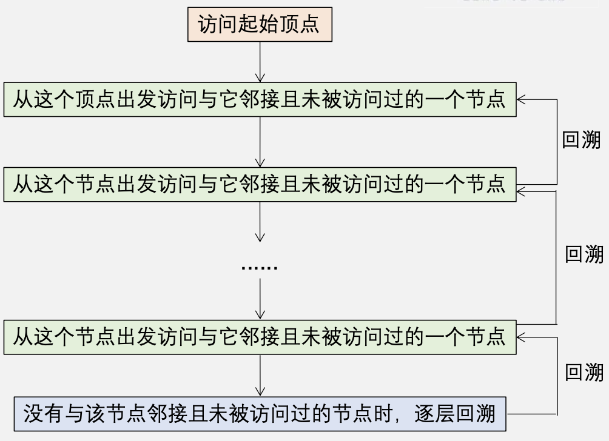
</div>

&emsp;&emsp;&ensp;深度优先遍历算法既可以借助邻接矩阵实现，也可以借助邻接表实现。
&emsp;&emsp;&ensp;我们还需要一个栈来支持回溯操作，并且需要一个数组来标记每个顶点**是否被访问过**。

```cpp
bool visited[MaxSize]; //访问标志数组
void dfsTraverse(Graph G){
    for(v=0; v<G.vexnum; v++){
        visited[v] = false; //初始化
    }
    for(v=0; v<G.vexnum; v++){
        if(!visited[v]){
            dfs(G, v); //dfs遍历
        } 
    }
}
void dfs(Graph G, int v){
    visit(v); //访问当前结点
    visited[v] = true;
    for(w=FirstNeighbor(G, v); w>=0; w=NextNeighbor(G,v,w)){
        if(!visited[w]){ //当前结点没有被访问
            dfs(G, w);
        }
    }
}
```

&emsp;&emsp;&ensp;空间复杂度：
&emsp;&emsp;&ensp;深度优先遍历算法是一个递归算法，需要一个**工作栈**来支持，故其空间复杂度为${O(|V|)}$。
&emsp;&emsp;&ensp;时间复杂度：
&emsp;&emsp;&ensp;以**邻接矩阵**存储图时，查找每个顶点的邻接点需要的时间为${O(|V|)}$，故总的时间复杂度为${O(|V|^2)}$。
&emsp;&emsp;&ensp;以**邻接表**存储图时，查找所有顶点的邻接 点需要的时间为${O(|E|)}$（访问所有顶点的时间复杂度为${O(|V|)}$，故总的时间复杂度为${O(|V|+|E|)}$）。

&emsp;&emsp;&ensp;对于同一个图，其**邻接表**可以有多种写法，在指定一个开始节点的情况下，其对应的深度优先遍历序列也**可能有多种**。
&emsp;&emsp;&ensp;对于同一个图，其**邻接矩阵**写法唯一；在指定一个开始节点的情况下，其对应的**深度优先遍历序列**也是唯一的。

<div style=" margin: 0 auto; max-width: 60%;">
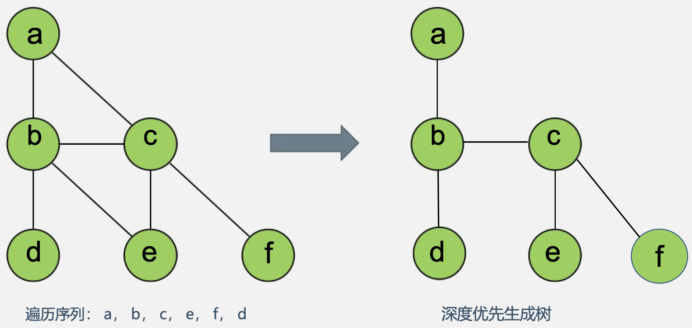
</div>

&emsp;&emsp;&ensp;深度优先生成树（森林）：
&emsp;&emsp;&ensp;对于连通图来说，一次完整的深度优先搜索可以生成一棵深度优先生成树：而非连通图经过**多次dfs**会生成深度优先生成森林。
&emsp;&emsp;&ensp;由前面的讨论我们可以知道：由**邻接表**生成的深度优先生成树不唯一，由**邻接矩阵**生成的深度优先生成树唯一。

---

### 广度优先遍历（BFS）

&emsp;&emsp;&ensp;图的广度优先搜索，也叫图的广度优先遍历，它的思想类似于树的层次遍历，以一种“逐层外扩”的方式遍历顶点，直至**所有顶点**都被访问过。

<div style=" margin: 0 auto; max-width: 40%;">
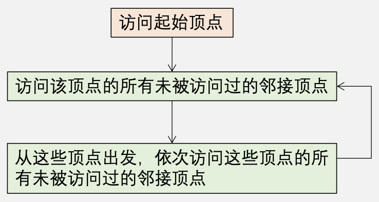
</div>

&emsp;&emsp;&ensp;广度优先遍历算法既可以借助邻接矩阵实现，也可以借助邻接表实现。
&emsp;&emsp;&ensp;我们还需要一个队列来支持层次遍历，并且需要一个数组来标记每个顶点是否被访问过。

```cpp
bool visited[MaxSize]; //访问标志数组 
void bfsTravers(Graph G){
    for(i=0; i<G.vexnum; i++) visited[i] = false; //初始化 
    InitQueue(Q);
    for(i=0; i<G.vexnum; i++){
        if(!visited[i]) bfs(G, i); //开始bfs
    }
}

void bfs(Graph G, int v){ 
    visit(v);
    visited[v]=true;
    Enqueue(Q, v);
    while(!isEmpty(Q)){
        Dequeue(Q, v); //队头结点出队，访问其所有的未被访问的邻接点
        for(w=FirstNeighbor(v); w>=0; w=NextNeighbor(G, v, w)){
            if(!visited[w]){
                visit(w);
                visited[w] = true;
                Enqueue(Q, w);
            }
        }
    }
}
```

&emsp;&emsp;&ensp;空间复杂度：
&emsp;&emsp;&ensp;广度优先遍历算法需要**维护一个队列**，其空间复杂度为${O(|V|)}$。
&emsp;&emsp;&ensp;时间复杂度：
&emsp;&emsp;&ensp;以邻接矩阵存储图时，查找每个顶点的邻接点需要的时间为${O(|V|)}$，故总的时间复杂度为${O(|V|^2)}$。
&emsp;&emsp;&ensp;以邻接表存储图时，查找所有顶点的邻接点需要的时间为${O(|E|)}$，访问所有顶点的时间复杂度为${O(|V|)}$，故总的时间复杂度为${O(|V|+|E|)}$。

&emsp;&emsp;&ensp;对于同一个图，其**邻接表**可以有多种写法，在指定一个开始节点的情况下，其对应的广度优先遍历序列也**可能有多种**。
&emsp;&emsp;&ensp;对于同一个图，其**邻接矩阵**写法唯一，在指定一个开始 节点的情况下，其对应的广度优先遍历序列也是**唯一**的。

&emsp;&emsp;&ensp;广度优先生成树：
&emsp;&emsp;&ensp;对于连通图来说，一次完整的广度优先搜索可以生成一棵广度优先生成树；而非连通图经过多次bfs会生成广度优先生成森林。
&emsp;&emsp;&ensp;由前面的讨论我们可以知道：
&emsp;&emsp;&ensp;由**邻接表**生成的广度优先生成树**不唯一**，由**邻接矩阵**生成的广度优先生成树**唯一**。

&emsp;&emsp;&ensp;广度优先生成树的重要性质：
&emsp;&emsp;&ensp;**起点到其他顶点的路径是原图中对应的最短路径。**

&emsp;&emsp;&ensp;对于无向图，如果只需调用一次完整的DFS或者BFS就可以遍历所有的点，说明该图是连通的。
&emsp;&emsp;&ensp;反之，如果一个无向图是连通的，那么只需调用一次完整的DFS或者BFS就可以遍历所有的点。
&emsp;&emsp;&ensp;**调用完整的DFS（或BFS）的次数 = 连通分量的个数**
&emsp;&emsp;&ensp;如图，该无向图有两个连通分量，故需要调用两次DFS（或BFS）才可以遍历所有的点。

&emsp;&emsp;&ensp;对于有向图，如果只需调用一次DFS或者BFS就可以遍历所有的点，说明**从起始点出发到每个顶点都有路径**。
&emsp;&emsp;&ensp;反之，如果从起始点出发到每个顶点都有路径，则只需调用一次DFS或者BFS就可以遍历所有的点。
&emsp;&emsp;&ensp;如图，要遍历所有的点，**至少**需要调用三次DFS（或BFS）才可以。

---

## 图的应用

### 最小生成树

&emsp;&emsp;&ensp;生成树：生成树是针对无向连通图而言的，如果一棵树包含一个无向连通图的**所有顶点**，那么我们把它叫做这个图的生成树。（如我们之前提到的深度优先生成树和广度优先生成树）
&emsp;&emsp;&ensp;既然是树，那它就有以下性质：
1. 这棵树是一个连通图。
2. 如果去掉这棵树的一条边，它会变成非连通图。
3. 如果增加一条边，会形成图中的一条回路。

<div style=" margin: 0 auto; max-width: 70%;">
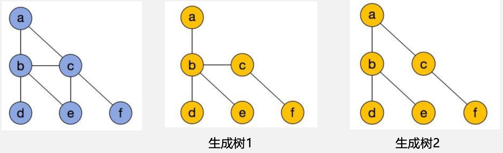
</div>

&emsp;&emsp;&ensp;最小生成树：
&emsp;&emsp;&ensp;对于一个带权连通无向图${G=(V, E)}$，生成树不同，每棵树的权（即树中所有边上的权值之和）也可能不同，我们把权值最小的那棵树叫做该图的**最小生成树**。

<div style=" margin: 0 auto; max-width: 70%;">
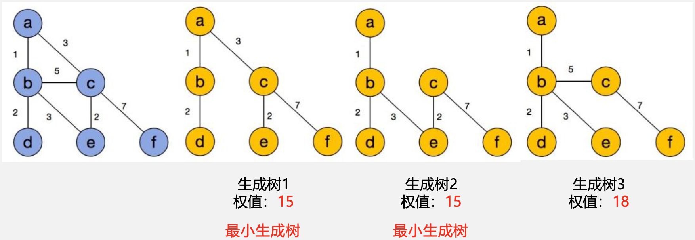
</div>

&emsp;&emsp;&ensp;最小生成树不唯一，但权值唯一。当图中各边权值互不相等-->其最小生成树唯一（反之不成立）

#### Prim算法

&emsp;&emsp;&ensp;Prim算法构造最小生成树的思路是：
1. 维护一个点集s，边集e，初始为空；
2. 初始时从图中任选一点；
3. 从图中选择一个到当前集合s中的顶点**距离最近**的顶点，连同这条边加入到边集e中；
4. 如果图中**所有顶点**都已经在集合s中，集合中的点和边共同组成该图的最小生成树，则算法结束；否则继续选择顶点。
&emsp;&emsp;&ensp;候选点集：${{a,b,c,d,e,f}}$
&emsp;&emsp;&ensp;候选边集：${{(a,b), (a,c), {b,c}, (b,d), (b,e), (c,e), (c,f)}}$

<div style=" margin: 0 auto; max-width: 30%;">
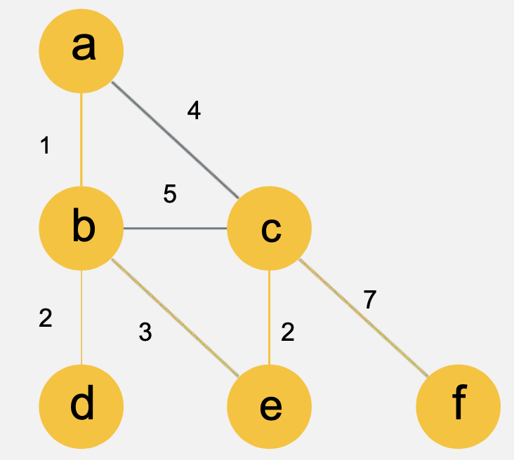
</div>

&emsp;&emsp;&ensp;当前集合：
${s: {a, b, d, e, c, f}}$
${e: {(a, b), (b, d), (b, e), (e, c), (c, f)}}$

&emsp;&emsp;&ensp;Prim算法的时间复杂度为${O(|V|^2)}$，不依赖于${|E|}$, 所以该算法适用于求解**边稠密的图**的最小生成树。

---

#### Kruskal算法

<div style=" margin: 0 auto; max-width: 30%;">
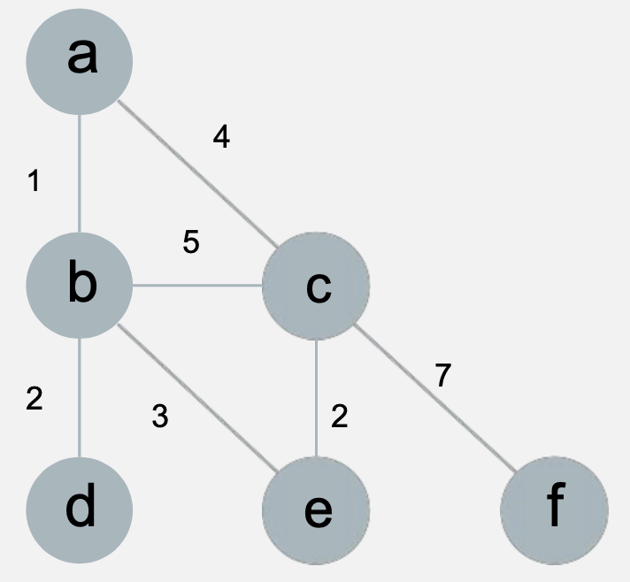
</div>

&emsp;&emsp;&ensp;Kruskal算法构造最小生成树的思路是：
1. 维护一个初始为空的边集e，以及初始为图中全部点的点集s；
2. 每次从剩余的边中选取**权值最小**的边加入e中，并且要保证加入e后，当前图中**不会出现回路**，否则不能选择该边；
3. 若当前边集e中已经有n-1条边时，算法结束；否则返回第三步。
&emsp;&emsp;&ensp;候选边集：${{(a,b), (a,c), {b,c}, (b,d), (b,e), (c,e), (c,f)} }$
&emsp;&emsp;&ensp;候选边集（按权值排序后）：${{(a,b), (b,d), (c,e), (b,e), (a,c), {b,c}, (c,f)}}$

&emsp;&emsp;&ensp;Kruskal算法的时间复杂度为${O(|E|log|E|)}$，依赖于${|E|}$而非${|V|}$，所以Kruskal算法适合**边稀疏而顶点较多**的图。

##### 并查集在kruskal算法中的应用

&emsp;&emsp;&ensp;用于查找当出现多条权值相同的边时，如何选择一条不会使生成树构成环的边。

<div style=" margin: 0 auto; max-width: 70%;">
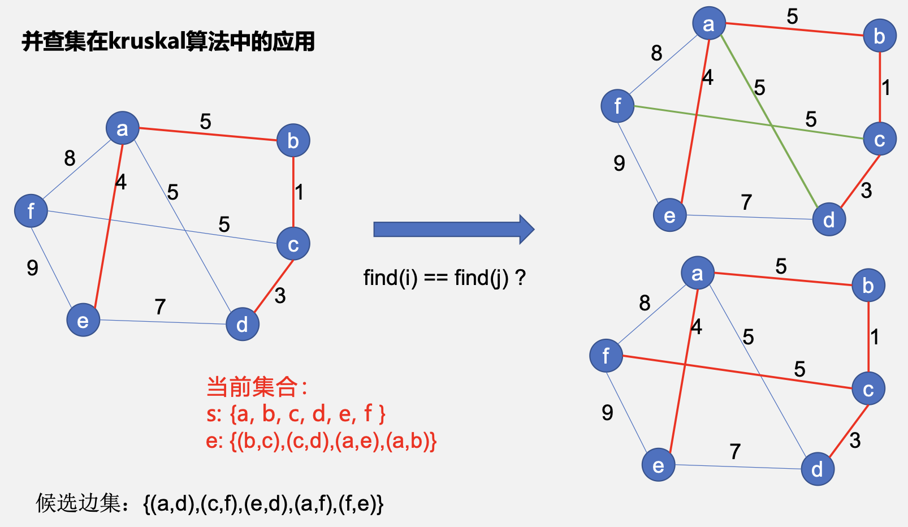
</div>

---

### 最短路径问题

&emsp;&emsp;&ensp;带权图中，从一个顶点到另一个顶点所经历的边的权值之和，叫做该路径的带权路径长度。从一个顶点到另一个顶点可能不止一条路径，**带权路径长度最小**的那条叫做最短路径。

#### 单源最短路径（Dijkstra算法）

&emsp;&emsp;&ensp;**单源最短路径问题**：求图中某一顶点到其他各顶点的最短路径。求解单源最短路径问题通常采用**Dijkstra算法**。

<div style=" margin: 0 auto; max-width: 50%;">
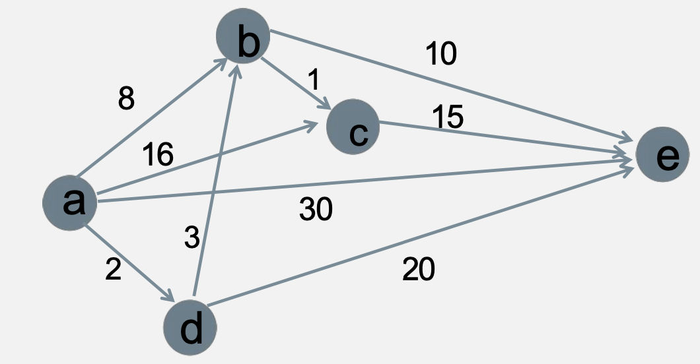
</div>

我们维护两个数组：
dist[]：dist[i]表示源点到顶点i的当前**已知的**最短路径长度。初始时将dist[]的每个元素值设为∞（源点处为0）。
path[]：path[i]表示从源点到顶点i的最短路径上，**顶点i的前驱顶点**。初始均为-1。

<div style=" margin: 0 auto; max-width: 50%;">
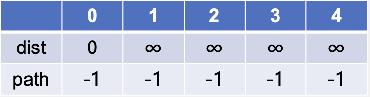
</div>

&emsp;&emsp;&ensp;算法思路如下（顶点总数为n）：
1. 集合s中存放已经求得最短路径的顶点，初始为空，然后将源点加入集合s；
2. 如果所有顶点都加入了集合s，则算法结束；否则，当前加入集合s的顶点中，最后一个加入的是顶点u，对于每一个dist[v]（${v = 1, 2, ..., n}$且未加入集合s），如果${dist[u] + |<u,v>| < dist[v]}$，则更新dist[v], 令${dist[v] = dist[u] + |<u,v>|,\quad path[v] = u}$。
3. 选取${\{dist[v]|(v = 1, 2, ..., n)\}}$中的最小值，将对应的顶点v加入集合s，跳转到步骤2。

<div style=" margin: 0 auto; max-width: 60%;">
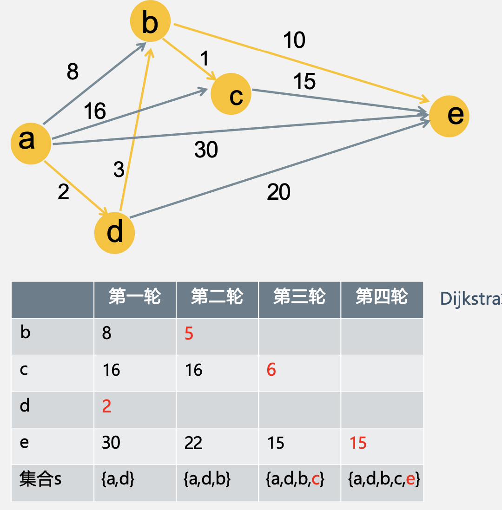
</div>

&emsp;&emsp;&ensp;Dijkstra算法的时间复杂度为${O(|V|^2)}$，${|V|}$为图中顶点的个数。
&emsp;&emsp;&ensp;**Dijkstra算法不适用于有负权值边的图。**

---

#### 最短路径（Floyd算法）

&emsp;&emsp;&ensp;floyd算法求解顶点之间最短路径步骤：
&emsp;&emsp;&ensp;核心思想：递推求解n（顶点个数）阶方阵序列${A^{(-1)},A^{(0)},A^{(1)}, \dots,A^{(n-1)}}$，其中${A^{(-1)}}$表示原图的**邻接矩阵**。

1. 初始化矩阵${A^{(-1)}}$；
2. 求解${A^{(0)}}$，将${v_0}$作为中间点，对于所有的顶点对{i,j}，计算${dist(i,v_0)+dist(v_0,j)}$（${A^{(-1)}[i][v_0]+A^{(-1)}[v_0][j]}$），若小于${A^{(-1)}[i][j]}$，则更新其值，否则不更新；
3. 对于${A^{(k)}}$，即将${v_k}$作为中间点，对于所有的顶点对{i,j}，计算${dist(i,v_k)+dist(v_k,j)}$（${A^{(-1)}[i][v_k]+A^{(-1)}[v_k][j]}$），若小于${A^{(-1)}[i][j]}$，则更新其值，否则不更新；
4. 计算完${A^{(n-1)}}$，算法结束。

&emsp;&emsp;&ensp;弗洛伊德算法总结：
1. 时间复杂度是${O(|V|^3)}$；
2. 可以计算**带负权值边**的图中最短路径问题，但是**不能有**包含负权值边组成的**回路**；
3. 也适用于计算**带权无向图**的最短路径;

---

### 拓扑排序

&emsp;&emsp;&ensp;有向无环图：若一个有向图中不存在环，则称为有向无环图，简称DAG图。

<div style=" margin: 0 auto; max-width: 70%;">
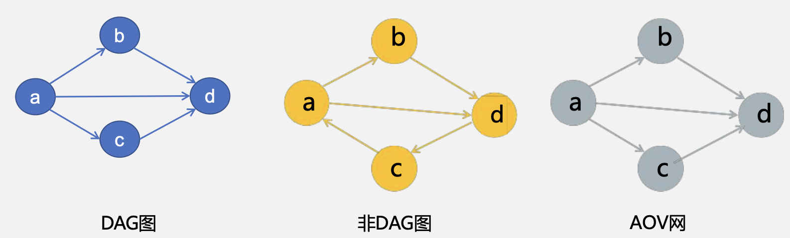
</div>

&emsp;&emsp;&ensp;如果用DAG图表示一个工程，其顶点表示活动，用有向边<a,b>表示a活动必须早于b活动进行，那么我们将它叫做**AOV网（顶点表示活动的网络）**。

&emsp;&emsp;&ensp;我们对有向无环图的顶点进行排序，使得若存在一条顶点A到顶点B的路径，则在排序中顶点B一定出现在顶点A的后面，我们把这种排序叫做**拓扑排序**。
&emsp;&emsp;&ensp;对于同一个有向无环图，拓扑排序序列可能有1个也可能有多个。

&emsp;&emsp;&ensp;如何获取拓扑排序序列？
1. 从有向无环图中选择一个没有前驱的顶点 并输出；
2. 删除该顶点，并且删除以它为起点的有向边；
3. 若图为空，则算法结束；若图非空且**不存在没有前驱的顶点**，则说明有向图中存在环，不存在拓扑序列；否则，跳转到第1步。

---

### 关键路径

#### AOE网

&emsp;&emsp;&ensp;AOE网：以顶点表示事件，以**有向边表示活动**，边上的权值表示完成该活动的开销的带权有向图。**（用边表示活动的网络）**

&emsp;&emsp;&ensp;AOE网的两个**重要性质**：
1. 只有在某顶点表示的事件发生后，从该顶点出发的各有向边所代表的活动才能开始；
2. 只有进入某顶点的所有有向边所代表的活动都完成时，该顶点所代表的事件才能发生。

<div style=" margin: 0 auto; max-width: 50%;">
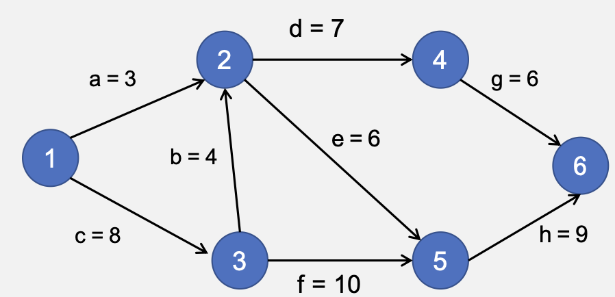
</div>

&emsp;&emsp;&ensp;AOE网只有一个开始顶点，也叫**源点**（入度为0的点，如本图中的顶点1），也只有一个结束顶点也叫**汇点**（出度为0的点，如本图中的顶点6）。
&emsp;&emsp;&ensp;在AOE网中有些活动是可以并行进行的，如在活动c进行时，活动a也可以同时进行，但a完成后，**必须等待c和b都完成**，事件2才可以发生，进而d、e才可以开始。
&emsp;&emsp;&ensp;从开始顶点到结束顶点的路径中，**路径长度最大**的那条路径我们称之为**关键路径**。关键路径上的活动我们称之为**关键活动**。
&emsp;&emsp;&ensp;关键路径的意义在于，当我们按这个路径将关键活动全部完成时，**其他所有活动也可以并行完成**。如果边上的权值代表完成这项活动的时间，那么关键路径的总权值就代表**整个工程完成的最短时间**。
&emsp;&emsp;&ensp;事件${v_k}$的**最早**发生时间${ve(k)}$：从源点1到顶点${v_k}$的**最长路径长度**。
&emsp;&emsp;&ensp;事件${v_k}$的**最晚**发生时间${vl(k)}$：在不推迟整个工程完成的前提下，保证它的后继事件${v_j}$在其最晚发生时间可以发生时，该事件必须发生的时间。
&emsp;&emsp;&ensp;活动${a_i}$的最早开始时间${e(i)}$：该活动弧的起点所表示的事件**最早**发生时间。
&emsp;&emsp;&ensp;活动${a_i}$的最迟开始时间${l(i)}$：该活动弧的终点所表示的**事件的最晚发生时间与该活动所需时间之差**。

---

#### 求解关键路径的步骤

1. 求其拓扑序列；
2. 对于${ve}$
   1. 初始时，${ve(i)=0}$；
   2. 按照拓扑序列求其余顶点的${ve}$；
   3. 对于当前顶点（入度为0）${v_i}$，计算其所有直接后继顶点${v_k}$，若${ve(v_i)+weight(v_i, v_k)>ve(v_k)}$，则**记录其值**，将${ve(v_i)+weight(v_i, v_k)}$作为${ve(k)}$的新值，**否则不更新**；
3. 对于${vl}$
   1. 初始时，${vl(i)=ve(n)}$；
   2. 按逆拓扑序列求其余顶点的${vl}$；
   3. 对于当前顶点${v_i}$（出度为0），计算其所有直接前驱顶点${v_k}$，若${vl(v_i)-weight(v_k, v_i)>vl(v_k)}$，则**记录其值**，将${vl(v_i)-weight(v_k, v_i)}$作为${vl(k)}$的新值，**否则不更新**；
4. 对于${e}$
   1. ${e(i)}$的值为该活动所在弧的起点事件的${ve()}$；
5. 对于${l}$
   1. ${l(i)}$的值为该活动所在弧的终点事件的${vl()}$-该弧的权值（活动持续时间）；
6. 计算${l(i)-e(i)=0}$的活动，得出**关键路径**。

<div style=" margin: 0 auto; max-width: 50%;">
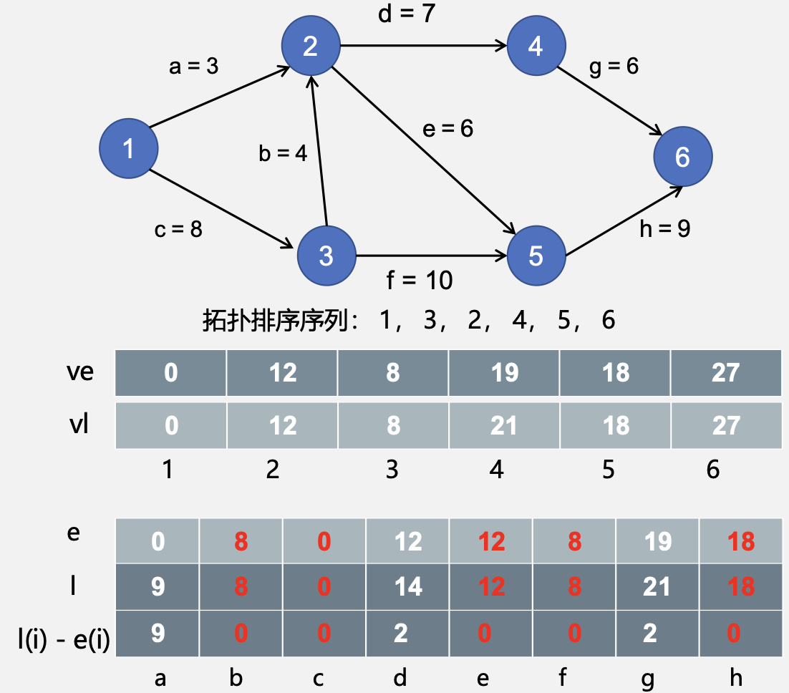
</div>

&emsp;&emsp;&ensp;关键路径1：${1 \to 3 \to 2 \to 5 \to 6}$
&emsp;&emsp;&ensp;关键路径2：${1 \to 3 \to 5 \to 6}$
&emsp;&emsp;&ensp;思考1：缩短活动f的时长到9，可以缩短整个项目的工期吗？
&emsp;&emsp;&ensp;答：不可以，f=9时，只剩一条关键路径，那就是关键路径1，项目工期由它决定保持不变。
&emsp;&emsp;&ensp;思考2：缩短e的时长到5，缩短f的时长到9，可以缩短整个项目的工期吗？
&emsp;&emsp;&ensp;答：可以，项目工期可以缩短1。
&emsp;&emsp;&ensp;思考3：缩短e的时长到3，缩短f的时长到7，整个项目的工期可以缩短3吗？
&emsp;&emsp;&ensp;答：不能，关键路径变为${1 \to 3 \to 2 \to 4 \to 6}$，项目工期可以缩短2。

---

#### AOV网

<div style=" margin: 0 auto; max-width: 30%;">
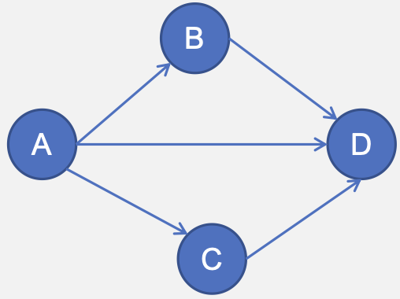
</div>

&emsp;&emsp;&ensp;AOV网：若用DAG表示工程，**顶点表示活动**，有向边${<V_i,V_j>}$表示活动${V_i}$必须先于${V_j}$开始。

