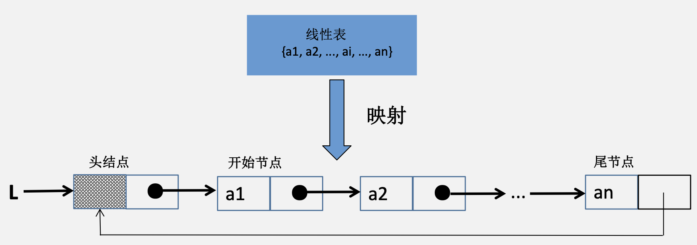

# 线性表

**什么是线性表？**

>线性表是n个具有**相同特性**的数据元素组成的**有限**的**有序**序列。

&emsp;&emsp;&ensp;有序：**逻辑上**有先后顺序，而非物理位置上的前后次序。
&emsp;&emsp;&ensp;只有一个表头元素，也只有一个表尾元素。
&emsp;&emsp;&ensp;除了表头和表尾，其他元素都有唯一的直接前驱和直接后继；表头元素只有后继元素，表尾元素只有前驱元素。

---

## 线性表的类型

### 顺序存储结构（顺序表）

#### 数据结构定义
&emsp;&emsp;&ensp;顺序表即线性表的顺序表示，逻辑上相邻的元素一定是存储在相邻的的物理空间中。

<div align="center">

<div align="left">

#### 空间

```c
// c
(Elemtype*)malloc(sizeof(Elemtype)*Size)
```

```cpp
// c++
new Elemtype[Size]
```

##### 静态分配

```cpp
typedef struct{
Elemtype data[MaxSize]; 
int length;
}SqList; //静态分配
```

##### 动态分配

```cpp
typedef struct{ 
Elemtype *data; 
int MaxSize, length;
}SqList; //动态分配
```

### 链式存储结构（动态链表）

**什么是链表?**
>线性表的链式存储即为链表。根据申请内存的方式又分为动态链表和静态链表。

```cpp
typedef struct LNode { 
Elemtype data;
struct LNode *next; 
}LNode;

typedef struct LinkedList{ 
LNode *head;
int length;
}LinkedList;
```

**链表与链表结点分开定义的好处是什么?**
>如：要求链表具备记录当前链表长度的功能。

<div align="center">

<div align="left">

**什么是头结点？什么是头指针？**
**什么是首元结点？为什么要设置头结点？**

>1. 头结点一般没有值域；
>2. 指向链表**第一个结点的指针叫做头指针**；
>3. 链表中第一个**存放元素**的结点叫做**首元结点**；
>4. 对于带头结点的链表，**头指针指向头结点**；
>5. 对于不带头结点的单链表，**头指针指向首元结点**。

&emsp;&emsp;&ensp;带头节点的好处：
1. 方便对链表进行操作，增加代码的可复用性；
2. 统一了空表与非空表的操作以及头指针类型；
3. 单链表一般都是带头结点的，但是在做选择题的时候如果题目没有声明，那就是不带头结点。

#### 单向链表

1. 单链表（带头节点）：在每个节点中除包含数据域外，只设置一个指针域，用以指向其后继节点。

<div align="center">

<div align="left">

2. 单链表（不带头结点）：在每个节点中除包含数据域外，只设置一个指针域，用以指向其后继节点。

<div align="center">

<div align="left">

3. 单链表的建立（带头节点）

    **头插法**

<div align="center">

<div align="left">

&emsp;&emsp;&ensp;**尾插法**

<div align="center">

<div align="left">

#### 单向循环链表

&emsp;&emsp;&ensp;循环单链表（带头结点）：在每个节点中除包含数据域外，只设置一个指针域，用以指向其后继节点，表中尾节点的指针域指向表头节点，整个链表形成一个环。

<div align="center">

<div align="left">

#### 双向链表

**什么是双链表?**
>除数据域之外，还有两个指针域的链表，分别为前驱指针和后继指针，其中前驱指针指向前驱节点，后继指针指向后继节点。

```cpp
typedef struct DNode { 
Elemtype data;
struct DNode *prior;
struct DNode *next; 
}DNode;
```

1. 双链表（带头节点）：在每个节点中除包含数据域外，设置两个指针域，分别用以指向其前驱节点以及后继节点。

<div align="center">

<div align="left">

2. 双链表（不带头结点）：在每个节点中除包含数据域外，设置两个指针域，分别用以指向其前驱节点以及后继节点。

<div align="center">

<div align="left">

#### 双向循环链表

&emsp;&emsp;&ensp;循环双链表（带头结点）：在每个节点中除包含数据域外，设置两个指针域，分别用以指向其前驱节点以及后继节点。

<div align="center">

<div align="left">

### 静态链表（数组实现的链表）

&emsp;&emsp;&ensp;借用一维数组来描述线性链表。数组中的一个分量表示一个节点，同时使用游标（指示器cur）代替指针，以指示节点在数组中的相对位置。数组中的第0个分量可以看成头节点，其指针域指示静态链表的第一个节点

```cpp
typedef struct{ 
Elemtype data;
int cur;
}SLinkList[100]; //假设申请了100个连续的内存空间
```

<div align="center">

<div align="left">

---

## 线性表的操作

### 插入节点

顺序表插入（时间复杂度）

1. 表尾插入

<div align="center">

<div align="left">

2. 表中插入

<div align="center">

<div align="left">

单链表的插入
<div align="center">

<div align="left">

### 删除节点

顺序表删除（时间复杂度）
删除第1个元素。
<div align="center">

<div align="left">

单链表的删除操作
<div align="center">

<div align="left">

#### 逻辑删除

#### 物理删除

### 查找节点

#### 按“号”查找

顺序表查找（时间复杂度）
查找第2个元素需要${O(1)}$。

#### 按“值”查找

顺序表查找（时间复杂度）
查找66是否在表中需要${O(n)}$。

---

## 线性表的特点

### 优点

1. 顺序表：
   1. ${p = 1；}$
   2. 支持随机访问。
2. 链表：
   1. 插入或删除操作不需要移动节点。

### 缺点

1. 顺序表：
   1. 需提前申请一整片连续的空间；
   2. 插入和删除元素时需要移动大量的元素。
2. 链表：
   1. ${p < 1；}$
   2. 不具有随机存取特点。

---
