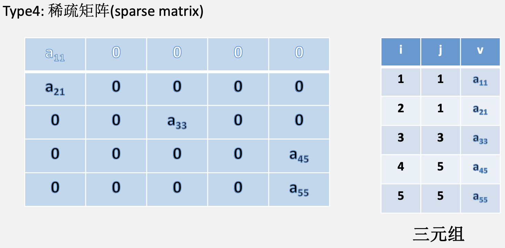

# 数组&矩阵

## 数组

&emsp;&emsp;&ensp;由n个相同类型的元素组成的有限序列。数组是线性表的推广。

### 一维数组

${arr[0, 1, ..., n-1]}$
存储结构关系：${pos(a_i)=pos(a_0)+i\times L \quad(0≤i<n)}$

### 二维数组

#### 行优先

设行：m，列：n
存储结构关系: ${pos(a_{i, j})=pos(a_{0, 0})+[i \times n+j]\times L \quad (0≤i<m,0≤j<n)}$

#### 列优先

设行：m，列：n
存储结构关系: ${pos(a_{i, j})=pos(a_{0, 0})+[j \times m+i]\times L \quad (0≤i<m,0≤j<n)}$

### 高维数组

## 压缩矩阵

&emsp;&emsp;&ensp;特殊矩阵：具有许多相同的元素或零元素，且这些元素的位置分布有一定的规律的矩阵。
&emsp;&emsp;&ensp;特殊矩阵的压缩存储：将多个值相同的元素只分配一个存储空间，**零元素不分配空间**。

### 对称矩阵

&emsp;&emsp;&ensp;一般存储下三角矩阵，下三角区域(含主对角线)。第一行：1个元素；第二行：2个元素；...第i-1行：i-1个元素；第i行：j-1个元素。故${a_{ij}}$为第${\frac{i(i+1)}{2}+j}$个元素。

&emsp;&emsp;&ensp;元素${a_{ij}}$与其在数组中的下标k之间的对应关系：

1. ${\frac{i(i-1)}{2}+j-1\quad (i≥j)}$ 下三角区和主对角线;
2. ${\frac{j(j-1)}{2}+i-1\quad (i<j)}$ 上三角区。

### 三角矩阵

#### 上三角矩阵

&emsp;&emsp;&ensp;上三角区域(含主对角线)。第一行：n个元素；第二行：n-1个元素；...第i-1行：n-i+2个元素；第i行：j-i个元素。故${a_{ij}}$为第${\frac{(n+n-i+2)(i-1)}{2}+j-i+1=\frac{(i-1)(2n-i+2)}{2}+j-i+1}$个元素。
&emsp;&emsp;&ensp;下三角区域只存储一个元素,该常数为顺序压缩存储最后一个位置。
&emsp;&emsp;&ensp;元素${a_{ij}}$与其在数组中的下标k之间的对应关系：

1. ${\frac{n(n+1)}{2}\quad (i>j)}$ 下三角区;
2. ${\frac{(i-1)(2n-i+2)}{2}+j-i\quad (i≤j)}$ 上三角区和主对角线。

#### 下三角矩阵

&emsp;&emsp;&ensp;元素${a_{ij}}$与其在数组中的下标k之间的对应关系：

1. ${\frac{n(n+1)}{2}\quad (i<j)}$ 上三角区;
2. ${\frac{(i-1)(i)}{2}+j-i\quad (i≥j)}$ 下三角区和主对角线。

### 对角矩阵

&emsp;&emsp;&ensp;除第1行和第i行外，每行都有三个元素，第i行有${j-i+2}$个元素，故${a_{ij}}$为第${3(i-2)+2+j-i+2=2i+j-2}$个元素。
&emsp;&emsp;&ensp;元素${a_{ij}}$与其在数组中的下标k之间的对应关系：${k=2i+j-3}$

### 稀疏矩阵

## 矩阵存储

### 顺序存储

#### 三元组表示法

#### 伪地址表示法

### 链式存储

#### 邻接表表示法

#### 十字链表表示法

## 串

### 定义概念

#### 主串

#### 子串

#### 串长

### 字符串匹配

#### 暴力匹配

##### 特点

缺点：时间复杂度太高。

##### 时间复杂度

${O(n^2)}$

#### kmp算法

字符串前缀：字符串最后一个字符之外的所有头部子串；
字符串后缀：字符串第一个字符之外的所有尾部子串；
部分匹配值：字符串的前缀和后缀的最长相等前后缀长度。

##### 部分匹配值

##### 原理

##### next数组

###### 求解

求解next数组的口诀：

1. 求出模式串的部分匹配值；
2. 将部分匹配值右移一位；
3. 在首位字符处补-1。

###### 含义

#### 改进的kmp算法

##### 传统kmp算法的缺点

##### nextval数组
