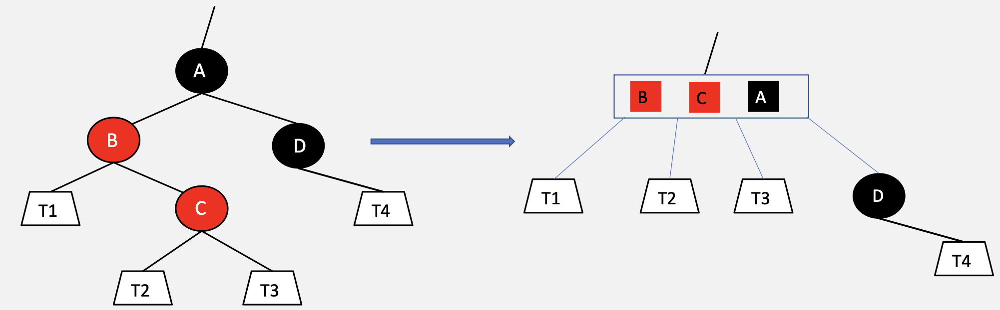
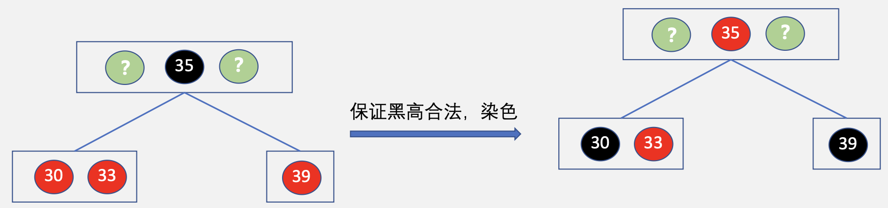

# 查找

## 基本概念

### 查找

&emsp;&emsp;&ensp;查找：在数据集合中寻找满足某种特定条件的数据元素的过程称之为查找。

&emsp;&emsp;&ensp;关键字：数据元素中**唯一标识**该元素的某个数据项的值，使用基于关键字的查找，其结果应该是唯一的。

### 静态查找表

&emsp;&emsp;&ensp;静态查找表：在查找过程中**无须对表中元素进行修改**时，我们称该表为静态查找表。适合静态查找表的有**顺序查找**、**折半查找**和**散列查找**。

### 动态查找表

&emsp;&emsp;&ensp;动态查找表：在查找过程中**可能对表中元素进行修改**，这样的表称为动态查找表。由于链式结构适合插入、删除操作，因此动态查找基本为树型查找。适合动态查找表的有**二叉排序树BST**、**二叉平衡树AVL**、**B树**和**B+树**。

---

## 线性结构查找
### 线性查找
&emsp;&emsp;&ensp;顺序查找（线性查找）：适用于顺序存储和链式结构的查找。
&emsp;&emsp;&ensp;查找思想：对于顺序表，通过数组下标依次访问顺序表中的每个元素；对于链表，通过next指针依次访问链表中的每个元素。

```cpp
int SeqSearch(ElemType key, Sqlist L){
    int i;
    L.data[0] = key; //哨兵
    for(i = L.length; L.data[i] != key; i--);
    return i;
}
for(i=L.length-1; i>=0; i--){ 
    if(L.data[i] == key){
        return i;
    }
}
```

#### 无序表的顺序查找

<div style=" margin: 0 auto; max-width: 70%;">

</div>

&emsp;&emsp;&ensp;可以看出${n=7}$，即${ASL=\frac{1}{7}\sum_{i=0}^{6}C_i}$。
&emsp;&emsp;&ensp;对于查找成功而言：
- 查找关键词6需要比较1次；
- 查找关键词9需要比较2次；
- 查找关键词2需要比较3次；
- ...
- 查找关键词8需要比较7次。

${ASL_{成功}=\frac{1}{7} \times (1+2+3+4+5+6+7)=\frac{1}{7} \times \frac{(1+7) \times 7}{2}=4}$

&emsp;&emsp;&ensp;我们可以从具体推到一般，对于更一般的${n}$而言：

${ASL_{成功}=\frac{1}{n} \times (1+2+3+ \dots +n)=\frac{1}{n} \times \frac{(1+n) \times n}{2} = \frac{n+1}{2}}$

&emsp;&emsp;&ensp;对于查找失败而言：
- 每一次查找都要找到7号位置；
- 即每一次都需要查找8次。

${ASL_{失败}=\frac{1}{7} \times (8+8+8+8+8+8+8)=\frac{1}{7} \times 8 \times 7 = 4}$

&emsp;&emsp;&ensp;我们可以从具体推到一般，对于更一般的${n}$而言：

${ASL_{成功}=\frac{1}{n} \times (1+n) \times n = n+1}$

&emsp;&emsp;&ensp;无论成功还是失败，顺序查找的ASL都是n的一次多项式 因此顺序查找的平均时间复杂度为${O(n)}$。

#### 有序表的顺序查找

<div style=" margin: 0 auto; max-width: 70%;">

</div>

&emsp;&emsp;&ensp;对于查找成功而言：
- 每一次查找依旧要顺序找到对应元素的位置；
- 因此${ASL_{成功}=\frac{n+1}{2}}$，与普通的顺序查找相同。

&emsp;&emsp;&ensp;对于查找失败而言：
- 由于表是有序的，因此当找到的元素已经大于要查找的元素时，便不再需要往后查找。
- 例：查找元素5
  - 当查找到元素6时，已经可以认为查找失败。
  - 因为6后面的元素一定比6大。

&emsp;&emsp;&ensp;结论：
- 对于有序表的顺序查找，查找成功情况下与普通表相同；
- 有序表的顺序查找仅仅对查找失败有改善。

---

### 折半查找

&emsp;&emsp;&ensp;折半查找只适用于**顺序存储**的有序表。
&emsp;&emsp;&ensp;折半查找思想：
1. 首先将key与当前子表中处于**中间位置**的元素进行比较；
2. 若相等，则返回下标；
3. 若key小于中间元素，则对当前范围内的左半部分重复执行算法；
4. 若key大于中间元素，则对当前范围内的右半部分重复执行算法；
5. 如此重复，直到找到位置，或确定表中没有所查元素，则返回失败。

```cpp
int BinarySearch(SqList L, Elemtype key){
    int low = 0, high = L.length-1;
    int mid;
    while(low <= high){
        mid = (low+high) / 2;
        if(L.data[mid] == key){
            return mid;
        }else if(L.data[mid] > key){
            high = mid - 1;
        }else{
            low = mid + 1;
        }
    } 
    return -1;
}
```

&emsp;&emsp;&ensp;折半查找只能用于有序表,折半查找可以被描述为一颗折半查找树.

<div style=" margin: 0 auto; max-width: 70%;">

</div>

<div style=" margin: 0 auto; max-width: 70%;">

</div>

<div style=" margin: 0 auto; max-width: 70%;">

</div>

---

### 分块查找(索引查找)

&emsp;&emsp;&ensp;索引查找 = 索引表 + 查找表

&emsp;&emsp;&ensp;索引查找思想：
1. 在索引表中进行顺序查找或折半查找找到关键字所在的块；
2. 去对应的块中进行顺序查找；
&emsp;&emsp;&ensp;索引查找最大的特点：**块间有序**（第k块内的最大关键字小于第k+1块内所有的关键字），**块内无序**。

<div style=" margin: 0 auto; max-width: 70%;">

</div>

```cpp
//索引表
typedef struct{
    ElemType maxvalue;
    int low,high;
}Index;
//顺序表存储实际元素
ElemType SqList[10];
```

&emsp;&emsp;&ensp;假设长度为n的查找表均匀分为b块，其中每块有s个关键字
&emsp;&emsp;&ensp;索引表使用**顺序查找**，查找表使用顺序查找时：

${ASL=L_{索引表}+L_{查找表}=\frac{b+1}{2}+\frac{s+1}{2}=\frac{s^2+2s+n}{2s}}$

&emsp;&emsp;&ensp;索引表使用**折半查找**，查找表使用顺序查找时：

${ASL=L_{索引表}+L_{查找表}=ceil(log_2(b+1) + \frac{s+1}{2}}$

---

## 树形结构查找
### 二叉排序树
### 二叉平衡树
### B树

&emsp;&emsp;&ensp;B树，又称多路平衡查找树。它是对平衡二叉树AVL的一种改进，其所有结点平衡因子为0，本质上还是一颗查找树。
&emsp;&emsp;&ensp;B树的阶：B树中孩子结点数的最大值，通常用m表示。

<div style=" margin: 0 auto; max-width: 80%;">

</div>

1. 一棵m阶b树, 每个结点**最多有m个子树**；
2. 从上图可以看出 ${points=keys+1}$；
3. 根节点是非叶子节点时，满足如下条件：

${2≤points≤m,\quad 1≤keys≤m-1}$；

4. 非根节点必须满足如下条件：

${\lceil \frac{m}{2} \rceil ≤ points ≤ m,\quad \lceil \frac{m}{2} \rceil - 1≤keys≤m-1}$

5. ${P_{i-1}}$指向的结点内所有关键字都小于${k_i}$；
6. B树所有叶结点位于同一层，并且不带信息（**空指针null**）；
7. 包含n个关键字的m阶B树的高度范围是：

${log_m(n+1)≤h≤1+log_{\lceil\frac{m}{2}\rceil}(\frac{n+1}{2})}$；

8. 无论是否为根节点，m阶B树需要满足以下条件：${points≤m ,\quad keys≤m-1}$；
9. 关键字的个数是已经确定的。为了**让高度最小**，每一个节点应该容纳最多的关键字。因此每一个节点应当含有**m-1个关键字，m个指针**。

<div style=" margin: 0 auto; max-width: 70%;">

</div>

${level\quad 1共有(m-1)个关键字(1个结点)}$

${level\quad 2共有(m-1)\times m个关键字(m个结点)}$

${level\quad 3共有(m-1)\times m^2个关键字(m2个结点)}$

${\dots}$

${level\quad h共有(m-1)\times m^{h-1}个关键字(m^{h-1}个结点)}$

${level\quad h+1共有(m-1)\times m^h个关键字(m^h个外部结点)}$

&emsp;&emsp;&ensp;假设高度为h。由于B树是一棵排序树，因此满足排序树的性质：n个关键字的排序树一定有**n+1个外部结点**。所以满足：

${n≤m^h-1}$

${h≤log_m(n+1)}$

${h_{min}=\lceil log_m(n+1) \rceil}$

10. 关键字的个数n是已经确定的。为了让**高度最大**，每一个节点应该容纳最少的关键字。

<div style=" margin: 0 auto; max-width: 80%;">

</div>

${level\quad 1有1个结点}$

${level\quad 2有2个结点}$

${level\quad 3有2\times \lceil \frac{m}{2}\rceil 个结点}$

${\dots}$

${level\quad h有2\times \lceil \frac{m}{2}\rceil ^{h-2}个结点}$

${level\quad h+1有2\times \lceil \frac{m}{2}\rceil ^{h-1}个外部结点}$

${可得到第h+1层的m阶的B树共有结点数n_{h+1}=2\times \lceil \frac{m}{2}\rceil ^{h-1}}$

${可得到2\times \lceil \frac{m}{2}\rceil ^{h-1}-1≤n}$

${可得到h≤2\times \lceil \frac{m}{2}\rceil ^{h-1}-1}$

${可得到h_{max} = 2\times \lceil \frac{m}{2}\rceil ^{h-1}-1}$

#### B树的删除

<div style=" margin: 0 auto; max-width: 80%;">

</div>

&emsp;&emsp;&ensp;若被删除关键字k位于**非终端结点**，可以用其**前驱或后继**m替代k，然后在相应位置删除原来的m，而且m必定是终端结点，则此问题**转化为在终端结点**删除关键字。

<div style=" margin: 0 auto; max-width: 80%;">

</div>

&emsp;&emsp;&ensp;若被删除关键字位于终端结点，分三种情况：

<div style=" margin: 0 auto; max-width: 80%;">

</div>

&emsp;&emsp;&ensp;任务一：删除21
&emsp;&emsp;&ensp;type1：被删除关键字所在结点关键字个数${≥\lceil \frac{m}{2} \rceil}$
&emsp;&emsp;&ensp;step1：删除
&emsp;&emsp;&ensp;step2：检查是否满足B树定义

<div style=" margin: 0 auto; max-width: 80%;">

</div>

&emsp;&emsp;&ensp;任务二：删除24
&emsp;&emsp;&ensp;type2：若被删除关键字所在的结点关键字个数${= \lceil \frac{m}{2} \rceil -1}$，且与此结点相邻的左或右兄弟结点关键字个数${≥\lceil \frac{m}{2} \rceil}$

<div style=" margin: 0 auto; max-width: 80%;">

</div>
<div style=" margin: 0 auto; max-width: 80%;">

</div>

&emsp;&emsp;&ensp;任务三：删除31
&emsp;&emsp;&ensp;type3：若被删除关键字所在的结点关键字个数${= \lceil \frac{m}{2} \rceil -1}$，且与此结点相邻的左或右兄弟结点关键字个数都${=\lceil \frac{m}{2} \rceil -1}$

<div style=" margin: 0 auto; max-width: 80%;">

</div>
<div style=" margin: 0 auto; max-width: 80%;">

</div>

&emsp;&emsp;&ensp;任务四：删除10
&emsp;&emsp;&ensp;type3：若被删除关键字所在的结点关键字个数${= \lceil \frac{m}{2} \rceil -1}$，且与此结点相邻的左或右兄弟结点关键字个数都${=\lceil \frac{m}{2} \rceil -1}$
&emsp;&emsp;&ensp;若合并后其双亲结点关键字个数减少至${\lceil \frac{m}{2} \rceil -2}$，则其双亲结点也需要与自己的双亲结点，兄弟结点进行合并调整，直至整棵树符合定义。

<div style=" margin: 0 auto; max-width: 80%;">

</div>
<div style=" margin: 0 auto; max-width: 80%;">

</div>
<div style=" margin: 0 auto; max-width: 80%;">

</div>
<div style=" margin: 0 auto; max-width: 80%;">

</div>
<div style=" margin: 0 auto; max-width: 80%;">

</div>

&emsp;&emsp;&ensp;若合并后其双亲结点关键字个数减至0，且双亲结点为根结点，则合并后的新结点变为根结点。此时整个树高度-1

<div style=" margin: 0 auto; max-width: 80%;">

</div>

---

### B+树

&emsp;&emsp;&ensp;B+树是一种B树的变形。
&emsp;&emsp;&ensp;B+树的阶：B+树中孩子节点数的最大值，通常用m表示。

<div style=" margin: 0 auto; max-width: 80%;">

</div>

1. 一棵m阶的B树最多有m棵子树；
2. 从上图可以看出：${points=keys}$；
3. root节点是非叶子节点时，满足如下条件${2≤points≤m}$；
4. 非root节点必须满足如下条件：

${\lceil \frac{m}{2} \rceil ≤ points ≤ m}$

5. B+树**叶节点包含了所有的关键字**，叶节点则**使用指针连起来**组成链表；
6. 非叶节点与其子节点的关系相当于索引查找的结构.

<div style=" margin: 0 auto; max-width: 80%;">

</div>

<div style=" margin: 0 auto; max-width: 80%;">

</div>

---

### 红黑树

#### 定义

<div style=" margin: 0 auto; max-width: 50%;">

</div>

&emsp;&emsp;&ensp;颜色特征：结点为红色或黑色；
&emsp;&emsp;&ensp;根特征：根结点只能是黑色的;
&emsp;&emsp;&ensp;外部特征：扩充的外部结点都是空的黑色结点；
&emsp;&emsp;&ensp;内部特征：红色结点的孩子节点只能是黑色的；不允许出现两个**连续的红色结点**。
&emsp;&emsp;&ensp;深度特征：从任一外部节点到根节点的路径上，黑色节点的数目相等；

#### 特点

&emsp;&emsp;&ensp;由**根/外部特征**可知：在从根节点通往任一节点的沿途，黑节点都不少于红节点。
&emsp;&emsp;&ensp;除去根节点本身，沿途所经黑节点的总数称作该节点的黑深度（${black depth}$），根节点的黑深度为0。
&emsp;&emsp;&ensp;与树的定义有什么区别？**树的根节点深度为1**。

&emsp;&emsp;&ensp;由**深度特征**可知：从任一结点通往其任一后代外部节点的沿途，黑结点的总数也一定相等。
&emsp;&emsp;&ensp;除去外部节点，沿途经过的黑色结点的个数即为该结点的黑高度（${black height}$），外部节点的黑高度为0。
&emsp;&emsp;&ensp;**根节点的黑高度数值上等于外部结点的黑深度**。

#### 操作

&emsp;&emsp;&ensp;如何将一棵合法的红黑树等价转换为一棵4阶 ${B}$ 树？

<div style=" margin: 0 auto; max-width: 80%;">

</div>

&emsp;&emsp;&ensp;**一个黑结点及其红色的孩子结点**共同构成 ${B}$ 树**一个内部结点中的所有关键码**，一个 ${B}$ 树结点中**有且仅含有一个黑色关键字且红色关键字不能紧邻**。
&emsp;&emsp;&ensp;推论：红黑树的黑色树高等于其所对应的4阶 ${B}$ 树的树高。
&emsp;&emsp;&ensp;因此，${n}$ 个内部结点的红黑树的**黑色树高取值范围**等于 ${n}$ 个关键码的4阶 ${B}$ 树树高的取值范围。

&emsp;&emsp;&ensp;红黑树是平衡二叉树吗？含有 ${n}$ 个内部结点的红黑树，它的高度范围是多少？
&emsp;&emsp;&ensp;红黑树的高度 ${H≥log_2(n+1)}$，又任意一棵红黑树都可以等价为一棵4阶 ${B}$ 树，而4阶 ${B}$ 树的高度 ${h}$ 最大值为 ${h≤log_{\lceil \frac{m}{2} \rceil}\lfloor \frac{n+1}{2}\rfloor+1≤log_2(n+1)}$ ，又红黑树中红色节点不可以连续出现，故 ${log_2(n+1)≤H≤2h=2log_2(n+1)=O(logn)}$。所以说红黑树尽管不是严格的平衡二叉树，但是其高度也是在 ${O(log(n))}$ 的，可以保持适度平衡。

##### 插入

&emsp;&emsp;&ensp;首先判断是以下哪种情况？以局部子树为例：
1. 插入结点的双亲结点为黑色；
2. 插入结点的双亲结点为红色；
   1. 双亲结点的兄弟结点是黑色结点；
   2. 双亲结点的兄弟结点是红色结点。

&emsp;&emsp;&ensp;插入结点的**双亲结点为黑色**

<div style=" margin: 0 auto; max-width: 80%;">

</div>

&emsp;&emsp;&ensp;插入结点的**双亲结点的兄弟结点是黑色结点**（${RR-1}$）

<div style=" margin: 0 auto; max-width: 80%;">

</div>

<div style=" margin: 0 auto; max-width: 80%;">

</div>
<div style=" margin: 0 auto; max-width: 80%;">

</div>
<div style=" margin: 0 auto; max-width: 80%;">

</div>

&emsp;&emsp;&ensp;插入结点的双亲结点的**兄弟结点是红色结点**（${RR-2}$）

<div style=" margin: 0 auto; max-width: 80%;">

</div>

<div style=" margin: 0 auto; max-width: 80%;">

</div>
<div style=" margin: 0 auto; max-width: 80%;">

</div>

&emsp;&emsp;&ensp;**这样拓扑结构变化最小**

<div style=" margin: 0 auto; max-width: 80%;">

</div>
<div style=" margin: 0 auto; max-width: 80%;">

</div>

&emsp;&emsp;&ensp;相当于发生了一次结点的分裂，关键字 ${A}$ 向上分裂之后可能在上层同样引起**双红调整的情况**，最坏的情况就是**每一层都会发生上溢操作**，最后 ${A}$ 传至根结点时，根据红黑树的定义就需要将其强行变为黑色。

&emsp;&emsp;&ensp;红黑树插入操作**总结**

<div style=" margin: 0 auto; max-width: 60%;">

</div>

&emsp;&emsp;&ensp;有 ${RR-2}$ 这一种情况，修正次数可能是 ${O(logn)}$。
&emsp;&emsp;&ensp;综上，红黑树的插入操作一定可以在 ${O(logn)}$ 的时间内完成。
&emsp;&emsp;&ensp;需要特别指出的是，只有在 ${RR-1}$ 修复时才需做 ${1~2}$ 次旋转；而且一旦旋转后，修复过程必然随即完成。故就全树拓扑结构而言，每次插入后仅涉及**常数次修正**。

---

##### 删除

&emsp;&emsp;&ensp;首先判断是以下哪种情况？以局部子树为例：
1. 删除结点为红色结点；
2. 删除结点为黑色结点；
   1. 删除结点的孩子结点为红色；
   2. 删除结点的孩子结点都为黑色结点；
      1. 删除结点的外甥结点有红色结点；
      2. 删除结点的双亲结点为红色结点；
      3. 删除结点的双亲结点，兄弟结点以及外甥结点皆为黑色；
      4. 删除结点的兄弟结点为红色结点。

&emsp;&emsp;&ensp;删除结点为红色结点

<div style=" margin: 0 auto; max-width: 60%;">

</div>

&emsp;&emsp;&ensp;二叉排序树的删除操作，最终一定会转化为**叶子结点或单分支结点的操作**。

&emsp;&emsp;&ensp;删除结点的孩子结点为红色

<div style=" margin: 0 auto; max-width: 60%;">

</div>

&emsp;&emsp;&ensp;删除结点的孩子结点都为黑色结点

1. 删除结点的兄弟结点的孩子结（外甥/侄子结点）有红色结点（双黑修正-1）

<div style=" margin: 0 auto; max-width: 60%;">

</div>
<div style=" margin: 0 auto; max-width: 60%;">

</div>
<div style=" margin: 0 auto; max-width: 60%;">

</div>
<div style=" margin: 0 auto; max-width: 60%;">

</div>

2. 删除结点的双亲结点为红色结点（双黑修正-2）

<div style=" margin: 0 auto; max-width: 60%;">

</div>
<div style=" margin: 0 auto; max-width: 60%;">

</div>
<div style=" margin: 0 auto; max-width: 60%;">

</div>

3. 删除结点的双亲结点，兄弟结点以及兄弟结点的孩子结点皆为黑色（双黑修正-3）

<div style=" margin: 0 auto; max-width: 60%;">

</div>
<div style=" margin: 0 auto; max-width: 60%;">

</div>
<div style=" margin: 0 auto; max-width: 60%;">

</div>

&emsp;&emsp;&ensp;此时，对于局部来讲已经完成了删除操作，而由于 ${P}$ 所在的结点也发生了下溢，所以删除操作引发的下溢操作会沿着整棵树向上，最多迭代 ${O(logn)}$ 次必然结束。

4. 删除结点的兄弟结点为红色结点（双黑修正-4）

<div style=" margin: 0 auto; max-width: 60%;">

</div>
<div style=" margin: 0 auto; max-width: 60%;">

</div>
<div style=" margin: 0 auto; max-width: 60%;">

</div>

&emsp;&emsp;&ensp;两个意义：被删除结点有了一个新的兄弟结点，而且新的兄弟结点一定是黑色，因此可以参考前面的情况。
&emsp;&emsp;&ensp;此时的双亲结点 ${P}$ 也变成了红色，因此接下来只可能进行 ${BB-1}$ 和 ${BB-2}$ 两种立即完成调整的操作。

<div style=" margin: 0 auto; max-width: 80%;">

</div>

&emsp;&emsp;&ensp;只有 ${BB-3}$ 这一种情况，修正次数是 ${O(logn)}$。
&emsp;&emsp;&ensp;综上，红黑树的删除操作一定可以在 ${O(logn)}$ 的时间内完成。
&emsp;&emsp;&ensp;而且，红黑树所有的情况下，只要发生了旋转操作之后，整个修正过程随即完成，所以不论是双红修正还是双黑修正，都只涉及常数次的拓扑排序调整操作。
&emsp;&emsp;&ensp;因此，在每次插入操作之后，拓扑联接关系有所变化的结点绝不会超过常数个，这也是与 ${AVL}$ 树**最重要的一个差异**。

---

## 散列结构查找（散列表）

&emsp;&emsp;&ensp;定义：Hash查找又称散列查找，是一种通过计算数据元素的存储地址进行查找的一种方法。
&emsp;&emsp;&ensp;散列函数：将关键字映射为地址的函数，记为${Hash(key) = address}$。
&emsp;&emsp;&ensp;Hash冲突：由于散列函数不一定是单射函数，当存在${Hash(key_1) = Hash(key_2)}$时，我们称之发生了Hash冲突。
&emsp;&emsp;&ensp;删除：在对Hash表进行删除的时候，我们并**不做真正的删除操作**，只是做一个标记表明这个元素已经被删除了，当下次再Hash到该位置时，**再进行覆盖**。

### 构造散列函数

&emsp;&emsp;&ensp;直接定址法（${Hash(key)=a×key+b}$）
- a和b为任意数。
- 由于线性函数是一个单射函数，**不存在Hash冲突**。
- 适用于**关键字分布连续**的情况，关键字分布不连续会浪费大量空间。

&emsp;&emsp;&ensp;除留余数法（${Hash(key) = key \% p}$）
- 除留余数法由于mod函数不是单射函数，因此会产生Hash冲突。我们后面所说的Hash冲突一般都是以除留余数法为Hash函数。
- 该方法的关键是**选择合适的p以减少冲突**，p一般取**不大于表长的最大素数**。
- 注意表长和p没有直接的关系。

&emsp;&emsp;&ensp;数字分析法

&emsp;&emsp;&ensp;平方取中法

### 处理冲突

&emsp;&emsp;&ensp;开放定址法：散列地址计算公式：${H_i = (H(key)+d_i) \% m}$
- 线性探测法（${d_i}$为线性变化）
  - 线性探测过程：当${Hash(key)}$产生冲突时，依次探测${Hash(key)+1、Hash(key)+2 \dots}$等位置，直到找到一个空闲位置或者回到${Hash(key)}$位置（超出表长则回到表起点）。
  - 缺点：堆积现象
    - 由于线性探测法会使${Hash(key)=i}$的元素争夺${i+1}$号位置，当${i+1}$号位置被占领时，开始争夺${i+2、i+3}$等位置，使得原本应当在第i号位置的元素**大量聚集在i位置附近**，造成“堆积（聚集）”现象，降低了查找的效率。
    - 原因：开放定址法的特点是可以存放新元素的空闲地址**既向它的同义词开放，也向它的非同义词开放**。
- 平方探测法（${d_i}$为平方变化）
  - 平方探测过程
    - 当${Hash(key)}$产生冲突时，依次探测${(Hash(key)+1^2)\%m、(Hash(key)-1^2)\%m、 (Hash(key)+2^2)\%m、(Hash(key)-2^2)\%m}$等位置；
    - 最远可以探测到${(Hash(key)+k^2)\%m、(Hash(key)-k^2)\%m}$位置；
    - ${k≤\frac{m}{2}}$，而m**必须是一个可以表达为${4k+3}$的素数**；
    - 直到找到一个空闲位置或者又回到${Hash(key)}$位置。
  - 特点：平方探测法缓解了堆积问题，但它**无法探测到表上所有的位置**，**只能保证探测到一半的位置**。
- 再散列法（${d_i}$为hash函数变化）
  - 当产生${Hash(key)}$产生冲突时，使用另一个${Hash}$函数${Hash2}$计算增量${add=(Hash(key)+i*Hash2(key))\%m}$。其中i为冲突次数，m为表长。再散列法中最多经过${m-1}$次就会回到${Hash(key)}$的位置。
- 伪随机序列（${d_i}$为随机变化）
&emsp;&emsp;&ensp;注：开放定址法下的删除操作**只能是逻辑删除**，不能物理删除

&emsp;&emsp;&ensp;拉链法：顺序表+链表
&emsp;&emsp;&ensp;当发生${Hash}$冲突时，将所有关键字都存在${Hash(key)}$所在的位置，存储格式使用链表形式。

<div style=" margin: 0 auto; max-width: 50%;">

</div>
<div style=" margin: 0 auto; max-width: 70%;">

</div>

### 性能分析

&emsp;&emsp;&ensp;装填因子定义：表示散列表的装满程度，一般记为${α=n/m}$，其中n为表中装入的关键词数量，m为表长。
&emsp;&emsp;&ensp;若题中给出装填因子和关键词数量，则表长${m=\lceil \frac{n}{α} \rceil}$。
&emsp;&emsp;&ensp;直观上看，α越大代表散列表装填的越满，发生冲突的可能性就越大；反之发生冲突的可能性则越小。

---

## 查找效率评估

&emsp;&emsp;&ensp;平均查找长度：在查找过程中，一次查找的长度是指需要比较的关键字次数，而平均查找长度则是所有查找过程中进行**关键词比较次数的平均值**。
$${ASL(average search length)=\sum_{i=1}^{n}P_iC_i=\frac{1}{n}\sum_{i=1}^{n}C_i}$$
&emsp;&emsp;&ensp;其中${P_i}$指查找第${i}$个元素的概率，一般情况下每个元素的被查找概率是相等的，即${\frac{1}{n}}$。而${C_i}$指查找第${i}$个元素所需的比较次数。

<div style=" margin: 0 auto; max-width: 80%;">

</div>
<div style=" margin: 0 auto; max-width: 80%;">

</div>
<div style=" margin: 0 auto; max-width: 80%;">

</div>

---

<div style=" margin: 0 auto; max-width: 80%;">

</div>
<div style=" margin: 0 auto; max-width: 80%;">

</div>

&emsp;&emsp;&ensp;总结：
- ${Hash}$查找由于${Hash}$冲突的发生，仍然需要进行关键字的比较，因此仍然以${ASL}$作为效率评估的指标。
- ${Hash}$查找成功的${ASL}$需要以关键字作为切入点。
- ${Hash}$查找失败的${ASL}$需要以位置作为切入点，每一个位置需要**探测到离它最近的空位为止**。
- ${Hash}$查找失败时，请注意对于${HASH(key) =key \%p}$而言，需要分析到${p-1}$号位置，${p}$号以后的位置**永远不会在失败时被分析到**。
- Hash查找的效率之与散列函数、处理冲突的方法和装填因子有关。