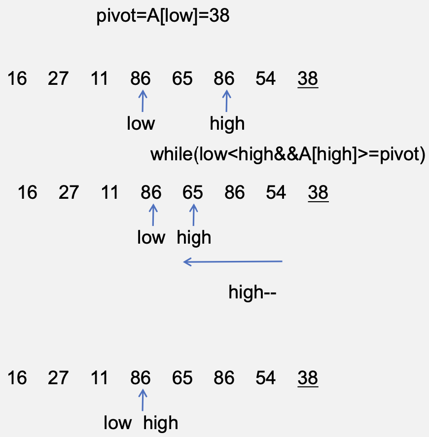
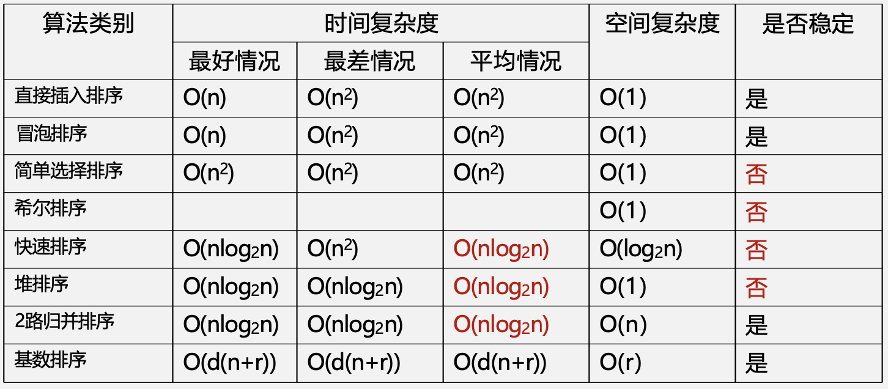

# 排序

## 内部排序

&emsp;&emsp;&ensp;定义：按照**关键字**的大小重新排列表中元素。
&emsp;&emsp;&ensp;输入：${n}$个元素${e_1,e_2,e_3,....,e_n}$，对应关键字为${k_1,k_2,k_3,...,k_n}$。
&emsp;&emsp;&ensp;输出：输入序列的一个排列${e'_1,e'_2,e'_3,....,e'_n}$，使得有${k'_1,k'_2,k'_3,...,k'_n}$有序。
&emsp;&emsp;&ensp;**稳定性**：任意相等的元素，排序前后相对位置不发生改变。

### 插入排序

&emsp;&emsp;&ensp;插入排序：每次将一个新元素插入已经有序的序列中。根据**查找插入位置的方法**不同，有直接插入和折半插入排序两种。

#### 直接插入排序

<div style=" margin: 0 auto; max-width: 70%;">

</div>

&emsp;&emsp;&ensp;初始 ${L[0 ... i-1]}$ 是一个排好序的子序列。
&emsp;&emsp;&ensp;对于元素 ${L[i]}$ 插入到前面已经排好序的子序列当中：
- 查找出 ${L[i]}$ 在有序序列 ${L[0...i-1]}$ 中的插入位置${k}$；
- 将${L[k...i- 1]}$中所有元素后移一个位置；
- 将${L[i]}$复制到${L[k]}$。

<div style=" margin: 0 auto; max-width: 50%;">

</div>

&emsp;&emsp;&ensp;直接插入排序，进行两个工作：
- 从前面的子表中找出待插入元素应该被插入的位置。
- 移动元素将插入元素复制到插入位置。
&emsp;&emsp;&ensp;**空间复杂度：${O(1)}$**
&emsp;&emsp;&ensp;**时间复杂度：${O(n^2)}$**
&emsp;&emsp;&ensp;**改进**：由于是顺序存储的线性表，查找有序子表可以用**折半查找**来实现，确定顺序后统一移动元素。
&emsp;&emsp;&ensp;特点：**输入敏感；稳定排序**。

```cpp
void InsertSort(ElemType A[], int n){
    int i, j;
    for(i=2; i<=n; i++){
        if(A[i]<A[i-1]){ //是否需要向前比较
            A[0]=A[i]; //哨兵
            for(j = i-1; A[0]<A[j]; j--){ //查找插入位置 
                A[j+1] = A[j]; //向后移动元素
            }
            A[j+1] = A[0];
        }
    } 
}
```

#### 折半插入排序

<div style=" margin: 0 auto; max-width: 60%;">

</div>

&emsp;&emsp;&ensp;空间复杂度：${O(1)}$
&emsp;&emsp;&ensp;时间复杂度：${O(n^2)}$
&emsp;&emsp;&ensp;改变了元素比较次数，并没有改变元素移动次数，是**稳定排序**。

```cpp
void InsertSort(ElemType A[], int n){
    int i, j, low, high, mid;
    for(i=2; i<=n; i++){
        A[0] = A[i];
        low=1, high=i-1;
        while(low <= high){ //折半查找
            mid = (low+high)/2;
            if(A[mid]>A[0]) high=mid-1; 
            else low=mid+1;
        }
        for(j=i-1; j>=high+1; j--) A[j+1]=A[j]; //移动元素
        A[high+1]=A[0]; //插入
    } 
}
```

#### 希尔排序

<div style=" margin: 0 auto; max-width: 70%;">

</div>

&emsp;&emsp;&ensp;基本思想：先将待排序表分割成若干形如 ${L[i,i+d,i+2d,...,i+kd]}$ 的“特殊”子表，分别进行直接插入排序，当整个表中元素“基本有序”，再对全体记录进行一次直接插入排序。
&emsp;&emsp;&ensp;排序过程：
- 先取小于 ${n}$ 的步长 ${d_1}$，把表的元素分成 ${d_1}$ 组，所有距离为 ${d_1}$ 的元素放在一组；
- 同一组的元素，在各组中进行**直接插入排序**；
- 然后取第二个步长 ${d_2<d_1}$，重复过程；
- 直到所取 ${d=1}$，即所有元素在一组中，再直接进行插入排序。

### 交换排序

&emsp;&emsp;&ensp;所谓的是指根据序列中的两个元素关键字的比较结果来对换这两个记录在序列中的位置。

#### 冒泡排序

&emsp;&emsp;&ensp;冒泡排序：从后往前（或者从前往后）两两比较相邻元素的值，若为逆序，则交换他们，直到序列比较完，称为**第一趟冒泡**。每一趟冒泡将序列的最小（或最大）元素放到了序列**最终位置**。这样最多做n-1趟冒泡就能把所有元素排好序。

<div style=" margin: 0 auto; max-width: 70%;">

</div>

```cpp
void BubbleSort(ElemType A[], int n){
    int i, j;
    bool flag;
    for(i=0; i<n-1; i++){ //趟数
        flag = false;
        for(j=n-1; j>i; j--){ //当前趟
            if(A[j-1] > A[j]){
                swap(A[j-1], A[j]);
                flag = true;
            }
        if(flag == false) return; //所有元素已经有序
        }
    }
}
```

&emsp;&emsp;&ensp;空间复杂度：${O(1)}$
&emsp;&emsp;&ensp;时间复杂度：${O(n2)}$
&emsp;&emsp;&ensp;**稳定的排序**

---

#### 快速排序

&emsp;&emsp;&ensp;快速排序思想（基于分治）：
1. 在有 ${n}$ 个元素的待排序序列 ${L}$ 中选取一个元素作为枢轴（${pivot}$），一般会**随机选取**或者**取当前序列的首元素**作为枢轴元素，通过一趟排序将整个待排序列分为三部分，${L[1, ..., k-1], L[k], L[k+1, .., n]}$，其中左半部分所有的元素值都小于 ${L[k]}$，右半部分所有的元素值都大于 ${L[k]}$，而此时元素 ${L[k]}$ 即在它的**最终位置上**；
2. 对新的待排序序列 ${L[1, ..., k-1]}$ 和 ${L[k+1, .., n]}$ 分别进行第一步的排序过程；
3. 直至每个新的待排序列只剩下一个元素或为空时，算法结束。

<div style=" margin: 0 auto; max-width: 50%;">

</div>
<div style=" margin: 0 auto; max-width: 50%;">

</div>
<div style=" margin: 0 auto; max-width: 50%;">

</div>
<div style=" margin: 0 auto; max-width: 50%;">

</div>
<div style=" margin: 0 auto; max-width: 50%;">

</div>
<div style=" margin: 0 auto; max-width: 50%;">

</div>
<div style=" margin: 0 auto; max-width: 50%;">

</div>
<div style=" margin: 0 auto; max-width: 50%;">

</div>
<div style=" margin: 0 auto; max-width: 50%;">

</div>

&emsp;&emsp;&ensp;对于快速排序来说，最好的情况是什么样的？最坏的情况是什么样的？
&emsp;&emsp;&ensp;当初始待排序列与最终要求序列一致时，是最坏的情况，此时空间复杂度是 ${O(n)}$，时间复杂度是 ${O(n^2)}$。
&emsp;&emsp;&ensp;当初始待排序列为乱序序列时，是最好的情况，此时空间复杂度是 ${O(log_2n)}$，时间复杂度是 ${O(nlog_2n)}$。
&emsp;&emsp;&ensp;例如：${86 38 38}$，所以**不是稳定排序算法**!

```cpp
void QuickSort(ElemType A[], int low, int high){
    int pos;
    if(low<high){
        pos = Partition(A, low, high); //选取枢轴位置 
        QuickSort(A, low, pos-1);
        QuickSort(A, pos+1, high);
    }
}
int Partition(ElemType A[], int low, int high){
    ElemType pivot = A[low];
    while(low<high){
        //所有的元素都不小于枢轴元素
        while(low<high && A[high]>=pivot) high--; 
        A[low] = A[high];
        //所有的元素都不大于枢轴元素
        while(low<high && A[low] <= pivot) low++;
            A[high] = A[low];
    } 
    A[low] = pivot; //将枢轴元素放到最终位置
    return low;
}
```

---

### 选择排序

&emsp;&emsp;&ensp;选择排序：每趟在后面的 ${n-i+1(i=1,2,...,n-1)}$ 个待排序元素中，作为有序子序列的第 ${i}$ 个元素，直到 ${n-1}$ 趟做完，完成 ${n}$ 个元素的排序。

<div style=" margin: 0 auto; max-width: 70%;">

</div>

#### 简单选择排序

&emsp;&emsp;&ensp;算法思想：假设排序表为 ${L[0...n-1]}$，第 ${i}$ 趟排序即从 ${L[i-1...n-1]}$ 中选择最小的元素与 ${L[i-1]}$ 交换，每一趟排序可以确定一个元素的最终位置。

<div style=" margin: 0 auto; max-width: 70%;">

</div>

&emsp;&emsp;&ensp;空间复杂度：${O(1)}$
&emsp;&emsp;&ensp;时间复杂度：${O(n^2)}$
&emsp;&emsp;&ensp;**不是稳定排序！如{4, 4, 2}**。

```cpp
void SelectSort(ElemType A[], int n){
    int i, j, min, temp;
    for(i=0; i<n-1; i++){
        min=i;
        for(j=i+1; j<n; j++){ //寻找最值
            if(A[j] < A[min]) min=j;
        }
        if(min != i){ //交换当前的最值到最终位置
            temp = A[i];
            A[i] = A[min];
            A[min] = temp;
        }
    }
}
```

#### 堆排序

&emsp;&emsp;&ensp;堆的定义：${n}$个关键字序列${L[1...n]}$称为堆，当且仅当该序列满足：
- 若${L[i] ≤ L[2i]且L[i] ≤ L[2i+1]}$，则称该堆为小根堆；
- 若${L[i] ≥ L[2i]且L[i] ≥ L[2i+1]}$，则称该堆为大根堆。

<div style=" margin: 0 auto; max-width: 60%;">

</div>

&emsp;&emsp;&ensp;排序过程中将${L[1...n]}$当作完全二叉树的**层序遍历**序列。
&emsp;&emsp;&ensp;**小根堆**构建的完全二叉树，根节点比左右子树小。
&emsp;&emsp;&ensp;**大根堆**构建的完全二叉树，根节点比左右子树大。

##### 插入元素10

<div style=" margin: 0 auto; max-width: 30%;">

</div>

1. 将元素置于堆底位置；
2. 从插入位置开始自底向上调整堆；
3. 不需要与兄弟结点比较；
4. 沿单侧树高向上调整。

<div style=" margin: 0 auto; max-width: 40%;">

</div>

##### 删除元素9
1. 将堆底元素移至堆顶；

<div style=" margin: 0 auto; max-width: 30%;">

</div>

2. 自顶向下调整堆；
3. 两个孩子节点都要比较；
4. 沿单侧树高向下调整。

<div style=" margin: 0 auto; max-width: 40%;">

</div>

##### 如何建堆？

<div style=" margin: 0 auto; max-width: 60%;">

</div>

&emsp;&emsp;&ensp;Floyd建堆（以大根堆为例）：

```cpp
void BuildMaxHeap(ElemType A[], int n){
    int i;
    for(i = n/2; i>0; i--){
        HeapAdjust(A, i, n); //调整堆
    }
}

void HeapAdjust(ElemType A[], int k, int n){
    int i;
    A[0] = A[k];
    for(i=2*k; i<=n; i*=2){ //检查当前子树
        if(i<n&&A[i]<A[i+1]) i++;
        if(A[0]>=A[i]) break;
        else{
            A[k] = A[i];
            k=i;
        } 
    }
    A[k] = A[0];
}
```

<div style=" margin: 0 auto; max-width: 40%;">

</div>
<div style=" margin: 0 auto; max-width: 40%;">

</div>
<div style=" margin: 0 auto; max-width: 40%;">

</div>
<div style=" margin: 0 auto; max-width: 40%;">

</div>
<div style=" margin: 0 auto; max-width: 40%;">

</div>
<div style=" margin: 0 auto; max-width: 40%;">

</div>
<div style=" margin: 0 auto; max-width: 40%;">

</div>

&emsp;&emsp;&ensp;堆排序的思路（以大根堆为例）：
1. 将${n}$个元素建成初始堆（堆的初始化）；
2. 将堆顶元素（当前大根堆的最大值）拿下来，与大根堆的最后一个元素进行交换，此时大根堆的性质一定遭到了破坏，则需要我们重新调整为大根堆。

&emsp;&emsp;&ensp;堆的初始化过程：
1. 从当前堆的最后一个非叶子结点（${\lfloor \frac{n}{2}\rfloor}$）开始，对其子树进行调整；
2. 依次向上调整每一棵子树，直至根结点；

&emsp;&emsp;&ensp;如何调整子树?
&emsp;&emsp;&ensp;若当前子树的根结点的值不是当前子树所有结点的最大值，则交换值，使当前子树符合大根堆定义。

&emsp;&emsp;&ensp;堆排序的过程（以大根堆为例）：

<div style=" margin: 0 auto; max-width: 60%;">

</div>
<div style=" margin: 0 auto; max-width: 60%;">

</div>

&emsp;&emsp;&ensp;以此类推后，得到：

<div style=" margin: 0 auto; max-width: 60%;">

</div>

```cpp
void BuildMaxHeap(ElemType A[], int n){
    int i;
    for(i = n/2; i>0; i--){
        HeapAdjust(A, i, n); //调整堆
    }
}

void HeapAdjust(ElemType A[], int k, int n){
    int i;
    A[0] = A[k];
    for(i=2*k; i<=n; i*=2){ //检查当前子树
        if(i<n&&A[i]<A[i+1]) i++;
        if(A[0]>=A[i]) break;
        else{
            A[k] = A[i];
            k=i;
        } 
    }
    A[k] = A[0];
}

void HeapSort(ElemType A[], int n){
    BuildMaxHeap(A, n);
    for(i = n; i>1;i--){
        swap(A[i],A[1]); //堆顶元素与堆尾元素交换
        HeapAdjust(A, 1, i-1);
    }
}
```

&emsp;&emsp;&ensp;对${n}$个元素进行**升序排列**，要使用**大根堆**！
&emsp;&emsp;&ensp;对${n}$个元素进行**降序排列**，要使用**小根堆！**

&emsp;&emsp;&ensp;空间复杂度：${O(1)}$
&emsp;&emsp;&ensp;时间复杂度：建堆时间${O(n)}$；排序时每次调整堆都要调整${O(h)}$，共调整${n-1}$次，时间复杂度为${O(nlog_2n)}$。

&emsp;&emsp;&ensp;堆排序总结：
1. 求**升序序列**初始要构建大根堆，求**降序序列**初始要构建小根堆；
2. 构建初始堆时，从${\frac{n}{2}}$处开始向上调整堆；
3. 堆排序时不断将**堆顶元素与当前堆底元素交换**，更新并调整当前堆；
4. 插入元素时，将待插入元素置于堆底然后沿单侧树高向上调整，直至整个堆合法；
5. 删除元素时，将堆底元素置于堆顶然后沿单侧树高向下调整，直至整个堆合法；
6. 堆排序的时间复杂度是${O(nlogn)}$，空间复杂度是${O(1)}$；插入操作的时间复杂度是${O(logn)}$，删除操作的时间复杂度是${O(logn)}$。

### 归并排序

&emsp;&emsp;&ensp;归并排序：基本思想与交换、选择等排序思想不一样，归并是将多个有序表合成为一个新的有序表。
&emsp;&emsp;&ensp;假定待排序表含有 ${n}$ 个记录，则可将其视为 ${n}$ 个一个记录的有序表，然后两两归并，得到${ ⌈\frac{n}{2}⌉}$ 个长度为2或1的有序表；继续两两归并，直到合并成为一个长度为 ${n}$ 的有序表为止，这种排序方法称为**2路归并排序**。

<div style=" margin: 0 auto; max-width: 60%;">

</div>

&emsp;&emsp;&ensp;空间复杂度：${O(n)}$
&emsp;&emsp;&ensp;时间复杂度：${O(nlog_2n)}$，一共 ${\lceil log_2 \rceil)}$ 趟，每趟 ${O(n)}$。

---

### 基数排序

&emsp;&emsp;&ensp;假设长度为 ${n}$ 的线性表中每个结点 ${a_j}$ 的关键字由 ${d}$ 元组（${k_j^{d-1},k_j^{d-2},\dots,k_j^{1},k_j^{0}}$）组成，满足 ${0≤k_j^i≤r-1\quad(0≤j<n,0≤i≤d-1)}$。其中 ${k_j^{d-1}}$ 为最主位关键字，${k_j^{d-1}}$ 为最次位关键字。
&emsp;&emsp;&ensp;为实现多关键字排序，通常有两种方法：第一种是最高位优先（**MSD**）法，按关键字位权重递减依次**逐层划分**成若干更小的子序列，最后将所有子序列依次连接成一个有序序列。第二种是最低位优先（**LSD**）法，按关键字权重递增依次进行排序，最后形成一个有序序列。
&emsp;&emsp;&ensp;基数排序过程（以r=10为基数的**LSD**）：
1. 首先声明 ${r}$ 个队列 ${Q_0, Q_1, ..., Q_{r-1}}$；
2. 对 ${i=0, 1, ..., d-1}$，依次做一次分配和收集；
&emsp;&emsp;&ensp;分配：开始时，将所有的队列置空，然后依次考察线性表中的每个结点 ${a_j(j=0, 1, ..., n-1)}$，将关键词放到对应的队列中。
&emsp;&emsp;&ensp;收集：将 ${Q_0-Q_{r-1}}$ 各队列中的结点依次首尾相接，得到新的结点序列，组成新的线性表。
3. 重复上述过程 ${d}$ 次。

&emsp;&emsp;&ensp;采用**LSD**进行排序：

<div style=" margin: 0 auto; max-width: 60%;">

</div>
<div style=" margin: 0 auto; max-width: 60%;">

</div>
<div style=" margin: 0 auto; max-width: 60%;">

</div>

&emsp;&emsp;&ensp;注意：${LSD}$ 是整体都会重新打乱参与排序，${MSD}$ 类似于桶排序的规则，会分组进行排序。
&emsp;&emsp;&ensp;空间复杂度：一次分配都用到了 ${r}$ 个队列，每次都重复使用，所以是 ${O(r)}$。
&emsp;&emsp;&ensp;时间复杂度：一共进行了 ${d}$ 趟，每趟的分配时间复杂度是 ${O(n)}$，每次收集的时间复杂度是 ${O(r)}$，所以一共是 ${O(d(n+r))}$。
&emsp;&emsp;&ensp;**稳定排序**。

## 外部排序

### 多路归并排序

&emsp;&emsp;&ensp;外部排序通常采用**归并排序**方法。
&emsp;&emsp;&ensp;外部归并排序算法（以2路平衡归并为例）：
1. 将外存上的待排序信息分为 ${k}$ 个初始序列，进行 ${k}$ 次内部排序得到 ${k}$ 个初始归并段；
2. 内存工作区分为三个区域，输入缓冲区 ${in1,in2}$，输出缓冲区 ${out1}$，从0，1初始归并段中各取出一块数据读入  ${in1,in2}$，对其进行2路归并，排序结果存入 ${out1}$；
&emsp;&emsp;&ensp;若 ${out1}$ 此时满了，将 ${out1}$ 的所有结果输出到归并段 ${R1}$，然后继续进行归并；
&emsp;&emsp;&ensp;若 ${in1,in2}$ 其中一个已空，那么再从初始归并段中取出一块数据，继续进行归并；
4. 直至0，1初始归并段的全部内容完成归并排序;
5. ${2-k}$ 的初始归并段重复上述过程。

### 败者树

&emsp;&emsp;&ensp;败者树：也称失败树，树形选择排序的一种变体，视为一颗完全二叉树，可以帮助归并排序。
&emsp;&emsp;&ensp;思路：每一个叶节点存放各归并段在归并过程中当前**参加比较的记录**，内部结点用来记忆**左右子树的失败者**，胜利者**向上继续进行比较**，直到根结点。
&emsp;&emsp;&ensp;见解：为啥败者树可以帮助归并排序？
&emsp;&emsp;&ensp;主要是多路归并排序，假设有 ${k}$ 路归并排序，这 ${k}$ 路互相比较，找出最小元素，需要 ${k-1}$ 次，如果引用进树形结构，那么只需要 ${log_2k}$ 次。（**树的结构是有信息的**）

<div style=" margin: 0 auto; max-width: 60%;">

</div>
<div style=" margin: 0 auto; max-width: 60%;">

</div>

### 置换-选择排序

&emsp;&emsp;&ensp;为什么需要置换-选择排序？
&emsp;&emsp;&ensp;为了加长归并段的长度，减小归并段的个数。
&emsp;&emsp;&ensp;置换-选择排序：设初始待排文件为 ${FI}$，初始归并段输出文件为 ${FO}$，内存工作区为 ${WA}$，${FO}$ 和 ${WA}$ 的初始状态为空，${WA}$ 可容纳 ${w}$ 个记录。
&emsp;&emsp;&ensp;置换-选择的步骤如下：
1. 从 ${FI}$ 输入 ${w}$ 个记录到工作区 ${WA}$；
2. 从 ${WA}$ 中选择出关键字最小的记录，记为 ${MINIMAX}$ 记录；
3. 将 ${MINIMAX}$ 记录输出到 ${FO}$ 中去；
4. 若 ${FI}$ 不空，则从 ${FI}$ 输入下一个记录到 ${WA}$ 中；
5. 从 ${WA}$ 中所有关键字比 ${MINIMAX}$ 记录的关键字大的记录中选出最小关键字记录，作为新的 ${MINIMAX}$ 记录；
6. 重复3到5，直到 ${WA}$ 中选不出新的 ${MINIMAX}$ 记录为止，由此得到一个初始归并段，输出一个归并段的结束标志到 ${FO}$ 中去；
7. 重复2到6，直到 ${WA}$ 为空，由此得到全部归并段。

<div style=" margin: 0 auto; max-width: 80%;">

</div>

### 最佳归并树

&emsp;&emsp;&ensp;最佳归并树：
&emsp;&emsp;&ensp;归并树：用来描述 ${m}$ 路归并，只有度为0和 ${m}$ 的结点的严格 ${m}$ 叉树。
&emsp;&emsp;&ensp;由于前面的选择置换算法，**归并段长度不等**，所以哪些段先归并哪些后归并，将影响 ${I/O}$ 次数。此时应用前面的哈夫曼树的方法，推广到 ${m}$ 叉树的情景。让记录数少的归并段先归并，记录数多的初始归并段最后归并，就可以建立总 ${I/O}$ 次数最少的。

&emsp;&emsp;&ensp;如何判断是否需要补充虚段？如何计算具体补充多少个？
&emsp;&emsp;&ensp;${k}$ 叉哈夫曼树的叶子结点和非叶子结点应满足 ${n_k = \lceil(\frac{n_0-1}{k-1})\rceil}$。

&emsp;&emsp;&ensp;假设初始9个归并段，其长度为4、12、5、28、22、9、15、7、33，现在做3路平衡归并。

<div style=" margin: 0 auto; max-width: 50%;">

</div>

## 排序的性能分析

### 时间复杂度

### 空间复杂度

## 排序算法的对比

### 性能比较

<div style=" margin: 0 auto; max-width: 80%;">

</div>

### 应用场景