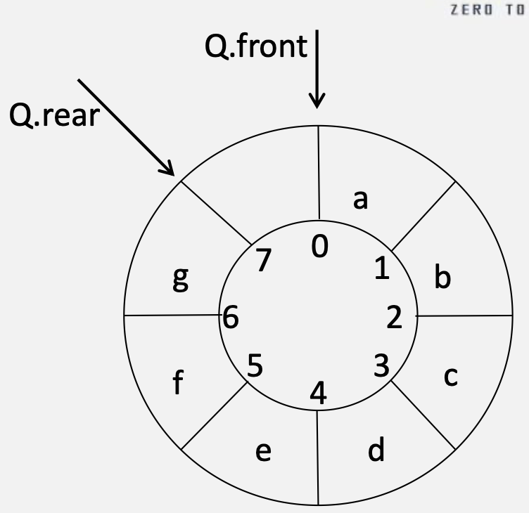

# 栈与队列

## 栈

### 特性

&emsp;&emsp;&ensp;只允许在一端进行插入或删除操作的线性表。

<div style="max-width: 75%; margin: 0 auto;">

</div>

&emsp;&emsp;&ensp;栈的重要性质：当n个元素以某种顺序入栈，并且可以在任意时刻出栈，可以得到的元素排列数目满足**卡特兰函数（catalan）**，即：${\frac{C_{2n}^2}{n+1}}$

### 类型

#### 顺序栈

```cpp
typedef struct Stack{
    Elemtype data[maxSize];
    int top; // 栈顶指针 
}SqStack;

// 基本操作
SqStack s; 
s.top = -1; // 初始化时top位于-1处

if(s.top != MaxSize - 1){ // 入栈前记得判满，若满则上溢！
    s.top++;
    s.data[s.top] = a 
}

if(s.top != -1){ // 出栈前记得判空, 若空则为下溢!
    x = s.data[s.top];
    s.top--; 
}
```

&emsp;&emsp;&ensp;**入栈**指针先变，**出栈**指针后变。

#### 链栈

```cpp
typedef struct LinkStack{
    LinkNode *top;
    void push(elemtype x);
    void pop();
    Elemtype getTop():
}LinkStack;

typedef struct LinkNode{ 
    Elemtype data;
    struct LinkNode *next;
}LinkNode;
```

<div style="max-width: 75%; margin: 0 auto;">

</div>

##### 没有头节点的链栈

1. 入栈

<div style="max-width: 75%; margin: 0 auto;">

</div>

2. 出栈

<div style="max-width: 75%; margin: 0 auto;">

</div>

##### 有头节点的链栈

1. 入栈

<div style="max-width: 75%; margin: 0 auto;">

</div>

2. 出栈

<div style="max-width: 75%; margin: 0 auto;">

</div>

#### 共享栈

&emsp;&emsp;&ensp;两个顺序栈共享一个数组空间。

<div style="max-width: 75%; margin: 0 auto;">

</div>

## 队列

### 特性

&emsp;&emsp;&ensp;只允许在一端进行插入，另一端进行删除操作的线性表。

<div style="max-width: 75%; margin: 0 auto;">

</div>

```cpp
typedef struct{
    Elemtype data[MaxSize];
    int front, rear; //队头指针，队尾指针
}SqQueue;

SqQueue Q; //初始化 
Q.front =0;
Q.rear = 0;

if(Q.rear != MaxSize){
    Q.rear++;
    Q.data[Q.rear] = x; // 入队
}

if(Q.rear != Q.front){
    x = Q.data[Q.front++]; // 出队
}
```

&emsp;&emsp;&ensp;不管出队还是入队，指针都后变。

### 类型

#### 顺序队列

#### 循环队列

```cpp
typedef struct{
    Elemtype data[MaxSize];
    int front, rear; //队头指针，队尾指针
}SqQueue;

SqQueue Q;
Q.rear = Q.front = 0; // 初始

// 牺牲一个空间区分队空/满
if((Q.rear + 1) % MaxSize == Q.front) return false; // 入队先判满
Q.data[Q.rear] = x;
Q.rear = (Q.rear + 1) % MaxSize;

if(Q.rear == Q.front) return false; // 出队先判空
x = Q.data[Q.front];
Q.front = (Q.front+1)%Maxsize;
```

<div style="max-width: 75%; margin: 0 auto;">

</div>

```cpp
// 增设结构成员size区分队空/满
typedef struct{
    Elemtype data[MaxSize];
    int front, rear; //队头指针，队尾指针
    int size; // 队列size
}SqQueue;

SqQueue Q;
Q.rear = Q.front = 0; // 初始
Q.size = (Q.rear + MaxSize - Q.front) % MaxSize; // 队列长度

if(Q.size == 0) return false; // 入队先判满
Q.data[Q.rear] = x;
Q.rear = (Q.rear + 1) % MaxSize;

if(Q.size == MaxSize;) return false; // 出队先判空
x = Q.data[Q.front];
Q.front = (Q.front+1)%Maxsize;
```

```cpp
// 增设结构成员tag区分队空/满
typedef struct{
    Elemtype data[MaxSize];
    int front, rear; //队头指针，队尾指针
    int tag; // 标志位
}SqQueue;

SqQueue Q;
Q.rear = Q.front = 0; // 初始
Q.size = (Q.rear + MaxSize - Q.front) % MaxSize; // 队列长度

if((Q.rear == Q.front) && tag == 1) return false; // 入队先判满
Q.data[Q.rear] = x;
Q.rear = (Q.rear + 1) % MaxSize;
tag = 1; // 入队则tag置1，方便下一次判断

if((Q.rear == Q.front) && tag == 0) return false; // 出队先判空
x = Q.data[Q.front];
Q.front = (Q.front+1)%Maxsize;
tag = 0;
```

#### 链式队列

```cpp
typedef struct{ 
    Elemtype data;
    struct LinkNode *next;
}LinkNode;

typedef struct{
    LinkNode *front, *rear;
}LinkQueue;

(Q.front == NULL) && (Q.rear == NULL); // 队空
```

<div style="max-width: 75%; margin: 0 auto;">

</div>

```cpp
// 没有头结点的链式队列的入队
// 非空队列
LinkNode *s = new LinkNode;
s->data = x;
s->next=NULL;
Q.rear->next = s;
Q.rear = s;

// 空队列
if(Q.rear == NULL){ 
    Q.rear = s;
    Q.front = s;
}

// 出队
if(Q.front != NULL){ //队不为空
    LinkNode *p = Q.front;
    if(Q.front->next == NULL){ //被删除结点是队列最后一个元素
        Q.front = NULL;
        Q.rear = NULL; 
    }else{
        Q.front = Q.front->next;
    }  
    free(p);
}
```

<div style="max-width: 75%; margin: 0 auto;">

</div>

```cpp
// 非空队列
LinkNode *s = new LinkNode; 
s->data = x;
s->next=NULL;
Q.rear->next = s;
Q.rear = s;

// 空队列
if(Q.rear == Q.front){
    Q.rear->next = s;
    Q.rear = s;
}

// 出队
if(Q.front->next != NULL){ //队不为空
    LinkNode *p = Q.front->next;
    Q.front->next = p->next;
    if(Q.rear == p){ //被删除结点是最后一个元素
        Q.rear=Q.front;
    }
    free(p);
}
```

使用链式队列的好处是什么？

1. 内存动态分配；
2. 不存在假溢出的现象；
3. 适合多个队列的需求。

#### 双端队列

&emsp;&emsp;&ensp;队列的任意一端都可以进行插入和删除操作。

<div style="max-width: 75%; margin: 0 auto;">

</div>

## 栈和队列的应用

### 括号匹配

>【例题】假设一个算术表达式中包含“(”、“)”、“[”, “]”、“{”、“}”，试描述一个算法来判断表达式中的括号是否匹配。其中，假设表达式存储在arr数组中，以”\0”作为此表达式的结束符。

思路：

1. 需要一个**暂存括号**的栈op。
2. 当遇到**左括号**时，**入栈**。
3. 当遇到**右括号**时，将栈顶元素**出栈**，出栈元素应与当前右括号匹配，否则就是非法表达式；若当前栈顶为空，则也是非法表达式。
4. 当遍历完成，若op栈不为空则表达式不合法，否则为合法表达式。

### 栈和递归的关系

### 中缀表达式转后缀表达式

>如何将a*(b+c)转换为逆波兰表达式？

思路：

1. 需要两个栈，结果栈result，临时栈temp；
2. 遇到操作数时，直接将数字入栈result；
3. 遇到操作符时
   1. 若是'('，则直接入temp栈；
   2. 若是')'，说明temp中**一定**有'('与之对应，则将temp栈中的所有运算符依次出栈并入栈result，直到遇见'('，括号不会入result栈。
   3. 若是+-*/运算符，则看当前的操作符与temp栈顶的运算符优先级，如果栈顶的运算符优先级更高，则将栈顶的运算符出栈并入栈result，否则当前操作符入栈temp。
4. 当中缀表达式遍历完成后，将temp中的操作符依次出栈并入栈result，result栈中从栈底到栈顶的内容就是后缀表达式。

### 后缀表达式求值

>【例题】计算后缀表达式2 3+1-2*3 8 4/*-的值。

思路：

1. 需要一个存储操作数的栈op。
2. 当遍历到操作数时，将操作数直接入栈op。
3. 当遍历到操作符时，将op连续出栈两个操作数a,b，将运算 b op a的结果入栈op。
4. 当遍历完成时，op栈底即为结果。

>利用栈直接计算表达式(2+3-1)*2-3*(8/4)的值.

思路：将前面两个方法结合起来，中缀转后缀的过程中，每有一个op从temp栈中弹出时，都从result栈中弹出两个操作数a和b，计算b op a 的结果再入栈result，最终遍历结束时result栈中就是计算结果。

## 推广的线性表
