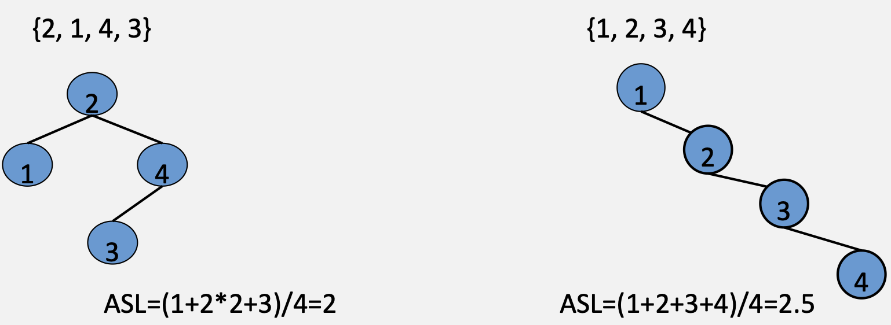

# 树

&emsp;&emsp;&ensp;树的术语：
>结点：树中的每个元素都称为结点；
根结点：任意一棵非空树有且只有一个根结点；
双亲结点：若一个结点有子结点，那么这个结点就称为其子结点的双亲结点；
子结点：一个结点含有的子树称为该结点的子结点；
兄弟结点：具有相同双亲结点的结点互称为兄弟结点；
叶子结点：没有子结点的结点；
结点的层次：从根开始定义起，根为第1层，根的子结点为第2层，以此类推；
树的深度（高度）：树中结点的最大层次；
结点的度：一个结点含有的子树的个数称为该结点的度；
树的度：一棵树中，最大的结点的度称为树的度；
子孙：以某结点为根的子树中任一结点都称为该结点的子孙。

&emsp;&emsp;&ensp;树的性质：

>1. **树中的结点数等于所有结点的度数加1**；
>2. **度为m的树中第i层上至多有${m^{i-1}}$个结点**；
>3. 高度为h的m叉树至多有${\frac{m^h-1}{m-1}}$个结点；
>4. 具有n个结点的m叉树的最小高度为${ceil(log_m(n(m-1)+1))}$。

&emsp;&emsp;&ensp;高度为h的m叉树和高度为h，度为m的树有什么区别？

>1. 度为m的树中，必须**至少有一个结点**有m个孩子结点；
>2. m叉树中可以没有一个结点的孩子数等于m，甚至可以是一棵空树。

## 二叉树

&emsp;&emsp;&ensp;树中每个节点的度数不超过2,即度数为0, 1或2。

&emsp;&emsp;&ensp;二叉树和度为2的有序树有什么区别?

>1. 度为2的树至少有3个结点，二叉树可以为空。
>2. 度为2的有序树的孩子结点的左右次序是相对而言的，若某个结 点只有一个孩子，则这个孩子就不存在左右这个概念。二叉树无论 有没有2个孩子，均需要区分左右孩子结点。

### 二叉树的性质

1. 树中的结点数等于所有结点的度数加1；
2. 非空二叉树上第k层上至多有${2^{k-1}}$个结点；
3. 高度为h的二叉树至多有${2^k-1}$个结点；
4. 具有n个结点的完全二叉树高度为${ceil(log_2(n+1))}$或${floor(log_2n)+1}$；
5. ${n_0=n_2+1}$

### 特殊的二叉树

#### 满二叉树

1. 高为h的满二叉树上一共有${2^h-1}$个结点；
2. 高为h的满二叉树上, 每层都有${2^{h-1}}$个结点；
3. 高为h的满二叉树上, 所有的叶子结点都在最后一层；
4. 高为h的满二叉树上, 除叶子结点外，每个结点的度都为2；
5. 高为h的满二叉树上, 对每个结点从上到下，从左到右进行编号（从1开始），对于任意编号i，若有双亲，则其双亲结点的编号一定是${floor(\frac{i}{2})}$，若有孩子结点，则左孩子编号为${2i}$，右孩子编号为${2i+1}$。

#### 完全二叉树

1. 高为h，有n个结点的完全二叉树上，编号与满二叉树的一一对应；
2. 高为h，有n个结点的完全二叉树上，若结点编号${i>floor(\frac{n}{2})}$，则该结点一定是叶子结点，否则是非叶子结；
3. 高为h，有n个结点的完全二叉树上，叶子结点只会处于最后一层和倒数第二层；
4. 高为h，有n个结点的完全二叉树上，只可能存在一个结点度为1，并且它肯定只有左孩子没有右孩子；
5. 高为h，有n个结点的完全二叉树上，若n为奇数则所有结点度都为2，若为偶数，则有一个结点度为1。（**叶子结点除外**）

具有n个（${n>0}$）结点的完全二叉树的高度为${ceil(log_2(n+1))}$或${floor(log_2(n+1)+1)}$。
证明：
&emsp;&emsp;&ensp;设完全二叉树的高度为h，则有${2^{h-1}-1}$（高度为${h-1}$的满二叉树）${<n≤2^h-1}$（高度为h的满二叉树），或${2^{h-1}≤n<2^h}$。
&emsp;&emsp;&ensp;得${2^{h-1}<n+1≤2^h}$，即${h-1<log_2(n+1)≤h}$，故${h=ceil(log_2(n+1))}$。
&emsp;&emsp;&ensp;或得${h-1≤log_2n<h}$，故${h=floor(log_2n)+1}$。

<div style=" margin: 0 auto; max-width: 15%;">

</div>

### 二叉树的存储

#### 二叉树的顺序存储结构

<div style=" margin: 0 auto; max-width: 75%;">

</div>

#### 二叉树的链式存储结构

<div style=" margin: 0 auto; max-width: 75%;">

</div>

```cpp
typedef struct BiTNode{ 
    Elemtype data;
    struct BiTNode *lchild, *rchild; 
}BiTree;

typedef struct BiTree{ 
    BiTNode *root;
}BiTNode;
```

### 二叉树的遍历

#### 前序遍历

<div style=" margin: 0 auto; max-width: 50%;">

</div>

```cpp
void PreOrder(BiTree T){ // 先序递归遍历
    if(T != null){
        visit(T);
        PreOrder(T->lchild);
        PreOrder(T->rchild);
    }
}
```

思考：先序序列为${1,2,3,\ldots,n}$的二叉树一共有多少种不同的形状（卡特兰数的递推式）？
$${f(4) = 2f(3)+2(f(1)×f(2))}$$
$${= f(3)\times f(0) + f(2)\times f(1) + f(1)\times f(2) + f(0)\times f(3)\quad (f(0)=1)}$$
$${f(n) = f(n-1)\times f(0) + f(n-2)\times f(1)+\ldots + f(1)\times f(n-2) + f(0)\times f(n-1)\quad (f(0)=1)}$$

#### 中序遍历

<div style=" margin: 0 auto; max-width: 50%;">

</div>

```cpp
void PreOrder(BiTree T){ // 中序递归遍历
    if(T != null){
        PreOrder(T->lchild);
        visit(T);
        PreOrder(T->rchild);
    }
}
```

中序递归遍历时，当访问到某结点时，其他结点的状态?
&emsp;&emsp;&ensp;若该结点是其双亲结点的左孩子，则它的双亲结点此时**还没有被访问且在栈中**；
>&emsp;&emsp;&ensp;注：对于系统栈来说，中序遍历时，左右子树都访问完才会出栈双亲结点，而非递归遍历时用户自己申请的栈一般是双亲结点出栈后才访问的右子树（具体代码可能有不同的实现）

&emsp;&emsp;&ensp;当访问到**任意结点**时，都代表以该结点为根的左子树已经遍历完成并且都退出了栈;
&emsp;&emsp;&ensp;若该结点是其双亲结点的右孩子，那么此时其**双亲结点**已经被访问过并且出栈了。

#### 后序遍历

<div style=" margin: 0 auto; max-width: 50%;">

</div>

```cpp
void PreOrder(BiTree T){ // 后序递归遍历
    if(T != null){
        PreOrder(T->lchild);
        PreOrder(T->rchild);
        visit(T);
    }
}
```

后序递归遍历时，当访问到某结点时，其他结点的状态?
&emsp;&emsp;&ensp;当访问到任意结点时，都代表以该结点为根的子树已经全部遍历完成并且都退出了栈，不会再访问到；
&emsp;&emsp;&ensp;不管该结点是其双亲结点的左孩子还是右孩子，此时其双亲结点都没有被访问到并且还在栈中。而且该结点的所有祖先结点也保存在栈中。

#### 层序遍历

<div style=" margin: 0 auto; max-width: 50%;">

</div>

```cpp
void LevelOrder(BiTree T){ //层序遍历
    InitQueue(Q); //声明队列
    BiTree p; //声明工作结点 
    EnQueue(Q, T); //根结点入队 
    while(! isEmpty(Q)){ //遍历整棵树
        DeQueue(Q, p); //出队
        visit(p); //访问当前结点 
        if(p->lchild != null){ //左孩子入队 
            EnQueue(Q,p->lchild);
        }
        if(p->rchild != null){ //右孩子入队 
            EnQueue(Q,p->rchild);
        } 
    }
}
```

### 线索二叉树

#### 前序线索二叉树

先序线索二叉树的特点

<div style=" margin: 0 auto; max-width: 70%;">

</div>

```cpp
typedef struct ThreadNode{
    ElemType data;
    struct ThreadNode *lchild, *rchild;
    intltag,rtag; //tag=0,有孩子.tag=1,无孩子
}ThreadNode;
```

#### 中序线索二叉树

<div style=" margin: 0 auto; max-width: 60%;">

</div>

#### 后序线索二叉树

<div style=" margin: 0 auto; max-width: 60%;">

</div>

## 树和森林

### 树的存储结构

1. 双亲表示法
孩子指向双亲

<div style=" margin: 0 auto; max-width: 60%;">

</div>

2. 孩子表示法
邻接表指向孩子

<div style=" margin: 0 auto; max-width: 60%;">

</div>

3. 孩子兄弟表示法
左孩子右兄弟

<div style=" margin: 0 auto; max-width: 60%;">

</div>

### 树与二叉树的相互转换

核心思路：利用孩子兄弟表示法。
树转二叉树

<div style=" margin: 0 auto; max-width: 80%;">

</div>

二叉树转树

<div style=" margin: 0 auto; max-width: 80%;">

</div>

### 森林与二叉树的相互转换

<div style=" margin: 0 auto; max-width: 80%;">

</div>

### 树的遍历

<div style=" margin: 0 auto; max-width: 30%;">

</div>

#### 先根遍历

先访问根结点，再按先序访问根节点的每棵子树。
${ABEFCDGHI}$

#### 后根遍历

依次访问根结点的每棵子树，最后再访问根节点。
${EFBCGHIDA}$

### 森林的遍历

<div style=" margin: 0 auto; max-width: 40%;">

</div>

#### 先序遍历

首先先序遍历第一棵树，再依次遍历其余的树。
${ABDECFG}$

#### 中序遍历

中序遍历森林的第一棵树，中序遍历其余的树。
${DBEAFCG}$

### 树/二叉树/森林的遍历

<div style=" margin: 0 auto; max-width: 70%;">

</div>

## 树的应用

### 二次排序树（Binary Search Tree）
也叫二叉查找树。二叉排序树或者是空树，或者是满足下列特性的**非空二叉树**：
1. 若左子树非空，则左子树上所有结点关键字值均小于根节点的关键字值；
2. 若右子树非空，则右子树上所有结点关键字值均大于根节点的关键字值；
3. 左、右子树本身也分别是一棵二叉排序树。

<div style=" margin: 0 auto; max-width: 30%;">

</div>

中序遍历序列：${2,4,5,6,8,9,10,12}$
说明：由二叉排序树的定义可知，左子树结点值<根节点值<右子树结点值，故二叉排序树的中序遍历序列是一个递增有序序列。

```cpp
typedef struct BTNode{
    int key;
    struct BTNode *lchild;
    struct BTNode *rchild;
}BTNode; 
```

二叉排序树的基本算法
**插入**

```cpp
// 1. 插入
//     a. 若二叉排序树为空，则直接插入结点；
//     b. 若二叉排序树非空，当值小于根结点时，插入左子树；当值大于根结点时，插入右子树；
//     c. 当值等于根结点时不进行插入。
```

<div style=" margin: 0 auto; max-width: 70%;">

</div>

**构造**

```cpp
// 2. 构造
// 构造一棵二叉排序树就是一次输入数据元素，并将它们插入到二叉排序树中的适合位置上。读入一个元素并建立结点，若二叉排序树为空，将其作为根节点；若二叉排序树非空，当值小于子树根结点时，插入左子树；当值大于子树根结点时，插入右子树；当值等于子树根结点时，一般不进行插入。
```

<div style=" margin: 0 auto; max-width: 70%;">

</div>

**删除**

```cpp
// 3. 删除
// 在二叉排序树中删除一个关键字时，不能把该关键字所在的结点为根的子树全部删除，而是只删除这一个结点，并保持二叉排序树的性质。
```

type1：被删除结点为叶子结点
<div style=" margin: 0 auto; max-width: 70%;">

</div>

type2：被删除结点只有一棵子树
<div style=" margin: 0 auto; max-width: 70%;">

</div>

type3：被删除结点有两棵子树
<div style=" margin: 0 auto; max-width: 70%;">

</div>

>注：在二叉排序树中删除并插入相同结点后，得到的二叉排序树与原来不一定相同。

```cpp
// 4. 查找
// 二叉树非空时，查找根结点，若相等则查找成功；
// 若不等，则当小于根结点值时，查找左子树；
// 当大于根结点的值时，查找右子树；
// 当查找到叶结点仍没查找到相应的值，则查找失败。
```
二叉排序树的平均查找长度（ASL）取决于树的高度，相同的关键字，其插入的顺序不同可能形成不同的二叉排序树。平均查找长度最坏为${O(n)}，最好为${O(log_2n)}$。

<div style=" margin: 0 auto; max-width: 70%;">

</div>

### 平衡二叉树
是一种特殊的二叉排序树，其左右子树都是平衡二叉树，且左右子树高度之差的绝对值不超过1。
平衡因子：结点左子树和右子树的高度差，平衡二叉树结点的平衡因子的值只可能为-1、0、1。

>重要推论1：含有n个结点的平衡二叉树的最大深度为 ${O(log_2n)}$，平衡二叉树的平均查找长度为 ${O(log_2n)}$；
>重要推论2：删除至多一个失衡节点，因为删除后如果失衡的话，删除的必然是一个比他低的且相对较低的子树，而其祖先的平衡因子全部都由更高的另一条子树决定；插入是两辈及以上节点都是不平衡节点。

插入
核心思想：每当在平衡二叉树中插入（删除）一个结点时，都需要检查其路径上的所有结点是否因为刚才的操作导致不平衡。若导致了不平衡，则先找到离操作位置**最近**的第一个不平衡结点，**以该结点为根结点**调整子树。

结点调整
type1：LL型（右单旋转）：由于在结点A的左孩子（L）的左子树（L）上插入了新结点，使A的平衡因子由1增至2，导致**以A为根的子树**失去平衡，需要一次向右的旋转操作。将A的左孩子B向右上旋转代替A成为根结点，将A结点向右下旋转称为B的右子树的根节点，而B的原右子树则作为A结点的左子树。

<div style=" margin: 0 auto; max-width: 70%;">

</div>

type2：RR型（左单旋转）：由于在结点A的右孩子（R）的右子树（R）上插入了新结点，使A的平衡因子由-1减至-2，导致以A为根的子树失去平衡，需要一次向左的旋转操作。将A的右孩子C向左上旋转代替A成为根结点，将A结点向左下旋转称为C的左子树的根节点，而C的原左子树则作为A结点的右子树。

<div style=" margin: 0 auto; max-width: 70%;">

</div>

type3：LR型（先左后右双旋转）：由于在结点A的左孩子（L）的右子树（R）上插入了新结点，使A的平衡因子由1增至2，导致以A为根的子树失去平衡，需要进行两次旋转操作，先左旋转后右旋转。先将A的左孩子B的右子树的根节点E向左旋转提升至B的位置，然后再把该E结点向右上旋转提升至A结点的位置。

<div style=" margin: 0 auto; max-width: 70%;">

</div>

type4：RL型（先右后左双旋转）：由于在结点A的右孩子（R）的左子树（L）上插入了新结点，使A的平衡因子由-1减至-2，导致以A为根的子树失去平衡，需要两次旋转操作，先右旋转后左旋转。先将A结点的右孩子C的左子树根节点D向右上旋转提升到C结点的位置，然后再把该D结点向左上旋转提升到A结点的位置。

<div style=" margin: 0 auto; max-width: 70%;">

</div>

&emsp;&emsp;&ensp;删除操作导致AVL发生不平衡时，类型判断与插入操作类似。

<div style=" margin: 0 auto; max-width: 70%;">

</div>

3+4重构法调整平衡二叉树

&emsp;&emsp;&ensp;任意一棵平衡二叉树，在进行插入或删除操作之前都应该是一棵平衡二叉树。
&emsp;&emsp;&ensp;在进行插入删除操作之后，若产生了不平衡情况，不平衡结点一定位于该结点以上的祖先节点。
&emsp;&emsp;&ensp;任何一个需要被重平衡的结点都包含了两个子树。
&emsp;&emsp;&ensp;如何确定三个结点，四棵子树呢?

<div style=" margin: 0 auto; max-width: 70%;">

</div>
<div style=" margin: 0 auto; max-width: 70%;">

</div>

### 哈夫曼树

树的带权路径长度：树中所有叶结点的带权路径长度之和，记为${WPL=\sum_{i=1}^n(W_i \times L_i)}$，其中${W_i}$是第i个叶结点所带的权值，${L_i}$是该叶结点到根结点的路径长度。
哈夫曼树：含有n个带权叶子结点的**二叉树**中，带权路径长度（WPL）**最小**的二叉树，也称为最优二叉树。

<div style=" margin: 0 auto; max-width: 70%;">

</div>

构造哈夫曼树
<div style=" margin: 0 auto; max-width: 70%;">

</div>
<div style=" margin: 0 auto; max-width: 70%;">

</div>

哈夫曼树的性质
1. 每个初始结点最终都会成为叶结点，并且权值越小的结点到根结点的路径长度越大。
2. 构造过程中共新建了N-1个结点（双分支结点），因此哈夫曼树中结点总数为2N-1。
3. 每次构造都选择两棵子树作为新结点的孩子，因此哈夫曼树中不存在度为1的结点。

哈夫曼编码
1. 固定长度编码：对于待处理的一个字符串序列，对每个字符用同样长度的二进制位来表示；
2. 可变长度编码：对不同字符用不等长的二进制为表示，其可以缩短字符平均编码长度，压缩数据；
3. 前缀编码：没有一个编码是另一个编码的前缀，可以有效的进行解码；
4. 哈夫曼编码：将每个出现的字符当作一个独立的结点，其权值为它出现的次数，构造出对应的哈夫曼树。所有的字符结点出现在叶结点中，可将字符的编码解释为从根至该字符的路径上边标记的序列，一般地，其中边标记为0表示“转向左孩子”，边标记为1表示“转向右孩子”。

哈夫曼编码的特点：
1. 由于根通往任意叶子结点的路径都不可能是通往其余叶子结点路径的子路径，因此任意编码串必然为**前缀码**。
2. 哈夫曼树的特点**出现次数越多的字符编码越短**，最终使得整个字符串被编码后的前缀码长度最短，因此哈夫曼编码产生的是**最短前缀码**。
3. 同一组结点，构造出来的哈夫曼树可能不是唯一的，哈夫曼编码也不一定唯一。

【例题】一串字符串“S=AAABBACCCDEEA”,要求对其进行编码，并且得到的编码长度最短。
<div style=" margin: 0 auto; max-width: 50%;">

</div>
<div style=" margin: 0 auto; max-width: 70%;">

</div>

k叉哈夫曼树
<div style=" margin: 0 auto; max-width: 70%;">

</div>

【例题】一棵k叉哈夫曼树，叶子结点和非叶子结点应满足怎样的关系? 
1. 哈夫曼树只有度为0和度为2的结点，同理k叉哈夫曼树也只有度为0和度为k的结点；
2. 已知树有此性质：${n=n_0+n_k=kn_k+1}$；
3. 故k叉哈夫曼树的叶子结点和非叶子结点应满足${n_k=ceil(\frac{n_0-1}{k-1})}$；
4. 可能要补充**虚结点**。

<div style=" margin: 0 auto; max-width: 70%;">

</div>

### 并查集

定义：并查集是一种树型的数据结构，用于处理一些不相交集合的合并及查询问题（即所谓的并、查）。

初始化
<div style=" margin: 0 auto; max-width: 70%;">

</div>

```cpp
int pre[MaxSize];
void init(int n){
    for(int i=1; i<=n; i++){
        pre[i]=i;
    } 
}
```
合并
<div style=" margin: 0 auto; max-width: 70%;">

</div>

```cpp
void merge(int i, int j){
    pre[find(i)] = find(j); 
}   
```

查找
<div style=" margin: 0 auto; max-width: 70%;">

</div>

```cpp
int find(int x){
    if(pre[x] == x){
        return x; 
    }else{
        return find(pre[x]);
    } 
}
```

路径压缩
<div style=" margin: 0 auto; max-width: 70%;">

</div>

<div style=" margin: 0 auto; max-width: 70%;">

</div>

```cpp
int find(int x){
    if(pre[x] == x){
        return x; 
    }else{
        pre[x] = find(pre[x]) // 路径压缩

        return pre[x];
    } 
}
```

并查集**总结**
>1. 用集合中的某个元素来代表这个集合，则该元素称为此集合的代表元；
>2. 一个集合内的所有元素组织成以代表元为根的树形结构；
>3. 对于每一个元素${x，pre[x]}$存放x在树形结构中的父亲节点（如果x是根节点，则令${pre[x] = x}$）;
>4. 对于查找操作，假设需要确定x所在的的集合，也就是确定集合的代表元。可以沿着${pre[x]}$不断在树形结构中向上移动，直到到达根节点。

因此，基于这样的特性，并查集的主要用途有以下两点：
>1. 维护无向图的连通性（判断两个点是否在同一连通块内，或增加一条边后是否会产生环）；
>2. 用在求解最小生成树的Kruskal算法。
