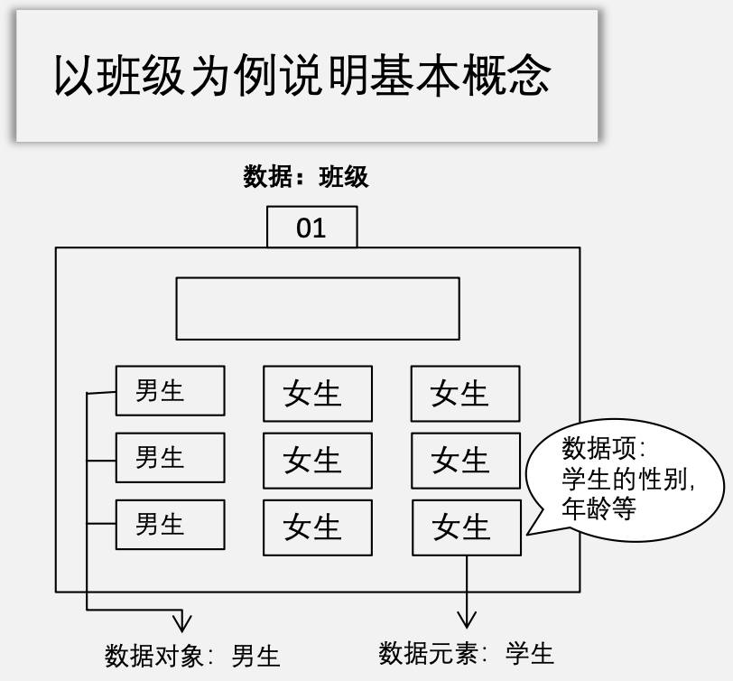
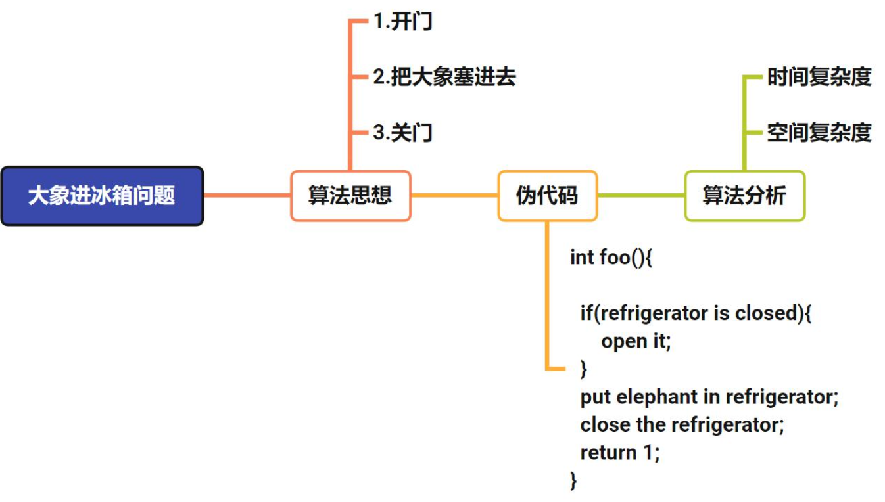

# 绪论

---

## 数据结构

**什么是数据结构？**

>数据结构是带有结构特性的数据元素的集合。

&emsp;&emsp;&ensp;数据结构**关注**的是数据的结构特性以及数据之间的相互关系，**并不关注**数据的具体内容。
&emsp;&emsp;&ensp;**研究**的是数据的逻辑结构以及物理结构，还有他们之间的相互关系，并对这种结构定义相应的运算，设计对应的算法，比如增删改查。
&emsp;&emsp;&ensp;原则：对任何数据结构进行相应的操作之后，都**不能改变**原有的数据结构特点。

1. 数据：客观事物的符号表示，可以将计算机中存储的一切都看成是数据。
2. 数据元素：数据的**基本**单位。
3. 数据项：是数据不可分割的**最小**单位。一个数据元素可由若干个数据项组成。
4. 数据对象：**性质相同**的数据元素的集合。

### 逻辑结构

&emsp;&emsp;&ensp;数据元素之间的**逻辑关系**。这与计算机无关，仅限于人的思维层面。

#### 线性结构

线性表

#### 非线性结构

1. 集合
2. 树形结构
3. 图结构

### 存储结构（物理结构）

&emsp;&emsp;&ensp;逻辑结构在**计算机**中的表示，就是数据存储在磁盘中的方式。

1. 顺序存储
2. 链式存储
3. 散列存储
4. 索引存储

### 数据结构

&emsp;&emsp;&ensp;一个算法的**设计**取决于所选定的逻辑结构，而算法的**实现**依赖于所采用的物理结构。

1. 逻辑结构
2. 物理结构
3. 数据的运算

### 数据的运算

> 【例题】可以用（D）定义一个完整的数据结构。
A. 数据元素
B. 数据对象
C. 逻辑结构，存储结构和数据的运算
D.抽象数据类型
&emsp;&emsp;&ensp;数据结构包含逻辑结构，存储结构和数据的运算；而只需要**抽象数据类型（ADT）**即可定义一个完整的数据结构。

---

## 算法和算法评价

**什么叫算法？**
> 解决问题的过程或者步骤

&emsp;&emsp;&ensp;算法（Algorithm）是指解题方案的准确而完整的描述，也就是说，能够对**一定规范的输入**，在**有限时间**内获得**所要求的输出**。不同的算法可能用不同的时间、空间或效率来完成同样的 任务。一个算法的**优劣**可以用**空间复杂度**与**时间复杂度**来衡量。
&emsp;&emsp;&ensp;算法中的指令描述的是一个计算，当其运行时能从一个初始状态和（可能为空的）初始输入开始，经过一系列**有限**而清晰定义的状态，**最终产生输出并停止于一个终态**。
即使在当前，**依然常有直觉想法难以定义为形式化算法的情况**。

### 算法的定义

1. **算法**：提供了逐步解决特定问题的方法。可以用自然语言、流程图等表示算法。
2. **伪代码**：一种表示算法的方法，可以帮助编写程序。它没有特定于编程语言的语法，但使用诸如for、while、if的构造。
3. **代码/程序**：用特定计算机语言编写的一组指令。编译器/解释器将程序转换为机器可读的代码，然后计算机执行该程序。

### 算法的特征

1. **有穷性**：必须执行有限步后结束。
2. **确定性**：每一步必须有确切定义。
3. **可行性**：任何步骤都可被分解为基本的可执行操作，每个操作都能在有限时间内完成。
4. **输入**：算法必须有零个或多个输入。
5. **输出**：算法必须有一个或多个输出。

### 算法的四大目标

1. **正确性**：算法可以正确的解决问题。
2. **可读性**：算法程序应易读，好理解。
3. **健壮性**：可以应对非法数据，处理好边界条件。
4. **效率与低存储量需求**：优秀的时间复杂度和空间复杂度。

### 算法的度量

#### 时间复杂度

&emsp;&emsp;&ensp;算法时间复杂度：以算法中基本操作重复执行的次数（简称为频度）作为算法的时间度量。一般不必要精确计算出算法的时间复杂度，只要大致计算出相应的数量级即可，如O(1), O(n)等。
&emsp;&emsp;&ensp;求算法时间复杂度步骤：

1. **确定规模**：通常在形参中给出参数规模n。
2. **计算频度T(n)**：通常以算法中的基本运算（若有循环，循环中最深层的语句为基本运算）为核心，求出其执行次数。
3. **用O表示时间复杂度**：只保留T(n)的最高阶，如果这个最高阶的系数不为1，则忽略。

&emsp;&emsp;&ensp;复杂度运算规则：
$${T(n) = T_1(n) + T_2(n) = O(f(n)) + O(g(n)) = O(max(f(n), g(n)))}$$
$${T(n) = T_1(n) \times T_2(n) = O(f(n)) \times O(g(n)) = O(f(n) \times g(n))}$$

&emsp;&emsp;&ensp;常见的时间复杂度排序：
$${O(1) ≤ O(log_2 n) ≤ O(n) ≤ O(nlog_2n) ≤ O(n^2) ≤ ... ≤ O(n^k) ≤ O(2^n) ≤ O(n!) ≤ O(n^n)}$$

##### 求时间复杂度题型归纳

&emsp;&emsp;&ensp;对于多层循环的题目：

1. 如果最外层是非线性变化，例如指数变化，那么只能采用定义法求时间复杂度；
2. 如果最外层是线性变化，那么定义法和简便法都可以求时间复杂度。

&emsp;&emsp;&ensp;求时间复杂度时，需要关注的地方：

1. 循环的特点，是线性变化还是非线性变化；
2. 循环退出的条件；
3. 循环体内执行的语句。

#### 空间复杂度

&emsp;&emsp;&ensp;该算法除存储数据结构本身所需要的空间外，还需要的**额外存储空间**。
&emsp;&emsp;&ensp;原地工作：算法需要所消耗的存储空间**并不随着输入数据的规模变化而变化**，那么该算法的空间复杂度是${O(1)}$。
