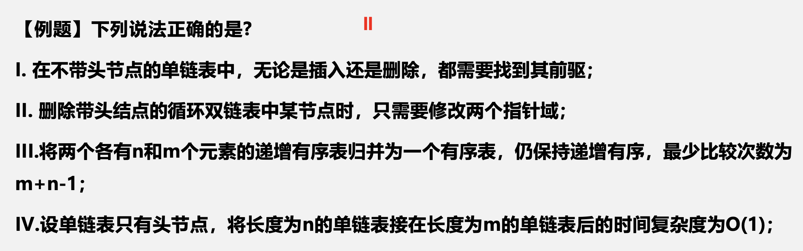
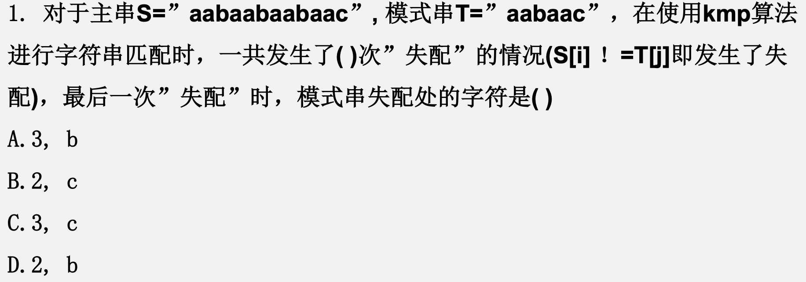

# 强化_1

## 绪论

<div style=" margin: 0 auto; max-width: 80%;">

</div>

<div style=" margin: 0 auto; max-width: 90%;">

</div>

<div style=" margin: 0 auto; max-width: 70%;">

</div>

## 线性表

&emsp;&emsp;&ensp;定义：具有相同数据类型的n个数据元素构成的有限序列，表中除第一个和最后一个元素外，每一个元素都有唯一的直接前驱和直接后继，第一个元素只有后继，第一个元素只有后继，最后一个元素只有前驱。

### 顺序存储结构

<div style=" margin: 0 auto; max-width: 80%;">

</div>

<div style=" margin: 0 auto; max-width: 80%;">

</div>

<div style=" margin: 0 auto; max-width: 70%;">

</div>

<div style=" margin: 0 auto; max-width: 60%;">

</div>

```c
int firstMissingNum(SqList& L) {
    int n=L.length;
    int nums[]=(int*)mallloc(sizeof(int)*(n+1));
    int i=0;
    while(i<=n) {   // 初始化数组
        nums[i++]=0
    }
    for(i=0; i<0; i++) {    // 建立映射
        if(L.data[i]>0) {
            nums[L.data[i]]=1;
        }
    }
    for(i=1; i<=n; i++) {   // 寻找缺失的第一个正整数
        if(nums[i]==0) break;
    }
    return i;
}
```

&emsp;&emsp;&ensp;时间复杂度：${O(n)}$
&emsp;&emsp;&ensp;空间复杂度：${O(n)}$

### 链式存储结构

<div style=" margin: 0 auto; max-width: 80%;">

</div>

&emsp;&emsp;&ensp;存储结构并不是取决于其实现形式，而取决于其**实现方法**。
&emsp;&emsp;&ensp;链式存储：逻辑上相邻的元素，物理地址不一定相邻。

<div style=" margin: 0 auto; max-width: 70%;">

</div>

```c
ListNode* merge(ListNode* list1, ListNode* list2) {
    ListNode* dummy_head=(ListNode*)malloc(sizeof(ListNode));
    ListNode* pre=dummy_head;
    dummy_head->next=NULL;
    while(list1 && list2) {
        if(list1->val <= list2->val) {
            pre->next=list1;
            list1=list1->next;
        }else {
            pre->next=list2;
            list2=list2->next;
        }
        pre=pre->next;
    }
    pre->next=list1==NULL ? list2 : list1;
    return dummy_head->next;
}
```

```c
ListNode* merge(ListNode* list1, ListNode* list2) {
    if(list1==NULL) return list2;
    if(list2==NULL) return list1;
    if(list1->val < list2->val) {
        list1->next=merge(list1->next, list2);
        return list1;
    }else {
        list2->next=merge(list1, list2->next);
        return list2;
    }
}
```

&emsp;&emsp;&ensp;已知两个长度分别为m和n的升序链表，若将它们合并为长度为m+n的降序链表，最好/坏情况的时间复杂度是多少？

<div style=" margin: 0 auto; max-width: 60%;">

</div>

<div style=" margin: 0 auto; max-width: 70%;">

</div>

<div style=" margin: 0 auto; max-width: 60%;">

</div>

```c
// Definition for singly-linked list.
typedef struct {
    int val;
    struct ListNode *next;
}ListNode;
```

```c
ListNode* removeNthFromEnd(ListNode* head, int n) {
    int count=1;
    ListNode *slow=head, *fast=head;
    ListNode *pre=NULL;
    while(count<=n) {   // fast比slow快n个节点
        fast=fast->next;
        count++;
    }
    while(fast!=NULL) {
        fast=fast->next;
        pre=slow;
        slow=slow->next;
    }
    if(pre==NULL) return head->next;    // 如果倒数第k个结点是首元结点
    pre->next=slow->next;
    return head;
}
```

&emsp;&emsp;&ensp;如何在最短的时间内找到单链表L的中间结点？

<div style=" margin: 0 auto; max-width: 60%;">

</div>

<div style=" margin: 0 auto; max-width: 60%;">

</div>

```c
// Definition for singly-linked list.
typedef struct {
    int val;
    struct ListNode *next;
}ListNode;
```

```c
ListNode* findMid(ListNode* head) {
    ListNode *dummy_head=malloc(sizeof(ListNode*)); // 虚头节点
    dummy_head->next=head;
    ListNode *slow=dummy_head;  // 慢指针
    ListNode *fast=dummy_head;  // 快指针
    while(fast&&fast->next) {
        slow=slow->next;
        fast=fast->next->next;
    }
    free(dummy_head);
    return slow;
}
```

<div style=" margin: 0 auto; max-width: 60%;">

</div>

<div style=" margin: 0 auto; max-width: 60%;">

</div>

<div style=" margin: 0 auto; max-width: 60%;">

</div>

```c
typedef struct {
    int val;
    struct ListNode *next;
}ListNode;
```

```c
ListNode* rotateRight(ListNode* head, int k) {
    if(head==NULL || k==0) return head; // 边界条件
    int length=0;
    ListNode *slow=head, *fast=head;
    while(slow!=NULL) {
        length++;
        slow=slow->next;
    }
    k=k>=length? k%length: k;
    if(k==0) return head;   // 不用旋转
    slow=head;
    while(k>0) {    // 快指针先走k个结点
        fast=fast->next;
        k--;
    }
    while(fast->next!=NULL) {
        fast=fast->next;
        slow=slow->next;
    }
    fast->next=head;
    head=slow->next;
    slow->next=NULL;
    return head;
}
```

<div style=" margin: 0 auto; max-width: 70%;">

</div>

<div style=" margin: 0 auto; max-width: 70%;">

</div>

<div style=" margin: 0 auto; max-width: 70%;">

</div>

<div style=" margin: 0 auto; max-width: 70%;">

</div>

&emsp;&emsp;&ensp;奇偶链表如何处理？
&emsp;&emsp;&ensp;【算法思想】这题主要分为三个步骤实现，首先找到中间结点，然后将链表从中间断开分为两部分，后半部分链表做逆置，最后两个链表从头向尾遍历判断是否值相同，如果比到最后就是回文链表，否则就不是，注意如果链表总长度为奇数时应该跳过中心结点的比较。
&emsp;&emsp;&ensp;找到中间结点->逆置任意一半的链表->对比结点的值

```c
typedef struct {
    int val;
    struct ListNode *next;
}ListNode;
```

```c
bool isPalindrome(ListNode* head) {
    ListNode *dummy_head=(ListNode*)malloc(sizeof(ListNode));   // 虚头节点
    dummy_head->next=head;
    ListNode *fast=dummy_head;
    ListNode *slow=dummy_head;
    int len=0;
    while(fast!=NULL && fast->next!=NULL) { // 寻找中间节点
        slow=slow->next;
        fast=fast->next->next;
        len+=2;
    }
    if(fast==NULL) len--;   // 多算一个
    // 链表分裂
    fast=slow->next;
    slow->next=NULL;
    // 对前半部分链表进行逆置
    slow=dummy_head->next;
    ListNode *behind=NULL;
    dummy_head->next=NULL;
    while(slow!=NULL) {
        behind=slow->next;
        slow->next=dummy_head->next;
        dummy_head->next=slow;
        slow=behind;
    }
    if(len%2==1) {  // 长度为奇数，跳过中心节点
        slow=dummy_head->next->next;
    }else { // 长度为偶数
        slow=dummy_head->next;
    }
    while(slow!=NULL && fast!=NULL) {
        if(slow->val!=fast->val) return false;
        slow=slow->next;
        fast=fast->next;
    }
    free(dummy_head);
    return true;
}
```

<div style=" margin: 0 auto; max-width: 70%;">

</div>

<div style=" margin: 0 auto; max-width: 70%;">

</div>

<div style=" margin: 0 auto; max-width: 70%;">

</div>

## 栈和队列

<div style=" margin: 0 auto; max-width: 70%;">

</div>

<div style=" margin: 0 auto; max-width: 70%;">

</div>

<div style=" margin: 0 auto; max-width: 70%;">

</div>

<div style=" margin: 0 auto; max-width: 70%;">

</div>

### 中缀表达式转换为后缀表达式

&emsp;&emsp;&ensp;如何将a*(b+c)转换为逆波兰表达式?
&emsp;&emsp;&ensp;思路：
1. 需要两个栈，结果栈result，临时栈temp；
2. 遇到操作数时，直接将数字入栈result；
3. 遇到操作符时
   1. 若是'('，则直接入temp栈；
   2. 若是')'，说明temp中一定有'('与之对应，则将temp栈中的所有运 算符依次出栈并入栈result，直到遇见'('，括号不会入result栈；
   3. 若是+-*/运算符，则看当前的操作符与temp栈顶的运算符优先级, 如果栈顶的运算符优先级更高，则将栈顶的运算符出栈并入栈result，否则当前操作符入栈temp。
4. 当中缀表达式遍历完成后，将temp中的操作符依次出栈并入栈result，result栈中从栈底到栈顶的内容就是后缀表达式。

### 后缀表达式求值

&emsp;&emsp;&ensp;【例题】计算后缀表达式23+2*384/*-5+2-的值
&emsp;&emsp;&ensp;思路：
1. 需要一个存储操作数的栈op；
2. 当遍历到操作数时，将操作数直接入栈op；
3. 当遍历到操作符时，将op连续出栈两个操作数a，b，将运算结果(b op a)入栈op；
4. 当遍历完成时，op栈底即为结果。

<div style=" margin: 0 auto; max-width: 70%;">

</div>

&emsp;&emsp;&ensp;思想：本题要求使用两个栈来模拟队列运算操作，栈的特点是FILO，而队列的特点的FIFO，这就决定了我们要利用两个栈来进行“捣腾”，用s1来做入队的队列，s2做出队的队列，将s1内的元素全部倒入s2中，所有“先进”的元素现在是不是也就可以“先出”了，另外，这个题是不需要考虑s1和s2容量关系的，它俩必须是相等的才可以符合普通队列的性质。

```c
int Enqueue(Stack &s1, Stack &s2, Elemtype e) {
    if(!StackOverFlow(s1)) {
        push(s1, e);
        return 1;
    }
    if(StackOverFlow(s1) && !StackIsEmpty(s2)) {
        printf("队列已满！");
        return 0;
    }
    if(StackOverFlow(s1) && StackIsEmpty(s2)) {
        Elemtype* x;
        while(!StackIsEmpty(s1)) {
            Pop(s1, x);
            Push(s2, x);
        }
    }
    Push(s1, e);
    return 1;
}
```

&emsp;&emsp;&ensp;入队：

1) 如果入队队列s1不满，那么可以直接入队；
2) 如果s1此时已经满了，而出队队列s2也不为空，就无法进行入队操作，因为如果你此时将s1内的元素倒入s2的话就会导致原来在出队队列s2中的元素“被埋”；
3) 如果s1此时已经满了，而出队队列s2为空，为了保证队列FIFO的特性，必须先将s1内的所有元素倒入s2中，再进行入队操作。

```c
void Dequeue(Stack &s1, Stack &s2, Elemtype &x) {
    if(!StackIsEmpty(s2)) {
        Pop(s2, x);
    }else if(!StackIsEmpty(s1)) {
        while(!StackIsEmpty(s1)) {
            Pop(s1, x);
            Push(s2, x);
        }
        Pop(s2, x);
    }else {
        printf("队列为空！");
    }
}
```

```c
bool QueueIsEmpty(Stack &s1, Stack &s2) 
    return StackIsEmpty(s1) && StackIsEmpty(s2);
```

&emsp;&emsp;&ensp;出队：

1) 如果此时出队队列s2不为空，直接出队；
2) 如果此时s2为空，而s1中有元素则说明此时队列不为空，将s1的元素全部倒入s2，出队栈顶元素；
3) 如果此时s1和s2都为空，显然出队失败。

&emsp;&emsp;&ensp;判空：s1和s2都为空则说明此时队列为空。

<div style=" margin: 0 auto; max-width: 70%;">

</div>

```c
int str2int(char *s, int n) {
    int i, sum=0;
    for(i=0; i<n; i++) {
        sum*=10;
        sum+=s[i]-'0';  // char型数字减去char型的0就是这个数字的值
    }
    return sum;
}
```

```c
int sum=0;  // 全局变量
void trans(char *s, int pos, int n) {
    if(pos==n) {    // 递归边界
        return;
    }
    sum*=10;
    sum+=s[pos]-'0';
    trans(s, pos+1, n);
}
int str2int(char *s, int n) {
    trans(s, 0, n);
    return sum;
}
```

## 数组、矩阵和串

<div style=" margin: 0 auto; max-width: 90%;">

</div>

<div style=" margin: 0 auto; max-width: 90%;">

</div>

<div style=" margin: 0 auto; max-width: 90%;">

</div>

<div style=" margin: 0 auto; max-width: 90%;">

</div>

<div style=" margin: 0 auto; max-width: 90%;">

</div>

<div style=" margin: 0 auto; max-width: 70%;">

</div>

<div style=" margin: 0 auto; max-width: 40%;">

</div>

<div style=" margin: 0 auto; max-width: 70%;">

</div>

<div style=" margin: 0 auto; max-width: 70%;">

</div>

<div style=" margin: 0 auto; max-width: 70%;">

</div>

&emsp;&emsp;&ensp;最后一次失配时滑动的距离是多少？
&emsp;&emsp;&ensp;j-next[j]

<div style=" margin: 0 auto; max-width: 70%;">

</div>

<div style=" margin: 0 auto; max-width: 70%;">

</div>

```c
int** generate(int n, int* returnSize, int** returnColumnSize) {
    int** res=malloc(sizeof(int*)*n);
    *returnSize=n;
    *returnColumnSizes=malloc(sizeof(int)*n);   // 存储杨辉三角每一行元素的个数
    for(int i=0; i<n; ++i) {
        res[i]=malloc(sizeof(int)*(i+1));
        (*returnColumnSizes)[i]=i+1;
        res[i][0]=res[i][i]=1;
        for(int j=1; j<i; ++j) {
            res[i][j]=res[i-1][j]+res[i-1][j-1];
        }
    }
    return res;
}
```

## 线性表算法题总结

&emsp;&emsp;&ensp;**类型**：**顺序表，链表**，栈，队列；
&emsp;&emsp;&ensp;**操作**：查找，插入，删除；
&emsp;&emsp;&ensp;**做法**：**暴力，双指针**，三指针，辅助数组；
&emsp;&emsp;&ensp;**函数模块**：顺序查找，找链表中间结点，头插法建立链表，尾插法建立链表，逆置链表；
&emsp;&emsp;&ensp;**注意：数组下标越界，空指针访问，循环退出条件**。