# 强化_2

&emsp;&emsp;&ensp;树的深度（高度）：树中结点的最大层次，右图中的树的深度为4。
&emsp;&emsp;&ensp;结点的度：一个结点含有的子树的个数称为该结点的度。
&emsp;&emsp;&ensp;树的度：一棵树中，最大的结点的度称为树的度，右图中的树的度为3。
&emsp;&emsp;&ensp;子孙：以某结点为根的子树中任一结点都称为该结点的子孙。
&emsp;&emsp;&ensp;路径：由一系列结点组成的序列，方向为从上到下。
&emsp;&emsp;&ensp;路径长度：路径中包含的边数。

<div style=" margin: 0 auto; max-width: 30%;">
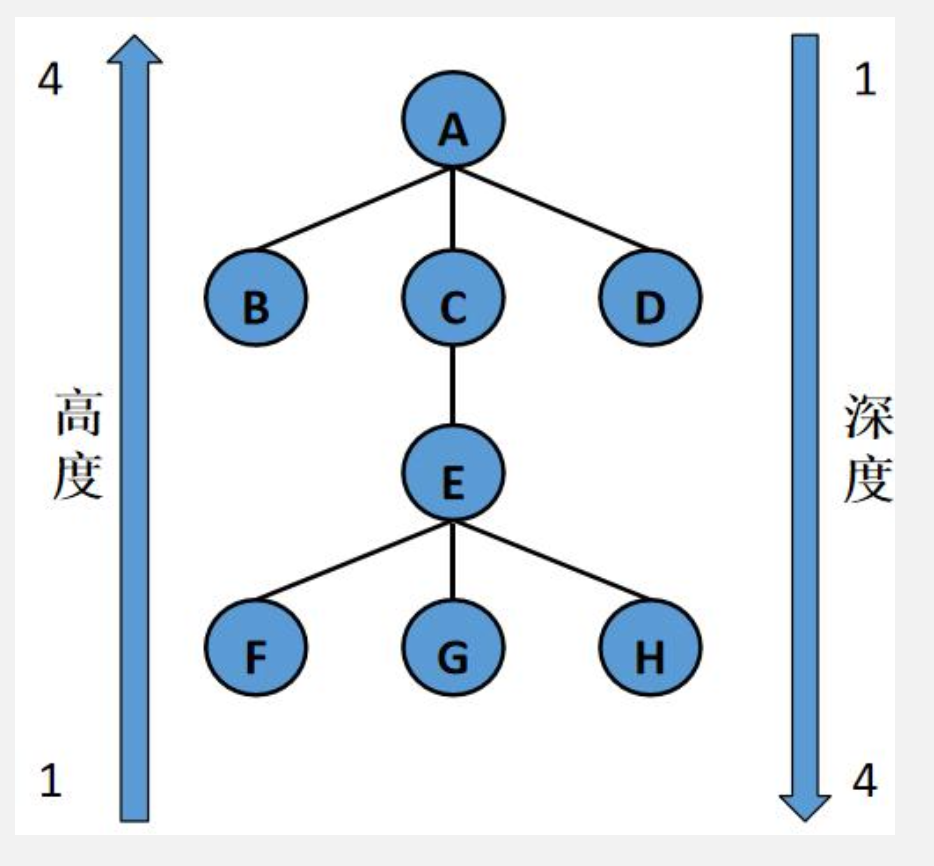
</div>

## 二叉树

<div style=" margin: 0 auto; max-width: 70%;">
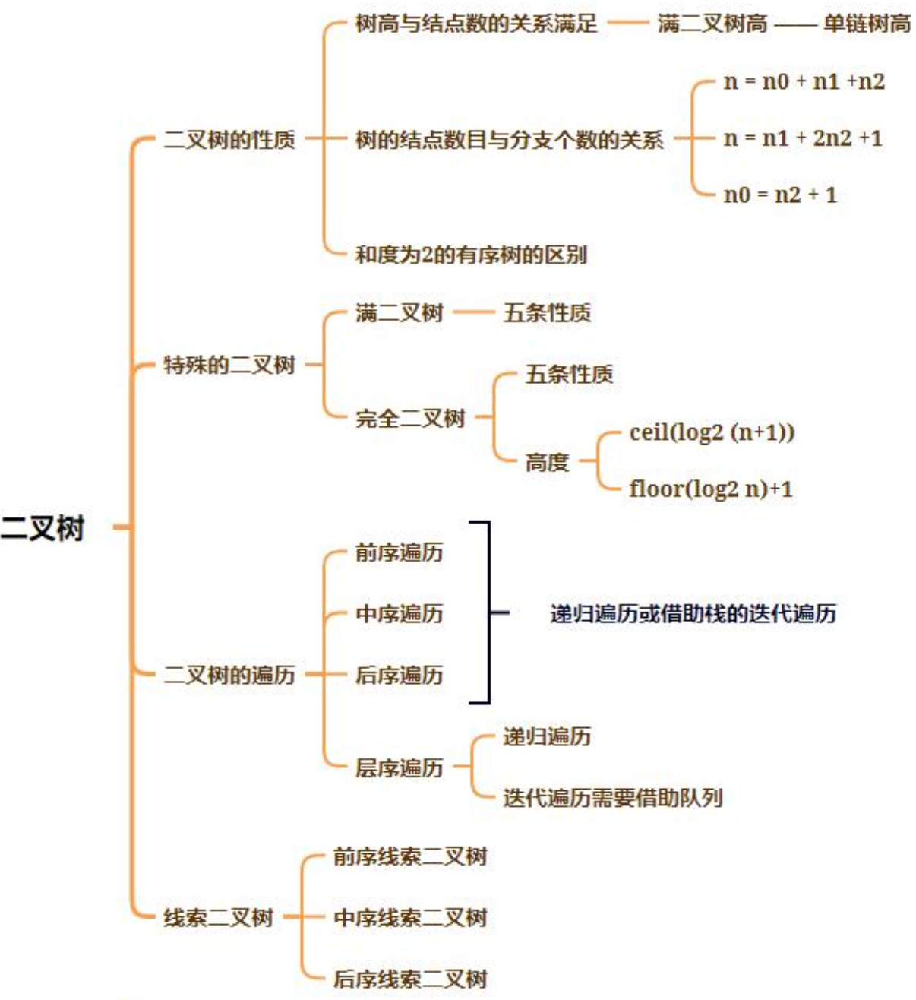
</div>

### 特殊的二叉树

1. 高为h的满二叉树上一共有2h-1个结点。
2. 高为h的满二叉树上，每层都有2h-1个结点。
3. 高为h的满二叉树上，所有的叶子结点都在最后一层。
4. 高为h的满二叉树上，除叶子结点外，每个结点的度都为2.
5. 高为h的满二叉树上，对每个结点从上到下，从左到右进行编号（从1开始），对于任意编号i，若有双亲，则其双亲结点的编号一定是 ${\lfloor \frac{i}{2}\rfloor}$，若有孩子结点，则左孩子编号为2i，右孩子编号为2i+1。

<div style=" margin: 0 auto; max-width: 20%;">
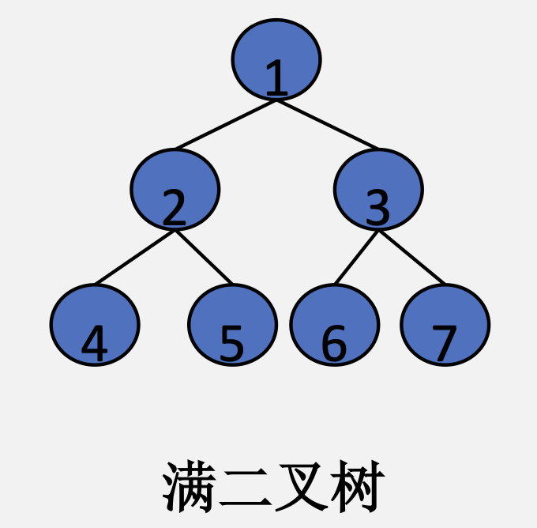
</div>

1. 高为h，有n个结点的完全二叉树上，编号与满二叉树的一一对应。
2. 高为h，有n个结点的完全二叉树上，若结点编号 ${i>\lfloor \frac{n}{2} \rfloor}$，则该结点一定是叶子结点，否则是非叶子结点。
3. 高为h，有n个结点的完全二叉树上，叶子结点只会处于最后一层和倒数第二层。
4. 高为h，有n个结点的完全二叉树上，只可能存在一个结点度为1并且它肯定只有左孩子没有右孩子。
5. 高为h，有n个结点的完全二叉树上，若n为奇数则所有结点度都为2，若为偶数，则有一个结点度为1。

<div style=" margin: 0 auto; max-width: 20%;">
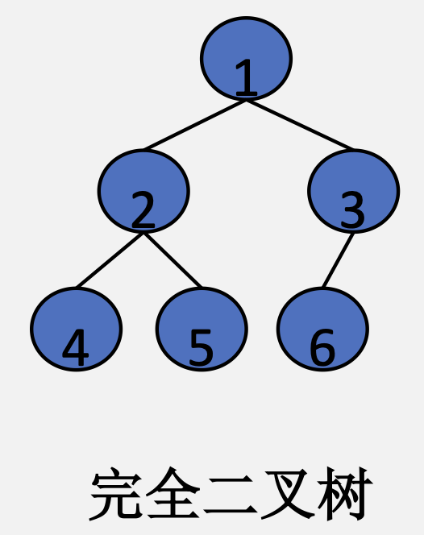
</div>

&emsp;&emsp;&ensp;具有n个（n>0）结点的完全二叉树的高度为 ${\lceil log2(n+1)\rceil}$ 或 ${\lfloor log_2n+1\rfloor}$。
&emsp;&emsp;&ensp;证明：设完全二叉树的高度为h，则有 ${2^{h-1}-1<n≤2^h-1}$，或 ${2^{h-1}≤n<2^h}$，得 ${2^{h-1}<n+1≤2^h}$，即 ${h-1<log_2(n+1)≤h}$，故 ${h=\lceil log_2(n+1)\rceil}$ 或得 ${h-1 ≤ log_2n< h}$，故 ${h=\lfloor log_2 n\rfloor+1}$。

&emsp;&emsp;&ensp;【例题】高度为h的含有度为1的结点的完全二叉树，最少有多少个结点？最多有多少个结点？
&emsp;&emsp;&ensp;当第h层只有一个结点时，总的结点个数最少，也就是前h-1层是棵满二叉树，此时 ${n=2^{h-1}-1 + 1=2^h-1}$；
&emsp;&emsp;&ensp;当第h层差一个铺满的时候，总的结点个数最多，此时 ${n=2^h-1-1 = 2^h-2}$
&emsp;&emsp;&ensp;注：如果题干没有说带不带度为1的结点，此题就要考虑到满二叉树的情况。

### 迭代前序序列

```c
int* preorderTraversal(TreeNode* root, int* returnSize) {
    int* res=malloc(sizeof(int)*100);
    *returnSize=0;
    if(root==NULL) {    // 空树
        return res;
    }
    TreeNode* stk[100];
    TreeNode* node=root;
    int top=0;
    while(top>0 || node!=NULL) {
        if(node!=NULL) {
            res[(*returnSize)++]=node->val;
            stk[top++]=node;
            node=node->left;
        }else {
            node=stk[--top];
            node=node->right;
        }
    }
    return res;
}
```

### 迭代中序序列

```c
int* inorderTraversal(TreeNode* root, int* returnSize) {
    int* res=malloc(sizeof(int)*100);
    *returnSize=0;
    if(root==NULL) {    // 空树
        return res;
    }
    TreeNode* stk[100];
    TreeNode* node=root;
    int top=0;
    while(top>0 || node!=NULL) {
        if(node!=NULL) {
            stk[top++]=node;
            node=node->left;
        }else {
            node=stk[--top];
            res[(*returnSize)++]=node->val;
            node=node->right;
        }
    }
    return res;
}
```

&emsp;&emsp;&ensp;还可以有更加高效的算法完成二叉树的遍历吗？

### Morris（莫里斯）遍历

&emsp;&emsp;&ensp;思想：利用二叉树中大量的空闲指针，这里主要是利用一些空闲的**右指针**来提高遍历的效率。普通的遍历算法，不论递归遍历还是迭代遍历，都需要借助**栈**这个结构来完成**回溯**的操作，这里就是优化了这个回溯的操作。
&emsp;&emsp;&ensp;算法：

1. 如果当前结点的左子树为空，向右遍历；否则找到当前结点的左子树中最右的结点（也就是中序遍历下的直接前驱结点）。
2. 找到当前结点的左子树的最右结点后：
   1. 若该结点的右指针为空，则将右指针指向当前结点（也就是这棵左子树的根结点）；
   2. 若该结点的右指针已经指向当前结点了（已经线索化过了），则将右指针置空。
3. 完成线索化后，当前结点向左遍历一个结点。

<div style=" margin: 0 auto; max-width: 70%;">
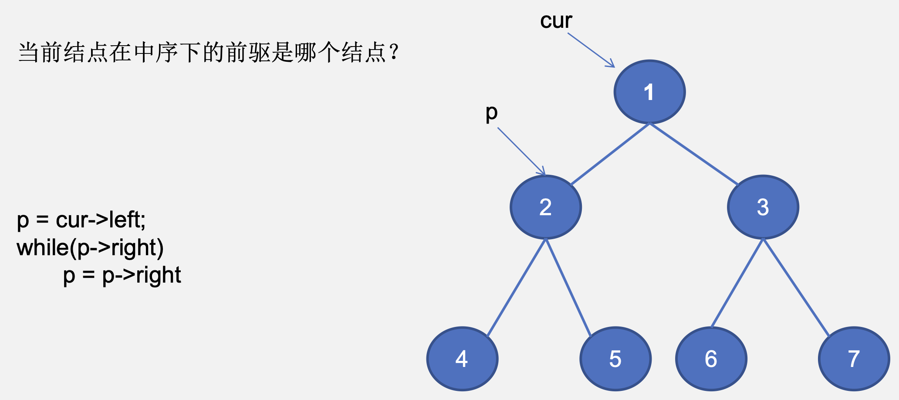
</div>

```c
if(p->right==NULL) {    // 建立线索
    p->right=cur;
    res[(*returnSize)++]=cur->val;
    cur=cur->left;
    continue;
}
```

```c
int* preorderTraversal(TreeNode* root, int* returnSize) {
    int* res=malloc(sizeof(int)*100);
    *returnSize=0;
    // int index=0;
    if(root==NULL) return res;
    TreeNode *cur=root;
    TreeNode *p=NULL;
    while(cur!=NULL) {
        p=cur->left;
        if(p!=NULL) {   // 当前结点的左子树不空
            while(p->right!=NULL && p->right!=cur) {    // 寻找左子树的最右结点
                p=p->right;
            }
            if(p->right==NULL) {    // 建立线索
                p->right=cur;
                res[(*returnSize)++]=cur->val;
                cur=cur->left;
                continue;
            }else { // 清除线索
                p->right=NULL;
            }
        }else {
            res[(*returnSize)++]=cur->val;
        }
        cur=cur->right;
    }
    return res;
}
```

### 线索二叉树

&emsp;&emsp;&ensp;根本目的是为了弥补普通的链式存储二叉树难以寻找其直接前驱/后继的缺点，引入线索之后加快查找前驱/后继的速度，但依旧存在弊端。

<div style=" margin: 0 auto; max-width: 40%;">
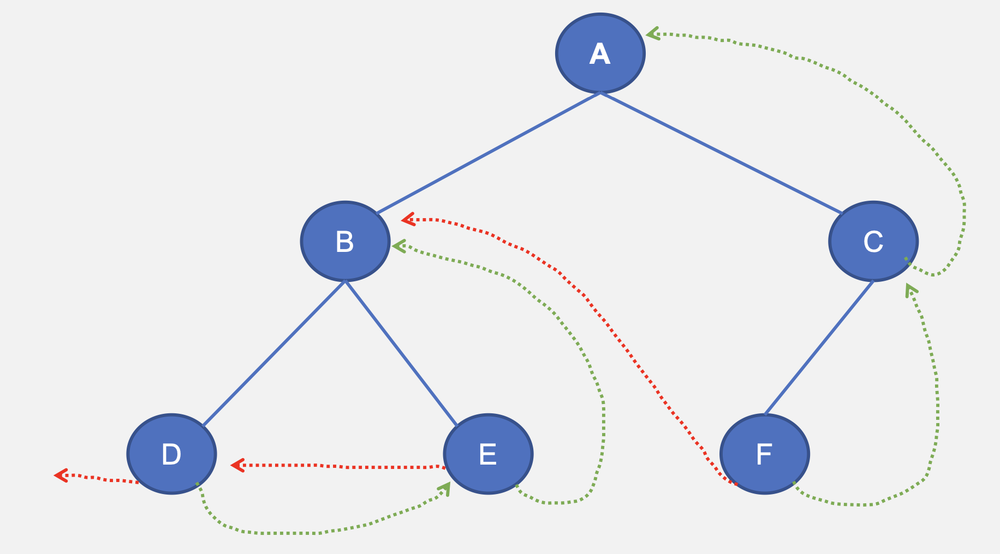
</div>

&emsp;&emsp;&ensp;后序线索二叉树如何找前驱？

1. 该结点为根结点
2. 该结点为双亲的左孩子
   1. 双亲没有右子树
   2. 双亲有右子树
3. 该结点为双亲的右孩子

<div style=" margin: 0 auto; max-width: 70%;">
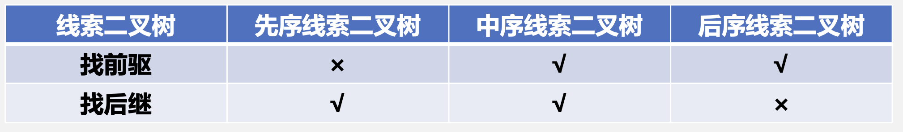
</div>

&emsp;&emsp;&ensp;先序线索二叉树找前驱，后序线索二叉树找后继，依旧需要用到栈。

## 树

<div style=" margin: 0 auto; max-width: 70%;">
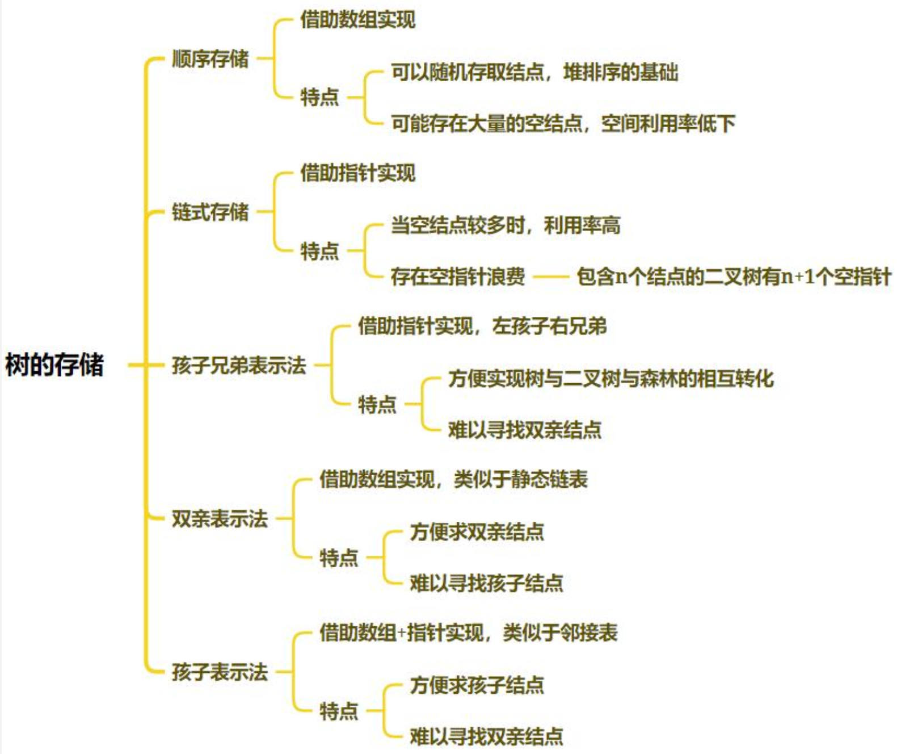
</div>

&emsp;&emsp;&ensp;【例题】一棵有n个结点的k（k>=2）叉树, 用链式存储方式表示，有多少个空指针？写出推导过程。
&emsp;&emsp;&ensp;k叉树中每个结点都有k个指针域，所以指针总个数为nk，而n个结点会被n-1个指针指向，所以空指针为 ${nk-n+1 = n(k-1)+1}$

&emsp;&emsp;&ensp;前序序列和中序序列相同的二叉树是什么？

<div style=" margin: 0 auto; max-width: 40%;">
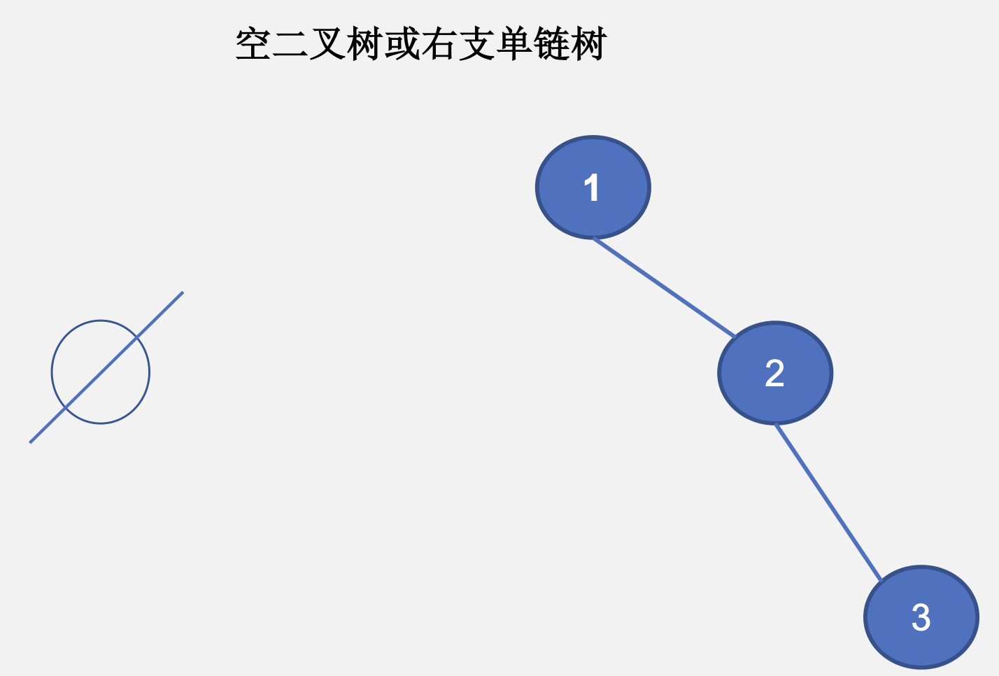
</div>

&emsp;&emsp;&ensp;中序序列和后序序列相同的二叉树是什么？

<div style=" margin: 0 auto; max-width: 40%;">
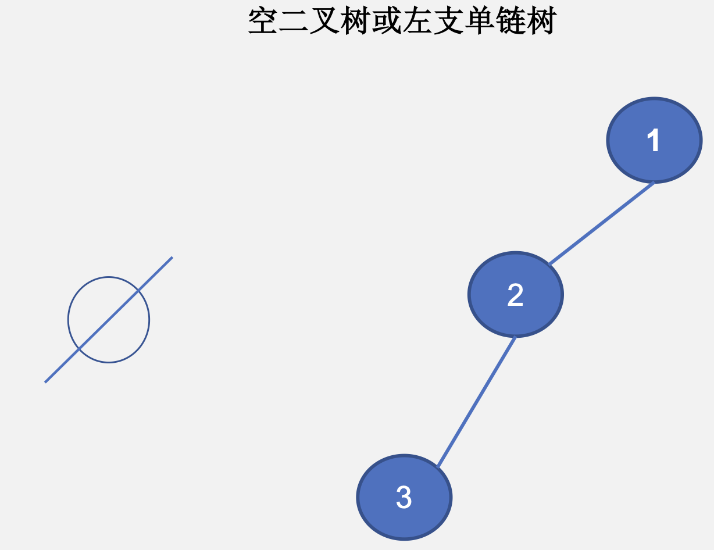
</div>

&emsp;&emsp;&ensp;前序序列和后序序列相同的二叉树是什么？

<div style=" margin: 0 auto; max-width: 40%;">
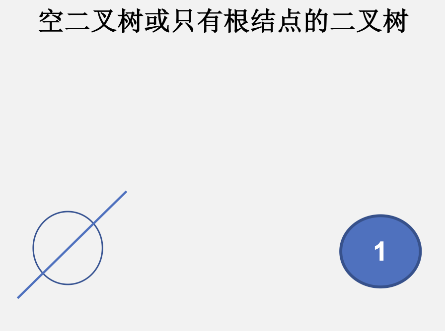
</div>

&emsp;&emsp;&ensp;前，中和后序序列相同的二叉树是什么？

<div style=" margin: 0 auto; max-width: 40%;">
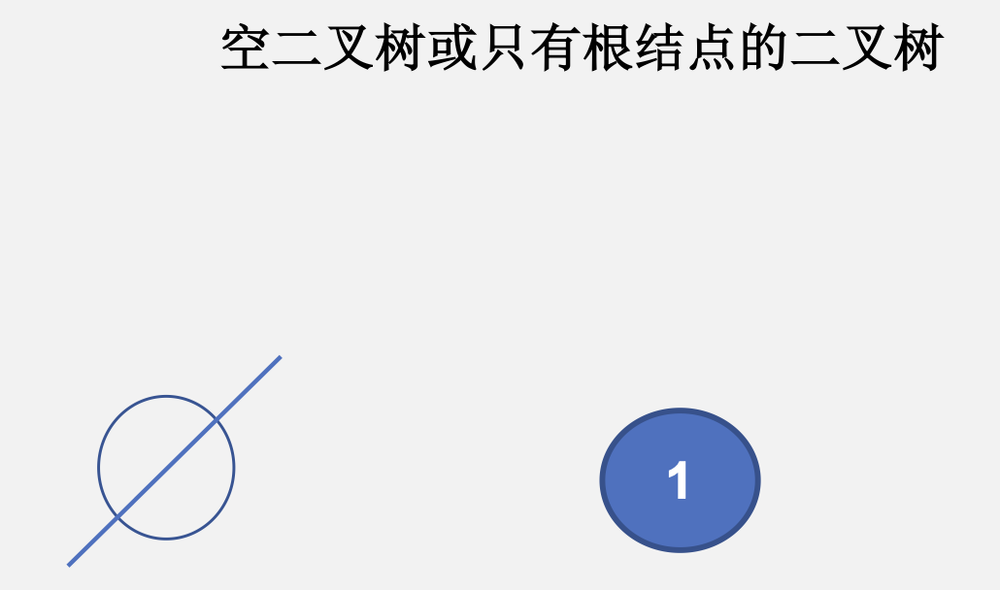
</div>

&emsp;&emsp;&ensp;【例题】已知二叉树T，求出其深度。先写出结点数据结构定义（值域为int类型），用c或c++实现该算法。

```c
int BTdepth(BiTree *T){ //求二叉树深度 
    if(! T){ //空树
        return 0;
    }
    int front=-1, rear=-1; //声明队列 
    int last=0, level=0;
    BiTree Q[MaxSize];
    BiTree *p;
    Q[++rear] = T; 
    while(front < rear){
        p = Q[++front]; //出队
        if(p->lchild) Q[++rear]=p->lchild; //左孩子入队 
        if(p->rchild) Q[++rear]=p->rchild; //右孩子入队 
        if(front==last){ //是否为当前层的最后一个结点
            level++;
            last = rear;
        } 
    } 
    return level; 
}
```

&emsp;&emsp;&ensp;【例题】已知二叉树T，求出其结点个数最多的一层的深度。先写出结点数据结构定义(值域为int类型)，用c或c++实现该算法。

```c
int widthOfBinaryTree(TreeNode* root, int n) {
    TreeNode *queue=(TreeNode*)malloc(sizeof(TreeNode)*n);
    int front=-1, rear=-1, last=0;
    // maxc=0记录最大宽度，maxl记录最宽层的深度，count记录当前宽度，level记录当前深度
    int maxc=0, maxl=0, count=0, level=0;
    TreeNode *p;
    queue[++rear]=root;
    while(front<rear) {
        p=queue[++front];
        count++;
        if(p->left) queue[++rear]=p->left;
        if(p->right) queue[++rear]=p->right;
        if(front==last) {   // 遍历到当前层最后一个结点
            level++;
            if(count>maxc) {    // 更新宽度
                maxc=count;
                maxl=level;
            }
            count=0;    // 宽度重置
            last=rear;  // 更新标志位
        }
    }
    free(queue);
    return maxl;
}
```

&emsp;&emsp;&ensp;层序遍历模板的代码都可以用来求什么类型的题？

1. 层序遍历，逆层序遍历；
2. 求二叉树的宽度，求最宽的一层位于哪里；
3. 求高度，深度；
4. 求分支节点的个数，判断是否为完全二叉树，满二叉树；
5. 求任何带有层序特点的题；

&emsp;&emsp;&ensp;【例题】现有一棵二叉树，如果你站在这棵树的左侧向右看这棵树，那么你只能看到每一层的第一个结点，从左侧看到的所有结点，我们称之为二叉树的左视图，要求你设计一算法求出二叉树（以root为根结点）的右视图。
&emsp;&emsp;&ensp;首先写出二叉树的数据结构定义（值域为int类型），其次用c或c++实现算法，算法要求返回int数组，其中包含了右视图下按从上到下顺序看到的每一个结点的值。

```c
// Definition for a binary tree node.
typedef struct {
    int val;
    struct TreeNode *left;
    struct TreeNode *right;
}TreeNode;
```
```c
int* rightSideView(TreeNode* root, int n) {
    TreeNode* queue[n];
    int front=-1, rear=-1;  // 队列初始化
    int last=0, index=0;    // 标志位
    TreeNode *p;
    queue[++rear]=root;
    int *res=malloc(sizeof(int)*n);
    while(front<rear) {
        p=queue[++front];
        if(p->left) queue[++rear]=p->left;      // 左孩子入队
        if(p->right) queue[++rear]=p->right;    // 右孩子入队
        if(front==last) {   // 当前层最右结点
            res[index++]=p->val;
            last=rear;  // 更新标志位
        }
    }
    return res;
}
```

&emsp;&emsp;&ensp;【例题】现有二叉树T，设计递归算法实现计算这棵二叉树的结点数。(1)写出算法思想；(2)先写出结点的数据结构定义（值域为int类型），用c或c++实现算法；
&emsp;&emsp;&ensp;算法思想：采用递归的方式求解，每个遍历到的结点只需要计算出左子树和右子树的结点后再加上自身即可求出当前二叉树结点的总数目。

```c
typedef struct {
    int val;
    struct TreeNode *left;
    struct TreeNode *right;
}TreeNode;
```
```c
int countNodes(TreeNode* root) {
    if(root==NULL) return 0;
    int left=countNodes(root->left);
    int right=countNodes(root->right);
    return left+right+1;
}
```

&emsp;&emsp;&ensp;【例题】若两棵树的结构一模一样，并且对应结点的值也完全相同，那么我们就称之为相同的树。设计一递归算法实现T1和T2相同树的判断，其中T1的根结点为p，T2的根结点为q。(1)写出算法思想；(2)首先写出二叉树结点的数据结构定义（值域为int类型），其次使用c或c++实现该算法。
&emsp;&emsp;&ensp;算法思想：采用递归的方式求解，对于每个遍历到的结点来说，两棵树的当前结点必须是一样的；对于每个子树来说，它的左子树和右子树必须都是一样的。

```c
typedef struct {
    int val;
    struct TreeNode *left;
    struct TreeNode *right;
}TreeNode;
```
```c
bool isSameTree(TreeNode* p, TreeNode* q) {
    if(p=NULL && q==NULL) {
        return true;
    }else if((p==NULL) || (q==NULL) || (p->val!=q->val)) {
        return false;
    }
    bool left=isSameTree(p->left, q->left);
    bool right=isSameTree(p->right, q->right);
    return left && right;
}
```

## 树和森林

&emsp;&emsp;&ensp;树转二叉树规律总结（按类型详细划分）

<div style=" margin: 0 auto; max-width: 70%;">
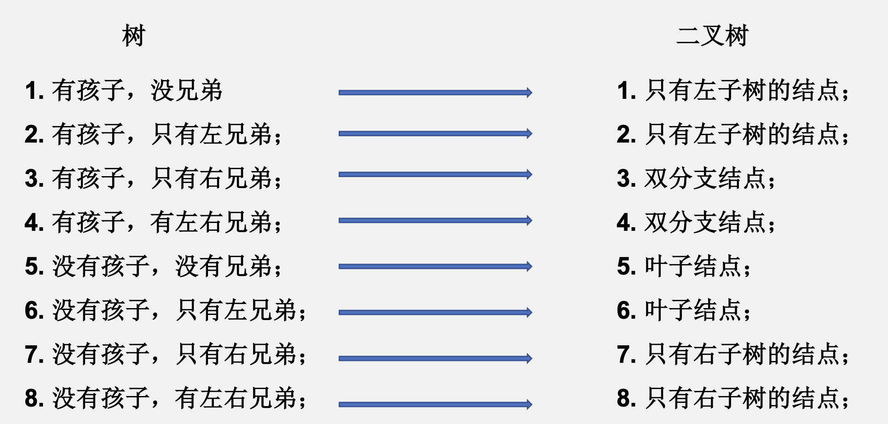
</div>

<div style=" margin: 0 auto; max-width: 70%;">
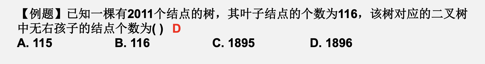
</div>

<div style=" margin: 0 auto; max-width: 70%;">
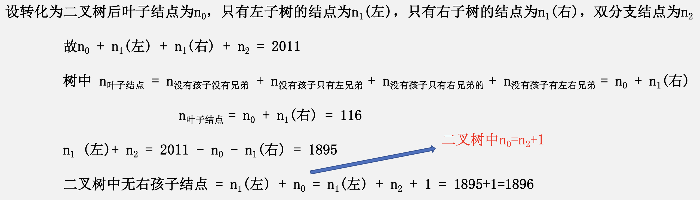
</div>

&emsp;&emsp;&ensp;【例题】已知二叉树T的层序遍历是ABCDEFGHIJ, 中序遍历为DBGEHJACIF，请画出对应的二叉树，然后将其转化为森林，再写出森林的先序遍历和中序遍历。
&emsp;&emsp;&ensp;森林的先序遍历对应二叉树的先序遍历
&emsp;&emsp;&ensp;森林的中序遍历对应二叉树的中序遍历

## 树的应用

<div style=" margin: 0 auto; max-width: 70%;">
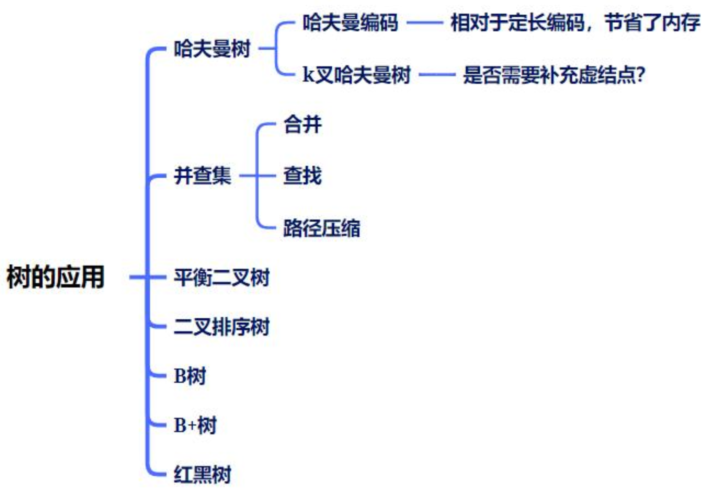
</div>

<div style=" margin: 0 auto; max-width: 50%;">
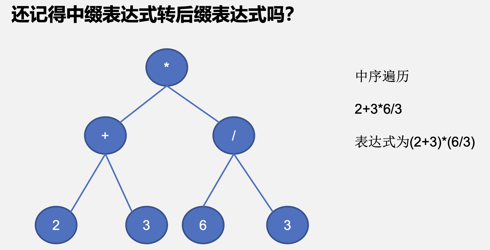
</div>

&emsp;&emsp;&ensp;【例题】将中缀表达式(5+3)x4-5-2x(4-1)先转化为中序表达式树，然后求出其**逆波兰表达式**，再利用表达式树求出其结果，最后设计一算法输出一给定中序表达式树的中缀/后缀表达式。

```c
typedef struct {
    char val;
    struct TreeNode *left;
    struct TreeNode *right;
}TreeNode;
```

&emsp;&emsp;&ensp;求中缀表达式

```c
void exper(TreeNode* node, int level) {
    if(node==NULL) return;
    if(node->left==NULL && node->right==NULL) {
        printf("%c", node->val);
    }else {
        if(level>1) printf("(");
        exper(node->left, level+1);
        printf("%c", node->val);
        exper(node->right, level+1);
        if(level>1) printf(")");
    }
}
void main(TreeNode* root) {
    exper(root, 1);
}
```

&emsp;&emsp;&ensp;求后缀表达式

```c
void exper(TreeNode* node) {
    if(root==NULL) return;
    exper(root->left);
    exper(root->right);
    printf("%c", root->val)
}
```

&emsp;&emsp;&ensp;【例题】假设用于传送秘密的报文由{a,b,c,d,e,f,g,h}中的字母组成，已知每个字母 在报文中的出现频率为{0.07, 0.19, 0.02, 0.06, 0.32, 0.03, 0.21, 0.10}。(1)采用哈夫曼编码对其编码，写出哈夫曼树并写出编码结果,求出WPL。(2)相比等长编码，平均压缩率是多少？

<div style=" margin: 0 auto; max-width: 60%;">
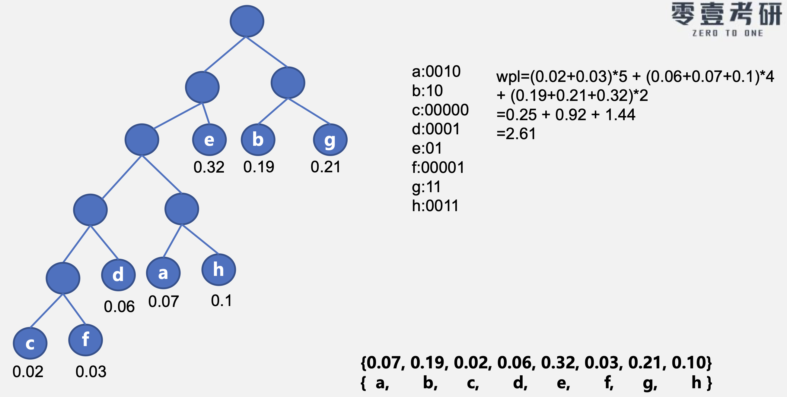
</div>

## 并查集

### 查找

<div style=" margin: 0 auto; max-width: 60%;">
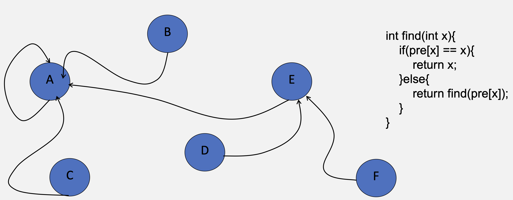
</div>

### 合并

<div style=" margin: 0 auto; max-width: 60%;">
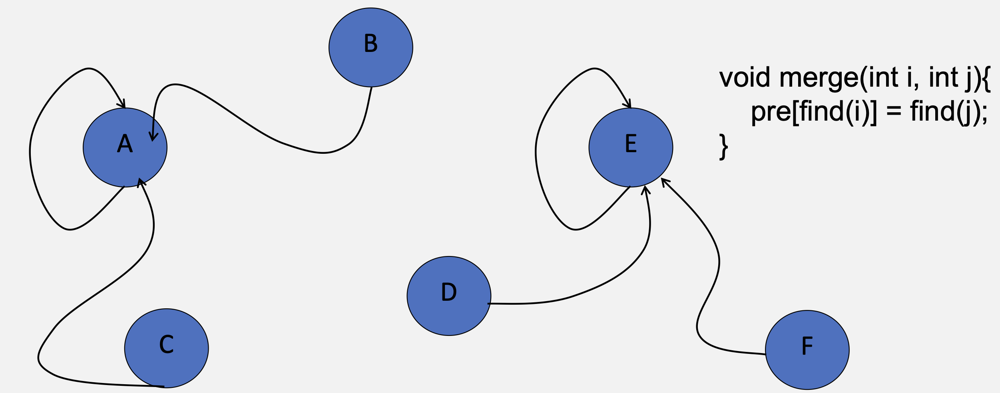
</div>

<div style=" margin: 0 auto; max-width: 30%;">
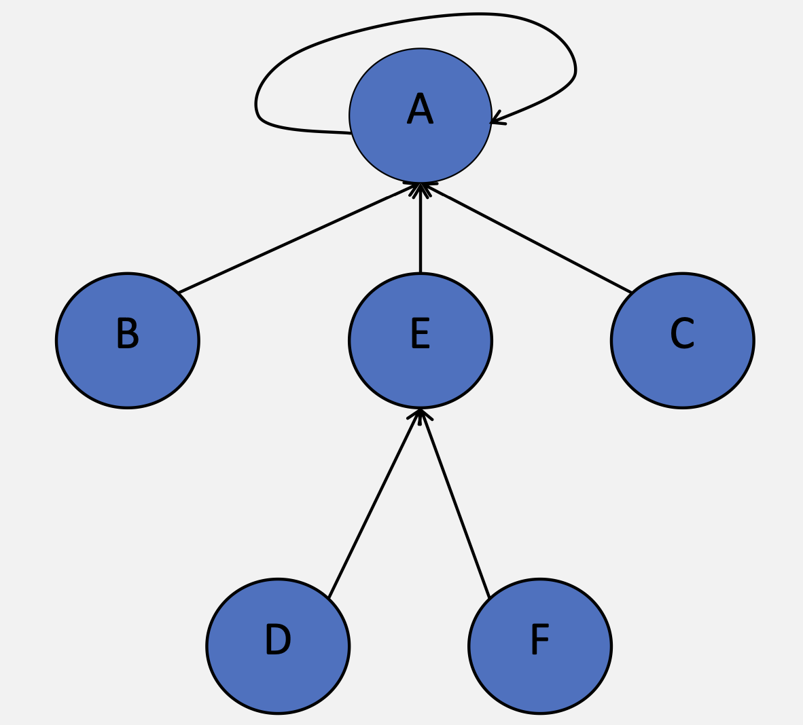
</div>

&emsp;&emsp;&ensp;【例题】已知初始关键字0,1,2,3,4,5,6,7，现对其进行一系列操作，union(1,2), union(2,3), union(4,6), union(3,4),union(6,7)写出其结果集合的非显式表示, 即采用数组的形式代替实际结点A[i]的值代表了结点i的根或代表元，初始时每个结点都代表自己，值应为-1。
1) 若规定union(i,j)操作含义为结点j的根更新为i，写出结果。

<div style=" margin: 0 auto; max-width: 60%;">
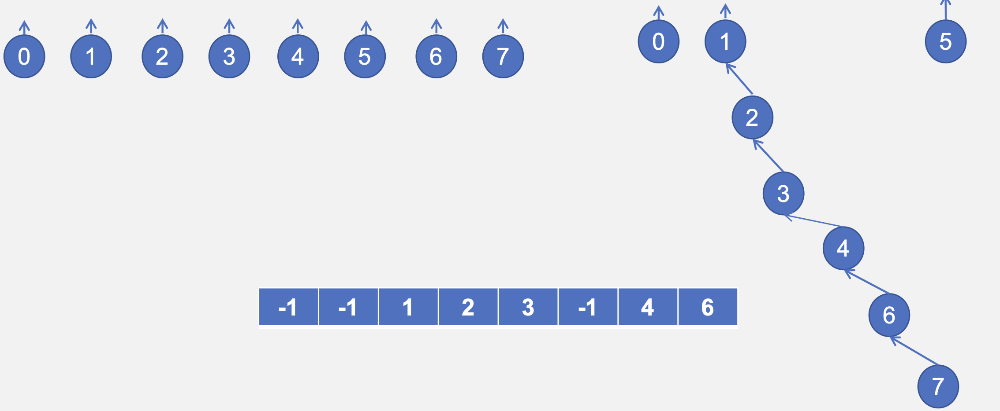
</div>

2) (1)中的union操作相对较随意，若要求对union的过程进行优化，此时我们要求按大小合并集合， 即发生union操作时，要将规模小的集合合并到规模较大的集合上去，为了方便根据规模合并，规定 树根存储的是该集合的结点总数的相反数，写出union(4,5), union(6,7), union(4,6), union(3,4) 操作后的结果。

<div style=" margin: 0 auto; max-width: 60%;">
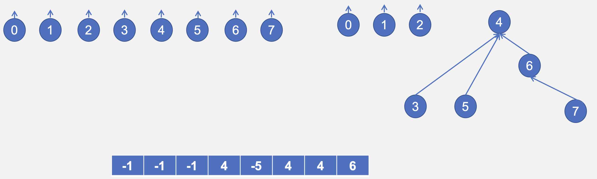
</div>

3) 若要求对union的过程进行优化，此时我们要求按集合的高度进行合并，即发生union操作时， 要将高度小的集合合并到高度较大的集合上去，为了方便根据规模合并，规定树根存储的是该树的高 度的相反数，写出union(1,2), union(3,2), union(5,4), union(7,6),union(7,1)操作后的结果。

<div style=" margin: 0 auto; max-width: 60%;">
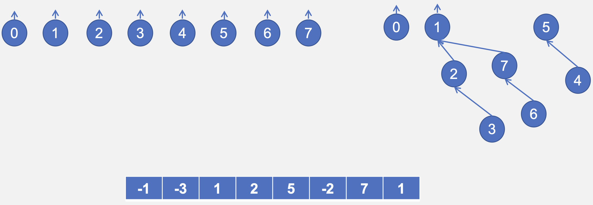
</div>

4) 若要求对find操作进行优化，即采取路径压缩的方式，规定在find(x)的过程中，从x到根的路径上的每一个结点的双亲结点都更新为该树的根。写出在(1)的基础上完成find(3)，find(6)操作后的结果。

<div style=" margin: 0 auto; max-width: 60%;">
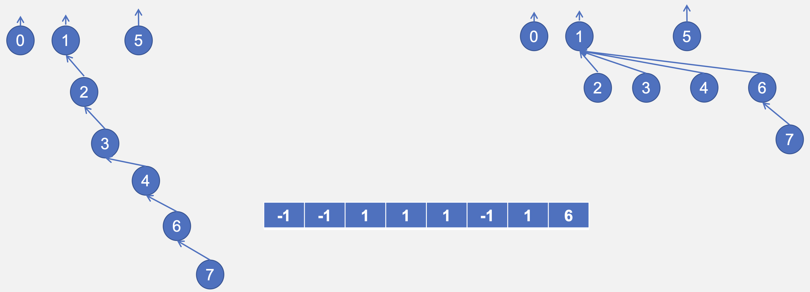
</div>

&emsp;&emsp;&ensp;什么是最好时间复杂度，最坏时间复杂度，平均时间复杂度，分摊时间复杂度？
&emsp;&emsp;&ensp;对于一个长度为n的顺序表来说，按值查找的时间复杂度如何分析？
&emsp;&emsp;&ensp;最好为O(1), 最差为O(n), 平均情况下为O(n)。
&emsp;&emsp;&ensp;对于一个动态顺序表，我们规定当元素个数等于n时，如果再进行插入操作，就对该表进行扩充至二倍的容量，当表中装填因子小于等于0.5时就进行缩容至1/2的操作。
&emsp;&emsp;&ensp;思考如下问题：

1. 插入元素的时间复杂度是多少？
2. 如果频繁的出现连续的插入与删除操作，会出现什么现象？

&emsp;&emsp;&ensp;平摊（摊还）分析（Amortize Analysis）是一种算法分析的手法，其主要思路是:对若干条指令（通常O(n)条）整体进行考虑其时间复杂度（以获得更接近实际情况的时间复杂度），而不是逐一考虑执行每条指令所需的时间复杂度后再进行累加。
&emsp;&emsp;&ensp;对于一个容量为n的动态表来讲，前n次插入都只需要操作一次O(1)即可完成, 而第n+1个元素就需要先对表进行扩容操作，然后将前n个元素依次移动到新的内存中，再完成插入操作，一共操作了n+1次操作，那么这n+1次插入一共操作了n+n+1=2n+1。

<div style=" margin: 0 auto; max-width: 60%;">
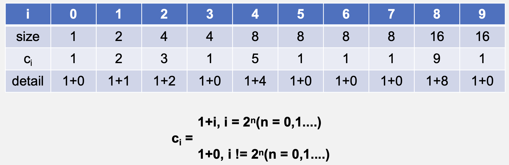
</div>

&emsp;&emsp;&ensp;平摊(摊还)分析(Amortize Analysis)是一种算法分析的手法，其主要思路是:对若干 条指令(通常O(n)条)整体进行考虑其时间复杂度(以获得更接近实际情况的时间复杂 度)，而不是逐一考虑执行每条指令所需的时间复杂度后再进行累加。
&emsp;&emsp;&ensp;对于一个容量为n的动态表来讲，前n次插入都只需要操作一次O(1)即可完成，而第n+1个元素就需要先对表进行扩容操作，然后将前n个元素依次移动到新的内存中，再完成插入操作，一共操作了n+1次操作，那么这n+1次插入一共操作了n+n+1=2n+1。

<div style=" margin: 0 auto; max-width: 60%;">
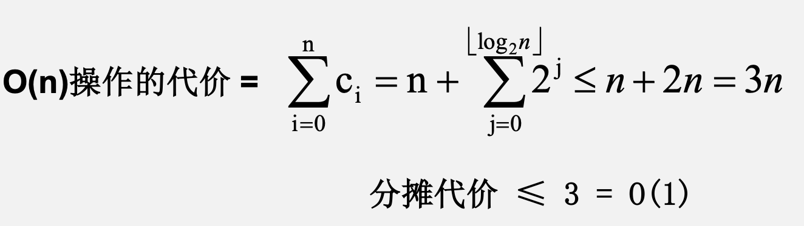
</div>

&emsp;&emsp;&ensp;分摊复杂度的分析方法有三种：聚集分析法，会计法，势能法
&emsp;&emsp;&ensp;现在考虑这样一种情况，当插入了n个元素之后，我反复的进行插入，删除，插入，删除...操作会产生什么现象？
&emsp;&emsp;&ensp;会发生复杂度震荡的情况，此时的分摊复杂度也是O(n)级别的。
&emsp;&emsp;&ensp;解决办法：延迟缩容