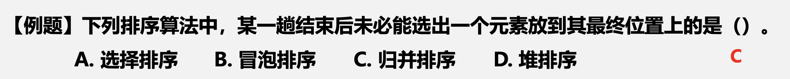

# 强化_4

## 插入排序

<div style=" margin: 0 auto; max-width: 60%;">

</div>

<div style=" margin: 0 auto; max-width: 60%;">

</div>

<div style=" margin: 0 auto; max-width: 60%;">

</div>

### 交换排序

<div style=" margin: 0 auto; max-width: 60%;">

</div>

```c
// 双向冒泡排序
void BubbleSort(int nums[], int n){ 
    int low=0, high=n-1;
    bool flag=true; //标记是否提前结束
    int i, j;
    while(low < high && flag){
        flag=false;
        for(i=low; i<high; i++){ //从前到后
            if(nums[i]>nums[i+1]){
                swap(nums[i], nums[i+1]); //互换
                flag=true;
            }
        }
        high--;
        for(j=high; j>low; j--){ //从后到前
            if(nums[i]<nums[i-1]){
                swap(nums[i], nums[i-1]); //互换
                flag=true; 
            }
        }
        low++; 
    }
}
```

```c
void QuickSort(ElemType A[], int low, int high){ 
    int pos;
    if(low<high){
        pos = Partition(A, low, high); //选取枢轴位置 
        QuickSort(A, low, pos-1);
        QuickSort(A, pos+1, high);
    }
}
```
```c
int Partition(ElemType A[], int low, int high){ 
    ElemType pivot = A[low]; 
    while(low<high){
        while(low<high && A[high]>=pivot) high--; //所有的元素都不小于枢轴元素 
        A[low] = A[high];
        while(low<high && A[low] <= pivot) low++;//所有的元素都不大于枢轴元素 
        A[high]=A[low];
    } 
    A[low] = pivot; //将枢轴元素放到最终位置 
    return low;
}
```

<div style=" margin: 0 auto; max-width: 60%;">

</div>

<div style=" margin: 0 auto; max-width: 60%;">

</div>

&emsp;&emsp;&ensp;快排的总结：

1. 枢轴的选取对于快速排序的性能影响很大，具体的选取策略有:首元素，随机值，中值；
2. 快速排序的最好情况是每次的枢轴最终都能将当前(子)表划分为规模相当的两部分；
3. 快速排序最坏的情况是每次的枢轴都是当前(子)表的最值元素，这样会导致每次排序结束 另一部分的子表长度为0；
4. 快速排序每趟结束都**至少**会有一个元素到达其最终位置；
5. 快速排序最坏情况下的空间复杂度是O(n)，时间复杂度是O(n2)；最好情况下的空间复杂度是O(logn)，时间复杂度是O(nlogn)；

<div style=" margin: 0 auto; max-width: 60%;">

</div>

```c
void swap(int *a, int *b) { // 元素互换
    int t=*a;
    *a=*b, *b=t;
}
```
```c
void sortNum(int *nums, int numsSize) {
    int i=0, j=0, k=numsSize-1;
    while(j<k) {
        if(nums[j]>0) { // 讲正数换到后面
            swap(nums[j], nums[k]);
            k--;
        }else if(nums[j]==0) {
            j++;
        }else { // 将负数换到前面
            swap(nums[i], nums[j]);
            i++;
            j++;
        }
    }
}
```

<div style=" margin: 0 auto; max-width: 60%;">

</div>

<div style=" margin: 0 auto; max-width: 60%;">

</div>

```c
int Partition(int *nums, int low, int high) {
    int pivot=nums[low];    // 取首元素为枢轴
    while(low<high) {
        while(low<high && nums[high]>=pivot) high--;
        nums[low]=nums[high];
        while(low<high && nums[low]<pivot) low++;
        nums[high]=nums[low];
    }
    nums[low]=pivot;
    return low;
}
```
```c
int quicksort(int *nums, int low, int high, int index) {
    int mid=Partition(nums, low, high);
    if(mid<high) {  // 在后半部分寻找
        return quicksort(nums, mid+1, high, index);
    }
    if(mid>high) {  // 在前半部分寻找
        return quicksort(nums, low, mid-1, index);
    }
    else {
        return nums[mid];
    }
}
```
```c
int findKthLargest(int* nums, int numsSize, int k) {
    return quicksort(nums, 0, numsSize-1, numsSize-k);  // 升序数组的第k个元素
}
```

<div style=" margin: 0 auto; max-width: 60%;">

</div>

## 选择排序

<div style=" margin: 0 auto; max-width: 60%;">

</div>

&emsp;&emsp;&ensp;直接插入排序和简单选择排序的区别在哪里？

1. 直接插入排序的最好情况下时间复杂度是O(n), 最坏情况下时间复杂度是O(n2)；
2. 直接插入排序是将无序表的首元素插入有序表中，简单选择排序是将无序表的中的最值元素插入有序表的表尾；
3. 直接插入排序是稳定排序，简单选择排序是不稳定排序；

<div style=" margin: 0 auto; max-width: 60%;">

</div>

<div style=" margin: 0 auto; max-width: 60%;">

</div>

<div style=" margin: 0 auto; max-width: 60%;">

</div>

<div style=" margin: 0 auto; max-width: 60%;">

</div>

<div style=" margin: 0 auto; max-width: 60%;">

</div>

<div style=" margin: 0 auto; max-width: 60%;">

</div>

&emsp;&emsp;&ensp;**对n个元素进行升序排列，要使用大根堆**；
&emsp;&emsp;&ensp;**对n个元素进行降序排列，要使用小根堆**；
&emsp;&emsp;&ensp;空间复杂度：O(1)
&emsp;&emsp;&ensp;时间复杂度：建堆时间O(n)，每次调整堆都要调整O(h)，共调整n-1次，时间复杂度为O(nlog2n)；
&emsp;&emsp;&ensp;**不是稳定排序**

```c
void BuildMaxHeap(ElemType A[], int n){ 
    int i ;
    for(i = n/2; i>0; i--){
        HeapAdjust(A, i, n); //调整堆 
    }
}
```

```c
void HeapAdjust(ElemType A[], int k, int n){ 
    int i;
    A[0] = A[k];
    for(i=2*k; i<=n; i*=2){ //检查当前子树
        if(i<n&&A[i]<A[i+1]) i++;
        if(A[0]>=A[i]) break; 
        else {
            A[k] = A[i]; 
            k=i;
        } 
    }
    A[k] = A[0];
}
```

```c
void HeapSort(ElemType A[], int n){ 
    BuildMaxHeap(A, n);
    for(i = n; i>1;i--){
        swap(A[i], A[1]); //堆顶元素与堆尾元素交换
        HeapAdjust(A, 1, i-1);
    }
}
```

&emsp;&emsp;&ensp;堆排序的总结

1. 堆排序是建立在顺序存储的完全二叉树的基础上的算法；
2. 堆排序首先要建立初始堆，从floor(n/2)处开始向上调整；
3. 升序排序要建大根堆，降序排序要建小根堆；
4. 排序时每次将堆顶元素与当前未排序的堆尾元素进行交换，然后向下调整；
5. 堆的插入是将元素先置于堆底，然后向上进行调整;堆的删除是将堆顶与堆底元素进行互换，然后向下进行调整；
6. 堆适合求TopK问题；

## 归并排序和基数排序

<div style=" margin: 0 auto; max-width: 50%;">

</div>

<div style=" margin: 0 auto; max-width: 70%;">

</div>

<div style=" margin: 0 auto; max-width: 70%;">

</div>

```c
int *tmp=malloc(sizeof(int)*n); // 辅助数组
void merge(int *nums, int low, int mid, int high) {
    int i, j, k;
    for(int i=low; i<=high; i++) {  // 复制
        tmp[i]=nums[i];
    }
    for(i=low, j=mid+1, k=i; i<mid && j<=high; k++) {   // 前半段与后半段比较
        if(tmp[i] <= nums[j]) {
            nums[k]=tmp[i++];
        }else {
            nums[k]=tmp[j++];
        }
    }
    while(i<=mid) nums[k++]=tmp[i++];   // 若前半段没有合并完
    while(j<=mid) nums[k++]=tmp[j++];   // 若后半段没有合并完
}
```
```c
int* sortArray(int* nums, int low, int high) {
    if(low<high) {
        int mid=(low+high)/2;   // 划分子表范围
        sortArray(nums, low, mid);
        sortArray(nums, mid+1, high);
        merge(nums, low, mid, high);
    }
    return nums;
}
```

&emsp;&emsp;&ensp;空间复杂度 ${O(n)}$

<div style=" margin: 0 auto; max-width: 70%;">

</div>

```c
int* relativeSortArray(int* arr1, int arr1Size, int* arr2, int arr2Size) {
    int max=0, k=0;
    int i, j;
    for(i=0, i<arr1Size; i++) { // 寻找数组的最大值
        max=arr1[i]>max? arr1[i]: max;
    }
    int count[max+1];
    for(i=0; i<=max; i++) count[i]=0;   // 初始化count数组
    int* res=malloc(sizeof(int)*arr1Size);
    for(i=0; i<arr1Size; i++) { // 计数
        count[arr1[i]]++;
    }
    for(i=0; i<arr2Size; i++) { // 先按照arr2的顺序
        for(j=0; j<count[arr2[i]]; j++) {
            res[k++]=arr2[i];
        }
        count[arr2[i]]=0;
    }
    for(i=0; i<max; i++) { // 剩下的按照升序顺序
        for(j=0; j<count[i]; j++) {
            res[k++]=i;
        }
        count[i]=0;
    }
    return res;
}
```

<div style=" margin: 0 auto; max-width: 70%;">

</div>

```c
int* sortArray(int* nums, int numsSize, int* returnSize) {
    int min=INT_MAX, max=INT_MIN;
    *returnSize=numsSize;
    int *res=malloc(sizeof(int)*numsSize);  // 结果数组
    for(int i=0; i<numsSize; ++i){
        min=fmin(min, nums[i]); // 最小值（考试手动实现）
        max=fmax(max, nums[i]); // 最大值
    } 
    int n=(max-min+1);
    int *count=malloc(sizeof(int)*n);   // 计数数组
    memset(count, 0, sizeof(int)*n);    // 初始化
    for(int i=0; i<numsSize; ++i) { // 对delta值计数
        count[nums[i]-min]+=1;
    }
    int index=0;
    for(int i=0; i<n; ++i) {    // 排序结果
        if(count[i]==0) {
            continue;
        }
        for(int j=0; j<count[i]; ++j) {
            res[index]=i+min;   // 还原元素值
            index+=1;
        }
    }
    free(count);
    return res;
}
```

&emsp;&emsp;&ensp;时间复杂度 ${O(n+k)}$

### 桶排序

<div style=" margin: 0 auto; max-width: 80%;">

</div>

## 排序算法对比

<div style=" margin: 0 auto; max-width: 50%;">

</div>

选取排序算法应该考虑的因素：

- 待排序的元素数目n
- 元素本身信息量的大小
- 关键字的结构及其分布情况
- 稳定性的要求
- 语言工具的条件，存储结构及辅助空间的大小

<div style=" margin: 0 auto; max-width: 60%;">

</div>

<div style=" margin: 0 auto; max-width: 80%;">

</div>

## 外部排序

<div style=" margin: 0 auto; max-width: 60%;">

</div>

- 外部排序
  - 基本思路
  - 三步子方法
    - 置换-选择排序
    - 最佳归并树
    - 败者树

1. 将外存上的数据送入内存进行内部排序，生成初始归并段。

<div style=" margin: 0 auto; max-width: 70%;">

</div>

---

### 外部归并排序算法（以2路平衡归并为例）

1. 将外存上的待排序信息分为k个初始序列，进行k次内部排序得到k个初始归并段；
2. 内存工作区分为三个区域，输入缓冲区in1，in2，输出缓冲区out1，从0，1初始归并段 中各取出一块数据读入in1，in2，对其进行2路归并，排序结果存入out1；
   1. 若out1此时满了，将out1的所有结果输出到归并段R1，然后继续进行归并；
   2. 若in1，in2其中一个已空，那么再从初始归并段中取出一块数据，继续进行归并；
3. 直至0，1初始归并段的全部内容完成归并排序；
4. 2-k的初始归并段重复上述过程。

---

2. 将外存上的初始归并段送入内存进行归并排序，生成更长的初始归并段。

<div style=" margin: 0 auto; max-width: 70%;">

</div>

3. 重复归并的过程，最终在外存上形成一个完整的有序序列。

<div style=" margin: 0 auto; max-width: 70%;">

</div>

&emsp;&emsp;&ensp;外部排序的总时间=内部排序的时间+外存读写时间+内部归并时间
&emsp;&emsp;&ensp;增加归并段的长度，减小归并段的个数就可以提升效率

<div style=" margin: 0 auto; max-width: 70%;">

</div>

&emsp;&emsp;&ensp;普通的多路平衡归并到采用败者树的多路归并优化了哪里？
&emsp;&emsp;&ensp;对r个初始归并段做k路平衡归并时，第一趟可以将r个段合并为ceil(r/k)个段，后面每一趟对于m个归并 段都可以合并为ceil(m/k)个段，直到最后合并为一个归并段。
&emsp;&emsp;&ensp;归并的趟数=树的高度-1=ceil(logkr)

---

&emsp;&emsp;&ensp;内部归并时，如果采用传统的排序算法(如简单选择排序)，那么在当前的k个归并段中选择最值元素就 要进行k-1次比较，每趟要归并n个元素，一共就是(n-1)(k-1)次比较
&emsp;&emsp;&ensp;S趟归并总共的比较次数就是：S(n-1)(k-1) = ceil(logkr)(n-1)(k-1) = ceil(log2r)(n-1)(k-1)/ceil(log2k)

---

&emsp;&emsp;&ensp;而对于采用败者树的归并排序来说，在当前的k个归并段中选择最值元素最多只需要进行ceil(log2k)次比较，故S趟归并总共的比较次数是：S(n-1)ceil(log2k) = ceil(logkr)(n-1)ceil(log2k) = (n-1)ceil(log2r)

<div style=" margin: 0 auto; max-width: 70%;">

</div>

<div style=" margin: 0 auto; max-width: 70%;">

</div>

<div style=" margin: 0 auto; max-width: 70%;">

</div>

## DS大总结

&emsp;&emsp;&ensp;如何判断DS的掌握情况？

- 这块主要是什么内容？
- 特定名词的定义是什么？
- 有代码模板的话，会不会默写？
- 有公式的话，记得是什么？会不会用?？用的时候，会不会随机应变？
- 这一点在考题中是如何考察的？
- 如果是有个过程的内容，会不会自己模拟其算法的运行过程？
- 能不能区分相近的概念？

