# 强化_算法基础

## 算法题1

&emsp;&emsp;&ensp;现有一个整数数组nums，其中有n个均不相等的整数，要求设计一个算法可以判断该数组是否为单调数组。

```c
// 例:
nums=[1,2,4,9] n=4 
// 输出:
true

nums=[1,3,5,4,9,10] n=6
// 输出:
false
```

&emsp;&emsp;&ensp;基本算法思想：遍历数组，判断数组中任意元素与其后面元素的大小关系。
&emsp;&emsp;&ensp;完整代码=基本算法思想扩写+逐字翻译(画图帮助理清细节)

<div style=" margin: 0 auto; max-width: 50%;">
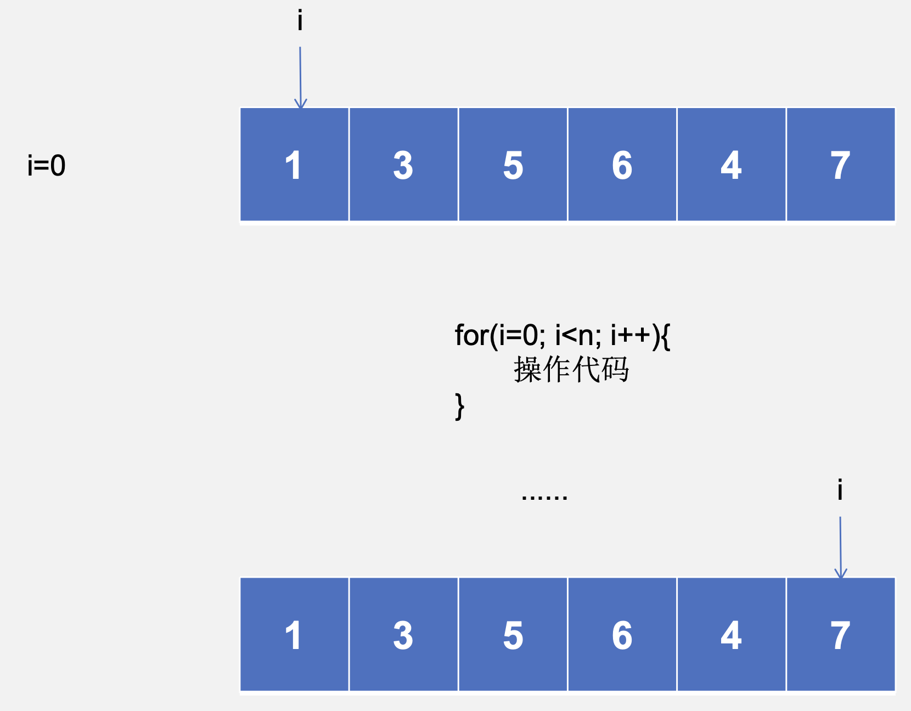
</div>

```c
for(i=0; i<n; i++){ // 判断是否为单调递减数组
    if(nums[i] < nums[i+1]){
        // 不是一个单调递减数组
    } 
}
```
```c
for(i=0; i<n; i++){ // 判断是否为单调递增数组
    if(nums[i] > nums[i+1]){
        // 不是一个单调递增数组
    } 
}
```

<div style=" margin: 0 auto; max-width: 50%;">
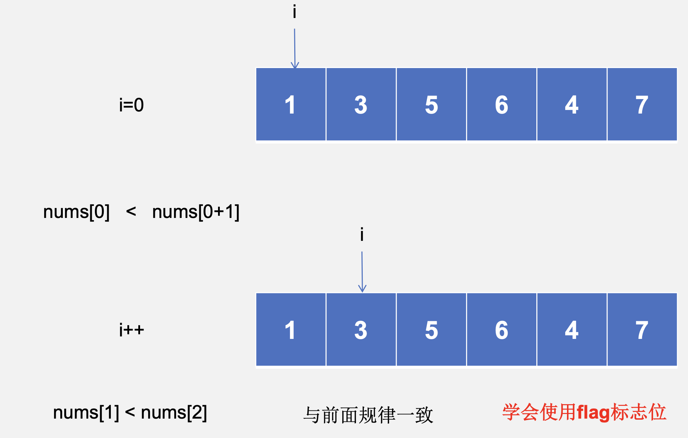
</div>

<div style=" margin: 0 auto; max-width: 50%;">
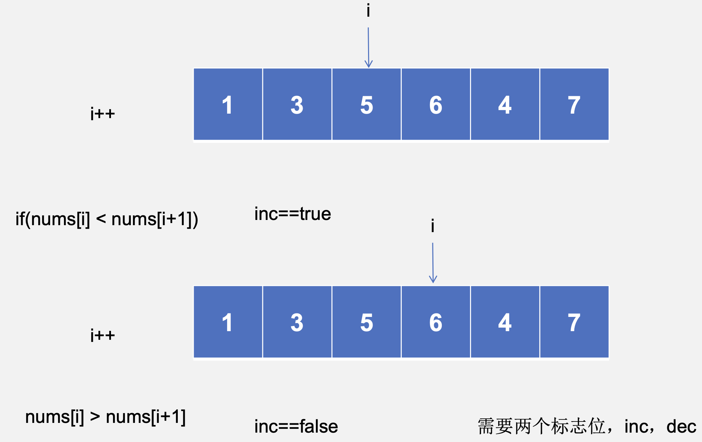
</div>

<div style=" margin: 0 auto; max-width: 50%;">
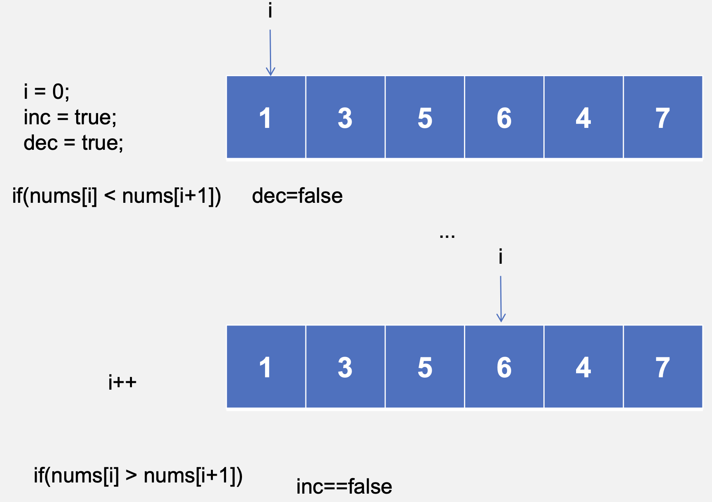
</div>

&emsp;&emsp;&ensp;基本算法思想：遍历数组，判断数组中任意元素与其后面元素的大小关系。
&emsp;&emsp;&ensp;算法思想：遍历数组，判断任意当前元素与其后紧邻元素的大小关系是否与其他元素之间一致。设置两个标志位来标记递增或递减，当前元素小于后一个元素时就认为是递增，反之认为是递减，遍历一遍数组后根据标志位即可得出结果。

```c
bool isMonotonic(int* nums, int numsSize) {
    bool inc = true, dec = true;
    for(int i=0;i<numsSize-1;i++) {
        if(nums[i]<nums[i+1]){// 递增
            dec = false;
        }else if(nums[i]>nums[i+1]){// 递减
            inc = false;
        }
    }
    return dec || inc;
}
```

## 算法题2

&emsp;&emsp;&ensp;现有一个整数数组nums和一个目标值target，请你在该数组中找出两个数字，其和正好等于目标值，最后返回这两个数字的数组下标。假设一定存在满足该条件的两个数字 且答案是唯一的。

```c
// 例:
nums=[3,2,6,9], target=11
// 输出:
[1,3]

nums=[1,3,5,7,9,10], target=11
// 输出:
[0, 5]
```

&emsp;&emsp;&ensp;基本算法思想：遍历数组，判断数组中任意两个元素之和是否为target。

```c
// 双指针法
for(i=0; i<边界; i++){ 
    for(j=初始值; j<边界; j++){
        // 核心代码
    } 
}
```

<div style=" margin: 0 auto; max-width: 50%;">
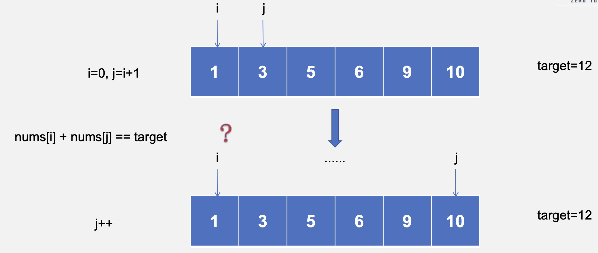
</div>

<div style=" margin: 0 auto; max-width: 50%;">
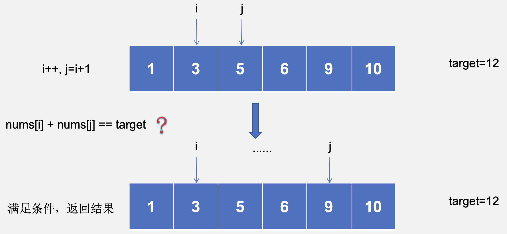
</div>

&emsp;&emsp;&ensp;基本算法思想：遍历数组，判断数组中任意两个元素之和是否为target.
&emsp;&emsp;&ensp;算法思想：暴力法即可解出此题，遍历数组，判断数组中任意两个元素之和是否为target。使用两个工作指针i和j，当固定住nums[i]时，j从i+1位置出发去遍历剩余的表 寻找值为target-nums[i]的元素，找到了符合条件的元素之后将其下标返回。

```c
int* twoSum(int* nums, int numsSize, int target, int* returnSize) {
    int i, j;
    int *result=(int*)malloc(sizeof(int)*2);    // 返回结果
    for(i=0; i<numsSize; i++) {
        for(j=i+1; j<numsSize; j++) {
            if(nums[i]+nums[j]==target){    // 满足条件
                result[0]=i;
                result[1]=j;
                *returnSize=2;
                return result;
            }
        }
    }
    return result;
}
```

&emsp;&emsp;&ensp;暴力解法模板（链表同理）

```c
for(i=0; i<边界; i++){
    for(j=初始值; j<边界; j++){
        // 核心代码
    } 
}
```

## 算法题3

&emsp;&emsp;&ensp;现有一个整数x，如果从左向右看和从右向左看是一模一样的整数，我们就称该数字为回文数。

```c
// 例:
x = 616 
// 输出:
true

x = -11 
// 输出:
false
```

&emsp;&emsp;&ensp;基本算法思想：逆置数字后与原数相比是否一样。

<div style=" margin: 0 auto; max-width: 50%;">
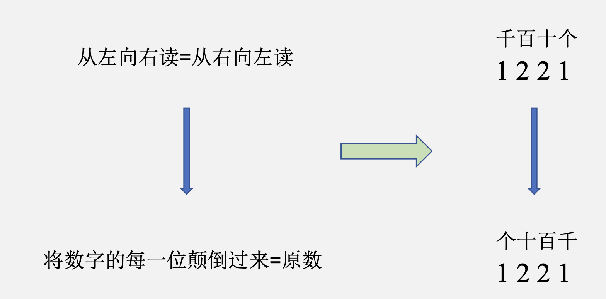
</div>

<div style=" margin: 0 auto; max-width: 50%;">
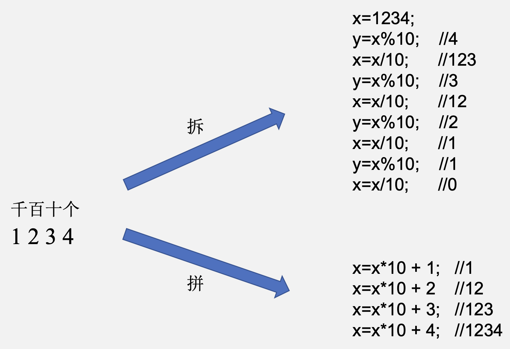
</div>

&emsp;&emsp;&ensp;如何考虑边界条件？

<div style=" margin: 0 auto; max-width: 50%;">
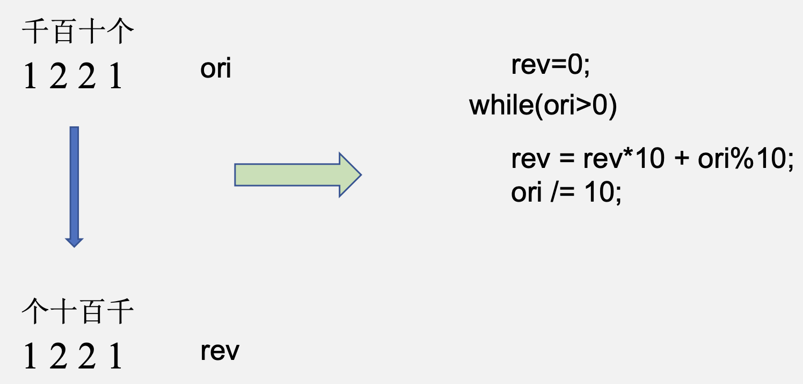
</div>

&emsp;&emsp;&ensp;基本算法思想：逆置数字后与原数相比是否一样。
&emsp;&emsp;&ensp;算法思想：题干里面已经说了“回文数字就是从左向右看和从右向左看一样的数字”，含义其实就是把它的个十百千位颠倒过来和以前一模一样。所以只需要使用一个变量来存放这个颠倒后的数字，然后再与原数字比大小即可，这里需要注意的是，如果一个很大的非回文数颠倒过来可能会导致int类型溢出，所以要用long来存储颠倒后的数字。例子已经暗示输入有负数了，记得先进行边界条件的判断。

```c
bool isPalindrome(int x) {
    if(x<0) {   // 判断边界条件
        return false;
    }
    long elem=0;
    int ori=x;
    while(x>0) {
        elem=elem*10+x%10;
        x=x/10;
    }
    return ori==(int)elem;
}
```

### 优化算法

1. 偶数位的回文数字颠倒过来一半的数字即和剩余的数字一样了；
2. 奇数位的回文数字正中间那一位数字无所谓是几都不会影响其回文的性质；

<div style=" margin: 0 auto; max-width: 50%;">
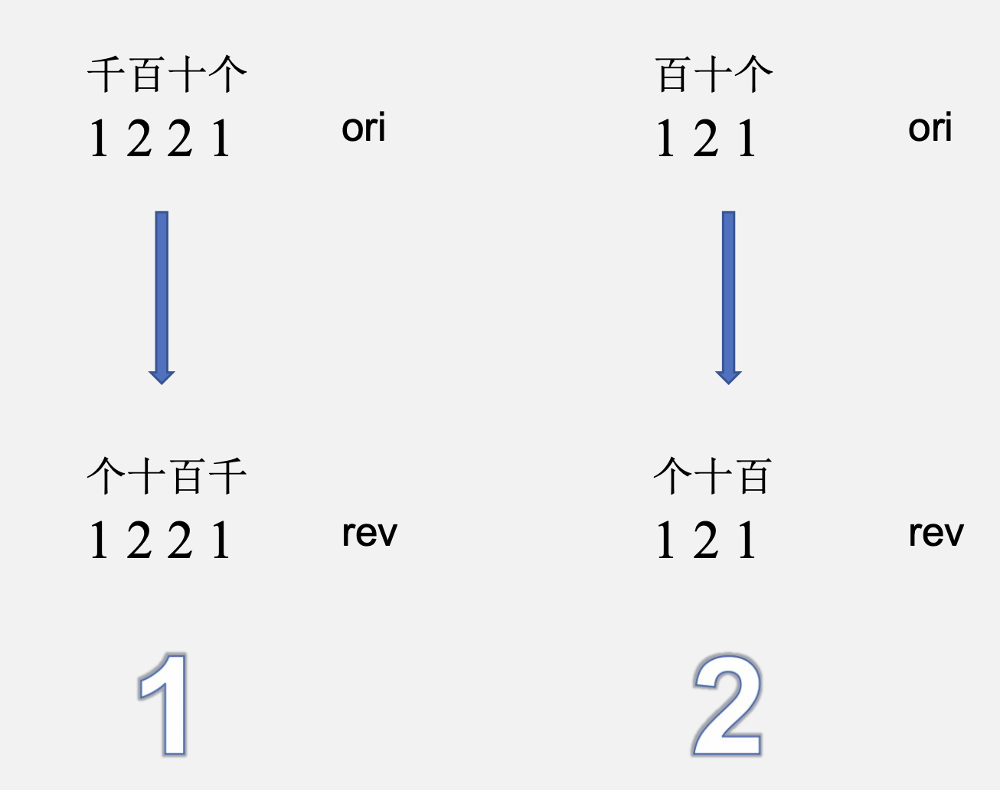
</div>

&emsp;&emsp;&ensp;优化算法思想：对于偶数位数字只颠倒一半的数字即可与原数字剩余部分进行比较；对于奇数位数字只需要颠倒一半的数字后去掉最后一位再与原数字剩余部分比较即可。例子已经暗示输入有负数了，记得先进行边界条件的判断。

```c
bool isPalindrome(int x) {
    // 判断边界条件：除奇偶数外，还需要考虑什么特殊情况？如1010。
    if(x<0||x%10==0&&x!=0) {
        return false;
    }
    int num=0;
    while(x>num) {
        num=num*10+x%10;
        x=x/10;
    }
    return x==num||x==num/10;
}
```

## 算法题4

&emsp;&emsp;&ensp;现有一个长度为n(n<100)的顺序表L，要求删除表中全部值为x的元素，返回删除后 的顺序表。顺序表的MaxSize为100。

1) 写出顺序表的数据结构定义。
2) 用c或c++实现代码，关键语句给出注释。
3) 写出算法的时间复杂度和空间复杂度。

```c
// 例:
L=[3,5,6,9,2,3,10,3,11], x=3
// 输出:
[5,6,9,2,10,11]

L=[2,5,6,9,11,5,30,45,66], x=5 
// 输出:
[2,6,9,11,30,45,66]
```

&emsp;&emsp;&ensp;基本算法思想：遍历数组，将所有值为x的元素删除。

<div style=" margin: 0 auto; max-width: 50%;">
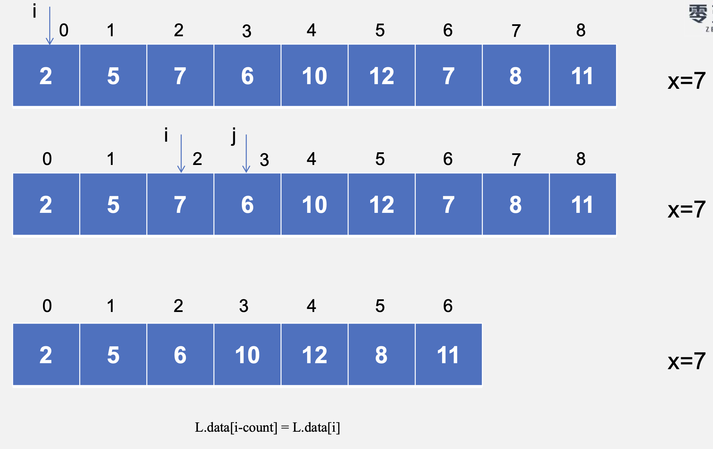
</div>

<div style=" margin: 0 auto; max-width: 50%;">
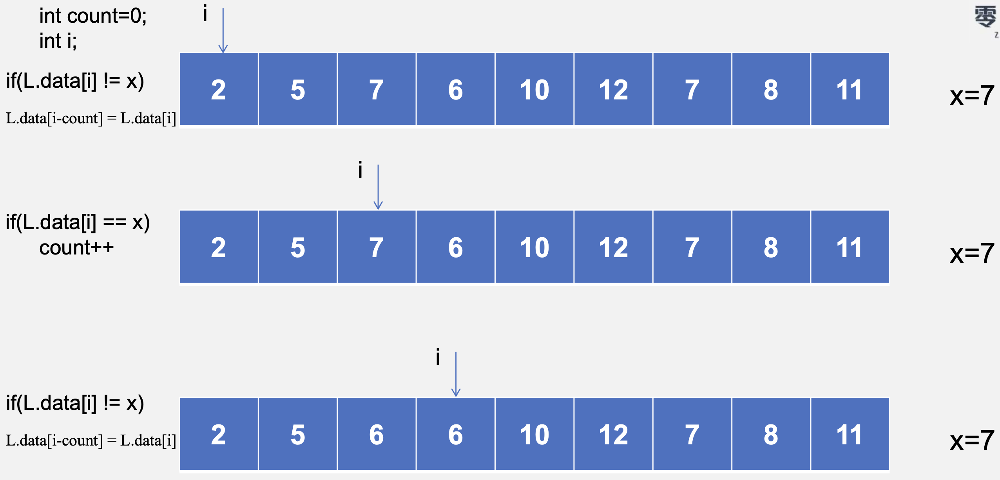
</div>

<div style=" margin: 0 auto; max-width: 50%;">
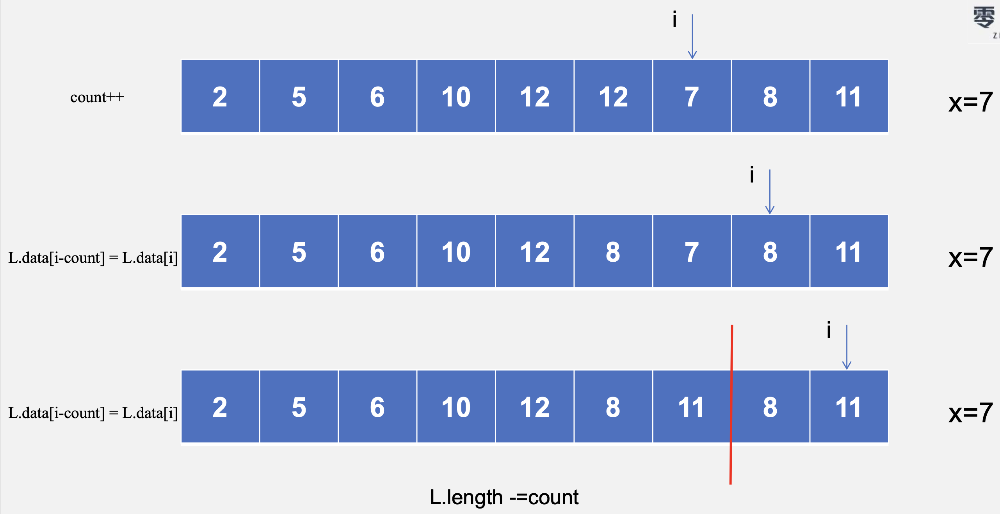
</div>

&emsp;&emsp;&ensp;基本算法思想：遍历数组，将所有值为x的元素删除。
&emsp;&emsp;&ensp;算法思想：经过观察可以发现，最终序列与原始序列相比，每一个值不等于x的元素前移的位置都等于它前面值为x的元素个数，所以只需要一个计数变量count来记录当前遍历到的x的个数，每一个不等于x的元素直接前移count个位置即最终位置。这是本题的最佳做法，时间复杂度和空间复杂度都是最优。

```c
#define MaxSize 100

typedef struct {
    int data[MaxSize];
    int length;
}SqList;

SqList removeElement(SqList& L, int n, int x){
    int count=0;
    int i;
    for(i=0; i<n; i++) {
        if(L.data[i]==x) {
            count++;
        } else {
            L.data[i-count]=L.data[i];  // 直接放到最终位置
        }
    }
    L.length-=count;
    return L;
}
```

## 算法题5

&emsp;&emsp;&ensp;现有两个非递减数组nums1和nums2，其中nums1有m个元素，nums2有n个元 素，要求在不改变大小关系的情况下将两个数组合并为一个数组。

```c
// 例:
nums1=[3,5,6,9], m=4, nums2=[1,3,5,7], n=4
// 输出:
[1,3,3,5,5,6,7,9]

nums1=[11,30,45], m=3, nums2=[5, 10] n=2
// 输出:
[5,10,11,30,45]
```

&emsp;&emsp;&ensp;基本算法思想：分别遍历两个数组，将较小的元素依次写入结果数组。