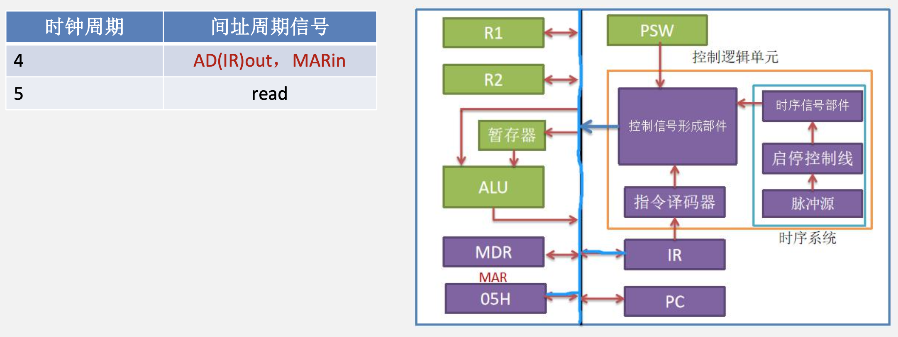

# CPU

## CPU概述

### 什么是CPU

&emsp;&emsp;&ensp;${CPU}$ 是指中央处理器，也被称为处理器或微处理器。它是计算机中的主要部件之一，用于执行计算机程序中的指令。${CPU}$ 负责执行诸如算术和逻辑操作、控制数据流、管理计算机的输入和输出等任务。

### CPU的基本功能

&emsp;&emsp;&ensp;${CPU}$ 实质包括运算器和控制器两大部分。对于冯·诺依曼结构的计算机而言，一旦程序进入存储器后，就可由计算机自动完成取指令和执行指令的任务，控制器就是专用于完成此项工作的，它负责协调并控制计算机各部件执行程序的指令序列，其基本功能是取指令、分析指令和执行指令。

### 控制器
&emsp;&emsp;&ensp;控制器是整个系统的指挥中枢，在控制器的控制下，运算器、存储器和输入/输出设备等功能部件构成一个有机的整体，根据指令的要求指挥全机协调工作。
&emsp;&emsp;&ensp;控制器由**程序计数器（${PC}$）、指令寄存器（${IR}$）、指令译码器、存储器地址寄存器（${MAR}$）、存储器数据寄存器（${MDR}$）、时序系统和微操作信号发生器**等组成。

<div style=" margin: 0 auto; max-width: 70%;">

</div>

1) **程序计数器**。用于指出下一条指令在主存中的存放地址。${CPU}$ 根据 ${PC}$ 的内容去主存中取指令。因程序中指令（通常）是顺序执行的，所以 ${PC}$ 有自增功能。
2) **指令寄存器**。用于保存当前正在执行的那条指令。
3) **指令译码器**。仅对操作码字段进行译码，向控制器提供特定的操作信号。
4) **存储器地址寄存器**。用于存放要访问的主存单元的地址。
5) **存储器数据寄存器**。用于存放向主存写入的信息或从主存读出的信息。

### 时序系统
1) **脉冲源**：产生一定频率的脉冲信号作为整个机器的时钟脉冲，是 ${CPU}$ 时序的**基准信号**。
2) **启停控制线**：在需要时能保证可靠地开放或关闭时钟脉冲，控制时序信号的发生，并实现对机器的启动与停机。
3) **时序信号产生部件**：以**时钟脉冲为基础**。**产生不同指令对应的时序信号**，实现机器指令执行过程的时序控制。

### 控制信号形成部件
&emsp;&emsp;&ensp;综合时序信号、指令译码信号和执行部件反馈的状态标志等，形成不同指令所需要的操作控制信号序列。

### 运算器
&emsp;&emsp;&ensp;运算器接收从控制器送来的命令并执行相应的动作，对数据进行加工和处理。运算器是计算机对数据进行加工处理的中心，它主要由**算术逻辑单元（${ALU}$）、暂存寄存器、累加寄存器（${ACC}$）、通用寄存器组、程序状态字寄存器（${PSW}$）、移位器、计数器（${CT}$）等组成**。

1) **算术逻辑单元**。主要功能是进行算术/逻辑运算。
2) **暂存寄存器**。用于暂存总线上的数据。暂存寄存器对应用程序员是透明的。
3) **累加寄存器**。它是一个通用寄存器，用于暂时存放 ${ALU}$ 运算的结果信息，可以作为**加法运算的一个输入端**。
4) **程序状态字寄存器**。保留**由算术逻辑运算指令或测试指令的结果而建立的各种状态信息**，如**溢出标志（${OF}$）、符号标志（${SF}$）、零标志（${ZF}$）、进位标志（${CF}$）等**。${PSW}$ 中的这些位参与并决定微操作的形成。
5) **移位器**。对操作数或运算结果进行移位运算。
6) **计数器**。控制乘除运算的操作步数。

&emsp;&emsp;&ensp;注意：${cpu}$ 的物理组成，比如控制器、运算器、存储器，和 ${cpu}$ 在运行过程的控制信号发出、时序逻辑、组合逻辑是不能够一一对应的，这些是有交叉的。例如控制器中的 ${MDR、MAR}$ 既属于数据通路也属于控制器。

## 时序系统

### 逻辑单元

&emsp;&emsp;&ensp;组合逻辑单元和状态逻辑单元（时序逻辑单元）：
1. 组合逻辑单元：处理**数据值的单元都是组合单元**，它们的输出只取决于当前的输入。当输入相同时，组合单元产生的输出也相同。如 ${ALU}$ 就是组合单元，因为**其没有内部存储功能**，当给定一组输入时总是产生同样的输出。
2. 状态逻辑单元（时序单元）：如果一个单元**带有内部存储功能**，称之为状态单元。如指令存储器，数据存储器和寄存器都是状态单元。
&emsp;&emsp;&ensp;比如 ${r1，r2}$，暂存器是状态逻辑单元，${ALU}$ 是组合逻辑单元。

<div style=" margin: 0 auto; max-width: 20%;">

</div>

&emsp;&emsp;&ensp;时钟信号长度的确定：下图描述了一个组合逻辑单元及与其相连的两个状态单元。组合逻辑单元的操作在一个时钟周期内完成，所有信号在一个时钟周期内**从状态单元 ${1}$ 经组合逻辑到达状态单元 ${2}$，信号到达状态单元 ${2}$ 所需的时间决定了时钟周期的长度**。

<div style=" margin: 0 auto; max-width: 50%;">

</div>

&emsp;&emsp;&ensp;早期计算机通常采用指令周期，机器周期，时钟周期（节拍）三级时序对数据通路操作进行时序控制。一个指令周期可分为取指周期、间址周期、执行周期、中断周期等多个基本工作周期，称为**机器周期**。

<div style=" margin: 0 auto; max-width: 50%;">

</div>

&emsp;&emsp;&ensp;一个机器周期内要进行若干步动作。例如，取指周期有送地址、取数据等。因此将一个机器周期再划分成**若干时钟周期（节拍）**，**（除访存操作外）每个动作在一个节拍内完成**。
&emsp;&emsp;&ensp;每个机器周期可以是定长的，也可以是不定长的。如果是定长的则一般以访存的机器周期为准。

## 指令周期

### 取指周期
&emsp;&emsp;&ensp;取指周期的目的就是在此期间内从存储器中读出指令。假设存储器准备一个数据也需要 ${1}$ 个时钟周期。当进入取指周期后，控制信号形成部件会根据时钟信号，**在三个时钟周期内发送三段控制信号**。假设此时 ${PC}$ 中的数据为 ${05H}$。

<div style=" margin: 0 auto; max-width: 40%;">

</div>

&emsp;&emsp;&ensp;控制信号发生器在第一个时钟周期先发出 ${PC_{out}}$ 和 ${MAR_{in}}$ 信号，${PC}$ 将数据放到总线上，同时 ${MAR}$ 从总线上读取信号。

<div style=" margin: 0 auto; max-width: 90%;">

</div>

&emsp;&emsp;&ensp;控制信号发生器在第二个时钟周期发出 ${read}$ 信号和 ${PC_{inc}}$ 信号。存储器收到 ${read}$ 信号后，从 ${MAR}$ 读取地址，将数据送入 ${MDR}$ 中。${PC}$ 收到信号 ${PC_{inc}}$ 后 ${PC}$ 自增。

<div style=" margin: 0 auto; max-width: 90%;">

</div>

&emsp;&emsp;&ensp;控制信号发生器在第三个时钟周期发出 ${MDR_{out}，IR_{in}}$ 信号，${MDR}$ 收到后将数据放入总线，${IR}$ 从总线上接收信号。

<div style=" margin: 0 auto; max-width: 90%;">

</div>

&emsp;&emsp;&ensp;取指周期的信号是通过控制信号发生器中的微程序控制器生成的，微程序控制器中保存了很多段微程序，其中就有一段叫做**公共取指微程序**，在取指周期到来时，微程序控制器读取公共取指微程序，根据微程序在每个时钟周期发送相应的信号。

<div style=" margin: 0 auto; max-width: 50%;">

</div>

### 机器周期与总线事务之间的关系
&emsp;&emsp;&ensp;总线事务：数据流通过总线在处理器和 ${DRAM}$ 主存之间来来回回。每次 ${CPU}$ 和主存之间的数据传送都是通过一系列步骤来完成的，这些步骤称为总线事务。其主要有读事务和写事务。
&emsp;&emsp;&ensp;${CPU}$ 想要访问地址 ${000010H}$ 中的数据。
1. ${CPU}$ 跟总线控制器申请总线控制权，总线控制器将总线控制权给到 ${CPU}$。
2. ${CPU}$ 将地址送进 ${MAR}$，并经过总线送到主存控制器。主存控制器收到地址后启动 ${DRAM}$ 准备数据。
3. 数据准备完毕后将数据发送到 ${MDR。MDR}$ 将数据发送到具体的寄存器。

&emsp;&emsp;&ensp;取指周期

1. ${PC}$ 将数据给到 ${MAR}$；
2. 主存根据 ${MAR}$ 中的地址，将对应的数据给到 ${MDR}$；
3. ${MDR}$ 将数据给到 ${IR}$。
&emsp;&emsp;&ensp;注意：如果这个**机器周期有访存操作**，则这个机器周期**可以和总线事务划等号**。

### 间指周期

&emsp;&emsp;&ensp;指令的间址周期，一般存在于指令中的**某个操作数采用间址寻址方式的指令周期中**。间址周期的目的是**取出操作数的有效地址**。以指令 ${MOV\quad R1,\quad 05H}$ 为例，其中源操作数 ${05H}$ 采用间址寻址。

<div style=" margin: 0 auto; max-width: 50%;">

</div>

&emsp;&emsp;&ensp;控制信号发生器在第 ${4}$ 个时钟周期先发出 ${AD(IR)_{out}，MAR_{in}}$ 信号，${IR}$ 将形式地址放到总线上，同时 ${MAR}$ 从总线上读取形式地址。

<div style=" margin: 0 auto; max-width: 90%;">

</div>

&emsp;&emsp;&ensp;控制信号发生器在第 ${5}$ 个时钟周期发出 ${read}$ 信号。存储器收到 ${read}$ 信号后，从 ${MAR}$ 读取地址，将数据送入 ${MDR}$ 中。

<div style=" margin: 0 auto; max-width: 90%;">

</div>

&emsp;&emsp;&ensp;经过取指周期后，${CPU}$ 将指令放入 ${IR}$ 中，控制信号发生器**根据 ${IR}$ 的操作码字段分析出源操作数采用间址寻址**，从而进入间址周期。微程序控制器根据操作码字段分析，得出间址周期和执行周期的微程序，但在间址周期只执行间址周期的微程序。
&emsp;&emsp;&ensp;注意：**取指周期的微程序是微程序控制器直接提供**，间址周期的微程序是**根据操作码字段分析得出**。

<div style=" margin: 0 auto; max-width: 50%;">

</div>

### 执行周期

&emsp;&emsp;&ensp;执行周期的目的是执行指令操作。同样以指令 ${MOV\quad R1,\quad 05H}$ 为例，其中源操作数 ${05H}$ 采用间址寻址。在间址周期根据形式地址取到了有效地址，执行周期将有效地址中的数据给到 ${R1}$。

<div style=" margin: 0 auto; max-width: 50%;">

</div>

&emsp;&emsp;&ensp;控制信号发生器在第 ${6}$ 个时钟周期先发出 ${MDR_{out}，MAR_{in}}$ 信号，${MDR}$ 将有效地址放到总线上，同时 ${MAR}$ 从总线上读取有效地址地址。

<div style=" margin: 0 auto; max-width: 90%;">

</div>

&emsp;&emsp;&ensp;控制信号发生器在第 ${7}$ 个时钟周期发出 ${read}$ 信号。存储器收到 ${read}$ 信号后，从 ${MAR}$ 读取地址，将数据送入 ${MDR}$ 中。

<div style=" margin: 0 auto; max-width: 90%;">

</div>

&emsp;&emsp;&ensp;控制信号发生器在第 ${8}$ 个时钟周期发出 ${MDR_{out}，R1_{in}}$ 信号，${MDR}$ 收到后将数据放入总线，${R1}$ 从总线上接收信号。

<div style=" margin: 0 auto; max-width: 90%;">

</div>

&emsp;&emsp;&ensp;执行周期的控制信号同样是**进入间址周期前，根据控制信号发生器分析指令的操作码字段**得来的。微程序控制器会在进入间址周期前生成的间址周期和执行周期的微程序。当时钟进入执行周期时，启动执行周期的微程序。
&emsp;&emsp;&ensp;注意：**不论是间址周期的微程序还是执行周期的微程序，都是在取指周期过去后，译码器分析指令操作码统一得到的**。

<div style=" margin: 0 auto; max-width: 50%;">

</div>

### 中断周期

&emsp;&emsp;&ensp;指令的中断周期**负责响应中断信号**。而且中断信号的响应**只能发生在指令的中断周期**，其余任何时间，即使发生了中断信号，指令也不会响应，而是**在中断周期统一处理**。

### 数据通路

&emsp;&emsp;&ensp;数据通路，就是指令中数据流经过的路径，路径中的**状态逻辑部件和组合逻辑部件共同构成数据通路**。

## 指令流水线

### 通用寄存器组
&emsp;&emsp;&ensp;我们在真题中遇到的通用寄存器组，一般情况是在 ${RISC}$ 风格的指令的数据通路中使用。寄存器组有**三个输入端口**，其输入的是**寄存器的编号**。有**两个输出端口**，可以**同时输出两个寄存器的值**。还有一个**总线输入端口**，用于**接收总线上的数据**，从而写入寄存器。最后还有一个**写控制线**，用于给出**寄存器写信号**。

<div style=" margin: 0 auto; max-width: 40%;">

</div>

&emsp;&emsp;&ensp;以 ${MIPS}$ 指令为例，有一条 ${R}$ 型指令 ${ADD\quad R1, \quad R2, \quad R3}$；指令将寄存器号 ${1，2，3}$ 分别输入到寄存器组的三个端口，寄存器组内部的译码器将序号 ${00001，00010，00011}$ 进行译码，将源操作数 ${R2}$ 和 ${R3}$ 中的数据分别送到 ${busA}$ 和 ${busB}$，当指令执行完，需要将加法后的数据写回时， ${WE}$ 信号给出，通过 ${busW}$ 将数据写回 ${R1}$ 寄存器。

<div style=" margin: 0 auto; max-width: 50%;">

</div>

&emsp;&emsp;&ensp;指令流水线一般把一个 ${RISC}$ 指令的指令周期分成五部分，称作五个流水段（也称功能段），这五个流水段分别为：
取指（${IF}$）：从指令存储器或 ${Cache}$ 中**取指令**。
译码/读寄存器（${ID}$）：操作控制器**对指令进行译码**，同时从根据寄存器号从寄存器组中**取出操作数**。
执行/计算地址（${EX}$）：执行**运算操作或计算地址**。
访存（${MEM}$）：**对存储器进行读写操作**。
写回（${WB}$）：**将指令执行结果写回寄存器组**。

&emsp;&emsp;&ensp;流水线设计的原则是，指令流水段个数以**最复杂指令所用的功能段个数为准**。流水段的长度以**最复杂的操作所花的时间为准**。假设某条指令的 ${5}$ 个阶段所花的时间分别如下。

1. 取指：200ps
2. 译码：100ps
3. 执行：150ps
4. 访存：200ps
5. 写回：100ps

&emsp;&emsp;&ensp;该指令的总执行时间为 ${750ps}$。按照流水线设计原则，**每个流水段的长度**为 ${200ps}$, 所以每条指令的执行时间为 ${1ns}$。

<div style=" margin: 0 auto; max-width: 90%;">

</div>

### 取指（IF）
&emsp;&emsp;&ensp;从指令存储器或 ${Cache}$ 中取指令。和我们前部分学的取指周期有所区别，流水线形式下的取指令是**通过硬件自动执行**。数据通路中**有专门的取指部件**，该部件**属于组合逻辑部件**。当指令地址从 ${PC}$ 给出后，经过取指令部件后数据**存入状态逻辑单元-段寄存器**。

<div style=" margin: 0 auto; max-width: 30%;">

</div>

&emsp;&emsp;&ensp;时钟信号定义：所有信号在一个时钟周期内从状态单元 ${1}$ 经组合逻辑到达状态单元 ${2}$，信号到达状态单元 ${2}$ 所需的时间**决定了时钟周期的长度**。
&emsp;&emsp;&ensp;**根据上述定义，一般把从 ${PC}$ 读出开始，经过取值部件，到达段寄存器为止，这段时间称为 ${1}$ 个时钟周期**。

### 译码/读寄存器（ID）

&emsp;&emsp;&ensp;操作控制器**对指令进行译码**，同时从根据寄存器号从寄存器组中**取出操作数**。操作控制器对指令译码**生成对应的控制信号**，并将指令的**寄存器号字段给到寄存器组**，寄存器组对其进行**译码后将两个源操作数同时读出**。

<div style=" margin: 0 auto; max-width: 90%;">

</div>

### 执行/计算地址（EX）
&emsp;&emsp;&ensp;执行运算操作或计算地址。以指令 ${ADD\quad R1,\quad R2,\quad R3}$ 为例，执行阶段就是从段寄存器中，将 ${R3}$ 和 ${R2}$ 的值进行加法操作，结果存入下一个段寄存器。

<div style=" margin: 0 auto; max-width: 30%;">

</div>

## 访存（MEM）
&emsp;&emsp;&ensp;对存储器进行读写操作。如果指令有访存操作的话，则从访存部件前的段寄存器中读取有效地址，地址**经过访存部件后把数据写入下一个 段寄存器**。
&emsp;&emsp;&ensp;注意，在流水线数据通路中，访存部件如果是**读操作**，则当作**组合逻辑部件**。如果是**写操作**，则当作**状态逻辑部件**。指令 ${ADD\quad R1,\quad R2,\quad R3}$ 由于没有访存操作，所以把**执行部件存入到访存部件前一个段寄存器的数据读到下一个段寄存器**。

<div style=" margin: 0 auto; max-width: 50%;">

</div>

### 写回（WB）
&emsp;&emsp;&ensp;将指令执行结果写回寄存器组。写回操作就是从**前一个段寄存器中**把从主存中，或执行部件得到的数据写回寄存器。同样是根据指令中给出的**寄存器号**，写入相应的寄存器中。

&emsp;&emsp;&ensp;当指令流水线充分流动后，**每个时钟周期相当于完成了一条指令（纵向看）**，串行方式下每个指令需要 ${5}$ 个时钟周期，而采用流水线方式下，当充分运转时，${1}$ 个时钟周期相当于完成了一条指令，比串行的速度提升了 ${5}$ 倍。

<div style=" margin: 0 auto; max-width: 90%;">

</div>

### 流水线的吞吐率

&emsp;&emsp;&ensp;流水线的吞吐率是指在**单位时间内流水线所完成的任务数量，或输出结果的数量**。
&emsp;&emsp;&ensp;流水线吞吐率（${TP}$）的最基本公式为：${TP = n / T_k}$。式中，${n}$ 是任务数，${T_k}$ 是处理完 ${n}$ 个任务所用的总时间。
&emsp;&emsp;&ensp;设 ${k}$ 为流水段的段数，${t}$ 为时钟周期。在输入流水线中的任务连续的理想情况下，一条 ${k}$ 段流水线能在 ${k+n-1}$ 个时钟周期内完成 ${n}$ 个任务。得出流水线的吞吐率为 ${TP=\frac{n}{(k+n-1)\times t}}$ 连续输入的任务数 ${n→∞}$ 时，得最大吞吐率为 ${TP_{max} =\frac{1}{t}}$。

### 流水线冒险和处理

&emsp;&emsp;&ensp;在指令流水线中，可能会遇到一些情况使得流水线无法正确执行后续指令而**引起流水线阻塞或停顿**，这种现象称为流水线冒险。根据导致冒险的原因不同主要有 ${3}$ 种：**结构冒险（资源冲突）、数据冒险（数据冲突）和控制冒险（控制冲突）**。

#### 结构冒险
&emsp;&emsp;&ensp;由于多条指令在同一时刻争用同一资源而形成的冲突，也称为资源冲突，即由硬件资源竞争造成的冲突。

```c
// Load 指令
ADD R4，R5，R6
ADD R7，R8，R9
ADD R10，R3，R11
```

<div style=" margin: 0 auto; max-width: 70%;">

</div>

#### 解决结构冒险：
1) 前一指令访问时，使后一条相关指令（以及其后续指令）暂停一个时钟周期。

<div style=" margin: 0 auto; max-width: 70%;">

</div>

2) 单独设置数据存储器和指令存储器，使取数和取指令操作各自在不同的存储器中进行。事实上，现代计算机都引入了 ${Cache}$ 机制，而 ${Cache}$ 通常采用数据 ${Cache}$ 和指令 ${Cache}$ 分离的方式，因而也就避免了资源冲突的发生。

#### 数据冒险

&emsp;&emsp;&ensp;在一个程序中，**下一条指令会用到当前指令计算出的结果**，此时这两条指令发生数据冲突。当多条指令重叠处理时就会发生冲突，数据冒险可分为三类：
1) 写后读（${Read After Write，RAW}$）相关：表示当前指令将数据写入寄存器后，下一条指令才能从该寄存器读取数据。否则，先读后写，读到的就是错误（旧）数据。
2) 读后写（${Write After Read，WAR}$）相关：表示当前指令读出数据后，下一条指令才能写该寄存器。否则，先写后 读，读到的就是错误（新）数据。
3) 写后写（${Write After Write，WAW}$）相关：表示当前指令写入寄存器后，下一条指令才能写该寄存器。否则，下一条指令在当前指令之前写，将使寄存器的值不是最新值。

```c
ADD R3，R2，R1
ADD R5，R4，R3
```

#### 解决写后读数据冒险

1) 把遇到数据相关的指令及其后续指令都暂停一至几个时钟周期，直到数据相关问题消失后再继续执行，可分为硬件阻塞（${stall}$）和软件插入“${NOP}$”指令两种方法。

<div style=" margin: 0 auto; max-width: 70%;">

</div>

2) 设置相关专用通路，即不等前一条指令把计算结果写回寄存器组，下一条指令也不再读寄存器组，而直接把前一条指令的 ${ALU}$ 的计算结果**作为自己的输入数据开始计算过程**，使本来需要暂停的操作变得可以继续执行，这称为**数据旁路技术**。
3) 通过编译器对数据相关的指令编译优化的方法，调整指令顺序来解决数据相关。

#### 控制冒险

&emsp;&emsp;&ensp;指令通常是**顺序执行**的，但是在遇到改变指令执行顺序的情况，例如**执行转移、调用或返回等指令时**，会改变 ${PC}$ 值，会造成**断流，从而引起控制冒险**。

```c
loop:
ADD R1，R2，R3 
beq R4，R5，Loop
ADD R6，R7，R8 
ADD R9，R10，R11 
ADD R12，R13，R14
```

<div style=" margin: 0 auto; max-width: 90%;">

</div>

#### 控制冒险处理
&emsp;&emsp;&ensp;解决的办法有以下几种：
1) 对转移指令进行**分支预测**，尽早生成转移目标地址。分支预测分为**简单（静态）预测和动态预测**。静态预测总是预测条件不满足，即继续执行分支指令的后续指令。动态预测根据程序执行的历史情况，进行动态预测调整，有较高的预测准确率。
2) 预取转移成功和不成功两个控制流方向上的目标指令。
3) 加快和提前形成条件码。
4) 提高转移方向的猜准率。

### 高级流水线入门

&emsp;&emsp;&ensp;在原有流水线基础上，随着技术升级又产生了有两种增加指令级并行的策略：一种是**多发射技术**，它通过采用多个内部功能部件，使流水线功能段能**同时处理多条指令**，处理机一次可以发射多条指令进入流水线执行。
&emsp;&emsp;&ensp;其代表技术为：
1. **超标量处理器**
2. **超长指令字处理器**
&emsp;&emsp;&ensp;另一种是**超流水线技术**，它通过**增加流水线级数**来使更多的指令同时在流水线中**重叠执行**。其代表技术为超流水处理器。

#### 超标量处理器

&emsp;&emsp;&ensp;**超标量流水线技术也称动态多发射技术**，每个时钟周期内可并发多条独立指令，以**并行操作方式将两条或多条指令编译并执行**，为此**需配置多个功能部件**。超标量技术**不能调整指令的执行顺序**，因此通过编译优化技术，把可并行执行的指令搭配起来，**挖掘更多的指令并行性**。

<div style=" margin: 0 auto; max-width: 70%;">

</div>

&emsp;&emsp;&ensp;超标量处理器主要应用在多核 ${CPU}$ 场景，比如你的 ${CPU}$ 有三个核，每个核有自己的一套流水线，那么**可以三条指令流水线共同工作**。

#### 超长指令字处理器

&emsp;&emsp;&ensp;**超长指令字技术也称静态多发射技术**，由编译程序挖掘出**指令间潜在的并行性**，将多条能并行操作的指令**组合成一条具有多个操作码字段的超长指令字**（可达几百位），为此需要采用多个处理部件。
&emsp;&emsp;&ensp;超长指令 ${ADD R1，R2，R3，R4，R5，R6，R7，R8}$。在此指令中将 ${R1，R2}$ 放入第一个 ${ALU}$ 计算，将 ${R3，R4}$ 放入第二个 ${ALU}$ 计算，将 ${R5，R6}$ 放入第三个 ${ALU}$ 计算，将 ${R7，R8}$ 放入第四个 ${ALU}$ 计算。相当于可以**同时支持四组寄存器计算操作**。

<div style=" margin: 0 auto; max-width: 40%;">

</div>

#### 超流水处理器

&emsp;&emsp;&ensp;流水线功能段划分得越多，**时钟周期就越短**，指令吞吐率也就越高，因此超流线技术是通过**提高流水线主频的方式**来提升流水线性能的。但是，流水线级数越多，用于流水寄存器的开销就越大，因而流水线级数是有限制的，**并不是越多越好**。
&emsp;&emsp;&ensp;比如ARM处理器采用 ${10}$ 多个流水段组成一条流水线，下图为一条 ${10}$ 个流水段组成的流水线。

<div style=" margin: 0 auto; max-width: 90%;">

</div>


