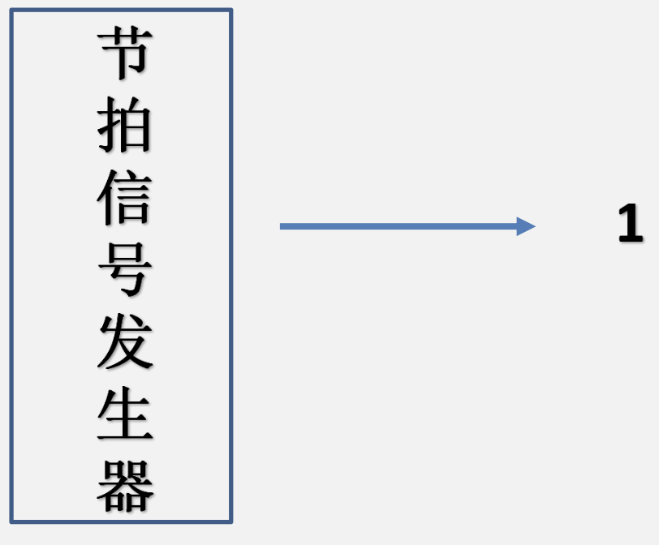
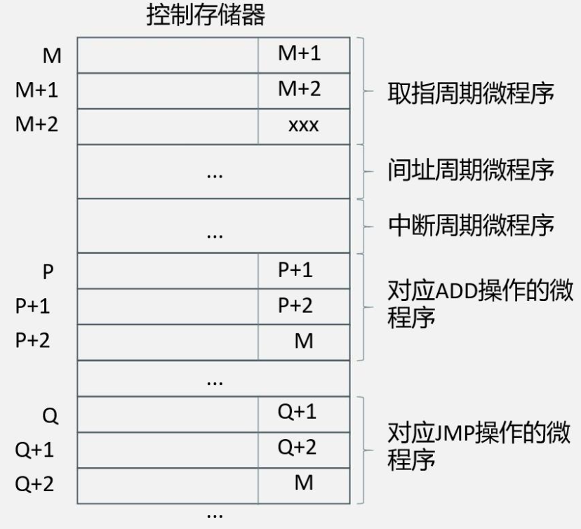

# CU与ALU

## CU的功能

&emsp;&emsp;&ensp;什么是微命令?
&emsp;&emsp;&ensp;在指令执行过程中，**控制单元**通过**控制线**向执行部件发出各种**控制命令**，称之为**微命令**。

&emsp;&emsp;&ensp;什么又是微操作?
&emsp;&emsp;&ensp;在接收**微命令**后，执行部件会进行**相应的微操作**。

### 一些简单的指令

1. 非访存指令
   1. ${CLA}$：**清除累加器**指令，对累加器内容进行清 ${0}$。
   2. ${COM}$：**累加器取反**指令，对累加器内容进行取反。
   3. ${SHR}$：**算术右移一位**指令，对累加器内容进行算术右移一位的操作。
   4. ${CSL}$：**循环左移一位**指令，对累加器内容进行循环左移一位的操作。
   5. ${STP}$：**停机指令**，将运行标志触发器置 ${0}$。
2. 访存指令
   1. ${ADD X}$：**加法指令**，将主存单元 ${X}$ 的内容与累加器的内容相加，并将结果送入累加器。
   2. ${STA X}$：**存数指令**，将累加器的内容存入主存单元 ${X}$ 中。
   3. ${LDA X}$：**取数指令**，将主存单元 ${X}$ 的内容存入累加器中。
3. 转移类指令
   1. ${JMP X}$：**无条件转移指令**，将指令地址码部分内容 ${X}$ 送入 ${PC}$ 中。
   2. ${BAN X}$：**条件转移指令**，根据上一条指令的运行结果决定下一条指令的运行地址，如果结果为负（累加器最高位为 ${1}$），则将指令的地址码送入 ${PC}$，否则程序仍按原顺序执行。

### 控制单元的功能

#### 输入信号

##### 时钟

&emsp;&emsp;&ensp;提供时钟控制，使控制单元按一定的先后顺序、一定的节奏发出各个控制信号。**每一个时钟脉冲**使控制单元发送一个操作命令，或发送一组需要同时执行的操作命令。

##### 指令操作码

&emsp;&emsp;&ensp;现行指令的操作码决定了不同指令在**执行周期所需完成的不同操作**，它可以与时钟配合产生不同的控制信号。

##### 标志

&emsp;&emsp;&ensp;执行部件反馈的**状态标志**（通常存放在状态寄存器中）也会影响控制信号的产生。

##### 来自系统总线（控制总线）的控制信号

&emsp;&emsp;&ensp;外部的中断请求、总线请求、${DMA}$ 请求等也会影响控制信号的产生。

#### 输出信号

##### CPU内的控制信号

&emsp;&emsp;&ensp;主要用于 ${CPU}$ 内的寄存器之间的数据传送和控制 ${ALU}$ 等执行部件的操作。

##### 到系统总线（控制总线）的控制信号

&emsp;&emsp;&ensp;主存读命令、主存写命令、${I/O}$ 控制命令、中断响应等。

### 指令执行的本质

#### 时间角度来看

${微操作组1\to 微操作组2\to 微操作组3\to 微操作组4}$

#### 微操作角度来看（控制单元的功能）

#### 针对行为实现控制（对应硬布线设计）

${遇见唱歌=(6月1日\& 上午)|(6月2日\& 上午)|(6月3日\& 上午)|(6月3日\& 晚上)}$

##### 针对行为实现控制（增加条件控制）

${遇见唱歌=(6月1日\&上午\&天晴)|(6月2日\&上午)|(6月3日\&上午)|(6月3日\&晚上\&发工资)}$

#### 针对时间实现控制（对应微程序控制器）

&emsp;&emsp;&ensp;在对硬布线方式与微程序方式展开讨论之前，我们先对我们的 ${CU}$ 设计进行如下的规定和简化：

1. ${CPU}$ 内部采用**单总线结构**，也就是说在一个时钟周期内，数据通路上**只能存在一种数据信号**。
2. ${CPU}$ 采用**同步控制方式**。所谓同步控制方式，指的是任意一条指令执行中涉及到的微操作序列都是事先确定的，且它们都**受统一时钟信号的控制**。也就是说，我们需要**事先设计**好指令执行过程中涉及到的微操作的**时序关系**。
3. 我们假设在进行**硬布线设计**时，**每个机器周期的长度为 ${3}$ 个时钟周期**。

## CU组合逻辑设计

### 几种基本部件

#### 节拍信号发生器

#### 三态缓冲器

&emsp;&emsp;&ensp;三态缓冲器有三种可能的输出状态：高电平状态 ${High(1)}$、低电平状态 ${Low(0)}$ 和浮空状态 ${(Z)}$。
&emsp;&emsp;&ensp;如下图所示，三态缓冲器有输入端 ${A}$、输出端 ${Y}$ 和使能控制端 ${E}$。当使能控制端为 ${True}$ 时，三态缓冲器将作为一个**简单的缓冲器**，将输入值传送到输出端；当使能控制端为 ${False}$ 时，输出值被设置为**浮空**。

#### 译码器

#### 多路选择器

### 组合逻辑设计步骤

1. 根据上面列出的 ${10}$ 条指令的微操作的节拍安排，**列出微操作的时间表**；
2. 写出**每个微操作对应的微操作命令**（即微操作控制信号）的逻辑表达式；
3. 根据逻辑表达式画出相应的组合逻辑电路图。

#### 微操作的节拍安排

&emsp;&emsp;&ensp;微操作：控制器发出控制信号后，硬件可以直接执行的原子操作，在一个时钟周期内就可以完成。

##### 取指周期

${T0:PC → MAR，1 → R}$
${T1:M(MAR) → MDR，(PC) + 1 → PC}$
${T2:MDR → IR，OP(IR) → CU(ID)(译码)}$

##### 间指周期

${T0:Ad(IR) → MAR，1 → R}$
${T1:M(MAR) → MDR}$
${T2:MDR → Ad(IR)}$

##### 执行周期

###### 清除累加器指令CLA

${T0:0 → ACC}$

###### 停机指令STP

${T0:0 → G}$

###### 加法指令ADD X

${T0:Ad(IR) → MAR，1 → R}$
${T1:M(MAR) → MDR}$
${T2:(ACC) + (MDR) → ACC}$

###### 存数指令STA X

${T0:Ad(IR) → MAR，1 → W}$
${T1:ACC → MDR}$
${T2:MDR → M(MAR)}$

###### 取数指令LDA X

${T0:Ad(IR) → MAR，1 → R}$
${T1:M(MAR) → MDR}$
${T2:MDR → ACC}$

###### 无条件转移指令JMP X

${T0:Ad(IR) → PC}$

##### 中断周期

${T0:栈顶地址 → MAR，1 → W}$
${T1:PC → MDR}$
${T2:MDR → M(MAR)，中断向量地址 → PC}$

#### 列出表格

#### 写出逻辑表达式

&emsp;&emsp;&ensp;机器周期 & 指令类型 & 时钟信号 & 机器状态条件

&emsp;&emsp;&ensp;例：上表中 ${M(MAR) → MDR}$ 微操作命令的逻辑表达式：${M(MAR)→MDR=FE·T1+IND·T1(ADD+STA+LDA+JMP+BAN)+EX·T1(ADD + LDA)}$

&emsp;&emsp;&ensp;真值表：

#### 组合逻辑电路图

## CU微程序设计

### 微程序设计思想
&emsp;&emsp;&ensp;将一条**机器指令**编写成一个**微程序**，每一个微程序包含若干条**微指令**，每条微指令对应一个或几个微操作命令，简称**微命令**，微命令和**微操作**是一一对应的，微操作是微命令的执行过程。微操作是硬件可以直接执行的原子操作。
&emsp;&emsp;&ensp;采用与**存储程序**类似的方法，把这些微程序存到一个**控制存储器**中，用寻找用户程序的每条机器指令的方法去寻找每个微程序的每条微指令。逐条执行这些微指令，就相应地完成了一条机器指令的全部操作。

${T0:PC → MAR}$
${T1:M(MAR) → MDR，(PC) + 1 → PC}$
${T2:MDR → IR，OP(IR) → CU(ID)(译码)}$

### 微程序控制单元

#### 控制存储器CM
&emsp;&emsp;&ensp;微程序控制单元的核心部件，用来**存放微程序**，由 ${ROM}$ 组成，其内部排布如下图所示（以水平型微指令为例）：

#### CMAR

&emsp;&emsp;&ensp;控制存储器地址寄存器，也叫微地址寄存器。用来存放预读出的微指令在控制存储器中的地址。

#### CMDR

&emsp;&emsp;&ensp;控制存储器数据寄存器，也叫微指令寄存器 ${µIR}$，用来存放从控制存储器取出的微指令。

&emsp;&emsp;&ensp;对于每条微指令，其内部排布如下所示：

#### 顺序逻辑

&emsp;&emsp;&ensp;多路选择器，依据各种条件在多个传入的地址中**选择正确的微指令地址**给到 ${CMAR}$。

##### 顺序逻辑的下地址选择

&emsp;&emsp;&ensp;一般而言，同一个微程序内部的微指令在 ${CM}$ 中是连续存放的，又因为所有指令的取指周期、间指周期（若存在）、中断周期执行的微操作完全相同。所以若将取指周期、间指周期、中断周期设计成统一的微程序，则可以被所有指令公用。每条指令的差异只存在于执行周期，因此**对不同指令的执行周期微程序进行单独编写和存放即可**。

#### 微地址形成部件

&emsp;&emsp;&ensp;根据 ${IR}$ 送来的指令操作码形成该机器指令执行阶段所对应的微程序在 ${CM}$ 中的**首地址**。

&emsp;&emsp;&ensp;当微指令位于微程序内部时，则执行的下一条微指令应该是 ${CM}$ 中下一个地址中的微指令。

&emsp;&emsp;&ensp;当当前执行的微指令位于微程序内部时，则执行的下一条微指令应该是 ${CM}$ 中下一个地址中的微指令。

&emsp;&emsp;&ensp;当当前执行的微指令是取指周期微程序的最后一条时，则执行的下一条微指令应该是间指周期微程序或执行周期微程序的第一条微指令。

&emsp;&emsp;&ensp;当当前执行的微指令是执行周期微程序的最后一条时，则执行的下一条微指令应该是取指周期微程序或中断周期微程序的第一条微指令。

&emsp;&emsp;&ensp;各自微程序的最后一条指令的下地址字段通常指向**取指周期微程序的入口地址**。

### 微程序设计步骤
&emsp;&emsp;&ensp;微程序设计的主要工作是编写各个机器指令对应的微程序。步骤如下：
1. 写出对应机器指令的微操作；
2. 确定微指令格式；
3. 编写出每条微指令的二进制代码（叫做微指令码点）。

#### 每条微指令的执行过程
1. 根据顺序逻辑选出的微指令地址读出微指令；
2. 根据微指令的微操作控制字段执行对应的微操作命令；
3. 确定下条微指令的地址。

##### 取指阶段：执行取指微程序

&emsp;&emsp;&ensp;执行取指微程序
&emsp;&emsp;&ensp;${M→顺序逻辑→CMAR}$
&emsp;&emsp;&ensp;${CM(CMAR)→CMDR}$
&emsp;&emsp;&ensp;${通过CMDR存放的微指令发出控制信号执行微操作}$
&emsp;&emsp;&ensp;${((PC)→MAR，1→R)}$
&emsp;&emsp;&ensp;${获得下一条微指令地址(M+1)}$
&emsp;&emsp;&ensp;${Ad(CMDR)→顺序逻辑→CMAR}$

&emsp;&emsp;&ensp;${CM(CMAR)→CMDR}$
&emsp;&emsp;&ensp;${通过CMDR存放的微指令发出控制信号执行微操作}$
&emsp;&emsp;&ensp;${M(MAR) → (PC) + 1 MDR → PC}$
&emsp;&emsp;&ensp;${获得下一条微指令地址(M+2)}$
&emsp;&emsp;&ensp;${Ad(CMDR)→顺序逻辑→CMAR}$

&emsp;&emsp;&ensp;${CM(CMAR)→CMDR}$
&emsp;&emsp;&ensp;${通过CMDR存放的微指令发出控制信号执行微操作}$
&emsp;&emsp;&ensp;${MDR → IR}$
&emsp;&emsp;&ensp;${OP(IR)→微地址形成部件，得到LDA操作微程序入口地址P}$
&emsp;&emsp;&ensp;${P→顺序逻辑→CMAR}$

&emsp;&emsp;&ensp;我们将此处的顺序逻辑进行放大:

##### 执行阶段：执行LDA微程序

&emsp;&emsp;&ensp;${CM(CMAR)→CMDR}$
&emsp;&emsp;&ensp;${通过CMDR存放的微指令发出控制信号执行微操作}$
&emsp;&emsp;&ensp;${Ad(IR) → MAR，1 → R}$
&emsp;&emsp;&ensp;${获得下一条微指令地址(P+1)}$
&emsp;&emsp;&ensp;${Ad(CMDR)→顺序逻辑→CMAR}$

&emsp;&emsp;&ensp;${CM(CMAR)→CMDR}$
&emsp;&emsp;&ensp;${通过CMDR存放的微指令发出控制信号执行微操作}$
&emsp;&emsp;&ensp;${M(MAR) → MDR}$
&emsp;&emsp;&ensp;${获得下一条微指令地址(P+2)}$
&emsp;&emsp;&ensp;${Ad(CMDR)→顺序逻辑→CMAR}$

&emsp;&emsp;&ensp;${CM(CMAR)→CMDR}$
&emsp;&emsp;&ensp;${通过CMDR存放的微指令发出控制信号执行微操作}$
&emsp;&emsp;&ensp;${MDR → ACC}$
&emsp;&emsp;&ensp;${获得下一条微指令地址(M)}$
&emsp;&emsp;&ensp;${Ad(CMDR)→顺序逻辑→CMAR}$

&emsp;&emsp;&ensp;我们将此处的顺序逻辑进行放大:

##### 取指阶段：执行取指微程序

&emsp;&emsp;&ensp;${通过CMDR存放的微指令发出控制信号执行微操作}$
&emsp;&emsp;&ensp;${CM(CMAR)→CMDR}$
&emsp;&emsp;&ensp;${((PC)→MAR，1→R)}$
&emsp;&emsp;&ensp;${获得下一条微指令地址(M+1)}$
&emsp;&emsp;&ensp;${Ad(CMDR)→顺序逻辑→CMAR}$

#### 确定微指令格式

##### 直接编码（直接控制）方式
&emsp;&emsp;&ensp;在微指令的操作控制字段中，每一位代表一个微操作命令。通常某位为 ${1}$ 代表该控制信号有效，为0代表该控制信号无效。
&emsp;&emsp;&ensp;优点：

1. 含义清晰，只要微指令从控存读出，就能由操作控制字段直接发出微操作命令，速度快。
2. 可以并行执行的微操作只要相应位全赋 ${1}$ 即可，并行性好。

&emsp;&emsp;&ensp;缺点：机器中每个微操作命令都要占一位，所以微指令会很长（可达几百位），造成控存容量太大。

##### 字段直接编码方式
&emsp;&emsp;&ensp;将微指令的操作控制字段**分成若干小段**，将一组**互斥的微操作命令放在一个字段内**，通过对这个字段译码，就可以得到相应的微命令。同一时间，每个字段仅一个微操作命令有效，**不同字段的微操作可以并行**。这种方式靠字段直接译码发出微指令，故又称为**显式编码**。
&emsp;&emsp;&ensp;优点：压缩了微指令的长度。
&emsp;&emsp;&ensp;缺点：需要增加译码电路，会减慢速度。

&emsp;&emsp;&ensp;只考虑这四条微操作在一个时钟周期内的执行与否，有几种情况？
&emsp;&emsp;&ensp;${MDR->M(MAR)}$
&emsp;&emsp;&ensp;${M(MAR)->MDR}$
&emsp;&emsp;&ensp;${MDR->ACC}$
&emsp;&emsp;&ensp;${ACC->MDR}$

&emsp;&emsp;&ensp;答：${5}$ 种，执行四种微操作中的一种或都不执行。**每个字段要保留一种编码代表该字段的所有微操作控制信号都无效**。

##### 字段间接编码方式

&emsp;&emsp;&ensp;一个字段的某些微命令还**需要由另一个字段中的某些微命令来解释**。由于不是靠字段直接译码发出微命令，故又称为**隐式编码**。
&emsp;&emsp;&ensp;优点：进一步压缩了微指令的长度。
&emsp;&emsp;&ensp;缺点：**削弱了微指令的并行控制能力**。

##### 混合编码

&emsp;&emsp;&ensp;将直接编码和字段编码混合使用，以便能综合考虑微指令的字长、灵活性和执行微程序的速度等方面的要求。

##### 垂直型微指令

&emsp;&emsp;&ensp;本质上直接编码、字段直接编码、字段间接编码、混合编码都属于**水平型微指令**，一条微指令一次性定义并执行多个**并行操作**的命令。还有一种垂直型微指令：采用类似机器指令操作码的方式，在微指令字中，设置微操作码字段，由微操作码规定微指令的功能。通常，一条垂直型微指令有 ${1}$ 个微命令，控制 ${1}$ 种操作。这种微指令**不强调其并行控制能力**。

##### 混合型微指令

&emsp;&emsp;&ensp;在垂直型微指令的基础上增加一些并不复杂的并行操作。

##### 水平型微指令和垂直型微指令的比较

1. 水平型微指令比垂直型微指令**并行操作能力强、效率高、灵活性强**。
2. 水平型微指令执行一条机器指令所需的**微指令数目少**，因此**速度更快**。
3. 水平型微指令用较短的微程序结构换取较长的微指令结构，垂直型微指令则相反，它用**较长的微程序结构换取较短的微指令结构**。
4. 水平型微指令与机器指令差别较大，垂直型微指令与机器指令相似。

### 组合逻辑设计和微程序设计的区别

## ALU

&emsp;&emsp;&ensp;${ALU}$ 的功能：${ALU}$（算数逻辑运算单元）是运算器的核心部件，它是一个组合电路，负责完成包括加、减、乘、除四则运算、与、或、非、异或等逻辑运算、以及移位、求补等操作。加法器是 ${ALU}$ 最基础的部件。

### 全加器

&emsp;&emsp;&ensp;${n}$ 位加法器是由 ${n}$ 个一位加法器组成的。同时考虑两个加数和低位进位的一位加法器称之为全加器（${Full\quad Adder，FA}$）。全加器的输入为两个加数 ${A、B}$ 和低位进位 ${C_{in}}$，输出为和 ${F}$、高位进位 ${C_{out}}$。全加器的真值表如下图所示：

&emsp;&emsp;&ensp;得到全加器的逻辑表达式并将其化简：${F=A\oplus B\oplus C_{in}}$ ${C_{out}=A*B+(A\oplus B)*C_{in}}$

### 串行加法器

&emsp;&emsp;&ensp;将 ${n}$ 个全加器相连，就可以得到计算 ${n}$ 位无符号数加法的串行加法器，其逻辑电路图如下图所示：

&emsp;&emsp;&ensp;在串行进位加法器中，低位运算产生进位所需的时间将影响高位运算的时间（高位运算的低位进位输入需要前一位运算给出），因此串行加法器的最长运算时间是由低位信号的传递时间决定的，**位数越多延迟时间就越长**。所以，**加快进位产生是优化串行加法器的关键**。

### 并行加法器

&emsp;&emsp;&ensp;令进位产生函数 ${G_i=A_iB_i}$，进位传递函数 ${P_i=A_i\oplus B_i}$，则 ${C_i=G_i+P_iC_{i-1}}$。我们将 ${G_i}$ 和 ${P_i}$ 代入到 ${C_1\~\ C_4}$：

&emsp;&emsp;&ensp;可以发现，${C_i}$ 仅与 ${A_1\~\ A_i、B_1\~\ B_i}$ 和最低位进位 ${C_0}$ 有关，只要上述所需信号同时到达，几乎可以形成 ${C_1\~\ C_4}$ 进而同时生成各位的和。

### 单级先行进位并行加法器（组内并行进位，组间串行进位）

&emsp;&emsp;&ensp;对于如下图所示的 ${16}$ 位加法器，我们将 ${16}$ 位分为 ${4}$ 组，组内为 ${4}$ 位**先行进位**，组间为**串行进位**。

### 多级先行进位并行加法器（组内并行进位，组间并行进位）

&emsp;&emsp;&ensp;在单级先行进位加法器中，对于一个特定的 ${4}$ 位先行进位加法器，我们需要依赖上一组的进位输出才能产生本组的和输出和进位输出。我们可以通过下面的优化，**先行产生每一组需要的进位输入**。

### 整数加减运算器

&emsp;&emsp;&ensp;运算器的输出除了结果和进位输出外，还包括 ${4}$ 个标志位。其中：

1. ${OF=C_n\oplus C_{n-1}}$，也就是说对于补码加减运算，最高位与次高位进位不同时发生溢出；
2. ${CF=C_{out}\oplus C_{in}(Sub)}$；
3. ${SF=F_{n-1}}$，即 ${SF}$ 为结果的最高位；
4. ${ZF=1}$ 当且仅当 ${F=0}$。

&emsp;&emsp;&ensp;注意：上图中的 ${X}$ 和 ${Y}$ 均为机器数，无论这次运算的目的是为了支持无符号数运算、有符号数补码运算还是定点小数运算，${ZF、OF、SF、CF}$ 都会同时产生且只会看机器数的运算过程。但是只有在无符号数计算时，才会利用 ${CF}$ 去判断溢出，只有在有符号数计算时，才会用 ${OF}$ 去判断溢出，用 ${SF}$ 去判断符号。因此，**做题时也可以通过将机器数计算转化为无符号数和有符号数计算来判断各个标志位的取值**。

&emsp;&emsp;&ensp;例如 ${8}$ 位计算机中，${int x=5, y=1}$，计算 ${x-y}$ 判断 ${CF}$ 的值。

&emsp;&emsp;&ensp;${x,y}$ 转化为机器数形式：${5=(00000101)_2,1=(00000001)_2}$，化为无符号数 ${(unsigned)_x=5,(unsigned)_y=1}$，所以作为无符号数计算结果为 ${4}$，无进位/借位，${CF=0}$。

### ALU

其中，${A}$ 和 ${B}$ 是两个操作数的输入，${C_{in}(Sub)}$ 是进位输入，${ALU_{OP}}$ 是操作控制输入信号，用来决定 ${ALU}$ 所执行的功能（比如说某 ${ALU}$ 有 ${4}$ 个功能，分别是加法、减法、与运算、或运算，在这种情况下 ${ALU_{OP}}$ 需要 ${2}$ 位）。${Result}$ 是结果输出端，此外，${ALU}$ 还输出相关的标志位信息和最高位信息。

