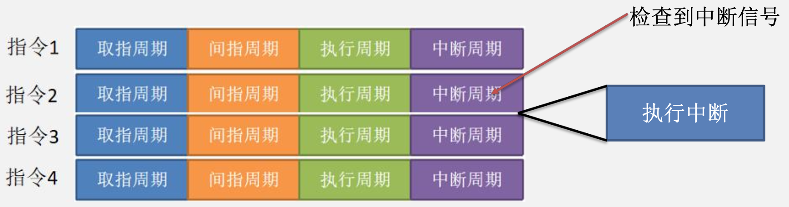

# IO

## IO接口（设备控制器）

&emsp;&emsp;&ensp;由于 ${CPU}$、内存等计算机主机部件都属于高速元器件，而大多数的外设属于低速设备。${CPU}$，主存和外设之间在技术特性上有很大的差异，所以需要有**各自的时钟和独立的时序控制**，两者之间大多数情况采用**异步工作方式**。
&emsp;&emsp;&ensp;**${I/O}$ 接口**，又名**设备控制器**，是连接外设和 ${CPU}$ 的一个“中间件”，${CPU}$ 将数据传送给在这个中间件，中间件再将数据给到外设，因此它在外设侧和主机侧各有一个接口。通常把它在主机侧的接口称为**内部接口**，在外设侧的接口称为**外部接口**。内部接口和内存、${CPU}$ 相连，而外部接口则通过各种 ${I/O}$ 接口电缆（如 ${USB}$ 线、网线）将其连到外设上。

<div style=" margin: 0 auto; max-width: 40%;">

</div>

&emsp;&emsp;&ensp;**数据缓冲寄存器**：用于保存 ${CPU}$ 发来的数据和外设提供的数据。
&emsp;&emsp;&ensp;**状态/控制寄存器**：用于保存 ${CPU}$ 控制设备的控制指令（命令字）和设备反馈给 ${CPU}$ 的状态信息。
&emsp;&emsp;&ensp;**地址译码和 ${I/O}$ 控制**：用于对要访问的 ${I/O}$ 寄存器号进行译码，并对控制字译码生成控制信号。
&emsp;&emsp;&ensp;**控制线**：用于传输比如读/写这种控制信号。

<div style=" margin: 0 auto; max-width: 70%;">

</div>

&emsp;&emsp;&ensp;以 ${CPU}$ 对打印机执行开机举例：

1. ${CPU}$ 向打印机发送**“开机”控制指令**，控制指令（命令字）通过**数据线**送到 ${I/O}$ 接口的**控制/状态寄存器**。
2. 地址译码和 ${I/O}$ 控制对**控制/状态寄存器中的命令字进行译码**，并将译码得到的**控制信号通过外设界面控制逻辑送外设**。
3. 打印机设备收到信号后，执行开机操作。开机后将**设备状态**送到控制/状态寄存器。
4. 控制/状态寄存器的状态信息通过**数据线**送到 ${CPU}$。

### IO端口

&emsp;&emsp;&ensp;${I/O}$ 端口实际上就是 ${I/O}$ 接口中的**寄存器**，例如，数据缓存寄存器就是**数据端口**，控制/状态寄存器就是**控制/状态端口**。为了便于 ${CPU}$ 对 ${I/O}$ 设备的快速选择和对 ${I/O}$ 端口的方便寻址，必须给所有 ${I/O}$ 接口中各个可访问的寄存器进行编址，有**独立编址**和**统一编址**两种方式。

#### 统一编址

&emsp;&emsp;&ensp;${I/O}$ 地址空间与主存地址空间统一编址，即**主存地址空间分出一部分地址给 ${I/O}$ 端口进行编号**，因为 ${I/O}$ 端口和主存单元在同一个地址空间的不同分段中，根据地址范围就可区分访问的是 ${I/O}$ 端口还是主存单元，因而**无须设置专门的 ${I/O}$ 指令**，只要用 ${Load/Store}$ 指令就可以存取 ${I/O}$ 端口。
&emsp;&emsp;&ensp;统一编址下，任何对内存存取的指令都可用来访问位于主存地址空间中的 ${I/O}$ 端口，并且**所有有关主存的寻址方式**都可用于 ${I/O}$ 端口的寻址。例如，可用访存指令实现 ${CPU}$ 寄存器和 ${I/O}$ 端口的数据传送。

<div style=" margin: 0 auto; max-width: 70%;">

</div>

#### 独立编址方式

&emsp;&emsp;&ensp;对所有的 ${I/O}$ 端口单独进行编号，使它们成为一个独立的 ${I/O}$ 地址空间。指令系统中需要**有专门的输入输出指令**来访问 ${I/O}$ 端口，指令中地址码部分给出 ${I/O}$ 端口号。 独立编址方式中的 ${I/O}$ 地址空间和主存地址空间是**两个独立的地址空间**，无法从地址码的形式上区分，需用专门的 ${I/O}$ 指令来表明访问的是 ${I/O}$ 地址空间。比如 ${X86}$ 体系用 ${In}$ 和 ${OUT}$ 指令控制数据发送给 ${I/O}$ 接口和从 ${I/O}$ 接口接收数据。

<div style=" margin: 0 auto; max-width: 70%;">

</div>

#### 编址方式

<div style=" margin: 0 auto; max-width: 60%;">

</div>

## 程序查询方式

### 独占式查询

&emsp;&emsp;&ensp;程序查询方式也称为异步传送方式。信息交换的控制**完全由 ${CPU}$ 执行程序实现**，程序查询方式在 ${I/O}$ 接口中设置一个数据缓冲寄存器（数据端口）和一个设备状态寄存器（状态端口）。主机进行 ${I/O}$ 操作时，先发出询问信号，读取设备的状态并根据设备状态决定下一步操作究竟是进行数据传送还是等待。
&emsp;&emsp;&ensp;以 ${CPU}$ 让打印机开机为例：
1. ${CPU}$ 执行初始化程序并预制参数 ${CPU}$ 将相应的外设开机命令字给到 ${I/O}$ 接口，${I/O}$ 接口收到，译码后给外设发送信号，外设开机。

<div style=" margin: 0 auto; max-width: 70%;">

</div>

&emsp;&emsp;&ensp;发送启动命令给 ${I/O}$ 接口后 ${I/O}$ 接口将命令字译码并将启动信号给到打印机。

2. ${CPU}$ 不断地查询 ${I/O}$ 接口中是否给出了 ${ready}$ 信号，${CPU}$ 执行一个 ${while}$ 循环。

```cpp
while(1){
    While(信号 == ready){
        退出循环
    }
}
```

&emsp;&emsp;&ensp;程序查询方式由软件（也就是编写的程序）执行数据传送。

3. ${CPU}$ 向 ${I/O}$ 接口发送命令字-启动后，${I/O}$ 接口将该命令字译码后生成信号给到外设，外设成功启动后会将 ${ready}$ 信号给到 ${I/O}$ 接口，${CPU}$ 通过 ${while}$ 循环查询 ${I/O}$ 接口的状态直到收到 ${ready}$ 信号，跳出循环。

&emsp;&emsp;&ensp;缺点：${CPU}$ 要**不断的查询外设**是否给出 ${ready}$ 信号，**在查询信号期间，${CPU}$ 无法执行其他工作**。直到外设将 ${ready}$ 信号给到 ${I/O}$ 接口，${I/O}$ 接口将信号给到 ${CPU}$ 才能跳出循环。
&emsp;&emsp;&ensp;根据查询 ${I/O}$ 接口的方式的不同，程序查询方式有两种：**定时查询**和**独占查询**。

### 定时查询

&emsp;&emsp;&ensp;定时查询：相比于独占查询方式需要一直查询 ${I/O}$ 接口了解设备状态，定时查询方式**每隔一段时间**来查询一次 ${I/O}$ 接口，了解设备状态。

## 中断控制方式

&emsp;&emsp;&ensp;在程序查询 ${I/O}$ 方式中,由于 ${CPU}$ 和外设采用串行工作方式，**使处理器时间花在等待慢速的外设上**。比如独占查询方式需要一直等待外设，定时查询也需要抽出一定时间来检查外设状态。为避免 ${CPU}$ 长时间等待外设，提出了**中断控制方式**。
&emsp;&emsp;&ensp;中断控制方式的思想是，${CPU}$ 在执行程序编译的指令时，统一的在每个指令的**中断周期**，检查是否有设备产生中断信号。若有，则暂停执行下一条指令，转而去处理中断。若无，则继续执行源程序。

<div style=" margin: 0 auto; max-width: 70%;">

</div>

### 在什么时候响应中断

&emsp;&emsp;&ensp;比如此时正在执行程序

```cpp
for(int i=0; i<10; i++){
    ...
}
```

&emsp;&emsp;&ensp;所有的中断，**只能在指令的中断周期响应**。或许在指令的取指周期 ${CPU}$ 就收到了设备产生的中断信号，但必须在中断周期才会响应中断（**无论是否是可屏蔽中断**）。其中真题也出现一种说法，比如执行完指令后在响应中断。指的是在指令的执行周期后响应中断。

<div style=" margin: 0 auto; max-width: 70%;">

</div>

&emsp;&emsp;&ensp;以键盘传输字符 ${A}$ 为例：

1. 当你通过键盘给主机传递字符 ${A}$ 时，键盘外设先将字符 ${A}$ 放入 ${I/O}$ 接口的**数据缓冲寄存器**。
2. ${I/O}$ 接口收到数据后，将中断信号给到 ${CPU}$。
3. ${CPU}$ 在收到信号后，在当前指令的中断周期响应该中断。
4. 执行数据读入程序，将数据从连接键盘的 ${I/O}$ 接口中读入 ${CPU}$。**这个数据读入程序叫做中断服务程序**。
5. 过程完毕后执行返回操作。

&emsp;&emsp;&ensp;键盘在传输时，**每传输一个字符，就要发起一次中断**。相应的也要调用一次中断服务程序。

<div style=" margin: 0 auto; max-width: 40%;">

</div>

1) 记录各种中断请求信号：通常会保存在**中断请求寄存器**中。
2) 自动响应中断请求：${CPU}$ 在每条指令的中断周期，**会自动检测中断请求引脚**。${CPU}$ 通过**采样中断请求信号**来检测中断。发现有中断请求时，则根据情况决定是否响应和响应哪个中断请求。

### 如果同时收到多个中断信号时先响应谁

<div style=" margin: 0 auto; max-width: 40%;">

</div>

#### 硬件判优方法（向量中断法）

&emsp;&emsp;&ensp;需要借助**中断响应优先级**，先响应优先级最高的中断。中断响应优先级是**硬件决定**的，在 ${CPU}$ 出厂时就决定了。中断判优电路：在中断周期查询到有多个中断请求同时产生时，**能够判断出哪个中断的优先级高，优先级高的中断先被响应**。

1. 不可屏蔽中断>内部异常>可屏蔽中断；
2. 内部异常中，硬件故障>软件中断；
3. **${DMA}$ 中断请求优先于 ${I/O}$ 设备传送的中断请求**；
4. 在 ${I/O}$ 传送类中断请求中，高速设备优先于低速设备，输入设备优先于输出设备，实时设备优先于普通设备。

&emsp;&emsp;&ensp;根据**中断判优电路和编码器**等，得到当前所有未被屏蔽的中断请求中具有最高响应优先权的中断源类型（即中断源标识信息）。例如 ${IRQ1}$ 中的 ${1}$ 就是中断源标识信息，通过编码器输出的 ${i}$ 最终被送到 ${CPU}$ 中，**${CPU}$ 根据 ${i}$ 的值找到对应的中断服务程序的首地址存入 ${PC}$ 和初始状态存入 ${PSW}$**。

<div style=" margin: 0 auto; max-width: 40%;">

</div>

&emsp;&emsp;&ensp;不可屏蔽中断 ${NMI}$：
&emsp;&emsp;&ensp;通常是由硬件故障或其他严重错误引起的中断，无法被处理器屏蔽或禁用。
&emsp;&emsp;&ensp;处理器硬件故障：
&emsp;&emsp;&ensp;例如：芯片或电缆连接不良、电源波动、${CPU}$ 过热等情况。
&emsp;&emsp;&ensp;"中断响应周期"可以理解成可屏蔽外中断的专有术语，不可屏蔽中断和异常都有"响应过程"，但并不叫且也没有"中断响应周期"；中断响应周期：可屏蔽外中断发生后，CPU通过INTR向中断控制器发出查询信号，获取中断类型号的过程

<div style=" margin: 0 auto; max-width: 80%;">

</div>
<div style=" margin: 0 auto; max-width: 80%;">

</div>

&emsp;&emsp;&ensp;内部异常中的硬件故障：
&emsp;&emsp;&ensp;一台计算机系统中，内存模块出现了损坏或错误，例如内存单元的某些位被烧毁或者校验和不匹配等。当 ${CPU}$ 尝试从这个内存单元中读取数据时，就会出现异常，因为读取到的数据与期望的数据不匹配。这种情况可能会被识别为**内部异常**，因为 ${CPU}$ 无法正确执行指令，并将控制权转移到**异常处理程序**中。
&emsp;&emsp;&ensp;内部异常中软件中断：
&emsp;&emsp;&ensp;整数除零：${int\quad i = 0; int\quad a = 5 / i}$；当在执行 ${a = 5/i}$ 这条指令时，在指令的执行过程就发现了整数除零，**立刻进入异常处理程序**。

&emsp;&emsp;&ensp;中断的产生和执行大致如下：

<div style=" margin: 0 auto; max-width: 70%;">

</div>

&emsp;&emsp;&ensp;中断响应的条件有以下 ${3}$ 个：

1. ${CPU}$ 处于“开中断”状态。
2. 至少要有一个**未被屏蔽的中断请求**。
3. 当前指令刚执行完进入中断周期（对于非流水线处理器，此时 ${PC}$ 中存放的是下条指令的地址）。

&emsp;&emsp;&ensp;当处理器同时满足上述 ${3}$ 个条件时，就**可以响应中断**，进入中断响应周期。中断响应阶段由**硬件实现**，它是一种特殊的机器执行周期。在中断响应周期中通过执行一条**中断隐指令**完成以下几个操作。
&emsp;&emsp;&ensp;中断隐指令的功能：

1. **关中断**：将中断允许标志置为禁止（即“关中断”）状态，这时将**屏蔽掉所有可屏蔽中断请求**。
2. **保护断点**：将 ${CPU}$ 中的 ${PC}$ 和 ${PSW}$ 寄存器中数据保存。
3. **识别中断源并转中断服务程序**：通过某种方式，获得优先级最高的中断源所对应的中断服务程序的首地址和初始 ${PSW}$，并分别送 ${PC}$ 和 ${PSW}$ 寄存器。

<div style=" margin: 0 auto; max-width: 30%;">

</div>

#### 中断向量

&emsp;&emsp;&ensp;在向量中断方式下**通常把中断服务程序的首地址 ${PC}$ 和初始 ${PSW}$ 称为中断向量**，**中断向量就是中断服务程序的地址**。所有**中断向量存放在一个中断向量表中**，中断向量所在的地址称为中断向量地址。向量地址由 ${中断类型号* 4 + 中断向量表基地址}$ 得到。

<div style=" margin: 0 auto; max-width: 50%;">

</div>

#### 中断服务程序

<div style=" margin: 0 auto; max-width: 70%;">

</div>

#### 中断处理过程

<div style=" margin: 0 auto; max-width: 70%;">

</div>

### 当执行中断程序时，又收到优先级更高的中断要如何处理

#### 多重中断嵌套

&emsp;&emsp;&ensp;执行具体的中断程序时，在**处于开中断的前提下**，若有其他中断出现，则要根据中断屏蔽字来决定能屏蔽哪种中断，响应哪种中断。

#### 中断屏蔽字

&emsp;&emsp;&ensp;用于指出**在执行中断服务程序时**，在中断周期查询到多个中断信号时，是响应其中一个中断还是不响应中断继续执行。

<div style=" margin: 0 auto; max-width: 50%;">

</div>

&emsp;&emsp;&ensp;根据该中断屏蔽字，上述中断的中断处理优先级为 ${1>2>3>4}$。如果在执行 ${2}$ 号中断源的中断服务程序时，出现 ${1}$ 号中断，则在指令的中断周期响应中断。若发现是 ${3}$ 号中断源，则不响应中断，继续执行。

##### 高处理低响应会不会将高响应低处理抢占的问题

&emsp;&emsp;&ensp;如果执行高响应低处理的中断程序时，有高处理低响应的中断请求时候，是会将其中断的。中断控制器里的中断请求寄存器里，存储的中断请求信号，直到这个中断处理完之后，才会被清除置为零，不然就会一直 ${trigger}$，但是**因为他的屏蔽字会屏蔽它本身的这种中断信号**，所以中断判优的时候不用考虑正在处理的中断请求。所以当高处理低响应的进入时候，是不会和正在处理的中断请求进行中断判优的。所以能够直接将高响应低处理的中断处理过程给中断。

<div style=" margin: 0 auto; max-width: 60%;">

</div>

## 异常和中断

### 内部异常

&emsp;&emsp;&ensp;内部异常：是指由 ${CPU}$ 内部异常引起的意外事件。根据其发生的原因又分为**硬故障中断**和**程序性异常**。
&emsp;&emsp;&ensp;硬故障中断（比如存储器出现问题）：是由硬连线路出现异常引起的，如**电源掉电、存储器线路错**等;
&emsp;&emsp;&ensp;程序性异常（**由当前正在执行的程序引起**）：也称**软中断**，是由 ${CPU}$ 执行某个指令而引起的发生在 ${CPU}$ 内部的异常事件。如整除 ${0}$、溢出、缺页、地址越界等。按发生异常的报告方式和返回方式的不同，**内部异常可分为故障、自陷和终止三类**。
&emsp;&emsp;&ensp;程序性异常一般出现在指令的取值周期，间址周期，执行周期。并在**出现时就响应，不用等到中断周期**。
&emsp;&emsp;&ensp;中断一般**由外设或内部的时钟产生**，中断或许出现在取值周期，间址周期，执行周期，但**必须在中断周期响应**。

### 程序性异常

1) 故障：是在**引起故障的指令启动后、执行结束前被检测到的一类异常事件**。例如：指令译码时，出现“非法操作码”；取指令或数据时，发生缺页；执行整数除法指令时发现“除数为 ${0}$”等。“缺页”等这类异常处理后，已将需要的页面从磁盘调到主存，可**继续回到发生故障的指令继续执行**。对于“非法操作码”、“保护错”、“除数为0”等，因为无法通过异常处理程序恢复故障，因此**必须终止程序的执行**。
2) 自陷：与故障等其他意外发生的异常事件不同，是**预先安排的一种“异常”事件**。首先通过某种方式将 ${CPU}$ 设定为处于某个特定状态，在程序执行过程中，一旦某条指令的执行发生了相应状态所满足的条件，则 ${CPU}$ 调出特定的程序进行相应的处理。如操作系统中的**系统调用指令**。事先在程序中用一条特殊指令或设定特殊控制标志，当执行到被设置了“陷阱”的指令时，${CPU}$ 在执行完自陷指令后**自动根据不同“陷阱"类型进行相应的处理**，然后**返回到自陷指令的下一条指令执行**。当自陷指令是**转移指令**时并不能返回到下一条指令执行，而是**返回到转移目标指令**执行。
3) 终止：如果在执行指令过程中发生了**使机器无法继续执行的硬件故障**，如电源掉电、线路故障等，则程序将无法继续执行只好终止。此时，**调出中断服务程序来重启系统**。这种异常与故障和自陷不同，不是由特定指令产生的，而是 随机发生的。

### 异常与中断的关系

1. “缺页”或“溢出”等异常事件是**由特定指令在执行过程中产生的**，发生在指令的取指周期，间址周期以及执行周期。而**中断相对于指令的执行则是异步的**。**中断不和任何指令相关联，也不阻止任何指令的完成**，而是在执行周期结束后的中断周期，${CPU}$ 查询是否有中断信号。
2. 异常的发生和异常事件的类型是**由 ${CPU}$ 自身发现和识别**，不必通过外部的某个信号通知 ${CPU}$。比如当指令的执行周期发现溢出，由专门的电路进行判断。而对于中断，${CPU}$ 必须通过**对外部中断请求线进行采样**，并从总线上获取相应的中断源设备的标识信息，才能获知哪个设备发生了何种中断。

### 内中断和外中断

&emsp;&emsp;&ensp;${Intel\quad 8086/8088}$ 微处理器**不区分异常和中断，把两者统称为中断**。
1. 由 ${CPU}$ 内部产生的异常称为**内中断**，**内中断皆为不可屏蔽中断**。
2. 通过中断请求线 ${INTR}$ 和 ${NMI}$ 从 ${CPU}$ 外部发出的中断请求为**外中断**。
3. 通过 ${INTR}$ 信号线发出的外中断是**可屏蔽中断**，而通过 ${NMI}$ 信号发出的是**不可屏蔽中断**。

&emsp;&emsp;&ensp;不可屏蔽中断的处理优先级最高，任何时候（不管是否开中断）只要发生不可屏蔽中断都要**中止现行程序的执行**（但是仍然需要等到当前指令执行到中断周期），转到不可屏蔽中断处理程序执行。

## DMA控制方式

&emsp;&emsp;&ensp;该输入输出方式用专门的 ${DMA}$ 接口硬件来**控制外设与主存间的直接数据交换**，数据不通过 ${CPU}$，直接从主存经过 ${DMA}$ 控制器传给外设。专门用来控制总线进行 ${DMA}$ 传送的接口硬件称为 ${DMA}$ 控制器。
&emsp;&emsp;&ensp;在进行 ${DMA}$ 传送时 ${CPU}$ 让出存储器总线控制权，由 ${DMA}$ 控制器控制存储器总线**通过“挪用”一个主存周期完成主存和 ${DMA}$ 控制器之间的一次数据交换**，或**独占若干个主存周期完成一批数据的交换**。${DMA}$ 方式主要用于磁盘等高速设备的数据传送。这类高速设备的记录方式多采用**数据块**组织方式。

<div style=" margin: 0 auto; max-width: 50%;">

</div>

### DMA接口（DMA控制器）

&emsp;&emsp;&ensp;数据缓冲寄存器：用于保存主存或磁盘发来的数据。
&emsp;&emsp;&ensp;状态/控制寄存器：用于保存 ${CPU}$ 控制 ${DMA}$ 的控制字（比如启动 ${DMA}$）和设备反馈给 ${CPU}$ 的状态信息（比如 ${DMA}$ 完成）。
&emsp;&emsp;&ensp;主存地址寄存器：用于保存**主存地址**。
&emsp;&emsp;&ensp;传送长度计数器：用于保存**传输的字节数**。
&emsp;&emsp;&ensp;比如 ${CPU}$ 想要将主存地址 ${00H}$ 开始的 ${24}$ 字节数据传输到磁盘中，则 ${CPU}$ 将 ${00H}$ 存入 ${DMA}$ 接口的主存地址寄存器，${24}$ 存入 ${DMA}$ 接口的传送长度计数器。

<div style=" margin: 0 auto; max-width: 70%;">

</div>

### 三种DMA方式

&emsp;&emsp;&ensp;由于 ${DMA}$ 控制器和 ${CPU}$ 共享主存，所以可能出现两者都想要读主存的现象。为使两者协调使用主存，${DMA}$ 通常采用以下 ${3}$ 种方式之一进行数据传送。

1) **${CPU}$ 停止法**。${DMA}$ 传输时由 ${DMA}$ 控制器发一个停止信号给 ${CPU}$，使 ${CPU}$ 脱离总线停止访问主存，直到 ${DMA}$ **传送一块数据结束**。
2) **周期挪用法**。**${DMA}$ 传输时 ${CPU}$ 让出一个总线事务周期，由 ${DMA}$ 控制器挪用一个主存周期来访问主存，传送完一个数据后立即释放总线，是一种单字传送方式。**
3) **交替分时访问法**。每个存储周期分成两个时间片，一个给 ${CPU}$ 另一个给 ${DMA}$ 控制器。这样在每个存储周期内，${CPU}$ 和 ${DMA}$ 控制器都可访问存储器。

### DMA操作步骤

&emsp;&emsp;&ensp;以将主存中的数据通过 ${DMA}$ 控制器存入磁盘为例。
&emsp;&emsp;&ensp;第一步：${DMA}$ 控制器的初始化。
&emsp;&emsp;&ensp;在进行数据传送之前，${CPU}$ 先执行一段程序，用来对 ${DMA}$ 控制器中各参数寄存器的初始值的设定。主要操作包括以下 ${3}$ 个方面。

1) 准备内存区：先在内存准备好要传输给磁盘的数据。
2) 设置传送参数：对 ${DMA}$ 控制器设置各种参数。例如：
${内存首址→地址寄存器}$
${字计数值→字计数器}$
${传送方向→控制寄存器}$
3) 发送“启动 ${DMA}$ 传送”命令，然后 ${CPU}$ 执行其他程序。

<div style=" margin: 0 auto; max-width: 40%;">

</div>

&emsp;&emsp;&ensp;第二步：${DMA}$ 数据传送（${DMA}$ 传送）。
&emsp;&emsp;&ensp;${CPU}$ 对 ${DMA}$ 发送“启动 ${DMA}$ 传送”命令后，就把数据传送的工作交给了 ${DMA}$ 控制器。**在整个 ${DMA}$ 传送过程中，不再需要 ${CPU}$ 的参与，完全由 ${DMA}$ 控制器实现数据的传送。所以 ${DMA}$ 的数据传输是硬件控制。**
&emsp;&emsp;&ensp;${DMA}$ 控制器给出内存地址，并在其读/写线上发出“读”命令。主存在收到地址后，在数据总线上给出数据，存入 ${DMA}$ 接口的数据缓冲寄存器中。${DMA}$ 控制器每完成一个数据的传送，就将字计数值减1，并修改主存地址。当字计数器为 ${0}$ 时，完成所有数据传输操作。

<div style=" margin: 0 auto; max-width: 90%;">

</div>

&emsp;&emsp;&ensp;第三步：${DMA}$ 结束处理（后处理）。
&emsp;&emsp;&ensp;当字计数器为 ${0}$ 则发出“${DMA}$ 结束”中断请求信号给 ${CPU}$，转入中断服务程序，做数据校验等后处理工作。
&emsp;&emsp;&ensp;${DMA}$ 方式与程序查询和中断方式不同，${CPU}$ 不直接执行输入输出指令来实现数据传送而只是进行一些辅助工作，**包括传送参数的设置、发送“启动 ${DMA}$ 传送”命令和最后的数据校验等**。
&emsp;&emsp;&ensp;${DMA}$ 方式下，${CPU}$ 只要在最初的 ${DMA}$ 控制器初始化和最后处理“${DMA}$ 结束”中断时介入，而在整个一块数据传送过程中都不需要 ${CPU}$ 参与。

<div style=" margin: 0 auto; max-width: 60%;">

</div>

&emsp;&emsp;&ensp;${DMA}$ 总结：
1. ${DMA}$ 的初始化阶段由 ${CPU}$ 执行相应的处理程序，给 ${DMA}$ 控制器赋初始值。
2. ${DMA}$ 数据传送部分完全由 ${DMA}$ 控制器控制，所以是硬件控制数据传输。
3. ${DMA}$ 后处理属于中断控制，整个 ${DMA}$ 方式只有数据传输完成后，由 ${DMA}$ 控制器向 ${CPU}$ 发出中断信号，${CPU}$ 执行 ${DMA}$ 后处理的中断服务程序。

### DMA与中断的区别

<div style=" margin: 0 auto; max-width: 70%;">

</div>
