# 存储器

## 存储器基本知识

### 计算机中的存储器

&emsp;&emsp;&ensp;存储器（不包含磁盘存储器）主要有两种半导体材料构成。分别是 ${ROM}$ 只读半导体存储器和 ${RAM}$ 随机存取半导体存储器。两种半导体存储器在**硬件上**的**主要性质区分**如下表：

<div style=" margin: 0 auto; max-width: 80%;">
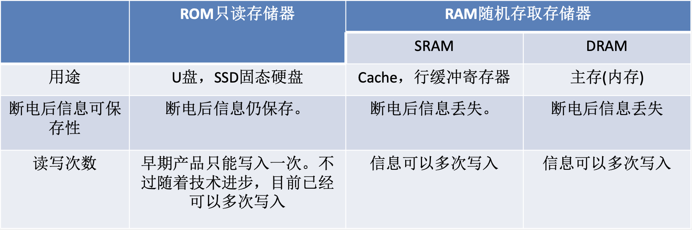
</div>

#### 片内存储器（寄存器）

&emsp;&emsp;&ensp;高速缓存的特点：
1. 位置：主要位于芯片内部；
2. 速度：读写速度非常快。

<div style=" margin: 0 auto; max-width: 60%;">
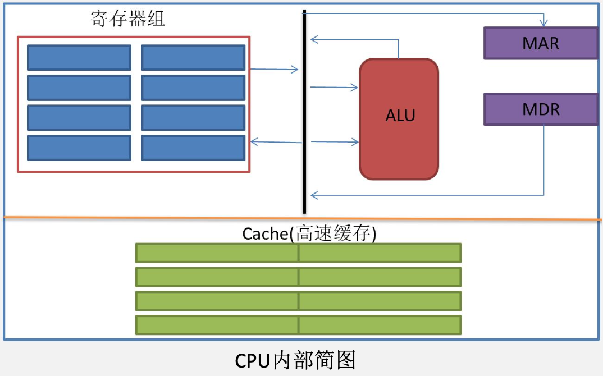
</div>

#### 主存储器
&emsp;&emsp;&ensp;主存储器（内存）与 ${CPU}$ 之间的连接方式如下：

<div style=" margin: 0 auto; max-width: 90%;">

</div>

#### 外存储器（选择重点考点，需记忆）

&emsp;&emsp;&ensp;外部存储器，简称**外存**。日常生活中的磁盘、${U}$ 盘、固态硬盘都是是外存。外存分为两类：

1. ${ROM}$ 类外存储器：
   1. 传统 ${ROM}$
      1. 是一种只能读出事先所存的数据的固态半导体存储器。传统 ${ROM}$ 中所存数据稳定，一旦存储数据就再也无法将之改变或者删除，断电后所存数据也不会消失。
      2. 优点：数据存储后就不会消失。
      3. 缺点：
         1. 数据只能在出厂时写入，终生只能写一次，且无法更改；
         2. 无法存储程序，只能保存常量。
   2. 可编程只读存储器（${PROM}$）
      1. 允许使用称为 ${PROM}$ 编程器的硬件将数据写入设备中。在 ${PROM}$ 被编程后，它就只能专用那些数据，并且不能被再编程这种记忆体用作永久存放程序之用。
      2. 改进：相比于 ${ROM}$，**在 ${PROM}$ 中不止可以保存常量，还可以保存程序**。
      3. 优点：数据存储后就不会消失，可存储程序。
      4. 缺点：数据只能在出厂时写入，终生只能写一次，且无法更改。
      5. **由于 ${PROM}$ 可以保存程序的特性，在1980年左右，计算机中的启动程序保存在 ${PROM}$ 中，由 ${PROM}$ 和 ${DRAM}$ 共同构成主存。**
   3. 可擦除可编程只读存储器（${EPROM}$）
      1. 紫外线擦除可编程只读存储器（${EPROM}$）能用紫外线擦除原有信息，可以重新写入新信息。
      2. 改进：相比于 ${PROM}$ 只能写入一次，**在 ${EPROM}$ 中可以多次擦写**。
      3. 优点：数据存储后就不会消失，可存入程序，可以多次擦写。
      4. 缺点：虽然可多次擦写，**但每次擦写前要删除其中的全部数据，再重新进行写入**。
   4. 电可擦除可编程只读存储器（${EEPROM}$）
      1. 能用紫外线按字节的擦除原有信息，可以按字节重新写入新信息。
      2. 改进：相比于 ${EPROM}$ 每次擦除要擦除全部数据，**在 ${EEPROM}$ 中可以多次擦除掉你想删除的字节，并多次写入你想写入的字节**。
      3. 优点：数据存储后就不会消失，可存入程序，可以按照需要的字节多次擦写。
      4. 缺点：**虽然可按照字节多次擦写，但读写速度非常慢，且容量小**。
   5. ${USB\quad Flash}$ 存储器（${FLASH\quad EEPROM}$）又称闪存
      1. 是 ${EEPROM}$ 的一种。它结合了 ${ROM}$ 和 ${RAM}$ 的长处。不仅具备电子可擦除可编辑（${EEPROM}$）的性能，还不会断电丢失数据同时可以快速读取数据。它于 ${EEPROM}$ 的最大区别是，${Flash}$ 按扇区（${block}$）操作，而 ${EEPROM}$ 按照字节操作。
      2. 改进：相比于 ${EEPROM}$ 按照字节擦写的慢速，**在 ${Flash}$ 中按照扇区进行擦写**。
      3. 优点：数据存储后就不会消失，可存入程序，**每次擦写一个扇区，读写速度都有了很大提升**。
      4. 缺点：虽然读写速度都有所提升，**但是写的速度还是远小于读的速度**。
   6. ${SSD}$ 固态硬盘
      1. 在 ${Flash}$ 存储器上增加容量和存取速度，并提升了写入速度，使得读写速度基本能保持一致。
      2. 改进：相比于 ${Flash}$ 存储器写入速度远小于读出速度，提升了写入速度，增大了容量。
      3. 优点：数据存储后就不会消失，可存入程序，每次擦写一个扇区，容量进一步提升，并且写的速度有了明显改善。
2. 机械硬盘/磁盘

### 存储器的存取方式（选择重点考点，需记忆）

#### 随机存取方式
&emsp;&emsp;&ensp;特点是按地址访问存储单元，因为每个地址译码时间相同，所以在不考虑芯片内部缓冲的前提下，**每个单元的访问时间是一个常数**，与地址无关，其排列形式类似与数组。
&emsp;&emsp;&ensp;**片内寄存器，主存储器，ROM只读存储器均采用的是随机存取方式**。

<div style=" margin: 0 auto; max-width: 40%;">
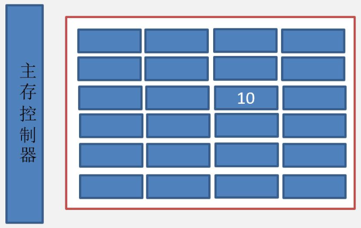
</div>

&emsp;&emsp;&ensp;比如若想读取主存中的10号存储单元，主存控制器会将10号存储单元的位置编码为第2行，第2列，然后读取对应位置的数据。

#### 顺序存取方式

&emsp;&emsp;&ensp;特点是信息按顺序存放和读出，其**存取时间取决于信息存放位置**，以**记录块为单位编址**。磁带存储器就是采用**顺序存取**方式。其排列形式类似于链表，其访问时间与其存放的位置有关。

#### 直接存取方式

&emsp;&emsp;&ensp;特点是**存取方式兼有随机访问和顺序访问的特点**。首先可直接**选取所需信息所在区域**，然后**按顺序方式存取**。磁盘存储器（机械硬盘）就是采用直接存取方式。

## SRAM和DRAM的区别

&emsp;&emsp;&ensp;408中涉及到的五种 ${CPU}$ 与内存体系结构：
1. 单片 ${CPU}$+单片 ${DRAM}$ 芯片
2. 单片 ${CPU}$+多片 ${DRAM}$ 芯片组成的内存条
3. 单片 ${CPU}$+多片内存条
4. 单片 ${CPU}$+${cache}$+单片 ${DRAM}$ 芯片
5. 单片 ${CPU}$+${cache}$+多片 ${DRAM}$ 芯片组成的内存条

### 基本存储元件
&emsp;&emsp;&ensp;基本存储元件：**用来存储 ${1bit}$ 二进制信息**，是组成存储器的最基本部分。下面介绍两种分别用于 ${SRAM}$ 半导体存储器和 ${DRAM}$ 半导体存储器的存储元件。

<div style=" margin: 0 auto; max-width: 30%;">
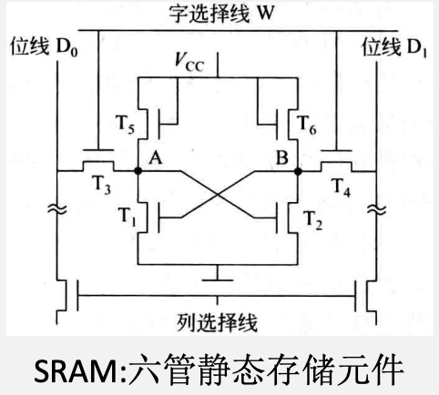
</div>

&emsp;&emsp;&ensp;六管静态存储元件（${SRAM}$）需要永久处于带电状态，一旦断电后，数据立刻丢失。

<div style=" margin: 0 auto; max-width: 30%;">
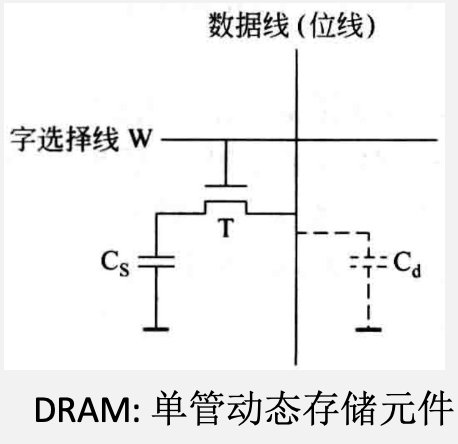
</div>

&emsp;&emsp;&ensp;单管动态存储元件（${DRAM}$）采用充电的模式，每相隔一段时间（大多数题目为 ${2ms}$）需要对元件充一次电，若未及时充电则数据会丢失。

<div style=" margin: 0 auto; max-width: 90%;">
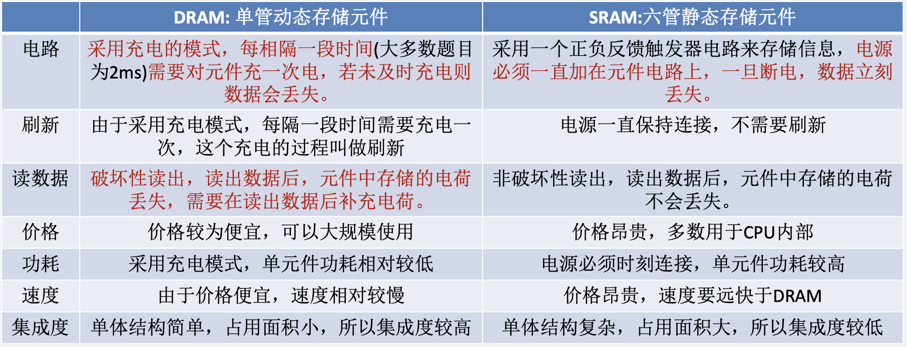
</div>

### 存储体、存储单元、存储元件

&emsp;&emsp;&ensp;现代计算机中，一个存储器往往由多个存储体构成，存储体由许多存储单元组成。在 ${408}$ 中，一片 ${DRAM}$ 芯片指的就是一个存储体。每个存储单元又包含若干个存储元件（或称存储基元、存储元），每个存储元件能寄存一位二进制代码“0”或“1”。若元件中带1电荷，则表示1，无电荷则表示0。

<div style=" margin: 0 auto; max-width: 90%;">
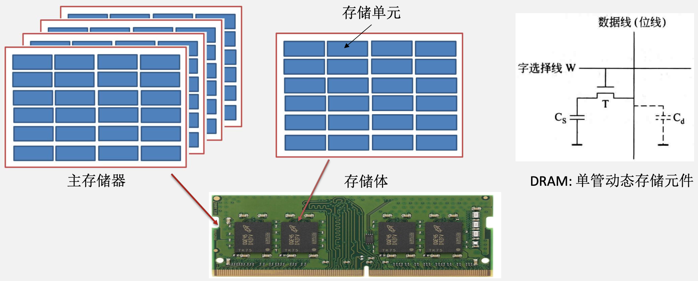
</div>

&emsp;&emsp;&ensp;一个存储单元可存储一串二进制代码，称这串二进制代码为一个存储字，这串二进制代码的个数称为存储字长。**存储字长**可以是8位、16位或32位等，多数情况为8位。
&emsp;&emsp;&ensp;${MAR}$ 用来存放访问的存储单元的地址，其位数对应存储单元的个数。
&emsp;&emsp;&ensp;${MDR}$ 用来存放从存储体某单元取出的代码或者准备往某存储单元存入的代码。（唐书17页）

### DRAM的性质（重点）

&emsp;&emsp;&ensp;存储周期：指**存储器进行一次读写操作**所需要的全部时间，是**存储器进行连续读写操作所允许的最短间隔时间**。它等于访问时间加上下一次存取开始前所要求的附加时间。
&emsp;&emsp;&ensp;读出时间：从存储器接到读命令开始到信息被送到数据线上所用的时间。
&emsp;&emsp;&ensp;存储周期内的步骤：
1. 当主存控制器收到来自 ${CPU}$ 的地址信息后，对地址信息进行译码，定位到某个存储单元。
2. 存储单元中，若保存1则代表携带一个电荷，若为0则无电荷，将该存储单元中的数据读出，同时存储单元中的电荷会全部释放，全部变成0电荷。
3. 电荷经过读出放大器将电压放大后，输送给 ${CPU}$。
4. 由于原存储单元中的数据读出，电荷归零，所以需要重新对存储单元补充电荷，让其数据与读出前保持一致。 这个过程叫做**数据再生**。
5. 再生电路和放大电路每次启动需要恢复一段时间后才能再次启动。
&emsp;&emsp;&ensp;上述步骤中，步骤1-步骤5的总时间，称为一个**存储周期**${TM}$，而步骤1-步骤3的总时间叫做**读出时间**${TR}$。
&emsp;&emsp;&ensp;${DRAM}$ 刷新：由于 ${DRAM}$ 采用充电方式，存储的电荷超过一定时间就会丢失。因此必须定时给 ${DRAM}$ 电容充电，这一过程称为刷新。刷新是 ${DRAM}$ **硬件自动执行**（下小节重点）。
&emsp;&emsp;&ensp;举例：以 ${8行\times 2列\times 4bit}$ 的存储体为例，动态介绍下1个存储周期内的各个步骤：
1. 当主存控制器收到来自 ${CPU}$ 的地址信息后，对地址信息进行译码，定位到某个存储单元。

<div style=" margin: 0 auto; max-width: 70%;">
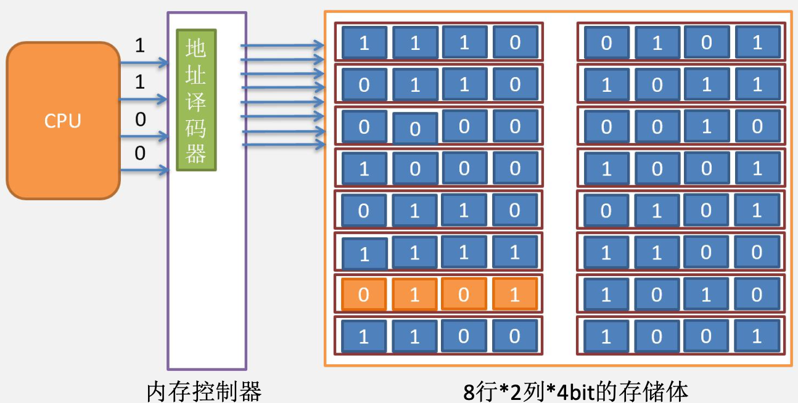
</div>

2. 存储单元中，若保存1则代表携带一个电荷，若为0则无电荷，将该存储单元中的数据读出，同时存储单元中的电荷全部变成0电荷。

<div style=" margin: 0 auto; max-width: 70%;">
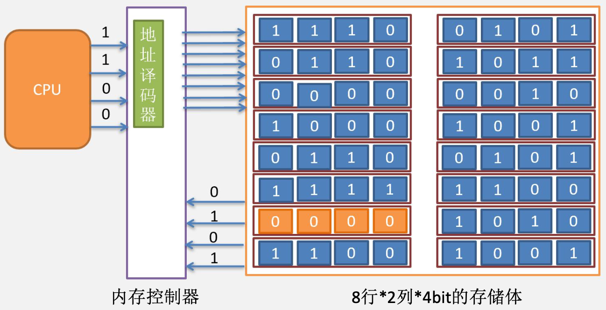
</div>

3. 电荷经过读出放大器将电压放大后，输送给CPU。
4. 由于原存储单元中的数据读出，电荷归零，所以需要重新对存储单元补充电荷，让其数据与读出前保持一致。这个过程叫做数据再生。

<div style=" margin: 0 auto; max-width: 70%;">
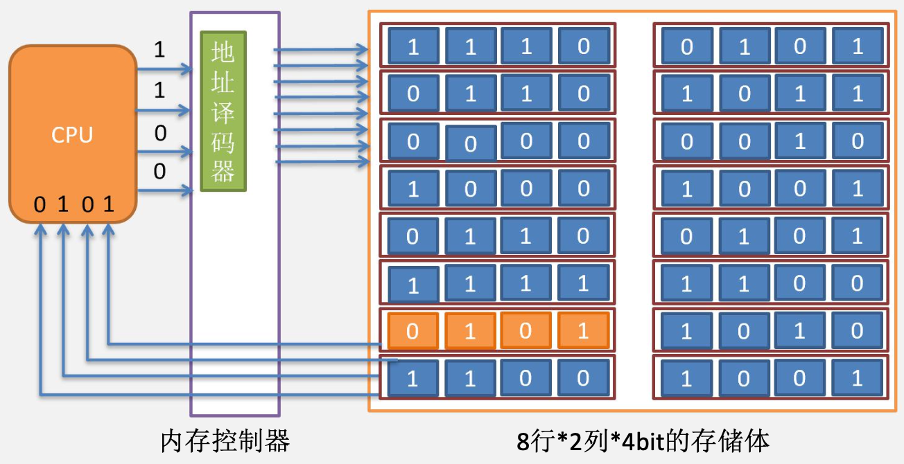
</div>

## DRAM主存的内部结构（重点）

&emsp;&emsp;&ensp;${DRAM}$ 芯片根据地址信息，发送数据的过程：
1. ${CPU}$ 将地址给到内存控制器中。
2. 内存控制器得到 ${CPU}$ 的地址后，将地址拆分为行地址和列地址。
3. 内存控制器第一次将行地址给到 ${DRAM}$，将这一行数据**读到行缓冲寄存器中**。
4. 内存控制器第二次将列地址给到 ${DRAM}$ 的行缓冲寄存器，从行缓冲寄存器中读出数据。
&emsp;&emsp;&ensp;由于行列地址分两次给出，所以 ${DRAM}$ 可以做到**地址引脚减半**。

<div style=" margin: 0 auto; max-width: 70%;">
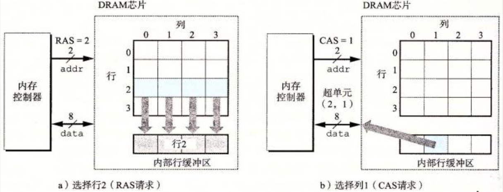
</div>

### 内存控制器的内部结构（重点）

&emsp;&emsp;&ensp;${DRAM}$ 芯片构成的内存，最初由 ${CPU}$ 直接控制。但随着内存技术的发展，${CPU}$ 已经无法直接控制内存。此时由内存控制器负责控制内存。
&emsp;&emsp;&ensp;内存控制器负责：
1. 从地址线接受地址信息
2. 根据地址信息找到对应存储单元
3. 刷新控制
4. 数据送往CPU

&emsp;&emsp;&ensp;以地址0101为例，${DRAM}$ 芯片读出一个存储单元内容的步骤：
1. 内存控制器将 ${CPU}$ 发送在地址线中的地址，保存到内存控制器中的地址寄存器中。

<div style=" margin: 0 auto; max-width: 70%;">
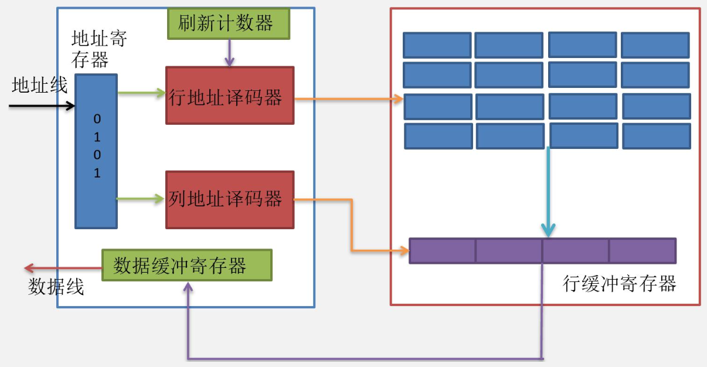
</div>

2. 内存控制器得到 ${CPU}$ 的地址（0101）后，将地址拆分为行地址和列地址，并保存在行地址译码器和列地址译码器。

<div style=" margin: 0 auto; max-width: 70%;">
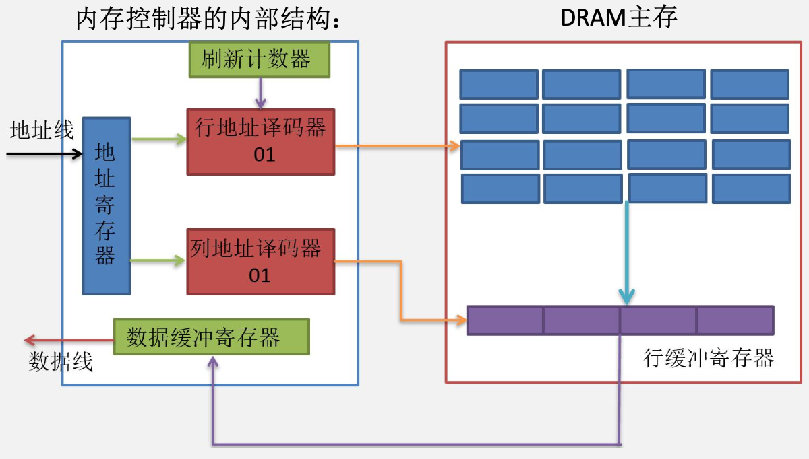
</div>

3. 内存控制器第一次将行地址给到 ${DRAM}$，将这一行数据读到行缓冲寄存器中。

<div style=" margin: 0 auto; max-width: 70%;">
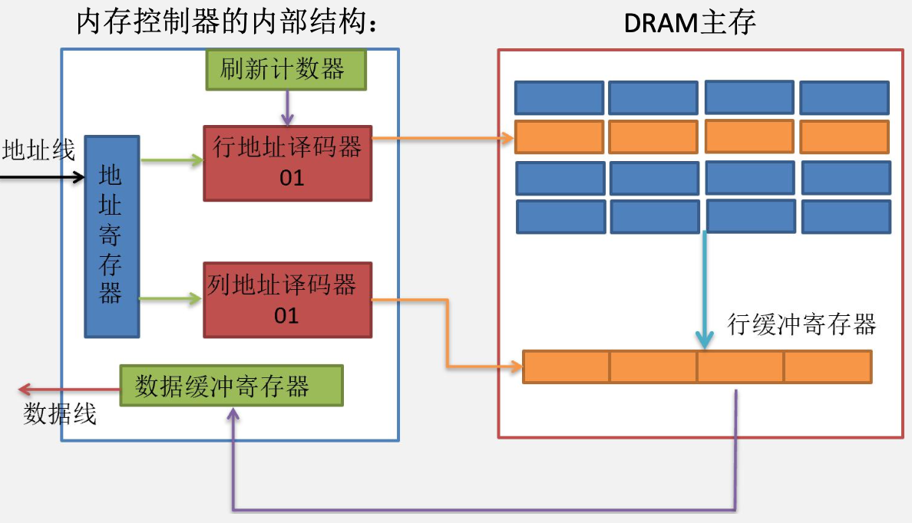
</div>

4. 内存控制器第二次将列地址给到 ${DRAM}$ 的行缓冲寄存器，从行缓冲寄存器中读出数据。

<div style=" margin: 0 auto; max-width: 70%;">
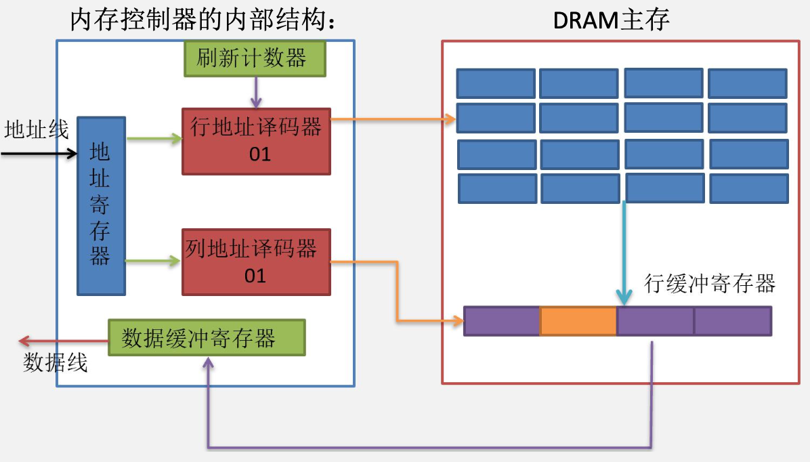
</div>

### 内存控制器中的控制信号
&emsp;&emsp;&ensp;行地址译码器和列地址译码器在收到控制信号后才会将其中的地址信息给到 ${DRAM}$ 芯片。行地址译码器在收到 ${RAS}$ 信号后，给出行地址到 ${DRAM}$ 芯片确定某一行。列地址译码器在收到 ${CAS}$ 信号后，将列地址给到行缓冲寄存器。

<div style=" margin: 0 auto; max-width: 70%;">
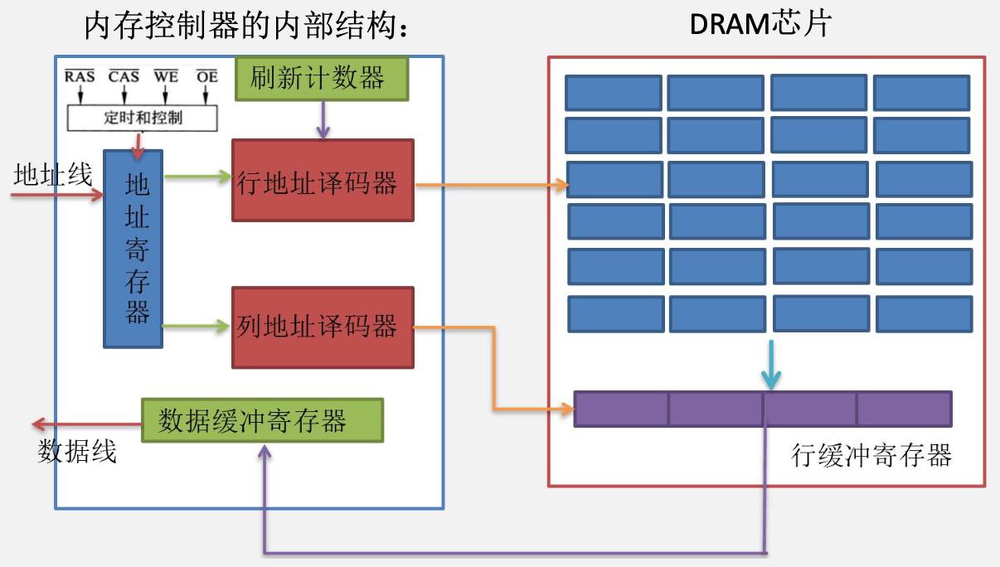
</div>

&emsp;&emsp;&ensp;控制信号：
&emsp;&emsp;&ensp;${RAS}$：行通选控制信号
&emsp;&emsp;&ensp;${CAS}$：列通选控制信号
&emsp;&emsp;&ensp;${WE}$：读写信号，在行选通信号 ${RAS}$ 和列选通信号 ${CAS}$ 的控制下分时传送行、列地址。${WE}$ 为读写控制引脚，低电平时执行写操作。

<div style=" margin: 0 auto; max-width: 70%;">
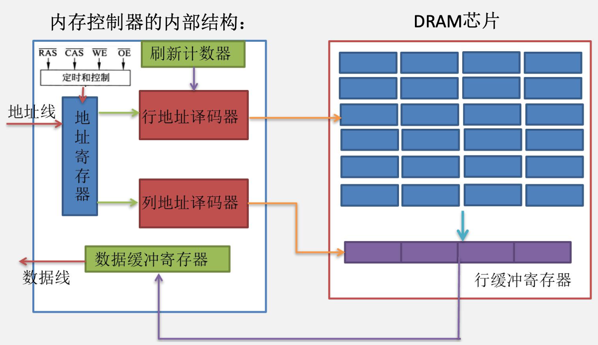
</div>

### 行缓冲寄存器及其容量

&emsp;&emsp;&ensp;行缓冲寄存器：行缓冲寄存器主要用于在行译码器给出信号后，将整行的数据进行保存。注意行缓冲寄存器并不是由 ${DRAM}$ 构成，而是由 ${SRAM}$ 构成。
&emsp;&emsp;&ensp;行缓冲寄存器的容量：由于行缓冲寄存器保存了一行中的全部数据，所以行缓冲寄存器的容量就是**一行数据的容量**。
&emsp;&emsp;&ensp;注意：**每个 ${DRAM}$ 芯片中均会配置一个行缓冲寄存器**。后面的小节会讲到 ${DRAM}$ 芯片进行扩展成内存条，考试时候在这里由两种问法：
1. 芯片中行缓冲寄存器的大小（指单个 ${DRAM}$ 中的行缓冲大小）
2. 内存条中行缓冲寄存器的大小（整个内存条全部行缓冲的大小）

<div style=" margin: 0 auto; max-width: 30%;">
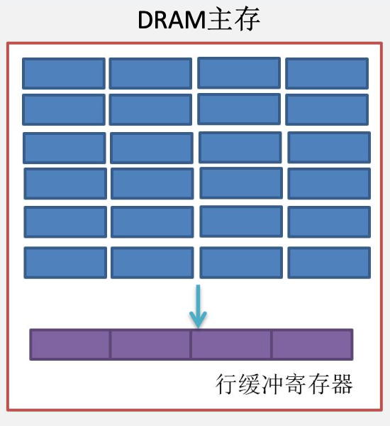
</div>

### 地址引脚和地址总线

1. 地址线个数，主要说的是 ${CPU}$ 硬件决定所能访问到的最大主存地址范围，${CPU}$ 所支持地址线的数量是在出厂时就定好的。
2. 地址引脚的数量取决于 ${DRAM}$ 主存的最大存储容量。如 ${DRAM}$ 主存最大容量为 ${1KB}$ 大小，字节编址。${DRAM}$ 芯片上的地址引脚的个数就是5个。
&emsp;&emsp;&ensp;注意：地址引脚和地址线所对应的主语不同，地址引脚对应 ${DRAM}$ 芯片，地址线对应 ${CPU}$。

<div style=" margin: 0 auto; max-width: 60%;">
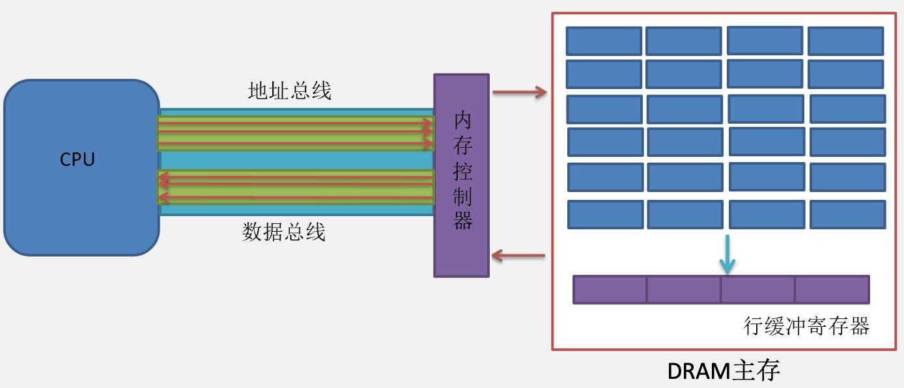
</div>

### 数据引脚和数据总线

1. 数据总线的也是 ${CPU}$ 在出厂时候就决定好的，数据总线位数代表** ${CPU}$ 一次能访问到数据的长度**。并且 ${CPU}$ 中 ${MDR}$（数据寄存器）的位数必须和 ${CPU}$ 数据线的个数保持一致。
2. 数据引脚的数量和 ${CPU}$ 的数据总线数量必须保持一致。

### 刷新计数器
&emsp;&emsp;&ensp;由于 ${DRAM}$ 需要刷新的设定，每隔一段时间（很多题目设定为 ${2ms}$）需要对一行的数据进行刷新，刷新计数器用于决定具体刷新哪一行的数据。

## DRAM刷新

&emsp;&emsp;&ensp;刷新的目的：${DRAM}$ 存储元件是采用电容存储数据，电容中的电荷会缓慢放电。刷新的初衷是为了在**没有读写操作时**，维持 ${DRAM}$ 中保存的电荷。由于 ${DRAM}$ 上存储的电荷会缓慢放电，超过一定时间导致信息丢失。因此必须定时给 ${DRAM}$ 中所有行进行充电，每次对一行存储单元进行充电的操作叫做**刷新**。
&emsp;&emsp;&ensp;刷新周期：定义为上次对整个存储器刷新结束时作为开始点到下次对整个存储器全部刷新一遍为止的时间间隔。比如一个 ${DRAM}$ 中每行数据每隔 ${2ms}$ 需要进行一次补充电荷，则 ${2ms}$ 叫做刷新周期。
&emsp;&emsp;&ensp;关于刷新的重要结论：**一次刷新实际上就是对一行进行读操作，所以一个刷新的时间约为一个存储周期**。

&emsp;&emsp;&ensp;刷新的具体操作：${DRAM}$ 刷新不需要外部提供行地址信息，是一个**内部的自动操作**。${DRAM}$ 芯片内部有一个行地址生成器（也称刷新计数器），由它自动生成行地址并对**整行数据进行读操作**，读到行缓冲寄存器中，然后对该行数据进行补充电荷。以下有三种刷新策略，分别是异步刷新，集中刷新，分散刷新。
&emsp;&emsp;&ensp;${DRAM}$ 半导体中数据读出：
1. 将该存储单元中的数据读出，存储单元中的电荷释放，全部变成0电荷。
2. 电荷经过读出放大器将电压放大后，输送给 ${CPU}$。
3. 由于原存储单元中的数据读出，电荷归零，所以需要重新对存储单元补充电 荷，让其数据与读出前保持一致。这个过程叫做**数据再生**。

<div style=" margin: 0 auto; max-width: 60%;">
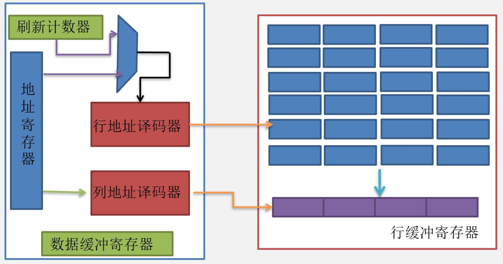
</div>

&emsp;&emsp;&ensp;刷新和数据再生的区别：刷新是硬件自动控制，由于 ${DRAM}$ 芯片要定期“充电”，刷新操作实际上是读出某一行数据，依托数据再生的机制将行内的数据读后再生。
&emsp;&emsp;&ensp;数据再生依赖于读操作，在执行完读操作后，${DRAM}$ 芯片被破坏性读出，其中的电荷流出。再生操作重新给流出的部分补充电荷。

### 异步刷新
&emsp;&emsp;&ensp;中心思想：将刷新周期按照行平均划分。
&emsp;&emsp;&ensp;例：假设某一 ${DRAM}$ 的存储周期为 ${2μs}$，共 ${4096}$ 行数据，刷新周期为 ${65.536ms}$，则相邻两行之间的刷新间隔就是 ${\frac{65.536ms}{4096}=16μs}$。

<div style=" margin: 0 auto; max-width: 70%;">
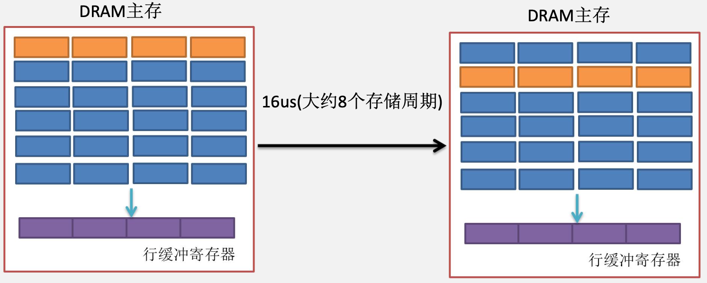
</div>

### 分散刷新
&emsp;&emsp;&ensp;分散刷新的策略是延长存储周期的时长。假设未采用分散刷新策略的存储周期长度为 ${T}$，若采用分散刷新策略，存储周期首先会延长为 ${2T}$，前一半时间 ${T}$ 用于正常的读写操作。而在后一半时间停止读写操作，由刷新计数器提供一个行地址去刷新一行。所以在分散前提下，**在一个“存储周期”内，相当于执行了两次读操作**。一次是**读取数据**，一次是**刷新一行数据**。

<div style=" margin: 0 auto; max-width: 90%;">
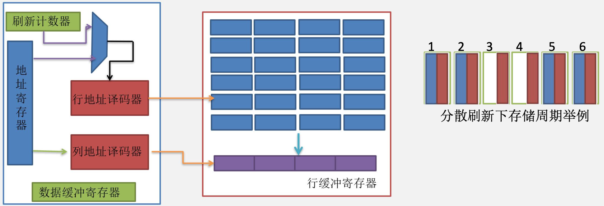
</div>

### 集中刷新
&emsp;&emsp;&ensp;在整个刷新间隔内，前一段时间用于正常的读写操作。而在后一段时间停止读写操作集中逐行进行刷新。因为刷新操作同时对所有芯片进行，所以刷新期间整个存储器都不能进行正常的读写操作。
&emsp;&emsp;&ensp;刷新引出两个问题：

1. 当刷新和访存同时出现时，先执行哪一个？

&emsp;&emsp;&ensp;若刷新到来的同时，${CPU}$ 想要访问主存，则优先刷新，在经过一个存储周期后，${CPU}$ 在进行访存。
&emsp;&emsp;&ensp;因此，在 ${DRAM}$ 刷新期间，${CPU}$ 是**无法**对 ${DRAM}$ 进行读/写操作，这段时间称为**死时间**。集中刷新将死时间集中在一起，异步刷新将死时间平均在一个刷新周期中。**分散刷新由于延长了存储周期，不存在死时间**。
&emsp;&emsp;&ensp;注意：每次刷新执行，其实就是进行一次读操作，也就是读出 ${DRAM}$ 中一行的电荷，然后在对电荷进行再生。 所以本质上刷新操作就是一次主存读操作，也就解释了为什么刷新执行时，${CPU}$ 不能访问主存。

2. 若某行数据刚刚被读出，若下一个存储周期刚好要对这一行进行刷新，则这一行数据还要刷新么？

&emsp;&emsp;&ensp;刷新是机器硬件定义的周期行工作，即使在刷新前已经读取过，该行的电荷在下一个存储周期并不会失效，但对这一行也要进行刷新。

## DRAM读写周期和总线事务

&emsp;&emsp;&ensp;总线事务（重点）：数据流通过称为总线的共享电子电路在 ${CPU}$ 和 ${DRAM}$ 主存之间来来回回。每次 ${CPU}$ 和主存之间的数据传送都是通过一系列步骤来完成的，这些步骤称为**总线事务**。
&emsp;&emsp;&ensp;读事务：从主存传送数据到 ${CPU}$。写事务：从 ${CPU}$ 传送数据到主存。
&emsp;&emsp;&ensp;总线读事务：${CPU}$ 想要访问地址 ${000010H}$ 中的数据。
1. ${CPU}$ 跟总线控制器申请**总线控制权**，总线控制器将总线控制权给到 ${CPU}$。
2. ${CPU}$ 将地址送进 ${MAR}$，并经过总线送到主存控制器。主存控制器收到地址后启动 ${DRAM}$ 准备数据。
3. 数据准备完毕后将数据发送到 ${MDR}$，${MDR}$ 将数据发送到具体的寄存器。

&emsp;&emsp;&ensp;读出时间 ${Tr}$：从存储器接到读命令开始到信息被送到数据线上所用的时间。
&emsp;&emsp;&ensp;存储周期 ${Tm}$：连续两次访问存储器所需的最小间隔。从时间上来说，${Tm = Tr + 读出放大器和驱动电路恢复时间}$。
&emsp;&emsp;&ensp;总结：从时间上看读出时间和一个总线事务的时间近似，并略微小于一个存储周期的时间。所以可以把**一个总线事务近似看作一个存储周期**。

## 多模块存储器

&emsp;&emsp;&ensp;受集成度和功耗等因素的限制，单个 ${DRAM}$ 芯片（存储体）的容量不可能很大。所以往往通过存储器芯片的扩展技术，将多个芯片做在一个主存模块（即内存条）上，在由多个内存条组成一台计算机所需的主存空间，并通过系统总线和 ${CPU}$ 相连。
&emsp;&emsp;&ensp;多模块存储器的应用：组成现代计算机的**内存条**

<div style=" margin: 0 auto; max-width: 70%;">
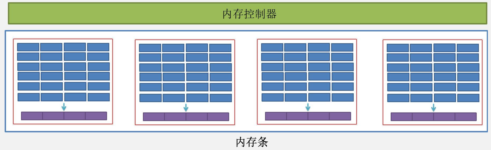
</div>

### 片选线

&emsp;&emsp;&ensp;注意：由于 ${CPU}$ 中**地址线**的个数是**出厂时就固定的**，所以内存容量不能无限扩展，其扩展后的容量**必须要满足** ${CPU}$ 中**地址线能覆盖的范围**。
&emsp;&emsp;&ensp;片选线：由于内存条是通过多个 ${DRAM}$ 芯片（存储体）扩展而来，所以内存控制器中，会**设置片选线**，用于确定是哪一片 ${DRAM}$ 芯片（存储体）。

### 存储单元编制方式

&emsp;&emsp;&ensp;内存条中各个存储体内存储单元的编址方式：对于单个 ${DRAM}$ 芯片（存储体）而言，其第一个存储单元均为0号存储单元。但此时，硬件上，将4块 ${DRAM}$ 芯片（存储体）构成一个内存条，那么这4个存储体为了构成内存条，其中的存储单元要如何编址。
&emsp;&emsp;&ensp;在考纲里主要介绍两种编址方式:
1. 顺序编址（连续编址）

&emsp;&emsp;&ensp;主存地址的高位表示存储体号，低位表示体内地址，也称为**按高位地址划分**方式，地址**在模块内连续**。顺序编址方式下，总是把低位的体内地址送到由高位存储体号所确定的模块内进行译码。
&emsp;&emsp;&ensp;比如地址 ${0010111}$ 高位为 ${00}$，表示其地址在第0号存储体内。
&emsp;&emsp;&ensp;若内存条采用顺序编址，${CPU}$ 访问地址 ${000110}$ 的步骤如下：
1. 根据高位 ${000110}$ 确定出存储单元位于 ${0}$ 号 ${DRAM}$ 中；
2. 定位到 ${DRAM}$ 芯片后，确定 ${000110}$ 存储单元所处的行 ${01}$；
3. 最后给出存储单元 ${000110}$ 的列地址 ${10}$。

<div style=" margin: 0 auto; max-width: 50%;">
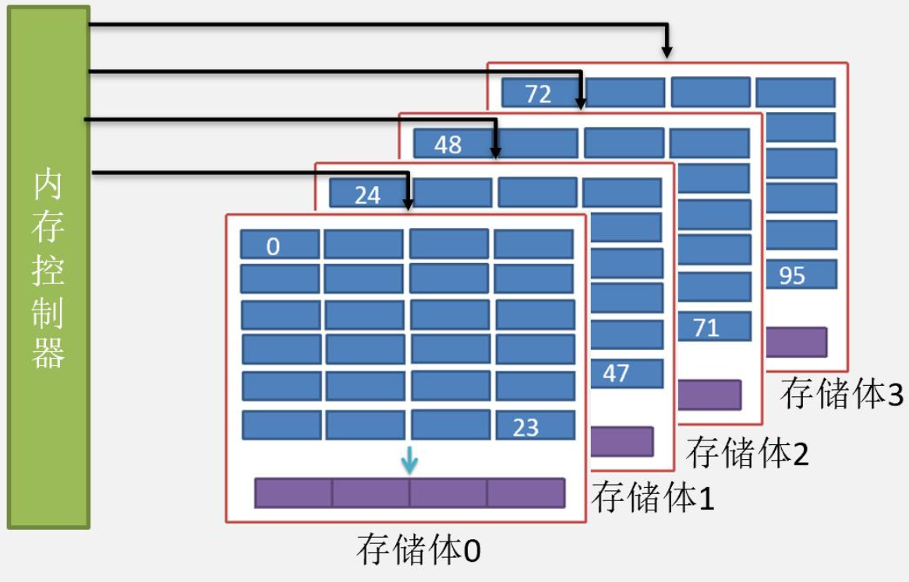
</div>

2. 交叉编址

&emsp;&emsp;&ensp;主存地址的**低位表示存储体号**，**高位表示体内地址**。交叉编址方式下，总是把**高位的体内地址**送到由**低位存储体号**所确定的模块内进行译码。
&emsp;&emsp;&ensp;比如地址 ${0010111}$ 低位为 ${11}$，表示其地址在第3号存储体内。
&emsp;&emsp;&ensp;若内存条采用交叉编址，${CPU}$ 访问地址 ${000110}$ 时：根据低 ${2}$ 位 ${000110}$ 可以确定出存储单元位于 ${2}$ 号 ${DRAM}$ 中。根据高 ${2}$ 位判断出存储单元 ${000110}$ 在 ${0}$ 行。根据中间 ${2}$ 位 ${000110}$ 判断出在 ${01}$ 列。

<div style=" margin: 0 auto; max-width: 80%;">
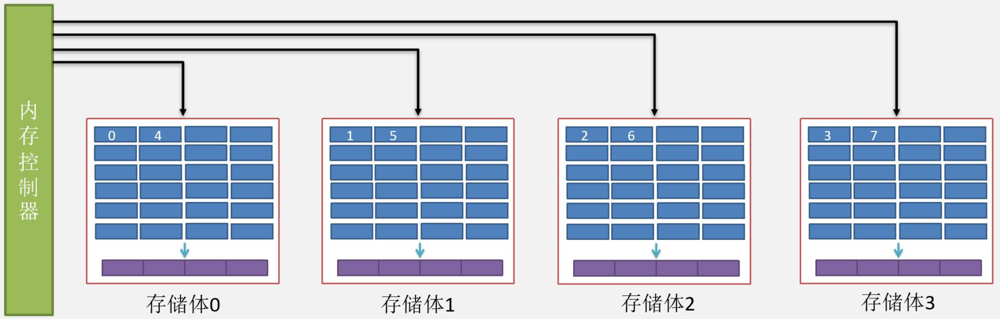
</div>

### 存储器芯片扩展

&emsp;&emsp;&ensp;位扩展是用若干片位数较少的 ${DRAM}$ 芯片构成给定字长的 ${DRAM}$ 芯片时，需要进行**位扩展**。
&emsp;&emsp;&ensp;比如容量为 ${4\times 4\times 8bit}$ 的 ${DRAM}$ 芯片，实际是由 ${8}$ 片 ${4\times 4\times 1bit}$ 的 ${DRAM}$ 存储元件构成。${8}$ 片 ${4\times 4\times 1bit}$ 的片叠加构成了一个 ${4\times 4\times 8bit}$ 的 ${DRAM}$ 芯片。

<div style=" margin: 0 auto; max-width: 90%;">
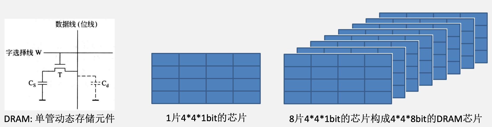
</div>

&emsp;&emsp;&ensp;位扩展方式的目的是为了组成 ${DRAM}$ 芯片。字扩展是**容量的扩充**，**位数不变**。字扩展方式的目的是由多个 ${DRAM}$ 芯片**扩展成一个内存条**。

<div style=" margin: 0 auto; max-width: 60%;">
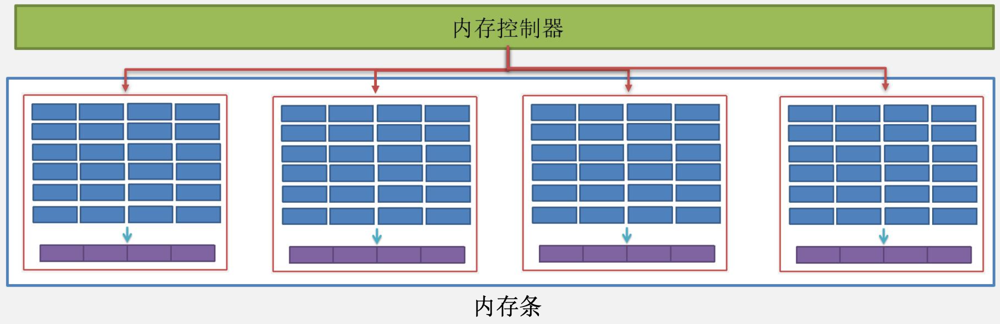
</div>

&emsp;&emsp;&ensp;${1}$ 片 ${4\times 4\times 1bit}$ 的 ${DRAM}$ 芯片，先经过**位扩展**为 ${4\times 4\times 8bit}$ 的 ${DRAM}$ 芯片，由 ${4}$ 片 ${4\times 4\times 8bit}$ 的 ${DRAM}$ 芯片经过**字扩展**，构建成一个内存条。这个过程称为**字位同时扩展**。

<div style=" margin: 0 auto; max-width: 70%;">
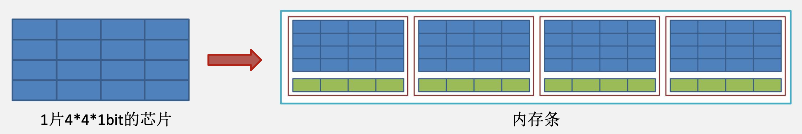
</div>

### 双端口存储器

&emsp;&emsp;&ensp;双端口存储器在一个存储器中提供**两组独立的读写控制电路和两个读写端口**，因而可以同时提供两个数据的**并行读写**，是一种空间并行技术。在现实中的实际应用就是用**两条内存条组成一个主存储器**，每个内存条**具备独立的读写控制电路和读写端口**。

<div style=" margin: 0 auto; max-width: 70%;">
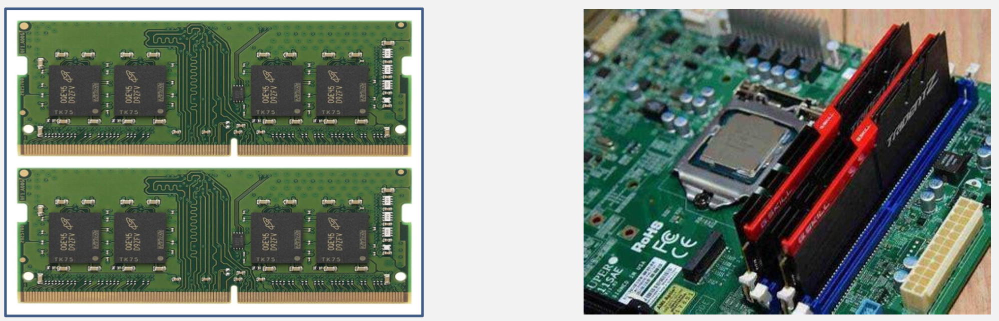
</div>

&emsp;&emsp;&ensp;当两个端口**地址不相同**时，可以向存储体**一次读写两个单元的内容**；当**两个端口地址相同时，发生冲突**，可按照特定的优先顺序选择其中一个端口进行读写。

&emsp;&emsp;&ensp;与双端口存储器连接的存储器总线，叫做**双通道存储器总线**。由于双端口存储器可以**同时提供两个数据的并行读写**（假定不存在冲突写情况），所以双通道存储器总线带宽，是**单个内存条总线带宽的2倍**。

## Cache基本知识

&emsp;&emsp;&ensp;${Cache}$ 的目的：在现代内存与 ${CPU}$ 进行交互时，${CPU}$ 每次向内存读/写一个存储单元的时间为 ${100ns}$。而一个性能很差的 ${CPU}$ 他的工作频率都有 ${2GHz}$。理想情况下，一个 ${2GHz}$ 的 ${CPU}$，每 ${0.5ns}$ 就会产生一次读/写数据的请求。${CPU}$ 访问一次内存的时间，${CPU}$ 最多可以产生 ${200}$ 次读/写请求。**为了解决内存与 ${CPU}$ 速度不匹配的问题**，在 ${CPU}$ 内部加入了新的硬件，高速缓存（${Cache}$）。

<div style=" margin: 0 auto; max-width: 70%;">
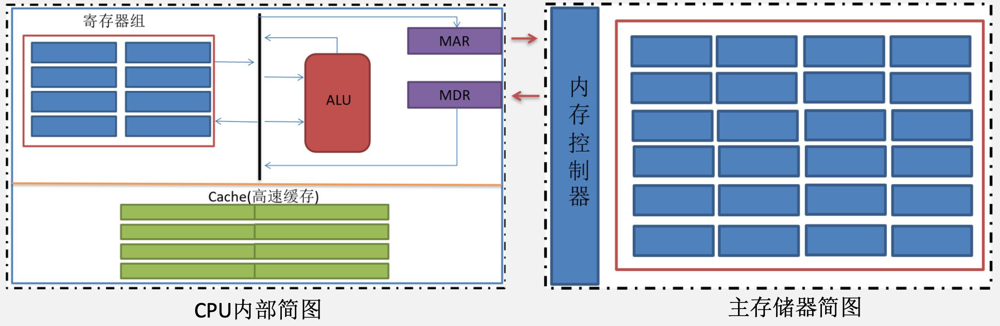
</div>

### Cache的材料

&emsp;&emsp;&ensp;${Cache}$ 位于 ${CPU}$ 的内部，其由 ${SRAM}$ 半导体材料构成。
1. ${Cache}$ 在运行时必须时刻处于带电状态，一旦断电，${Cache}$ 内存储的全部信息立刻丢失。
2. ${Cache}$ 的读写速度非常快，对 ${Cache}$ 的读写时间，目前的技术已经可以做到近似等于 ${CPU}$ 执行一条指令的时间。
3. 由于 ${SRAM}$ 电路的特性，导致 ${Cache}$ 只具备小规模存储的能力，**无法实现大规模存储**。

### 带Cache的CPU访存过程

&emsp;&emsp;&ensp;在 ${CPU}$ 和主存之间设置 ${Cache}$，把主存中被频繁访问的活跃程序块和数据块复制到 ${Cache}$ 中。基于程序访问的局部性，大多数情况下 ${CPU}$ 能直接从 ${Cache}$ 中取得指令和数据而不必访问主存。
&emsp;&emsp;&ensp;若 ${CPU}$ 在拥有 ${Cache}$ 的计算机上想要访问主存中某个**存储单元**的数据时，不会直接访问主存，而是优先访问 ${Cache}$。若 ${Cache}$ 中有该数据，则直接从 ${Cache}$ 中将数据读出。若 ${Cache}$ 中没有要访问的数据，就要对主存进行访问，从主存获得该存储单元的数据，并将存储单元所在的主存块送入 ${Cache}$。

<div style=" margin: 0 auto; max-width: 50%;">
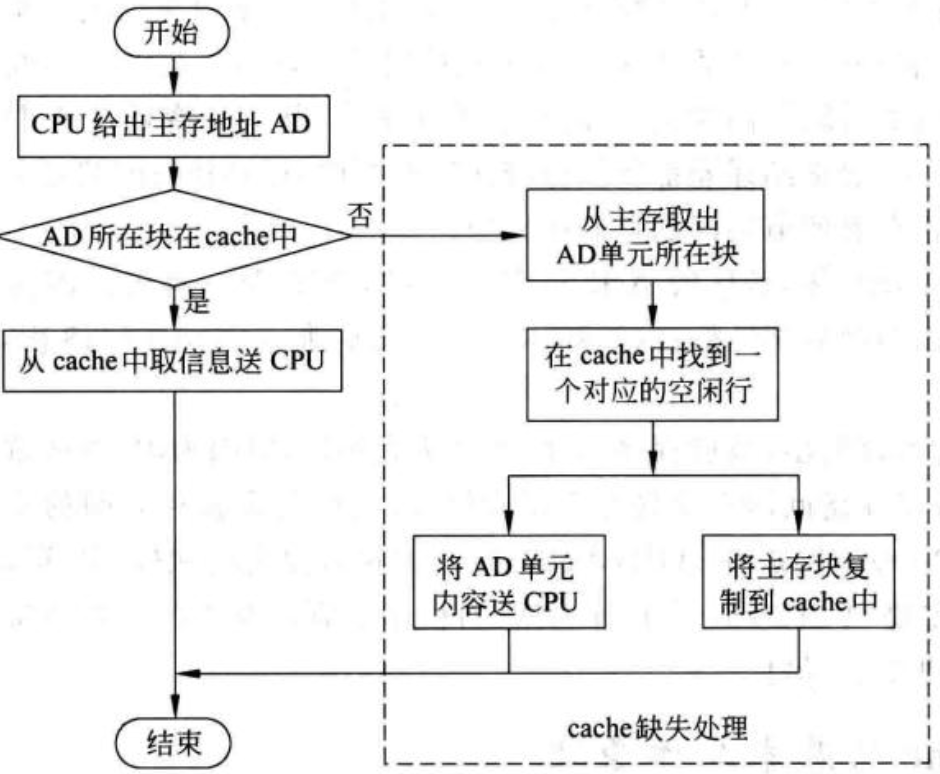
</div>

## 局部性原理

&emsp;&emsp;&ensp;时间局部性：如果**一个数据**现在被访问了，那么在**以后很有可能还会被访问**。
&emsp;&emsp;&ensp;空间局部性：如果一个数据现在被访问了，那么它**周围的数据在以后有可能也会被访问**。
&emsp;&emsp;&ensp;局部性原理在 ${Cache}$ 和主存之中均有具体的应用 高速缓冲（${Cache}$）技术就是利用空间局部性原理，把程序中正在使用的部分数据存放在一个高速、容量较小的 ${Cache}$ 中，使 ${CPU}$ 的访存操作大多数针对 ${Cache}$ 进行，从而提高程序的执行速度。
&emsp;&emsp;&ensp;空间局部性原理在**单片 ${DRAM}$ 芯片**中的应用：主存块（内存块）主存块其实就是计算机中一组地址连续的存储单元。比如可以设定 ${4}$ 个地址连续的存储单元构成 ${1}$ 个主存块。
&emsp;&emsp;&ensp;主存块同时也要满足一个条件，就是这个主存块的首个存储单元的地址号，必须对 ${4}$ 取余，余数为 ${0}$。

<div style=" margin: 0 auto; max-width: 50%;">
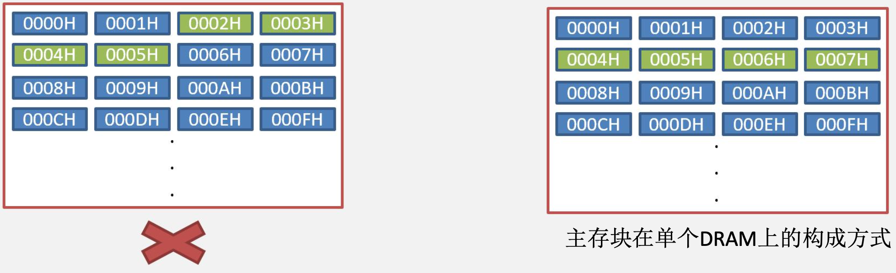
</div>

&emsp;&emsp;&ensp;空间局部性原理在多片 ${DRAM}$（内存条）的应用：现代主存体系，往往不会采用单个 ${DRAM}$ 芯片当作主存，而是采用由多个 ${DRAM}$ 芯片构成的内存条作为计算机的主存储器。内存条构建主存块的方式基于如下两点：

1. 内存条中，多个 ${DRAM}$ 采用**交叉编址**的方式为存储单元编址。
2. 一个主存块中**包含存储单元的个数，一般会等于内存条中 ${DRAM}$ 芯片的个数**。

<div style=" margin: 0 auto; max-width: 50%;">
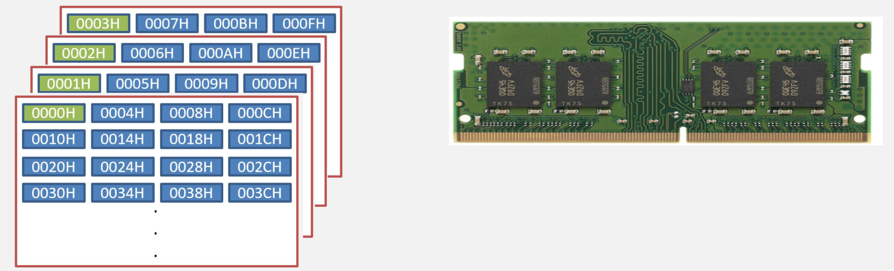
</div>

&emsp;&emsp;&ensp;时间局部性：如果一个数据现在被访问了,那么在以后很有可能还会被访问。

```cpp
int A[100];
for(int i=0; i<100; i++){
   for(int j=0; j<=i; j++){
      A[i] += j;
   }
}
```

&emsp;&emsp;&ensp;带 ${Cache}$ 的 ${CPU}$ 访问内存条的步骤：

1. ${CPU}$ 首先将**存储单元地址**写入到芯片内部的 ${MAR}$ 中。
2. 先检查 ${Cache}$ 是否保存该存储单元的数据，若在 ${Cache}$ 中有备份，则将数据从 ${Cache}$ 送入 ${CPU}$。
3. 若无备份，则地址信息会送入主存。主存将该存储单元中的数据通过数据总线送入到 ${CPU}$ 内部的 ${MAR}$ 中。同时，主存会根据映射算法，选中 ${Cache}$ 中的一个 ${Cache}$ 行，**将地址单元所在整个主存块（内存块）的数据也送入到选定的 ${Cache}$ 行中**。

&emsp;&emsp;&ensp;总结：**主存一次给 ${CPU}$ 一个存储单元；主存一次给 ${Cache}$ 一个主存块**。

## Cache硬件结构

1. 数据 ${Cache}$ 与指令 ${Cache}$ 由于现代计算机指令和数据存放的位置不同，为了**解决指令和数据在 ${Cache}$ 中存放的冲突问题**，目前的设计思路是在 ${CPU}$ 中设置两个 ${Cache}$，一个是指令 ${Cache}$，一个是数据 ${Cache}$。分别用于装指令和数据。注意：在做题时候一定要区分，题目问的主语是数据 ${Cache}$ 还是指令 ${Cache}$。

<div style=" margin: 0 auto; max-width: 50%;">
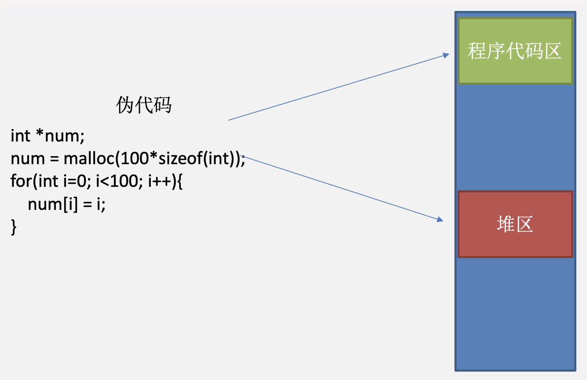
</div>

2. ${Cache}$ 行空间局部性在 ${Cache}$ 中的应用就是 ${Cache}$ 行，**${Cache}$ 行的大小和主存块的大小完全一致**。${Cache}$ 行是主存和 ${Cache}$ 之间**信息的交互单位**。${Cache}$ 的数据阵（数据区）由很多个 ${Cache}$ 行组成。比如，${Cache}$ 的大小为 ${256B}$，主存中的主存块大小为 ${8B}$，则 ${Cache}$ 中有 ${256/8=32}$ 个 ${Cache}$ 行。

3. ${Cache}$ 中的标记阵列和数据阵列 ${Cache}$ 在硬件上分成两部分，一部分区域称为数据阵列（数据区），用于**保存主存中送来的数据**。另一部分用 于保存 ${Cache}$ 的标记字段，**其由标记阵列和有效位组成**。如图，数据阵列由 ${4}$ 个 ${Cache}$ 行构成，每个 ${Cache}$ 行占 ${4B}$ 大小，${Cache}$ 的数据阵列大小为 ${16B}$。

<div style=" margin: 0 auto; max-width: 50%;">
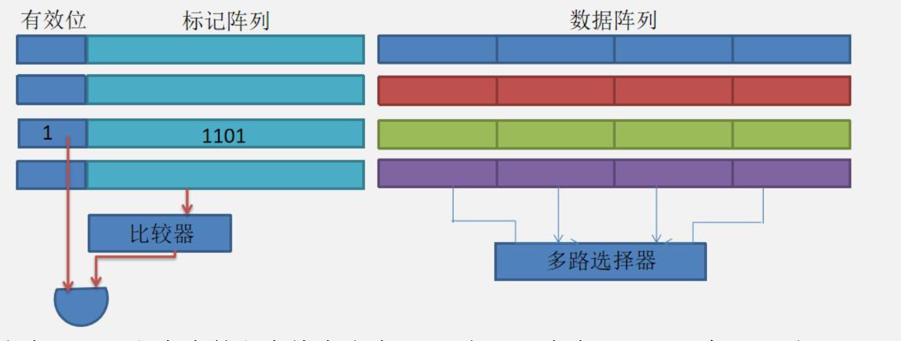
</div>

4. 有效位：有效位用于表示该 ${Cache}$ 行中的**数据是否有效**。计算机底层在删除某一个数据时，采用的是有效位控制的方法。若打算删除某个数据，则**将某个数据的有效位变成 ${0}$ 即代表删除，并不会真正的删除数据**。

5. 了解标记阵列：标记阵列的组成并不固定，最多包含三个部分：
   1. 保存 ${Cache}$ 行的 ${TAG}$ 字段；
   2. 保存脏位（根据题目具体情况）；
   3. 保存算法替换位（根据题目具体情况）。

## Cache映射方法

&emsp;&emsp;&ensp;主存块存放到 ${Cache}$ 中的规则叫做映射方式。主存和 ${Cache}$ 的映射方式主要有三种：
1. **直接（${direct}$）映射**：每个主存块映射到 ${Cache}$ 的**固定行中**。
2. **全相联（${full associate}$）映射**：每个主存块映射到 ${Cache}$ 的**任意行**中。
3. **组相联（${set associate}$）映射**：每个主存块映射到 ${Cache}$ 的**固定组的任意行**中。

&emsp;&emsp;&ensp;映射出现的时机：某个存储单元的内容，在 ${Cache}$ 中并无备份，出现 ${Cache\quad Miss}$。主存将存储单元所在的主存块根据映射规则送入 ${Cache}$ 中。
&emsp;&emsp;&ensp;映射依据：根据**存储单元的地址进行映射**。存储单元所在主存块的数据送入 ${Cache}$ 的**数据阵列（数据区）**，存储单元的**地址的一部分**送入到 ${Cache}$ 的标记阵列，**作为主存块的标记**。

### 直接映射

&emsp;&emsp;&ensp;由于 ${Cache}$ 的容量远小于主存的容量，对应的 ${Cache}$ 中 **${Cache}$ 行的个数也远小于主存块的数量**。所以没办法让每个 ${Cache}$ 行与主存块一一对应，所以，映射采用多对一的思想，多个主存块会映射到同一个 ${Cache}$ 行中。
&emsp;&emsp;&ensp;直接映射，利用**取余**的思想，将主存块映射到一个 ${Cache}$ 行中。
&emsp;&emsp;&ensp;例题：某主存大小为 ${64KB}$，按**字节编址**。${Cache}$ 中的数据区包含 ${16}$ 个 ${Cache}$ 行，主存中主存块大小为 ${8B}$，则第 ${248}$ 号存储单元映射到哪一个 ${Cache}$ 行？
&emsp;&emsp;&ensp;${248}$ 号存储单元位于 ${248/8=31}$ 号主存块内 ${31\% 16=15}$ 行。

&emsp;&emsp;&ensp;计算机没办法像人类一样，利用数学思想去解决问题。所以在计算机中的处理映射时，采**用地址划分方式**。
&emsp;&emsp;&ensp;例题：某主存大小为 ${64KB}$，按**字节编址**。${Cache}$ 中的数据区包含 ${16}$ 个 ${Cache}$ 行，主存中主存块大小为 ${8B}$，则第 ${248}$ 号存储单元映射到哪一个 ${Cache}$ 行？

<div style=" margin: 0 auto; max-width: 50%;">
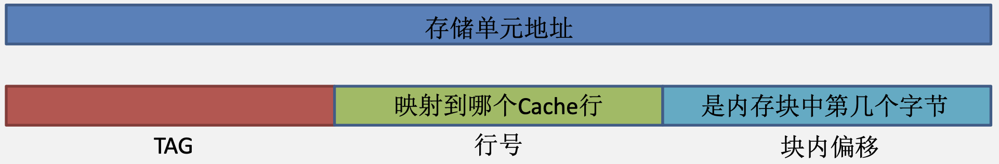
</div>

&emsp;&emsp;&ensp;${248}$ 号存储单元，地址的二进制表示为：${0000000011111000}$，其中 ${0-2}$，即低 ${3}$ 位 ${0000000011111000}$ 称为块内偏移。${3-6}$ 位 ${0000000011111000}$ 为行号，对应在哪个 ${Cache}$ 行中。从 ${7-15}$ 位 ${0000000011111000}$ 作为 ${TAG}$，存入 ${Cache}$ 的标记阵列中。

<div style=" margin: 0 auto; max-width: 50%;">
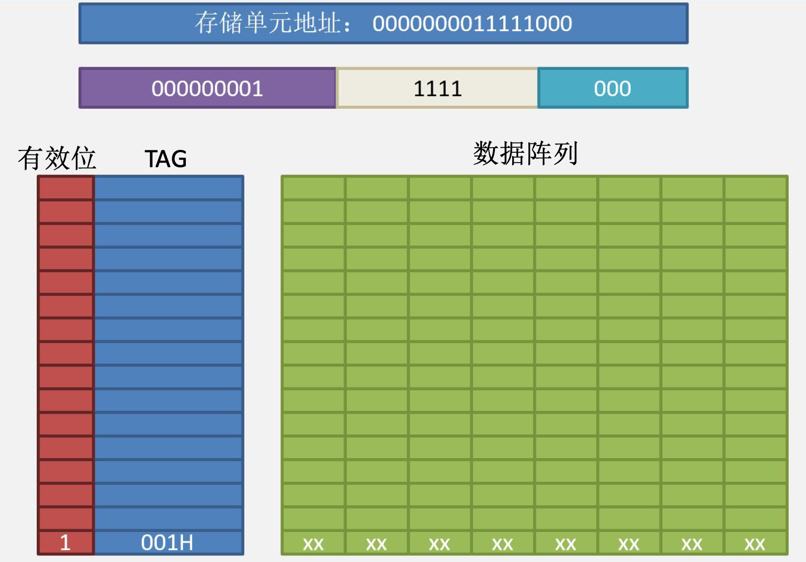
</div>

&emsp;&emsp;&ensp;${CPU}$ 从直接映射的 ${Cache}$ 中读某个存储单元的数据时，硬件会根据存储单元的地址，自动给出行号字段和 ${TAG}$ 字段，根据行号定位到某个 ${Cache}$ 行，在查看该 ${Cache}$ 行的有效位是否位 ${1}$。若为 ${1}$，**比较 ${Cache}$ 行的标记阵列中存储的 ${TAG}$ 字段是否与硬件给出的一致**。一致则 ${Cache}$ 命中，将数据送入 ${CPU}$ 的 ${MDR}$，不一致则产生 ${Cache\quad Miss}$。若有效位为 ${0}$ 则直接产生 ${Cache\quad Miss}$。
&emsp;&emsp;&ensp;比较器：用于比较标记阵列中保存的 ${TAG}$ 和主存地址中的 ${TAG}$ 字段是否一致，**直接映射只需要一个比较器**。
&emsp;&emsp;&ensp;多路选择器：用于**选择 ${Cache}$ 行中中的具体是哪个字节地址**。如一个主存块 ${4}$ 字节，则需要一个**四路多选器**。
&emsp;&emsp;&ensp;读取主存地址 ${10101001}$ 为例：主存大小为 ${256B}$，${Cache}$ 的数据区容量为 ${16B}$，主存块大小为 ${4B}$。因此，块内偏移字段为 ${2bit}$，行号为 ${2bit}$，${TAG}$ 为 ${4bit}$。

<div style=" margin: 0 auto; max-width: 50%;">
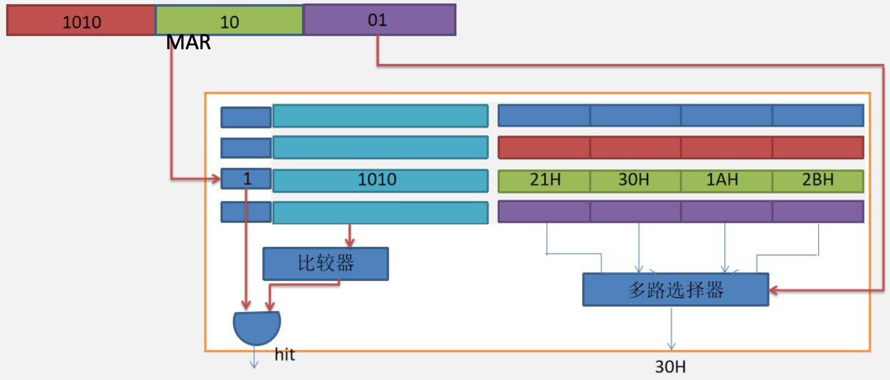
</div>

&emsp;&emsp;&ensp;直接映射方式下，${Cache}$ 行内数据替换举例：
&emsp;&emsp;&ensp;若 ${Cache}$ 未命中（${Cache\quad Miss}$）则主存把该地址单元中的数据给到 ${CPU}$ 中的 ${MDR}$，同时**将地址所在的主存块更新到 ${Cache}$ 对应的 ${Cache}$ 行中**。若对应位置已经存放数据，则**将对应位置的数据置换出去后在填入**。

<div style=" margin: 0 auto; max-width: 60%;">
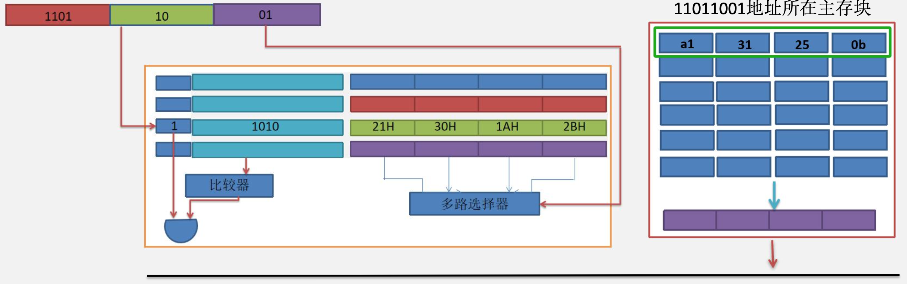
</div>

### 全相联映射

&emsp;&emsp;&ensp;与直接映射采用取余的思想不同，全相联映射的思想是随便映射。一个主存块可以存放在 ${Cache}$ 中的任意一个区域（不考虑替换算法）。
&emsp;&emsp;&ensp;对于全相联映射的地址划分，将主存地址分成了两个部分。第一部分作为 ${TAG}$ 字段，表示是第几个主存块第二部分作为块内偏移，表示是主存块中的具体哪个字节的地址。

<div style=" margin: 0 auto; max-width: 60%;">

</div>

&emsp;&emsp;&ensp;全相联映射的目的：全相联的方式中对于一个存储器地址来说，它的数据可以放在**任意一个 ${Cache}$ 行中**。全相联结构的 ${Cache}$ 有着最大的灵活度。

<div style=" margin: 0 auto; max-width: 50%;">
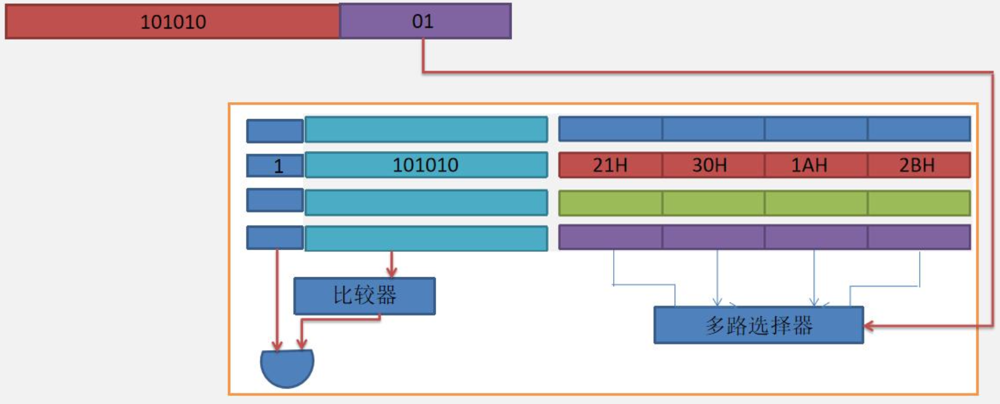
</div>

&emsp;&emsp;&ensp;全相联映射的 ${Cache}$，会将主存中的 ${TAG}$ 字段与标记阵列中，每一行的信息通过比较器进行对比。如果只有一个比较器的话，那么每一次对比都需要与整个标记阵列进行比较，这样速度就会非常慢。所以也有另一种改进方法，**标记阵列的每个行设置一个比较器**，这样速度确实明显提升，但**功耗也大大增加**。

<div style=" margin: 0 auto; max-width: 50%;">
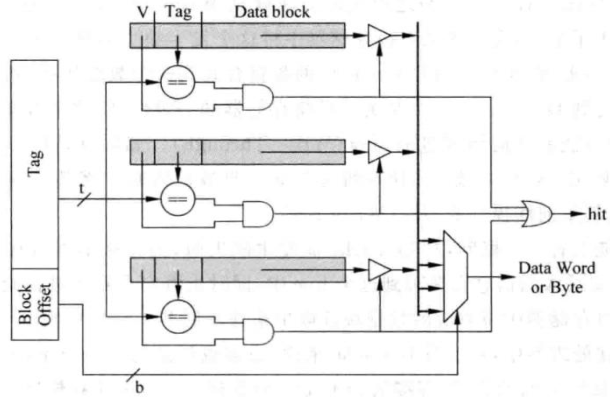
</div>

### 替换算法

&emsp;&emsp;&ensp;相比于直接映射，每个 ${Cache}$ 行中保存的主存块都有**唯一的地址映射**到 ${Cache}$ 中。全相联映射的标记阵列中的数据，在有空余 ${Cache}$ 行时，是**随机存放**的，没有规则可言。当 ${Cache}$ 行装满后，**如果需要将数据进行替换时，就需要额外提供一个替换算法**，来选择一个 ${Cache}$ 行来进行替换。考试中考察过的替换算法有 ${3}$ 种：随机替换算法，先进先出替换算法，**最近最少使用替换算法（${LRU}$）**。

1. 随机替换算法：随机替换算法的思想就是**随机选择一个 ${Cache}$ 行**进行替换，这种方式**没有任何局部性思想可言**。他的实现方式采用一个 ${random}$ 触发器，生成一个随机的 ${Cache}$ 行用于替换数据。
2. 先进先出替换算法 总是**选择最早装入 ${Cache}$ 的主存块被替换**。这种算法实现起来较方便，但**不能正确反映程序的访问局部性**，因为最先进入的主存块也可能是目前经常要用的。因此，这种算法**有可能产生较大的缺失率**。
3. 最近最少使用替换算法（${LRU}$）的基本思想是：总是**选择近期最少使用的主存块被替换**。符合**时间局部性原理**：如果一个数据现在被访问了，那么在以后很有可能还会被访问。
&emsp;&emsp;&ensp;${LRU}$ 算法的基本方法：${LRU}$ 算法相当于**将每个 ${Cache}$ 行进排序**，如果该 ${Cache}$ 块**最近被访问的次数越多，则他被替换出去的概率越低**，当出现需要替换的情况时，会选择**最近最少被访问的 ${Cache}$ 行替换出去**。
&emsp;&emsp;&ensp;${LRU}$ 算法的步骤：为了实现排序的方式，硬件上在标记阵列种每个行设置**一段计数器位**，用计数值来记录主存块的使用情况，通过硬件修改计数值，并根据计数值选择淘汰某个 ${Cache}$ 行中的主存块。淘汰时，只要将**被淘汰行的有效位清零即可**，这段计数位**称为 ${LRU}$ 位**。
&emsp;&emsp;&ensp;计数器的变化规则如下：

   1. 命中时，**被访问的行的计数器清零，比其低的计数器加 ${1}$**，其余不变。
   2. 未命中且该组还有空闲行时，则新装入的行的**计数器设为 ${0}$**，其余**全加 ${1}$**。
   3. 未命中且该组无空闲行时，计数值为 ${3}$ 的那一行中的主存块被淘汰，新装入的行的计数器设为 ${0}$，其余加 ${1}$。

&emsp;&emsp;&ensp;假设有一主存大小 ${24B}$，${Cache}$ 大小 ${16B}$，采用**全相联映射方式**。内存块大小为 ${4B}$，按**字节编址**。${CPU}$ 给出一组主存地址访问序列为：${04H, 08H, 0CH, 10H, 05H, 09H, 14H, 06H, 0AH, 0DH, 11H, 15H}$。请根据 ${LRU}$ 算法选出替换的 ${Cache}$ 块。

&emsp;&emsp;&ensp;先将主存地址序列 ${04H, 08H, 0CH, 10H, 05H, 09H, 14H, 06H, 0AH, 0DH, 11H, 15H}$ 转换为主存块号，其对应的主存块号为 ${1，2，3，4，1，2，5，1，2，3，4，5}$。计数器的变化规则如下：

1. 命中时，被访问的行的计数器清零，比其低的计数器加 ${1}$，其余不变。
2. **未命中且该组还有空闲行时，则新装入的行的计数器设为 ${0}$，其余全加 ${1}$。**
3. 未命中且该组无空闲行时，计数值为 ${3}$ 的那一行中的主存块被淘汰，新装入的行的计数器设为 ${0}$，其余加 ${1}$。

<div style=" margin: 0 auto; max-width: 50%;">
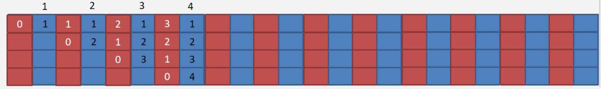
</div>

<div style=" margin: 0 auto; max-width: 50%;">
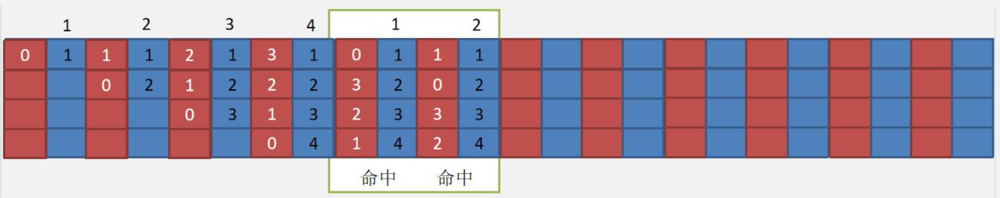
</div>

<div style=" margin: 0 auto; max-width: 50%;">
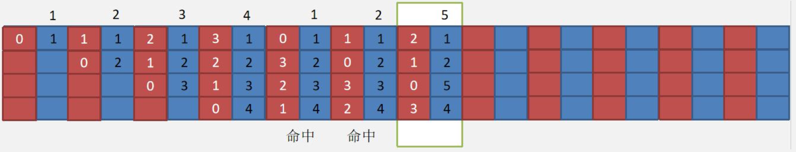
</div>

<div style=" margin: 0 auto; max-width: 50%;">
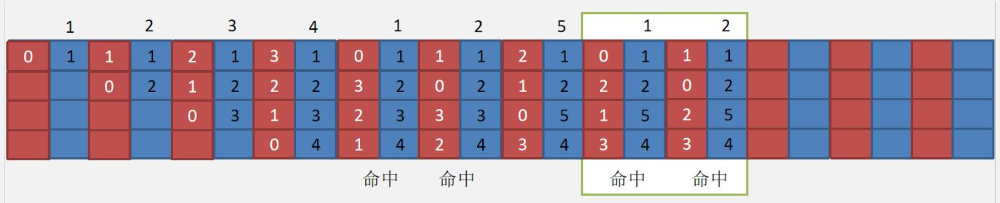
</div>

<div style=" margin: 0 auto; max-width: 50%;">
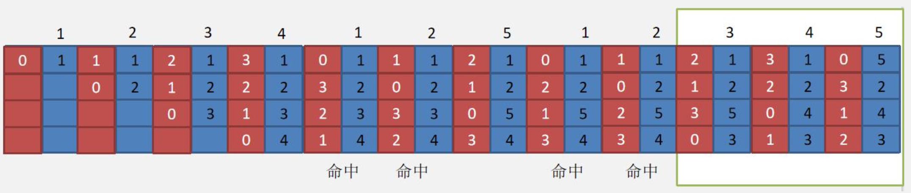
</div>

&emsp;&emsp;&ensp;在全相联的情况下，如果替换算法采用 ${LRU}$ 的方式，就需要在标记矩阵添加一些额外信息，该额外信息叫做**算法替换位**，该位就是为了给所有的 ${Cache}$ 行排序，**算法替换位和 ${Cache}$ 的行数有关**，比如有 ${8}$ 个 ${Cache}$ 行，那么需要 ${3bit}$ 的数据才能表示 ${8}$ 个 ${Cache}$ 行的顺序，所以算法替换位为 ${3bit}$。

<div style=" margin: 0 auto; max-width: 50%;">
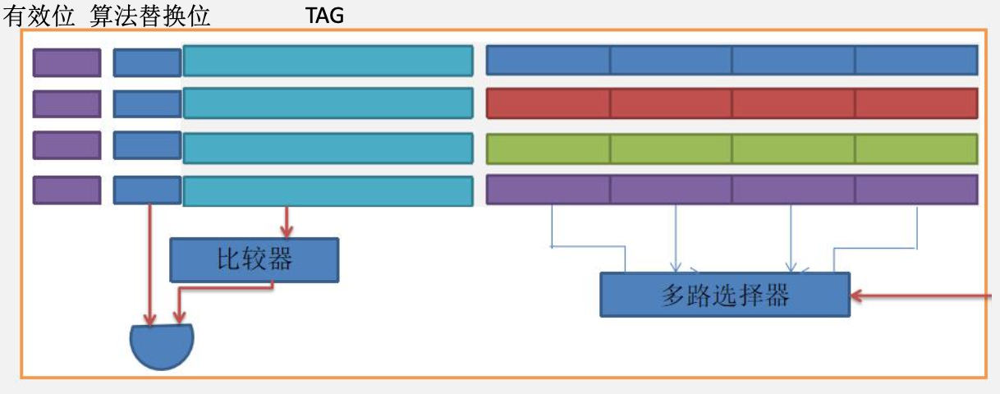
</div>

### 组相联映射

&emsp;&emsp;&ensp;全相联映射由于主存块在 ${Cache}$ 行中没有一个固定的位置，查找起来非常麻烦。而直接映射主存块和 ${Cache}$ 行是多对一的关系，因此容易产生 ${Cache}$ 频繁替换，为了调和上述两个问题，提出了**组相联映射**。

<div style=" margin: 0 auto; max-width: 60%;">
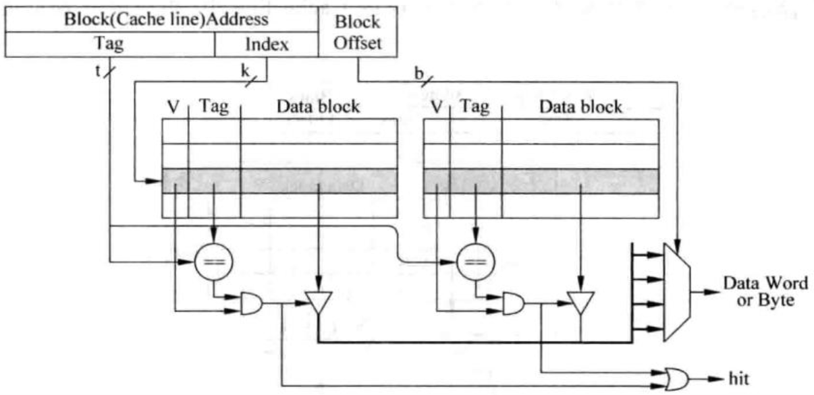
</div>

&emsp;&emsp;&ensp;举个例子，比如 ${1KB}$ 的主存，按照字节编址，${Cache}$ 数据区大小为 ${32B}$，${Cache}$ 行大小为4B。若采用两路组相联（两个 ${Cache}$ 行为一组），${8}$ 个 ${Cache}$ 行被分成 ${4}$ 个 ${Cache}$ 组，每个组装两个 ${Cache}$ 行。

<div style=" margin: 0 auto; max-width: 50%;">
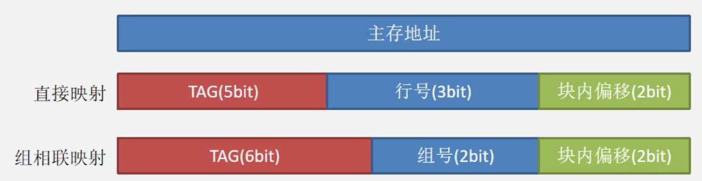
</div>

&emsp;&emsp;&ensp;给组相联映射做地址划分时，先确定**块内偏移**占用的 ${bit}$ 数，在根据几路组相联确定出组号占用的 ${bit}$ 数。用 ${地址长度-组号-块偏移=TAG标记}$。

&emsp;&emsp;&ensp;组相联映射计算简述：

1. 根据主存地址确定其归属的组号；
2. 将主存 ${TAG}$ 字段与该组中全部的标记阵列做比较，若发现某一个标记与 ${TAG}$ 一致，且有效位为 ${1}$ 则命中；
3. 命中后，将块偏移给到多路选择器，用于选择具体的数据。

&emsp;&emsp;&ensp;例题：若 ${CPU}$ 给出的主存地址为 ${1011011001}$，按字节编址。${Cache}$ 数据区容量为 ${32B}$，${Cache}$ 行大小为 ${4B}$ ，采用两路组相联形式。

1. 根据主存地址 ${1011011001}$ 确定其组号 ${10}$。
2. 将主存 ${TAG}$ 字段 ${2DH}$ 与该组中全部的标记阵列做比较，若发现某一个标记与 ${TAG}$ 一致，且有效位为 ${1}$ 则命中。
3. 命中后，将块偏移给到多路选择器，用于选择具体的数据。

&emsp;&emsp;&ensp;注意：

1. 组相联映射虽然把几个 ${Cache}$ 行拼接成了一个 ${Cache}$ 组，但是主存地址的** ${TAG}$ 字段并未减少，反而增加了**。
2. 组相联中**比较器的个数与路数**有关，比如 ${4}$ 路组相联比较器就有四个。
3. 组相联若出现**组内需要替换**时，同样替换算法仍然采用随机替换或先进先出替换或 ${LRU}$ 替换。

&emsp;&emsp;&ensp;当组相联 ${Cache}$ 出现 ${Cache}$ 未命中时，其替换方式如下：
&emsp;&emsp;&ensp;例题：若 ${CPU}$ 给出的主存地址为 ${1011011001}$，**按字节编址**。${Cache}$ 数据区容量为 ${32B}$，${Cache}$ 行大小为 ${4B}$，采用两路组相联形式，替换算法采用 ${LRU}$ 算法替换。若是 ${2}$ 路组相连，则**算法替换位为 ${1bit}$**，若是 ${4}$ 路组相联，则**算法替换位占 ${2bit}$**。

<div style=" margin: 0 auto; max-width: 70%;">
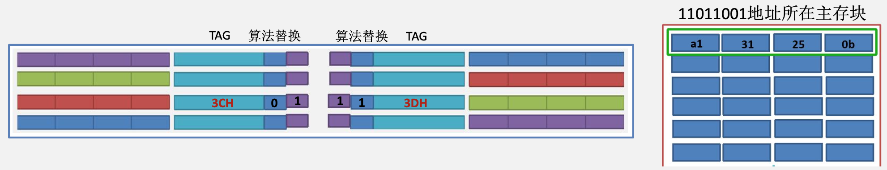
</div>

### 访问时间计算

&emsp;&emsp;&ensp;命中率（${hit\quad rate}$）：
&emsp;&emsp;&ensp;在访存过程中，需要判断所访问信息是否在 ${Cache}$ 中。若 ${CPU}$ 访问单元所在的块在 ${Cache}$ 中，则称 ${Cache}$ 命中（${hit}$），命中的概率称为命中率 ${p}$，它等于命中次数与访问总次数之比。
&emsp;&emsp;&ensp;缺失率（${miss\quad rate}$）：
&emsp;&emsp;&ensp;若不在 ${Cache}$ 中,则为不命中（${miss}$），其概率称为缺失率。它等于不命中次数与访问总次数之比。
&emsp;&emsp;&ensp;命中时 ${CPU}$ 在 ${Cache}$ 中直接存取信息，所用的时间开销就是 ${Cache}$ 访问时间 ${T_c}$，称为命中时间（${hit\quad time}$）。缺失时，需要从主存读取一个主存块送 ${Cache}$，并同时将所需信息送 ${CPU}$。所用的时间开销为主存访问时间 ${T_m}$。称为**缺失损失**。
&emsp;&emsp;&ensp;${CPU}$ 在 ${Cache}$-主存层次的平均访问时间为：${T_a=p\times T_c+(1-p)\times (T_m+T_c)=T_c+(1-p)\times T_m}$

## Cache写操作

### 全写法

&emsp;&emsp;&ensp;全写法（${write\quad through}$）的基本做法是：写操作时，若写命中则同时写 ${cache}$ 和主存；若写不命中，则有以下两种处理方式：

1. **写分配法（${write\quad allocate}$）**。先在**主存块中更新相应存储单元**，然后**分配一个 ${cache}$ 行**，将更新后的主存块装到分配的 ${cache}$ 行中。这种方式可以**充分利用空间局部性**，但每次写不命中都要从主存读一个块到 ${cache}$ 中，**增加了读主存块的开销**。
2. **非写分配法（${not\quad write\quad allocate}$）**。仅更新主存单元而**不装入主存块到 ${cache}$ 中**。这种方式可以**减少读入主存块的时间，但没有很好地利用空间局部性**。

### 回写法
&emsp;&emsp;&ensp;回写法（${write\quad back}$）的基本做法是：当 **${CPU}$ 执行写操作**时，若写命中则**信息只被写入 ${cache}$ 而不被写入主存**。若**写不命中则在 ${cache}$ 中分配一行，将主存块调入该 ${cache}$ 行中并更新相应单元的内容**。因此该方式下在写不命中时通常采用**写分配法进行写操作**。
&emsp;&emsp;&ensp;降低了主存带宽需求。为了减少写回主存块的开销，每个 ${cache}$ 行**设置了一个修改位也称“脏位”**。若修改位为 ${1}$，则说明对应 ${cache}$ 行中的主存块被修改过替换时**需要写回主存**。若修改位为 ${0}$ 则说明对应主存块未被修改过，替换时**无须写回主存**。

## 主存块传输过程

&emsp;&emsp;&ensp;如果内存条仅仅提供一个存储单元的数据给到 ${CPU}$ 的 ${MDR}$，那么无论是**顺序编址和交叉编址**，他们的区别并不大。
&emsp;&emsp;&ensp;真正让顺序编址和交叉编址产生影响的情形，是当带 ${Cache}$ 的 ${CPU}$ 出现 ${Cache\quad Miss}$ 时，主存**将存储单元所在的主存块中的全部数据** 给到 ${Cache}$。

&emsp;&emsp;&ensp;在主存和 ${cache}$ 之间传输的单位是**主存块**，须在主存、总线和 ${cache}$ 之间构建快速的传输通道。如果**未构建快速通道**，则从主存读一块数据到 ${cache}$，一般包含以下 ${3}$ 个阶段：
1. 发送地址和读命令到主存：假定用 ${1}$ 个时钟周期；
2. 主存准备好一个数据：假定用 ${10}$ 个时钟周期；
3. 从总线传送一个数据：假定用 ${1}$ 个时钟周期。
&emsp;&emsp;&ensp;连续进行“送地址-读出-传送”${4}$ 次，每次一个字，其缺失损失为 ${4\times(1+10+1)=48}$ 个时钟周期。

<div style=" margin: 0 auto; max-width: 70%;">
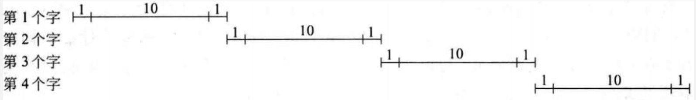
</div>

### 不使用顺序编址的原因
&emsp;&emsp;&ensp;可能的优化方案 ${1}$：
&emsp;&emsp;&ensp;将内存条中某个 ${DRAM}$ 芯片，一整行的数据都读入到行缓冲寄存器中，并将与内存条连接的数据线根数扩展到 ${32}$ 根。

<div style=" margin: 0 auto; max-width: 50%;">
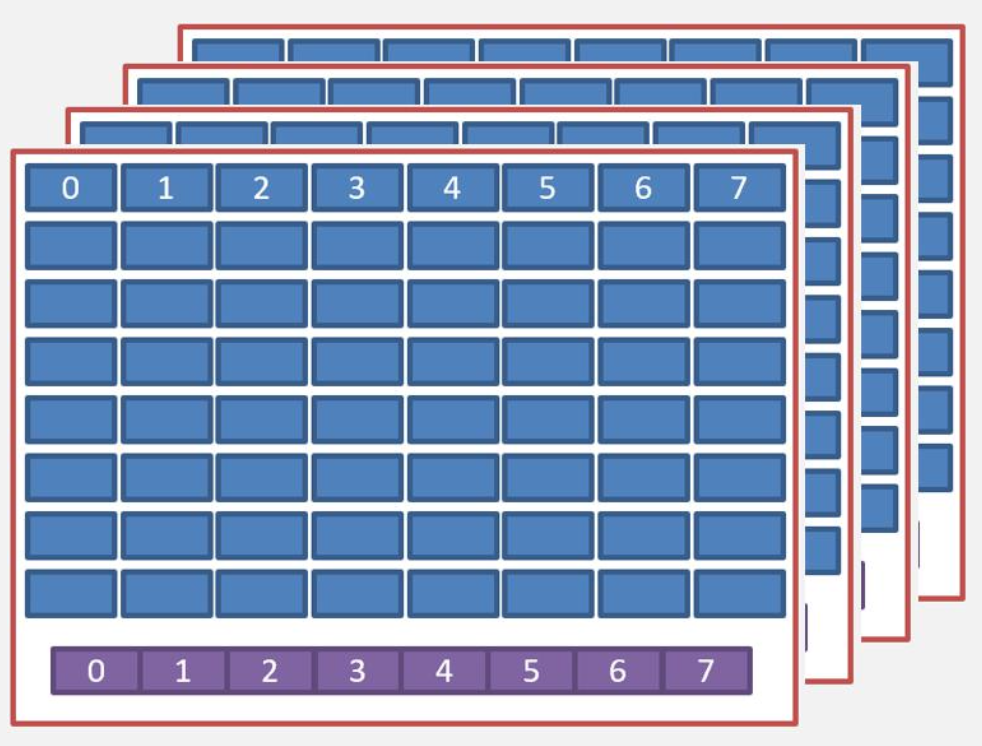
</div>

1. ${CPU}$ 能支持的数据线根数**在生产时就定好了**，不一定支持数据线根数的扩展。
2. 选择具体列号的硬件设计也复杂。

&emsp;&emsp;&ensp;可能的优化方案 ${2}$：
&emsp;&emsp;&ensp;将内存条中某个 ${DRAM}$ 芯片，仍保持数据线根数为8根，增加 ${DRAM}$ 的列控制信号，由原本的只给出1个列控制信号，变成给出4个列控制信号。并且控制信号按时序给出。

<div style=" margin: 0 auto; max-width: 50%;">
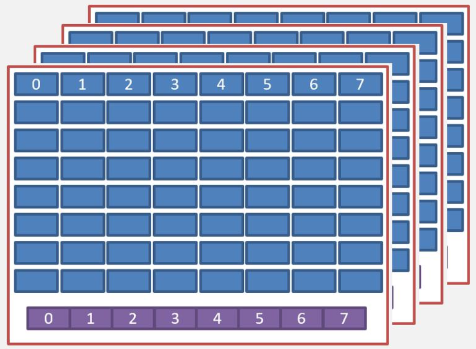
</div>

&emsp;&emsp;&ensp;若在传输数据时，恰巧进行一次行刷新，会导致行缓冲寄存器的数据丢失。

### 交叉编址方式传输主存块

&emsp;&emsp;&ensp;如果内存条采用交叉编址方式对存储单元进行编址，则可以通过以下两种方式传输一个主存块的数据：
1. 同时启动；
2. 轮流启动；
&emsp;&emsp;&ensp;例题：某内存条由4个 ${DRAM}$ 芯片构成。内存条的主存块大小为 ${4B}$，按字节编址。若内存条中的存储单元采用**交叉编址**，思考当出现 ${Cache\quad Miss}$ 时，内存条将主存块送到 ${Cache}$ 的过程。

<div style=" margin: 0 auto; max-width: 50%;">
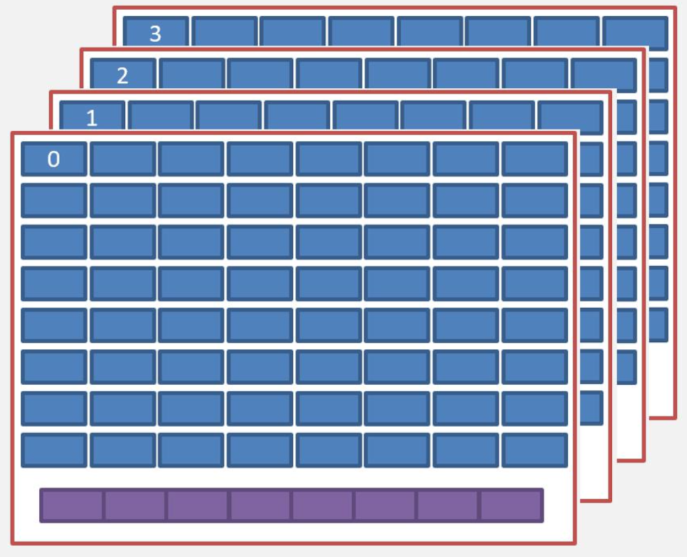
</div>

### 突发传送总线事务

&emsp;&emsp;&ensp;突发传送总线事务：突发传送总线事务方式下，总线能够进行**连续的成块数据传送**。传送开始时，先给出**主存块在存储器中的首地 址**，然后连续地传送主存块中的存储单元。一次突发传送总线事务的过程包括：
1. 送首地址和命令；
2. 存储器准备数据；
3. 总线传送数据。
&emsp;&emsp;&ensp;在多模块交叉编址的情况下，只要是进行主存块中数据的连续传送，会采用突发传送的方式。**突发传送即适用于同时启动，也适用于轮流启动**。

## 同时启动

&emsp;&emsp;&ensp;内存条中的存储单元采用交叉编址后，一个主存块上的存储单元，平均分布在每个存储体中。当出现 ${Cache\quad Miss}$ 时，**同时启动全部的存储体**。在经过**一个读出时间**后，**所有存储体将数据送到数据线上**。
&emsp;&emsp;&ensp;**读出时间 ${Tr}$：从存储器接到读命令开始到信息被送到数据线上所用的时间。**
&emsp;&emsp;&ensp;若 ${CPU}$ 访问 ${00000010}$ 存储单元时出现 ${Cache Mis}$，内存控制器将 ${000}$ 行广播到全部 ${DRAM}$ 芯片。每个 ${DRAM}$ 芯片将 ${0}$ 行送入到自己的行缓冲寄存器中。内存控制器在将0列广播到全部 ${DRAM}$ 芯片，每个 ${DRAM}$ 芯片从行缓冲寄存器的 ${0}$ 列将数据送到数据线上。
&emsp;&emsp;&ensp;由于同时启动方式在同一时刻启动的全部存储体。在经 过一个读出时间后，4个存储体上的数据同时送到数据线上。**数据线的根数必须和主存块的位数一致**。

## 轮流启动

&emsp;&emsp;&ensp;同时启动方式将所有存储体在同一时间启动。对于一个 ${4}$ 体交叉存储器，在采用同时启动的情况下，准备 ${4B}$ 的主存块数据只需要一个读出时间。缺点是需要 ${CPU}$ 支持 ${32}$ 根数据线。轮流启动对于同时启动的优化在于：轮流启动采用流水线的思想，通过**每隔一段时间**启动一个 ${DRAM}$ 芯片的方式从内存条读出主存块。

### 轮流启动间隔时间的计算

&emsp;&emsp;&ensp;若 ${DRAM}$ 芯片的读出时间为 ${40ns}$，内存条由 ${4}$ 个 ${DRAM}$ 芯片构成。则每隔 ${40/4=10ns}$ 启动一个 ${DRAM}$ 芯片。
&emsp;&emsp;&ensp;在 ${408}$ 中为了方便计算，题目一般会将总线从内存传输数据到 ${CPU}$ 的时间和 ${CPU}$ 将地址送到主存的之间，与间隔时间保持一致。
&emsp;&emsp;&ensp;若主存采用 ${4}$ 体交叉多模块存储器，按**字节编址**，读出周期为 ${40ns}$。主存块大小为 ${4B}$，总线中数据线的根数为 ${8}$ 根。总线在 ${CPU}$ 和主存之间传输一次数据和地址的时间均为 ${10ns}$ 。存储器采用轮流启动方式。则从 ${CPU}$ 访问存储单元产生 ${Cache\quad Miss}$，准备将地址信息送往主存开始，到主存块的数据送达 ${CPU}$ 的时间为多少?

<div style=" margin: 0 auto; max-width: 80%;">
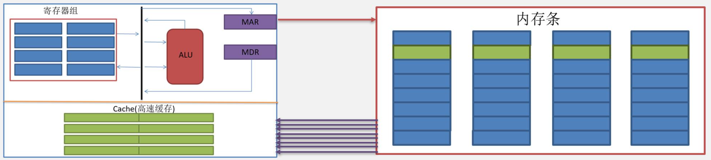
</div>

1. 在 ${0ns}$ 时刻，地址信息发往内存。在 ${10ns}$ 时刻，地址信息送到内存储器。
2. 在 ${10ns}$ 时刻主存收到地址信息后，确定存储单元所在的主存块，并启动在 ${10ns}$ 时刻启动 ${0}$ 号 ${DRAM}$ 芯片。在 ${10ns}$ 时刻启动的 ${0}$ 号 ${DRAM}$ 芯片，会在**一个读出时间**，即 ${40ns}$ 后的 ${50ns}$ 时刻将数据送到数据线上。
3. 在 ${10ns}$ 时刻启动 ${0}$ 号 ${DRAM}$ 芯片后，会在一个间隔时间，即 ${10ns}$ 后的 ${20ns}$ 时刻启动 ${1}$ 号 ${DRAM}$ 芯片。在 ${20ns}$ 时刻启动 ${1}$ 号 ${DRAM}$ 芯片，会在一个读出时间，即 ${40ns}$ 后的 ${60ns}$ 时刻将数据送到数据线上。以此类推。
4. 在 ${40ns}$ 时刻启动 ${3}$ 号 ${DRAM}$ 芯片，${0}$ 号 ${DRAM}$ 芯片会在 ${10ns}$ 后，即 ${50ns}$ 时刻结束一个读出时间。${0}$ 号 ${DRAM}$ 芯片的数据**送到数据线**。${0}$ 号 ${DRAM}$ 芯片在 ${50ns}$ 时刻完成一个读出时间，送数据到数据线。数据会在 ${10ns}$ 后，即 ${60ns}$ 时刻送达 ${CPU}$ 中的 ${Cache}$。以此类推。

<div style=" margin: 0 auto; max-width: 80%;">
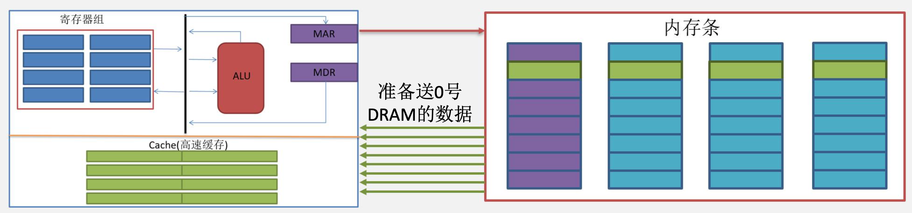
</div>

5. 在 ${80ns}$ 时刻，${3}$ 号 ${DRAM}$ 芯片完成一个读出时间。${3}$ 号 ${DRAM}$ 芯片的数据会在 ${10ns}$ 后，即 ${90ns}$ 时刻送入 ${CPU}$ 中的 ${Cache}$，总线完成一次数据传送。主存块的数据传输完成，结束突发传送总线事务。

<div style=" margin: 0 auto; max-width: 60%;">
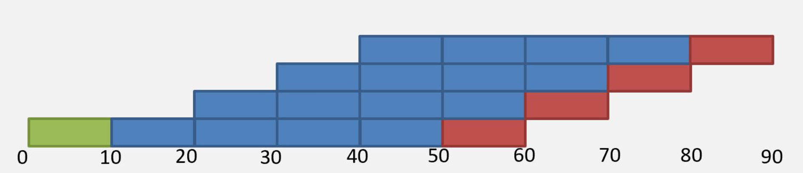
</div>

&emsp;&emsp;&ensp;注意：
&emsp;&emsp;&ensp;读出时间 ${Tr}$：从存储器接到读命令开始到信息被送到数据线上所用的时间。
&emsp;&emsp;&ensp;存储周期 ${Tm}$：指存储器进行一次读写操作所需要的全部时间，是存储器进行连续读写操作所允许的最短间隔时间。它等于访问时间加上下一次存取开始前所要求的附加时间。${Tm = Ta + 读出放大器和驱动电路恢复时间}$。
&emsp;&emsp;&ensp;按照袁书的说法，读出时间和存储周期相差一个电路恢复时间。但是在 ${408}$ 题目中，为了方便同学们计算，会将读出时间等于存储时间，忽略电路的恢复时间。


