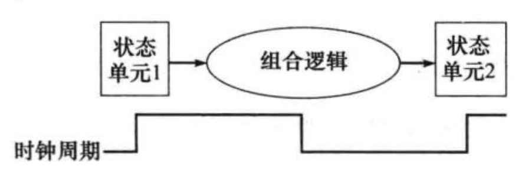
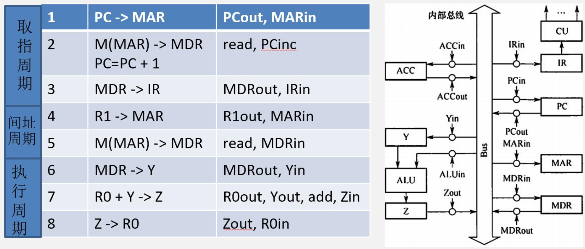
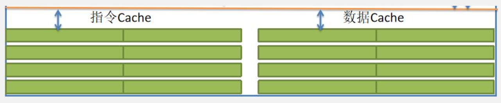
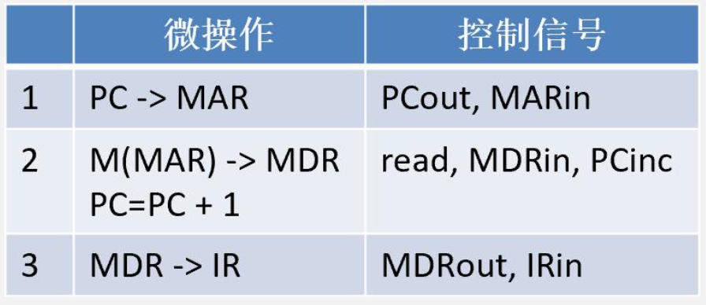
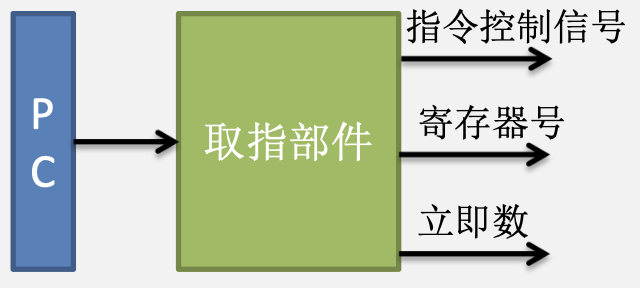
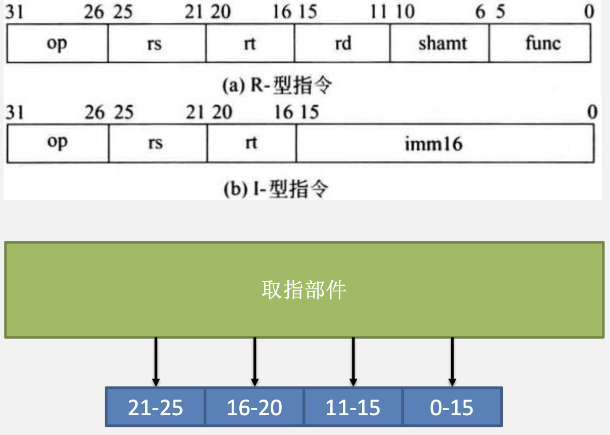
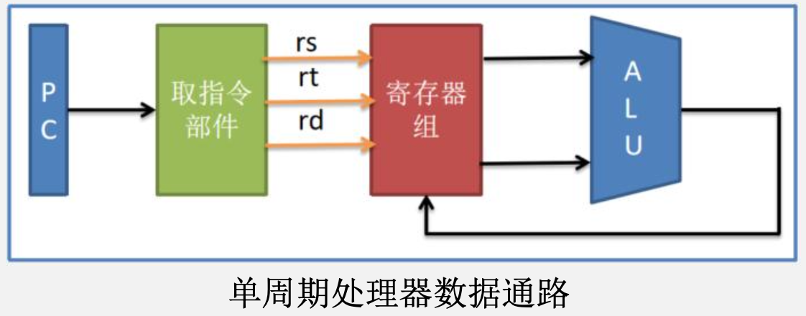
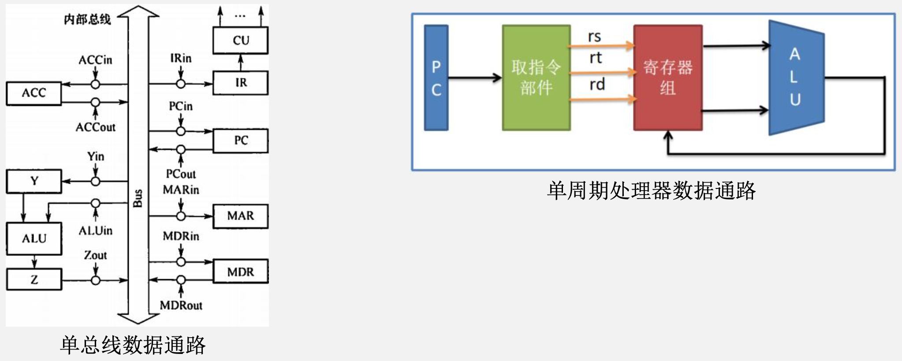
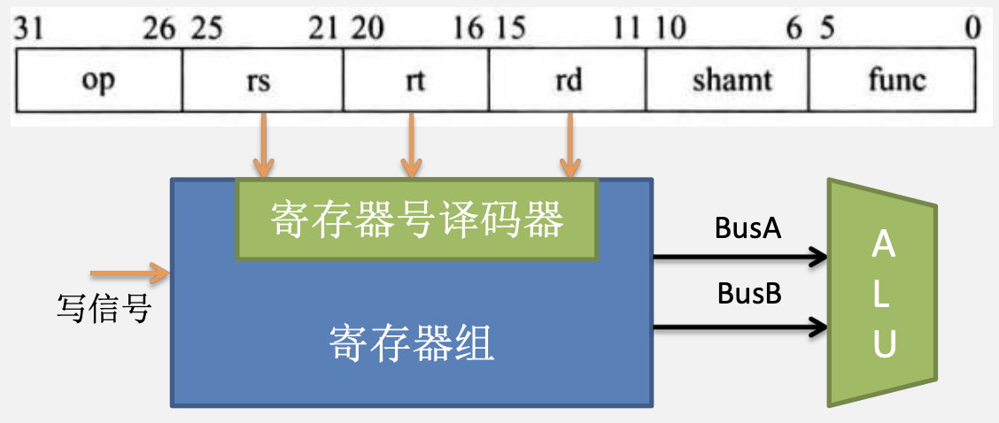

# 处理器

## 多周期处理器

### 逻辑单元

&emsp;&emsp;&ensp;时钟信号长度的确定：下图描述了一个组合逻辑单元及与其相连的两个状态单元。组合逻辑单元的操作在一个时钟周期内完成，所有信号在一个时钟周期内从状态单元1经组合逻辑到达状态单元2，**信号到达状态单元2所需的时间决定了时钟周期的长度**。

### 多周期处理器

&emsp;&emsp;&ensp;在考试中，多周期处理器往往采用单总线的冯诺依曼结构。以指令ADD R0，[R1]为例：多周期处理器中每个节拍需要一个时钟周期。

## 单周期处理器

&emsp;&emsp;&ensp;单周期处理器：通俗的说，就是该处理器一执行完任何一条指令的时间为1个时钟周期。
&emsp;&emsp;&ensp;R型指令:Add r1 r2 r3
&emsp;&emsp;&ensp;I型指令:Lw r3 r4 imm16 
&emsp;&emsp;&ensp;以上两条指令的指令周期均为1个时钟周期。
&emsp;&emsp;&ensp;由于单周期处理器访存指令和非访存指令的指令周期均为1个时钟周期，因此单周期处理器的时钟周期长度，由于包含访存时间的缘故会变得很长。
&emsp;&emsp;&ensp;按照时钟周期的定义，信号从一个状态单元经组合逻辑到达另一个状态单元。比如add r1，r2，r3指令，信号从第一个状态单元PC出发，最终的计算结果存入寄存器中。
&emsp;&emsp;&ensp;在取指令时，需要有一个访问指令Cache的操作。但受限于单周期处理器的整个数据通路中只可以存在**两个状态单元**，而指令地址从状态单元PC发出，因此单周期处理器的数据通路中只能在包含1个状态单元。若想满足 这个特点，**指令Cache就不能当作状态单元**。否则将无法满足单周期处理器的定义。
&emsp;&emsp;&ensp;为了解决这个问题。指令Cache被设计成只读的组合逻辑单元，CPU不能对指令Cache执行写操作，只能执行读 操作。

&emsp;&emsp;&ensp;由于指令存储器是只读的，因此单周期处理器将其设计为无须控制信号的控制，只要给出指令地址，经过一定的“取数时间”后，指令被送出。
在多周期处理器中，取值阶段根据PC的值将指令存入IR中。

在单周期处理器中，取指阶段并不会直接将指令输出。而是将指令译码后的控制信号，寄存器号以及立即数输出。

1. 指令与数据分离：对于单周期处理器，首先必须要具有独立的数据存储器和指令存储器。因为处理器在一个周期内只能操作每个部件一次，而在一个时钟周期内不可能对一个单端口存储器进行两次读写。 为了满足以上设计，计算机将指令Cache与数据Cache分离。当CPU需要指令时先访问指令Cache，需要数据时先访问数据Cache。
2. 数据通路的定义：通常将指令执行过程中数据所经过的路径，包括路径上的部件称为数据通路。ALU，通用寄存器，状态寄存器，cache，MMU，浮点运算逻辑，异常和中断处理逻辑等都是指令执行过程中数据流经的部件，都属于数据通路的一部分。数据通路由控制部件进行控制。控制部件根据每条指令功能的不同生成对数据通路的控制信号，并正确控制指令的执行流程。

3. 关于不能使用单总线数据通路的原因：如果是单总线结构，比如ADD R1 R2 R3指令的执行阶段，R2和R3的数据需要分两次传，一次把R1的数据放入暂存器，一次是把暂存器的数据和R2通过ALU做加法。所以想要实现指令周期为一个时钟周期，至少需要有三根总线，分别接R1和R2以及ALU才能做到。

4. 单周期处理器中的寄存器组：寄存器组在单周期处理器中，既允许执行读操作，也允许执行写操作。若执行读操作时，寄存器组当作组合逻辑部件。若需要写寄存器时，CPU给出写信号，寄存器组此时变成状态逻辑部件。
    寄存器组内部存在一个译码器，指令中的寄存器号会给到寄存器组中的译码器中。当译码器根据寄存器号，把对应的数据输出到BusA和BusB。

## 单周期处理器数据通路

## 流水线处理器

## 数据旁路技术