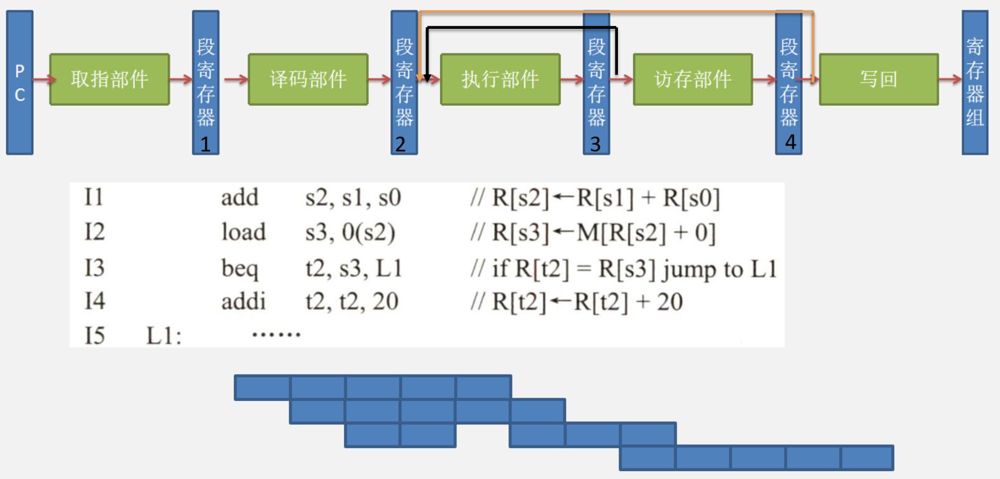

# 处理器

## 多周期处理器

### 逻辑单元

&emsp;&emsp;&ensp;时钟信号长度的确定：下图描述了一个组合逻辑单元及与其相连的两个状态单元。组合逻辑单元的操作在一个时钟周期内完成，所有信号在一个时钟周期内从状态单元1经组合逻辑到达状态单元2，**信号到达状态单元2所需的时间决定了时钟周期的长度**。

### 多周期处理器

&emsp;&emsp;&ensp;在考试中，多周期处理器往往采用单总线的冯诺依曼结构。以指令ADD R0，[R1]为例：多周期处理器中每个节拍需要一个时钟周期。

## 单周期处理器

&emsp;&emsp;&ensp;单周期处理器：通俗的说，就是该处理器一执行完任何一条指令的时间为1个时钟周期。
&emsp;&emsp;&ensp;R型指令： ${ADD\space R1\space R2\space R3}$ 
&emsp;&emsp;&ensp;I型指令： ${Lw\space r3\space r4\space imm16}$  
&emsp;&emsp;&ensp;以上两条指令的指令周期均为1个时钟周期。
&emsp;&emsp;&ensp;由于单周期处理器访存指令和非访存指令的指令周期均为1个时钟周期，因此单周期处理器的时钟周期长度，由于包含访存时间的缘故会变得很长。
&emsp;&emsp;&ensp;按照时钟周期的定义，信号从一个状态单元经组合逻辑到达另一个状态单元。比如 ${add\space r1\space r2\space r3}$ 指令，信号从第一个状态单元PC出发，最终的计算结果存入寄存器中。
&emsp;&emsp;&ensp;在取指令时，需要有一个访问指令 ${cache}$ 的操作。但受限于单周期处理器的整个数据通路中只可以存在**两个状态单元**，而指令地址从状态单元PC发出，因此单周期处理器的数据通路中只能在包含1个状态单元。若想满足 这个特点，**指令 ${cache}$ 就不能当作状态单元**。否则将无法满足单周期处理器的定义。
&emsp;&emsp;&ensp;为了解决这个问题。指令 ${cache}$ 被设计成只读的组合逻辑单元， ${CPU}$ 不能对指令 ${cache}$ 执行写操作，只能执行读 操作。

&emsp;&emsp;&ensp;由于指令存储器是只读的，因此单周期处理器将其设计为无须控制信号的控制，只要给出指令地址，经过一定的“取数时间”后，指令被送出。
&emsp;&emsp;&ensp;在多周期处理器中，取值阶段根据PC的值将指令存入IR中。

&emsp;&emsp;&ensp;在单周期处理器中，取指阶段并不会直接将指令输出。而是将指令译码后的控制信号，寄存器号以及立即数输出。

1. 指令与数据分离：对于单周期处理器，首先必须要具有独立的数据存储器和指令存储器。因为处理器在一个周期内只能操作每个部件一次，而在一个时钟周期内不可能对一个单端口存储器进行两次读写。为了满足以上设计，计算机将指令 ${cache}$ 与数据 ${cache}$ 分离。当 ${CPU}$ 需要指令时先访问指令 ${cache}$ ，需要数据时先访问数据 ${cache}$ 。
2. 数据通路的定义：通常将指令执行过程中数据所经过的路径，包括路径上的部件称为数据通路。ALU，通用寄存器，状态寄存器， ${cache}$ ，MMU，浮点运算逻辑，异常和中断处理逻辑等都是指令执行过程中数据流经的部件，都属于数据通路的一部分。数据通路由控制部件进行控制。控制部件根据每条指令功能的不同生成对数据通路的控制信号，并正确控制指令的执行流程。

3. 关于不能使用单总线数据通路的原因：如果是单总线结构，比如 ${ADD R1 R2 R3}$ 指令的执行阶段，R2和R3的数据需要分两次传，一次把R1的数据放入暂存器，一次是把暂存器的数据和R2通过ALU做加法。所以想要实现指令周期为一个时钟周期，至少需要有三根总线，分别接R1和R2以及ALU才能做到。

4. 单周期处理器中的寄存器组：寄存器组在单周期处理器中，既允许执行读操作，也允许执行写操作。若执行读操作时，寄存器组当作组合逻辑部件。若需要写寄存器时，${CPU}$ 给出写信号，寄存器组此时变成状态逻辑部件。
    寄存器组内部存在一个译码器，指令中的寄存器号会给到寄存器组中的译码器中。当译码器根据寄存器号，把对应的数据输出到BusA和BusB。

5. 单周期处理器的控制信号：由于单周期处理器的**指令周期为一个时钟周期**，所以单周期处理器在一个时钟周期内发出全部的控制信号，并且执行全部的控制信号。所以单周期处理器，**指令执行过程中控制信号不变**。
    多周期处理器在译码阶段生成全部的控制信号，间址阶段和执行阶段的控制信号是发生变化的。
    在间址阶段的控制信号，在到了执行阶段后，其控制信号会发生变化。

## 单周期处理器数据通路

&emsp;&emsp;&ensp;概述：由于单周期处理器在取指令时，并不会将指令取出，而是根据PC中的值，由取指部件经过一段取指时间后，直接输出指令的控制信号和需要的寄存器号，立即数等。所以后续对单周期处理器的讲解，主要围绕指令的执行过程的数据通路。

&emsp;&emsp;&ensp;R-型指令 ${ADD\space Rd\space Rs\space Rt}$ 执行过程数据通路的设计：数据通路之中的组成部件有:寄存器组，ALU 由于R型指令要写回寄存器，所以指令要给出寄存器写（RegWr）信号。ALU控制信号（ALUctr）为add。
&emsp;&emsp;&ensp; ${ADD\space Rd\space Rs\space Rt}$ 指令执行过程的控制信号为：
&emsp;&emsp;&ensp;${ALUctr:add}$，${RegWr:1}$
&emsp;&emsp;&ensp;R-型指令的执行过程，数据在数据通路中的执行路径：
&emsp;&emsp;&ensp; ${Registers(Rs,Rt)→busA}$， ${busB→ALU→Registers(Rd)}$
&emsp;&emsp;&ensp;注意：寄存器堆的读操作，被设计成自动执行的操作，不需要其他的控制信号。但是写寄存器必须明确写控制信号。

&emsp;&emsp;&ensp;I-型指令 ${ADDI\space Rt\space Rs\space imm16}$ 执行周期的数据通路设计：
&emsp;&emsp;&ensp;${Rs + SignExt(imm16) \to Rt}$。
&emsp;&emsp;&ensp;数据通路之中的组成部件有：
&emsp;&emsp;&ensp;寄存器组，ALU，扩展器，两路选择器
&emsp;&emsp;&ensp;由于指令 ${addi}$ 需要将寄存器的值与立即数相加，所以**需要在数据通路中添加一个扩展器从而进行符号扩展**。并且，需要将扩展器和busB通过一个**二路选择器相连**。
&emsp;&emsp;&ensp;所以指令要给出寄存器写（${RegWr}$）信号。ALU控制信号（${ALUctr}$）为addu（${addi}$）。扩展器信号（${ExtOp}$）和二路选择器控制信号（${ALUSrc}$）。

&emsp;&emsp;&ensp;${ADDI\space Rt\space Rs\space imm16}$ 指令执行过程的控制信号为：
&emsp;&emsp;&ensp;${ExtOp:1}$，${ALUSrc:1}$，${ALUctr:addi}$，${RegDst:1}$，${RegWr:1}$
&emsp;&emsp;&ensp;数据在数据通路中的执行路径为：
&emsp;&emsp;&ensp; ${Registers(Rs)->busA}$，${扩展器(imm16)→ALU(addi)→Registers(Rt)}$

&emsp;&emsp;&ensp;若在该数据通路上执行**R型**指令 ${ADD\space Rd\space Rs\space Rt}$ ，其执行周期的控制信号为：
&emsp;&emsp;&ensp;${ExtOp:0}$，${ALUSrc:0}$，${ALUctr:add}$，${RegWr:1}$，${RegDst:0}$
&emsp;&emsp;&ensp;数据在数据通路中的执行路径：
&emsp;&emsp;&ensp; ${Registers(Rs,Rt)→busA}$， ${busB→ALU→Registers(Rd)}$
&emsp;&emsp;&ensp;此处RegDst信号的作用是用于区分R型指令和I型指令对于**目的寄存器的二路选择**。若是为R型指令，则该信号值为0，此时选择rd作为Rw的目标；若是I型指令，则该信号值为1，此时选择rt寄存器作为Rw的目标。

&emsp;&emsp;&ensp;单周期处理器的不足：单周期处理器的数据通路中，除了存在有效的数据流，还**同时有无效的数据流**。这是单周期处理器本身无法避免的一个缺陷。比如I型指令是不需要提供rt寄存器的值输入到busB上，但由于在**读寄存器组时为自动读取，并无控制信号**。所以rt中的数据也会随之输送到busB上，这部分数据流就是**无效数据流**。

&emsp;&emsp;&ensp;I-型指令 ${Load\space Rt\space Rs\space imm16}$ 执行过程的数据通路：
&emsp;&emsp;&ensp;${Mem[Rs+SignExt(imm16)]->Rt}$
&emsp;&emsp;&ensp;Load指令的功能是**将扩展后的立即数与源寄存器中的值相加得到有效地址**，根据有效地址访问存储器将操作数读出并存入目的寄存器之中。
&emsp;&emsp;&ensp;为了实现Load指令，数据通路中需要新增的部件为一个**数据存储器**和一个**二路选择器**。其中数据存储器若执行读操作则仍然属于组合逻辑部件。若执行写操作，给出主存写信号（MemWr），此时数据存储器变成**状态逻辑部件**。
&emsp;&emsp;&ensp;${Load\space Rt\space Rs\space imm16}$ 指令功能的控制信号为：
&emsp;&emsp;&ensp;${RegDst:1}$，${ExtOp:1}$，${ALUSrc:1}$，${ALUctr:addi}$，${MemWr:0}$，${MemtoReg:1}$，${RegWr:1}$
&emsp;&emsp;&ensp;Load指令的数据在数据通路中的执行路径为：
&emsp;&emsp;&ensp;${Registers(Rs)→busA}$，${扩展器(imm16)→ALU(addi)→数据存储器→Registers(Rt)}$
&emsp;&emsp;&ensp;虽然Load指令把busA中的数据和imm16在ALU中相加得到有效地址，但寄存器组在译码时仍会将rt译码并将其中的操作数送到busB，在busB上接一个引线将rt中的操作数送入数据寄存器。
&emsp;&emsp;&ensp;对于Load指令的数据通路，rt中的数据仍然会输出到busB之上。并且数据存储器对于ALU的输出，无论输出的是主存地址，还是两个数据的相加的值，数据存储器都会将其看作为主存地址，并将对应地址中的数据读出。

&emsp;&emsp;&ensp; ${ADD\space Rd\space Rs\space Rt}$ 指令执行周期的控制信号为：
&emsp;&emsp;&ensp;${ExtOp:0}$，${ALUSrc:0}$，${ALUctr:add}$，${RegWr:1}$，${RegDst:0}$，${MemWr:0}$，${MemtoReg:0}$
&emsp;&emsp;&ensp;ADD指令的执行周期，数据在数据通路中的执行路径：
&emsp;&emsp;&ensp; ${Registers(Rs,Rt)→busA}$， ${busB→ALU→Registers(Rd)}$
&emsp;&emsp;&ensp;ADD指令的计算结果会从ALU输出。这个结果也会被当作成主存地址，并且**数据存储器会将地址中的数读出**。
&emsp;&emsp;&ensp;这个操作是十分危险，却无法避免的。因为数据寄存器的Adr并不知道ALU输出的是地址还是计算结果，只会机械的将所有ALU输出的值当作主存地址，并将对应的数据读出。

&emsp;&emsp;&ensp;${ADDI\space Rt\space Rs\space imm16}$ 指令执行周期的控制信号为：
&emsp;&emsp;&ensp;${ExtOp:1}$，${ALUSrc:1}$，${ALUctr:addi}$，${RegDst:1}$，${RegWr:1}$，${MemWr:0}$，${MemtoReg:0}$
&emsp;&emsp;&ensp;ADDi指令的执行周期，数据在数据通路中的执行路径：
&emsp;&emsp;&ensp; ${Registers(Rs)\to busA}$，${扩展器(imm16)→ALU(addi)→Registers(Rt)}$

&emsp;&emsp;&ensp;I-型指令 ${Store\space Rt\space Rs\space imm16}$ 执行过程的数据通路设计：
&emsp;&emsp;&ensp; ${Rt \to Mem[Rs + SignExt(imm16)]}$ 
&emsp;&emsp;&ensp;Store指令的功能是将扩展后的立即数与rs寄存器中的值相加得到主存地址，rt寄存器中的数据写入到主存地址中。
&emsp;&emsp;&ensp; ${Store\space Rt\space Rs\space imm16}$ 指令执行周期的控制信号为：
&emsp;&emsp;&ensp;${RegWr:0}$，${RegDst:x}$，${ExtOp:1}$，${ALUSrc:1}$，${ALUctr:addi}$，${MemWr:1}$，${MemtoReg:x}$
&emsp;&emsp;&ensp;由于Store指令并没有写寄存器的操作，所以对于MemtoReg信号的取值，**取1还是取0都不会影响结果**。
&emsp;&emsp;&ensp;Store指令中rs寄存器的值会输入到busA，rt寄存器的值会输入busB，最终到达**数据存储器**。

&emsp;&emsp;&ensp;I-型分支指令 ${beq\space Rs\space Rt\space imm16}$ 执行周期的数据通路设计：
&emsp;&emsp;&ensp;${if(rs-rt = 0) pc = pc + imm16*4}$
&emsp;&emsp;&ensp;beq指令功能是对比rs和rt寄存器的值。如果相等则执行跳转操作。
&emsp;&emsp;&ensp;beq指令的数据通路实际上只用于比较rs和rt寄存器中值的大小即可。并根据branch信号来确定是否跳转。若 ${branch = 1}$ 则跳转。${branch = 0}$ 则顺序执行。此比较过程都在取指部件中完成（即ALU右上方的一大坨部件），不属于数据通路，因此不需要太多考虑。

## 流水线处理器

### 指令流水线

&emsp;&emsp;&ensp;单周期处理器和多周期处理器都是采用**串行方式**，这种串行方式下，${CPU}$ 总是在执行完一条指令后才取出下一条指令执行。这种串行方式没有充分利用执行部件的**并行性**，因而指令执行效率低。指令的执行也可以采用流水线方式将多条指令的执行相互重叠起来，以提高 ${CPU}$ 执行指令的效率。采用这种方式的 ${CPU}$ 称为指令流水线 ${CPU}$。
&emsp;&emsp;&ensp;取指（IF）：从指令存储器或 ${cache}$ 中取指令。
&emsp;&emsp;&ensp;译码/读寄存器（ID）：操作控制器对指令进行译码，同时从根据寄存器号从寄存器组中取出操作数。
&emsp;&emsp;&ensp;执行/计算地址（EX）：执行运算操作或计算地址。
&emsp;&emsp;&ensp;访存（MEM）：对存储器进行读写操作。**其中J型指令和beq指令在这个阶段彻底更新PC的值（袁书）**。
&emsp;&emsp;&ensp;写回（WB）：将指令执行结果写回寄存器组。

### 指令流水段的功能

#### Ifetch（IF）段

&emsp;&emsp;&ensp;IF流水段的功能是：将PC的值作为地址到取指部件中**取指令**，同时需要对PC进行自增操作，新PC的值送PC输入端。这些功能由**取指部件来完成**。
&emsp;&emsp;&ensp;IF段执行的结果被送到IF/ID段寄存器的输入端，下一个时钟到来时，在IF/ID寄存器输入端的信息开始送到ID段继续被处理。
&emsp;&emsp;&ensp;这些结果分别是：

1. 从取指部件中取出的指令。
2. 如果当前指令是分支指令，则**分支指令的返回地址也需要保存在IF/ID寄存器中**。

#### Reg/Dec（ID） 段

&emsp;&emsp;&ensp;ID流水段的功能是：

1. 根据指令中的Rs，Rt和Rd的值（如果是I型就只有Rs和Rt）到**寄存器堆中**取出相应寄存器的值。
2. 对指令中的操作码op字段进行**译码**，生成相应的控制信号（如果是R型还要根据func字段）。

&emsp;&emsp;&ensp;ID段执行的**结果**被送到**ID/Ex寄存器的输入端**，下一个时钟到来时，在ID/Ex寄存器输入端的信息开始送到Ex段继续被处理。因为指令中需要的信息已被保存，所以**指令本身就不再需要保存**。

#### Exec（Ex）段

&emsp;&emsp;&ensp;Ex段的功能由具体指令确定，不同指令经ID段译码后得到不同的控制信号，用来控制执行部件进行不同的操作。

1) R-型指令。在ALU中对busA和busB传递来的数据**执行相应的运算**，运算结果送ALUout，并产生相应的标志信息Zero和Overflow。
2) I-型运算类指令。在ALU中对立即数**扩展后的数据**与busA传递来的数据执行相应的运算，运算结果送ALUout，并产生相应的标志信息Zero和Overflow。
3) lw/sw指令。在ALU中对立即数符号扩展后的数据与busA传递来的数据执行**加法运算**，得到存储器地址送ALUout。
4) beq指令。**在ALU中对busA和busB传递来的数据执行减法运算，得到Zero标志。同时，对立即数进行符号扩展后，在加法器中与“PC+4”相加,得到转移目标地址。**
5) j指令。生成转移目标地址。

#### Mem（访存）段

1) 若是R-型指令或I-型运算类指令，则在Mem段是**“空”操**，只要把相应信息继续传递到下一个流水段即可。
2) 若是 ${lw}$ 指令，则进行**取数操作**。在Ex段得到的地址被送到数据存储器的**读地址端**，经过一段存取时间，数据从数据存储器的输出端送到**Mem/Wr寄存器的输入端**。
3) 若是sw指令，则进行**存数操作**。在Ex段得到的地址被送到数据存储器的写地址端，同时把Ex/Mem寄存器送来的要存的数据送到数据存储器的**输入端**。经过一段存取时间后，**数据被存入数据存储器中**。
4) 若是beq或j指令，则将Ex段生成的转移目标地址更新到PC中。**若是beq指令，则生成Branch=1，MemWr=0。此时，若在Ex段生成的Zero为1，则会控制PC输入端的多路选择器选择将转移目标地址送PC的输入端。**

#### Wr（写回寄存器）段

&emsp;&emsp;&ensp;寄存器写，是Wr段的主要功能。

1) 若是R-型指令或I-型运算类指令，则选择将**ALU的输出结果**送寄存器堆的输入端。
2) 若是 ${lw}$ 指令，则选择将**数据存储器读出结果**送寄存器堆的输入端，并准备写入寄存器中。
3) 若是sw、beq或j指令，则**任何寄存器的值都不改变**，即不能写寄存器。

### 流水线处理器的控制信号

&emsp;&emsp;&ensp;相比于单周期处理器在一个时钟周期内生成全部的控制信号并**执行全部的控制信号**，流水线处理器实际上就是在ID阶段生成控制信号，在后续的其他阶段内**分别执行这些控制信号**。

&emsp;&emsp;&ensp;${ADD\space Rd\space Rs\space Rt}$ 在**单周期处理器下**，指令执行周期的控制信号为：
&emsp;&emsp;&ensp;${RegWr:1}$，${ExtOp:0}$，${ALUSrc:0}$，${ALUctr:add}$，${RegDst:0}$，${MemWr:0}$，${MemtoReg:0}$，${Branch:0}$
&emsp;&emsp;&ensp;单周期处理器控制信号图：

&emsp;&emsp;&ensp;**流水线方式下**，每个阶段的控制信号：
&emsp;&emsp;&ensp;${IF}$ 阶段：无
&emsp;&emsp;&ensp;${ID}$ 阶段：无
&emsp;&emsp;&ensp;${EX}$ 阶段：执行操作数的计算
&emsp;&emsp;&ensp;${ExtOp:0}$，${ALUSrc:0}$，${ALUop:add}$，${RegDst:0}$，${R-type:1}$
&emsp;&emsp;&ensp;${Mem}$ 阶段：${MemWr:0}$，${Branch:0}$
&emsp;&emsp;&ensp;${Wr}$ 阶段：${MemtoReg:0}$，${RegWr:1}$
&emsp;&emsp;&ensp;其中，${R-type}$ 用于指示**是否为R型指令**。
&emsp;&emsp;&ensp;流水线处理器的控制信号图：

&emsp;&emsp;&ensp;${ADDi\space Rt\space Rs\space imm16}$ 指令在单周期处理器下指令执行周期的控制信号为：
&emsp;&emsp;&ensp;${ExtOp:1}$，${ALUSrc:1}$，${ALUctr:addi}$，${RegDst:1}$，${RegWr:1}$，${MemWr:0}$，${MemtoReg:0}$，${Branch:0}$
&emsp;&emsp;&ensp;单周期处理器控制信号图：

&emsp;&emsp;&ensp;流水线方式下的控制信号：
&emsp;&emsp;&ensp;${IF}$ 阶段：无
&emsp;&emsp;&ensp;${ID}$ 阶段：无
&emsp;&emsp;&ensp;${EX}$ 阶段：将立即数和寄存器中的操作数进行计算。
&emsp;&emsp;&ensp;${ExtOp:1}$，${ALUSrc:1}$，${ALUctr:addi}$，${RegDst:1}$，${R-type:0}$
&emsp;&emsp;&ensp;${Mem}$ 阶段：无操作 
&emsp;&emsp;&ensp;${MemWr:0}$，${Branch:0}$
&emsp;&emsp;&ensp;Wr阶段：结果写入寄存器
&emsp;&emsp;&ensp;${MemtoReg:0}$，${RegWr:1}$

&emsp;&emsp;&ensp;${Load\space Rt\space Rs\space imm16}$ 指令在单周期处理器下，执行周期的控制信号为：
&emsp;&emsp;&ensp;${RegDst:1}$，${ExtOp:1}$，${ALUSrc:1}$，${ALUctr:addi}$，${MemWr:0}$，${MemtoReg:1}$，${RegWr:1}$，${Branch:0}$
&emsp;&emsp;&ensp;单周期处理器控制信号图：

&emsp;&emsp;&ensp;流水线方式下的控制信号
&emsp;&emsp;&ensp;${IF}$ 阶段：无
&emsp;&emsp;&ensp;${ID}$ 阶段：无
&emsp;&emsp;&ensp;${EX}$ 阶段：计算主存地址
&emsp;&emsp;&ensp;${ExtOp:1}$，${ALUSrc:1}$，${ALUctr:addi}$，${RegDst:1}$，${R-type:0}$
&emsp;&emsp;&ensp;${Mem}$ 阶段：读出操作数
&emsp;&emsp;&ensp;${MemWr:0}$，${Branch:0}$
&emsp;&emsp;&ensp;Wr阶段：写回寄存器
&emsp;&emsp;&ensp;${MemtoReg:1}$，${RegWr:1}$

&emsp;&emsp;&ensp; ${Store\space Rt\space Rs\space imm16}$ 指令在单周期处理器下执行周期的控制信号为：
&emsp;&emsp;&ensp;${RegWr:0}$，${RegDst:x}$，${ExtOp:1}$，${ALUSrc:1}$，${ALUctr:addi}$，${MemWr:1}$，${MemtoReg:x}$，${Branch:0}$
&emsp;&emsp;&ensp;单周期处理器控制信号图：

&emsp;&emsp;&ensp;流水线方式下的控制信号
&emsp;&emsp;&ensp;${IF}$ 阶段：无
&emsp;&emsp;&ensp;${ID}$ 阶段：无
&emsp;&emsp;&ensp;${EX}$ 阶段：${ExtOp:1}$，${ALUSrc:1}$，${ALUctr:addi}$，${RegDst:x}$，${R-type:0}$
&emsp;&emsp;&ensp;${Mem}$ 阶段：${MemWr:1}$，${Branch:0}$
&emsp;&emsp;&ensp;${Wr}$ 阶段：${MemtoReg:x}$，${RegWr:0}$

&emsp;&emsp;&ensp;${beq}$ 指令在单周期处理器下执行周期的控制信号为：
&emsp;&emsp;&ensp;${Branch=1}$，${RegDst= x}$，${ALUsrc= 0}$，${ALUctr=subi}$，${MemtoReg= x}$，${RegWr=0}$，${MemWr=0}$，${ExtOp= 0}$。
&emsp;&emsp;&ensp;单周期处理器控制信号图：

&emsp;&emsp;&ensp;流水线方式下的控制信号
&emsp;&emsp;&ensp;${IF}$ 阶段：无
&emsp;&emsp;&ensp;${ID}$ 阶段：无
&emsp;&emsp;&ensp;${EX}$ 阶段：${ExtOp:0}$，${ALUSrc:0}$，${ALUctr:subi}$，${RegDst:x}$，${R-type:0}$
&emsp;&emsp;&ensp;${Mem}$ 阶段：${MemWr:0}$，${Branch:1}$
&emsp;&emsp;&ensp;${Wr}$ 阶段：${MemtoReg:x}$，${RegWr:0}$

## 数据旁路技术

&emsp;&emsp;&ensp;数据冒险：也称为**数据相关**，引起数据冒险的原因在于后面指令用到前面指令结果时前面指令结果还没有产生。对于数据冒险，可以采取以下几个措施。

1. 插入空操作指令/插入气泡
2. 采用转发技术（数据旁路技术）

&emsp;&emsp;&ensp;数据旁路技术一般有以下两种实现方式：

1. 将数据通路中生成的中间数据**直接转发到另一流水段的输入端**。
2. 将寄存器的写和读分别控制在**前，后半个时钟周期解决**。前半个时钟周期执行写操作，后半个时钟周期执行读操作。

### load-use冒险及其处理

&emsp;&emsp;&ensp;转发能够解决大部分 ${RAW}$ 数据冒险，但有一种情况**无法很好的用转发方式解决**，即 ${load-use}$ 数据冒险。${load-use}$ 冒险是在 ${lw}$ 指令随后跟R-型指令或I-型运算类指令导致的。

