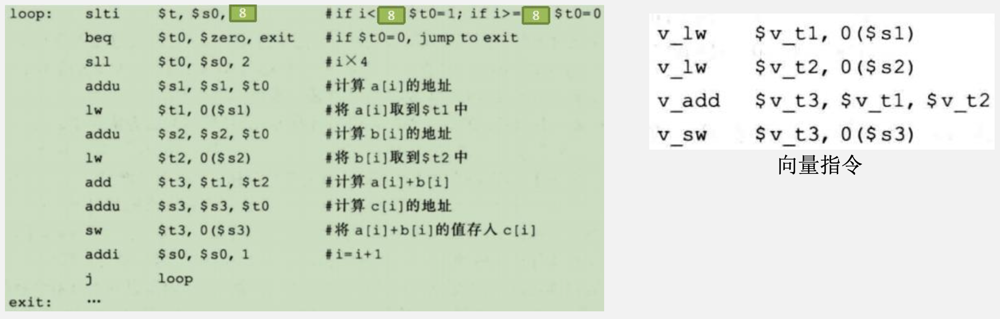
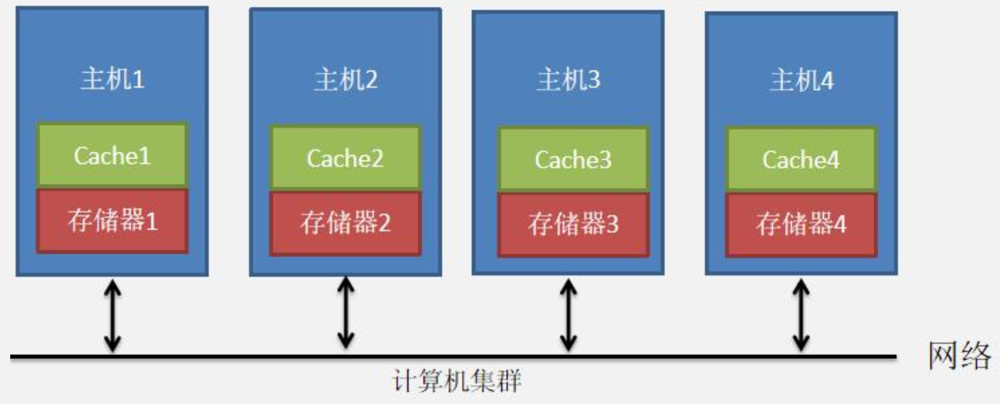
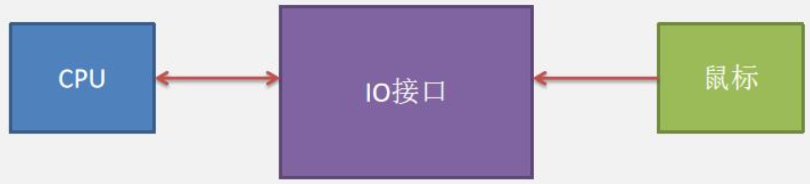

# 多处理器与IO

## Flynn分类介绍

### 并行计算

&emsp;&emsp;&ensp;并行计算要学什么：
&emsp;&emsp;&ensp;并行计算部分实际上就是学习2种并行计算处理器的划分方式：
1. Flynn分类方式（重点）
   1. 单指令流单数据流处理器（SISD）
   2. 单指令流多数据流处理器（SIMD）
   3. 多指令流多数据流处理器（MIMD）：按处理单元的位置进行划分
      1. 多核芯片
      2. 对称多处理器SMP
      3. 大规模并行处理器MMP
2. 按存储时间是否一致划分
   1. 一致性内存访问结构（UMA）
   2. 非一致性内存访问结构（NUMA）

### Flynn分类

&emsp;&emsp;&ensp;1966年，斯坦福大学的MichaelJ.Flynn教授提出了按照指令和数据的处理方式进行划分的Flynn分类法，将计算机体系结构分成以下4种。
1) 单指令流单数据流（SISD）结构处理器：SISD（Single Instruction stream and Single Data stream）是传统的串行计算机处理方式，这种计算机通常仅包含一个处理器和一个存储器，处理器在一段时间内仅执行一条指令流，按指令流规定的顺序串行完成指令流中若干条指令的执行，并且每条指令最多仅对两个数据（双目运算）或一个数据（单目运算）进行处理。
2) 单指令流多数据流（SIMD）结构处理器：SIMD（Single Instruction stream and Multiple Data stream）指一个指令流同时对多个数据流进行处理，这种结构的计算机通常由**一个指令控制部件多个处理单元和多个存储器组成**。各处理单元和各存储器之间通过系统内部的互 连网络进行通信。在程序执行过程中，指令控制部件执行的还是一个串行的指令流，所有处于执行状态的处理单元同时执行相同的指令，所需的数据从连接在各个处理单元上专用的局部存储器中取得，因此，不同处理单元执行的同一条指令所处理的数据是不同的。
3) 多指令流单数据流（MISD）结构处理器：MISD（ Multiple Instruction stream and Single Data stream）指在同一时刻有多个指令在执行，并且处理的是同一个数据。这种方式实际上很少出现，仅作为一种理论模型提出，在现实中这种工作方式的计算机根本不存在。
4) 多指令流多数据流（MIMD）结构处理器：MIMD（ Multiple Instruction stream and Multiple Data stream）指同时有多个指令分别处理多个不同的数据。这种系统中一定包含有多个计算机或多个处理器。MIMD方式是目前大多数并行处理计算系统的处理方式。

### Flynn分类的使用场景

1) 单指令流单数据流（SISD）的应用：在1980年左右，计算机中只有一个CPU，CPU中也只包含一条流水线。这种CPU采用SISD的设计方式。

<div style=" margin: 0 auto; max-width: 90%;">

</div>

2) 单指令流多数据流（SIMD）的应用随着图像计算的普及，早期的图像计算，如卷积等计算，需要大量的数组运算。比如将主存中的数组a[0]- a[127]和数组b[0]-b[127]相加结果存入c[0]-c[127]。如果采用SISD的设计思路，需要取数128*2=256次，执行加法 操作128次，执行写数128次。这样速度是非常慢的。在1990年左右推出图像卡用于图像计算。图像卡采用SIMD的设计思路。图像卡就是GPU的早期产品。

&emsp;&emsp;&ensp;CPU中的核是什么：核是一个简单的处理器，包含高速缓存、TLB、MMU、指令预取部件和相应的指令执行功能部件。能够独立执行指令序列。
&emsp;&emsp;&ensp;也就是说，一个核实际上就是一个简单的CPU。

<div style=" margin: 0 auto; max-width: 40%;">

</div>

3) 多指令流多数据流（MIMD）的应用进入21世纪，携带多核CPU的电脑出现。多核CPU的电脑在硬件上存在多个单核，每个单核实际上就相当于一个简单的CPU。多个单核CPU可以同时处理多个指令，这就是MIMD的设计思路。
    目前大型集群，也采用MIMD方式。大型集群中多个主机构成一个完整的逻辑主机，集群中的主机相当于逻辑主机中的多个核。

<div style=" margin: 0 auto; max-width: 60%;">

</div>

<div style=" margin: 0 auto; max-width: 40%;">

</div>

&emsp;&emsp;&ensp;由于多核计算机中有多个核，每个核中有自己独立的流水线。所以一个多核计算机中相当于可以多个流水线同时执行。所以一个多核计算机从流水线的角度看，实际上就是一个超标量流水线。

<div style=" margin: 0 auto; max-width: 40%;">

</div>

## SIMD方式与向量处理器

### SIMD处理器

&emsp;&emsp;&ensp;SIMD结构的处理器，目的主要为了解决单核处理器计算时，执行指令多，计算速度慢的问题。
&emsp;&emsp;&ensp;对于执行C语言:for(int i=0; i<8; i++) c[i] = a[i] + b[i];
&emsp;&emsp;&ensp;如果是传统的单核CPU，需要很多条指令以及8次循环，如果一个采用SIMD的图像卡，在进行for(int i=0; i<8; i++)c[i] = a[i] + b[i];只需要执行4条向量指令即可。

<div style=" margin: 0 auto; max-width: 80%;">

</div>

&emsp;&emsp;&ensp;向量寄存器与向量存储方式 早期图像卡在进行图像计算时，需要大量的数据运算。比如将主存中的数组a[0]-a[7]和数组b[0]-b[7]相加结果存 入c[0]-c[7]。C语言为for(int i=0; i<8; i++) c[i] = a[i] + b[i];为了提高上述C语言的计算速度，图像卡采用向量向量寄存器进行加法计算。采用向量指令进行存取数据和加法运算。
&emsp;&emsp;&ensp;向量寄存器：我们前面的知识学习的寄存器，以32位计算机为例，其寄存器的大小为32bit。向量寄存器相当于在普通寄存器的基础上扩大了存储容量。常见的向量寄存器大小为32B。
&emsp;&emsp;&ensp;在一个普通寄存器之中只能保存一个int类型的数据，而在32B向量寄存器中，可以保存8个int的数据。

<div style=" margin: 0 auto; max-width: 80%;">

</div>

&emsp;&emsp;&ensp;向量寄存器存数据方式：如果使用向量寄存器，则要配合向量指令。如在执行C语言程序for(int i=0; i<8; i++) c[i] = a[i] + b[i];时可以采用向量取数指令一次取出a[0]-a[7]中的32字节的数据存入向量寄存器v_t1中。
&emsp;&emsp;&ensp;v_lw $v_t1，0($S1)。其中S1中保存数组的基地址。主存采用多模块存储器，每个存储体的存储字长为32bit。v_lw向量指令的意思是把数组a[0]-a[7]这8个int类型的数据存入v_t1向量寄存器中。

<div style=" margin: 0 auto; max-width: 80%;">

</div>

&emsp;&emsp;&ensp;同样，我们用v_lw $v_t2，0($S2)。其中S2中保存数组b的基地址。他的意思是把数组b[0]-b[7]这8个int类型的数据存入v_t2向量寄存器中。

<div style=" margin: 0 auto; max-width: 80%;">

</div>

<div style=" margin: 0 auto; max-width: 80%;">

</div>

&emsp;&emsp;&ensp;此时两个向量寄存器v_t1和V_t2中都保存了32B的数据。图像卡内部采用SIMD方式设计。图像卡进行加法计算时，采用向量加法指令进行计算v_add v_t3，v_t1，v_t2也就是将v_t1,v_t2中的数据相加，结果存入v_t3中。

<div style=" margin: 0 auto; max-width: 80%;">

</div>

&emsp;&emsp;&ensp;当向量寄存器v_t3中的数据写完后，执行向量指令v_sw $v_t3，0($S3)其中S3中保存数据C的首地址。

<div style=" margin: 0 auto; max-width: 80%;">

</div>


## MIMD处理器

&emsp;&emsp;&ensp;对于一个MIMD处理器，按处理单元的位置及其互连方式来分，可以分为多核、**对称多处理器（SMP）、大规模并行处理机（MMP）**等。

1. 多核：在一个CPU芯片中包含多个处理单元，每个处理单元称为一个核。所有核可能共享一个LLC（Last-Level Cache），并共享主存储器。通常将多核芯片称为片级多处理器（Chip-level MultiProcessing，CMP）。通常多核CPU芯片的核数为2、4、8等几种。

<div style=" margin: 0 auto; max-width: 80%;">

</div>

2. 对称多处理器（SMP）：所谓对称多处理器SMP（Symmetric MultiProcessor），是指将多个相同类型的CPU通过总线互连，并以等同地位共享系统所有资源，即多个CPU对称工作，无主次或从属关系。因为各CPU共享相同的物理内存，每个CPU访问内存中的任何地址所需时间是相同的。
    SMP对称多处理器架构主要应用在服务器的架构上。一般服务器中可以有多个多核CPU。

<div style=" margin: 0 auto; max-width: 60%;">

</div>

3. 大规模并行处理机（MPP）：MPP（Massive Parallel Processing）是指以专用内联网络连接数量众多的处理单元而构成的一种并行计算系统。例如，可以通过专用互连网络（如交叉开关）将数量达几百甚至几千个的对称多处理器（SMP）连接成大规模并行处理机，众多SMP服务器协同工作，完成相同的任务，因此从用户的角度来看是一个服务器系统，每个SMP服务器称节点，每个节点只能直接访问自己的本地资源（内存、磁盘等）。

<div style=" margin: 0 auto; max-width: 60%;">

</div>

### Flynn分类总结

&emsp;&emsp;&ensp;结论：

1. 对于并行计算章节之前学的处理器模型，全部是SISD单指令流单数据流处理器。
2. 在图形卡设备中，应该采用SIMD单指令流多数据流处理器。这样可以在只用短短几条指令，并且有多个ALU可以同步计算。
3. 多指令流多数据流是现代计算机中多核CPU使用的架构。同时也是集群计算机采用的结构。

## 按存储时间划分多处理器

### 按存储时间是否一致划分

&emsp;&emsp;&ensp;对于多处理器系统，可以按照存储访问时间是否一致分为一致性内存访问（UMA）和非一致性内存访问（NUMA）两类。
&emsp;&emsp;&ensp;应用场景：
1. 一致性内存访问（UMA）结构主要应用在个人电脑中的多核CPU与服务器架构中。
2. 非一致性内存访问（NUMA）结构主要应用计算机集群结构中。

&emsp;&emsp;&ensp;一致性内存访问（UMA）结构：UMA主要应用在个人电脑的多核CPU，或者服务器结构的多CPU。每个处理器对所有存储单元的访问时间是一致的。如果所有处理器都共享一个存储器，那么，每个处理器通过LOAD指令和STORE指令访问任何一个存储单元，其访问时间是相同的。它是一种普遍使用的并行处理计算机结构。

<div style=" margin: 0 auto; max-width: 60%;">

</div>

&emsp;&emsp;&ensp;对于上图的情况，CPU1中的核与CPU2中的核访问主存的时间都是一样的。但是由于没有Cache，访存时间很慢。
&emsp;&emsp;&ensp;带Cache一致性内存访问（UMA）结构：带Cache和私有寄存器的UMA结构，每个核只能访问自己的L1 Cache和寄存器，不能访问其他核的L1 Cache和寄存器。所有的核在访问公共的主存的时间是一致的。

<div style=" margin: 0 auto; max-width: 60%;">

</div>

&emsp;&emsp;&ensp;一旦涉及到Cache，那么就涉及到一致性问题。比如CPU1中的核1对Cache中的数据执行写操作，那么如果其他核的Cache中也有这个数据，要如何处理呢？这里采用MESI协议。
&emsp;&emsp;&ensp;MESI协议：如果某个核中的Cache中的数据被修改，则将修改信息广播到所有核中的Cache中。如果其他核的Cache中有这部分数据，则将这部分数据改为无效。修改Cache的核也必须将主存中的数据同步修改。

<div style=" margin: 0 auto; max-width: 60%;">

</div>

&emsp;&emsp;&ensp;什么是集群？
&emsp;&emsp;&ensp;集群逻辑上相当于一台主机，实际上内部由很多主机构成。集群中所有主机的存储器共同构成这个逻辑主机的存储器。集群内部的主机可以访问自己内部的存储器，也可以通过网络访问其他集群中主机中存储器。但
访问其他主机存储器的时间会大于访问自己内部主机存储器的时间。

<div style=" margin: 0 auto; max-width: 60%;">

</div>

&emsp;&emsp;&ensp;非一致性内存访问（NUMA）结构：在NUMA多处理器系统中，每个处理器都带有一个本地存储模块，与UMA一样，所有共享存储模块统一编址，以形成具有单一地址空间的一个逻辑存储器。只不过在UMA中必须保证访存时间一致，而在NUMA中处理器访问本地存储模块要快于对非本地存储模块的访问。因为所有本地存储模块和非本地存储模块都在同一个地址空间，因此，非本地存储模块也通过LOAD和STORE指令来访问。
&emsp;&emsp;&ensp;主机1如果要访问主机2中的存储器2，那么主机1发送的地址要经过网络到达主机2，主机2在将数据送到网络端口，经过网络到达主机1的存储器中。而主机1如果访问自身的存储器1，则不需要经过网络传输。所以主机 1访问内部的存储器的时间要快于访问外部主机中存储器的时间。
&emsp;&emsp;&ensp;当处理器中不带高速缓存时，系统被称为NC-NUMA（No Cache NUMA）；但如果没有Cache，全部直接访问主存，那么速度过慢。也就提出了带Cache的NUMA。集群中主机带有一致性高速缓存时，系统被称为CC-NUMA。CC-NUMA多处理器系统必须考虑如何维持处理器cache的一致性，在CC-NUMA中最常见的是基于目录的cache-致性机制。

<div style=" margin: 0 auto; max-width: 60%;">

</div>

&emsp;&emsp;&ensp;集群中所有的主机均配备Cache。集群中的其他主机可以访问自己的Cache，也可以通过网络访问其他主机的Cache。
&emsp;&emsp;&ensp;基于目录的CC-NUMA的中心思想CC-NUMA的准则就是如果能在任何集群中主机的Cache中获取数据，就绝对不从存储器中获取数据。为了实现这个目标，采用CC-NUMA结构的主机在配备Cache与存储器的前提下，要新增一个配置，就是目录。
&emsp;&emsp;&ensp;目录的功能，就是标记出主机存储器中的主存块，是否被集群中某台主机的Cache引用了。如果引用了，那么就在目录中进行记录。

<div style=" margin: 0 auto; max-width: 60%;">

</div>

&emsp;&emsp;&ensp;目录由两部分构成。有效位与标记位。下图中主机1的目录中，第0行的有效位为1，表示主机存储器中的第0行主存块可以在Cache中获取。在集群中的主机3中的Cache中，可以获取这部分数据。然后主机1去访问主机3的Cache，从Cache中将这部分数据获取。目录的作用实际上就是指明主机中的数据块有没有存在集群中任意一台主机的Cache中。若存在，在哪个主机的Cache中。

<div style=" margin: 0 auto; max-width: 90%;">

</div>

&emsp;&emsp;&ensp;基于目录的CC-NUMA多处理器结构的取主存块步骤：

1. 每个处理器采用一个目录来记录**本地存储器中每个主存块**与高速缓存中cache行的对应情况。
2. **每个主存块对应一个目录项**，目录项中有专门的一位有效位，表示对应的主存块是否在某个cache行中。
3. 若该位为1，则表示在cache中，目录项中记录对应的cache行所在的节点号。
4. 该位为0，则说明不在cache中。

### 硬件多线程

&emsp;&emsp;&ensp;而硬件多线程允许多个线程以重叠的方式共享**一个处理器**的功能单元，以有效地利用硬件资源。为了支持共享，处理器必须为每个**线程复制独立的状态**。例如，**每个线程必须拥有寄存器文件和PC的独立备份**。此外，硬件必须具有以相对较快的速度切换线程的能力。需要特别指出的是，线程切换相对进程切换应该更加有效，线程切换可以是实时的，而进程切换一般需要数百个到数千个处理器周期。
&emsp;&emsp;&ensp;硬件多线程：在线程阻塞时处理器可切换到另一线程的实现。
&emsp;&emsp;&ensp;硬件多线程主要有两种实现方法：

1. 细粒度多线程（fine-grained multithreading） 在每条指令执行后都进行线程切换，结果就是在多个线程之间交叉执行。这种交叉通常以循环方式进行，并在循环时，在每个时钟周期跳过处于阻塞状态的线程。为了实现细粒度多线程，处理器必须能够在每个时钟周期进行线程切换。
2. 粗粒度多线程（coarse-grained multithreading）是细粒度多线程的一种替代方案。粗粒度多线程仅在高开销阻塞时才进行线程切换，如cache缓存缺失。这种改变对高速的线程切换降低了要求，并且几乎不会降低单个线程的执行速度。

&emsp;&emsp;&ensp;细粒度多线程（fine-grained multithreading）简单理解：如果擅长执行计算，而不擅长执行if，else这种分支语句的硬件线程，叫做细粒度多线程。比如GPU中的每个处理单元主要执行计算操作，但不擅长执行分支语句。那么GPU中（硬件线程）就叫做细粒度多线程。
&emsp;&emsp;&ensp;粗粒度多线程（coarse-grained multithreading）简单理解：擅长处理分支语句。比如CPU，可以很好的处理if，else语句。那么这种叫做粗粒度多线程。我们现在用的CPU基本都可以算作粗粒度多线程。

## IO知识点回顾

### IO接口的意义

&emsp;&emsp;&ensp;由于CPU、内存等计算机主机部件采用高速元器件，使得它们和外设之间在技术特性上有很大的差异，**它们各有自己的时钟和独立的时序控制，两者之间采用完全的异步工作方式**。为此在各个外设和主机之间必须要有相应的逻辑部件来解决它们之间的同步与协调、工作速度的匹配和数据格式的转换等问题，该逻辑部件就是外设的I/O接口或称I/O模块。各种I/O控制器或设备控制器（包括适配器或适配卡）都是I/O接口。

<div style=" margin: 0 auto; max-width: 50%;">

</div>

### IO接口

&emsp;&emsp;&ensp;数据缓冲寄存器：用于保存CPU发来的数据和外设提供的数据。
&emsp;&emsp;&ensp;状态/控制寄存器：用于保存CPU控制设备和设备反馈给CPU的状态信息。
&emsp;&emsp;&ensp;地址译码和I/O控制：用于对要访问的I/O寄存器号进行译码。并对控制字译码生成控制信号。
&emsp;&emsp;&ensp;控制线：用于传输比如读/写这种控制信号。

<div style=" margin: 0 auto; max-width: 80%;">

</div>

&emsp;&emsp;&ensp;其中地址信息用以选择和主机交换数据的寄存器，通过地址线传送。CPU的读/写信号，仲裁信号和握手信号通过控制线传送。I/O控制逻辑还要能同时将数据缓冲寄存器的数据发送到外设或从外设接收数据到数据缓冲寄存器。

### I/0端口及其编址

&emsp;&emsp;&ensp;I/O端口，就是I/O接口中的寄存器。如数据缓存寄存器就是数据端口，控制/状态寄存器就是控制/状态端口。为了便于CPU对I/O设备的快速选择和对I/O端口的方便寻址，必须给所有I/O接口中各个可访问的寄存器进行编址。有独立编址和统一编址两种方式。
&emsp;&emsp;&ensp;**独立编址方式**：对所有的I/O端口单独进行编号，使它们成为一个独立的I/O地址空间。指令系统中需要有专门的输入输出指令来访问I/O端口，指令中地址码部分给出I/O端口号。
&emsp;&emsp;&ensp;独立编址方式中的I/O地址空间和主存地址空间是两个独立的地址空间，无法从地址码的形式上区分，需用专 门的I/O指令来表明访问的是I/O地址空间。
&emsp;&emsp;&ensp;**统一编址方式**：I/O地址空间与主存地址空间统一编址，即主存地址空间分出一部分地址给I/O端口进行编号，因为I/O端口和主存单元在同一个地址空间的不同分段中，根据地址范围就可区分访问的是I/O端口还是主存单元，因而无须设置专门的I/O指令，只要用一般的访存指令就可以存取I/O端口。任何对内存存取的指令都可用来访问位于主存空间中的I/O端口，并且所有有关主存的寻址方式都可用于I/O端口的寻址。

<div style=" margin: 0 auto; max-width: 80%;">

</div>

### 程序查询方式

&emsp;&emsp;&ensp;程序查询方式也称为异步传送方式。在查询程序中安排相应的I/O指令，由这些指令直接从I/O接口中取得外设和接口的状态，如“就绪（Ready）”、“忙（ Busy）”、“完成（Done）”等，根据这些状态来控制外设和主机的信息交换。
&emsp;&emsp;&ensp;CPU采用程序查询方式通过该I/O接口读取外设数据的过程如下：
1. CPU执行相应的I/O指令向I/O接口送出“启动”命令，使“完成”状态触发器D置0，而使“启动”命令触发器B置1；
2. I/O接口通过连接电缆向外设发送“启动设备”命令；
3. 外设准备好一个数据，向I/O接口中的数据缓冲寄存器输入数据；
4. 外设向I/O接口回送“设备工作结束”状态信号，使状态触发器D置1，使命令触发器B清零；
5. **CPU通过执行指令不断读取I/O接口状态**。因触发器D已经被置1，查询到外设“准备就绪”；
6. **CPU通过执行I/O指令从数据缓冲寄存器读取数据**。

<div style=" margin: 0 auto; max-width: 60%;">

</div>

### 程序查询方式-独占查询

&emsp;&emsp;&ensp;独占查询方式下，CPU被独占用于某设备的I/O，完全控制I/O整个过程，即CPU花费100%的时间在I/O操作上。此时外设和CPU完全串行工作。
&emsp;&emsp;&ensp;在任何一个数据传送之前，必须先读接口的状态判断接口是否“就绪”。否则，CPU将一直处于等待状态直到外设完成任务而使接口满足条件为止。

<div style=" margin: 0 auto; max-width: 40%;">

</div>

<div style=" margin: 0 auto; max-width: 50%;">

</div>

### 中断控制方式

&emsp;&emsp;&ensp;中断控制（包括嵌套中断）考察内容的完整流程：

1. 在指令中断周期检查中断引脚。
2. 若有中断信号，则根据中断响应优先级准备处理相应的中断。
3. 根据中断优先级最高的中断，通过中断隐指令进入中断响应周期。
4. 使用硬件判优方法拿到中断向量。
5. 执行中断服务程序。
6. 在中断服务程序中，指令的指令周期，若在其中断周期检测到中断信号，需要根据中断嵌套字判断这些中断的处理优先级。
7. 中断执行结束后进行中断返回。

1. 在什么时候响应中断？比如此时正在执行程序：

```c
for(int i=0; i<10; i++){
    。。。 。。。 。。。
}
```

&emsp;&emsp;&ensp;所有的中断，只能在指令的中断周期响应。或许在指令的取指周期你就收到了中断信号，但必须在中断周期才会响应中断。其中真题也出现一种说法，比如执行完指令后在响应中断。指的是在指令的执行周期后响应中断。

<div style=" margin: 0 auto; max-width: 40%;">

</div>

2. 指令的中断周期，在中断请求寄存器检查中断信号。

<div style=" margin: 0 auto; max-width: 40%;">

</div>

- 记录各种中断请求信号：通常会保存在中断请求寄存器中。
- 自动响应中断请求：CPU在每条指令的中断周期，会自动检测中断请求引脚。**CPU通过采样中断请求信号来检测中断**。发现有中断请求时，则根据情况决定是否响应和响应哪个中断请求。

3. 判断中断响应优先级：
    中断响应优先级：表示在**指令的中断周期**发现多个中断信号时先响应那个中断
    1. 不可屏蔽中断>内部异常>可屏蔽中断；
    2. 内部异常中，硬件故障>软件中断；
    3. DMA中断请求优先于I/O设备传送的中断请求；
    4. 在I/O传送类中断请求中，高速设备优先于低速设备，输入设备优先于输出设备，实时设备优先于普通设备。

<div style=" margin: 0 auto; max-width: 40%;">

</div>


4. 硬件判优方法（向量中断法）获取中断向量：它根据中断判优电路和编码器等，得到当前所有未被屏蔽的中断请求中具有最高响应优先权的中断源类型（即中断源标识信息）。例如IRQ1中的1就是中断源标识信息，通过编码器输出的i最终被送到CPU中，CPU根据i的值找到对应的中断服务程序的首地址存入PC和初始状态存入PSW。

<div style=" margin: 0 auto; max-width: 40%;">

</div>

#### 中断向量

&emsp;&emsp;&ensp;在向量中断方式下**通常把中断服务程序的首地址PC和初始PSW称为中断向量**，中断向量就是中断服务程序的地址。所有中断向量存放在一个中断向量表中，中断向量所在的地址称为中断向量地址。向量地址由中断类型号*4+中断向量表基地址得到。

<div style=" margin: 0 auto; max-width: 40%;">

</div>

5. 执行中断服务程序

<div style=" margin: 0 auto; max-width: 70%;">

</div>

### 多重中断嵌套

&emsp;&emsp;&ensp;执行具体的中断程序时，在处于开中断的前提下，若有其他中断出现，则要根据中断屏蔽字来决定能屏蔽哪种中断，响应哪种中断。中断屏蔽字决定中断服务程序执行时的中断处理优先级。

<div style=" margin: 0 auto; max-width: 70%;">

</div>

### 中断处理优先级

&emsp;&emsp;&ensp;中断屏蔽字，用于指出在执行中断服务程序时，在中断服务程序中的指令，在指令周期中的中断周期查询到多个中断信号时，是响应其中一个中断还是不响应中断继续执行。

<div style=" margin: 0 auto; max-width: 40%;">

</div>

&emsp;&emsp;&ensp;根据该中断屏蔽字，上述中断的中断处理优先级为1>2>3>4。如果在执行2号中断源的中断服务程序时，出现1号中断，则在指令的中断周期响应中断。若发现是3号中断源，则不响应中断。继续执行。

### 外部存储器关系辨析

<div style=" margin: 0 auto; max-width: 40%;">

</div>

### DMA控制方式

&emsp;&emsp;&ensp;该输入输出方式用专门的**DMA接口硬件**来**控制外设与主存间的直接数据交换**，数据不通过CPU，直接从主存经过DMA控制器传给外设。专门用来控制总线进行DMA传送的接口硬件称为DMA控制器。
&emsp;&emsp;&ensp;在进行DMA传送时CPU让出存储器总线控制权，由DMA控制器控制存储器总线**通过“挪用”一个主存周期**完成**主存和DMA控制器之间的一次数据交换**，或独占若干个主存周期完成一批数据的交换。DMA方式主要用于磁盘等高速设备的数据传送。这类高速设备的记录方式多采用数据块组织方式。

<div style=" margin: 0 auto; max-width: 60%;">

</div>

#### 三种DMA方式

&emsp;&emsp;&ensp;由于DMA控制器和CPU共享主存，所以可能出现两者都想要读主存的现象。为使两者协调使用主存，DMA通常采用以下3种方式之一进行数据传送。
1) CPU停止法。DMA传输时由DMA控制器发一个停止信号给CPU，使CPU脱离总线停止访问主存，直到DMA传送一块数据结束。
2) **周期挪用法。DMA传输时CPU让出一个总线事务周期，由DMA控制器挪用一个主存周期来访问主存，传送完 一个数据后立即释放总线。是一种单字传送方式。** 
3) 交替分时访问法。每个存储周期分成两个时间片，一个给CPU另一个给DMA控制器。这样在每个存储周期内，CPU和DMA控制器都可访问存储器。

<div style=" margin: 0 auto; max-width: 70%;">

</div>

#### DMA总结

1. DMA的初始化阶段由CPU执行相应的处理程序，给DMA控制器赋初始值。
2. DMA数据传送部分完全由DMA控制器控制，所以是硬件控制数据传输。
3. DMA后处理属于中断控制，整个DMA方式只有数据传输完成后，由DMA控制器向CPU发出中断信号，CPU执行DMA后处理的中断服务程序。

#### DMA与中断的区别

<div style=" margin: 0 auto; max-width: 90%;">

</div>

<div style=" margin: 0 auto; max-width: 70%;">

</div>