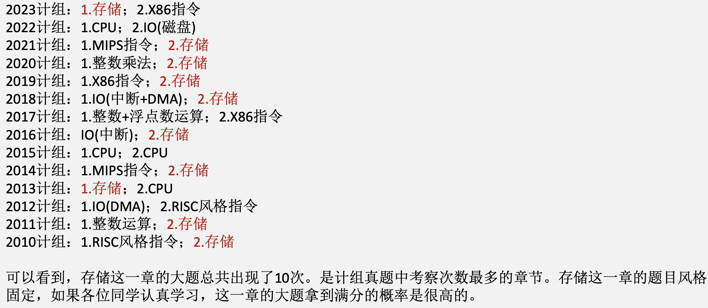
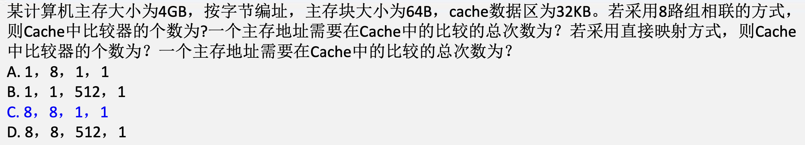

# 存储器

## 真题梳理

## 存储器基本知识回顾

### 外部存储器关系辨析

1. **${ROM}$ 和磁盘存储器的区别**：
    ${ROM}$ 和磁盘在计算机中的应用并不相同。${ROM}$ 和磁盘存储器虽然都是用作外部存储器，但磁盘的主要用途是磁盘存储器，也就是日常使用中的机械硬盘。而 ${ROM}$ 主要用做嵌入电脑主板的外部存储器，比如用来存储 ${BIOS}$。或者做移动存储介质，${ROM}$ 是随机存储，而磁盘存储器是直接存储。
    ${ROM}$ 的另一个应用场景是做微程序控制器中的控制存储器 ${CS}$，用于保存微程序。**保存了微程序的 ${ROM}$ 一般叫做固件**。
2. **${ROM}$ 的技术演变**：${ROM}$ 最开始的设计是只能出厂时候写一次。传统 ${ROM}$ 中**所存数据稳定**，一旦存储数据就再也无法将之改变或者删除，断电后所存数据也不会消失。保存的内容也只能保存常量。
    **可编程只读存储器（${PROM}$）**：是 ${ROM}$ 的技术更新，相比于 ${ROM}$，在 ${PROM}$ 中不止可以保存常量，还可以保存程序。
    **可擦除可编程只读存储器（${EPROM}$）**：${PROM}$ 的技术更新，能用紫外线擦除原有信息，可以重新写入新信息。虽然可多次擦写，但每次擦写前要删除其中的全部数据，在重新进行写入。
    **电可擦除可编程只读存储器（${EEPROM}$）**：相比于 ${EPROM}$ 每次擦除要擦除全部数据，在 ${EEPROM}$ 中可以多次擦除掉你想删除的字节，并多次写入你想写入的字节。虽然可按照字节多次擦写，但读写速度非常慢，且容量小。
    **${USB Flash}$ 存储器（${FLASH EEPROM}$）又称闪存**：相比于 ${EEPROM}$ 按照字节擦写的慢速，在 ${flash}$ 中按照扇区进行擦写。虽然读写速度都有所提升，但是**写的速度还是远小于读的速度**。
    **${SSD}$ 固态硬盘**：在 ${flash}$ 存储器上增加容量和存取速度，并提升了写入速度，使得读写速度基本能保持一致。**改进**：相比于 ${flash}$ 存储器写入速度远小于读出速度，提升了写入速度，增大了容量。**优点**：数据存储后就不会消失，可存入程序，每次擦写一个扇区，容量进一步提升，并且写的速度有了明显改善。

### 随机存储和直接存储

&emsp;&emsp;&ensp;**随机存取存储器**：特点是按地址访问存储单元，即访问任何一个存储单元的**访问时间是一个常数**，与地址无关。
&emsp;&emsp;&ensp;**顺序存取存储器**：特点是信息按顺序存放和读出，其存取时间取决于信息存放位置，以记录块为单位编址。比如，**磁带存储器**就是一种顺序存取。
&emsp;&emsp;&ensp;**直接存取存储器**：其存取方式兼有随机存储和顺序存储的特点。首先定位选取所需信息所在区域，在按顺序方式存取。如磁盘在存储时，先经过一段寻道时间+旋转延迟时间，找到对应的磁道。定位到扇区后，在经过顺 序存取方式读出几个扇区的数据。

## Cache知识回顾

### 现代访存体系

&emsp;&emsp;&ensp;在现代存储体系模型，${CPU}$ 若需要访存操作，比如取指令和取操作数的步骤为：

1. 访问 ${Cache}$，若 ${Cache}$ 命中，则 ${CPU}$ 直接从 ${Cache}$ 获取数据。
2. 若 ${Cache}$ 未命中，则 ${CPU}$ 执行访存操作，从主存将数据读出。
3. 主存将数据给到 ${CPU}$ 的同时，也会将并行的将数据所在的主存块同步更新到 ${Cache}$ 中。

### 访问Cache

&emsp;&emsp;&ensp;从 ${Cache}$ 读取数据，不论是取指令还是取操作数，都依赖于 ${Cache}$ 的映射方式。 ${Cache}$ 有三种映射方式，分别为全相联映射，直接映射和组相联映射。对于访问 ${Cache}$ 的考法，总结有如下几点：

1. 根据 ${CPU}$ 给出的地址，计算在各种 ${Cache}$ 映射方式下对应的数据。
2. 计算主存地址格式和 ${Cache}$ 地址格式。
3. 计算 ${Cache}$ 的总共容量（数据阵列+标志阵列）。
4. 给出 ${Cache}$ 中块的大小和程序的访问序列，如访问数组，求 ${Cache}$ 的命中率。
5. 结合 ${Cache}$ 的硬件逻辑，考察硬件相关的知识点。如比较器的个数，多路选择器的路数。

&emsp;&emsp;&ensp; ${Cache}$ 的标记阵列大小取决于以下几点：

1. 脏位：当 ${Cache}$ 行中的数据被修改后，可以采用直写法和回写法。直写法是同时修改 ${Cache}$ 和主存。回写法是当被修改的 ${Cache}$ 块被替换时，在对主存修改。所以回写法需要设置脏位。
2. 算法替换位：算法替换位首先只与组相联映射和全相联映射有关。当全相联映射中 ${Cache}$ 中的数据已经装满，或组相联中对应组中的数据已满，则需要选择一个 ${Cache}$ 块进行替换。替换算法有随即替换，${FIFO}$ 替换和 ${LRU}$ 替换三种方式。其中，考研中考察次数较多的，是 ${LRU}$ 算法替换位的计算。
3. 有效位：有效位用于表示 ${Cache}$ 中某个 ${Cache}$ 行中的数据是否有效，有效位为1则表示有效。在计算 ${Cache}$ 总容量时切记不要遗漏。

1. 若 ${Cache}$ 采用直接映射，在计算 ${Cache}$ 总容量时，计算 ${Cache}$ 中所有的标记信息时，一定要考虑的是有效位+${Tag}$ 标记。若题目中提到 ${Cache}$ 采用回写法，则还需要考虑脏位。
2. 在直接映射的方式下， ${Cache}$ 中的比较器只需要一个即可。
3. 直接映射不需要考虑算法替换位。（只有全相联和组相联映射的情况下，才需要考虑算法替换位）

1. 若 ${Cache}$ 采用全相联，在计算 ${Cache}$ 总容量时，标记阵列除了需要考虑有效位+标记位，还要根据替换算法考虑是否有算法替换位。若题目中提到 ${Cache}$ 采用回写法，则标记阵列的大小还需要考虑脏位。比如替换算法采用 ${LRU}$ 算法，则具有4个 ${Cache}$ 行需要2位算法替换位。若有16个 ${Cache}$ 行则有4位算法替换位。
2. 在全相联映射的方式下， ${Cache}$ 中的比较器可以只设置一个，也可以每行设置一个。这部分由于标准不统一所以考试不太会出题。

&emsp;&emsp;&ensp;在真题中，在对 ${TLB}$ 进行考察，并且 ${TLB}$ 的替换算法采用全相联替换算法的情况下，真题中给出 ${TLB}$ 全相联方式的比较器个数是每行一个比较器。

1. 若 ${Cache}$ 采用组相联，在计算 ${Cache}$ 总容量时，计算标记信息时除了需要考虑有效位+标记位，还要根据替换算法考虑是否有算法替换位。若题目中提到 ${Cache}$ 采用回写法，则标记阵列的大小还需要考虑脏位。比如替换算法采用 ${LRU}$ 算法，则四路组相联需要2位算法替换位。16路组相联需要4位算法替换位。
2. 在组相联映射的方式下， ${Cache}$ 中的比较器与路数有关。4路组相联就有4个比较器。

### cache的一致性问题

&emsp;&emsp;&ensp;前面的知识点，我们主要讨论的是 ${Cache}$ 读的问题。而 ${Cache}$ 的一致性问题，主要是考察对 ${Cache}$ 写操作的一些知识点。

1. 全写法：写操作时，若写命中，则同时写 ${Cache}$ 和主存。若写不命中，则有以下两种处理方式。
   1. 写分配法：先在主存块中更新相应存储单元，然后分配一个 ${Cache}$ 行，将更新后的主存块装入到分配的 ${Cache}$ 行中。也就是在 ${Cache}$ 写未命中的情况下，先写主存，在将对应的主存块更新到 ${Cache}$ 中。
   2. 非写分配法。写未命中时仅更新主存单元而不会将修改后的主存块更新到 ${Cache}$ 中。这种方式可以减少读入主存块的时间，但没有很好地利用空间局部性。
2. 回写法：当 ${CPU}$ 执行写操作时，若写命中，则信息只被写入 ${Cache}$ 而不被写入主存。若写不命中，则在 ${Cache}$ 中分配一行，将主存块调入该 ${Cache}$ 行中并更新相应单元的内容。因此,该方式下在写不命中时,通常采用写分配法进行写操作。

## 单片DRAM知识回顾

### 访问基于DRAM的主存

&emsp;&emsp;&ensp;现代访存体系中， ${CPU}$ 在需要主存数据时，一定会先访问 ${Cache}$ 在访问主存。当 ${Cache}$ 命中时，直接取 ${Cache}$ 中的数据。若 ${Cache}$ 未命中则主存向 ${CPU}$ 提供数据。
&emsp;&emsp;&ensp;408中涉及到的5种 ${CPU}$ 与内存的连接结构：

1. 单片 ${CPU}$ +单片 ${DRAM}$ 芯片
2. 单片 ${CPU}$ +多片 ${DRAM}$ 芯片组成的内存条
3. 单片 ${CPU}$ +多片内存条
4. 单片 ${CPU}$ + ${Cache}$ +单片 ${DRAM}$ 芯片
5. 单片 ${CPU}$ + ${Cache}$ +多片 ${DRAM}$ 芯片组成的内存条

### 单片DRAM逻辑结构图

&emsp;&emsp;&ensp;若主存由单个 ${DRAM}$ 组成：
1.  ${CPU}$ 将地址给到内存控制器中。
2. 内存控制器得到 ${CPU}$ 的地址后，将地址拆分为行地址和列地址。
3. 内存控制器第一次将行地址给到 ${DRAM}$ ，将这一行数据读到行缓冲寄存器中。
4. 内存控制器第二次将列地址给到 ${DRAM}$ 的行缓冲寄存器，从行缓冲寄存器中读出数据。

&emsp;&emsp;&ensp;**由于行列地址分两次给出，所以 ${DRAM}$ 可以做到 ${DRAM}$ 上的地址引脚减半。**

&emsp;&emsp;&ensp;RAS：行选通信号，用于控制传送行地址。
&emsp;&emsp;&ensp;CAS：列选通信号，用于控制传送列地址。
&emsp;&emsp;&ensp;WE：为读写控制引脚，低电平时为写操作。
&emsp;&emsp;&ensp;OE：为输出使能驱动引脚，低电平有效，高电平时断开输出。

### 单片DRAM刷新

&emsp;&emsp;&ensp;刷新的目的：刷新的初衷是为了在**没有读写操作**时为了维持 ${DRAM}$ 中保存的电荷而进行的操作。由于 ${DRAM}$ 上存储的电荷会缓慢放电，超过一定时间就会丢失信息。因此必须定时给 ${DRAM}$ 中所有行进行充电，每次对一行存储单元进行充电的操作叫做刷新。
&emsp;&emsp;&ensp;刷新周期：定义为上次对整个存储器刷新结束时作为开始点到下次对整个存储器全部刷新一遍为止的时间间隔。比如一个 ${DRAM}$ 中每行数据每隔2ms需要进行一次补充电荷，则2ms叫做刷新周期。
&emsp;&emsp;&ensp;关于刷新的重要结论：**一次刷新时间近似等于一个存储周期**。
&emsp;&emsp;&ensp; ${DRAM}$ 刷新不需要外部提供行地址信息，是一个内部的自动操作：
1.  ${DRAM}$ 芯片内部有一个行地址生成器（也称刷新计数器），它自动生成行地址。所以刷新计数器的大小与行的数量有关。
2. 刷新时，将**整行数据进行读操作**，读到行缓冲寄存器中。此时整行中的电荷变成0电荷。
3. 对该行重新补充电荷。

以下有三种刷新策略，分别是异步刷新，集中刷新，分散刷新。

#### 异步刷新

&emsp;&emsp;&ensp;中心思想：将刷新周期按照行平均划分。
&emsp;&emsp;&ensp;例：假设某一 ${DRAM}$ 的存储周期为2μs，共4096行数据，刷新周期为64ms，则相邻两行之间的刷新间隔就是64ms/4096=15.625μs。刷新计数器的大小为12bit。

#### 分散刷新

&emsp;&emsp;&ensp;在一个存储周期内，前一段时间用于正常的读写操作。而在后一段时间停止读写操作，由刷新计数器提供一个行地址去刷新一行。所以在分散前提下，在一个“存储周期”内，相当于执行了两次读操作。一次是读取数据， 一次是刷新一行数据。

## 多模块存储器

&emsp;&emsp;&ensp;存储体：存储体是存储单元的集合，可理解为一片 ${DRAM}$ 芯片。
&emsp;&emsp;&ensp;如图，每个 ${DRAM}$ 存储体由4096行*4096列构成，按字节编址。图中共有8个存储体通过位扩展构成了一个4096行*4096列*64bit的多模块存储器（内存条），主存块大小为64bit。一般在408考试中的情况，${CPU}$ 按字节读取数据，若出现 ${Cache}$ 未命中，则将对应的主存块通过突发传送的方式，将64bit的数据送入 ${Cache}$ 。内存条主要有两种方式。1.同时启动；2.轮流启动

### 同时启动

&emsp;&emsp;&ensp;即同时启动所有模块进行读写。假设如图所示的8体多模块存储器，按字节编址，存储体之间采用交叉编制方式。**若想采用同时启动的方式，将一个64bit的主存块送到 ${Cache}$ ，则 ${CPU}$ 需要具有64根数据线**。假设主存块的首地址存储在从00401000处开始的8字节中。此时8个存储体同时准备数据，在经过一个存储周期后，数据准备完毕。8个存储体同时将自己准备的一字节数据传输给 ${CPU}$ 。

### 轮流启动

&emsp;&emsp;&ensp;同时启动方式将所有存储体在同一时间启动。对于一个8体交叉存储器，在采用同时启动的情况下，准备8字节的主存块只需要一个存储周期。但是缺点是需要存储器总线具备64根数据线。轮流启动对于同时启动的优化在于，轮流启动采用流水线的思想。在流水线充分流通后，存储器总线只需要支持8根数据线就可以达到和同时启动近似的速率。而**408中总线用于处理这种多模块交叉编址存储器传输主存块的事务，称为突发传送总线事务**。
&emsp;&emsp;&ensp;突发传送总线事务方式下，总线**能够进行连续的成块数据传送**。传送开始时，先给出主存块在存储器中的首地址，然后连续地传送主存块中的存储单元。一次突发传送总线事务的过程包括：

1. 送首地址和命令；
2. 存储器准备数据；
3. 总线传送数据。

&emsp;&emsp;&ensp;若主存采用8体交叉多模块存储器，每个体的存储字长为1B，存储周期为40ns，存储器总线宽度为1B。总线传输周期为5ns。采用突发传送方式，每次突发传送8字节。则从主存收到地址信息开始，到8B的数据送达 ${CPU}$ 的时间为80us。

### 存储周期大题与选择题之间定义的区别

&emsp;&emsp;&ensp;存储周期的时间计算：

1. 当主存控制器收到来自 ${CPU}$ 的地址信息后，对地址信息进行译码，定位到某个存储单元
2. 存储单元中，若保存1则代表携带一个电荷，若为0则无电荷，将该存储单元中的数据读出，同时存储单元中的电荷全部变成0电荷。
3. 电荷经过读出放大器将电压放大后，输送给 ${CPU}$ 。
4. 由于原存储单元中的数据读出，电荷归零，所以需要重新对存储单元补充电荷，让其数据与读出前保持一致。这个过程叫做数据再生。
5. 再生电路和放大电路每次启动需要恢复一段时间后才能再次启动。

&emsp;&emsp;&ensp;上述步骤中，**步骤1-步骤5的总时间，称为一个存储周期**。
&emsp;&emsp;&ensp;存储周期在大题中的时间计算：

1. 当主存控制器收到来自 ${CPU}$ 的地址信息后，对地址信息进行译码，定位到某个存储单元。
2. 存储单元中，若保存1则代表携带一个电荷，若为0则无电荷，将该存储单元中的数据读出，同时存储单元中的电荷全部变成0电荷。
3. 电荷经过读出放大器将电压放大后，输送给 ${CPU}$ 。

&emsp;&emsp;&ensp;存储周期在大题中的定义，**省略了数据恢复的时间**，这一点同学们要注意。
&emsp;&emsp;&ensp;使用轮流启动和同时启动的最重要的差别在于轮流启动的存储器总线宽度和每个存储体的存储字长一致。

&emsp;&emsp;&ensp;以2013年真题为例，如何判断出真题采用了轮流启动方式，一个原因是真题中写明了**采用突发传送总线事务**。但最主要的原因在于，题目中存储器总线的宽度和每个存储体的宽度一致。若将题目修改为：存储器总线宽度为32B，则此时存储器总线的宽度刚好可以执行同时启动。此时 ${Cache}$ 缺失后， ${Cache}$ 块的传输时间就是40+5。

## 现代存储器

&emsp;&emsp;&ensp;未采用事务分离： ${CPU}$ 获取总线控制权后，作为主设备，将地址从其内部的MAR给到主存。在主存准备好数据前， ${CPU}$ 一直占据着总线控制权。数据准备好后，**主存向 ${CPU}$ 申请总线控制权**，在获得总线控制权后将数据传输出去。
&emsp;&emsp;&ensp;事务分离： ${CPU}$ 获取总线控制权后，作为主设备，将地址从其内部的MAR给到主存，并释放总线控制权。主存数据准备好后，**主存向总线控制器申请总线控制权**，在获得总线控制权后将数据传输出去。

### 总线事务

&emsp;&emsp;&ensp;总线事务的四个阶段：

1) **请求阶段**。主设备发出总线传输请求，并且获得总线控制权。
2) **仲裁阶段**。总线仲裁机构决定将下一个传输周期的总线使用权授予某个申请者。
3) **寻址阶段**。主设备通过总线给出要访问的从设备地址及有关命令，启动从模块。
4) **传输阶段**。主模块和从模块进行数据交换，可单向或双向进行数据传送。
5) **释放阶段**。主模块的有关信息均从系统总线上撤除，让出总线使用权。 

&emsp;&emsp;&ensp;在总线事务的传输阶段，主、从设备之间一般只能传输一个字长的数据。

1. 总线事务周期长度≈存储周期长度
2. 周期挪用方式的DMA数据传送，必须发生在一个总线事务后。

### 同步传输与异步传输

&emsp;&emsp;&ensp;传统 ${DRAM}$ 与 ${CPU}$ 之间采用异步方式交换数据。
&emsp;&emsp;&ensp; ${CPU}$ 发出地址和控制信号后，经过一段延迟时间，数据才读出或写入。在此期间， ${CPU}$ 不断采样 ${DRAM}$ 的完成信号，在没有完成之前， ${CPU}$ 插入等待状态而不能做其他工作。
&emsp;&emsp;&ensp;${SDRAM}$ 其读写受系统时钟控制，与 ${CPU}$ 之间属于同步方式交换数据。
&emsp;&emsp;&ensp;它将 ${CPU}$ 或其他主设备发出的地址和控制信息锁存起来，经过确定的几个时钟周期后给出响应。因此，主设备在这段时间内可以进行其他操作。
&emsp;&emsp;&ensp;传统的DRAM未采用总线事务分离机制， ${CPU}$ 要给出MAR寄存器中数据输送主存的信号和从主存接收数据存入 ${MDR}$ 的信号。
&emsp;&emsp;&ensp;${SDRAM}$ 相当于采用了总线事务分离机制， ${CPU}$ 只需要给出read信号即可，主存会自动的将数据存入 ${MDR}$ 中。

#### 异步传输

&emsp;&emsp;&ensp;异步通信方式可分为不互锁、半互锁和全互锁三种类型。

1) 不互锁方式主模块发出请求信号后，不等待接到从模块的回答信号，而是经过一段时间，确认从模块已收到请求信号后，便撤消其请求信号。从设备接到请求信号后，在条件允许时发出回答信号，并且经过一段时间确认主设备已收到回答信号后，自动撤消回答信号。可见通信双方并无互锁关系。
2) 半互锁方式主模块发出请求信号，待接到从模块的回答信号后再撤消其请求信号，存在着简单的互锁关系；而从模块发出回答信号后，不等待主模块回答，在一段时间后便撤消其回答信号，无互锁关系。故称半互锁方式。
3) 全互锁方武主模块发出请求信号，待从模块回答后再撤其请求信号；从模块发出回答信号，待主模块获知后，再撤消其回答信号。故称全互锁方式。

### 现代存储器

&emsp;&emsp;&ensp;双口存储器是在一个存储器中提供两组独立的读写控制电路和两个读写端口，因而可以同时提供两个数据的并行读写，是一种空间并行技术。每个读写口都有一套独立的地址缓存器和译码电路，两套电路并行独立工 作。当A、B两个端口地址不相同时，可以向存储体一次读写两个单元的内容。当A、B两个端口地址相同时，发生冲突，可按照特定的优先顺序选择其中一个端口进行读写。

&emsp;&emsp;&ensp;现代计算机的存储器总线，往往采用多通道存储器总线用于增加传输的带宽。比如使用三通道的存储器总线。

&emsp;&emsp;&ensp;处理器支持三通道 ${DDR3}$ ${SDRAM}$ 内存条插槽，因此处理器中包含3个内存控制器，并有3个并行传输的存储器总线,也意味着有3组内存条插槽。

### 分页方式

&emsp;&emsp;&ensp;分页方式的基本思想是：把主存分成固定长且比较小的存储块，称为页框，每个进程也被划分成固定长的程序块，称为页。程序块被装到可用的存储块中，**并且无需用连续页框来存放一个进程**。程序给出的指令和数据的地址不是真正的主存物理地址，程序员是在一个虚拟的逻辑地址空间中编写程序。操作系统在进行存储器分配时，通过页表建立页和页框之间的映射关系。**每个进程有一个页表，通过页表实现虚拟地址向物理地址的转换**。早期的分页方式将一个进程的所有页面都调入主存。
&emsp;&emsp;&ensp;现代操作系统中采用了“请求分页”的分页式虚拟存储管理方式，所谓“请求分页”就是只将当前需要的页面装入主存页框中而不需要的页面则存放在外存中。这就是现代计算机采用的“虚拟存储器”存储管理的基本思想。

#### 请求分页式

&emsp;&emsp;&ensp;在分页式虚拟存储系统中，主存储器和虚拟地址空间都被划分成大小相等的页面，磁盘和主存之间按页面为 单位交换信息。
&emsp;&emsp;&ensp;操作系统在主存中给每个进程都生成了一个页表，每个虚拟页在页表中都有一个对应表项，表项内容包括该 虚拟页的存放位置、装入位、修改位、使用位（替换控制位）、存取权限位和禁止缓存位等。
&emsp;&emsp;&ensp;页表项中的存放位置字段用来建立虚拟页和物理页之间的映射，用于进行虚拟地址到物理地址的转换。装入位也称为有效位或存在位，用来表示对应页面是否在主存。若为1，表示该虚拟页已从外存调入主存，此时，存放位置字段指向主存页框号。若为0，则表示没有被调入主存，此时若存放位置字段为 ${null}$，则说明是一个“未分配页”，否则是一个“未缓存页”，其存放位置字段给出该虚拟页在磁盘上的起始地址。
&emsp;&emsp;&ensp;缺页处理代价较大，因此在主存页框和虚拟页之间采用全相联映射方式。当进行写操作时，由于磁盘访问速度很慢，所以不能每次写操作都同时写 ${DRAM}$ 缓存和磁盘。在处理一致性问题时，采用回写方式，而不用全写方式。

