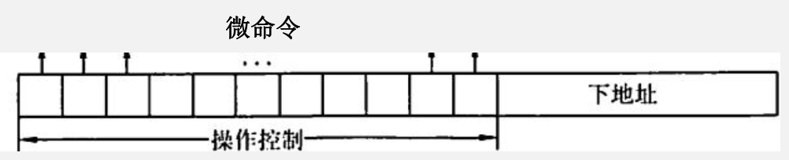
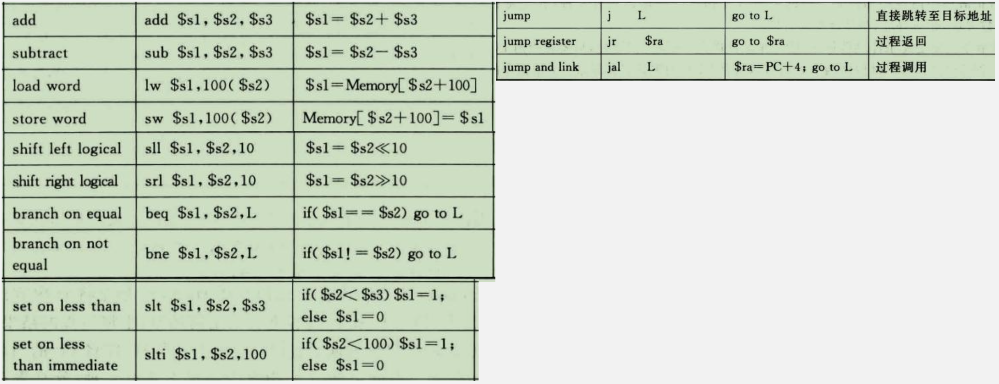

# 指令和微指令

## 课程概述与计组大题梳理

&emsp;&emsp;&ensp;如果是CISC风格的指令集，如X86指令风格的指令集，在计算相对寻址的偏移量时，偏移量实际上就是计算PC中的值和目标地址之间的距离。

&emsp;&emsp;&ensp;如果是RISC风格的指令集，如MIPS指令风格的指令集，在计算相对寻址的偏移量时，偏移量实际上就是计算PC中的值和目标指令之间差了多少条指令。

## 寻址方式回顾

&emsp;&emsp;&ensp;寻址方式：指令给出操作数或操作数地址的方式称为寻址方式。
&emsp;&emsp;&ensp;有效地址：在408范围内，通常把指令所需操作的操作数所在存储单元的地址称为有效地址。在组成原理这门课中，存储单元地址主要是主存物理地址。
&emsp;&emsp;&ensp;若采用虚拟存储机制，则有效地址可以是虚拟地址。
&emsp;&emsp;&ensp;形式地址：若指令中的地址码字段并不代表操作数的有效地址，这种地址称为形式地址。
&emsp;&emsp;&ensp;直接对寻址方式的考察，主要是在选择题之中。这需要同学们对以下寻址方式的特点牢牢掌握。
&emsp;&emsp;&ensp;指令给出操作数或操作数地址的方式称为寻址方式。考试中主要考察的寻址方式主要有以下几种：

1. 操作数或操作数地址直接在指令中给出
   1. 立即寻址
   2. 直接寻址
   3. 寄存器寻址
2. 操作数的形式地址在指令中给出
   1. 间接寻址
   2. 寄存器间接寻址
3. 操作数的有效地址需要计算得到
   1. 基址寻址
   2. 变址寻址
   3. 相对寻址

&emsp;&emsp;&ensp;立即寻址：立即寻址的情况下，由于操作数直接在指令中给出，所以在取得指令后就能得到操作数。

&emsp;&emsp;&ensp;寄存器寻址：寄存器寻址的方式下，指令中给出寄存器寄存器号，只需要访问对应寄存器就能获得操作数。

&emsp;&emsp;&ensp;直接寻址：直接寻址的方式下，指令中给出操作数的有效地址，只需要访问对应的主存地址就能获取操作数。

&emsp;&emsp;&ensp;寄存器间接寻址：寄存器间接寻址的情况下，根据指令中给出的寄存器号，从对应的寄存器中取出有效地址，根据有效地址访问主存得到操作数。

&emsp;&emsp;&ensp;相对寻址：相对寻址的情况下，指令中的偏移量要先和PC寄存器中的值相加，得到有效地址后在内存。相当于执行了一个加法操作后在执行一个访存操作。从细节上说，寄存器间接寻址略微快于相对寻址。

&emsp;&emsp;&ensp;一次间接寻址：在一次间接寻址的情况下，指令中给出的地址中保存了操作数的形式地址，先根据形式地址访问一次存储器取得有效地址后，在根据有效地址访问存储器取得操作数。对于一次间接寻址，相当于执行了两次访存操作。

### 指令周期

&emsp;&emsp;&ensp;一般情况下，对于一个多周期处理器，会将一条指令的指令周期分成多个机器周期，每个机器周期会执行相应的操作。比如一条指令add r1，1234H，其两个操作数分别采用寄存器寻址和间接寻址。若将指令周期分成 取指周期，间址周期，执行周期和中断周期这四个机器周期。

#### 变长操作码指令编码

&emsp;&emsp;&ensp;指令定长；每个操作数定长；操作数个数可选。
&emsp;&emsp;&ensp;设定：指令字长：32位；地址码长度：6位。

## 微程序控制器回顾

&emsp;&emsp;&ensp;在408中，对于多指令周期CPU的程序控制器，主要有硬布线控制器和微程序控制器两种。一般来讲，硬布线控制器主要结合RISC风格的指令集，比如MIPS。而微程序控制器主要结合CISC风格的指令集，比如X86。
&emsp;&emsp;&ensp;往年真题举例：
&emsp;&emsp;&ensp;方向1.给出指令条数，每条指令对应的微程序包含的微指令个数，求下地址字段。
&emsp;&emsp;&ensp;方向2.给出微指令控制字段的编码方式，求控制字段的长度。

&emsp;&emsp;&ensp;为了加快指令执行速度，通常采用定长微指令字格式。微指令由微操作码和微地址码两部分组成。微操作码格式设计主要由编码方式决定。考试中会遇到的编码方式主要有不译法（直接控制法）和字段直接编码法这两种方法。

1. 直接控制法:一位对应一个微命令，微操作码字段的长度与所有微命令的个数相当（ALU的微命令采用编码方式执行）。优点：无须译码，并行控制能力强，控制电路简单，速度快。缺点：编码空间利用率低。

2. 字段直接编码法：数据通路中的微操作之间存在两种关系：相容和互斥。相容微操作是指在数据通路中，能同时进行的微操作，对应的微命令称为相容微命令。互斥微操作是指不能同时进行的微操作，对应的微命令称为互斥微命令。 
   字段直接编码法的基本思想是将微指令的操作码字段分成若干段，每个段包含若干微命令。把互斥微操作组合在同一字段，相容微操作组合在不同字段，对每一字段内的微操作进行编码。
   注意：**一般每个小段还要留出一个状态，表示本字段不发出任何微命令。因此，当某字段的长度为3位时，最多只能表示7个互斥的微命令，通常用000表示不操作**。

&emsp;&emsp;&ensp;由于任何类型指令的取指过程都是一致的，所以**专门设计了一个取指令微程序来实现取指操作**。因此，微程序控制器的工作流程就是不断地执行**取指令微程序**和**执行相应指令功能对应的微程序的过程**。

&emsp;&emsp;&ensp;操作控制字段：是微指令的微操作码字段，用于解析生成该条微指令的微命令（控制信号）。
&emsp;&emsp;&ensp;测试判断字段：控制多分支转移的条件测试和转移控制字段都用于控制微指令的寻址（跳转微指令）。
&emsp;&emsp;&ensp;下地址字段：用于给出下一个微指令在程序控制器中的地址。
&emsp;&emsp;&ensp;一般意义上，指令所对应的微程序，指得是指令的执行周期（如果有间接寻址，则包含指令的间址周期）。比如题目说每条指令平均需4条微指令实现，实际上说的是在每条指令在执行过程中，指令所对应的微程序由4个微指令组成。
&emsp;&emsp;&ensp;一般，会把指令的取指周期所需要的微指令单独拎出来，构成取指令微程序，该微程序是公用的。

## 指令+微程序模型

&emsp;&emsp;&ensp;指令系统这一章本身在计组中占据着重要地位，虽然不一定会直接以X86或MIPS指令系统进行考察，但会结合其他章节的知识进行考察。所以本节提出了一个出题人可能考察的方向，也就是**指令-微指令综合模型**。
&emsp;&emsp;&ensp;若程序控制器采用微程序控制器的方式，则其硬件逻辑图如下图所示：
&emsp;&emsp;&ensp;在IR中保存指令，而在微程序控制器中的控制寄存器中保存微指令。

&emsp;&emsp;&ensp;如果采用微指令程序控制器，对于微指令与指令的关系如下：

&emsp;&emsp;&ensp;当微指令的下条微指令地址由下地址字段给出时，其硬件逻辑如下：以ADD指令为例。

&emsp;&emsp;&ensp;指令的操作码给到程序控制器中的微地址修改逻辑，微地址修改逻辑生成ADD指令执行周期微程序的首地址，也就是0003h，将地址存入µMAR中。根据µMAR中的地址将微指令存入µIR，最后经过译码逻辑生成微命令。
&emsp;&emsp;&ensp;在µIR中保存的微指令，**其微指令的下地址字段会从µIR给到微地址修改逻辑**，微地址修改逻辑会将收到的下地址字段将下一条微指令的地址给到µMAR。

&emsp;&emsp;&ensp;当执行到ADD指令微程序的最后一条微指令时，该微指令的下地址字段会指向0000H，µIR将下地址字段给到微地址修改逻辑。这样，下一条微指令的地址就直接指向取指令微程序的首地址，从而获得取指令微程序的第一条微指令。进而进入下一条指令的取指周期。

&emsp;&emsp;&ensp;创新方向：微程序操作字段采用直接控制方式和硬件相结合。
&emsp;&emsp;&ensp;如果题目给出微指令的控制字段采用直接编码方式，那么可能会不说明控制信号的个数，而是结合硬件结构图自己算出控制信号的个数。

&emsp;&emsp;&ensp;图中，不计算ALU的控制信号的前提下，共有20个控制信号，那么采用直接编码方式的微指令的控制字段最少需要20bit。

&emsp;&emsp;&ensp;如果该机共有指令100条，每条指令平均需7条微指令实现，其中3条是共用的。
&emsp;&emsp;&ensp;由该已知条件可知，取指令微程序包含3条微指令，平均每个指令的执行部分对应的微程序包含4条微指令。所以，共包含4*100+3=403条微指令。可得出下地址字段为9bit。

&emsp;&emsp;&ensp;下图为模型机内部的硬件逻辑图。其中模型机采用微程序控制器方式，其中J1~J3为微指令判断测试字段。其中，公用的取 指令微程序由3条微指令构成。如果微指令控制方法采用直接控制法。关于ALU执行的计算操作为（sub，add，subi，addi， addm，C1）。对于ALU的微命令占3bit，J1~J3不属于微命令字段，微指令的下条指令地址由微指令下址字段给出，J1~J3采用 译码输出。所有指令，执行部分的微程序，加在一起共有100条微指令。若指令addm r1，（r2）表示（r2） + r1 -> r1，请问：
1. 控制信号ALUop的位数为多少？
2. 写出addm r1，（r2）从指令取指阶段到执行结束对应的微程序占的大小为多少bit？

## MIPS过程调用回顾

### MIPS指令类型介绍

&emsp;&emsp;&ensp;以下MIPS指令，需要你看见指令明白啥意思：

### 过程调用

&emsp;&emsp;&ensp;假定过程P调用过程Q，则过程调用的执行步骤如下：

1) P将入口参数放到Q能访问到的地方；
2) P将返回地址存到特定的地方，然后将控制转移到Q；
3) Q为P保存现场，并为自己的局部变量分配空间；
4) 执行过程Q；
5) Q将返回结果放到P能访问到的地方；
6) Q取出返回地址,将控制转移到P；

### MIPS过程调用

### 函数调用必要的准备工作

&emsp;&emsp;&ensp;函数调用必要的准备工作：当一个函数被调用时，程序会将该函数**必要的参数、局部变量、以及ra寄存器，fp寄存器**中的信息压入栈中。所以函数调用前需要先计算自己的栈空间，分析哪些数据需要保存在自己的程序栈中。

### 过程调用

&emsp;&emsp;&ensp;当main函数调用set_array方法时，set_array分配栈空间，保存必要寄存器的汇编代码。

1. P将入口参数放到Q能访问到的地方。 set_array在调用compare前，把形参num从t0寄存器放到了a0寄存器。把全局变量i从S0寄存器放到了a1寄存器，

2. P将返回地址存到特定的地方,然后将控制转移到Q。注意，**保存返回地址是由P来执行**，但谁来把返回地址压入栈中，**MIPS与X86有所不同**。
    MIPS中，P在执行jal compare这条语句时，把返回地址保存在了ra寄存器中此时P完成了保存操作。后续由Q对ra寄存器中的值进行压栈操作，**放入Q的栈空间中**。
    **X86由于没有ra寄存器，所以在保存返回地址时，选择直接把返回地址保存在P的栈空间中**。

3. Q为P保存现场,并为自己的局部变量分配空间。compare方法中执行如下三个指令。

4. 执行过程Q。
5. Q将返回结果放到P能访问到的地方。MIPS中，其返回值保存到V0寄存器中。X86中，其返回值保存到EAX中。

6. Q取出返回地址，将控制转移到P。
    MIPS中，compare方法把自己栈空间中保存的sp和fp恢复到sp，fp寄存器中并通过指令进行地址恢复。
    jr $ra
    X86中，通过执行下列两个指令达到地址返回的效果。
    leave
    ret

## X86指令概述

&emsp;&emsp;&ensp;cmp：让两个数相减，并修改相应的标志位.
&emsp;&emsp;&ensp;jle：根据两个标志位进行判断：零标志位（ZF）和符号标志位（SF）。它用于判断是否执行跳转。
&emsp;&emsp;&ensp;如果ZF（零标志位）为1，表示比较的两个数相等，这时jle 条件满足，将执行跳转。
&emsp;&emsp;&ensp;如果SF等于OF表示第一个数大于第二个数，SF不等于OF表示第一个数小于第二个数。
&emsp;&emsp;&ensp;jle指令也是采用相对寻址的方式。其计算方法为0040101CH + 2 + 17H = 00401035H。jle指令一般用于判断小于等于关系。而在2023年计组45题目中，考察了jge指令相对寻址公式的计算，该指令一般用于判断大于等于关系。

&emsp;&emsp;&ensp;指令 ${mov\space eax,dword\space ptr\space [n]}$ 的含义是：将位于内存地址n处的32位数据加载到寄存器eax中。该指令在2023年408真题44题中有所考察。
&emsp;&emsp;&ensp;mov：这是汇编语言中的指令，用于将数据从一个位置移动到另一个位置。
&emsp;&emsp;&ensp;eax：这是一个32位的通用寄存器，在x86架构中常 被用来进行数据处理和运算。
&emsp;&emsp;&ensp;dword ptr：这是指定操作数的大小的一种方式。在这里，它表示后面的操作数是一个32位的双字（4字节）。
&emsp;&emsp;&ensp;[n]：这是一个内存引用，指示汇编器从内存地址n处读取数据。

