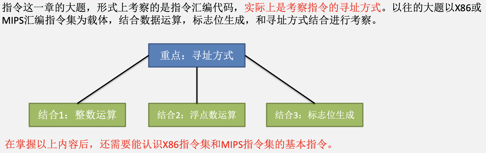
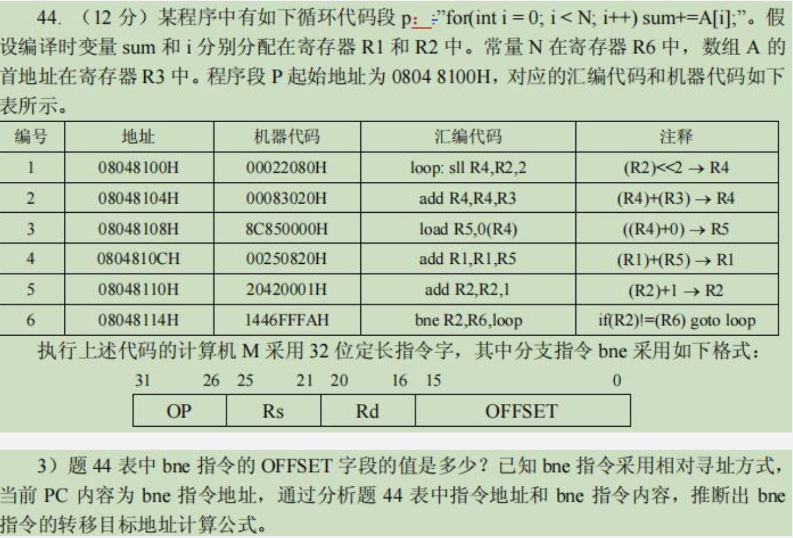

# 指令和微指令

## 课程概述与计组大题梳理

&emsp;&emsp;&ensp;如果是CISC风格的指令集，如X86指令风格的指令集，在计算相对寻址的偏移量时，偏移量实际上就是计算PC中的值和目标地址之间的距离。

&emsp;&emsp;&ensp;如果是RISC风格的指令集，如MIPS指令风格的指令集，在计算相对寻址的偏移量时，偏移量实际上就是计算PC中的值和目标指令之间差了多少条指令。

## 寻址方式回顾

&emsp;&emsp;&ensp;寻址方式：指令给出操作数或操作数地址的方式称为寻址方式。
&emsp;&emsp;&ensp;有效地址：在408范围内，通常把指令所需操作的操作数所在存储单元的地址称为有效地址。在组成原理这门课中，存储单元地址主要是主存物理地址。
&emsp;&emsp;&ensp;若采用虚拟存储机制，则有效地址可以是虚拟地址。
&emsp;&emsp;&ensp;形式地址：若指令中的地址码字段并不代表操作数的有效地址，这种地址称为形式地址。
&emsp;&emsp;&ensp;直接对寻址方式的考察，主要是在选择题之中。这需要同学们对以下寻址方式的特点牢牢掌握。
&emsp;&emsp;&ensp;指令给出操作数或操作数地址的方式称为寻址方式。考试中主要考察的寻址方式主要有以下几种：

1. 操作数或操作数地址直接在指令中给出
   1. 立即寻址
   2. 直接寻址
   3. 寄存器寻址
2. 操作数的形式地址在指令中给出
   1. 间接寻址
   2. 寄存器间接寻址
3. 操作数的有效地址需要计算得到
   1. 基址寻址
   2. 变址寻址
   3. 相对寻址

&emsp;&emsp;&ensp;立即寻址：立即寻址的情况下，由于操作数直接在指令中给出，所以在取得指令后就能得到操作数。

&emsp;&emsp;&ensp;寄存器寻址：寄存器寻址的方式下，指令中给出寄存器寄存器号，只需要访问对应寄存器就能获得操作数。

&emsp;&emsp;&ensp;直接寻址：直接寻址的方式下，指令中给出操作数的有效地址，只需要访问对应的主存地址就能获取操作数。

&emsp;&emsp;&ensp;寄存器间接寻址：寄存器间接寻址的情况下，根据指令中给出的寄存器号，从对应的寄存器中取出有效地址，根据有效地址访问主存得到操作数。

&emsp;&emsp;&ensp;相对寻址：相对寻址的情况下，指令中的偏移量要先和PC寄存器中的值相加，得到有效地址后在内存。相当于执行了一个加法操作后在执行一个访存操作。从细节上说，寄存器间接寻址略微快于相对寻址。

&emsp;&emsp;&ensp;一次间接寻址：在一次间接寻址的情况下，指令中给出的地址中保存了操作数的形式地址，先根据形式地址访问一次存储器取得有效地址后，在根据有效地址访问存储器取得操作数。对于一次间接寻址，相当于执行了两次访存操作。

## 微程序控制器回顾

## 指令+微程序模型

## MIPS过程调用回顾

## X86指令概述