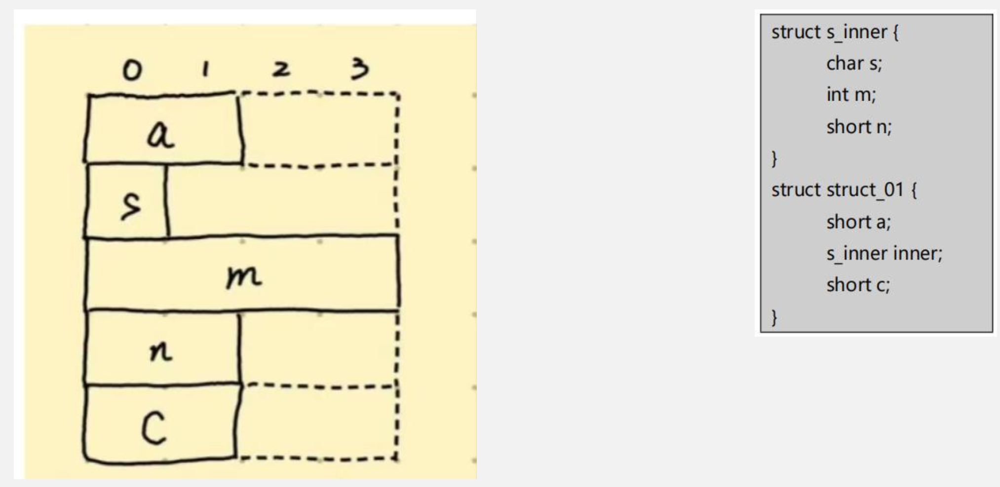
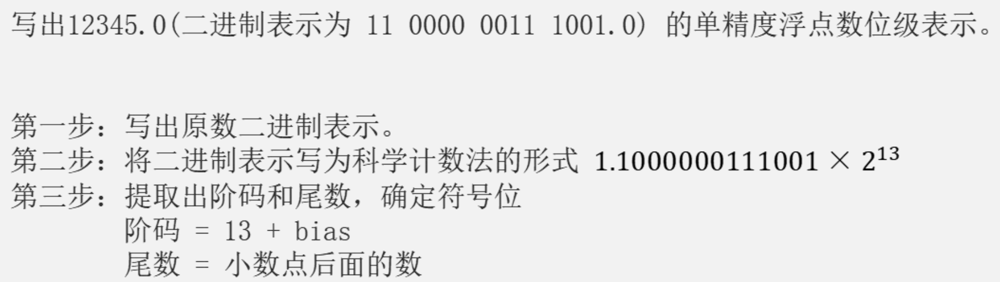

# 数据运算&总线

## CPU性能指标的综合问题

### 冯诺依曼体系结构回顾

&emsp;&emsp;&ensp;知识点回顾：
&emsp;&emsp;&ensp;冯诺依曼体系结构 – 存储器 运算器 控制器 输入输出设备
&emsp;&emsp;&ensp;现代计算机以存储器为中心，存储器不仅能存放数据，也能存放指令，形式上它们没有任何差别（请问CPU是如何区分数据和指令的？）
&emsp;&emsp;&ensp;指令执行的不同阶段 OR 存储器中的二进制信息被放入哪个部件处理。

### 各类字长

&emsp;&emsp;&ensp;**机器字长**：机器字长指的是计算机进行一次整数运算（即定点整数运算）所能处理的**二进制数据的位数**，通常与CPU的寄存器位数、加法器有关。因此，**机器字长一般等于通用寄存器的大小**，字长越长，数的表示范围越大，计算精度越高。计算机字长通常选定为字节（8位）的整数倍。

&emsp;&emsp;&ensp;**存储字长**：一个存储单元的位数，也就是CPU向内存某个地址取数据时一次性取走的数据量。注意：**MDR位数与总线数据线宽度相等**，与存储字长不一定相等。
&emsp;&emsp;&ensp;**指令字长**：一条**指令的长度**。由于指令的长度可以相等，也可以不相等，所以指令字长可以是固定的，也可以是不固定的，但是**指令字长必须是字节的整数倍**。指令可以占用1/2个存储单元、1个存储单元、两个存储单元...我们分别把它们叫做半存储字长指令、单存储字长指令、双存储字长指令...简称**半字长指令、单字长指令、双字长指令**。

&emsp;&emsp;&ensp;**机器字长、存储字长、指令字长的数量关系**：首先来看**存储字长和机器字长**的关系。机器字长通常是存储字长的整数倍，最常见的情况是相等，这样可以充分发挥机器字长的作用，一次性把数据取到CPU中，一次性处理计算。机器字长也可以是存储字长的两倍，四倍，因为**能处理64位定点数的CPU当然也能处理存放32位、16位的定点数**。
&emsp;&emsp;&ensp;接着是**存储字长与指令字长**的关系。指令字长可以是存储字长的一半，也可以是存储字长的整数倍，比如一倍，两倍，我们通常把这些指令叫做半存储字长指令、单存储字长指令、双存储字长指令。
&emsp;&emsp;&ensp;CPU要从内存中取一条双存储字长指令，那就要获取两个存储单元。**指令字长决定了IR寄存器的位数**。如果指令字长最大为32位，那么IR寄存器至少需要32位。
&emsp;&emsp;&ensp;**指令字长和机器字长的关系**：如前面所说，指令字长可以是存储字长的0.5, 1, 2倍，机器字长可以是存储字长的1, 2, 4倍，那指令字长和机器字长是不是有什么关系呢？这里要注意，**指令字长和机器字长两者互不影响，没有任何约束关系**，只是恰巧各自与存储字长有倍数关系。因为机器字长强调的是参与ALU运算的操作数位数，而**操作数位数显然与指令长度也就是指令字长无关**。（有的指令可以没有参与ALU运算的操作数，甚至没有显式操作数）

### 计算机运算速度的相关指标

&emsp;&emsp;&ensp;**时钟周期**：计算机执行一条指令的过程分为若干步骤（微操作）来完成，每一步都需要相应的控制信号进行控制。这些控制信号何时发出，作用时间多长，都需要相应的定时信号进行同步。因此，计算机必须能够**产生同步的时钟信号**，这个信号的宽度称为时钟周期。**时钟周期是计算机中最小的时间单位。**
&emsp;&emsp;&ensp;**${CPU}$ 时钟频率**：简称主频，与时钟周期互为倒数，单位通常为 ${MHz}$。时钟频率越高，执行指令速度越快。
&emsp;&emsp;&ensp;${CPI（Cycl\space per\space Instruction）}$：表示**执行一条指令所需的时钟周期数**。不同指令的功能不同，在不同机器上实现方式也不同，因而所需时钟周期数也不同。对于一台机器上的一个特定程序来说，其CPI指的是该程序所有指令执行所需的平均时钟周期数。${平均CPI=Σ（指令占比）\times（该类指令CPI）}$
&emsp;&emsp;&ensp;${MIPS（millon\space instruction\space per\space second）}$：每秒能够执行多少百万条指令。
&emsp;&emsp;&ensp;${MIPS=指令执行条数/（执行时间\times 10^6）=主频/（CPI\times 10^6）}$
&emsp;&emsp;&ensp;思考：机器A的MIPS比机器B大，能说明机器A的性能就一定比机器B好吗？
&emsp;&emsp;&ensp;${MFLOPS（millon\space float\space operation\space per\space second）}$：每秒能够执行多少**百万次**（${10^6}$）浮点运算。
&emsp;&emsp;&ensp;${GFLOPS}$：每秒能够执行多少**十亿次**（${10^9}$）浮点运算。
&emsp;&emsp;&ensp;${TFLOPS}$：每秒能够执行多少**万亿次**（${10^{12}}$）浮点运算。
&emsp;&emsp;&ensp;${PFLOPS}$：每秒能够执行多少**千万亿次**（${10^{15}}$）浮点运算。

#### 时钟周期详解

&emsp;&emsp;&ensp;数据流从一个状态逻辑单元经过组合逻辑到达另一个状态逻辑单元的时间为一个时钟周期。
&emsp;&emsp;&ensp;一个时钟周期CU发出一组控制信号**且在时钟周期内这些信号不会发生改变**。

1） CPU主频为800Mhz，因此CPU时钟周期为1/800Mhz=1.25ns 总线时钟频率为200Mhz，因此总线时钟周期为1/200Mhz=5ns 总线宽度为32位，故总线带宽为4B*200MHz=800MB/s。
2） CPU与主存的每次数据交互都是通过一系列步骤完成的，这一系列步骤被称作总线事务。读总线事务是将数据由主存送往CPU，而写总线事务是将数据由CPU送往主存。Cache块大小为32B，所以需要一个读突发传送总线事务。
3） 我们来对读突发传送的流程进行详细解析：
   1） 送首地址和命令 CPU通过地址线将读内存首地址送至主存，通过控制线将读主存命令送至主存。
   2） 存储器准备数据和传送数据 -- 单个存储体视角（补个准备和传送数据的图）
      1） 准备数据：一个存储周期，单个存储体准备好数据将数据送至总线数据线。
      2） 传送数据：一个总线周期，准备好的数据通过数据线传送至CPU。
   3） 通过突发传送的性质得出一个读突发传送总线事务的时间 现代内存为了可以快速传输一段相连的数据，采用突发传送的策略。突发传送的前提是多模块存 储体按照交叉编址的方式进行编址。突发传送的过程：
      1） CPU给出需要传输数据的第0号字节的地址。
      2） 从0号字节所在的存储体开始，依次启动，直到4个存储体全部启动。
      3） 随着存储体依次准备结束，每个存储体依次通过总线把数据给到CPU。

4）  执行时间 = （Cache命中时的执行时间 + Cache缺失时的处理时间）
= （CPI*指令数*单个时钟周期长度） +（读突发传送总线事务时间 * cache缺失次数）
cache缺失时，指令执行时间为：Cache缺失处理时间+Cache命中时的指令执行时间cache命中时，指令执行时间为：Cache命中时的指令执行时间

## 定点数的表示与运算

&emsp;&emsp;&ensp;所谓定点数，就是小数点位置固定的数。在现代计算机中，我们将定点数的小数点固定在最后一位。移动小数点位置，对于定点数运算结果的二进制表示没有影响。
&emsp;&emsp;&ensp;练习：在某浮点数表示中，7位尾数由双符号位补码表示，在浮点数加法运算的过程中，对阶后得到的尾数的机器数分别为11.01011和00.10101，计算尾数的和。

### 结构体的对齐问题

&emsp;&emsp;&ensp;计算机为什么需要进行数据对齐：
&emsp;&emsp;&ensp;结构体对齐规则：

1. 整个结构体变量的对齐方式与其中对齐方式最严格的成员相同。
2. 结构体成员在满足其对齐方式的条件下，取最小可用位置作为成员在结构体中的偏移量。
3. 结构体大小应当为对齐边界长度的整数倍。

### 定点数编码的性质

&emsp;&emsp;&ensp;补码的位权表示：设机器数的字长为 ${𝝎}$，机器数可以写成 ${[x_{𝝎-1},x_{𝝎-2},...,x_{0},]}$。当将这串 ${𝝎}$ 维向量解释为有符号数（补码）时，其真值D与机器数的关系为：${D=-x_{𝝎-1}\times 2^{𝝎-1}+\sum^{𝝎-2}_{i=0}x_i\times 2^i}$
&emsp;&emsp;&ensp;题目回顾：
&emsp;&emsp;&ensp;现有一字长为8位的补码，其二进制表示为 ${[1,x_1, x_2,..., x_7]}$，若要求其真值>-32，请给出 ${x_0-x_6}$。

### 移码的加减法运算

### 移位运算回顾

&emsp;&emsp;&ensp;无符号数的移位运算规则：左移时，高位移出，低位补0;右移时，低位移出，高位补0。C语言使用 逻辑移位来实现无符号数中一些特定的乘法和除法运算。对于无符号整数的逻辑左移，如果最高位移出的是1，发生溢出。
&emsp;&emsp;&ensp;补码的移位运算规则：左移时，高位移出，低位补0；右移时，低位移出，高位用符号位补充。C语言使用算术移位来实现有符号数（补码）一些特定的乘法和除法运算。对于补码的算术左移，若移出前后符号位不一致，则发生溢出。

### 有符号数与无符号数运算的位级等价性

&emsp;&emsp;&ensp;对于特定字长的整数，我们分别进行有符号数加法（减法、乘法）运算和无符号加法（减法、乘法）运算。如果这两种运算（运算类型相同）操作数二进制表示相同，那么它们的运算结果二进制表示也相同。

### 定点数的类型转换

&emsp;&emsp;&ensp;定点数类型转换的转换规则：

1. 若转换前后**数据字长没有发生改变**，则实际存储的二进制机器数也不会发生改变（转换前后位级等价）。也就是说，这里的类型转换就是对这串二进制序列**换了一种解释方式**。
2. 若转换后数据字长增加，则会对真值的二进制表示进行位扩展操作，扩展的规则如下：
   1. 若被扩展的数是无符号数，则无论目标类型是否为无符号类型，**都将进行0扩展**。
   2. 若被扩展的数是有符号数，则无论目标类型是否为有符号类型，**都将进行符号扩展**。
3. 若转换后数据字长减少，则一律进行高位截断操作在字长不等的两个数进行运算时，**一定要先对字长较短的数进行位扩展，再计算**。

### 定点数四则运算的溢出判断

1. 从运算结果的真值进行判断
   1. 根据不同编码的表示范围快速判断是否溢出；
   2. 快速写出运算结果；

&emsp;&emsp;&ensp;思考：如何从取反的角度理解减法运算？在补码运算中，取反与取数学意义上的相反数一定等价吗？

&emsp;&emsp;&ensp;从运算结果的二进制表示进行判断–-加减法
&emsp;&emsp;&ensp;标志寄存器定义回顾：
&emsp;&emsp;&ensp;OF（Overflow flag）溢出标志:反映带符号数在ALU中的运算结果是否发生溢出。溢出时，OF = 1，否则OF = 0
&emsp;&emsp;&ensp;SF（Signed Flag）符号标志: 反映带符号数在ALU中运算结果的符号。负数时 SF = 1，否则SF =0。
&emsp;&emsp;&ensp;ZF（Zero flag）零标志:反映运算结果是否为0。若结果是0，ZF = 1，否则ZF = 0。
&emsp;&emsp;&ensp;CF（Carry flag）进借位标志:反映无符号运算结果是否发生溢出（加法最高位发生进位，减法最 高位发生借位）。发生溢出则CF = 1， 否则 CF = 0。
&emsp;&emsp;&ensp;需要注意的是，由于计算机中有符号数和无符号数公用一个ALU，**且它们对应的机器数（二进制位）进行加减法时的规则完全相同**，所以不管是无符号数还是有符号数，其运算后标志寄存器内都会产生这4个标志位。举个例子，无符号数运算产生的SF和OF标志的含义是：**将运算数和运算结果对应的机器数（二进制序列）解释为有符号数时，运算结果的符号和溢出情况**。

&emsp;&emsp;&ensp;从运算结果的二进制表示进行判断–-乘除法

&emsp;&emsp;&ensp;思考：补码乘法为什么可以这样判断溢出？

## 浮点数的表示与运算

### 规格化数与非规格化数

&emsp;&emsp;&ensp;规格化数定义回顾：我们将既不存在尾数位浪费也不存在精度丢失的浮点数称作规格化浮点数。

### IEEE 754标准

&emsp;&emsp;&ensp;IEEE 754标准分为单精度浮点数和双精度浮点数两类。单精度浮点数符号位、阶码、尾数为1 8 23 位，双精度浮点数为 1 11 52 位。
&emsp;&emsp;&ensp;接下来，我对该编码规则进行详细的介绍。
&emsp;&emsp;&ensp;首先，IEEE 754将浮点数分为4类--规格化数、非规格化数、无穷大、NaN（Not A Number），其对应的编 码规则分别如下：

1. 当阶码字段不全为0，也不全为1时，是规格化数。
2. 当阶码字段全为0时，是非规格化数。
3. 当阶码字段全为1，且尾数字段全为0时，是无穷大。
4. 当阶码字段全为1，尾数字段不全为0时，是NaN。

### 浮点数的加减运算

&emsp;&emsp;&ensp;浮点数加减运算三部曲：对阶、尾数加减、尾数规格化
1. 对阶：对阶时小阶向大阶看齐，阶小的浮点数尾数右移，右移的位数等于两个阶差的绝对值。
   1. 计算阶差时，需要计算两个阶码的差。在IEEE 754标准中，阶码用移码表示，如何计算两者的差？ -- 其实用阶码的二进制表示直接相减就可以了，相减结果的二进制表示等于两者真值差 的补码。如果此时计算结果溢出了，说明什么？
   2. IEEE 754标准用原码来表示尾数，尾数右移的过程实际上就是原码右移的过程。请问原码的 左移和右移运算是如何进行的？ 原码的左移和右移运算与无符号数相似，都是每左移一位×2，每右移一位÷2。在移位过程中， 符号位不参与运算，移出后空闲的位用0进行填充。当移出的位包含1时，发生溢出（左移）或舍入（右移）
   3. 在对阶过程中会出现阶码上溢吗？-不会
2. 尾数加减：对阶后两个浮点数的阶是相等的，此时，可以直接对尾数进行加减法运算了。IEEE 754标准采用定点原码小数来表示尾数，故尾数加减与原码加减法是一致的。尾数溢出时，结果一定会溢出吗？ 什么是结果的溢出？

### 浮点数与整数的转换

${f（n）=2^{n+1}-1}$

