# 总线

## 总线基础

&emsp;&emsp;&ensp;总线，实际上就是一个公共信息传输线，其功能是将多个部件连接到一组公共信息传输线上进行信息传递。以这种方式进行连接的结构称为总线连接，连接的这跟线叫做总线。
&emsp;&emsp;&ensp;一根总线，一般由**数据线，地址线，控制线**三种类型的信号线构成。

<div style=" margin: 0 auto; max-width: 90%;">
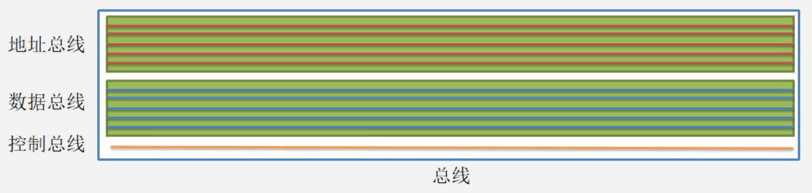
</div>

### 数据线

&emsp;&emsp;&ensp;数据线：用来承载在源部件和目的部件之间传输的信息,这个信息可能是**数据、命令字或地址**（如果数据线和地址线复用的话）。

<div style=" margin: 0 auto; max-width: 70%;">
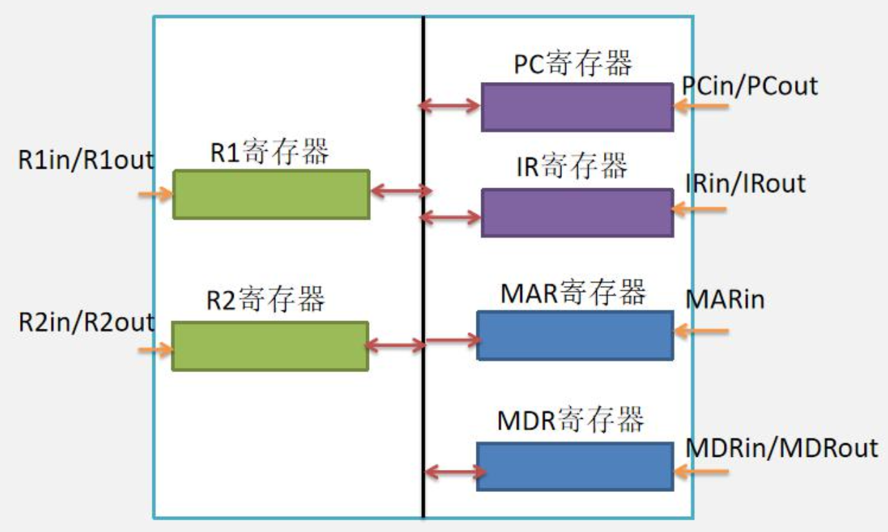
</div>

### 地址线

&emsp;&emsp;&ensp;地址线：用来给出源数据或目的数据所在的主存单元或 ${I/O}$ 端口的地址，地址线是**单向的**。若要输出一个数据到外设，那么 ${CPU}$ 也必须把该外设的地址（实际上是 ${I/O}$ 端口的地址）送到地址线上。

### 总线地址复用

&emsp;&emsp;&ensp;总线地址复用指的是总线**取消地址线**，只保留数据线。在数据线上，**有顺序地传输地址和数据**，用数据线先传输地址，再传输数据。
&emsp;&emsp;&ensp;优点：
1. 地址复用方式用数据线传输地址，总线中可以不再设置地址线，减少了信号线的根数。
2. 增加了数据线的利用率。

### 控制线

&emsp;&emsp;&ensp;控制线：用来传输**定时信号**和**命令信号**。除地址线和数据线以外的通信线都可以称为控制线，如**时钟线、复位线、操作命令线、总线请求和总线回答线**等。

### 总线数据传输

&emsp;&emsp;&ensp;以将 ${R2}$ 中的值传递给 ${MDR}$ 为例：
1. ${R2}$ 寄存器从总线中的控制线上收到 ${R2_{out}}$ 信号，${R2}$ 寄存器将其中的数据输出到总线的数据线上。
2. ${MDR}$ 从总线上的控制线上收到信号 ${MDR_{in}}$，收到该信号后，${MDR}$ 打开总线上的接口，从总线中的数据总线上将数据读入其中。

## 总线性能指标

&emsp;&emsp;&ensp;总线的性能指标，目的是评价一个总线是好是坏，考试中考察的有如下几种标准：
1. 总线宽度
2. 总线时钟频率
3. 总线带宽
4. 总线完成一次传输周期（总线周期）
5. 总线定时方式

### 总线宽度

&emsp;&emsp;&ensp;**总线中数据线的条数称为总线宽度**，它决定了每次能同时传输的信息的位数。一般情况下，真题中的总线宽度一般为 ${8，16，32}$。

### 总线时钟频率
&emsp;&emsp;&ensp;总线时钟频率，表示总线在 ${1}$ 秒钟内，全部用于传送数据可以达到的传送的次数。
&emsp;&emsp;&ensp;比如 ${1}$ 根总线的时钟频率 ${800MHz}$，表示理想状态下总线在一秒内包含 ${800,000,000}$（${8}$ 亿次）个总线时钟周期。如果每个时钟周期执行一次数据传送操作，最多执行（${8}$ 亿次）传送操作。而总线时钟周期是总线时钟频率的倒数， 表示理想状态总线传送一次数据的时间。
&emsp;&emsp;&ensp;总线工作频率：早期的总线通常一个时钟周期传送一次数据，因此总线工作频率等于总线时钟频率。现在有些总线一个时钟周期可以传送 ${2}$ 次或 ${4}$ 次数据。因此总线工作频率是总线时钟频率的 ${2}$ 倍或 ${4}$ 倍。

### 总线带宽
&emsp;&emsp;&ensp;总线带宽，可理解为总线的最大数据传输率，即**单位时间内总线上最多可传输数据的位数**，通常用每秒传送信息的字节数来衡量，单位可用字节/秒(B/s) 表示。总线带宽 = 总线工作频率 * (总线宽度/8)。

### 总线周期

&emsp;&emsp;&ensp;总线在完成一次传输周期时（总线周期），可分为四个阶段：
1. 申请分配阶段：由需要使用总线的主模块（或主设备）提出申请，经总线仲裁机构决定下一传输周期的总线使用权授于某一申请者；
2. 寻址阶段：取得了使用权的主模块，通过总线发出本次打算访问的从模块（或从设备）的存储地址或设备地址及有关命令，启动参与本次传输的从模块；
3. 传数阶段：主模块和从模块进行数据交换，数据由源模块发出经数据总线流入目的模块；
4. 结束阶段：主模块的有关信息均从系统总线上撤除，让出总线使用权。对于仅有一个主模块的简单系统，就无需申请、分配和撤除了，总线使用权始终归它占有。对于包含中断、${DMA}$ 控制或多处理器的系统，还得有某种分配管理机构来参与。
&emsp;&emsp;&ensp;结论：总线周期表示主设备在和从设备通信时，从主设备申请总线，发出地址开始到主设备收到从设备数据为止的时间。

&emsp;&emsp;&ensp;如果发送方和接受方均为 ${CPU}$ 中的寄存器：比如 ${CPU}$ 中的 ${r2}$ 寄存器将数据通过 ${CPU}$ 内部的片内总线发送到 ${MDR}$ 寄存器，总线周期的申请分配阶段、寻址阶段、结束阶段可以忽略不计，总线周期 = 传数阶段的时间。

&emsp;&emsp;&ensp;如果主设备为 ${CPU}$ 和从设备主存：由于总线周期表示从主设备获取总线控制权，发出地址开始，到收到数据为止的时间。在一个总线周期中包含了主存准备数据的时间。
&emsp;&emsp;&ensp;所以对于 ${CPU}$ 和主存两个设备之间讨论总线周期，总线周期的时间=总线读事务的时间。也就是说一个总线周 期可能会包含多个总线时钟周期。

### 总线定时方式
&emsp;&emsp;&ensp;按照总线上信息传送的定时方式来分，有同步通信、异步通信 ${2}$ 类。
&emsp;&emsp;&ensp;同步通信总线采用**同步通信方式**。同步通信方式采用**公共的时钟信号**进行定时。挂接在总线上的所有设备都从 ${CPU}$ 获得时钟信号。同步通信的传输协议非常简单，只要在规定的第几个时钟周期内完成特定的操作即可。
&emsp;&emsp;&ensp;异步通信总线**采用异步通信方式**。异步通信下，挂接在总线上的设备时钟不一致。因此在传输数据时，数据会**设置起始位和终止位以及校验位**，当检测到终止位时，证明此数据帧发送完毕。

### 同步通信总线
&emsp;&emsp;&ensp;它采用公共的时钟信号进行定时。挂接在总线上的所有设备都从 ${CPU}$ 获得时钟信号，总线的时钟也和 ${CPU}$ 保持一致。同步总线的传输协议非常简单，只要**在规定的第几个时钟周期内完成特定的操作即可**。
&emsp;&emsp;&ensp;例如，对于处理器通过总线访问存储器的操作来说,可以规定以下“存储器读操作”协议：
1. 主控设备（即处理器）在第 ${1}$ 个时钟周期发送地址和存储器读命令；
2. 从设备（即存储器）在第 ${5}$ 个时钟周期将数据放到总线上作为响应；
3. 处理器在第 ${6}$ 个时钟周期从 ${MDR}$ 上取数据。

<div style=" margin: 0 auto; max-width: 80%;">
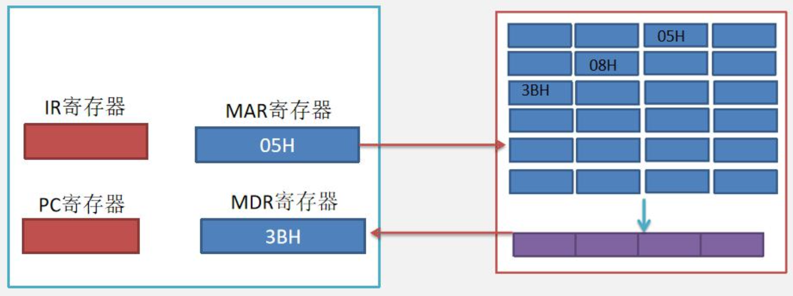
</div>

&emsp;&emsp;&ensp;同步通信方式有几个缺点：
1. 总线定时以**最慢设备所花时间为标准**，所以同步总线适合于存取时间相差不大的多个功能部件之间的通信。
2. 由于时钟偏移问题，导致**同步总线不能过长**，否则将会降低总线传输效率。
3. 因为同步总线通常采用**并行传输方式**，同时并行传输的这些数据位信号的定时必须相同。因此，**实现更快传送速度、更长传输线的总线时**，会出现**总线串扰**，导致传送到另一端时的波形发生变形。

### 异步通信
&emsp;&emsp;&ensp;异步通信克服了同步通信的缺点，允许各模块速度的不一致性，给设计者充分的灵活性和选择余地。
&emsp;&emsp;&ensp;它**没有公共的时钟标准，不要求所有部件严格的统一动作时间，而是采用应答方式（又称握手方式）**。
&emsp;&emsp;&ensp;即当主模块发出请求（${Request}$）信号时，一直等待从模块反馈回来响应（${Acknowledge}$）信号后，才开始通信传输信息。

<div style=" margin: 0 auto; max-width: 80%;">
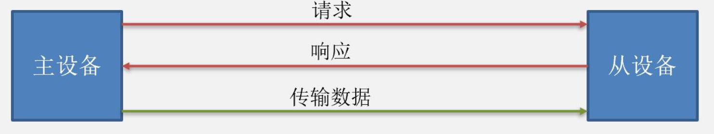
</div>

### 异步通信总线
&emsp;&emsp;&ensp;由于同步通信总线的上述问题，现在越来越多的总线采用异步通信方式。异步通信方式按照**串行方式传输数据**。
&emsp;&emsp;&ensp;因为串行总线每次在一根信号线上传送数据位，数据线上的传输速率可以比并行总线高得多。
&emsp;&emsp;&ensp;异步传输由于不采用统一的时钟，在传输数据时需要给数据添加**起始位和终止位以及校验位**。异步通信总线传输的 ${7bit}$ 的数据帧如下：

<div style=" margin: 0 auto; max-width: 90%;">
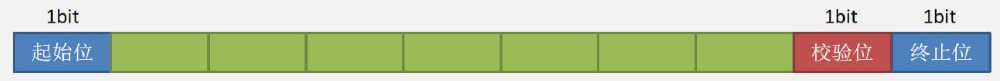
</div>

&emsp;&emsp;&ensp;当检测到终止位后，设备就知道该数据帧已经读取完毕。
&emsp;&emsp;&ensp;异步通信总线主要用于连接高速的外部设备。如 ${PCI-express\quad 2.0}$ 总线就是采用异步串行方式进行传输用于连接声卡。
&emsp;&emsp;&ensp;${USB}$ 控制器和 ${USB}$ 设备连接的 ${USB}$ 总线，也采用**异步串行**方式进行传输。

## 总线分类

### 片内总线

&emsp;&emsp;&ensp;片内总线是 ${CPU}$ 内部的总线，目的是连接 ${CPU}$ 内部的各个寄存器，各种寄存器之间的数据通过**片内总线**来传递。

### 系统总线

&emsp;&emsp;&ensp;系统总线指连接 ${CPU}$、存储器和各种 ${I/O}$ 模块等主要部件的总线，系统总线包含**处理器总线**和**存储器总线**。平常接触最多的系统总线就是**存储器总线**。存储器总线用于**内存控制器和主存连接的总线**。
&emsp;&emsp;&ensp;注：内存控制器（又叫做**北桥芯片**）具备以下两个功能。
1. 对 ${CPU}$ 内部的 ${Cache}$ 提供主存块，对 ${CPU}$ 内部寄存器提供对应的数据。
2. 作为 ${DMA}$ 控制器，用于**控制主存中的数据和显卡进行交互**。

<div style=" margin: 0 auto; max-width: 90%;">
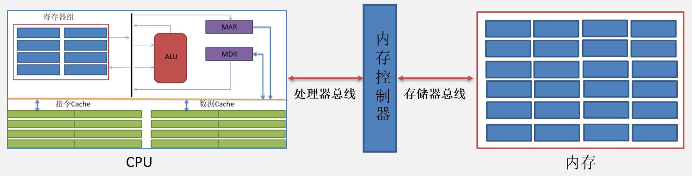
</div>

#### 存储器总线

&emsp;&emsp;&ensp;存储器总线是**内存控制器和内存**之间连接的总线。实际上，**存储器总线就是内存条的卡槽**。一个主板上可有由多个存储器总线，采用这种结构的称为**多通道结构**。比如一个双通道（也就是说有 ${2}$ 个内存条卡槽与之配套），就需要有 ${2}$ 根存储器总线，存储器总线带宽随之乘 ${2}$ 倍。

### I/O总线

&emsp;&emsp;&ensp;${I/O}$ 总线用于为系统中的各种 ${I/O}$ 设备提供输入输出通路，在物理上通常是主板上的一些 ${I/O}$ 扩展槽。
&emsp;&emsp;&ensp;第一代 ${I/O}$ 总线有 ${ISA}$ 总线、${EISA}$ 总线、${VESA}$ 总线，这些 ${I/O}$ 总线早已被淘汰。
&emsp;&emsp;&ensp;第二代 ${I/O}$ 总线包括 ${PCI、AGP}$。
&emsp;&emsp;&ensp;**第三代 ${I/O}$ 总线是 ${PCI-Express}$**。

#### PCI-Express

&emsp;&emsp;&ensp;目前计算机中的显卡主要采用 ${PCI-Express}$ 总线连接。${PCI-Express}$ 总线采用**串行传输方式**。两个 ${PCI-Express}$ 设备之间以一个链路（${link}$）相连，每个链路可包含多条通路。${PCI-Express \times n}$ 表示具有 ${n}$ 个通路的 ${PCI-Express}$ 链路。
&emsp;&emsp;&ensp;每条通路由发送和接收数据线构成，在发送和接收两个方向上都各有两条差分信号线，**可同时发送和接收数据**。在发送和接收过程中，每个数据字节实际上被转换成了 ${10}$ 位信息被传输，以保证所有位都含有信号电平的跳变。

<div style=" margin: 0 auto; max-width: 70%;">
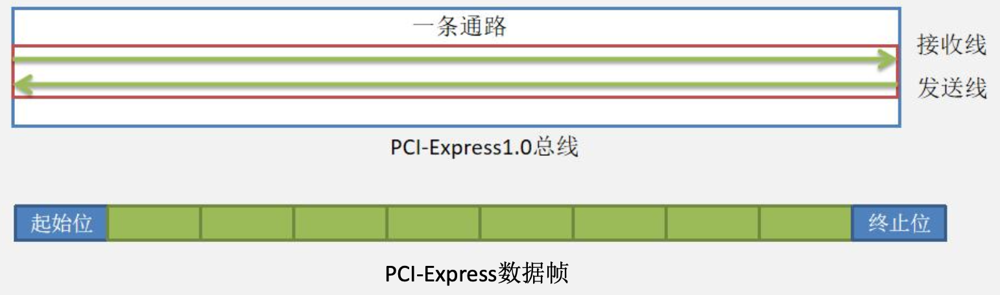
</div>

&emsp;&emsp;&ensp;若 ${PCI-Express\quad 1.0}$ 规范支持通路中每个方向的发送或接受速率为 ${2.5Gb/s}$，则
${PCI-Express\quad 1.0}$ 总线的总带宽计算公式（单位为 ${GB/s}$）为：${\frac{2.5Gb/s \times 2 \times 通路数}{10}}$

&emsp;&emsp;&ensp;根据上述公式可知，在 ${PCI-Express\quad 1}$ 规范下 ${PCI-Express\times 1.0}$ 的总带宽为
${\frac{2.5Gb/s \times 2 \times 1}{10} = 0. 5GB/s}$

&emsp;&emsp;&ensp;即 ${PCI-Express\times 2}$ 的总带宽为 ${1GB/s，PCI-Express \times 16}$ 的总带宽为8GB/s。

### 多总线结构
&emsp;&emsp;&ensp;传统的多总线结构知识点总结：
1. 离 ${CPU}$ 越近，总线的速度越快，图中最快的是处理器总线。
2. 南桥芯片就是 **${IO}$ 控制芯片**，负责控制 ${IO}$ 设备。
3. 总线之间**必须通过桥接器相连**。

<div style=" margin: 0 auto; max-width: 90%;">
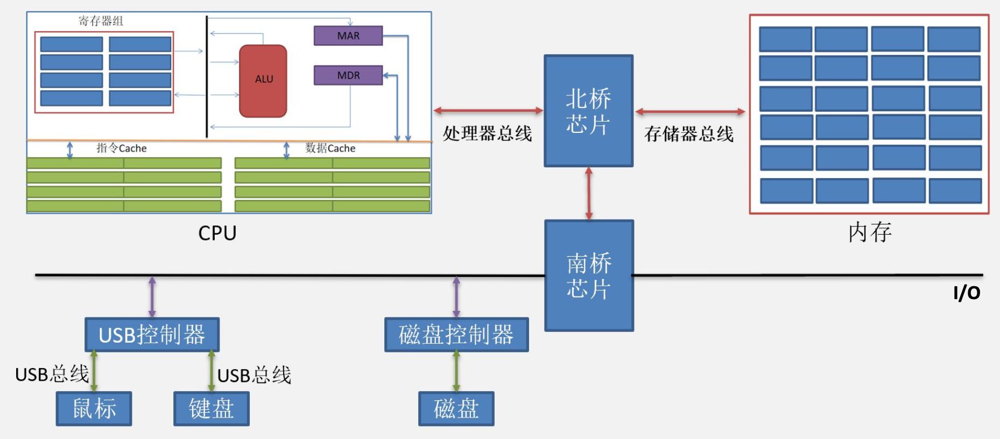
</div>

## 总线事务

&emsp;&emsp;&ensp;数据流通过称为总线的共享电子电路在 ${CPU}$ 和 ${DRAM}$ 主存之间来来回回。**每次 ${CPU}$ 和主存之间的数据传送都是通过一系列步骤来完成的**，这些步骤称为总线事务。读事务：从主存传送数据到 ${CPU}$。写事务：从 ${CPU}$ 传送数据到主存。

&emsp;&emsp;&ensp;总线读事务：${CPU}$ 想要访问主存中的数据。
1. ${CPU}$ 跟总线控制器申请总线控制权，总线控制器将总线控制权给到 ${CPU}$。
2. ${CPU}$ 将地址送进 ${MAR}$，并经过总线送到主存。主存收到地址后，${DRAM}$ 准备数据。
3. 数据准备完毕后将数据发送到 ${MDR}$。

### 总线事务的四个阶段

1) **请求阶段**。主设备（${CPU}$ 或 ${DMA}$）发出总线传输请求，并且获得**总线控制权**。
2) **仲裁阶段**。总线仲裁机构决定将下一个传输周期的总线使用权授予某个申请者。
3) **寻址阶段**。主设备通过总线给出要访问的从设备地址及有关命令，启动从模块。
4) **传输阶段**。主模块和从模块进行数据交换，**可单向或双向进行数据传送**。
5) **释放阶段**。主模块的有关信息均从系统总线上撤除，让出总线使用权。 在总线事务的传输阶段，主、从设备之间一般只能传输一个字长的数据。

### 突发传送总线事务

&emsp;&emsp;&ensp;突发传送总线事务方式下，总线能够进行**连续的成块数据传送**。传送开始时，先给出**主存块在存储器中的首地址**，然后连续地传送主存块中的存储单元。一次突发传送总线事务的过程包括：
1. 送首地址和命令；
2. 存储器准备数据；
3. 总线传送数据。
&emsp;&emsp;&ensp;当 ${CPU}$ 从主存读一个存储单元的内容时，采用读总线事务。当主存块从主存送入 ${Cache}$ 时，采用突发传送总线事务。

### 总线事务分离

&emsp;&emsp;&ensp;未采用事务分离：${CPU}$ 获取总线控制权后，作为主设备，将地址从其内部的 ${MAR}$ 给到主存。在主存准备好数据前，${CPU}$ 一直占据着总线控制权。数据准备好后，主存向 ${CPU}$ 申请总线控制权，在获得总线控制权后将数据传输出去。
&emsp;&emsp;&ensp;事务分离：${CPU}$ 获取总线控制权后，作为主设备，将地址从其内部的 ${MAR}$ 给到主存，并**释放总线控制权**。主存数据准备好后，主存向总线控制器申请总线控制权，在获得总线控制权后将数据传输出去。

## 过程调用（汇编细节）

&emsp;&emsp;&ensp;过程调用从逻辑上看，指的是在一个 ${C}$ 语言函数中调用另一个函数。比如在 ${main}$ 函数中调用 ${test01}$ 函数。从程序底层的视角看，过程调用实际上就是一次次的**将被调用函数的必要的信息调入程序栈的过程**。

<div style=" margin: 0 auto; max-width: 20%;">
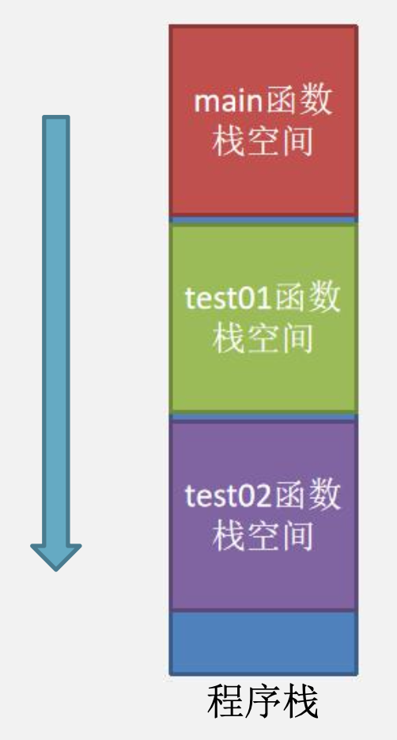
</div>

```cpp
void test02(){
    ...
}
void test01(){
    test02();
}
int main(){
    ...
    test01();
    ...
}
```

### 函数调用必要的准备工作
&emsp;&emsp;&ensp;以 ${set\_ array}$ 调用 ${compare}$ 为例，当一个 ${A}$ 函数调用 ${B}$ 函数时，**程序会将 ${A}$ 函数必要的参数、局部变量、以及 ${ra}$ 寄存器，${fp}$ 寄存器中的信息保存到栈中**。所以 ${A}$ 函数需要先计算自己的栈空间，分析哪些数据需要保存在自己的程序栈中。

<div style=" margin: 0 auto; max-width: 70%;">
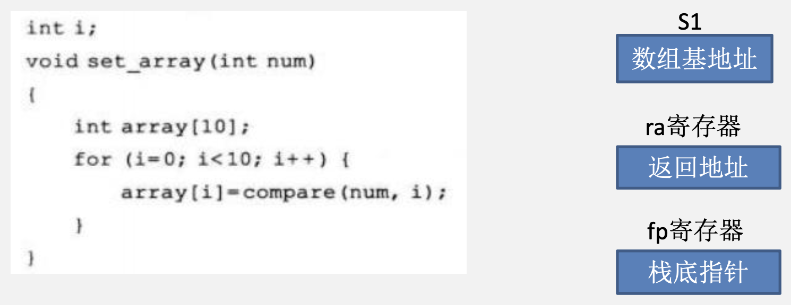
</div>

&emsp;&emsp;&ensp;注意：本节是按照 ${MIPS}$ 指令集为原型，在 ${MIPS}$ 指令集中**所有寄存器的大小都是 ${4B}$**。

<div style=" margin: 0 auto; max-width: 90%;">
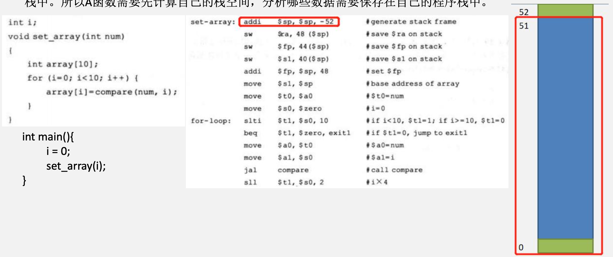
</div>

<div style=" margin: 0 auto; max-width: 90%;">
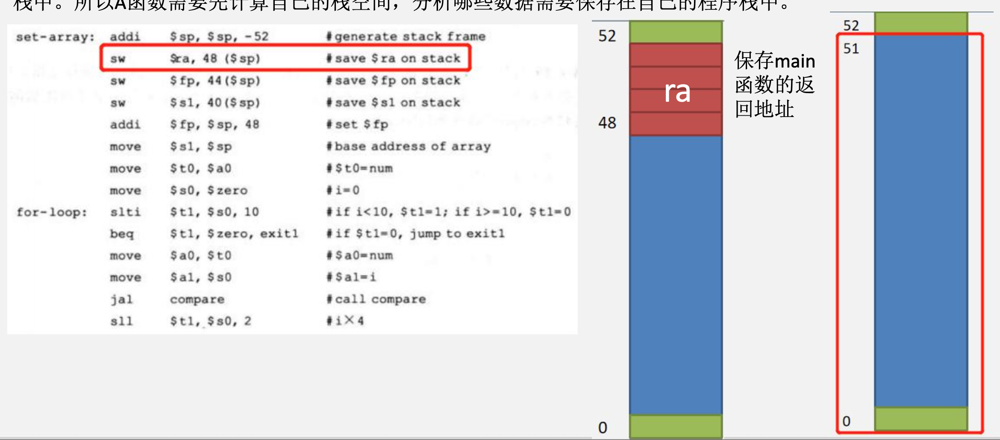
</div>

<div style=" margin: 0 auto; max-width: 90%;">
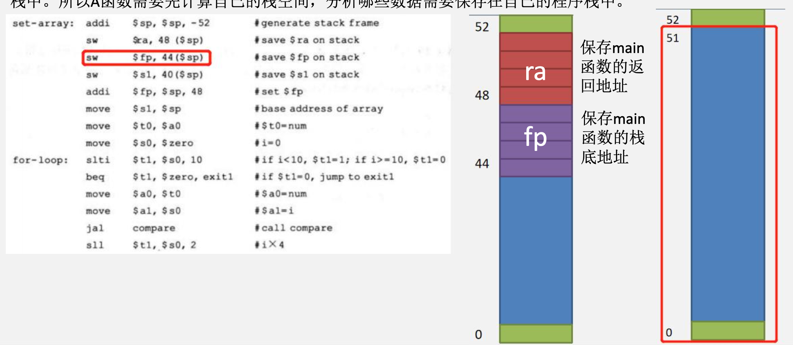
</div>

<div style=" margin: 0 auto; max-width: 90%;">
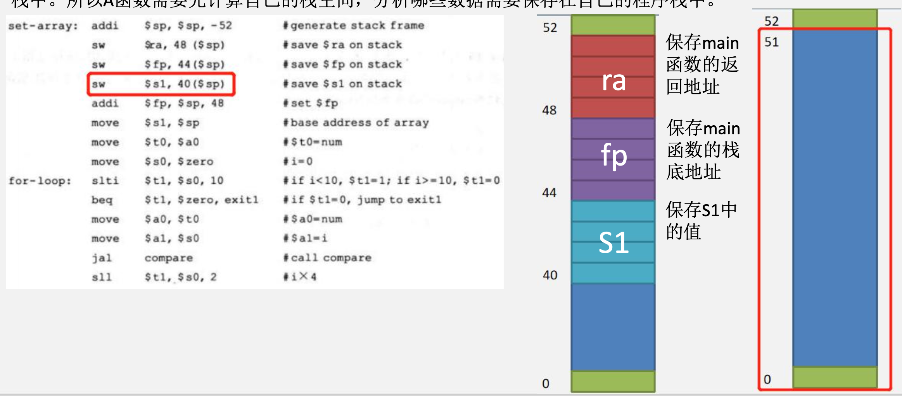
</div>

<div style=" margin: 0 auto; max-width: 90%;">
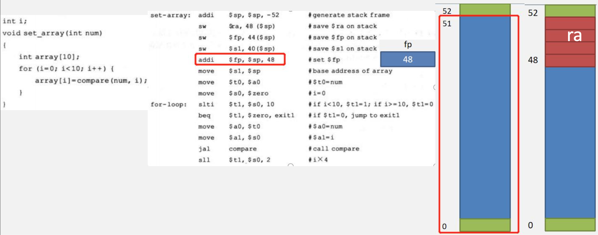
</div>

&emsp;&emsp;&ensp;过程调用的步骤：假定过程 ${P}$ 调用过程 ${Q}$，则过程调用的执行步骤如下：
1. ${P}$ 将入口参数放到 ${Q}$ 能访问到的地方；

<div style=" margin: 0 auto; max-width: 90%;">
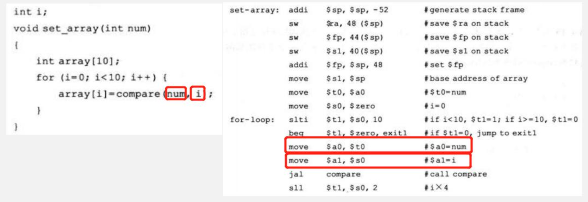
</div>

2. ${P}$ 将返回地址存到特定的地方，然后将控制转移到 ${Q}$；

<div style=" margin: 0 auto; max-width: 90%;">
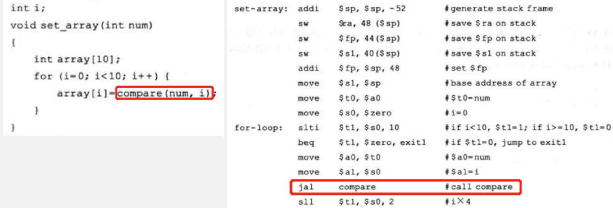
</div>

<div style=" margin: 0 auto; max-width: 90%;">
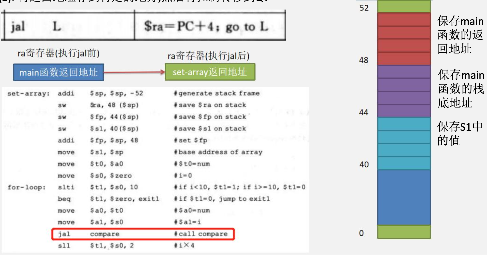
</div>

<div style=" margin: 0 auto; max-width: 90%;">
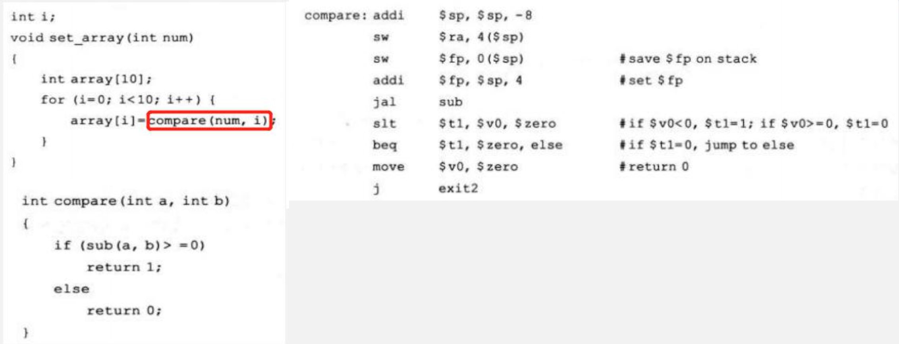
</div>

&emsp;&emsp;&ensp;预处理：当一个 ${A}$ 函数调用 ${B}$ 函数时，程序会将 ${A}$ 函数必要的参数，局部变量。以及 ${ra}$ 寄存器，${fp}$ 寄存器中的信息保存到栈中。所以 ${A}$ 函数需要**先计算自己的栈空间**，分析**哪些数据需要保存在自己的程序栈中**。

<div style=" margin: 0 auto; max-width: 90%;">
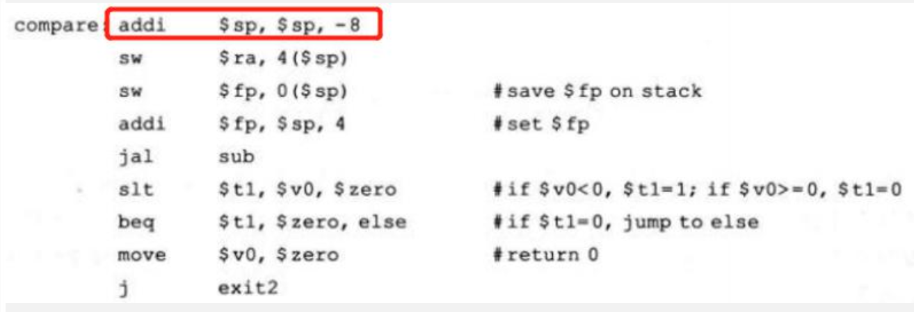
</div>

1. ${Q}$ 为 ${P}$ 保存现场（多数情况下，指的其实就是ra寄存器和fp寄存器中的值，以及一些特数参数，比如数组基地址），并为自己的局部变量分配空间；

<div style=" margin: 0 auto; max-width: 90%;">
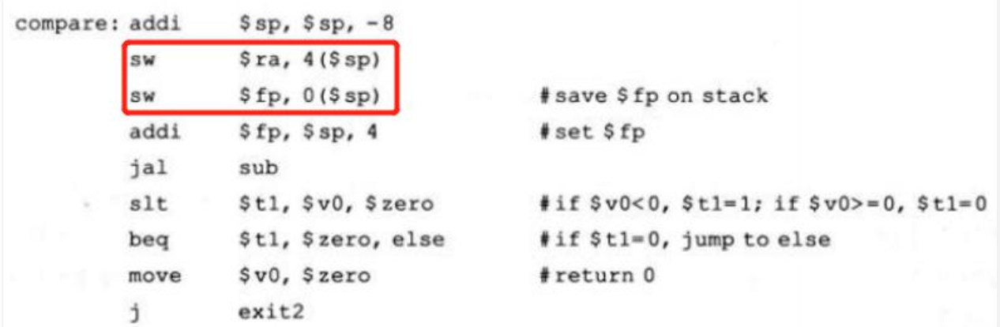
</div>

4. 执行过程 ${Q}$；

<div style=" margin: 0 auto; max-width: 90%;">
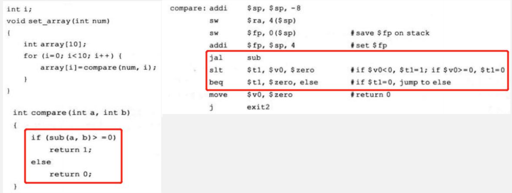
</div>

5. ${Q}$ 将返回结果放到 ${P}$ 能访问到的地方；

<div style=" margin: 0 auto; max-width: 90%;">
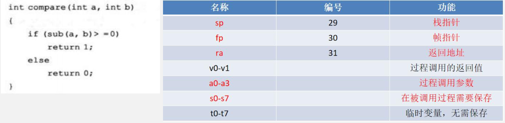
</div>
<div style=" margin: 0 auto; max-width: 90%;">
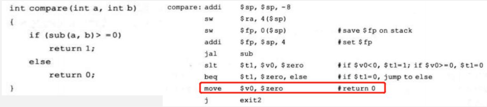
</div>

6. ${Q}$ 取出返回地址，将控制转移到 ${P}$。把 ${set\_ array}$ 中保存的 ${i=5}$ 语句的地址存入到 ${PC}$ 中，${main}$ 函数的 ${fp}$ 恢复到 ${fp}$ 寄存器中。

<div style=" margin: 0 auto; max-width: 90%;">
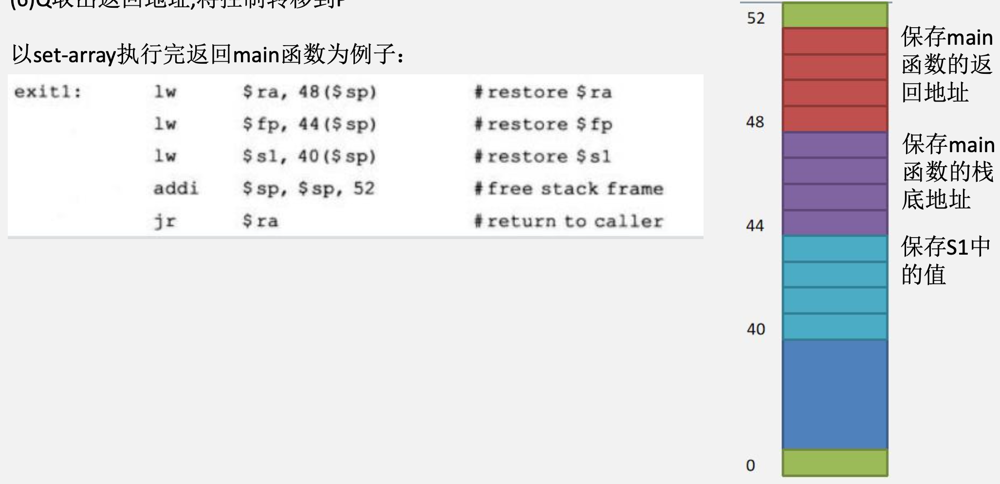
</div>

<div style=" margin: 0 auto; max-width: 40%;">
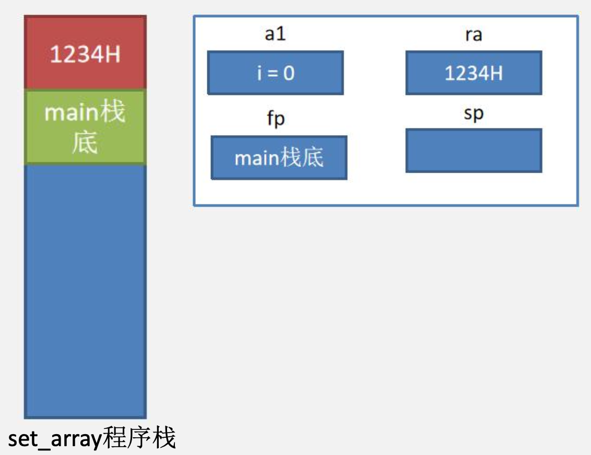
</div>


