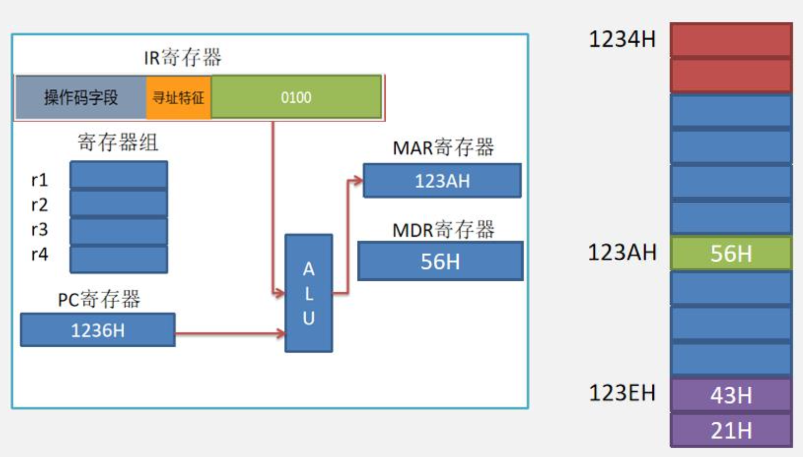
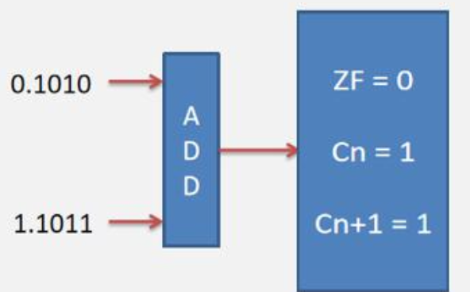

# 指令系统

## 指令基本知识

### 什么是指令？
&emsp;&emsp;&ensp;计算机硬件只能识别和理解机器语言程序，用各种高级语言编写的源程序最后都要翻译（汇编、解释或编译）成以指令形式表示的机器语言才能在计算机上执行。一条指令，首先要明确：

1. 指令要做什么操作？
2. 被操作的数放在哪？

<div style=" margin: 0 auto; max-width: 90%;">

</div>

### 指令集体系结构（Instruction Set Structure, ISA）

&emsp;&emsp;&ensp;${ISA}$ 是软件和硬件接口的完整定义：它定义了一台计算机可以执行的所有指令的集合，每条指令执行什么操作，以及指令所处理的操作数存放的地址空间和操作数类型。具体说来，${ISA}$ 规定的内容包括：数据类型及格式、指令格式、寻址方式和可访问地址空间大小、${I/O}$ 空间的编址方式、中断结构、机器的工作状态定义和切换、输入输出结构和数据传送方式、存储保护方式等。
&emsp;&emsp;&ensp;可以看出，${ISA}$ 是指软件可以感知到的部分，又称作软件可见部分。

<div style=" margin: 0 auto; max-width: 70%;">

</div>

### 指令的基本组成

&emsp;&emsp;&ensp;指令的操作码表明，他要做什么，比如我的指令集有 ${4}$ 种操作：加，减，乘，除那么操作码的位数只需要 ${2bit}$ 就可以表示上述四种操作。
&emsp;&emsp;&ensp;指令的地址码表明要操作的数存在哪。比如指令 ${ADD R1，R2，R3}$，意思是把寄存器 ${R1}$ 中的数和 ${R2}$ 中的数相加，存到 ${R3}$ 中。这里 ${R1}$ 和 ${R2}$ 叫源操作数，${R3}$ 是目的操作数。

<div style=" margin: 0 auto; max-width: 70%;">

</div>

&emsp;&emsp;&ensp;要操作的数一般放在哪里？
&emsp;&emsp;&ensp;源操作数：直接给出或者寄存器或者内存
&emsp;&emsp;&ensp;目的操作数：寄存器或者内存

我们考试中遇到的指令，按照地址码的个数可以分成4类指令。
1. 零地址指令
2. 单地址指令
3. 二地址指令
4. 三地址指令

### 零地址指令

&emsp;&emsp;&ensp;零地址指令，顾名思义，指令只给出了操作码，没有给出地址码。

<div style=" margin: 0 auto; max-width: 40%;">

</div>

&emsp;&emsp;&ensp;${HALT}$ 表示停机指令，即将计算机关闭。运行此指令不需要任何地址码，只需要操作码。

### 单地址指令
&emsp;&emsp;&ensp;单地址指令，指令中只有一个操作码和一个地址码。

<div style=" margin: 0 auto; max-width: 70%;">

</div>

```cpp
for(int i=0; i<10; i++){
    sum += i;
}
```

&emsp;&emsp;&ensp;这里面的 ${i++}$，假设 ${i}$ 的地址为 ${01234H}$ 用指令表示叫 ${inc 01234H}$，表示地址 ${i}$ 中的数据自增，该指令就是单地址指令。

### 双地址指令

&emsp;&emsp;&ensp;双地址指令，指令中有一个操作码字段两个地址码字段。

<div style=" margin: 0 auto; max-width: 60%;">

</div>

&emsp;&emsp;&ensp;比如双地址指令：${ADD r1，r2;}$ 他的意思是将 ${r1}$ 中的数和 ${r2}$ 中的数相加，存入 ${r1}$ 中。这里 ${r1\quad r2}$ 在执行加法前叫做**源操作数**，在执行加法后， ${r1}$ 叫做**目的操作数**。

### 三地址指令

&emsp;&emsp;&ensp;三地址指令，指令中有一个操作码字段三个地址码字段。

<div style=" margin: 0 auto; max-width: 60%;">

</div>

&emsp;&emsp;&ensp;比如三地址指令：${ADD r1，r2，r3;}$ 他的意思是将 ${r1}$ 中的数和 ${r2}$ 中的数相加，存入 ${r3}$ 中。这里 ${r1 r2}$ 叫做源操作数，${r3}$ 叫做目的操作数。

### 定长操作码

&emsp;&emsp;&ensp;定长操作码指的是指令中操作码字段长度是固定的，当操作码字段的长度是 ${n}$ 时，可以支持的指令种类为 ${2}$。即使操作数的个数减少，空出的指令字段也无法被利用。

<div style=" margin: 0 auto; max-width: 60%;">

</div>

### 可变长操作码

&emsp;&emsp;&ensp;可变长操作码是真题的常考点，在这种指令中，指令字长一般是不变的，当指令中的操作数个数不同时，操作码的长度也有区别，当操作数个数减少时，操作码字段可以更长，因此可以支持更多的操作。

<div style=" margin: 0 auto; max-width: 70%;">

</div>

<div style=" margin: 0 auto; max-width: 90%;">

</div>

#### 可变长操作码需注意的点

1. 不允许短码是长码的前缀，即短码操作码不能与长操作码前面部分代码相同。
2. 各指令的操作吗一定不能重复。
3. 通常情况下，使用频率高的使用短操作码，使用频率低的使用长操作码，类似于哈夫曼树的思想，尽可能减少指令译码和分析的时间

&emsp;&emsp;&ensp;令指令字长为 ${16bit}$，每个地址码均为 ${4bit}$，支持操作码扩展。我们可以采取如下设计：原本可以表示 ${16}$ 个三个地址指令，我只取其中 ${16}$ 个做三地址指令，留下 ${1111}$ 来用作后续的操作码拓展。

<div style=" margin: 0 auto; max-width: 90%;">

</div>

## 寻址方式

### 寻址方式的目的
&emsp;&emsp;&ensp;上小节提到，指令操作码用于表示指令要执行什么操作，而指令的地址码用于表示需要执行操作的数据存放在哪里。这些地址可以是寄存器，也可以是主存中的某个主存单元，甚至是直接给出。
&emsp;&emsp;&ensp;比如指令 ${addi r1， r2，1234H;}$ 这个指令的意思是把 ${r2}$ 中的值和主存地址 ${1234H}$ 中的值相加，相加后的结果存 入寄存器 ${r1}$ 中。

<div style=" margin: 0 auto; max-width: 90%;">

</div>

&emsp;&emsp;&ensp;寻址方式其实就是在研究如何把指令操作的数据取出来。我们一般把这个数据叫做操作数。

&emsp;&emsp;&ensp;指令给出操作数或操作数地址的方式称为寻址方式。考试中主要考察的寻址方式主要有以下几种：
1. 操作数、操作数所在的寄存器或操作数有效地址直接在指令中给出
   1. 立即寻址
   2. 直接寻址
   3. 寄存器寻址
2. 操作数的有效地址存在于指令给出的内存地址或寄存器中 
   1. 间接寻址
   2. 寄存器间接寻址
3. 操作数的有效地址需要计算得到
   1. 基址寻址
   2. 变址寻址
   3. 相对寻址

### 立即寻址

&emsp;&emsp;&ensp;在指令中直接给出操作数本身，这种操作数称为立即数，这种寻址方式叫做立即寻址。
&emsp;&emsp;&ensp;立即寻址方式下由于操作数在指令本身给出，所以取操作数时不需要访问存储器。只会在取指令时访问一次主存。
&emsp;&emsp;&ensp;寻址特征：用来表达操作数用那种寻址方式获取。如果题目中给出了指令可以有 ${8}$ 种寻址方式来获取操作数，则寻址特征占 ${3bit}$。

<div style=" margin: 0 auto; max-width: 70%;">

</div>

### 直接寻址

&emsp;&emsp;&ensp;指令中给出的地址码是操作数的有效地址，这种寻址方式叫做直接寻址方式。在采用直接寻址的情况下，${CPU}$ 读取指令后获得数据的内存地址，再访问存储器中的该地址从而获取数据。
&emsp;&emsp;&ensp;有效地址：操作数的地址叫做有效地址。
1. 当 ${CPU}$ 获得指令后，会根据指令中的寻址特征，得到指令是什么寻址方式。
2. 当发现寻址特征是直接寻址时，会将指令的形式地址给到 ${MAR}$ 中。
3. 主存根据 ${MAR}$ 的值将其中存储的数据给到 ${MAR}$ 。（**取操作数需要一次访存**）

<div style=" margin: 0 auto; max-width: 80%;">

</div>

&emsp;&emsp;&ensp;**注意：直接寻址中的有效地址是一组无符号数，千万不能当成补码。**

### 寄存器寻址

&emsp;&emsp;&ensp;指令中给出的地址码是操作数所在的寄存器的编号。在采用寄存器寻址的情况下，${CPU}$ 读取指令后，根据其寄存器号，从对应的寄存器中获取操作数。

<div style=" margin: 0 auto; max-width: 50%;">

</div>

1. 当 ${CPU}$ 获得指令后，会根据指令中的寻址特征，得到指令是什么寻址方式。
2. 当发现寻址特征是寄存器寻址时，${CPU}$ 会从指令中给出的寄存器号 ${10}$，来得到操作数 ${3CH}$。（**取操作数不需要访存**）

### 间接寻址

&emsp;&emsp;&ensp;间接寻址的方式下，指令中给出的地址是间接地址。
&emsp;&emsp;&ensp;间接地址：首先是主存中的一个地址，间接地址中存储的数据是操作数的有效地址。
&emsp;&emsp;&ensp;下面例子中，指令中的 ${0010}$ 就是间接地址，${CPU}$ 查看寻址方式发现为间接寻址。将间接地址给到 ${MAR}$ 后，主存根据 ${MAR}$ 中的地址将其中存放的数据 ${05H}$ 放入 ${MDR}$ 中。
&emsp;&emsp;&ensp;间接地址：${0010}$
&emsp;&emsp;&ensp;有效地址：${05H}$

&emsp;&emsp;&ensp;得到有效地址后，将有效地址 ${05H}$ 放入 ${MAR}$ 中，并读取主存地址 ${05H}$ 中的数据 ${3BH}$ ，得出操作数为 ${3BH}$。
&emsp;&emsp;&ensp;间接地址：${0010}$
&emsp;&emsp;&ensp;有效地址：${05H}$
&emsp;&emsp;&ensp;操作数：${3BH}$

<div style=" margin: 0 auto; max-width: 70%;">

</div>

&emsp;&emsp;&ensp;在间接寻址中，获取操作数需要**两次访存**。
&emsp;&emsp;&ensp;第一次是**得到间接地址**，访问存储器获得有效地址。
&emsp;&emsp;&ensp;第二次是**得到有效地址**，访问存储器获得操作数。

### 多次间接寻址

&emsp;&emsp;&ensp;间接寻址可以存在多次间址，如果是多次间址，会在指令中添加多次间址标记，比如”一次间址寻址”，指令中间址表示为 ${1}$，指令中不再存放间接地址，而是**间接地址的地址**。

<div style=" margin: 0 auto; max-width: 70%;">

</div>

### 寄存器间接寻址

&emsp;&emsp;&ensp;指令中给出的地址码字段是**一个寄存器编号**，该寄存器中存放的是**操作数的有效地址**。
&emsp;&emsp;&ensp;如下指令中地址码部分为 ${01}$，寻址特征指示为寄存器间接寻址。
&emsp;&emsp;&ensp;步骤1. 
&emsp;&emsp;&ensp;从 ${CPU}$ 的 ${2}$ 号寄存器得到操作数的有效地址，并放入 ${MAR}$ 中。
&emsp;&emsp;&ensp;步骤2. 
&emsp;&emsp;&ensp;主存根据 ${MAR}$ 中保存的有效地址，将操作数读出，放入 ${MDR}$ 中。
&emsp;&emsp;&ensp;形式地址：${2}$ 号寄存器
&emsp;&emsp;&ensp;有效地址：${05H}$
&emsp;&emsp;&ensp;操作数：${08H}$

<div style=" margin: 0 auto; max-width: 70%;">

</div>

&emsp;&emsp;&ensp;间接寻址获得操作数**只需要一次访问存储器**，因为指令中给出寄存器号，可从寄存器中获得有效地址，根据有效地址访问存储器获得操作数。

### 基址寻址

&emsp;&emsp;&ensp;基址寻址方式下，指令中的**地址码字段给出一个偏移量**。注意，这个偏移量是一个**补码**。基准地址可以明显的指定一个寄存器，或隐含地由基址寄存器给出。隐含给出模式下，**操作数的有效地址=偏移地址+基地址寄存器的值**。

<div style=" margin: 0 auto; max-width: 70%;">

</div>

### 变址寻址

&emsp;&emsp;&ensp;变址寻址方式主要用于对线性表之类的数组元素进行方便的访问。采用变址寻址方式时，**指令中的地址码字段 ${A}$ 给出一个基准地址**。例如**数组的起始地址**，而数组元素相对于基准地址的偏移量在指令中由变址寄存器 ${I}$ 给出，这样，**变址寄存器的内容实际上就相当于数组元素的下标**，每个数据元素的有效地址为基准地址加变址寄存器的内容，即操作数的有效地址 ${EA=(I)+A}$，其中 ${(I)}$ 表示变址寄存器 ${1}$ 中的内容。

<div style=" margin: 0 auto; max-width: 70%;">

</div>

```cpp
// 以for循环读取数组为例:
int A[10];
for(int i=0; i<10; i++){
    A[i] = i; // 假设此时i = 2
    }
```

<div style=" margin: 0 auto; max-width: 70%;">

</div>

### 相对寻址

&emsp;&emsp;&ensp;如果某指令的**操作数的有效地址或转移目标地址**位于该指令所在位置的**前、后某个固定位置**上，则该操作数或转移目标可用相对寻址方式。采用相对寻址方式时，指令中的地址码字段 ${A}$ 给出一个**偏移量**，基准地址隐含，由 ${PC}$ 给出，即操作数有效地址或转移目标地址 ${EA=(PC)+A}$。
&emsp;&emsp;&ensp;相对寻址方式可用来**实现公共子程序的浮动或实现相对转移**。
&emsp;&emsp;&ensp;**注意：此处的PC中的数据在取指令时已经更新完毕。**

<div style=" margin: 0 auto; max-width: 70%;">

</div>

## 指令设计风格

&emsp;&emsp;&ensp;指令系统朝两个截然不同的方向的发展：一是增强原有指令的功能，设置更为复杂的新指令实现软件功能的硬化，这类机器称为**复杂指令系统计算机（${CISC}$）**，典型的有采用 ${x86}$ 架构的计算机；二是减少指令种类和简化指令功能，提高指令的执行速度，这类机器称为**精简指令系统计算机（${RISC}$）**，典型的有 ${ARM、MIPS}$ 架构的计算机。

&emsp;&emsp;&ensp;${CISC}$ 的主要特点如下：
1. 指令系统复杂庞大，指令数目一般为 ${200}$ 条以上。
2. 指令的**长度不固定**，指令格式多，寻址方式多。
3. 可以访存的指令不受限制。
4. 各种指令使用频度相差很大。
5. 各种指令执行时间相差很大，大多数指令需多个时钟周期才能完成。
6. 控制器**大多数采用微程序控制**。有些指令非常复杂，以至于无法采用硬连线控制。
7. **难以**用优化编译生成高效的目标代码程序。

&emsp;&emsp;&ensp;精简指令系统计算机（${RISC}$）的中心思想是要求指令系统简化，尽量使用寄存器寄存器操作指令，指令格式力求一致。${RISC}$ 的主要特点如下：
1. 选取使用频率最高的一些简单指令，复杂指令的功能由简单指令的组合来实现。
2. 指令长度固定，指令格式种类少，寻址方式种类少。
3. 只有 ${Load/Store}$（取数/存数）指令访存，其余指令的操作都在寄存器之间进行。
4. ${CPU}$ 中通用寄存器的数量相当多。
5. ${RISC}$ 一定采用指令流水线技术，大部分指令在一个时钟周期内完成。
6. 以**硬布线控制为主**，**不用或少用微程序控制**。
7. 特别**重视编译优化工作**，以减少程序执行时间。

<div style=" margin: 0 auto; max-width: 90%;">

</div>

### 指令风格与相对寻址

&emsp;&emsp;&ensp;如果指令采用 ${CISC}$ 风格，当前 ${IR}$ 中的指令为 ${2}$ 字节，${IR}$ 中指令的地址为 ${1234H}$。若指令中寻址特征为相对寻址，则 ${有效地址=PC+偏移量}$。

<div style=" margin: 0 auto; max-width: 70%;">

</div>

&emsp;&emsp;&ensp;如果指令采用 ${RISC}$ 风格，当前 ${IR}$ 中的指令为 ${2}$ 字节，${IR}$ 中指令的地址为 ${1234H}$。若指令中寻址特征为相对寻址，则 ${有效地址 = PC + 偏移量\times 2\quad 或\quad PC + 偏移量}$，具体情况看题目设计。

<div style=" margin: 0 auto; max-width: 70%;">

</div>

## 标志位生成

### 计算机中的标志位

&emsp;&emsp;&ensp;我们计算机中经常看见类似 ${if (n > 0)}$ 或者 ${if(n == 0)}$ 这样的分支语句。而分支语句成立与否取决于存放在标志寄存器中的标志位来进行判断判断。
&emsp;&emsp;&ensp;需要学习的标志位有如下几种：

1. **${ZF}$ 零标志位：**${ZF = 1}$ 时，代表等于 ${0}$，当 ${ZF = 0}$ 时，代表不等于 ${0}$。
2. **${CF}$ 进位/借位标志位：**${CF}$ 为 ${0}$ 代表无进位/借位，${CF}$ 为 ${1}$ 代表有**进位/借位**。实际上就是把机器数解释为无符 号数的溢出判断位。
3. **${SF}$ 符号标志位：**${SF = 1}$ 代表负数，${SF = 0}$ 代表非负数。
4. **${OF}$ 溢出标志位：**${OF = 0}$ 代表无溢出，${OF = 1}$ 代表有溢出，实际上就是把机器数解释为补码有符号数时的溢出判断位。

&emsp;&emsp;&ensp;${sub}$：减法标志位
&emsp;&emsp;&ensp;${C_{n+1}}$：机器数加法时最高位的进位标志

<div style=" margin: 0 auto; max-width: 30%;">

</div>

&emsp;&emsp;&ensp;${C_{n+1}}$：符号数进位标志
&emsp;&emsp;&ensp;${C_{n}}$：数值位进位标志

<div style=" margin: 0 auto; max-width: 30%;">

</div>

&emsp;&emsp;&ensp;当两个相加的有符号数的符号位都是 ${1}$ 或 ${0}$ 时，符号位与数值位进位相同说明未溢出，否则溢出。
&emsp;&emsp;&ensp;当两个相加的有符号数的符号位不同时，加法操作必然没有溢出，此时符号位和数值位的进位一定是一致的，${OF}$ 恒为 ${0}$。

&emsp;&emsp;&ensp;**选择题做法**：
&emsp;&emsp;&ensp;对于 ${ZF}$，我们只需要比较两个数的计算结果是否为0即可。
&emsp;&emsp;&ensp;对于 ${CF}$，${CF}$ 必须是两个无符号操作数进行操作后产生，我们只需要手动的对两个无符号数进行加减即可判断。
&emsp;&emsp;&ensp;如 ${4}$ 位无符号数，${A=12，B=5}$，请问 ${A+B，B-A}$ 后的 ${CF}$。
&emsp;&emsp;&ensp;对于 ${OF，OF}$ 必须是两个有符号数，只需要计算两个有符号数执行完相应操作后的结果是否仍在可表示的范围内。如 ${4}$ 位有符号数，${A=5，B=7，C=-6，D=-3}$；请问 ${A+B}$ 和 ${C+D}$ 是否溢出。

```cpp
int n=10; 
if(n > 5){
    ...
}
```

1. 执行 ${n}$ 和 ${5}$ 相减操作，首先生成第一个标志位 ${ZF}$。

<div style=" margin: 0 auto; max-width: 30%;">

</div>

2. 由于计算 ${10-5}$ 相当于计算 ${10+(-5)}$，所以计算 ${1010 + 1011}$，其次高位和最高位的进位都是 ${1}$。

<div style=" margin: 0 auto; max-width: 30%;">

</div>

3. 将 ${C_{n+1}}$ 与 ${SUB}$ 异或，由于是减法，所以 ${SUB = 1}$，异或后生成 ${CF}$ 位（由于是有符号操作，所以此位并没有任何作用）。

<div style=" margin: 0 auto; max-width: 30%;">

</div>

4. 将次高位进位 ${C_n}$ 与最高位进位 ${C_{n+1}}$ 进行异或得到 ${OF}$。

<div style=" margin: 0 auto; max-width: 30%;">

</div>

5. 由于最终的结果是正数，${SF}$ 操作位为 ${0}$。

<div style=" margin: 0 auto; max-width: 30%;">

</div>

### 有符号整数和无符号整数大于、小于的判断

&emsp;&emsp;&ensp;两个无符号数相减，${CF = 0，ZF = 0}$ 就是大于。${CF = 1，ZF = 0}$ 就是小于。
&emsp;&emsp;&ensp;两个有符号数相减，${SF = OF，ZF = 0}$ 就是大于。${SF != OF，ZF = 0}$ 就是小于。结果为负：${SF=1，OF=0}$ 或 ${SF=0，OF=1}$；结果为正：${SF=0，OF=0}$ 或 ${SF=1，OF=1}$。

## MIPS基本命令

### MIPS中的寄存器

<div style=" margin: 0 auto; max-width: 90%;">

</div>

### MIPS的指令格式
&emsp;&emsp;&ensp;${MIPS}$ 的指令字长固定为 ${32bit}$，${MIPS}$ 中有 ${32}$ 个寄存器，所以寄存器号占 ${5bit}$。${MIPS}$ 是 ${RISC}$ 类型指令。

<div style=" margin: 0 auto; max-width: 60%;">

</div>

### R型指令
&emsp;&emsp;&ensp;${R}$ 型指令是三地址指令，${R}$ 型指令的两个源操作数来自寄存器。
&emsp;&emsp;&ensp;**${R}$ 型指令中的 ${OP}$ 字段固定为 ${000000}$；**
&emsp;&emsp;&ensp;${R}$ 型指令 ${func}$ 字段用来表示 ${R}$ 型指令执行什么操作；
&emsp;&emsp;&ensp;${rs，rt}$ 的内容作为源操作数；
&emsp;&emsp;&ensp;${rd}$ 作为目的操作数；
&emsp;&emsp;&ensp;${shamt}$ 用于表示位移字段；

<div style=" margin: 0 auto; max-width: 60%;">

</div>

&emsp;&emsp;&ensp;例如 ${ADD\quad R1，R2，R3}$ 其意思为将寄存器 ${R1}$ 和 ${R2}$ 中的数据相加，存入寄存器 ${R3}$。假设 ${ADD}$ 指令的 ${func}$ 字段为 ${100000}$。

<div style=" margin: 0 auto; max-width: 60%;">

</div>

&emsp;&emsp;&ensp;${I}$ 型指令，与 ${R}$ 型指令的区别在于 ${I}$ 型指令中会直接给出一个立即数；
&emsp;&emsp;&ensp;${I}$ 型指令中 ${OP}$ 字段用于表示指令的操作
&emsp;&emsp;&ensp;${rs}$ 和立即数的内容作为源操作数；
&emsp;&emsp;&ensp;${rt}$ 作为目的操作数。

<div style=" margin: 0 auto; max-width: 60%;">

</div>

&emsp;&emsp;&ensp;例如 ${load r1，r2，1234H}$ 其意思为将寄存器 ${R1}$ 和立即数 ${1234H}$ 相加得到有效地址，主存读取有效地址的内容，将数据给到 ${r2}$ 寄存器。假设 ${OP}$ 字段为 ${010000}$。

<div style=" margin: 0 auto; max-width: 60%;">

</div>

<div style=" margin: 0 auto; max-width: 80%;">

</div>

&emsp;&emsp;&ensp;${J}$ 型指令主要是无条件跳转指令，指令中给出的是 ${26}$ 位直接地址，只要将当前 ${PC}$ 的高 ${4}$ 位拼上 ${26}$ 位直接地址，最后添两个 ${0}$ 就可以得到 ${32}$ 位的跳转目标地址。${J}$ 型指令的寻址方式只有一种，就是**变通的直接寻址**。

<div style=" margin: 0 auto; max-width: 60%;">

</div>

### 常见的MIPS基本指令

<div style=" margin: 0 auto; max-width: 90%;">

</div>

## 过程调用

### 什么是过程调用

&emsp;&emsp;&ensp;过程调用，又叫函数调用、子程序调用，是程序调用已经预先写好的一段程序的过程。在这个过程中，调用子程序的一方被称为调用者，被调用的子程序被称为被调用者。

### MIPS过程调用相关寄存器

<div style=" margin: 0 auto; max-width: 80%;">

</div>

### MIPS程序堆栈和使用方法

&emsp;&emsp;&ensp;堆栈，又名栈，是程序为了保存局部变量和一些其它变量专门分配的一块**内存区域**，在多任务操作系统中每一个**线程**都有一个独立的堆栈，堆栈类似于数据结构中的栈结构，但是一般**从高地址空间向低地址空间生长**，计算机中有专门的**栈指针寄存器 ${sp}$ **用来始终指向**堆栈的栈顶**。

<div style=" margin: 0 auto; max-width: 50%;">

</div>

&emsp;&emsp;&ensp;在 ${mips}$ 中，数据进栈和数据出栈操作均使用访存指令来实现。
&emsp;&emsp;&ensp;例如，将寄存器 ${s0,s1,s2}$ 的值依次入栈的操作为：

```c
addi $sp,$sp,-12
sw $s0,8 ($sp)
sw $s1,4 ($sp)
sw $s2,0 ($sp)
```

<div style=" margin: 0 auto; max-width: 50%;">

</div>

&emsp;&emsp;&ensp;栈空间：程序的栈空间（${Stack}$）是计算机内存中的一块区域，用于存储**程序在运行时所需的临时数据**。当一个函数被调用时，程序会将该函数**必要的参数、局部变量、以及 ${ra}$ 寄存器，${fp}$ 寄存器中的信息等**压入栈中：当函数执行完毕后，这些信息会被弹出栈空间。

```cpp
int i;

void set_array(int num){
    int array[10];
    for (i=0; i<10; i++){
        array[i]=compare(num, i);
    }
}

int compare(int a, int b){
    if (sub(a, b)>=0) return 1;
    else return 0;
}

int main(){
    int i=0;
    set_array(i);
    i=0;
}

```

1. 由于 ${set\_ array}$ 方法需要用到参数 ${i}$，所以将 ${i}$ 保存到寄存器 ${a1}$ 之中，以方便 ${set\_ array}$ 调用。

<div style=" margin: 0 auto; max-width: 50%;">

</div>

2. 当执行到 ${set\_ array(i)}$ 这条语句时，需要保存执行完 ${set\_ array}$ 方法后的地址，也就是 ${i=0}$ 这条语句的地址。保存的方法是 ${main}$ 函数将语句 ${i=0}$ 的地址存入到 ${ra}$ 寄存器。

<div style=" margin: 0 auto; max-width: 50%;">

</div>

3. ${set\_ array}$ 要把 ${ra}$ 寄存器的值和 ${fp}$ 寄存器的值保存到自己的程序栈。此时的 ${ra}$ 中保存的是语句 ${i=0}$ 的地址，${fp}$ 中保存的是 ${main}$ 函数的栈底。

<div style=" margin: 0 auto; max-width: 20%;">

</div>

4. 执行 ${set\_ array}$ 的函数体。

<div style=" margin: 0 auto; max-width: 60%;">

</div>

5. ${set\_ array}$ 函数将函数返回值保存到 ${v0}$ 寄存器中。
6. 把 ${set\_ array}$ 中保存的 ${i=0}$ 语句的地址存入到 ${PC}$ 中，${main}$ 函数的 ${fp}$ 恢复到 ${fp}$ 寄存器中。

<div style=" margin: 0 auto; max-width: 60%;">

</div>

&emsp;&emsp;&ensp;哪些必要的参数需要保存到程序栈中?

<div style=" margin: 0 auto; max-width: 80%;">

</div>