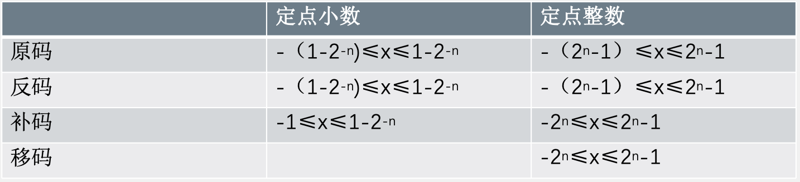
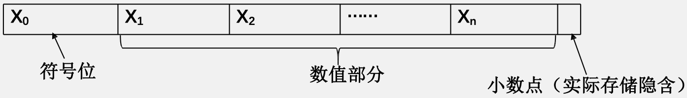
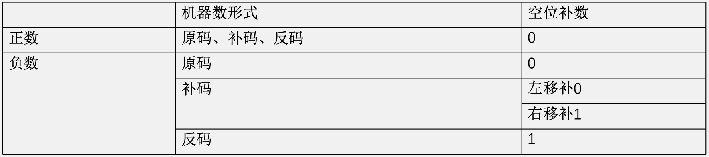
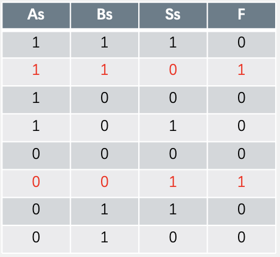
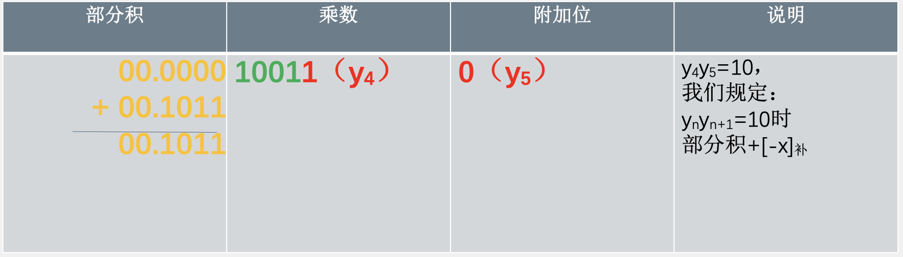
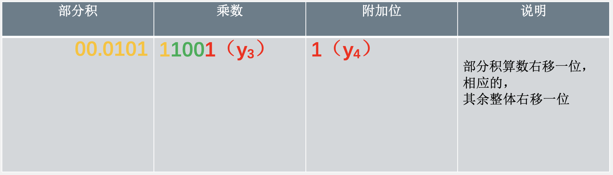
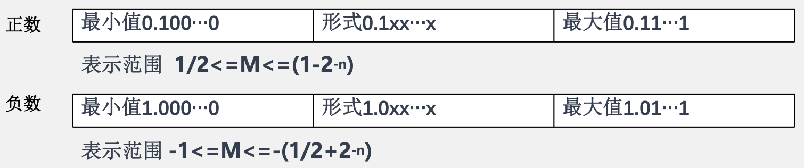
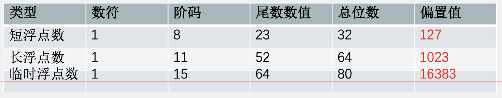
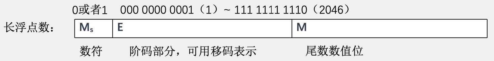

# 数据的表示和运算

## 前置知识

### 逻辑运算

&emsp;&emsp;&ensp;逻辑运算又称布尔运算，逻辑常量只有两个，即0和1。我们把0看做“假”，1看做“真”。三种最基本的逻辑运算：与运算、或运算、非运算。
&emsp;&emsp;&ensp;与运算：只有决定某一件事发生的两个条件**同时成立**（同时为真）时，事件才能发生。即：只有两个条件同时为真，结果才为真；否则，结果为假。${A}$ 与 ${B}$，通常可以被记做：${A and B，A \&\& B，A·B，A∧B}$。

&emsp;&emsp;&ensp;或运算：只要决定某一件事发生的两个条件有一个成立（有一个为真）时，事件就能发生。即：两个条件只要有一个为真，结果就为真；只有两个条件都为假，结果才为假。${A}$ 或 ${B}$，通常可以被记做：${A or B，A || B，A + B，A ∨ B}$

&emsp;&emsp;&ensp;非运算：只有决定某一件事发生的条件不成立时，事件才能发生。即：条件为真，结果为假;条件为假，结果为真。${A}$ 取非，通常可以被记做：${Not A，¬A，\overline{A}}$

&emsp;&emsp;&ensp;异或运算：${A}$ 异或 ${B}$，记作 ${A\oplus B}$，${A\oplus B=(\overline{A}·B)+(\overline{B}·A)}$。${A}$ 与 ${B}$ 不全为真且不全为假，结果为真；${A}$ 与 ${B}$ 全为真或全为假，结果为假。

&emsp;&emsp;&ensp;对二进制数串的逻辑运算：

&emsp;&emsp;&ensp;用与、或、非实现各种逻辑运算：
&emsp;&emsp;&ensp;例如：${F=A·B·\overline{S}+\overline{A}·\overline{B}·S}$，当且仅当 ${A}$ 与 ${B}$ 相同，且 ${C}$ 与 ${A、B}$ 不同时，${F}$ 为真。

#### 进位计数制
&emsp;&emsp;&ensp;进位计数制：一种计数方法，按进位的方法进行计数。
&emsp;&emsp;&ensp;一个 ${r}$ 进制数（${K_nK_{n-1}\dots K_0k_{-1}\dots K_{-m}}$）的数值可以这样计算：${K_nr^n+K_{n-1}r^{n-1}+\dots +K_0r^0+k_{-1}r^{-1}+\dots+K_{-m}r^{-m}=\sum_{i=m}^{-m}K_iR^i}$
&emsp;&emsp;&ensp;一个十进制数（12138.38）的数值就是：${1\times 10^4+2\times 10^3+1\times 10^2+3\times 10^1+8\times 10^0+3\times 10^{-1}+8\times 10^{-2}=\sum_{i=4}^{-2}K_i10^i=12138.38}$
&emsp;&emsp;&ensp;一个十进制数（10101.101）的数值就是：${1\times 2^4+0\times 2^3+1\times 2^2+0\times 2^1+1\times 2^0+1\times 2^{-1}+0\times 2^{-2}+1\times 2^{-3}=\sum_{i=4}^{-3}K_i2^i=21.625}$

&emsp;&emsp;&ensp;基数：每个数位的可用数码个数，比如十进制的基数就是10，二进制的基数就是2。
&emsp;&emsp;&ensp;位权：每个数位的计量单位(权重)。

&emsp;&emsp;&ensp;${K_i}$：每个数位的取值，对于一个 ${r}$ 进制数，每个数位的取值范围是 ${0,1,···,r-1}$。比如：十进制数每个数位可以取 ${0,1,2,3,4,5,6,7,8,9}$，二进制数每个数位可以取 ${0,1}$。

&emsp;&emsp;&ensp;十进制转换为任意进制

&emsp;&emsp;&ensp;**基数乘除法**：
&emsp;&emsp;&ensp;对十进制数的整数和小数部分分别进行处理。对**整数部分用除基取余法**，对**小数部分用乘基取整法**，最后将结果拼在一起。

&emsp;&emsp;&ensp;**除基取余法：**
1. 整数部分除以要转换的进制的基数，得到商和余数；
2. 最先取得的余数为新进制数的最低位，之后取得的余数为新进制数的次低位、第三低位，依次类推...
3. 商为0，则算法结束；否则用商除以要转换的进制的基数，得到商和余数，转到第2步。

&emsp;&emsp;&ensp;更常用的一种方法（常用于十进制转二进制时）：依据每个数位的权值，从高位到低位直接赋值。

## 无符号数与有符号数

&emsp;&emsp;&ensp;计算机中的数有两大类：无符号数和有符号数。

### 无符号数
&emsp;&emsp;&ensp;无符号位，寄存器的每一位均可以用来存放数值。${机器字长 = CPU参与运算的寄存器位数}$
&emsp;&emsp;&ensp;若机器字长为8位，则数的表示范围为 ${0~2^8-1}$，即 ${0~255}$。

### 有符号数
&emsp;&emsp;&ensp;在机器中，正负号没有办法直接存储，所以我们选取一位二进制位来表示符号，一般0表示正，1表示负。一个8位的有符号数，数的数值位为7位，**首位为符号位**。
&emsp;&emsp;&ensp;这种把符号“数字化”的数叫做机器数，而原本的带“+”“-”号的数叫做真值
&emsp;&emsp;&ensp;常见的有符号数的机器表示有原码、补码、反码和移码四种。
&emsp;&emsp;&ensp;在机器看来，寄存器中的二进制串没有什么区别，但是**依据编译器的不同解释方式**，变量的取值会有不同。

### 原码
&emsp;&emsp;&ensp;原码表示法
&emsp;&emsp;&ensp;用机器数的最高位表示该数的符号，其余各位表示数的绝对值。
&emsp;&emsp;&ensp;整数原码：

&emsp;&emsp;&ensp;整数原码对0的表示方式有两种

&emsp;&emsp;&ensp;整数原码的边界值

&emsp;&emsp;&ensp;小数（纯小数）原码：

&emsp;&emsp;&ensp;小数原码对0的表示方式有两种

&emsp;&emsp;&ensp;小数原码的边界值

### 补码
&emsp;&emsp;&ensp;补码表示法
&emsp;&emsp;&ensp;用机器数的最高位表示该数的符号，若真值为正，数值部分与真值的数值相同；若真值为负，将其相反数（必为正数）的补码每位取反再加一即可。
&emsp;&emsp;&ensp;整数补码：

&emsp;&emsp;&ensp;求负数的补码也可以利用补码的性质：负数补码以数值位最右侧的那个1（若存在）为界，它左侧的数值等于真值的数值位按位取反，它和它右侧的数值与真值的数值相同。

&emsp;&emsp;&ensp;整数补码的边界值

&emsp;&emsp;&ensp;结论：
1. 整数补码对零的表示方式是唯一的（全0）。
2. 机器字长为 ${n+1}$ 时，整数补码可以表示的最小负数，即整数补码可以表示的最小值是 ${-2^n}$（符号位为1，其余全0）。

&emsp;&emsp;&ensp;思考：
&emsp;&emsp;&ensp;为什么机器字长为 ${n+1}$ 时，整数补码的 ${1 0 .. 00(n个0)}$ 可以表示 ${-2^n}$？

&emsp;&emsp;&ensp;为什么机器字长为 ${n+1}$ 时，整数补码最小可以表示 ${-2^n}$，为什么不能表示 ${-(2^n+1)}$ 或更小？

&emsp;&emsp;&ensp;小数补码：

&emsp;&emsp;&ensp;求负数的补码也可以利用补码的性质：负数补码以数值位最右侧的那个1（若存在）为界，它左侧的数值等于真值的数值位按位取反，它和它右侧的数值与真值的数值相同。

&emsp;&emsp;&ensp;结论：
1. 小数补码对零的表示方式是唯一的（全0）。
2. 机器字长为 ${n+1}$ 时，小数补码可以表示的最小负数，即小数补码可以表示的最小值是-1（符号位为1，其余全0）。

&emsp;&emsp;&ensp;思考：
&emsp;&emsp;&ensp;为什么机器字长为 ${n+1}$ 时，小数补码的 ${1 0 .. 00(n个0)}$ 可以表示 ${-1}$？

&emsp;&emsp;&ensp;为什么机器字长为 ${n+1}$ 时，整数补码最小可以表示 ${-1}$，为什么不能表示 ${-(2^{-n}n+1)}$ 或更小？

&emsp;&emsp;&ensp;位权表示法
&emsp;&emsp;&ensp;现代计算机用无符号数和有符号数（补码）来表示整数，从真值与机器数的关系来看，我们将无符号机器数和有符号机器数定义如下：
&emsp;&emsp;&ensp;设机器数的字长为 ${\omega}$，机器数可以写成二机制向量 ${[x_{\omega-1},x_{\omega-2},\dots,x_{0}]}$。
&emsp;&emsp;&ensp;当将这串 ${\omega}$ 维向量解释为无符号数时，其真值 ${D}$ 与机器数的关系为：${D=\sum_{i=0}^{\omega-1}x_i \times 2^i}$。
&emsp;&emsp;&ensp;当将这串 ${\omega}$ 维向量解释为有符号数（补码）时，其真值 ${D}$ 与机器数的关系为：${D=-x_{\omega-1}\times 2^{\omega-1}+\sum_{i=0}^{\omega-2}x_i \times 2^i}$。

&emsp;&emsp;&ensp;设机器数的字长为 ${\omega}$，机器数可以写成二进制向量 ${[x_{0},x_{1},\dots,x_{\omega-2},x_{\omega-1}]}$。
&emsp;&emsp;&ensp;当将这串 ${\omega}$ 维向量解释为定点小数（补码）时，其真值 ${D}$ 与机器数的关系为：${D=-x_0\times 2^0+\sum_{i=1}^{\omega-1}x_i \times 2^{-i}}$。

### 反码
&emsp;&emsp;&ensp;反码表示法
&emsp;&emsp;&ensp;用机器数的最高位表示该数的符号，若真值为正，数值部分与真值的数值相同；若真值**为负**，**数值部分为真值的数值每位取反**。
&emsp;&emsp;&ensp;整数反码：

&emsp;&emsp;&ensp;整数反码对0的表示方式有两种

&emsp;&emsp;&ensp;整数反码的边界值

&emsp;&emsp;&ensp;小数（纯小数）反码：

&emsp;&emsp;&ensp;整数反码对0的表示方式有两种

&emsp;&emsp;&ensp;整数反码的边界值

### 真值、原码、反码、补码的转化

### 移码
&emsp;&emsp;&ensp;移码表示法
&emsp;&emsp;&ensp;给整数的真值加一个偏移量，偏移量通常取 ${2^n}$(机器字长为 ${n+1}$)。
&emsp;&emsp;&ensp;整数移码：

&emsp;&emsp;&ensp;整数反码的边界值

&emsp;&emsp;&ensp;性质：
1. 同一个真值的移码和补码仅相差一个符号位。（仅偏移值为 ${2^n}$ 的时候是这样，事实上偏移值也可以取别的）
2. 移码中零的表示唯一。
3. **移码的大小关系与真值的大小关系一致**。（**即移码越大，对应的真值越大**）

&emsp;&emsp;&ensp;机器字长为 ${n+1}$，原码、反码、补码、移码的表示范围总结如下：

&emsp;&emsp;&ensp;真值与机器数的关系：

## 定点数的表示与运算
&emsp;&emsp;&ensp;定点数就是指小数点固定的数据，有定点整数和定点小数两种。
&emsp;&emsp;&ensp;定点小数：纯小数，小数点在符号位之后，整个有效数值都属于小数部分。

&emsp;&emsp;&ensp;定点整数：纯整数，小数点在有效数值之后，整个有效数值都属于整数部分。

### 定点数的移位运算

#### 算术移位

&emsp;&emsp;&ensp;算术移位：针对有符号数，考虑符号位，在移位过程中**符号位保持不变**。算术移位相当于倍数变换。左移一位相当于乘以2，右移一位相当于除以2。
&emsp;&emsp;&ensp;补码的正数和负数可以统一记为右移补符号位，左移补0。对于任何编码，算数左移也可以用自己加自己来辅助记忆。

&emsp;&emsp;&ensp;算数移位总结：
1. 符号位不参与移位。
2. 对于正数，左移右移无脑补0。如果左移1移丢，则发生**溢出**；如果右移1移丢，则有**精度损失**。
3. 对于负数原码，左移右移都补0。如果左移1移丢，则发生**溢出**；如果右移1移丢，则有**精度损失**。
4. 对于负数补码，左移补0，右移补1。如果左移0移丢，则发生**溢出**，如果右移1移丢，则有**精度损失**。（对于1.0000（补），真值为-1，左移，0移丢，补码值仍然为-1，而不是-2，当然也是溢出。）
5. 对于负数反码，左移右移都补1。如果左移0移丢，则发生**溢出**；如果右移0移丢，则有**精度损失**。

#### 逻辑移位
&emsp;&emsp;&ensp;逻辑移位：将操作数视为无符号数。
&emsp;&emsp;&ensp;左移时高位移丢，低位添0；右移时低位移丢，高位添0。

#### 循环移位
&emsp;&emsp;&ensp;循环移位：移出的位又移入数据中，根据是否带有进位分为**带进位标志位的循环移位**和**不带进位标志位的循环移位**。

&emsp;&emsp;&ensp;不管带不带进位，最高位都会被推入CF，同时该元素也会循环至末尾。当为带进位位的循环移位时，可将CF与队列看成整体，即CF中的数会随着循环补充至队尾。

### 定点数的加减法运算

#### 原码加减法运算

&emsp;&emsp;&ensp;由于 ${A - B = A + (-B)}$，所以只需考虑原码加法。加法：若两个数的符号位相同，则绝对值相加，符号位不变。若两个数符号位不同，则大的绝对值减去小的绝对值，符号为绝对值大的数的符号。

&emsp;&emsp;&ensp;若用机器来实现原码加减法有以下几个问题：
1. 符号位与数值位需要分开处理。
2. 需要比较绝对值大小。
3. 还是会用到减法操作，需要专门的减法电路。

#### 补码加减法运算
&emsp;&emsp;&ensp;由于 ${A - B = A + (-B)}$，所以只需考虑补码加法。${[A+B]_补 = [A]_补 +[B]_补}$ 补码表示的两个数进行加法运算时，**符号位**可以和数值位一样，**直接参与运算**，溢出位要丢掉。

#### 溢出判断

&emsp;&emsp;&ensp;溢出：运算结果超出机器最多能表示的数的范围，大于机器能表示的最大正数叫做上溢，小于机器所能表示的最小负数叫做下溢（会发生溢出的根本原因是**寄存器位数的限制**）。

&emsp;&emsp;&ensp;溢出判断：
&emsp;&emsp;&ensp;方法一：采用一位符号位
&emsp;&emsp;&ensp;不论是加法还是减法，我们都将它们转换为加法操作，只有在正数加正数和负数加负数两种情况下**才可能出现溢出**，符号不同的两个数相加是不会溢出的。

&emsp;&emsp;&ensp;不论是加法还是减法，我们都将它们转换为加法操作，这时只要实际参加操作的两个数符号相同，而结果又与源操作数的符号不同，即为溢出；否则无溢出。

设操作数 ${A}$ 的符号为 ${A_S}$，设操作数 ${B}$ 的符号为 ${B_S}$，运算结果的符号位 ${S_S}$。${F=A_SB_S\overline{S}+\overline{A}\overline{B}S_S}$，${F=1}$ 代表溢出，${F=0}$ 代表无溢出。

&emsp;&emsp;&ensp;方法二：采用两位符号位
&emsp;&emsp;&ensp;变形补码：双符号位的补码，即在原补码的符号位前**再加一位一样的符号位**。用变形补码作加法时，**两位符号位**要连同数值部分一起参加运算，而且高位符号位产生的进位自动丢失。（存储时使用单符号位进行存储，在 ${ALU}$ 中运算时会自行扩展。

&emsp;&emsp;&ensp;变形补码判断溢出的原则是：当2位符号位不同时，表示溢出，否则，无溢出。不论是否发生溢出，高位（第1位）符号位永远代表真正的符号。
&emsp;&emsp;&ensp;结果符号位：
&emsp;&emsp;&ensp;00：表示结果为正数，无溢出；
&emsp;&emsp;&ensp;01：表示结果为正数，上溢；
&emsp;&emsp;&ensp;10：表示结果为负数，下溢；
&emsp;&emsp;&ensp;11：表示结果为负数，无溢出。
&emsp;&emsp;&ensp;记符号位为 ${S_{S1}}$、${S_{S2}}$，
${F = S_{S1}⊕S_{S2}}$，${F = 1}$ 表示溢出；${F=0}$ 表示无溢出。

&emsp;&emsp;&ensp;双符号位补码如何进行算数移位操作?
&emsp;&emsp;&ensp;高位符号位不参与移位，低位符号位参与移位，对于正数空位补0；对于负数左空补1，右空补0。

&emsp;&emsp;&ensp;方法三：采用一位符号位根据数据位的**进位情况**判断溢出
&emsp;&emsp;&ensp;若**符号位的进位与最高数位的进位相同**，则说明没有溢出，否则表示发生溢出。

&emsp;&emsp;&ensp;记符号位进位为 ${C_S}$、最高数位的进位为 ${C_1}$，${F = C_S⊕C_1}$，${F=1}$ 表示溢出；${F=0}$ 表示无溢出。

#### 无符号数的加减法运算
&emsp;&emsp;&ensp;由于补码运算的方便性，${C}$ 语言中 ${int、long int}$ 等类型数据都采用补码的方式来编码和存储。
&emsp;&emsp;&ensp;${unsigned int}$（无符号整型）作为无符号数，直接用二进制对其编码，无需考虑符号位（无符号数一定是正数）。
&emsp;&emsp;&ensp;${unsigned int}$ 的加减法是如何实现的？
&emsp;&emsp;&ensp;计算机的加法器是不知道它的操作数是什么类型的编码的，它只是一个组合电路，对输入的两个二进制数串执行加法操作。
&emsp;&emsp;&ensp;对于加法，直接把两个 ${unsigned int}$ 的二进制编码给到加法器，执行加操作即可（最高位有进位则溢出，得到的结果不是真正的结果）。
&emsp;&emsp;&ensp;对于减法，我们希望计算 ${[A-B]_无}$，但是由于 ${A}$ 和 ${B}$ 都是无符号数表示，所以我们无法用无符号数来表示 ${-B}$ 从而形成 ${A+(-B)}$，所以我们借助补码来实现这个过程。即利用 ${A}$ 和 ${B}$ 计算出 ${[A-B]_补}$，再将 ${[A-B]_补}$ 转化为 ${[A-B]_无}$，但是由于同位数补码与无符号数的正数表示范围并不一致，所以我们用**比无符号数多一位的补码**来完成这个过程。

### 定点数的乘法运算

#### 原码一位乘运算
&emsp;&emsp;&ensp;${x=-0.1110}$，${y=-0.1101}$，求${[x·y]_原}$
&emsp;&emsp;&ensp;${[x]_原=1.1110，[y]_原=1.1101}$
&emsp;&emsp;&ensp;${x}$ 绝对值为 ${0.1110}$，${y}$ 绝对值为 ${0.1101}$

&emsp;&emsp;&ensp;中间过程略

&emsp;&emsp;&ensp;确定符号位：负负为正，符号位为0，结果为0.10110110。

#### 补码一位乘运算（比较法）
&emsp;&emsp;&ensp;比较法是 ${Booth}$ 夫妇首先提出来的，又称 ${Booth}$ 算法。它的运算规则是由补码一位乘运算的校正法推导得到的。

&emsp;&emsp;&ensp;${[x]_补=1.0101，[y]_补=1.0011，}$ 求 ${[x·y]_补}$，标记 ${[y]_补= y_0y_1y+2y_3y_4}$ 有 ${y_0=1，y_1=0，y_2=0，y_3=1，y_4=1}$，另外，令 ${y_5=0}$。

&emsp;&emsp;&ensp;中间过程略

&emsp;&emsp;&ensp;符号位直接参与运算，乘积的符号位也在运算过程中自然生成。

#### 定点数除法运算
&emsp;&emsp;&ensp;笔算过程：

&emsp;&emsp;&ensp;每次上商都是比较余数（被除数）和除数的大小，如果余数（被除数）够减，则商上1，余数（被除数）减去除数得到新的余数；否则商上0，余数（被除数）不变。
&emsp;&emsp;&ensp;每次上完商后余数低位补0，除数右移一位。（计算机采用左移余数的方法，相减时可以达到和右移除数相同的效果）

##### 原码除法运算(原码加减交替法)
&emsp;&emsp;&ensp;原码加减交替法又称**原码不恢复余数法**，它是恢复余数法的一种改进。

${x=-0.1011，y=0.1101}$，求 ${[\frac{x}{y}]_原}$
${[x]_原 = 1.1011，|x| = 0.1011，[|x|]_补=0.1011}$
${[y]_原 = 0.1101，|y| = 0.1101，[-|y|]_补=1.0011}$

&emsp;&emsp;&ensp;中间过程略

&emsp;&emsp;&ensp;商的符号位 ${x_0⊕y_0=1⊕0=1}$，故商最终为 ${1.1101}$（本例中最后余数为正，如果最后余数为负，需加上 ${|y|}$ 方可得到正确的余数）（余数的符号等于被除数的符号）余数=${0.0111 \times 2^{-4}}$（余数左移了4次）

##### 补码除法运算（补码加减交替法）
&emsp;&emsp;&ensp;补码除法的**符号位和数值部分是一起参加运算的**（与原码除法的本质区别，原码的符号位是另外考虑的，数值运算使用的是**绝对值**），商符自然形成。
&emsp;&emsp;&ensp;除法第一步根据**被除数和除数的符号**决定是做加法还是做减法（原码除法直接做减法）。
&emsp;&emsp;&ensp;根据**余数和除数的符号位**判断商上1还是0（原码只考虑余数的符号）。
&emsp;&emsp;&ensp;最后一步商恒置1。

${x=0.1000，y=-0.1011}$，求 ${[\frac{x}{y}]_补}$
${[x]_原=00.1000，[x]_补=00.1000}$
${[y]_原=11.1011，[y]_补=11.0101，[-y]_补=00.1011}$

&emsp;&emsp;&ensp;中间过程略

&emsp;&emsp;&ensp;故商最终 ${[\frac{x}{y}]_补}$ 为 ${1.0101}$，余数为 ${0.0111 \times 2^{-4}}$

##### 无符号数的乘法运算
&emsp;&emsp;&ensp;对于字长为 ${\omega}$ 位的无符号数 ${x, y}$，他们的乘积的取值范围是 ${0≤x\times y≤(2^\omega-1)^2}$，这需要 ${2\omega}$ 位来表示。由于结果只有 ${\omega}$ 位，我们将无符号数乘法的结果定义为结果低 ${\omega}$ 位的值。我们将这个值表示为 ${x\times _\omega^uy}$。我们有：${x\times _\omega^uy\quad=\quad(x\times y)\quad mod\quad 2^\omega}$
&emsp;&emsp;&ensp;无符号乘法的溢出判断非常简单，设结果为 ${2\omega}$ 位向量 ${[x_{2\omega-1},x_{2\omega-2},\dots,x_{\omega},x_{\omega}-1,\dots,x_0]}$。无符号乘法溢出且当且仅当 ${x_{2\omega-1}- x_\omega}$ 不全为0。

##### 有符号数的乘法运算
&emsp;&emsp;&ensp;对于字长为 ${\omega}$ 位的无符号数 ${x, y}$，他们的乘积的取值范围是 ${-2^{2\omega-2}+2^{\omega-1}≤x\times y≤2^{2\omega-2}}$，这需要 ${2\omega}$ 位来表示。由于结果只有 ${\omega}$ 位，我们将有符号数乘法的结果定义为结果低 ${\omega}$ 位的值。我们将这个值表示为 ${x\times _\omega^ty}$。我们有：${x\times _\omega^ty\quad=\quad U2T((x'\times y')\quad mod \quad 2^\omega)}$
&emsp;&emsp;&ensp;其中，${x'，y'}$ 表示将 ${x,y}$ 对应的机器数按无符号数解码后的值。也就是说，无符号数乘法和有符号数乘法具有**位级的等价性**，也就是说：给定长度为 ${\omega}$ 的位向量 ${\vec{x}}$ 和 ${\vec{y}}$ 用补码对它们进行解码后是 ${x，y}$，用无符号数对它们进行解码后是 ${x'，y'}$。那么 ${x\times _\omega^ty}$ 和  ${x'\times _\omega^uy'}$ 具有相同的位级表示。
&emsp;&emsp;&ensp;对于有符号数乘法的溢出判断：设结果为 ${2\omega}$ 位向量 ${[x_{2\omega-1},x_{2\omega-2},\dots,x_{\omega},x_{\omega}-1,\dots,x_0]}$。有符号乘法溢出且当且仅当 ${x_{2\omega-1}- x_\omega}$ 不全为0或不全为1。（联系前面讲到的补码的性质，想一想为什么？）

## 浮点数的表示与运算

### 浮点数的表示格式

$${N=r^E\times M}$$

&emsp;&emsp;&ensp;${r}$ 是浮点数阶码的底，与尾数的基数相同，二进制的 ${r=2}$。通常 ${r}$ 是隐含的，不需要存储。${E}$ 称为阶码，是定点整数，${M}$ 称为尾数，是定点小数。

&emsp;&emsp;&ensp;阶符 ${E_s}$（阶码的符号）和阶码的位数 ${m}$ 共同反映浮点数的表示范围和小数点的实际位置；数符 ${M_s}$ 表示浮点数的符号；尾数的位数 ${n}$ 表示浮点数的精度。

### 规格化浮点数

&emsp;&emsp;&ensp;通过调整一个非规格化数的尾数和阶码的大小，使非零的浮点数在尾数的最高数位上保证是一个有效值，这样可以充分利用尾数的有效位，提高精度。例如：非规格化数：${(0).003\times 10^{-5}}$；规格化数：${(0).3\times 10^{-7}}$。
&emsp;&emsp;&ensp;规格化浮点数尾数 ${M}$ 的绝对值满足：${\frac{1}{r}≤|M|≤1}$，也就是尾数的第一位的绝对值不为0。

#### 原码规格化
&emsp;&emsp;&ensp;尾数长为 ${n+1}$

#### 补码规格化
&emsp;&emsp;&ensp;补码表示的最大的负规格化浮点数的尾数不是 ${1.10...0}$，因为 ${1.10...0}$ 不是规格化数字。补码规格化数的**尾数最高位一定与尾数符号位相反**（便于机器判断）。

### IEEE 754标准

&emsp;&emsp;&ensp;阶码用**移码**表示，**不需要符号位**。
&emsp;&emsp;&ensp;尾数用**原码**表示，采用**隐藏尾数最高数位方法**，因为规格化数数值的最高位为1，那么尾数一定可以化成 ${1.xxx}$，那么这个1可以隐藏，这样可以多表示一位尾数，提高精度。例如 ${0.1011x2^{-3}}$ 可以化为 ${1.011x2^{-4}}$，最高位的1和它后面的小数点就可以隐含，我们在尾数部分保存 ${011}$ 就可以了。

#### 短浮点数
&emsp;&emsp;&ensp;阶码8位全1，尾数全0代表无穷大；阶码8位全0，尾数不是全0代表非规格化数；阶码8位全0，尾数也全0，代表0。

&emsp;&emsp;&ensp;短浮点数真值计算方法：${(-1)^s \times 1.M \times 2^{E-127}}$
&emsp;&emsp;&ensp;绝对值的最小值：${1.0\times 2^{1-127}=2^{-126}}$；最大值：${1.111...1\times 2^{254-127}=2^{127}x(2-2^{-23})}$。

&emsp;&emsp;&ensp;非规格化数的编码规则：
&emsp;&emsp;&ensp;首先，我们将阶码字段 ${e_{k-1}e_k\dots e_0}$ 解释为无符号数 ${e}$ （对于单精度浮点数，其对应真值的取值范围是 ${0}$ ~ ${254}$。对于双精度浮点数，其对应真值的取值范围是 ${0-2046}$）。将尾数字段 ${f_{n-1}f{n-2}\dots f_0}$ 解释为二进制小数 ${f}$（对于单精度浮点数，其对应真值的取值范围是 ${0}$ ~ ${1-2^{-23}}$，对于双精度浮点数，其对应真值的取值范围是 ${0}$ ~ ${1-2^{-52}}$.
&emsp;&emsp;&ensp;在**规格化数**的情况下，阶码 ${E=e-bias}$ 其中 ${bias}$ 取 ${2^{k-1}-1}$ 单精度为127，双精度为1023），尾数 ${M=1+f}$。
&emsp;&emsp;&ensp;在**非规格化数**的情况下，阶码 ${E=1-bias}$ ，尾数 ${M=f}$。
&emsp;&emsp;&ensp;可以发现，${IEEE 754}$ 标准中规格化数隐藏了一个1，这样做可以使尾数能多表示一位，提高了浮点数的精度。

&emsp;&emsp;&ensp;非规格化数的用途是什么，为什么非规格化数的阶码要设计为 ${1-bias}$ 而非 ${-bias}$？
&emsp;&emsp;&ensp;非规格化数提供了以下两个用途：
1. 提供了一种表示0的方法（我们发现按照规格化数的编码方式，我们是无法表示0的）。
2. 可以表示一些非常接近0的数。更直观一些，我们对单精度浮点数进行简化。假设阶码为3位，尾数为2位，并仿照 ${IEEE 754}$ 的规则进行编码，将所有能变送的规格化数和非规格化数画在数轴上，得到下图：

&emsp;&emsp;&ensp;长浮点数真值计算方法：${(-1)^s\times 1.M\times 2^{E-1023}}$
&emsp;&emsp;&ensp;绝对值的最小值：${1.0\times 2^{1-1023}=2^{-1022}}$；最大值：${1.111...1\times 2^{2046-1023}=2^{1023}\times (2-2^{-52})}$。

### 浮点数的加减运算：
1. 对阶：使两个操作数的小数点对齐，也就是让两数的阶码相等。
&emsp;&emsp;&ensp;先求阶差，小阶向大阶看齐，阶小的尾数向右移动，每右移一位，阶码加1，直到两数的阶码相等。尾数右移可能会损失低位的尾数，**损失精度**。
&emsp;&emsp;&ensp;例：两浮点数 ${x=0.1101\times 2^{01}，y=(-0.1010)\times 2^{11}}$，阶码和尾数均用**补码**表示，假设阶符取2位，阶码的数值部分取2位，数符取2位，尾数的数值部分取4位，求 ${x+y}$。
&emsp;&emsp;&ensp;写出 ${x，y}$ 在计算机中的表示：${[x]_补=00,01; 00, 1101，[y]_补=00, 11; 11, 0110}$ 先对阶，求阶差：${[x的阶码]_补 + [-y的阶码]_补 = 00, 01 + 11, 01 = 11, 10(-2)}$。
&emsp;&emsp;&ensp;表示 ${x}$ 的阶码比 ${y}$ 的阶码小，按小阶向大阶看齐的原则，将 ${x}$ 的尾数右移两位，阶码加2。对阶前：${[x]_补=00, 01; 00, 1101}$ 对阶后：**${[x]_补' = 00, 11; 00, 0011}$**
2. 尾数求和：对阶之后的尾数进行加减，按照相应机器数的加减法，可能会有溢出，这时不是真正的溢出。
&emsp;&emsp;&ensp;例：两浮点数 ${x=0.1101\times 2^{01}，y=(-0.1010)\times 2^{11}}$，阶码和尾数均用补码表示，假设阶符取2位，阶码的数值部分取2位，数符取2位，尾数的数值部分取4位，求 ${x+y}$。
对阶后：${[x]'_补 = 00, 11; 00, 0011，[y]_补=00, 11; 11, 0110}$
&emsp;&emsp;&ensp;尾数求和：

3. 规格化：加减之后还要对结果进行规格化。
&emsp;&emsp;&ensp;以双符号位补码为例，尾数出现 ${00.0xxxx}$ 或 ${11.1xxxx}$ 时，结果是**非规格化数**，需左规。尾数每左移一位，阶码减1，直到尾数为 ${00.1xxxx}$ 或 ${11.0xxxx}$。若尾数出现 ${10.xxxx}$ 或 ${01.xxxx}$ 时，代表结果暂时溢出，需要右归，尾数右移一位，阶码加1。（注意这时不是真的溢出，只有**阶码溢出**才是真的溢出了）
&emsp;&emsp;&ensp;左规可能需要多次，右规只需要1次。
&emsp;&emsp;&ensp;例：两浮点数 ${x=0.1101\times 2^{01}，y=(-0.1010)\times 2^{11}}$，阶码和尾数均用补码表示，假设阶符取2位，阶码的数值部分取2位，数符取2位，尾数的数值部分取4位，求 ${x+y}$。
&emsp;&emsp;&ensp;对阶后：${[x]_补' = 00, 11; 00, 0011；[y]_补=00, 11; 11, 0110}$
&emsp;&emsp;&ensp;尾数求和：${[x+y]_补 = 00, 11; 11, 1001；左规:[x+y]_补 = 00, 10; 11, 001 0}$

4. 舍入：对阶以及右规的过程中，因为低位的数位会丢失，尾数右移可能会损失精度。
&emsp;&emsp;&ensp;引入舍入的方法：
   1. “0”舍“1”入法：类似于四舍五入，被移去的最高位为0，则舍去；被移去的最高位为1，则在末尾加1，这样可能造成溢出，需要再次右归。
   2. 恒置“1”法：尾数右移，无论丢掉的是什么数值，右移后尾数末尾恒置“1”。
&emsp;&emsp;&ensp;例：两浮点数 ${x=0.1101\times 2^{01}，y=(-0.1010)\times 2^{11}}$，阶码和尾数均用补码表示，假设阶符取2位，阶码的数值部分取2位，数符取2位，尾数的数值部分取4位，求 ${x+y}$。
&emsp;&emsp;&ensp;对阶前：${[x]_补=00, 01; 00, 1101}$；对阶后：${[x]_补'= 00, 11; 00, 0011}$（“0”舍“1”入法）

5. 溢出判断：
&emsp;&emsp;&ensp;溢出判断只有在规格化之后才能判断，阶码溢出则浮点数溢出。
&emsp;&emsp;&ensp;阶码大于可以表示的最大阶码时，则浮点数上溢，这时候中断处理。阶码小于可以表示的最小阶码时，这个时候浮点数接近于0，当作机器零处理。

## 数据的强制类型转换与存储
&emsp;&emsp;&ensp;一个8位的定点整数和一个8位的浮点数：
- 它们可以表示的数的个数是一样多的。
- 前者可以表示的数的范围小于后者。
- 前者可以表示的数的精度高于后者。

### C语言中常见数据类型
${\begin{aligned}
    char&:8位\quad &short:&16位\qquad int&:&32位 \\
unsigned int&:32位\quad &float:&32位\qquad double&:&64位
\end{aligned}}$
&emsp;&emsp;&ensp;${int}$ 转换为 ${float}$ 可能会有精度损失，反之亦然（会截取小数部分）。
&emsp;&emsp;&ensp;${int}$ 转换为 ${double}$ 不会溢出也不会有精度损失。
&emsp;&emsp;&ensp;${int}$ 转换为 ${unsigned int}$ 可能会溢出（${unsigned int}$ 不能表示负数），反之亦然（${int}$ 需要留一位符号位）。
&emsp;&emsp;&ensp;${float}$ 转换为 ${double}$ 既不会溢出也不会有精度损失。
&emsp;&emsp;&ensp;注意：${int、unsigned}$ 的位数与**计算机位数**有关，当计算机位数小于32位时，${int、unsigned}$ 的位数与计算机位数相同，如8位计算机中 ${int、unsigned}$ 位数为8位，16位计算机中 ${int、unsigned}$ 位数为16位。

### 符号扩展
&emsp;&emsp;&ensp;所谓符号扩展，用一个例子说明，一个8位定点数要与一个32位定点数相加，想要得到正确的结果，需要先把8位数扩展为32位数形式。
&emsp;&emsp;&ensp;对于正数：前面补0（对于整数）后面补0（对于小数）
&emsp;&emsp;&ensp;对于负数：
- 原码：符号位不变，数值位前面补0（对于整数），后面补0（对于小数）
- 反码：符号位不变，数值位前面补1（对于整数），后面补1（对于小数）
- 补码：符号位不变，数值位前面补1（对于整数），后面补0（对于小数）
&emsp;&emsp;&ensp;例：
10110（-10的补码，5位）扩展为8位：1111 0110
1.0110（-0.625的补码，5位）扩展为8位：1.0110 000

### 大端模式和小端模式
&emsp;&emsp;&ensp;数据内字节存储的排列顺序
&emsp;&emsp;&ensp;例：一个机器数的16进制为 ${01 23 45 67H}$，4个字节，存放在 ${0001H}$ 开始的内存单元里。

&emsp;&emsp;&ensp;如何表示这个机器数在内存中的地址？
&emsp;&emsp;&ensp;一般采用低位地址作为机器数的地址。
&emsp;&emsp;&ensp;注意：只有数据才会有大端和小端的区别，指令是没有大端小端区分的。

### 边界对齐
&emsp;&emsp;&ensp;边界对齐通常是针对于结构体而言的，我们定义一个结构体，假设它从 ${0000H}$ 号字节开始存放，一般而言，边界对齐要求结构体内**每个元素的存放的起始地址**都应该是它所占字节数的整数倍。（结构体里面的 ${double}$ 都是 ${8B}$ 对齐，不是结构体里面就是 ${4B}$）

&emsp;&emsp;&ensp;结构体变量的对齐规则如下：
1. 整个结构体变量的对齐方式与其中对齐方式最严格的成员相同。
2. 结构体成员在满足其对齐方式的条件下，取**最小可用位置**作为成员在结构体中的偏移量。
3. 结构体大小应当为对齐边界长度的整数倍。
&emsp;&emsp;&ensp;例如：

## 字符与十进制数的表示
&emsp;&emsp;&ensp;字符编码 ${ASCII}$ 码：${ASCII}$ 码是7位二进制编码，可以表示128个字符。这里包括10个十进制码，52个英文字母（大小写）及一定数量的专用符号。