# 绪论

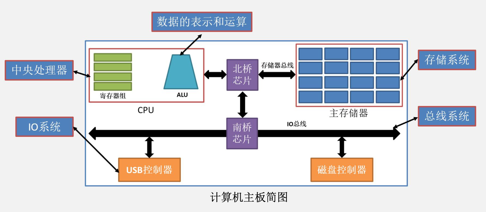

## ${ax^2+bx+c}$

### 主存储器

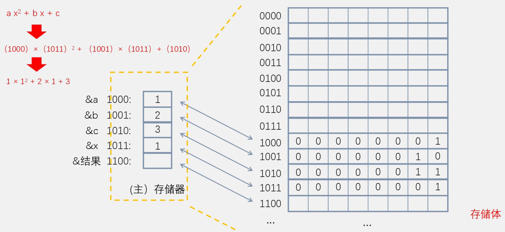

&emsp;&emsp;&ensp;每一行都是一个存储单元，该图中存储单元的存储字长为8。

### 寄存器

&emsp;&emsp;&ensp;寄存器是一种特殊的存储设备，通常由触发器组成，具有非常高的读写速度，价格比较昂贵。它们通常存在于计算机的 ${CPU}$ 中，用来暂存指令、数据和地址。

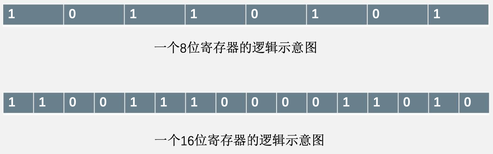

### MAR与MDR

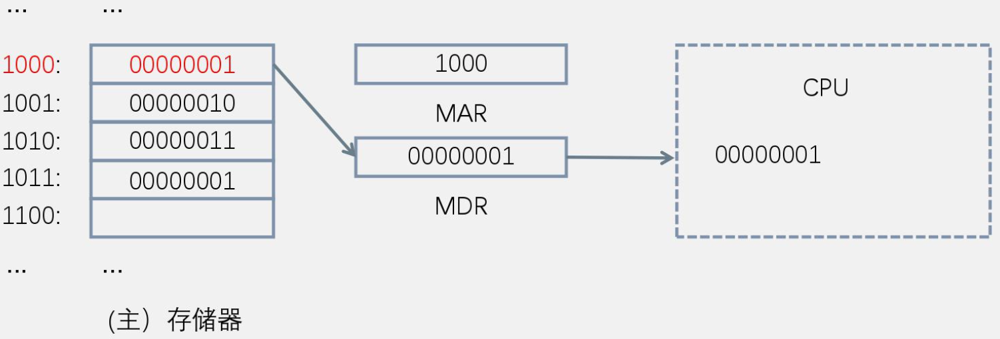

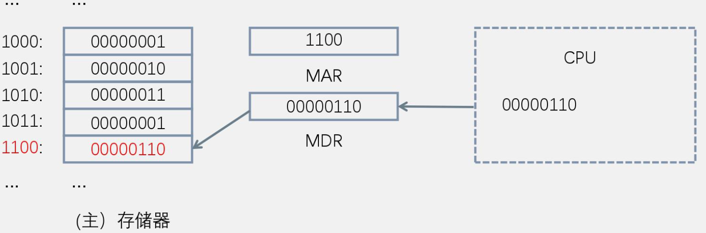

&emsp;&emsp;&ensp;当计算 ${ax^2+bx+c}$ 时：

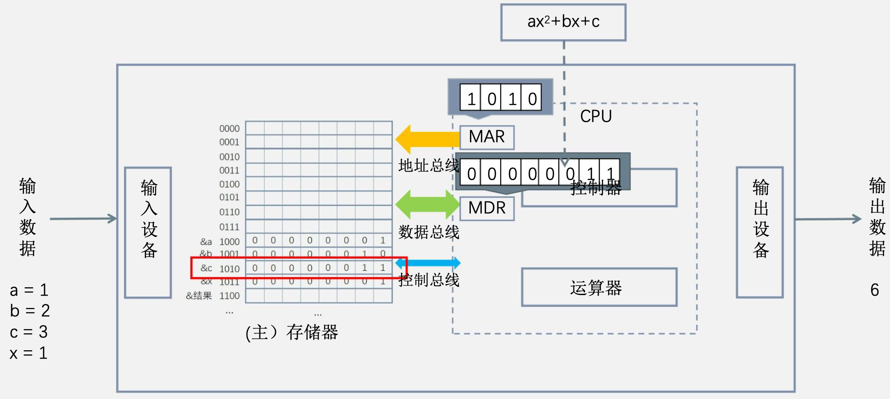

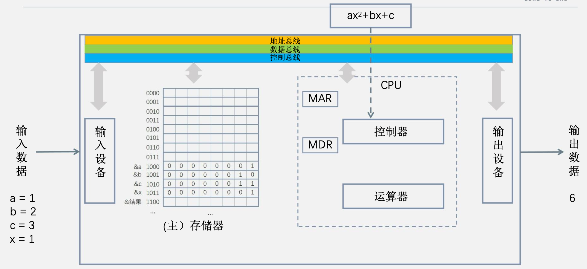

### 运算器
&emsp;&emsp;&ensp;寄存器：
&emsp;&emsp;&ensp;${ACC}$：累加器，暂存运算结果，并可以作为下一次运算的源操作数。
&emsp;&emsp;&ensp;${MQ}$：乘商寄存器，辅助乘除操作。
&emsp;&emsp;&ensp;${X}$：操作数寄存器，提供运算的源操作数。
&emsp;&emsp;&ensp;基本操作：${ACC+X \to ACC;}$ ${ACC \times X \to (ACC,MQ)}$
&emsp;&emsp;&ensp;算术逻辑单元：${ALU}$（组合电路，无存储功能）

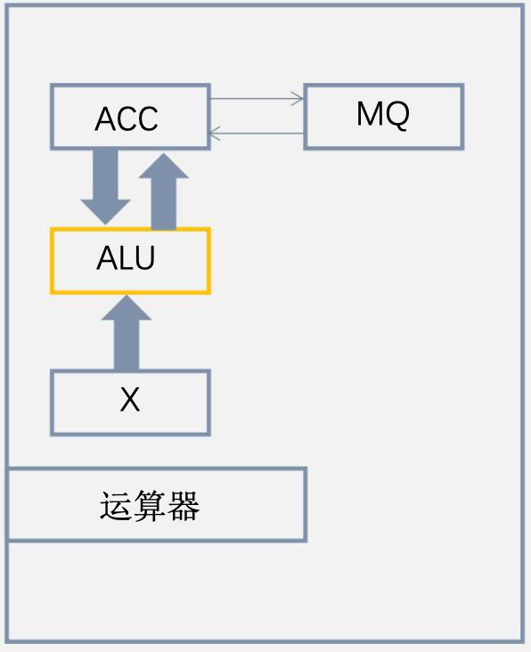

&emsp;&emsp;&ensp;${x}$ 存放在主存的1000号单元，${x = 64}$。
&emsp;&emsp;&ensp;${y}$ 存放在主存的1001号单元，${y=4}$。
&emsp;&emsp;&ensp;计算 ${x\times y}$，结果高位存放在0110号单元。

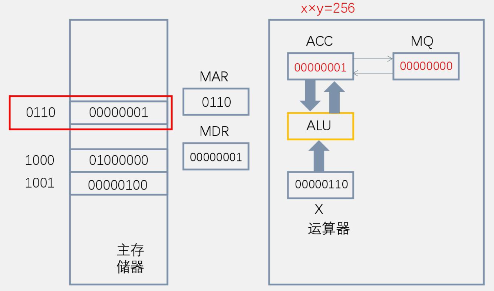

&emsp;&emsp;&ensp;将 ${ax^2+bx+c}$ 改写为 ${(ax+b)x+c}$，其步骤可以简化为：
1. 将 ${x}$ 从主存取到运算器的 ${ACC}$ 寄存器中。
2. 将 ${a}$ 从主存取到运算器的 ${x}$ 寄存器中，执行乘操作，得到 ${ax}$，存在 ${ACC}$ 寄存器中。
3. 将 ${b}$ 从主存取到运算器的 ${x}$ 寄存器中，执行加操作，得到 ${ax+b}$，存在 ${ACC}$ 寄存器中。
4. 将 ${x}$ 从主存取到运算器的 ${x}$ 寄存器中，执行乘操作，得到 ${(ax+b)x}$ ，存在 ${ACC}$ 寄存器中。
5. 将 ${C}$ 从主存取到运算器的 ${x}$ 寄存器中，执行加操作，得到 ${(ax+b)x+c}$，存在 ${ACC}$ 寄存器中。
6. 将 ${ax^2+bx+c}$ 从 ${ACC}$ 寄存器中取出存在主存存放结果的存储单元中。

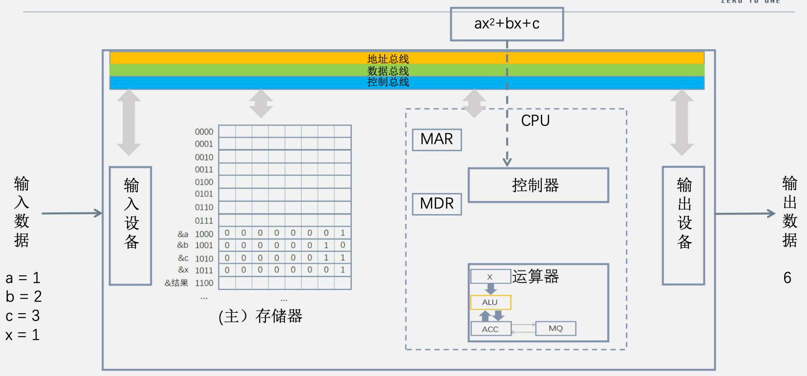

### 机器指令

#### 机器指令的一般格式

&emsp;&emsp;&ensp;操作码：指出该指令应该执行什么操作；
&emsp;&emsp;&ensp;地址码：用来给出该指令的源操作数的地址、结果的地址、或者下一条指令的地址。

&emsp;&emsp;&ensp;例子：

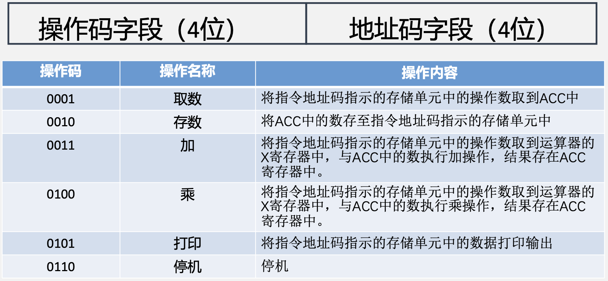

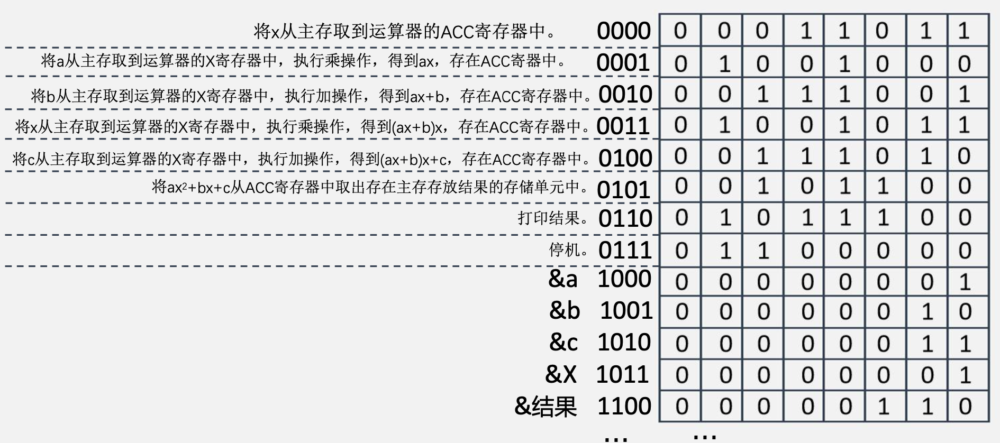

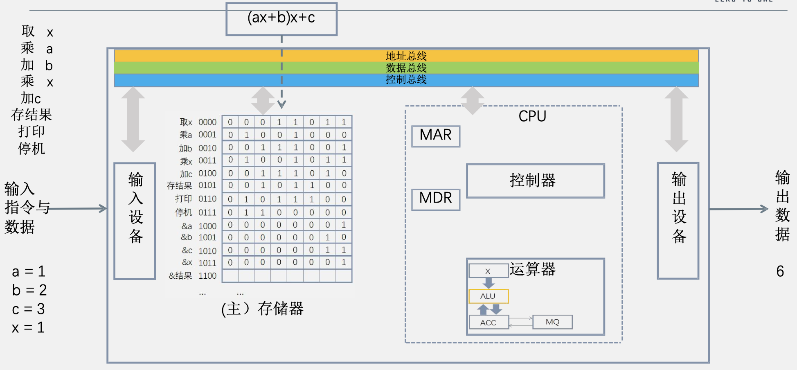

### 控制器

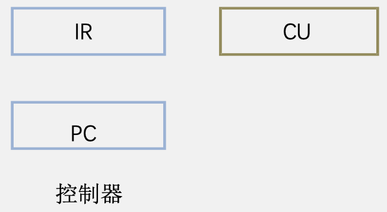

&emsp;&emsp;&ensp;${PC}$：程序计数器，存放当前要执行的指令的地址，它与 ${MAR}$ 之间有一条直接通路。它可以自动加一，形成下一条指令的地址。
&emsp;&emsp;&ensp;${IR}$：指令寄存器，存放当前要执行的指令，它的内容来自 ${MDR}$。拿到指令后，其操作码部分 ${OP(IR)}$ 送到 ${CU}$，用来分析指令，产生控制信号；其地址码部分 ${Ad(IR)}$ 送到 ${MAR}$，用来存取操作数。
&emsp;&emsp;&ensp;${CU}$：控制单元，对 ${OP(IR)}$ 进行译码，产生相应的控制信号。

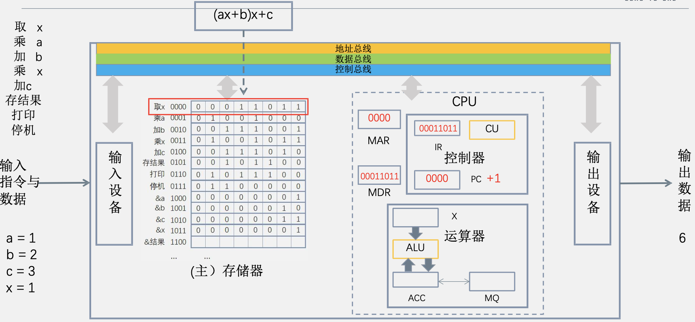

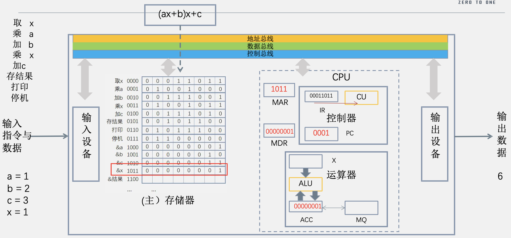

## 冯·诺依曼机

&emsp;&emsp;&ensp;冯·诺依曼提出一种计算机的模型，描绘了现代计算机的雏形，其核心思想在于“存储程序”。基于此模型的各类计算机通称为冯·诺依曼机。
&emsp;&emsp;&ensp;冯·诺依曼机的特点：
1. 计算机由运算器、存储器、控制器、输入设备和输出设备五大部件组成。
2. 指令和数据以**同等地位**存放于存储器内，并可按地址寻访。
3. 指令和数据均用**二进制数**表示。
4. 指令由操作码和地址码组成，操作码用来表示操作的性质，地址码用来表示操作数在存储器中的位置。
5. 指令在存储器内按顺序存放。通常，指令是顺序执行的，在特定条件下，可以根据运算结果或根据设定的条件来改变执行顺序。
6. 机器**以运算器为中心**，输入输出设备与存储器间的数据传送**通过运算器完成**。
&emsp;&emsp;&ensp;现代计算机**以存储器为中心**。

&emsp;&emsp;&ensp;以**运算器为中心**的计算机结构示意图

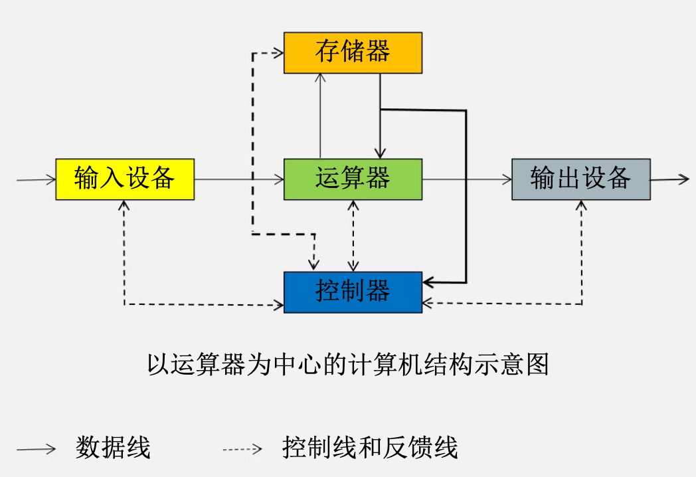

&emsp;&emsp;&ensp;以**存储器为中心**的计算机结构示意图

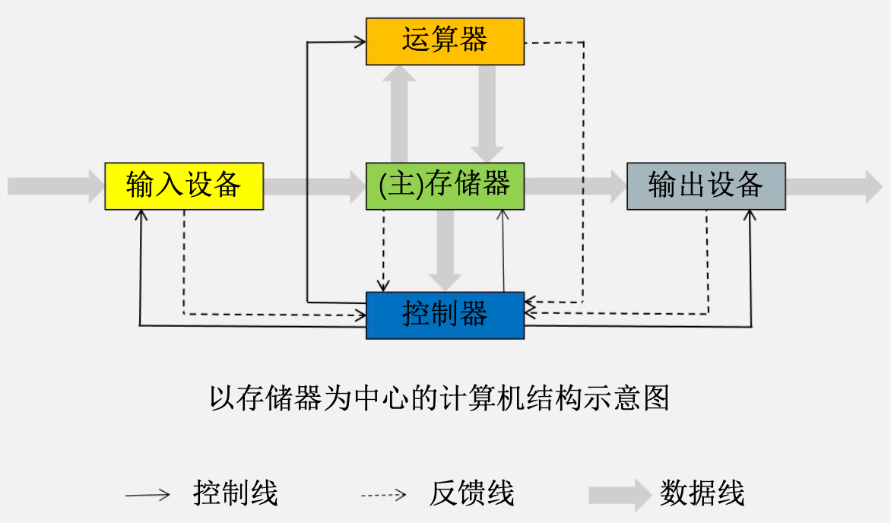

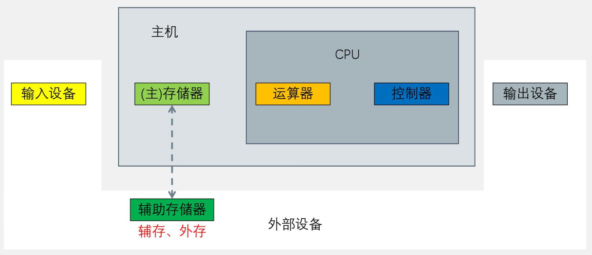

## 计算机软件

&emsp;&emsp;&ensp;计算机系统由“硬件”和“软件”两大部分组成。
&emsp;&emsp;&ensp;软件 = 完成特定功能的程序
&emsp;&emsp;&ensp;系统软件：监控和维护计算机系统，管理计算机系统中各种独立的硬件使之协调工作，调度系统资源，支持应用软件开发和运行，无需用户干预的各种程序的集合。常见的系统软件有标准程序库、语言处理程序（如编译和汇编程序）、**操作系统**、数据库管理系统、网络软件等等。
&emsp;&emsp;&ensp;应用软件：完成用户具体任务需求的各种程序，游戏、聊天工具、办公软件、${CAD}$ 软件等等。
&emsp;&emsp;&ensp;区分方法：
1. 系统软件一般是**操作系统**和**一系列基本的工具**；
2. 系统软件**不完成**具体的最终的用户功能，这是由应用软件完成的；
3. 数据库管理系统（${DBMS}$）是系统软件，数据库系统（${DBS}$）是应用软件。
4. 软件功能和硬件功能的区分方法：软件功能是程序员用**指令控制实现**的功能；硬件功能**不需要指令控制，自动完成**。

&emsp;&emsp;&ensp;**软硬件在逻辑上是等效的**
&emsp;&emsp;&ensp;对于同一个功能，既可以用软件来实现，也可以用硬件来实现。硬件实现要比软件实现效率更高，但需要考虑成本，且灵活性要差。一般来说，对于使用频繁，用硬件实现成本可以接受的功能，可以用硬件来实现。

## 计算机系统的多级层次结构

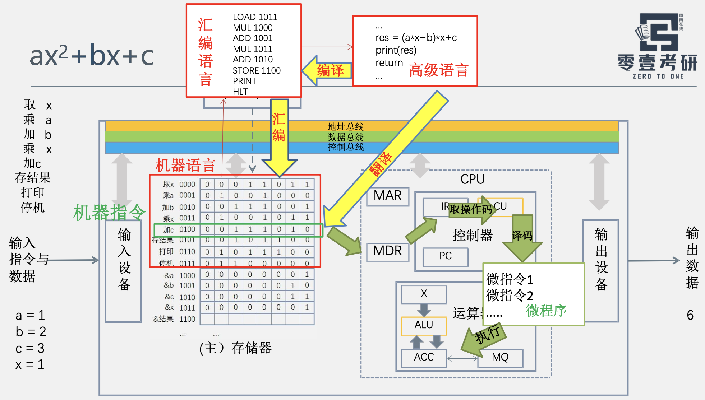

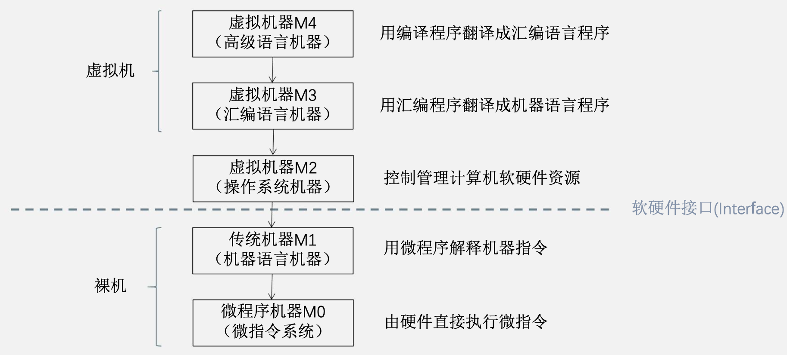

## 计算机的主要性能指标

&emsp;&emsp;&ensp;**机器字长**：与 ${CPU}$ 的通用寄存器位数有关，决定计算机运算精度，也叫**计算机位数**，是一次整数（定点数）运算可以支持的最大位数，注意**浮点数运算不包括在内**；
&emsp;&emsp;&ensp;**指令字长**：等于一个指令字的位数，与机器字长没有关系，一般取存储字长的整数倍，或者 ${\frac{1}{2}}$ 倍；
&emsp;&emsp;&ensp;**存储字长**：和 ${MDR}$ 位数无关，表示一个存储单元的位数。存储字长和一个体一次提供的 ${bit}$ 数相等，在多体存储器后这就失去了意义；
&emsp;&emsp;&ensp;**数据字长**：数据总线的位数，等于 ${MDR}$ 的位数。
&emsp;&emsp;&ensp;**存储容量**：存储容量包括主存容量和辅存容量。主存容量=存储单元个数×存储字长
&emsp;&emsp;&ensp;**吞吐量**：指系统在单位时间内处理请求的数量。
&emsp;&emsp;&ensp;**响应时间**：从用户向计算机发送一个请求，到系统对该请求做出响应并获得对应结果，所需要的时间。${响应时间=等待时间（磁盘访问、访存时间、I/O操作、操作系统开销）+CPU时间}$
&emsp;&emsp;&ensp;**${CPU}$ 时钟周期**：即时钟周期，指 ${CPU}$ 中最小的时间单位，通常为节拍脉冲或 ${T}$ 周期。
&emsp;&emsp;&ensp;**${CPU}$ 周期**：即**机器周期**，完成一个基本操作（取指令、存储器读、存储器写等）所需要的时间通常用**内存中读取一个指令字的最短时间来规定**。
&emsp;&emsp;&ensp;**${CPU}$ 时钟频率**：简称主频，与时钟周期互为倒数，单位通常为 ${MHz}$。时钟频率越高，执行指令速度越快。
&emsp;&emsp;&ensp;**${CPI（Cycle\space per\space Instruction）}$ **：执行一条指令**所需的时钟周期数**。${平均CPI=Σ(指令占比)\times(该类指令CPI)}$
&emsp;&emsp;&ensp;**${CPU}$ 执行时间**：运行一个程序所花费的时间。
&emsp;&emsp;&ensp;${CPU执行时间=所需CPU时钟周期数\times CPU时钟周期=\frac{所需CPU时钟周期数}{主频}=\frac{(指令条数\times CPI)}{主频}}$
&emsp;&emsp;&ensp;可以看到 ${CPU}$ 执行时间取决于：1. 主频；2. CPI；3. 指令条数。可以认为 ${CPU}$ 性能**取决于这三要素**。
&emsp;&emsp;&ensp;${MIPS(millon\space instruction\space per\space second)}$：每秒能够执行多少百万条指令。
&emsp;&emsp;&ensp;${MFLOPS(millon\space float\space operation\space per\space second)}$：每秒能够执行多少百万次浮点运算。
&emsp;&emsp;&ensp;${GFLOPS}$：每秒能够执行多少十亿次浮点运算。
&emsp;&emsp;&ensp;${TFLOPS}$：每秒能够执行多少万亿次浮点运算。
&emsp;&emsp;&ensp;${PFLOPS}$：每秒能够执行多少千万亿次浮点运算。

