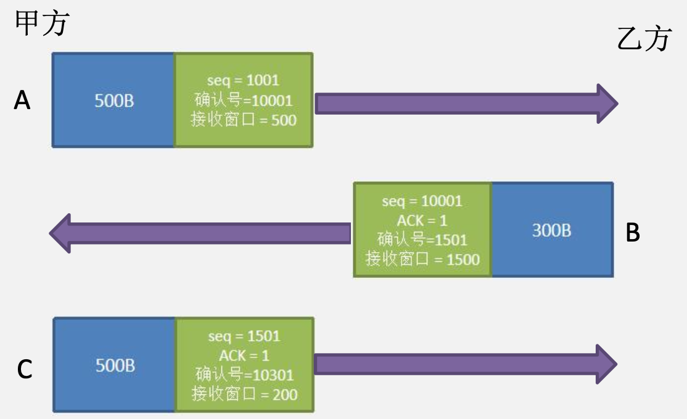
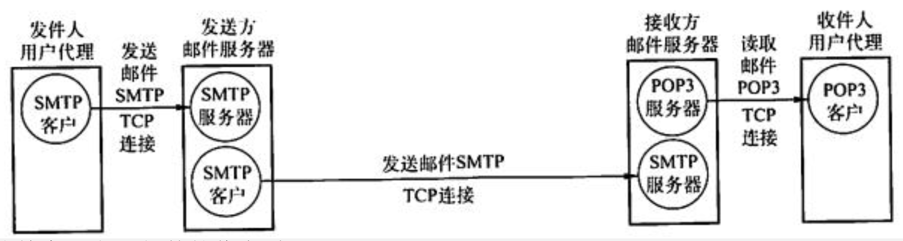

# 传输层+应用层

## 传输层目的

&emsp;&emsp;&ensp;网络层提供了主机之间的逻辑通信，而传输层在网络层的基础上，为运行在不同主机上的进程之间提供了**逻辑通信**。
&emsp;&emsp;&ensp;为了实现上述目的，传输层提供两种协议，${TCP}$ 和  ${UDP}$。 
&emsp;&emsp;&ensp; ${UDP}$  和  ${TCP}$  最基本的责任是**提供进程间的传输服务**。其中  ${TCP}$  为可靠传输服务， ${UDP}$  为不可靠传输服务。
&emsp;&emsp;&ensp;套接字：套接字由 **${IP}$ 地址和端口号组成**。程序员将目标主机的 ${IP}$ 地址和端口号封装在一个套接字中，**将套接字给到操作系统**。操作系统根据套接字给传输层数据添加目的端口号，给 ${IP}$ 数据报添加目的 ${IP}$ 地址。 

## 复用和分用

&emsp;&emsp;&ensp;主机 A 的应用进程 AP1 和主机 B 的应用进程 AP3 通信，而与此同时，应用进程 AP2 也和对方的应用进程 AP4 通信。这表明传输层有一个很重要的功能“复用”和“分用”。 
&emsp;&emsp;&ensp;复用：是指在发送方不同的应用进程都可以**使用同一个运输层协议传送数据**（当然需要加上适当的首部）。
&emsp;&emsp;&ensp;分用：是指接收方的传输层在剥去报文的首部后能够把这些数据**正确交付目的应用进程**。

## UDP

### UDP协议的优点和使用情景

&emsp;&emsp;&ensp;${UDP}$  无须建立连接。因此  ${UDP}$  不会引入建立连接的时延。 ${TCP}$  需要在端系统中**维护连接状态**。此连接状态包括接收和发送缓存、拥塞控制参数和序号与确认号的参数。而  ${UDP}$  不维护连接状态，也不跟踪这些参数。 
&emsp;&emsp;&ensp;分组首部开销小。${TCP}$**有 ${20B}$ 的首部开销**，而  ${UDP}$ 仅有 **${8B}$ 的开销**。 
&emsp;&emsp;&ensp;应用层能更好地控制要发送的数据和发送时间。${UDP}$  **没有拥塞控制**，因此网络中的拥塞不会影响主机的发送效率。某些实时应用要求**以稳定的速度发送**，能容忍一些数据的丢失，但不允许有较大的时延，而 ${UDP}$ 正好满足这些应用的需求。

### UDP的首部格式

&emsp;&emsp;&ensp;源端口：表示发送方的进程的端口号。
&emsp;&emsp;&ensp;目的端口：表示接收方进程的端口号。
&emsp;&emsp;&ensp;长度： ${UDP}$ 数据报的长度（包括首部和数据），其最小值是 ${8B}$（**仅有首部**）。
&emsp;&emsp;&ensp;校验和：检测 ${UDP}$ 数据报在传输中是否有错。有错就丢弃。该字段是可选的，当源主机不想计算校验和时，则直接令该字段为全 0。

### UDP校验方式

&emsp;&emsp;&ensp;${UDP}$ 校验的思想就是让 ${UDP}$ 的校验码 + ${UDP}$ 头部字段 + 数据部分 = ${FFFF}$。${UDP}$ 会先添加 ${12B}$ 的伪首部字段。该字段包含源 ${IP}$、目的 ${IP}$ 、协议字段、数据报长度。 
&emsp;&emsp;&ensp;比如：${IP}$ 为 ${153.19.8.104}$ 中的端口 ${1087}$ 给目的主机 ${171.3.14.11}$ 中的端口为 ${13}$ 发送一个 ${UDP}$ 报文，该报文的总长度为 ${15B}$。 
&emsp;&emsp;&ensp;伪首部会添加**源 ${IP}$ 、目的 ${IP}$ 、协议、数据报长度等信息**。同时如果 ${UDP}$ 报文的长度是奇数，则要添加 ${1B}$ 的全 ${0}$ 数据作为填充，**保证 ${UDP}$ 报文的长度是偶数**。

&emsp;&emsp;&ensp;在进行 ${UDP}$ 校验位计算时，先按照 ${2B}$ 为一行排列，然后对全部的 ${16}$ 进制进行计算 ${9913+0868+AB03+}$${0E0B+0011+000f+}$${043f+000D+000F}$${+0000+5445+5354+}$${494E+4700=296EB}$，**取低 ${16bit}$ 数据 ${96EB}$**。
&emsp;&emsp;&ensp;并且由于**加法时出现了进位**，也就是高 ${4bit}$ 数据，所以将高 ${4bit}$ 的数据加到低 ${16bit}$ 上，称为**回滚**。再将 ${FFFF- 96ED = 6912}$，校验位为 ${6912 H}$。

&emsp;&emsp;&ensp;接收方收到数据后，将  ${UDP}$  报文加上伪首部，并以 ${2}$ 字节为一行计算和是否为 ${FFFF}$。**若成立则代表无差错，若不成立则丢弃**。

## TCP

### TCP协议的目的和特点

&emsp;&emsp;&ensp;${TCP}$ 是**在不可靠的 ${IP}$ 层之上实现的可靠的数据传输协议**，它主要解决传输的**可靠、有序、无丢失和不重复**问题。 
&emsp;&emsp;&ensp;主要特点如下：
&emsp;&emsp;&ensp;${TCP}$ 是面向连接的传输层协议，${TCP}$ 连接**是一条逻辑连接**。
&emsp;&emsp;&ensp;每条 ${TCP}$ 连接**只能有两个端点**，每条 ${TCP}$ 连接只能是端到端的（进程对进程）。
&emsp;&emsp;&ensp;${TCP}$ 提供**可靠交付**的服务，保证传送的数据无差错、不丢失、不重复且有序。
&emsp;&emsp;&ensp;${TCP}$ 提供**全双工**通信，允许通信双方的应用进程在**任何时候都能发送数据**，为此 ${TCP}$ 连接的两端都设有发送缓存和接收缓存，用来临时存放**双向通信**的数据。
&emsp;&emsp;&ensp;${TCP}$ 是面向字节流的，虽然应用程序和 ${TCP}$ 的交互是一次发送一个数据块（大小不等），但 ${TCP}$ 把应用程序交下来的数据**仅视为一连串的无结构的字节流**。

### 发送缓存与报文段

&emsp;&emsp;&ensp;${TCP}$ 的发送方有一个发送缓存，发送方需要发送的数据存放在发送缓存中。
&emsp;&emsp;&ensp;报文段：${TCP}$ 发送主要以**报文段**的形式进行发送。也就是发送方在发送前先设定自身的 ${MSS}$（每一个 ${TCP}$ 报文段中的数据字段的最大长度）。
&emsp;&emsp;&ensp;发送方先将发送缓存中的数据**填满一个报文段**，填满后将报文段进行发送。此报文段的**序号字段为报文段的第一个字节**。接收方在收到这个报文段后，对此报文段中**正确接收的最后一个字节进行确认**。

### TCP和UDP的区别

&emsp;&emsp;&ensp;${TCP}$ 和 ${UDP}$ 在**发送报文时所采用的方式完全不同**。
&emsp;&emsp;&ensp;${UDP}$ 报文的长度由**发送应用进程决定**。应用进程根据其任意需求将任意长度的数据给到 ${UDP}$。**应用层交给 ${UDP}$ 多长的报文，${UDP}$ 就照样发送**。应用程序必须选择合适大小的报文。若报文太长，${UDP}$ 把它交给 ${IP}$ 层后，${IP}$ 层在传送时可能要进行分片，这会**降低 ${IP}$ 层的效率**。 
&emsp;&emsp;&ensp;${TCP}$ 报文的长度则根据接收方给出的窗口值**由当前网络拥塞程度来决定**。如果应用进程传送到 ${TCP}$ 缓存的数据块太长 ${TCP}$ 就把它**划分成小的报文分组**。如果太短，${TCP}$ 也可以等到积累足够多的字节后再构成报文段发送出去。 
&emsp;&emsp;&ensp;${TCP}$ 应用在对**可靠性要求高**的情景，比如文件传输。${UDP}$ 应用在**需要快速响应，但无需高可靠性**的场景。

### TCP协议头部

&emsp;&emsp;&ensp;${TCP}$ 的序号（ ${seq}$ ）序号：是建立在传送的字节流之上，而不是建立在传送的报文段的序列之上。一个 ${TCP}$ 报文段的序号是该报文段首字节在源数据字节流中的位置。接收方根据其序号部分就可以判断出各个报文段间是否出现报文丢失，乱序以及重复。

&emsp;&emsp;&ensp;${TCP}$ 的确认号（ack）：${TCP}$ 报文中的序号字段，让接收方通过 ${TCP}$ 头部就能准确的**区分出报文间的不同**。根据序号就能了解报文的**发送顺序**。由于 ${TCP}$ 是可靠传输，那么接收方就要给发送方返回确认报文。${TCP}$ 协议通过 ACK 标志和确认号（ack）字段共同构成了 ${TCP}$ 的确认机制。
&emsp;&emsp;&ensp;发送方先发送了一个 ${seq}$ = 1001，大小为 500B 的数据。 
&emsp;&emsp;&ensp;接收方收到后，给出一个确认报文。该报文的  ${seq}$  = 10001， ${ack}$  = 1，确认号（ack）= 1501，代表接收方发出的确认报文的序列号为 10001，并且**该报文的 ACK = 1 代表具有确认功能**，想接收的下一个报文的序列号为 1501。 
&emsp;&emsp;&ensp;发送方收到确认报文后，将序列号为 1501 的报文发出。同时该报文的 ACK = 1代表具有确认功能，想接收的下一个报文的序列号为 10301。

&emsp;&emsp;&ensp;接收窗口字段（${16bit}$）：该字段用于流量控制，指示报文**发出方的接受窗口可以接收的字节数量**。
&emsp;&emsp;&ensp;${4bit}$ 的首部长度字段（**数据偏移**）：该字段表示 ${TCP}$ 首部长度，单位为 ${4B}$。 
&emsp;&emsp;&ensp;标志字段（${6bit}$）：只有 ${ACK}$ 为 ${1}$ 表示确认号是有效的；**${SYN}$ 和 ${FIN}$ 用于连接建立和拆除**；${PSH}$ 表示接收方应**立即将数据交给上层**；${URG}$ 表示报文段里存在着被发送端的上层实体置为“紧急”的数据，紧急数据的最后一个字节由 ${16}$ 比特的紧急数据指针字段指出。当紧急数据存在并给出指向紧急数据尾的指针的时候，${TCP}$ 必须通知接收端的上层实体。（**在实践中，${PSH、URG}$ 和紧急数据指针并没有使用。**）
&emsp;&emsp;&ensp;${TCP}$ 的确认也可以采用**累计确认**的方式（此累计确认与 ${GBN}$ 的累计确认有所类似）${TCP}$ 是按照报文段进行发送，他的累计确认是对于当前收到报文段的**最后一个未丢失的字节进行确认**。比如一个报文段包含 ${0-500}$ 字节，其是对当前报文段未丢失的最后一个字节进行累计确认。如果发送方连续发出多个报文，则接收方对正确接收的最后一个报文的**最后一个字节给出确认**。

&emsp;&emsp;&ensp;接收窗口：该字段明确指出了目前可以接收的数据量，它告诉对方，本端的 ${TCP}$ 接收缓冲区**还能容纳多少字节的数据**，这样对方就可以控制发送数据的速度。

&emsp;&emsp;&ensp;${A}$ 报文表明，甲方目前能接收 ${500B}$ 的数据。当甲方收到 ${B}$ 报文后，此时甲方还能接收 ${200B}$ 数据。所以 ${C}$ 报文的接收窗口为 ${200}$。

### TCP报文段

&emsp;&emsp;&ensp;首先，我们回顾一下以太网帧。以太网帧的**数据部分最小为 46B，最大为 1500B**。而在现实生活中，我们主机网卡发出的数据多为以太网帧。所以**以太网帧能包含数据的大小，就决定了一个主机发出的  ${IP}$  数据报的最大长度能为多少**，间接的决定了传输层报文（ ${TCP}$  报文段）的大小。 
&emsp;&emsp;&ensp;如果一个进程想要传输 14600 字节的数据，由于数据量远大于链路的  ${MTU}$ 。若主机传输层采用  ${TCP}$  协议，主机不会直接对一个 14600B 的数据添加  ${TCP}$  头部字段（${20B}$）。因为这样生成的一个传输层数据是无法满足以太网的最大  ${MTU}$ 。

&emsp;&emsp;&ensp;${TCP}$  协议会先根据  ${MTU}$  设定  ${MSS}$  为 1460B，从而应用层数据被分成 10 个分组，每个分组大小为 1460B，并给每个分组添加  ${TCP}$  首部字段（20B），再添加  ${IP}$  首部字段。也就是生成了 10 个大小为 1500B 的 ${IP}$ 数据报。这样每个 ${IP}$ 数据报都能满足以太网的最大 ${MTU}$ 。

&emsp;&emsp;&ensp;**注意：传输层将数据进行拆分成小的分组，并不是 ${IP}$ 数据报分片**。
&emsp;&emsp;&ensp;对于 ${TCP}$ 将 14600B 的进程数据拆分成 10 个大小为 1460B 的分组，是因为以太网的 ${MTU}$ 只有 1500B。而  ${TCP}$  将 14600B 的数据拆分后，生成 10 个 ${TCP}$ 报文段。上述的 10 个报文段会封装在 10 个 ${IP}$ 数据报中进行发送，也就是说每个  ${IP}$  数据报的标识字段均不同。 
&emsp;&emsp;&ensp;对于网络层来说，是传输层向下给了 10 个  ${TCP}$  报文段而不是一个数据长度为 14620B 的  ${IP}$  数据报，分片成了 10 个 ${IP}$ 数据报，**只有主机可以这种操作**。

&emsp;&emsp;&ensp;14600B 的远大于以太网 ${MTU}$ 的进程数据，通过 10 个独立的  ${IP}$  数据报进行发送，每个  ${IP}$  数据报都满足以太网的  ${MTU}$ 。所有 ${IP}$ 数据报在主机发到以太网链路时**都不需要进行  ${IP}$  数据报分片**。
&emsp;&emsp;&ensp;${TCP}$  分段和  ${IP}$  分片的区别：

&emsp;&emsp;&ensp;如果是 ${TCP}$ 分段，每个分段都拥有一个 ${TCP}$ 头部字段。将分段后的 ${TCP}$ 报文依次分装在 ${IP}$ 数据报内，若其中一个 ${IP}$ 数据报丢失，则收到后续的 ${IP}$ 数据报后，只需要根据内部的 ${TCP}$ 头部字段，就可以推算出丢失的部分，这样**只需要重传丢失的数据即可**。
&emsp;&emsp;&ensp;${IP}$ 数据报分片的操作对象是整个 ${IP}$ 数据报。对 ${IP}$ 数据报分片时，**只有第一个分片中包含 ${TCP}$ 的头部字段，后续分片均无 ${TCP}$ 头部字段**。一旦其中一个 ${IP}$ 数据报丢失，则接收方只能舍弃其他收到的 ${IP}$ 数据报分片。 

### TCP连接建立

&emsp;&emsp;&ensp;${TCP}$  在进行传输之前，需要先建立  ${TCP}$  连接（**三次拍手**）。 
&emsp;&emsp;&ensp;在  ${TCP}$  的连接阶段，客户机会首先向服务器发送一个特殊的连接报文。该报文中不会包含任何数据，但会消耗一个序列号（${seq}$）。并且标志字段中 ${SYN = 1}$。 
&emsp;&emsp;&ensp;服务器收到 ${SYN = 1}$ 的 ${TCP}$ 报文后，会返回一个确认报文。该确认报文同样 ${SYN = 1}$，同样会分配一个序列号，并且不包含任何数据。除此之外，其 ACK = 1，代表该报文也是一个**确认报文**。确认号（ack）为 1001 代表发送方发出的  ${seq}$  = 1000 的数据已经收到了，想要接收  ${seq}$  = 1001 的  ${TCP}$  报文段。 
&emsp;&emsp;&ensp;第三次拍手的报文**可以携带数据，也可以不携带数据**。如果不携带数据，则发送方会在第三次拍手后，紧跟着发出一个携带数据的报文。（注意：此时这个携带数据的报文的  ${seq}$  = 1001，即**除了  ${SYN = 1}$ 或者  ${FIN = 1}$  的情况下，其他时候若报文不携带数据则不会消耗 ${seq}$。**）
&emsp;&emsp;&ensp;报文超时时间 2MSL：当  ${TCP}$  报文发出后，发送方会为该报文设置超时时长，一般会将超时时长设置为 2MSL。其中 MSL 表示最长报文段寿命。
&emsp;&emsp;&ensp;若发送方在**经过超时时长后还没有接收到接收方发来的确认报文，则上报超时事件，并重传该报文**。

### ${TCP}$ 连接释放（四次挥手）

&emsp;&emsp;&ensp;客户机打算**关闭连接**时，向其 ${TCP}$ 发送连接释放报文段，此报文以后发出的所有报文（客户机发出的报文）**不再携带数据**。该报文段的终止位 FIN 置 1，FIN 报文段即使不携带数据，也**消耗掉一个序号**。这时， ${TCP}$  客户进程进入 FIN-WAIT-1（终止等待 1）状态。 ${TCP}$ 是**全双工**的，即可以想象为一条  ${TCP}$  连接上有两条数据通路，发送 FIN 的一端后续的报文不在携带数据。即关闭了其中一条数据通路，但对方还可以发送数据。 
&emsp;&emsp;&ensp;服务器收到连接释放报文段后即**发出确认**，然后服务器进入 ${CLOSE-WAIT}$（关闭等待）状态。此时，**从客户机到服务器这个方向的连接就释放了**，${TCP}$ 连接处于半关闭状态。但服务器若发送数据，客户机仍要接收，即从服务器到客户机这个方向的连接并未关闭。
&emsp;&emsp;&ensp;若服务器已经没有要向客户机发送的数据，则通知  ${TCP}$  释放连接。此时发出 ${FIN = 1}$ 的连接释放报文段，服务器此时进入 ${LAST-ACK}$ 阶段。 
&emsp;&emsp;&ensp;客户机收到连接释放报文段后，**必须发出确认**。此时 ${TCP}$ 连接 ，**必须经过时间等待计时器设置的时间 2MSL（最长报文段寿命）后，客户机才进入 CLOSED（连接关闭）状态**。

### TCP协议情景

&emsp;&emsp;&ensp;**情景一**：假设，发送方顺序的发送了三个报文 ${A、B、C}$，但接收方只收到 ${A、C}$，此时 ${TCP}$ 对 A 的最后一个字节进行累计确认即 ${ACK = 1200}$。但对于 C 报文，${TCP}$ 并未提出具体是保存还是直接丢弃。所以题目对于此种场景要么不考察这个点，要么会详细规定，是保留 C 报文还是丢弃 C 报文。如果题目表明缓存足够大，那么可以进行缓存操作。

&emsp;&emsp;&ensp;**超时重传 ${TCP}$ 每发送一个报文段，就对这个报文段设置一次计时器**。计时器设置的重传时间到期但还未收到确认时，就要重传这一报文段。 
&emsp;&emsp;&ensp;**情景二**：假设主机 A 连续发了两个报文段。第一个报文段序号是 92，包含 8 字节数据；第二个报文段序号是 100，包含 20 字节数据。假设两个报文段都完好无损地到达主机 B，并且主机 B 为每一个报文段分别发送一个确认。第 1 个确认报文的确认号是 100，第二个确认报文的确认号是 120。现在假设在超时之前这两个报文段中没有一个确认报文到达主机 A。当超时事件发生时，主机 A 重传序号 92 的第一个报文段，并**重启定时器**。**只要第二个报文段的 ACK 在新的超时发生以前到达，则第二个报文段将不会被重传**。
&emsp;&emsp;&ensp;**情景三**：假设主机 A 与在第二种情况中完全一样，发送两个报文段。第一个报文段的确认报文在网络丢失，但在超时事件发生之前主机 A 收到一个确认号为 120 的确认报文。**主机 A 因而知道主机 B 已经收到了序号为 119 及之前的所有字节；所以主机 A 不会重传这两个报文段中的任何一个**。
&emsp;&emsp;&ensp;冗余 ${ACK}$：例如，发送方 A 发送了四个 ${TCP}$ 报文段，其中第一个报文段在链路中丢失，它无法到达接收方 B。因此后三个报文段对于 B 来说就成了**失序报文段**。**每当比期望序号大的失序报文段到达时，就发送一个冗余 ${ACK}$**，指明下一个期待字节的序号。在本例中，后三段报文到达 B，但它们不是 B 所期望收到的下一个报文，于是 B 就发送 3 个对第一个报文段的冗余 ${ACK}$。当发送方收到对同一个报文段的 3 个冗余 ${ACK}$ 时，就可以认为跟在这个被确认报文段之后的报文段已经丢失。这时发送方 A 可以**立即对丢失报文执行重传**，这种技术通常称为**快速重传**。

### TCP拥塞控制

&emsp;&emsp;&ensp;**发送窗口**：发送方当前能发送报文段的总数；
&emsp;&emsp;&ensp;**接收窗口（ ${rwnd}$ ）**：接收方根据目前接收缓存大小所许诺的最新窗口值；
&emsp;&emsp;&ensp;**拥塞窗口（ ${cwnd}$ ）**：它是 ${TCP}$ 判断网络能**保证不出现拥塞的一种尝试**，它对一个 ${TCP}$ 发送方能向网络中发送流量的速率进行了限制。在一个发送方中未被确认的数据量不会超过  ${cwnd}$  与  ${rwnd}$  中的最小值。发送方**每收到一个确认帧，拥塞窗口 ${+1}$**。按照这个策略相当于每个发送轮次，${TCP}$ 的拥塞窗口 * 2；
&emsp;&emsp;&ensp;**阈值（${ssthresh}$）**：拥塞窗口如果一直按照 * 2 的策略增加，那么增长是极快的。所以会设置一个阈值，当拥**塞窗口到达阈值时，就会改为线性增长，进入拥塞避免模式**。也就是每个轮次拥塞窗口只会 +1。
&emsp;&emsp;&ensp;**慢启动方式**：慢启动是一种试探性的策略，试探性的增大拥塞窗口。在慢启动状态下，拥塞窗口（ ${cwnd}$ ）的值以 1 个报文段开始发送。**每当传输的报文段被确认，拥塞窗口（ ${cwnd}$ ）就增加 1**（比如同时发了四个报文段 ${A、B、C、D}$，在收到返回时，并不是直接加 4，而是 A 收到后 +1，B 收到确认后在 +1）。
&emsp;&emsp;&ensp;当拥塞窗口（ ${cwnd}$ ）到达阈值（ ${ssthresh}$ ）时，下一个轮次拥塞窗口的增长**从指数增长变为线性增长**。结束慢启动并且  ${TCP}$  转移到**拥塞避免模式**。拥塞避免模式时， ${TCP}$  更为谨慎地增加  ${cwnd}$ ，**每次不管接收到多少个确认， ${cwnd}$  的值只增长 1**。

### TCP丢包处理

&emsp;&emsp;&ensp;${TCP}$  出现丢包事件时有以下两种策略：
&emsp;&emsp;&ensp;如果存在一个由超时指示的丢包事件（即拥塞）， ${TCP}$  发送方将  ${cwnd}$  设置为 1 并重新开始慢启动过程。它还将第二个状态变量的值  ${ssthresh}$ （“慢启动阈值”的速记）设置为  ${cwnd}$ /2。即当检测到拥塞时将  ${ssthresh}$  置为拥塞窗口值的一半。 
&emsp;&emsp;&ensp;如果检测到 3 个冗余 ACK，这时  ${TCP}$  执行一种快速重传，此时发送方的  ${ssthresh}$  设置为  ${cwnd}$ /2，同时把  ${cwnd}$  设置为当前  ${ssthresh}$  的值，并且  ${cwnd}$  后续进行线性增长进入拥塞避免（下一轮不管收到多少个确认报文， ${cwnd}$  的值只 +1）。

&emsp;&emsp;&ensp;如图，当时间到达 4 时，拥塞窗口 = 阈值， ${TCP}$  从慢开始阶段进入拥塞避免阶段，拥塞窗口线性增加。当时间到达 12 时，收到三个确认，执行快重传算法。拥塞窗口和阈值从 24 变为 12。若检测到一个由超时指示的丢包事件，则拥塞窗口直接变成 1，阈值减半，重新开始慢开始阶段。
&emsp;&emsp;&ensp;有的快重传实现（自顶向下提及）是把开始时的拥塞窗口  ${cwnd}$  值再增大一些（增大 3 个报文段），即等于  ${ssthresh + 3 * MSS}$  这样做的理由是：既然发送方收到三个重复的确认，就表明有三个分组已经离开了网络。这三个分组不再消耗网络资源而是停留在接收方的缓存中。

## CS模型

&emsp;&emsp;&ensp; ${CS}$  模型中，有一个总是打开的主机称为服务器，它服务于许多来自其他称为客户机的主机请求。其工作流程如下：

1. 服务器处于**接收请求**的状态；
2. 客户机**发出服务请求，并等待接收结果**；
3. 服务器收到请求后，分析请求，进行必要的处理，得到结果并发送给客户机。

&emsp;&emsp;&ensp;客户程序**必须知道服务器程序的地址**，服务器上运行的软件则是专门用来提供某种服务的程序，**可同时处理多个远程的要求**。系统启动后即自动调用并一直不断地运行着，被动地等待并接收来自各地客户的请求。
&emsp;&emsp;&ensp; ${CS}$  模型最主要的特征是：客户是服务请求方，服务器是服务提供方。如  ${web}$  应用程序，其中总是打开的  ${web}$  服务器服务于运行在客户机上的浏览器的请求。当  ${web}$  服务器接收到来自客户机对某对象的请求时，它向该客户机发送所请求的对象以做出响应。

## P2P模型
&emsp;&emsp;&ensp;在 ${P2P}$ 模型中，各计算机没有固定的客户和服务器划分。任意一对计算机一称为对等方（${Peer}$），直接相互通信。每个结点既作为客户访问其他结点的资源，也作为服务器提供资源给其他结点访问。与 C/S 模型相比，P2P 模型的优点主要体现如下：
&emsp;&emsp;&ensp;**减轻了服务器的计算压力**，消除了对某个服务器的完全依赖，可以将任务分配到各个结点上，因此大大提高了系统效率和资源利用率；
&emsp;&emsp;&ensp;**多个客户机之间可以直接共享文档**；
&emsp;&emsp;&ensp;**可扩展性好**，传统服务器有响应和带宽的限制，因此只能接受一定数量的请求；
&emsp;&emsp;&ensp;**网络健壮性强**，单个结点的失效不会影响其他部分的结点。

## DNS

&emsp;&emsp;&ensp;**${DNS}$ 域名解析协议的目的**： ${DNS}$  主要是**把域名映射为一个对应的 ${IP}$ 地址**。我们知道在互联网中，使用 ${IP}$ 地址代指一个服务器或一台主机。但如果我们需要访问百度服务器，让我们去记忆百度服务器的 ${IP}$ 地址肯定是不现实的。而我们目前访问一个网页时都是用域名来访问，比如访问百度，实际上我们只需要输入域名 ${www.baidu.com}$ 即可。而 ${DNS}$ 服务，会把域名解析成 ${IP}$ 地址，这样你就可以根据 ${IP}$ 地址去访问服务器了。
&emsp;&emsp;&ensp;在 408 考试里，每个域名只对应唯一的一个  ${IP}$  地址。但现在互联网厂商的域名往往会对应多个 ${IP}$ 地址。这是因为互联网厂商为了做到流量分流的一个策略，属于非考纲内容，各位同学了解即可。 ${DNS}$  使用  ${UDP}$  传输层协议。

&emsp;&emsp;&ensp;**域名服务器**：域名服务器总共有 4 种，分别是**根域名服务器、顶级域名服务器、权限域名服务器和本地域名服务器**。其中本地域名服务器（一般会和主机在同一个局域网）中会设置一个缓冲，主机的域名解析请求会统一发送给本地域名服务器，本地域名服务器中若有该域名的  ${IP}$  地址，则会直接发送给主机。若无 ${IP}$ 地址则本地域名服务器**会执行相应步骤进行域名解析**。获取 ${IP}$ 地址后将 ${IP}$ 地址发送给主机。

### DNS的域名空间

&emsp;&emsp;&ensp;我们以  ${www.baidu.com}$  为例，该域名可以分成三个域名空间。其中 ${.com}$ 叫做**顶级域名**，${.com}$ 顶级域名服务器的 ${IP}$ 地址保存在**根域名服务器**；${.baidu}$ 叫做**二级域名**，${.baidu}$ 的权限域名服务器保存在 **${.com}$ 顶级域名服务器**；${www}$ 称为**三级域名**，${www.baidu.com}$ 所在的服务器的 ${IP}$ 地址保存在 **${.baidu}$ 权限域名服务器**中。

#### 以迭代方式解析www.baidu.com域名

&emsp;&emsp;&ensp;${DNS}$ 迭代方式解析过程（以 ${www.baidu.com}$ 为例）：

1. 主机（408 情况下，主机**一定无域名缓存**）先向本地域名服务器进行递归查询；
2. 本地域名服务器采用迭代查询，向一个**根域名服务器**进行查询；
3. 根域名服务器告诉本地域名服务器，下一次应该查询的**顶级域名服务器的 ${IP}$ 地址**；
4. 本地域名服务器向**顶级域名服务器**进行查询；
5. 顶级域名服务器告诉本地域名服务器，下一步查询**权限服务器的 ${IP}$ 地址**；
6. 本地域名服务器向**权限服务器**进行查询；
7. 权限服务器告诉本地域名服务器所查询的**主机的 ${IP}$ 地址**；
8. 本地域名服务器最后**把查询结果告诉主机**。

&emsp;&emsp;&ensp;注意：如果是 ${www.baidu.com}$，则本地域名服务器查询 3 次，主机查询 1 次；如果是 ${www.lingyi.kaoyan.com}$，则本地域名服务器查询 4 次。
&emsp;&emsp;&ensp;${DNS}$ 缓存是保存在**本地域名服务器**中。所以主机第一次的时候一定会查询一次本地域名服务器，如果有上次连接的缓存，则直接转换成 ${IP}$ 给主机，**没有的话进行迭代查询**。

#### 以递归方式解析www.baidu.com域名

&emsp;&emsp;&ensp;${DNS}$  递归方式解析  ${www.baidu.com}$  的过程：

1. 主机将域名解析请求给到**本地域名服务器**；
2. 本地域名服务器将域名解析请求给到**根域名服务器**；
3. 根域名服务器根据域名中的 ${.com}$ 查询 **${.com}$ 顶级域名服务器的 ${IP}$ 地址**，将请求给到 ${.com}$ 顶级域名服务器；
4. ${.com}$ 顶级域名服务器从内部数据库拿到 **${.baidu}$ 权限域名服务器的 ${IP}$ 地址**，将请求发送到 ${.baidu}$ 权限域名服务器；
5. ${.baidu}$ 权限域名服务器从内部数据库拿到 **${www.baidu.com}$ 对应主机的 ${IP}$ 地址**，将 ${IP}$ 地址返回给 **${.com}$ 顶级域名服务器**；
6. ${.com}$ 顶级域名服务器将 **${IP}$ 地址给到根域名服务器**；
7. 根域名服务器将 ${IP}$ 地址给到**本地域名服务器**；
8. 本地域名服务器将 ${IP}$ 地址**返回给主机**。 

&emsp;&emsp;&ensp;注意：如果是  ${www.baidu.com}$ ，则本地域名服务器查询 1 次，主机查询 1 次；如果是 www.lingyi.kaoyan.com，则本地域名服务器查询 1 次。

## HTTP

&emsp;&emsp;&ensp;万维网（${WWW}$）是一个**分布式、联机式**的信息存储空间。
&emsp;&emsp;&ensp;万维网的内核部分是由三个标准构成：
&emsp;&emsp;&ensp;**统一资源定位符（ ${URL}$ ）**。负责标识万维网上的各种文档，并使**每个文档**在整个万维网的范围内具有**唯一的标识符**  ${URL}$ ；
&emsp;&emsp;&ensp;**超文本传输协议（ ${HTTP}$ ）**。一个**应用层协议**，它**使用 ${TCP}$ 连接进行可靠的传输**，${HTTP}$ 是万维网客户程序和服务器程序之间交互所必须严格遵守的协议；
&emsp;&emsp;&ensp;**超文本标记语言（ ${html}$ ）**。一种文档结构的标记语言，它使用一些约定的标记对页面上的各种信息（包括文字、声音、图像、视频等）、格式进行描述。
&emsp;&emsp;&ensp;${URL}$ 是对可以**从因特网上得到的资源的位置和访问方法的一种简洁表示**。 
&emsp;&emsp;&ensp;${URL}$ 的一般形式是：<协议>//<主机>:<端口>/<路径>。
&emsp;&emsp;&ensp;<协议>指**用什么协议来获取万维网文档**，常见的协议有 ${HTTP}$、${FTP}$ 等。
&emsp;&emsp;&ensp;<主机>是**存放资源的主机**在因特网中的域名或 ${IP}$ 地址。
&emsp;&emsp;&ensp;<端口>和<路径>**有时可省略**。
&emsp;&emsp;&ensp;比如北大研究生招生网的超链接为 ${HTTPs://admission.pku.edu.cn/tzgg/index.html}$。其中 ${HTTP}$ 代表协议，${admission.pku.edu.cn}$ 代表**该网页所在的主机的域名**。网页在主机中的地址为 ${tzgg}$ 文件夹下的 ${index.html}$ 文件。

1. ${web}$ 用户**使用浏览器**（指定 ${URL}$）与 ${web}$ 服务器建立连接，并发送浏览请求。
2. ${web}$ 服务器把 ${URL}$ **转换为文件路径**，并返回信息给 ${web}$  浏览器。
3. **通信完成，关闭连接**。

&emsp;&emsp;&ensp;当我们想要访问某个超链接时，主机会发出 ${HTTP\quad GET}$ 请求，用于获取一个  ${URL}$  资源。服务器收到主机发出的 ${HTTP\quad GET}$ 请求后，会**将页面的信息发送给主机**。

&emsp;&emsp;&ensp;用户单击鼠标后所发生的事件按顺序如下（以访问北大招生网站为例）：

1. 浏览器分析链接指向页面的 ${URL}$（${HTTPs://admission.pku.edu.cn/tzgg/index.hmtl}$）；
2. 浏览器向 ${DNS}$ 请求解析 ${admission.pku.edu.cn}$ 的 ${IP}$ 地址；
3. 域名系统 ${DNS}$ 解析出北大招生网服务器的 ${IP}$ 地址；
4. 浏览器与该服务器**建立 ${TCP}$ 连接（默认端口号为 ${80}$）**；
5. 浏览器发出 ${HTTP}$ 请求：${GET/tzgg/index.html}$；
6. 服务器通过 ${HTTP}$ 响应把文件 ${index.html}$ 发送给浏览器；
7. 释放 ${TCP}$ 连接；
8. 浏览器解释文件 ${index.html}$，并将 ${web}$ 页显示给用户。

### HTTP的连接方式

&emsp;&emsp;&ensp;一个  ${html}$  页面由两部分组成： ${html}$  文本和网页中的图片。比如百度的主页面由两部分构成，包含两个图片，以及其他的文字构成的  ${html}$  文本。当服务器收到 ${HTTP\quad GET}$ 请求后，会先把网页中的  ${html}$  文本发送到主机，再把后续图片进行发送。 
&emsp;&emsp;&ensp;根据  ${HTTP}$  的连接方式可以分成  ${HTTP}$  **持续连接方式和非持续连接方式**。根据发送 ${HTTP\quad GET}$ 请求的次数可以分成**流水线方式和非流水线方式**。

#### HTTP非持久连接和持久连接

&emsp;&emsp;&ensp;**非持久连接（${HTTP\quad 1.0}$）**：网页中每一个元素（如图像）都需要一次  ${TCP}$  连接；
&emsp;&emsp;&ensp;**持久连接（${HTTP\quad 1.1}$）**：网页中所有元素（如图像）**只需要一次  ${TCP}$  连接**。

#### HTTP非流水线和流水线

&emsp;&emsp;&ensp;若 ${HTTP}$ 的连接方式采用**持久连接**，数据的传送方式又分为**非流水线方式和流水线方式**。
&emsp;&emsp;&ensp;**非流水线**：客户端**只有收到前一个响应后，才发送新的请求**，每一个被引用的对象耗时 ${1RTT}$；
&emsp;&emsp;&ensp;**流水线**：客户端**只要遇到一个引用就发送全部请求**。

#### 以访问百度网页为例

&emsp;&emsp;&ensp;**采用非持久连接（${HTTP\quad 1.0}$）**：主机先请求该网页中的 ${html}$ 文本，这次文本请求建立一次 ${TCP}$ 连接。当收到文本后在断开 ${TCP}$ 连接，然后再请求第一张图片，建立 ${TCP}$ 连接，收到后断开连接。**两个图片一个文本共需要三次 ${TCP}$ 的连接和断开**；
&emsp;&emsp;&ensp;**持久连接（${HTTP\quad 1.1}$）**：网页中所有元素**只需要一次 ${TCP}$ 连接**即可，所有的资源都在这一次连接内传输。
&emsp;&emsp;&ensp;在采用持久连接下的 ${HTTP}$ 又可以细分为**非流水线和流水线模式**：
&emsp;&emsp;&ensp;**非流水线**：客户端只有收到前一个响应后，才发送新的请求，**每一个被引用的对象耗时 ${1RTT}$**。客户端在建立连接后先发送一个  ${HTTP\quad GET\quad html}$ 文本请求，服务端收到后会发送  ${html}$  文本到客户端。客户端收到后会发送  ${HTTP\quad GET}$ 图片 1 的请求，服务器收到后发出图片 1。然后发送  ${HTTP\quad GET}$ 图片 2 的请求，服务器收到后发出图片 2 给客户机。

&emsp;&emsp;**流水线**：客户端**只要遇到一个引用就发送全部请求**。客户机发出一个 ${GET}$ 请求后，根据 ${TCP}$ 拥塞窗口的大小发送数据。**建立 ${TCP}$ 连接后，进入 ${TCP}$ 慢开始阶段**。${TCP}$ 拥塞窗口为 1，发出 ${html}$ 文本。当确认到达后，拥塞窗口变成 2，服务器发送图片 1 和图片 2。也就是**流水线方式下会取决于拥塞窗口**。

### ${HTTP}$ 报文头部

&emsp;&emsp;${HTTP\quad GET}$ 报文头部格式：如图是一个 ${HTTP\quad GET}$ 的头部格式，其请求域名 ${www.test.edu.cn}$ 主机中的文本 ${index.html}$ 。${HTTP}$ 默认采用持久连接策略，但该报文 ${connection}$ 字段为 ${close}$，表示采用了**非持久连接**。${keep-live}$ 表示**持久连接**。

### ${Cookie}$字段

&emsp;&emsp;${HTTP}$ 的无状态特性**简化了服务器的设计**，使服务器更容易支持大量并发的 ${HTTP}$ 请求。在实际应用中，通常使用 ${Cookie}$ 加数据库的方式来**跟踪用户的活动**。 
&emsp;&emsp;${Cookie}$ 的工作原理：当用户浏览某个使用 ${Cookie}$ 的网站时，该网站服务器为用户产生一个**唯一的识别码**，如“${123456}$”，接着在给用户的响应报文中添加一个 ${Set\quad Cookie}$ 的首部行“${Set\quad Cookie: 123456}$”。用户收到响应后，在它管理的特定 ${Cookie}$ 文件中添加服务器的主机名和 ${Cookie}$ 识别码。当用户继续浏览这个网站时，会取出这个网站的识别码，并放入请求报文的 ${Cookie}$ 首部行“${Cookie: 123456}$”。服务器根据请求报文中的 ${Cookie}$ 识别码就能**从数据库中查询到该用户的活动记录，进而执行一些个性化的工作**。 
&emsp;&emsp;比如你用密码登录某个网站，网站输入密码后有时你关闭了网页后，如果在一定时间内在打开该网站，此时不需要你重新输入密码。这实际上就是把密码保存在了 ${Cookie}$ 上。一般会维持 ${30}$ 分钟。${30}$ 分钟后内如果你没有二次访问该网页则会清除该 ${Cookie}$。

## FTP&邮件系统

### 应用层 ${FTP}$ 

&emsp;&emsp;当用户主机与远程主机开始一个  ${FTP}$  会话时， ${FTP}$  的客户（用户）端首先**在服务器 ${21}$ 号端口与服务器（远程主机）端发起一个用于控制的  ${TCP}$  连接**。同时告诉服务器**客户机的哪个端口可以建立数据连接**。
&emsp;&emsp;当 ${FTP}$ 的服务器端从该连接上收到一个**文件传输**的命令后，就用**服务器的 ${20}$ 端口**发起一个**到客户端的 ${TCP}$ 数据连接**。 ${FTP}$ 在该数据连接上**准确地传送一个文件，然后关闭该连接**。在同一个会话期间，如果用户需要传输另一个文件， ${FTP}$ 则打开另一个数据连接。 
&emsp;&emsp;因而对  ${FTP}$  传输而言，控制连接贯穿了整个用户会话期间，但是对会话中的**每一次文件传输都需要建立一个新的数据连接（即数据连接是非持续的）**。

&emsp;&emsp;${FTP}$ 协议的数据传输过程

### 邮件系统

&emsp;&emsp;简单介绍电子邮件的收发过程：

1. 发信人调用用户代理编辑要发送的邮件。用户代理用 ${SMTP}$ 把邮件**传送给发送方邮件服务器**；
2. 发送方邮件服务器将邮件**放入邮件缓存队列中**，等待发送；
3. 运行在发送方邮件服务器的 **${SMTP}$ 客户进程**，发现邮件缓存中有待发送的邮件，就向运行在接收方邮件服务器的 ${SMTP}$ 服务器进程**建立 ${TCP}$ 连接**；
4. ${TCP}$  连接建立后，${SMTP}$ 客户进程开始向远程 ${SMTP}$ 服务器进程发送邮件。当所有待发邮件发完后，${SMTP}$ 就**关闭所建立的  ${TCP}$  连接**；
5. 运行在接收方邮件服务器中的 ${SMTP}$ 服务器进程收到邮件后，将邮件**放入收信人的用户邮箱**，等待收信人在方便时进行读取；
6. 收信人打算收信时，调用**用户代理**，使用 ${POP3}$ 协议将自己的邮件从接收端邮件服务器的用户邮箱中取回（如果邮箱中有来信的话）。

&emsp;&emsp;由于 ${SMTP}$ 只能传送一定长度的 ${ASCII}$ 码邮件，许多其他非英语国家的文字就无法传送，且无法传送可执行文件及其他二进制对象，因此提出了多用途网络邮件扩充 ${MIME}$。 
&emsp;&emsp;${MIME}$ 并未改动 ${SMTP}$ 或取代它。${MIME}$ 的意图是继续使用目前的格式，但增加了邮件主体的结构，并**定义了传送非 ${ASCII}$ 码的编码规则**。也就是说，${MIME}$ 邮件**可在现有的电子邮件程序和协议下传送**。

&emsp;&emsp;${SMTP}$ 简单邮件传输协议（${SMTP}$）是一种**提供可靠且有效的电子邮件传输的协议**，它控制两个相互通信的 ${SMTP}$ 进程交换信息。由于 ${SMTP}$ 使用**客户/服务器**方式，因此负责发送邮件的 ${SMTP}$ 进程就是 ${SMTP}$ 客户，而**负责接收邮件的 ${SMTP}$ 进程就是 ${SMTP}$ 服务器**。${SMTP}$ 用的是 ${TCP}$ 连接，端口号为 ${25}$。${SMTP}$ 通信有以下三个阶段：

1. **连接建立**：发件人的邮件发送到发送方邮件服务器的邮件缓存中后，${SMTP}$ 客户就每隔一定时间对邮件缓存扫描一次。如发现有邮件，就使用 ${SMTP}$ 的熟知端口号（${25}$）与接收方邮件服务器的 ${SMTP}$ 服务器建立  ${TCP}$  连接后，接收方 ${SMTP}$ 服务器发出 ${220\quad Service\quad ready}$（**服务就绪**）。然后 ${SMTP}$ 客户向 ${SMTP}$ 服务器发送 ${HELO}$ 命令，**附上发送方的主机名**。 
&emsp;&emsp;${SMTP}$ **不使用中间的邮件服务器**。${TCP}$  连接总是**在发送方和接收方这两个邮件服务器之间直接建立**，而不管它们相隔多远，不管在传送过程中要经过多少个路由器。当接收方邮件服务器因故障暂时不能建立连接时，发送方的邮件服务器**只能等待一段时间后再次尝试连接**。
2. **邮件传送**：连接建立后，就可开始传送邮件。邮件的传送从 ${MAIL}$ 命令开始。若 ${SMTP}$ 服务器已准备好接收邮件，则回答 ${250\quad OK}$。接着 ${SMTP}$ 客户端发送一个或多个 ${RCPT}$（收件人 ${recipient}$ 的缩写）命令。**每发送一个 ${RCPT}$ 命令，都有相应的信息从 ${SMTP}$ 服务器返回**。 
&emsp;&emsp;**${RCPT}$ 命令的作用**：先弄清接收方系统**是否已做好接收邮件的准备，然后才发送邮件**，以便不至于发送了很长的邮件后才知道地址错误，进而避免浪费通信资源。 
3. 获得 ${OK}$ 的回答后，客户端就使用 ${DATA}$ 命令，表示要开始传输邮件的内容。

&emsp;&emsp;邮局协议（${POP}$）是一个非常简单但功能有限的邮件读取协议，现在使用的是它的第 3 个版本 ${POP3。POP3}$ 采用的是“拉”（${Pull}$）的通信方式，**当用户读取邮件时，用户代理向邮件服务器发出请求，“拉”取用户邮箱中的邮件**。
&emsp;&emsp;${POP}$ 也使用**客户/服务器**的工作方式，在传输层使用  ${TCP}$，端口号为 ${110}$。**接收方的用户代理上必须运行 ${POP}$ 客户程序**，而**接收方的邮件服务器上则运行 ${POP}$ 服务器程序**。 
&emsp;&emsp;${POP}$ 有两种工作方式：“**下载并保留**”和“**下载并删除**”。在“下载并保留”方式下，用户从邮件服务器上读取邮件后，邮件依然会保存在邮件服务器上，用户可再次从服务器上读取该邮件；而使用“下载并删除”方式时，**邮件一旦被读取，就被从邮件服务器上删除**，用户不能再次从服务器上读取。
&emsp;&emsp;此外，随着万维网的流行，目前出现了很多基于万维网的电子邮件，如 ${Hotmail、Gmail}$ 等。这种电子邮件的特点是：**用户浏览器与 ${Hotmail}$ 或 ${Gmail}$ 的邮件服务器之间的邮件发送或接收使用的是  ${HTTP}$ ，而仅在不同邮件服务器之间传送邮件时才使用 ${SMTP}$**。

