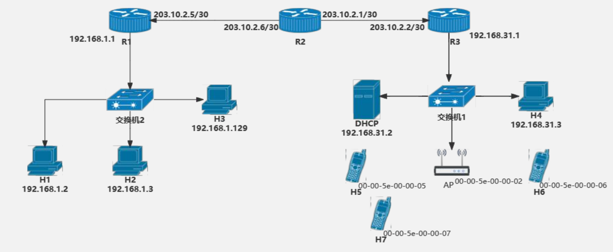
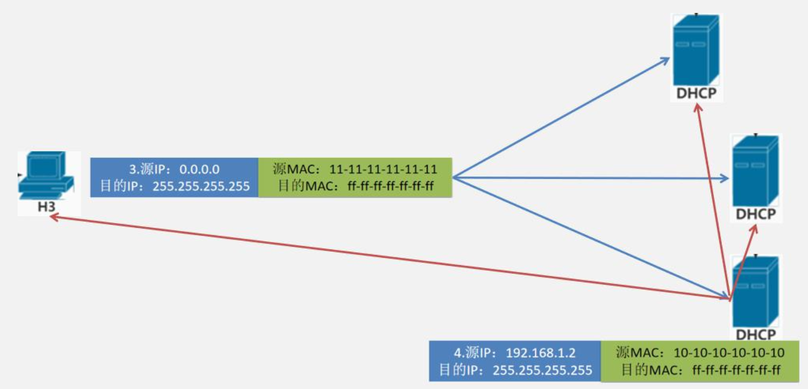
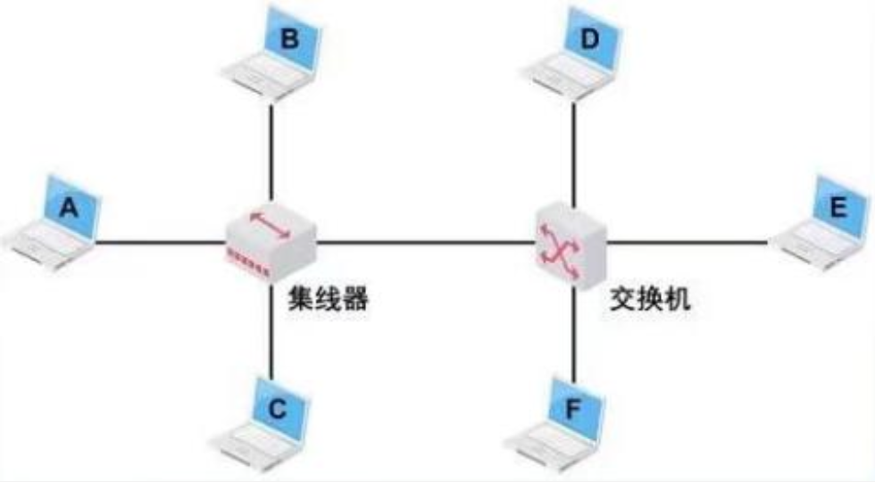
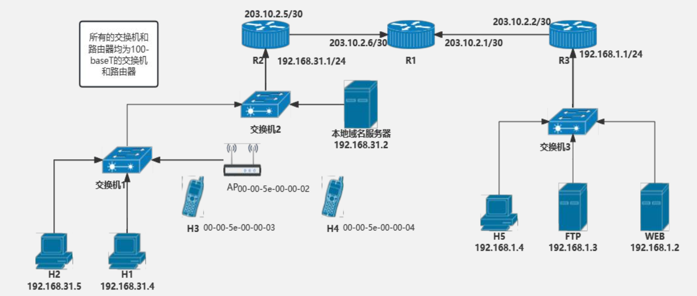
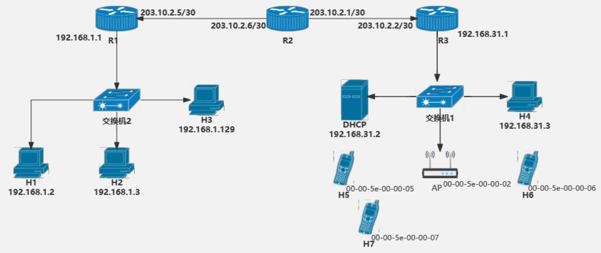
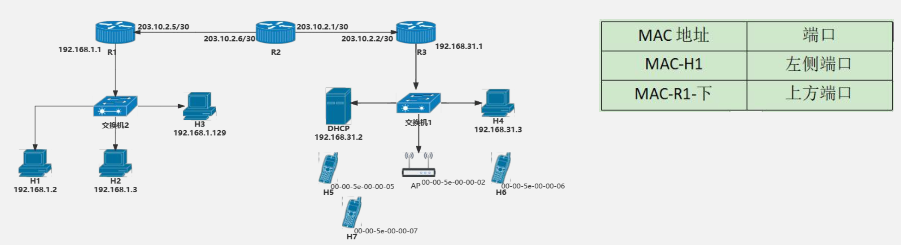
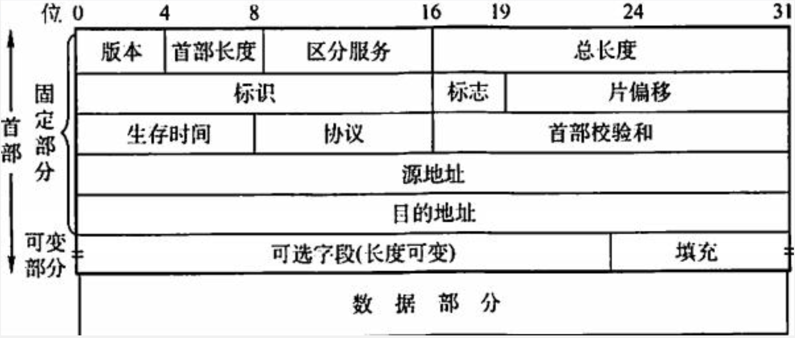

# IP+局域网

## 从入网到发送第一个报文

&emsp;&emsp;&ensp;本节课的目标是研究从主机发出第一个帧开始，在链路中的**网络层**会接触到哪些协议。

&emsp;&emsp;&ensp;在 ${408}$ 中，一台设备接入以太网一定是先经过 ${DHCP}$ 协议来获取 ${IP}$ 地址。该协议在 ${2015}$ 年计网大题，和计网选择题中均有出现。所以该部分需要大家必须记住每一个细节。

## DHCP完整流程

&emsp;&emsp;&ensp;当电脑与网络连接时，没有 ${IP}$ 地址他就不能做任何事情（例如下载一个 ${Web}$ 网页）。所以，电脑在入网前的第一个协议是 ${DHCP}$ 协议。

&emsp;&emsp;&ensp;当主机 ${H4}$ 刚接入网络时，通过 ${DHCP}$ 协议获取 ${IP}$ 地址 ${DHCP}$ 服务器和 ${DHCP}$ 客户端的交换过程如下：

1) ${H4}$ 先将 ${DHCP\space Discover}$ 报文封装在一个**源端口为 ${68}$，目的端口为 ${67}$ 的 ${UDP}$ 报文中**。该 ${UDP}$ 报文封装在一个源地址为 ${0.0.0.0}$，目的地址为 ${255.255.255.255}$ 的 ${IP}$ 数据报中。
2) ${DHCP}$ 服务器收到“${DHCP\space Discover}$"消息后，广播“${DHCP\space Offer}$”消息，其中包括提供给 ${DHCP}$ 客户机的IP地址。源地址为 ${DHCP}$ 服务器地址，目的地址为 ${255.255.255.255}$。
3) ${DHCP}$ 客户机收到“${DHCP\space Offer}$”消息，如果接受该IP地址，那么就广播“${DHCP\space Request}$” 消息向 ${DHCP}$ 服务器请求提供 ${IP}$ 地址。源地址为 ${0.0.0.0}$，目的地址为 ${255.255.255.255}$。
4) ${DHCP}$ 服务器广播“${DHCP\space ACKnowledge}$"消息，将 ${IP}$ 地址分配给 ${DHCP}$ 客户机。源地址为 ${DHCP}$ 服务器地址，目的地址为 ${255.255.255.255}$。并且此报文中**包含 ${DNS}$ 服务器地址、网关服务器 ${IP}$ 地址、子网掩码**。

&emsp;&emsp;&ensp;因为局域网中的 ${DHCP}$ **不一定只有一个**，所以 ${DHCP}$ 协议中的目的 ${IP}$ 地址**均为广播地址**。这样除了已经选择的 ${DHCP}$ 服务器能收到，局域网中的其他 ${DHCP}$ 服务器也都能收到这条数据。

## 交换机的自学习算法

&emsp;&emsp;&ensp;自学习算法是 ${408}$ 计网考试范围中，与“${TCP}$/${IP}$/以太网”这一体系相关的题目中，非常喜欢考察的一个点。这个点除了可以单独出题外，还可以与很多其他的问题结合出题。
&emsp;&emsp;&ensp;比如与 ${ARP}$ 协议结合，考察经过一次 ${ARP}$ 请求帧和 ${ARP}$ 确认帧（返回帧）后的**交换机转发表中的表项都有哪些**。或者结合一次发送和接收 ${IP}$ 数据报后，交换机转发表中的**数据有什么变化，以及哪些端口会收到哪些数据等**。
&emsp;&emsp;&ensp;创新点 ${1}$：**交换机转发表结合 ${ARP}$ 协议，考察转发表的内容**。
&emsp;&emsp;&ensp;网络拓扑如下图所示，假设交换机当前已学习到了主机 ${E}$ 的 ${MAC}$ 地址，主机 ${A}$ 给 ${E}$ 发送 ${ARP}$ 请求报文，主机 ${E}$ 收到后给主机 ${A}$ 发送 ${ARP}$ 响应报文。则能收到 ${ARP}$ 请求报文和 ${ARP}$ 响应报文的主机数量分别为 ${(5,3)}$。

&emsp;&emsp;&ensp;创新点 ${2}$：**直通式与存储转发式交换机的区别**。
&emsp;&emsp;&ensp;直通式交换机**只检查目的 ${mac}$ 地址**，存储转发式交换机需要把整个帧存入高速缓存并进行 ${CRC}$ 检验在转发。存储转发式交换机由于具有**存储功能**，它可以从链路层收到数据后，将收到的帧转换成另一种链路层帧的格式发送。所以存储转发式交换机**可以连接两个不同的链路层网络**，但直通式交换机就不可以。

&emsp;&emsp;&ensp;注意：直通式交换机由于存在少部分延迟，容易与 ${CSMA/CD}$ 协议配合储体考察最远距离问题。
&emsp;&emsp;&ensp;创新点 ${3}$：**直通式交换机结合 ${CSMA/CD}$ 协议**。
&emsp;&emsp;&ensp;若局域网内主机 ${H1}$ 向 ${H2}$ 发送以太网帧 ${N1，N1}$ 的大小为 ${64B}$，且不考虑以太网帧的前导码，信号传播速率为 ${200m/us}$，交换机 ${1}$ 为直通式交换机。则 ${H1}$ 与 ${H2}$ 理论上的最远距离为？若 ${N1}$ 的帧长扩大为原来的 ${2}$ 倍，则 ${H1}$ 与 ${H2}$ 之间理论上的最远距离如何变化？（${D}$）
A. 最远距离为 ${512m}$；${H1}$ 与 ${H2}$ 的最远距离增加 ${512m}$；
B. 最远距离为 ${512m}$；${H1}$ 与 ${H2}$ 的最远距离减少 ${512m}$；
C. 最远距离为 ${416m}$；${H1}$ 与 ${H2}$ 的最远距离减少 ${512m}$；
D. 最远距离为 ${416m}$；${H1}$ 与 ${H2}$ 的最远距离增加 ${512m}$；

## 关于校验的一些细节思考

&emsp;&emsp;&ensp;首先，对于一个以太网帧。只要其经过路由器的转发，或者被设备接收。则该以太网帧**一定要经过 ${CRC}$ 算法检验**。只有通过检验后的以太网帧才能被路由器转发或被主机接收。但网络层的部分，却**还需要校验 ${IP}$ 头部**。传输层部分（假设是 ${TCP}$ 报文）还要对 ${TCP}$ 首部和数据部分做校验。本节就是对这个细节进行深入思考。

1. 当路由器或主机在接收到一个以太网帧时，其网卡先将以太网帧接收，并先对帧进行 ${CRC}$ 校验。在经过 ${CRC}$ 校验后的帧，**会被去掉帧的地址字段和控制字段**。将数据部分传给主机或路由器的内存，也就是上交到网络层。

2. 数据部分交到内存的部分，大多数是通过 **${DMA}$ 方式将网卡外设中的数据传递给主存**。实际上就是将 ${IP}$ 数据报从网卡外设送到内存中。但 ${DMA}$ 方式万一在数据传递过程中出现问题，那么虽然这个帧经过了 ${CRC}$ 校验，但**其数据部分由于 ${DMA}$ 的传输，仍造成了数据错误**。

&emsp;&emsp;&ensp;而对于已经保存到内存的 ${IP}$ 数据报进行校验，分成了对**头部校验**和对**数据部分**校验。先对 ${IP}$ 数据报头部校验，**只有通过校验后，数据部分才会被分配到对应的进程中**（这部分数据也就是 ${TCP}$ 报文）。**进程**在继续对收到的 ${TCP}$ 报文段进行**数据校验**。若 ${IP}$ 头部出错，则**直接丢弃整个 ${IP}$ 数据报**。

## 指数退避算法

&emsp;&emsp;&ensp;在链路层。不论是以太网帧，还是 ${802.11}$ 无线局域网帧。**一旦出现帧的冲突，则就需要对帧进行重传**。重传的方式就是采用指数退避算法。该算法就是解决帧冲突后，经过多长时间在进行重传的问题。

1) 确定基本退避时间，一般取两倍的总线**端到端传播时延 ${2t}$（即争用期）**。
2) 定义参数 ${k}$，它等于重传次数，但 ${k}$ 不超过 ${10}$，即 ${k=min[重传次数, 10]}$。当重传次数不超过 ${10}$ 时，${k}$ 等于重传次数；当重传次数大于 ${10}$ 时，${k}$ 就不再增大而一直等于 ${10}$。
3) 从离散的整数集合 ${[0,1,\dots ,2^{k-1}]}$ 中随机取出一个数 ${r}$，重传所需要退避的时间就是 ${r}$ 倍的基本退避时间，即 ${2rt}$。
4) 当重传达 ${16}$ 次仍不能成功时，说明网络太拥挤，认为此帧永远无法正确发出，抛弃此帧并向高层报告出错。

&emsp;&emsp;&ensp;若交换机 ${2}$ 属于 ${100Base-T}$ 直通交换机，则此 ${IP}$ 数据报 ${A}$ 所在的帧经过交换机 ${2}$ 时，交换机 ${2}$ 检测该帧消耗的最短时长是多少？若交换机 ${2}$ 信号传播速度为 ${200m/us}$ 则 ${H1}$ 到 ${R1}$ 理论上的最长距离为多少？假设报文 ${A}$ 此前已经历了 ${4}$ 次重传，则若发生了第 ${5}$ 次重传，则其退避的时间范围是多少？

&emsp;&emsp;&ensp;${0.48µs，416m，0µs-158.72µs}$

## ARP协议

1. 若 ${H1，H2，H3}$ 的 ${ARP}$ 转发表为空，交换机 ${2}$ 的链路层转发表为空，则若 ${H1}$ 给 ${H4}$ 发送一个 ${IP}$ 数据报，则哪些主机能收到 ${H1}$ 发出的 ${ARP}$ 请求帧？收到该请求帧后，发出的 ${ARP}$ 返回帧的源 ${MAC}$ 地址和目的 ${MAC}$ 地址分别是多少？主机 ${H1，H2，H3}$ 会收到 ${H1}$ 发出的 ${ARP}$ 请求帧。${ARP}$ 返回帧的源 ${MAC}$ 地址为 ${MAC-R1-下}$，目的 ${MAC}$ 地址为 ${MAC-H1}$。
2. ${H1}$ 收到 ${ARP}$ 返回帧后，发送 ${IP}$ 数据报的目的 ${IP}$ 地址和目的 ${MAC}$ 地址分别是多少？${IP}$ 数据报 ${A}$ 经过交换机 ${2}$ 后会转发给哪些机器？此时交换机 ${2}$ 的链路层转发表里有哪些表项？

&emsp;&emsp;&ensp;${目的IP：203.10.2.2}$，${目的MAC：MAC-R1-下}$；数据报 ${A}$ 经过交换机 ${2}$ 后会转发给 ${R1}$。

## IP数据包分片

&emsp;&emsp;&ensp;由于并不是所有链路层协议都能承载相同长度的网络层分组。例如，以太网帧能够承载不超过 ${1500}$ 字节的数据，而某些广域网链路的帧可承载不超过 ${576}$ 字节的数据。一个链路层帧能承载的最大数据量叫做**最大传送单元**。因为每个 ${IP}$ 数据报封装在链路层帧中从一台路由器传输到下一台路由器，故**链路层协议的 ${MTU}$ 严格地限制着 ${IP}$ 数据报的长度**。其考点主要有：

1. 分片后 ${IP}$ 头部字段的改变：
    **总长度**：占 ${16}$ 位。指首部和数据之和的长度。以太网帧的最大传送单元（${MTU}$）为 ${1500B}$，因此当一个 ${IP}$ 数据报封装成帧时，数据报的总长度（首部加数据）一定不能超过下面的数据链路层的 ${MTU}$ 值。修改字段为：**生存时间，总长度，片偏移，标志，首部校验和**。

2. 分片大小的确定：此处需注意有 ${3}$ 点
   1. 分组数据部分大小必须是 ${8}$ 的整数倍
   2. 分组标志字段的修改
   3. 和 ${ICMP}$ 协议联动考察选择

&emsp;&emsp;&ensp;${IP}$ 数据报 ${A}$ 的大小为 ${1400B}$，${H1}$ 至 ${r1}$ 之间链路的 ${MTU}$ 为 ${1500B}$，则该 ${IP}$ 数据报经过 ${r1}$ 后，其 ${IP}$ 数据报头部哪些字段会修改？经过 ${r1}$ 转发后，${IP}$ 数据报 ${A}$ 的源 ${IP}$ 和目的 ${IP}$ 分别是多少？${A}$ 的源 ${MAC}$ 地址和目的 ${MAC}$ 地址是多少（${r1}$ 的 ${ARP}$ 转发表已经收敛）？
&emsp;&emsp;&ensp;${源IP}$，${TTL}$，首部校验和；
&emsp;&emsp;&ensp;${源IP:203.10.2.5}$，${目的IP:203.10.2.2}$
&emsp;&emsp;&ensp;${源MAC:MAC-r1-右侧}$，${目的MAC:MAC-r2-左侧}$；

## ICMP报文

&emsp;&emsp;&ensp;注意点：

1. 能把错误信息和 ${ICMP}$ 报文**相对应**
2. 什么时候不发 ${ICMP}$ 报文（**易与 ${IP}$ 分组联动**）

&emsp;&emsp;&ensp;不应发送 ${ICMP}$ 差错报告报文的几种情况如下：

1) 对 **${ICMP}$ 差错报告报文**不再发送 ${ICMP}$ 差错报告报文。
2) 对第一个分片的数据报片的**所有后续数据报片**都不发送 ${ICMP}$ 差错报告报文。
3) 对**具有组播地址的数据报**都不发送 ${ICMP}$ 差错报告报文。
4) 对具有**特殊地址**（如 ${127.0.0.0}$ 或 ${0.0.0.0}$）的数据报不发送 ${ICMP}$ 差错报告报文。

&emsp;&emsp;&ensp;${ICMP}$ 差错报告报文用于目标主机或到目标主机路径上的路由器向源主机报告差错和异常情况。共有以下 ${5}$ 种类型：

1) **终点不可达**。当路由器或主机**不能交付数据报**时就向源点发送终点不可达报文。
2) **源点抑制**。当路由器或主机**由于拥塞**而丢弃数据报时，就向源点发送源点抑制报文，使源点知道应当把数据报的发送速率放慢。
3) **时间超过**。当路由器收到生存时间（${TTL}$）为 ${1}$ 的数据报时，将 ${TTL}$ 字段 ${-1}$ 变为 ${0}$。**除丢弃该数据报外，还要向源点发送时间超过报文**。当终点在预先规定的时间内不能收到一个数据报的全部数据报片时，就把已收到的数据报片都丢弃，并向源点发送时间超过报文。
4) **参数问题**。当路由器或目的主机收到的数据报的**首部中有的字段的值不正确时**，就丢弃该数据报，并向源点发送参数问题报文。
5) **改变路由（重定向）**。路由器把**改变路由报文发送给主机**，让主机知道下次应将数据报发送给另外的路由器。

&emsp;&emsp;&ensp;若 ${R2}$ 的 ${MTU}$ 为 ${750B}$，则数据报 ${A}$ 经过 ${R2}$ 分片后，每个分片的大小为多少？该分片操作会引起IP数据报头部的哪些字段会因此改变？假设 ${A}$ 在到达 ${R2}$ 前 ${TTL}$ 字段已经为 ${1}$，则到达 ${R2}$ 后，${R2}$ 会给 ${H1}$ 发送哪种类型的 ${ICMP}$ 报文？ 会发送多少个 ${ICMP}$ 报文？
&emsp;&emsp;&ensp;${748B}$ 的 ${IP}$ 数据报 ${A1}$ 和 ${672B}$ 的数据报 ${A2}$；
&emsp;&emsp;&ensp;${A1}$ 的总长度，${TTL}$，首部校验和，${MF\space A2}$ 的总长度， ${TTL}$ ，首部校验和会发送一个时间超时 ${ICMP}$ 报文。

