# IP+局域网

## 从入网到发送第一个报文

&emsp;&emsp;&ensp;本节课的目标是研究从主机发出第一个帧开始，在链路中的**网络层**会接触到哪些协议。

&emsp;&emsp;&ensp;在 ${408}$ 中，一台设备接入以太网一定是先经过 ${DHCP}$ 协议来获取 ${IP}$ 地址。该协议在 ${2015}$ 年计网大题，和计网选择题中均有出现。所以该部分需要大家必须记住每一个细节。

## DHCP完整流程

&emsp;&emsp;&ensp;当电脑与网络连接时，没有 ${IP}$ 地址他就不能做任何事情（例如下载一个 ${Web}$ 网页）。所以，电脑在入网前的第一个协议是 ${DHCP}$ 协议。

&emsp;&emsp;&ensp;当主机 ${H4}$ 刚接入网络时，通过 ${DHCP}$ 协议获取 ${IP}$ 地址 ${DHCP}$ 服务器和 ${DHCP}$ 客户端的交换过程如下：

1） ${H4}$ 先将 ${DHCP\space Discover}$ 报文封装在一个**源端口为 ${68}$，目的端口为 ${67}$ 的 ${UDP}$ 报文中**。该 ${UDP}$ 报文封装在一个源地址为 ${0.0.0.0}$，目的地址为 ${255.255.255.255}$ 的 ${IP}$ 数据报中。
2） ${DHCP}$ 服务器收到“${DHCP\space Discover}$"消息后，广播“${DHCP\space Offer}$”消息，其中包括提供给 ${DHCP}$ 客户机的IP地址。源地址为 ${DHCP}$ 服务器地址，目的地址为 ${255.255.255.255}$。
3） ${DHCP}$ 客户机收到“${DHCP\space Offer}$”消息，如果接受该IP地址，那么就广播“${DHCP\space Request}$” 消息向 ${DHCP}$ 服务器请求提供 ${IP}$ 地址。源地址为 ${0.0.0.0}$，目的地址为 ${255.255.255.255}$。
4） ${DHCP}$ 服务器广播“${DHCP\space ACKnowledge}$"消息，将 ${IP}$ 地址分配给 ${DHCP}$ 客户机。源地址为 ${DHCP}$ 服务器地址，目的地址为 ${255.255.255.255}$。并且此报文中**包含 ${DNS}$ 服务器地址、网关服务器 ${IP}$ 地址、子网掩码**。

&emsp;&emsp;&ensp;因为局域网中的 ${DHCP}$ **不一定只有一个**，所以 ${DHCP}$ 协议中的目的 ${IP}$ 地址**均为广播地址**。这样除了已经选择的 ${DHCP}$ 服务器能收到，局域网中的其他 ${DHCP}$ 服务器也都能收到这条数据。

## 交换机的自学习算法

&emsp;&emsp;&ensp;自学习算法是 ${408}$ 计网考试范围中，与“${TCP}$/${IP}$/以太网”这一体系相关的题目中，非常喜欢考察的一个点。这个点除了可以单独出题外，还可以与很多其他的问题结合出题。
&emsp;&emsp;&ensp;比如与 ${ARP}$ 协议结合，考察经过一次 ${ARP}$ 请求帧和 ${ARP}$ 确认帧（返回帧）后的**交换机转发表中的表项都有哪些**。或者结合一次发送和接收 ${IP}$ 数据报后，交换机转发表中的**数据有什么变化，以及哪些端口会收到哪些数据等**。
&emsp;&emsp;&ensp;创新点 ${1}$：**交换机转发表结合 ${ARP}$ 协议，考察转发表的内容**。
&emsp;&emsp;&ensp;网络拓扑如下图所示，假设交换机当前已学习到了主机 ${E}$ 的 ${MAC}$ 地址，主机 ${A}$ 给 ${E}$ 发送 ${ARP}$ 请求报文，主机 ${E}$ 收到后给主机 ${A}$ 发送 ${ARP}$ 响应报文。则能收到 ${ARP}$ 请求报文和 ${ARP}$ 响应报文的主机数量分别为 ${（5，3）}$。

&emsp;&emsp;&ensp;创新点 ${2}$：**直通式与存储转发式交换机的区别**。
&emsp;&emsp;&ensp;直通式交换机**只检查目的 ${mac}$ 地址**，存储转发式交换机需要把整个帧存入高速缓存并进行 ${CRC}$ 检验在转发。存储转发式交换机由于具有**存储功能**，它可以从链路层收到数据后，将收到的帧转换成另一种链路层帧的格式发送。所以存储转发式交换机**可以连接两个不同的链路层网络**，但直通式交换机就不可以。

&emsp;&emsp;&ensp;注意：直通式交换机由于存在少部分延迟，容易与 ${CSMA/CD}$ 协议配合储体考察最远距离问题。
&emsp;&emsp;&ensp;创新点 ${3}$：**直通式交换机结合 ${CSMA/CD}$ 协议**。
&emsp;&emsp;&ensp;若局域网内主机 ${H1}$ 向 ${H2}$ 发送以太网帧 ${N1，N1}$ 的大小为 ${64B}$，且不考虑以太网帧的前导码，信号传播速率为 ${200m/us}$，交换机 ${1}$ 为直通式交换机。则 ${H1}$ 与 ${H2}$ 理论上的最远距离为？若 ${N1}$ 的帧长扩大为原来的 ${2}$ 倍，则 ${H1}$ 与 ${H2}$ 之间理论上的最远距离如何变化？（${D}$）
A. 最远距离为 ${512m}$；${H1}$ 与 ${H2}$ 的最远距离增加 ${512m}$；
B. 最远距离为 ${512m}$；${H1}$ 与 ${H2}$ 的最远距离减少 ${512m}$；
C. 最远距离为 ${416m}$；${H1}$ 与 ${H2}$ 的最远距离减少 ${512m}$；
D. 最远距离为 ${416m}$；${H1}$ 与 ${H2}$ 的最远距离增加 ${512m}$；

## 关于校验的一些细节思考

&emsp;&emsp;&ensp;首先，对于一个以太网帧。只要其经过路由器的转发，或者被设备接收。则该以太网帧**一定要经过 ${CRC}$ 算法检验**。只有通过检验后的以太网帧才能被路由器转发或被主机接收。但网络层的部分，却**还需要校验 ${IP}$ 头部**。传输层部分（假设是 ${TCP}$ 报文）还要对 ${TCP}$ 首部和数据部分做校验。本节就是对这个细节进行深入思考。

1. 当路由器或主机在接收到一个以太网帧时，其网卡先将以太网帧接收，并先对帧进行 ${CRC}$ 校验。在经过 ${CRC}$ 校验后的帧，**会被去掉帧的地址字段和控制字段**。将数据部分传给主机或路由器的内存，也就是上交到网络层。

2. 数据部分交到内存的部分，大多数是通过 **${DMA}$ 方式将网卡外设中的数据传递给主存**。实际上就是将 ${IP}$ 数据报从网卡外设送到内存中。但 ${DMA}$ 方式万一在数据传递过程中出现问题，那么虽然这个帧经过了 ${CRC}$ 校验，但**其数据部分由于 ${DMA}$ 的传输，仍造成了数据错误**。

&emsp;&emsp;&ensp;而对于已经保存到内存的 ${IP}$ 数据报进行校验，分成了对**头部校验**和对**数据部分**校验。先对 ${IP}$ 数据报头部校验，**只有通过校验后，数据部分才会被分配到对应的进程中**（这部分数据也就是 ${TCP}$ 报文）。**进程**在继续对收到的 ${TCP}$ 报文段进行**数据校验**。若 ${IP}$ 头部出错，则**直接丢弃整个 ${IP}$ 数据报**。

## 指数退避算法

&emsp;&emsp;&ensp;在链路层。不论是以太网帧，还是 ${802.11}$ 无线局域网帧。**一旦出现帧的冲突，则就需要对帧进行重传**。重传的方式就是采用指数退避算法。该算法就是解决帧冲突后，经过多长时间在进行重传的问题。

1） 确定基本退避时间，一般取两倍的总线**端到端传播时延 ${2t}$（即争用期）**。
2） 定义参数 ${k}$，它等于重传次数，但 ${k}$ 不超过 ${10}$，即 ${k=min[重传次数， 10]}$。当重传次数不超过 ${10}$ 时，${k}$ 等于重传次数；当重传次数大于 ${10}$ 时，${k}$ 就不再增大而一直等于 ${10}$。
3） 从离散的整数集合 ${[0，1，\dots ，2^{k-1}]}$ 中随机取出一个数 ${r}$，重传所需要退避的时间就是 ${r}$ 倍的基本退避时间，即 ${2rt}$。
4） 当重传达 ${16}$ 次仍不能成功时，说明网络太拥挤，认为此帧永远无法正确发出，抛弃此帧并向高层报告出错。

&emsp;&emsp;&ensp;若交换机 ${2}$ 属于 ${100Base-T}$ 直通交换机，则此 ${IP}$ 数据报 ${A}$ 所在的帧经过交换机 ${2}$ 时，交换机 ${2}$ 检测该帧消耗的最短时长是多少？若交换机 ${2}$ 信号传播速度为 ${200m/us}$ 则 ${H1}$ 到 ${R1}$ 理论上的最长距离为多少？假设报文 ${A}$ 此前已经历了 ${4}$ 次重传，则若发生了第 ${5}$ 次重传，则其退避的时间范围是多少？

&emsp;&emsp;&ensp;${0.48µs，416m，0µs-158.72µs}$

## ARP协议

1. 若 ${H1，H2，H3}$ 的 ${ARP}$ 转发表为空，交换机 ${2}$ 的链路层转发表为空，则若 ${H1}$ 给 ${H4}$ 发送一个 ${IP}$ 数据报，则哪些主机能收到 ${H1}$ 发出的 ${ARP}$ 请求帧？收到该请求帧后，发出的 ${ARP}$ 返回帧的源 ${MAC}$ 地址和目的 ${MAC}$ 地址分别是多少？主机 ${H1，H2，H3}$ 会收到 ${H1}$ 发出的 ${ARP}$ 请求帧。${ARP}$ 返回帧的源 ${MAC}$ 地址为 ${MAC-R1-下}$，目的 ${MAC}$ 地址为 ${MAC-H1}$。
2. ${H1}$ 收到 ${ARP}$ 返回帧后，发送 ${IP}$ 数据报的目的 ${IP}$ 地址和目的 ${MAC}$ 地址分别是多少？${IP}$ 数据报 ${A}$ 经过交换机 ${2}$ 后会转发给哪些机器？此时交换机 ${2}$ 的链路层转发表里有哪些表项？

&emsp;&emsp;&ensp;${目的IP：203.10.2.2}$，${目的MAC：MAC-R1-下}$；数据报 ${A}$ 经过交换机 ${2}$ 后会转发给 ${R1}$。

## IP数据包分片

&emsp;&emsp;&ensp;由于并不是所有链路层协议都能承载相同长度的网络层分组。例如，以太网帧能够承载不超过 ${1500}$ 字节的数据，而某些广域网链路的帧可承载不超过 ${576}$ 字节的数据。一个链路层帧能承载的最大数据量叫做**最大传送单元**。因为每个 ${IP}$ 数据报封装在链路层帧中从一台路由器传输到下一台路由器，故**链路层协议的 ${MTU}$ 严格地限制着 ${IP}$ 数据报的长度**。其考点主要有：

1. 分片后 ${IP}$ 头部字段的改变：
    **总长度**：占 ${16}$ 位。指首部和数据之和的长度。以太网帧的最大传送单元（${MTU}$）为 ${1500B}$，因此当一个 ${IP}$ 数据报封装成帧时，数据报的总长度（首部加数据）一定不能超过下面的数据链路层的 ${MTU}$ 值。修改字段为：**生存时间，总长度，片偏移，标志，首部校验和**。

2. 分片大小的确定：此处需注意有 ${3}$ 点
   1. 分组数据部分大小必须是 ${8}$ 的整数倍
   2. 分组标志字段的修改
   3. 和 ${ICMP}$ 协议联动考察选择

&emsp;&emsp;&ensp;${IP}$ 数据报 ${A}$ 的大小为 ${1400B}$，${H1}$ 至 ${r1}$ 之间链路的 ${MTU}$ 为 ${1500B}$，则该 ${IP}$ 数据报经过 ${r1}$ 后，其 ${IP}$ 数据报头部哪些字段会修改？经过 ${r1}$ 转发后，${IP}$ 数据报 ${A}$ 的源 ${IP}$ 和目的 ${IP}$ 分别是多少？${A}$ 的源 ${MAC}$ 地址和目的 ${MAC}$ 地址是多少（${r1}$ 的 ${ARP}$ 转发表已经收敛）？
&emsp;&emsp;&ensp;${源IP}$，${TTL}$，首部校验和；
&emsp;&emsp;&ensp;${源IP:203.10.2.5}$，${目的IP:203.10.2.2}$
&emsp;&emsp;&ensp;${源MAC:MAC-r1-右侧}$，${目的MAC:MAC-r2-左侧}$；

## ICMP报文

&emsp;&emsp;&ensp;注意点：

1. 能把错误信息和 ${ICMP}$ 报文**相对应**
2. 什么时候不发 ${ICMP}$ 报文（**易与 ${IP}$ 分组联动**）

&emsp;&emsp;&ensp;不应发送 ${ICMP}$ 差错报告报文的几种情况如下：

1） 对 **${ICMP}$ 差错报告报文**不再发送 ${ICMP}$ 差错报告报文。
2） 对第一个分片的数据报片的**所有后续数据报片**都不发送 ${ICMP}$ 差错报告报文。
3） 对**具有组播地址的数据报**都不发送 ${ICMP}$ 差错报告报文。
4） 对具有**特殊地址**（如 ${127.0.0.0}$ 或 ${0.0.0.0}$）的数据报不发送 ${ICMP}$ 差错报告报文。

&emsp;&emsp;&ensp;${ICMP}$ 差错报告报文用于目标主机或到目标主机路径上的路由器向源主机报告差错和异常情况。共有以下 ${5}$ 种类型：

1） **终点不可达**。当路由器或主机**不能交付数据报**时就向源点发送终点不可达报文。
2） **源点抑制**。当路由器或主机**由于拥塞**而丢弃数据报时，就向源点发送源点抑制报文，使源点知道应当把数据报的发送速率放慢。
3） **时间超过**。当路由器收到生存时间（${TTL}$）为 ${1}$ 的数据报时，将 ${TTL}$ 字段 ${-1}$ 变为 ${0}$。**除丢弃该数据报外，还要向源点发送时间超过报文**。当终点在预先规定的时间内不能收到一个数据报的全部数据报片时，就把已收到的数据报片都丢弃，并向**源点发送时间超过报文**。共两种情况。
4） **参数问题**。当路由器或目的主机收到的数据报的**首部中有的字段的值不正确时**，就丢弃该数据报，并向源点发送参数问题报文。
5） **改变路由（重定向）**。路由器把**改变路由报文发送给主机**，让主机知道下次应将数据报发送给另外的路由器。

&emsp;&emsp;&ensp;若 ${R2}$ 的 ${MTU}$ 为 ${750B}$，则数据报 ${A}$ 经过 ${R2}$ 分片后，每个分片的大小为多少？该分片操作会引起 ${IP}$ 数据报头部的哪些字段会因此改变？假设 ${A}$ 在到达 ${R2}$ 前 ${TTL}$ 字段已经为 ${1}$，则到达 ${R2}$ 后，${R2}$ 会给 ${H1}$ 发送哪种类型的 ${ICMP}$ 报文？ 会发送多少个 ${ICMP}$ 报文？
&emsp;&emsp;&ensp;${748B}$ 的 ${IP}$ 数据报 ${A1}$ 和 ${672B}$ 的数据报 ${A2}$；
&emsp;&emsp;&ensp;${A1}$ 的总长度，${TTL}$，首部校验和，${MF\space A2}$ 的总长度， ${TTL}$ ，首部校验和会发送一个时间超时 ${ICMP}$ 报文。

### NAT协议

&emsp;&emsp;&ensp;${NAT}$ 协议最需要注意的两个点：

1. ${NAT}$ 协议需要注意，在路由器进行转发时，需要注意**什么时候修改源 ${IP}$，什么时候修改目的 ${IP}$**。
2. 若路由器本身运行 ${NAT}$ 协议，并且需要对 ${IP}$ 数据报分片。在**分片时候 ${IP}$ 首部的修改**。

&emsp;&emsp;&ensp;当 ${IP}$ 数据报 ${A}$ 的所有分片经过 ${R3}$ 后，其源 ${IP}$ 和目的 ${IP}$ 分别改为多少？
${源IP:203.10.2.5}$，${目的IP:192.168.31.3}$

### 关于配置错误网关的分析

&emsp;&emsp;&ensp;这一类问题主要考察你是否能判断出**源主机和目的主机是否在同一个子网内**。并且要知道在**相同子网内部**数据是如何转发，以及源主机和目的主机在不同子网中时，数据如何转发。
&emsp;&emsp;&ensp;若源主机和目的主机**在同一个子网中时**，${IP}$ 数据报**不需要经过网关转发**，而是可以直接发送给目的主机。
&emsp;&emsp;&ensp;若源主机和目的主机**并不在同一个子网中**，源主机根据子网掩码判断出目的主机并不与自己在同一个子网内，则源主机会将 ${IP}$ 数据报所在的**链路层帧的目的 ${MAC}$ 地址改为路由器，让路由器代为转发**。
&emsp;&emsp;&ensp;若 ${H1，H2，H3}$ 的子网掩码均为 ${255.255.255.128}$，${H2}$ 的默认网关为 ${192.168.1.100}$，则 ${H2}$ 是否可给 ${H1}$ 发送 ${IP}$ 数据报？${H2}$ 是否可以给 ${H3}$ 发送 ${IP}$ 数据报？${H2}$ 是否会把数据报成功发送给默认网关？
&emsp;&emsp;&ensp;${H2}$ 可以给 ${H1}$ 发 ${IP}$ 数据报，${H2}$ 无法给 ${H3}$ 发 ${IP}$ 数据报，**无法成功发送到默认网关**。

## 冲突域和广播域数量判断

&emsp;&emsp;&ensp;对于冲突域和广播域的问题，其本质考察的是你是否对计算机网络中，物理层，链路层，网络层的设备，也就是集线器（中继器），交换机，路由器的性质足够了解。
&emsp;&emsp;&ensp;集线器和中继器：不能分割冲突域和广播域。
&emsp;&emsp;&ensp;交换机：可以分割冲突域，不能分割广播域。
&emsp;&emsp;&ensp;路由器：既可以分割冲突域，也可以分割广播域。

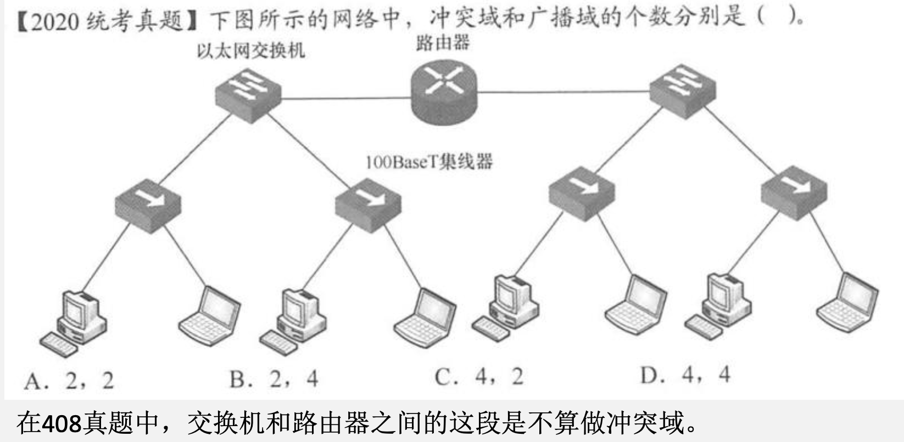

&emsp;&emsp;&ensp;在前几个小问的基础上，请问 ${r1}$ 所在的局域网 ${192.168.1.0/24}$ 中有多少个广播？多少个冲突域？
&emsp;&emsp;&ensp;两个广播域，三个冲突域。

### 生成路由转发表

&emsp;&emsp;&ensp;写出 ${R1}$ 将 ${IP}$ 数据报 ${A}$ 转发到目标主机后的路由转发表（包括目的网络，子网掩码，下一跳），并且让转发表的表项尽可能的短。

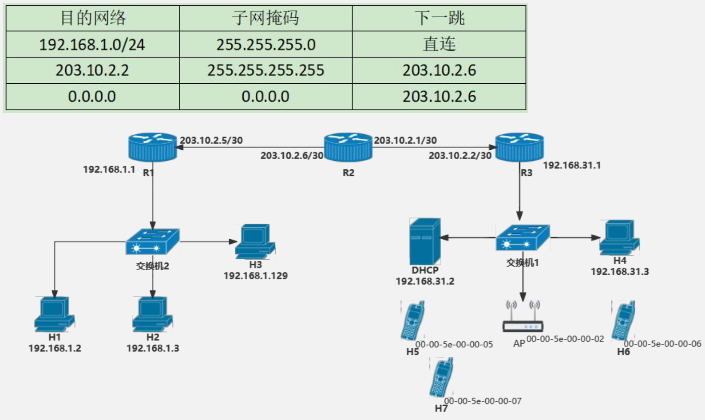

### 二进制网络报文的小技巧

&emsp;&emsp;&ensp;在 ${2012}$ 年，计网中考察了一种方式，就是给出报文的二进制形式，根据二进制的内容回答问题。此类题目要求同学们首先是熟练掌握以太网帧格式，${IP}$ 首部格式以及 ${TCP}$ 首部格式。虽然题目会给出首部字段的格式，但如果我们查询首部字段，那么做题速度会很慢。这里会给大家总结一些小技巧。

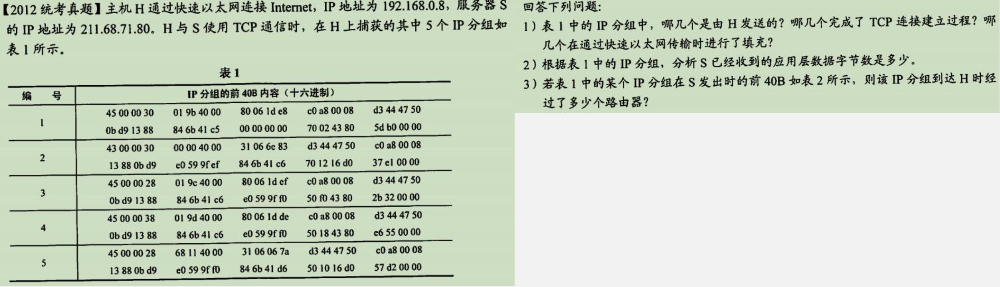

&emsp;&emsp;&ensp;**技巧 ${1}$**：若想知道该数据报的总长度，要查看 ${IP}$ 数据的总长度。因为 ${TCP}$ 并没有总长度字段。若要查看 ${TCP}$ 是否携带数据，则不能只看到 ${IP}$ 总长度字段不是 ${40}$ 就判断出携带数据了。因为 ${TCP}$ 的头部还有可选字段，要结合 ${TCP}$ 的数据偏移字段**才能断定是否携带数据**。

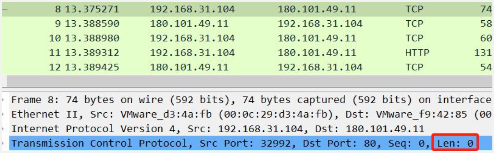

&emsp;&emsp;&ensp;虽然在 ${wireshark}$ 中，传输层部分的 ${len}$ 是 ${0}$，但实际上并不等于 ${IP}$ 数据报的大小就是 ${40B}$，因为可能 ${TCP}$ 有偏移。
&emsp;&emsp;&ensp;虽然这个 ${TCP}$ 报文段并没有携带数据，但是其数据偏移部分是 ${a}$，也就是 ${10}$。所以 ${TCP}$ 报文段的大小是 ${40B}$。整个 ${IP}$ 的总长度部分是 ${60}$，${TCP}$ 头部占 ${40}$。

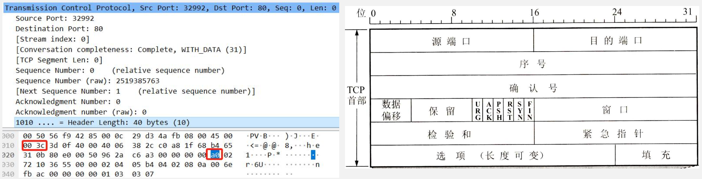

&emsp;&emsp;&ensp;数据偏移占 ${4}$ 位，它指出 ${TCP}$ 报文段的数据起始处距离 ${TCP}$ 报文段的起始处有多远。这个字段实际上是指出 ${TCP}$ 报文段的**首部长度**，首部中还会**包含长度不确定的选项字段**。“数据偏移”的单位是 ${32}$ 位字（即以 ${4}$ 字节长的字为计算单位）。
&emsp;&emsp;&ensp;**技巧 ${2}$**：若判断该数据报携带的 ${TCP}$ 报文是传送数据还是建立链接，则要看是否有两个 ${SYN}$ 字段为 ${1}$ 的报文。若存在两个连续的报文段，其 ${SYN=1}$，则可以判断出题目中大概率存在 ${TCP}$ 建立链接的过程。

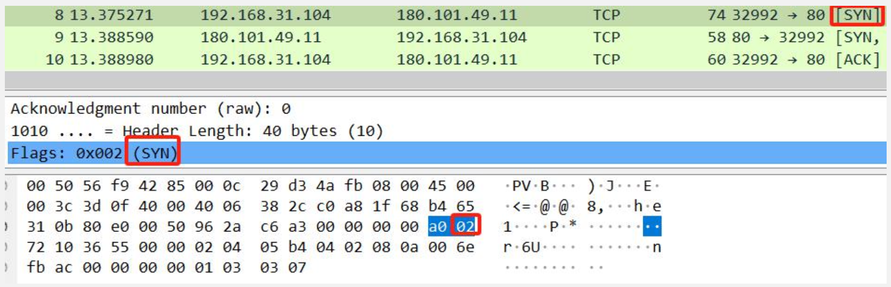

&emsp;&emsp;&ensp;**技巧 ${3}$**：对于发送方或接收方**收到了多少数据**，重点看数据传输阶段的**最后一条报文的 ${ACK}$**。比如在第 ${12}$ 号报文中，${ACK}$ 为 ${78}$，代表 ${77B}$ 的数据已发送。

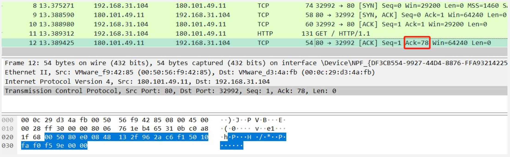

## 移动IP

&emsp;&emsp;&ensp;主机 ${A}$ 进入外部网络（江苏）后：

1. 注册转交地址：在外部代理注册一个转交地址，${11.0.1.5}$ 离开时注销。
2. 登记转交地址：外部代理（江苏）向本地代理登记转交地址，本地代理（上海）记录主机 ${A}$ 的临时 ${IP}$ 地址。

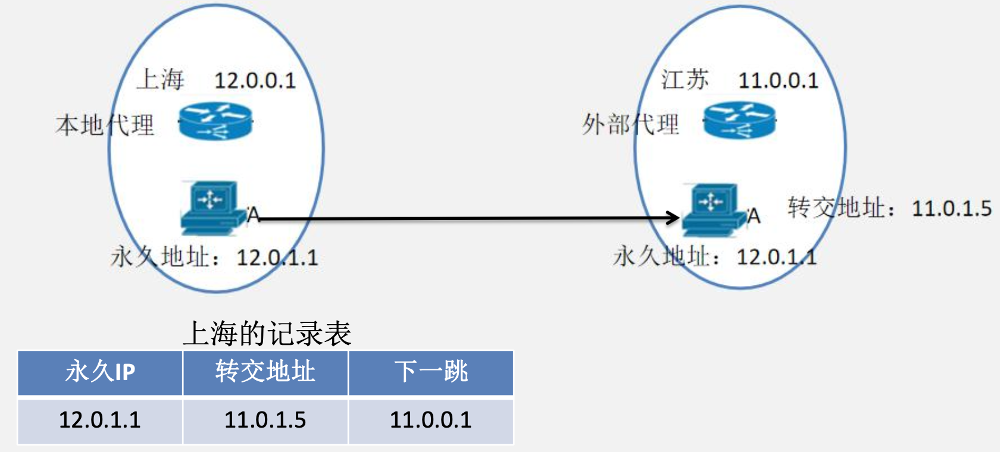

&emsp;&emsp;&ensp;主机 ${B}$ 向主机 ${A}$ 发送数据报，这里的主机 ${B}$ 是任意主机此时主机 ${A}$ 处于外部网络中。**此时 ${B}$ 的目的 ${IP}$ 地址仍然是 ${12.0.1.1}$**。

1. 截获数据报：本地代理（上海）截获数据报;
2. 封装数据报：本地代理再封装数据报，新的数据报的目的地址是转交地址（${11.0.1.5}$），发送给外部代理（江苏）。
3. 拆封数据报：外部代理拆封数据报，目的 ${IP}$ 改成 ${A}$ 的永久 ${IP}$，发给主机 ${A}$。

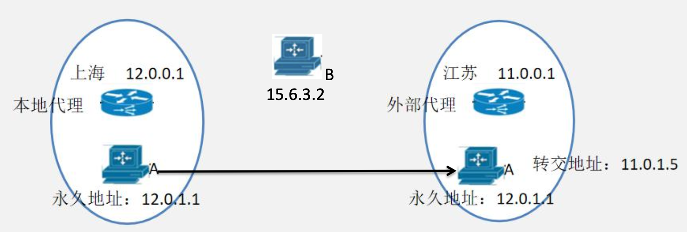

&emsp;&emsp;&ensp;主机 ${A}$ 向主机 ${B}$ 发送 ${IP}$ 数据报：
&emsp;&emsp;&ensp;直接发送即可，${IP}$ 数据报的源地址设置成 ${A}$ 的永久地址，目的地址是主机 ${B}$ 的永久地址。

&emsp;&emsp;&ensp;注意:这个 ${IP}$ 数据报就不需要先发送到主机 ${A}$ 的本地代理上，**由 ${A}$ 的本地代理代为转发**。
&emsp;&emsp;&ensp;两个较远移动主机之间的通讯模型：

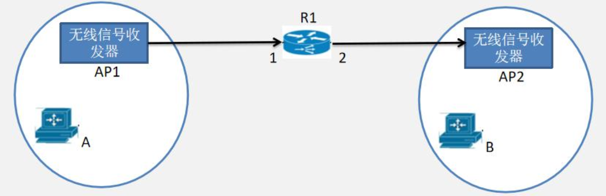

&emsp;&emsp;&ensp;同一站点范围内两个移动主机之间通讯模型：

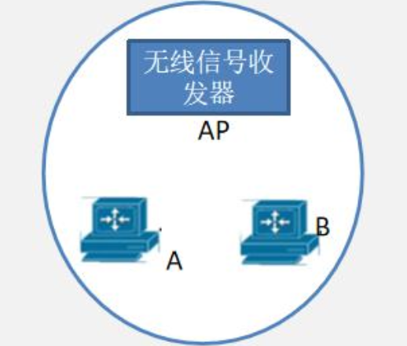

&emsp;&emsp;&ensp;若 ${H5，H6，H7，AP}$ 采用 ${CSMA/CA}$ 的 ${802.11}$ 协议通信，${DIFS=128us}$，${SIFS}$ 固定为 ${28us}$，${RTS，CTS}$ 和 ${ACK}$ 帧的传输时延分别是 ${3us，2us}$ 和 ${2us}$，忽略信号传播时延。若 ${H5}$ 向 ${H6}$ 发送一个 ${802.11}$ 帧，则 ${AP}$ 收到的帧中的地址分别是多少？${H6}$ 收到的帧的全部地址分别是多少？若主机 ${H5}$ 发往 ${H6}$ 一个总长度为 ${2000B}$ 的数据帧，无线链路带宽为 ${50Mb/s}$，隐蔽 ${H7}$ 收到了 ${AP}$ 向 ${H5}$ 发出的 ${CTS}$ 帧。则为了防止冲突，隐藏站 ${H7}$ 需要设置的网络分配向量 ${NAV}$ 的值是多少？
${00-00-5e-00-00-02;00-00-5e-00-00-05;00-00-5e-00-00-06}$
${00-00-5e-00-00-06;00-00-5e-00-00-02;00-00-5e-00-00-05}$ 
${NAV=SIFS + Data + SIFS + ACK=28 + 2000B / 50Mb/s + 28 + 2=378}$

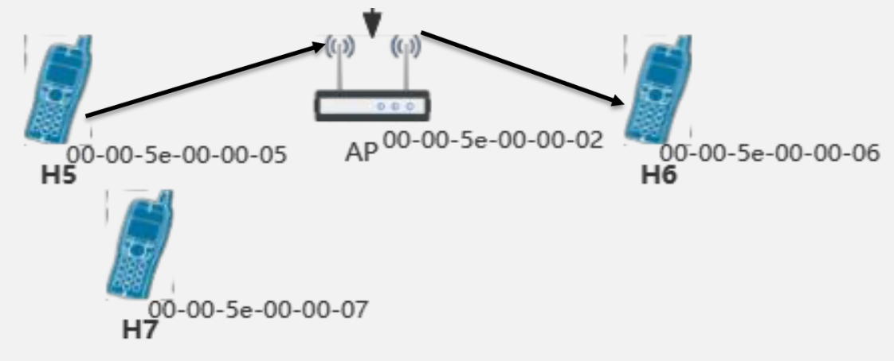

## RIP协议

&emsp;&emsp;&ensp; ${RIP}$ 协议简介：${RIP}$ 协议要求网络中每一个路由器都维护**从它自己到其他每一个目的网络的唯一最佳距离记录（距离最短）**。每经过一个路由器跳数 ${+1}$。特别的，从一路由器到直接连接的网络距离为 ${1}$。${RIP}$ 允许一条路由最多只能包含 ${15}$ 个路由器，因此距离为 ${16}$ 表示网络不可达。

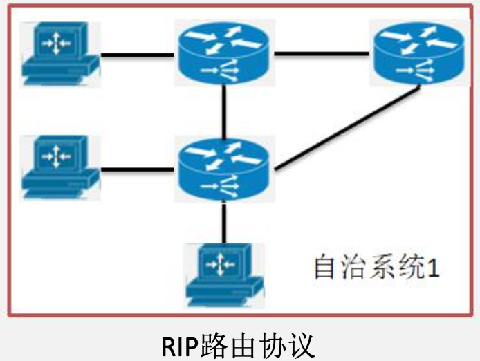

&emsp;&emsp;&ensp;**${RIP}$ 建立路由表的交互报文**：

1.  ${RIP}$ 请求消息：在 ${RIP}$ 路由器开始启动之后，立即向它的所有的邻居路由器发送 ${RIP}$ 请求消息，以便快速获得关于整个 ${RIP}$ 网络 的路由信息；**运行中的 ${RIP}$ 路由器也可以随时的根据自身的需要向它的所有的邻居发出 ${RIP}$ 请求消息**。
2.  ${RIP}$ 响应消息：
   1.  ${RIP}$ 路由器在接收到 ${RIP}$ 请求消息后，会立即发出 ${RIP}$ 响应消息进行回应。
   2.  ${RIP}$ 路由器总是会每隔 ${30}$ 秒的时间向它的**所有的邻居路由器**周期性的发送 ${RIP}$ 响应消息，而该消息中携带了该路由器的 ${RIP}$ 路由表中的最新的路由信息。
   3. 一个路由器路由信息发生变化，一般会主动发送响应给所有邻居路由器。但题目也出现过**只给一个邻居单独发送响应**，这一点需要注意。

&emsp;&emsp;&ensp;注：**每个路由器发送请求消息的时间是不同的**。
&emsp;&emsp;&ensp;**${RIP}$ 建立路由表的方式**：路由器 ${B}$ 刚接入网络后，给 ${A}$ 和 ${C}$ 发出 ${RIP}$ 请求，${C}$ 和 ${A}$ 都会发出 ${RIP}$ 响应。假设此时 ${C}$ 先发出 ${RIP}$ 报文。
1) 对地址为 ${X}$ 的相邻路由器发来的 ${RIP}$ 报文，先修改此报文中的所有项目：把“下一跳”字段中的地址都改为 ${X}$，并把所有“距离”字段的值加 ${1}$。

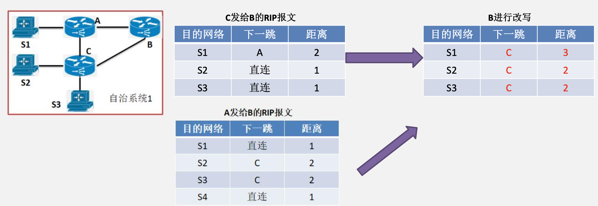

2) 对修改后的 ${RIP}$ 报文中的每个项目，执行如下步骤：
   1) 当原来的路由表中没有目的网络 ${N}$ 时，把**该项目添加到路由表中**。
   2) 当原来的路由表中有目的网络 ${N}$，且下一跳路由器的地址是 ${X}$ 时，**用收到的项目替换原路由表中的项目**。
   3) 当原来的路由表中有目的网络 ${N}$，且下一跳路由器的地址不是 ${X}$ 时，如果收到的项目中的距离 ${d}$ 小于路由表中的距离，那么就用收到的项目替换原路由表中的项目：否则什么也不做。

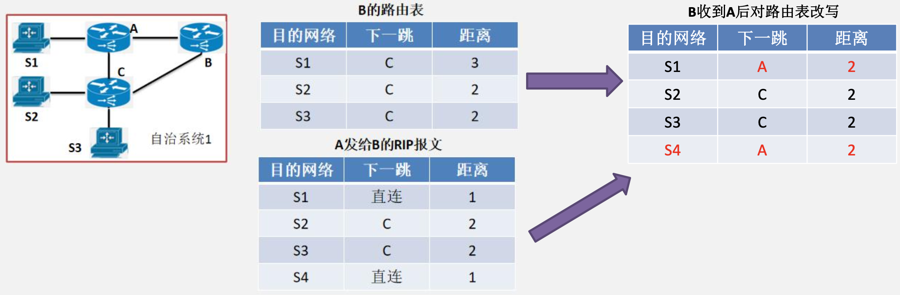

3) 如果 ${180}$ 秒（ ${RIP}$ 默认超时时间为 ${180}$ 秒）还没有收到相邻路由器的更新路由表，**那么把此相邻路由器记为不可达路由器**，即把距离设置为 ${16}$（距离为 ${16}$ 表示不可达）。

&emsp;&emsp;&ensp;**${RIP}$ 路由器收敛**：当一个自治系统中所有的路由器均拥有整个网络的信息，知晓到达每个网络所需要经过的下一跳路由器，并 在几次接收其他路由器 ${RIP}$ 报文后数据不变，则**所有路由器收敛**。
&emsp;&emsp;&ensp;${RIP}$ 路由器更新（更新可以从两个方面理解）：

1. 路由器收到其他路由器的数据后，会根据情况对自己的路由表进行**局部修改**。
2. 路由器从其他路由器获取路由表并更新后，或许此时表中的表项并不是最近的。**只有收到链路上所有路由器的 ${RIP}$ 报文后，才能让所有表项都实现距离最近这个要求**。这种路由表更新，发生在收到所有路由器的 ${RIP}$ 报文后。

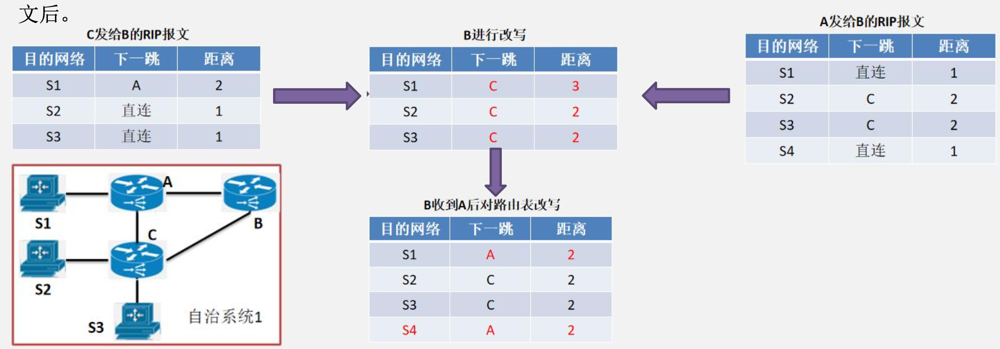

## IP多播（IP组播）

&emsp;&emsp;&ensp;与单播相比，在一对多的通信中，**多播可大大节约网络资源**。当视频服务器用单播方式向 ${90}$ 台主机传送**同样的视频节目**。为此，需要发送 ${90}$ 个单播，即同一个视频分组要发送 ${90}$ 个副本。当视频服务器用多播方式向属于同一个多播组的 ${90}$ 个成员传送节目。这时，视频服务器只需把视频分组当作多播数据报来发送，并且只需发送一次。
&emsp;&emsp;&ensp;**路由器 ${R1}$** 在转发分组时，需要把收到的分组**复制成 ${3}$ 个副本**，分别向 ${R2，R3}$ 和 ${R4}$ 各转发 ${1}$ 个副本。当分组到达目的局域网时，由于局域网具有硬件多播功能，**因此不需要复制分组**，在局域网上的多播组成员都能收到这个视频分组。

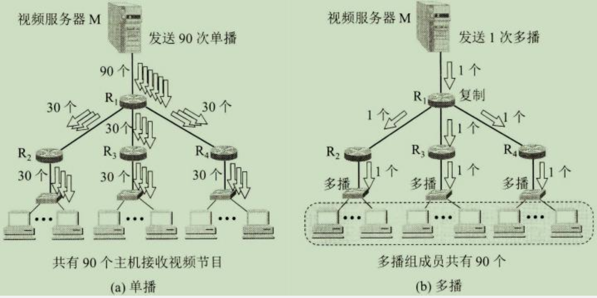

&emsp;&emsp;&ensp;**多播路由器**：在互联网范围的多播要靠路由器来实现，这些路由器必须增加一些能够识别多播数据报的软件。**能够运行多播协议的路由器称为多播路由器（${multicastrouter}$）**。多播路由器当然也可以转发普通的单播 ${IP}$ 数据报。
&emsp;&emsp;&ensp;其实多播组**就是 ${IP}$ 地址中的 ${D}$ 类地址**。每一个 ${D}$ 类地址标志一个多播组，比如主机 ${A，B，C}$ 都在 ${M1}$ 多播组内，${M1}$ 多播组实际上就是一个 ${D}$ 类地址 ${224.1.1.1}$。
&emsp;&emsp;&ensp;多播数据报也是“**尽最大努力交付**”，不保证一定能够交付多播组内的所有成员。因此，多播数据报和一般的 ${IP}$ 数据报的区别就是**它使用 ${D}$ 类 ${IP}$ 地址作为目的地址**，并且首部中的协议字段值是 ${2}$，表明**使用网际组管理协议 ${IGMP}$**。
&emsp;&emsp;&ensp;**多播组的发送方式**：多播路由器 ${R1}$ 准备发送数据到多播组 ${224.1.1.1}$，由于硬件多播的存在，${R1}$ 只需要发送一份多播数据到链路上即可。多播组内的三台主机都能接收到这个**目的 ${IP}$ 地址为 ${224.1.1.1}$ 的 ${IP}$ 数据报**（目的 ${IP}$ 地址一定要是组播组的地址）。

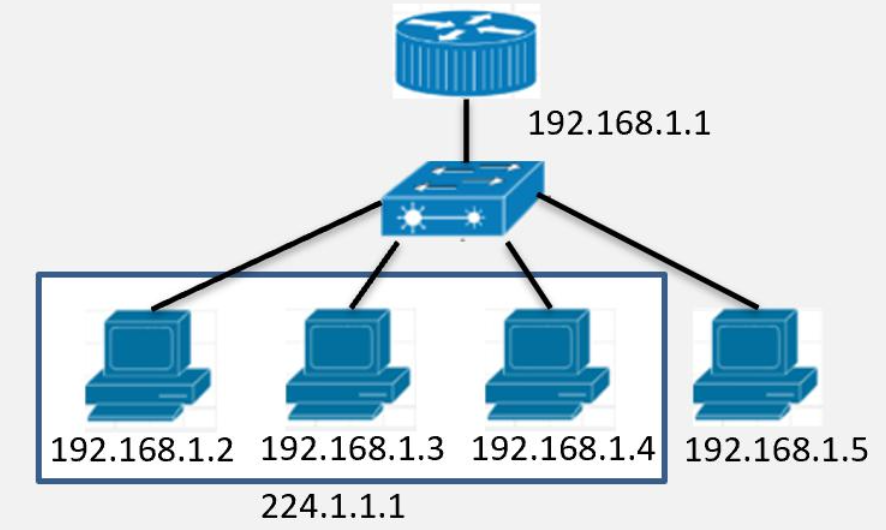

&emsp;&emsp;&ensp;由于多播采用**尽力交付**，所以可能多播组内的某个主机没有收到这个多播数据报。
&emsp;&emsp;&ensp;**多播组的发送方式**：由于主机实际上是处在局域网中，多播路由器在发送这 ${1}$ 个多播 ${IP}$ 数据报时，**要把其封装在以太网帧中**。与单播方式确定目的 ${MAC}$ 地址的方式是根据目的主机的 ${MAC}$ 地址不同，**多播数据报的目的 ${MAC}$ 地址是根据 ${IP}$ 数据报的目的 ${IP}$ 地址确定的**。
&emsp;&emsp;&ensp;单播情况下，以太网 ${MAC}$ 地址的范围是从 ${00-00-5E-00-00-00}$ 到 ${00-00-5E-FF-FF-FF}$。**多播情况下**以太网 ${MAC}$ 地址字段中的**第 ${1}$ 字节的最低位为 ${1}$ 时即为多播地址**，即 ${01-00-5E-00-00-00}$ 到 ${01-00-5E-7F-FF-FF}$ 的地址作为**以太网多播地址**。
&emsp;&emsp;&ensp;当用单播方式向 ${3}$ 台主机传送同样的 ${IP}$ 数据报需要发送 ${3}$ 个单播。采用多播方式时，**路由器转发多播分组，只需要把收到的分组直接发送 ${1}$ 份即可**。
&emsp;&emsp;&ensp;**多播组的发送方式**：在 ${48}$ 位的多播地址中，**前 ${25}$ 位都固定不变，只有后 ${23}$ 位可用作多播**。但 ${D}$ 类 ${IP}$ 地址可供分配的有 ${28}$ 位。**这 ${28}$ 位中只有后 ${23}$ 位才映射以太网多播地址中的后 ${23}$ 位**。
&emsp;&emsp;&ensp;例如，${IP}$ 多播地址 ${224.128.64.32}$（即 ${E0-80-40-20}$）和另一个 ${IP}$ 多播地址 ${224.0.64.32}$（即 ${E0-00-40-20}$）转换成以太网的多播地址**都是 ${01-00-5E-00-40-20}$**。因此收到多播数据报的主机，还要**在 ${IP}$ 层利用 ${IP}$ 数据报首部的 ${IP}$ 地址进行过滤，把不是本主机要接收的数据报丢弃**。
&emsp;&emsp;&ensp;运行多播协议的主机，除了有自己固定的单播 ${48}$ 地址以外，**还会根据自己所处的多播组设置一个虚拟的多播 ${48}$ 地址用于接收多播组的数据**。

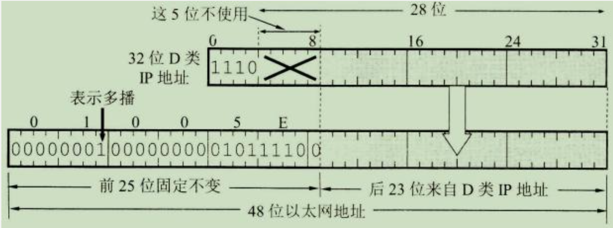

&emsp;&emsp;&ensp;多播组的发送方式：比如路由器 ${R1}$ 要发送数据到多播组 ${224.0.64.32}$，先将**数据封装成多播数据报**，源 ${IP}$ 为 ${192.168.1.1}$，目的 ${IP}$ 为 ${224.0.64.32}$。然后在将 ${IP}$ 数据报封装在以太网帧中。以太网帧的源 ${MAC}$ 地址是 ${R1-MAC}$，目的 ${MAC}$ 地址为 ${01-00-5E-00-40-20}$。将这个以太网帧直接发送到链路中。但链路中无论是在多播 ${224.0.64.32}$ 内的三个主机，还是在 ${224.128.64.32}$ 内的一个主机在发现这个以太网帧时，对比其目的 ${MAC}$ 地址 ${01-00-5E-00-40-20}$，都会当作是发给自己的。所以该帧有可能数据都被 ${224.0.64.32}$ 内的主机接收，也有可能被多播组 ${224.128.64.32}$ 的主机接收。所以在接收后还会其看其目的 ${IP}$ 地址是不是给自己的多播组。

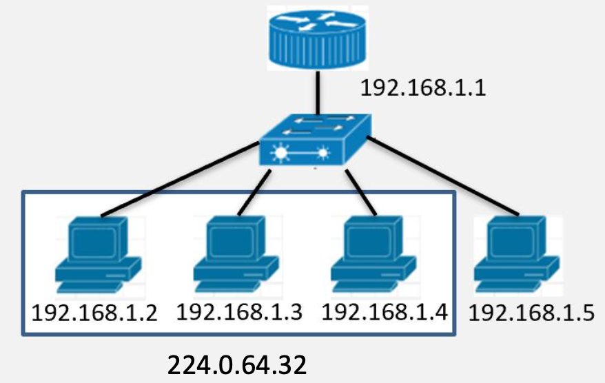

&emsp;&emsp;&ensp;${IGMP}$：**${IGMP}$ 是多播路由器管理多播组的工具**，${IGMP}$ 并非在互联网范围内对所有多播组成员进行管理的协议。${IGMP}$ 不知道 ${IP}$ 多播组包含的成员数，也不知道这些成员都分布在哪些网络上。${IGMP}$ 协议是**让连接在本地局域网上的多播路由器知道本局域网上是否有主机（严格讲，是主机上的某个进程）参加或退出了某个多播组**。
