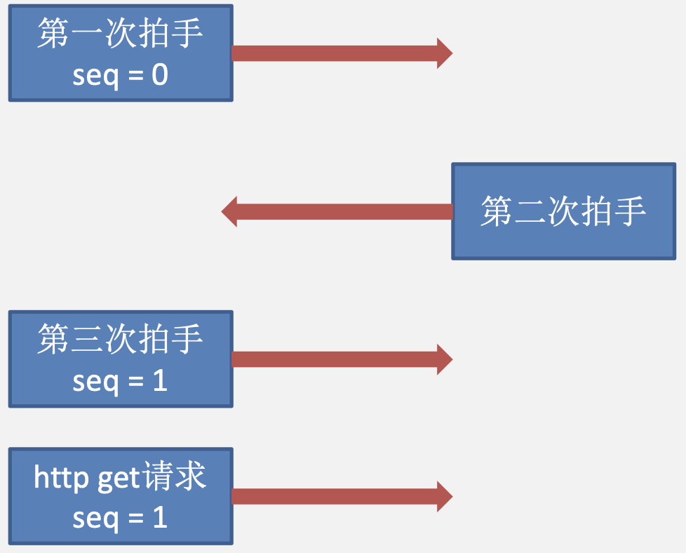

# TCP+HTTP

&emsp;&emsp;&ensp;目的：介绍从浏览器输入链接开始，到接收全部数据为止。在应用层和传输层上的全过程。

## 目标简介

&emsp;&emsp;&ensp;以 ${wireshark}$ 抓包实例，以现实生活中到的一个实际例子，来学习从浏览器点击 ${web}$ 链接开始，到接收到 ${web}$ 服务器传回的数据为的全部过程。
&emsp;&emsp;&ensp;以访问百度服务器链接 ${www.baidu.com}$ 为例：

&emsp;&emsp;&ensp;为了方便大家学习，我将网络上的基本设备画成下图所示的网络结构图。其中 ${H1}$ 为我的主机，${H2}$ 为同一个局域网内的主机。${R1}$ 为局域网的网关。${DNS}$ 服务器采用中国通用 ${DNS}$ 服务器。**所以 ${DNS}$ 服务器并未和主机 ${H1}$ 在同一个局域网中**。

&emsp;&emsp;&ensp;通过 ${wget}$ 指令，获取百度门户网站 ${www.baidu.com}$ 的 ${html}$ 文本文件（不包含图片）的报文交互过程如下所示：

&emsp;&emsp;&ensp;从输入 ${www.baidu.com}$ 到浏览器，点击回车开始，到主机收到全部数据为止。主要经过以下几个步骤：
&emsp;&emsp;&ensp;由于 ${DNS}$ 服务器与主机**不在一个局域网**内，所以需要先获取网关的 ${MAC}$ 地址。
&emsp;&emsp;&ensp;是否需要获取网关的 ${IP}$ 地址？主机是如何知道网关的 ${IP}$ 地址的？
&emsp;&emsp;&ensp;主机在连接上该局域网获取自身 ${IP}$ 地址是通过使用 ${DHCP}$ 协议的，${DHCP}$ 服务器返回的最后一个协议报文 ${DHCP\quad Acknowledge}$ 会携带当前局域网的一些必要信息，其中就有**该主机的默认网关 ${IP}$ 地址和子网掩码**。

&emsp;&emsp;&ensp;${TCP}$ 段的 ${MSS}$：${TCP}$ 报文的数据部分可以达到的最大长度。假设 ${TCP}$ 的 ${MSS}$ 的大小为 ${1460B}$。

&emsp;&emsp;&ensp;${web}$ 服务器不知道主机 ${H1}$ 的 ${MSS}$ 是多少，同理主机 ${H1}$ 也不知道 ${web}$ 服务器的 ${MSS}$ 是多少。如上图中的第 ${8}$ 和 ${9}$ 条所示，会在 ${TCP}$ 的**第一次拍手和第二次拍手时传递各自的 ${MSS}$**。
&emsp;&emsp;&ensp;在传输层就把应用层需要发送的数据进行切分，每一段数据部分的大小是 ${MSS}$，每一段再封装成一个 ${IP}$ 数据报，再封装成以太网帧进行发送，这样做的好处是什么？
&emsp;&emsp;&ensp;即使应用层传来特别大的文件，按照 ${MSS}$ 分割成几个 ${TCP}$ 报文段，每个 ${TCP}$ 报文段封装的 ${IP}$ 数据报的标识字段都是不一致的。一旦有一个 ${IP}$ 数据报发生丢失，通过后续接收的 ${IP}$ 数据报解析 ${TCP}$ 的字段部分，推断到底是哪段发生了丢失，对该段进行重传操作。
&emsp;&emsp;&ensp;若传输层使用的是 ${UDP}$，假设应用层传来 ${3000B}$ 的数据，是否会存在一个 ${MSS}$ 机制？
&emsp;&emsp;&ensp;不会，${UDP}$ 会直接封装成一个 ${IP}$ 数据报，只能将该 ${IP}$ 数据报分片。如果此时某个分片丢失了，只能将所有已收到的 ${IP}$ 数据报丢弃，而不能像 ${TCP}$ 那样重传某报文段。
&emsp;&emsp;&ensp;**域名输入浏览器后续流程**：百度的域名 ${www.baidu.com}$ 输入浏览器后，首先要将域名转换成 ${IP}$ 地址，**如果转换成 ${IP}$ 地址就必须访问 ${DNS}$ 域名服务器（本地域名服务器）**。也就是说，第一步是先将域名解析的 ${IP}$ 数据包发送给 ${DNS}$ 服务器（本地域名服务器）。

&emsp;&emsp;&ensp;由图可知，本地域名服务器并不在子网 ${192.168.31.0/24}$ 中，所以该域名解析服务**要经过路由器转发到服务器 ${114.114.114.114}$**。

## ARP协议实例

&emsp;&emsp;&ensp;由下图可以看到，在输入域名到浏览器后，链路上最先出现的是三条 ${ARP}$ 协议的报文，用于获取网关 ${192.168.31.1}$ 的 ${MAC}$ 地址。

&emsp;&emsp;&ensp;如图，是主机发出的 ${ARP}$ 请求帧的链路层信息，可以看到该帧源 ${MAC}$ 地址（也就是我的主机的 ${MAC}$ 地址）是 ${00:0C:29:D3:4A:FB}$，目的 ${MAC}$ 地址为 ${FF:FF:FF:FF:FF:FF}$。

&emsp;&emsp;&ensp;${ARP}$ 请求帧内部的信息可以看出，发出该请求帧主机的 ${IP}$ 是 ${192.168.31.104}$，请求目标主机的 ${IP}$ 是 ${192.168.31.1}$。

&emsp;&emsp;&ensp;路由器收到 ${ARP}$ 请求帧后，发出 ${ARP}$ 返回帧。${ARP}$ 返回帧的链路层信息如下：

&emsp;&emsp;&ensp;路由器所发出的 ${ARP}$ 返回帧，其网络层内容如下，可以看到发出次返回帧主机的 ${IP}$ 为路由器，目标 ${IP}$ 为主机 ${H1}$。

&emsp;&emsp;&ensp;主机 ${H1}$ 在获得路由器的 ${IP}$ 地址后，会将**想要发给 ${DNS}$ 服务器（本地域名服务器）的 ${IP}$ 数据包发出**，该 ${IP}$ 数据包的目的 ${MAC}$ 地址为**路由器 ${R1}$ 的 ${MAC}$ 地址**。该 ${MAC}$ 地址由主机 ${1}$ 发出的 ${ARP}$ 协议获得。

&emsp;&emsp;&ensp;路由器在拿到该 ${IP}$ 数据包后，也要进行转发。而转发到目标设备的 ${MAC}$ 地址，同样需要路由器执行一次 ${ARP}$ 协议获得。

## DNS协议实例

&emsp;&emsp;&ensp;获得路由器的 ${MAC}$ 地址后，主机发出 ${DNS}$ 查询报文，该报文封装在一个 ${IP}$ 数据报之中。该报文用来查询 ${www.baidu.com}$ 链接的 ${IP}$ 地址。该 ${IP}$ 数据报的源 ${IP}$ 地址为 ${192.168.31.104}$，目的 ${IP}$ 地址为 ${114.114.114.114}$。

&emsp;&emsp;&ensp;上图中虽然发出了两个 ${DNS}$ 请求，收到两组 ${DNS}$ 回复。这实际上是百度服务器进行了一些配置。而 ${408}$ 中只会发出一个 ${DNS}$ 请求并收到一个 ${DNS}$ 回复。
&emsp;&emsp;&ensp;由主机 ${H1}$ 发出的 ${DNS}$ 查询报文如下：可以看出，${DNS}$ 应用层协议封装在一个 ${UDP}$ 报文中。

&emsp;&emsp;&ensp;该 ${DNS}$ 域名解析报文的链路层部分如下：该 ${DNS}$ 域名解析报文的源 ${MAC}$ 地址是主机 ${MAC}$ 地址，目的 ${MAC}$ 地址是路由器 ${MAC}$ 地址。

&emsp;&emsp;&ensp;可以看到的是，该 ${DNS}$ 域名解析报文的目的 ${MAC}$ 地址是路由器，目的 ${IP}$ 地址是 ${114.114.114.114}$。原因是 ${DNS}$ 服务器（本地域名服务器）并不在子网内部，所以**需要路由器代为转发**。

### DNS出题点

1. 辨析 ${DNS}$ **递归查询和迭代查询**
2. 给出一个域名，提问**解析次数**
3. 需要区分是**到本地域名服务器的往返次数**还是**到主机的往返次数**

&emsp;&emsp;&ensp;本地域名服务器采用递归查询服务，所以主机只需要把 ${DNS}$ 解析查询报文给本地域名服务器即可。因为其他服务器提供迭代查询服务，所以本地域名服务器需要以迭代查询的方式依次访问根域名服务器，顶级域名服务器和权限域名服务器等。

## TCP连接和断开实例

### TCP出题点

1. ${TCP}$ **三次拍手和四次挥手**全过程，以及**释放时间**（记得要补足一下四次挥手后要额外等待的时间的部分）
2. ${TCP}$ **拥塞窗口的判定**，慢开始和快重传情况
3. 给出**接收窗口大小**，问还能发出多少字节或字节范围

&emsp;&emsp;&ensp;${TCP}$ 的**第三次拍手既可以携带数据，也可以不携带数据**。在 ${408}$ 考研中，大多数情况下第三次拍手是携带数据的。携带 ${http}$ 的 ${get}$ 请求。

&emsp;&emsp;&ensp;${TCP}$ 的第三次拍手**如果不携带数据，则不会消耗 ${seq}$ 号**。${TCP}$ 第三次拍手不携带数据的情况，在现实中很常见。但在 ${408}$ 中只出现了一次，就是 ${2012}$ 年计网大题。

&emsp;&emsp;&ensp;在这个实际例子中，可以看出第三次拍手并未携带数据，并且第三次拍手的 ${seq}$ 与其后续的 ${HTTP\quad get}$ 请求报文的 ${seq}$ 一样。

&emsp;&emsp;&ensp;封装该 ${TCP}$ 报文的 ${IP}$ 数据报，**其标识字段为 ${15632}$**，总长为 ${40}$。由于以太网的最小长度为 ${64B}$，所以该 ${IP}$ 数据报在被**以太网帧封装**时，进行了填充（在**链路层进行填充**，而不是网络层），填充了 ${6B}$ 的数据，具体看下图以太网部分的 ${Padding}$ 字段。

## web请求和接收实例

### web出题点

1. ${web}$ 的 ${get}$ 请求点击链接的全过程
2. ${Http1.0}$ 和 ${Http1.1}$ 协议辨析，以及请求对象的区别
3. ${Http1.1}$ 协议最快情况（**流水线**）
4. ${Http}$ 头部基本内容以及 ${cookie}$

### web连接

&emsp;&emsp;&ensp;在通过 ${DNS}$ 获取到 ${IP}$ 地址后，进入 **${TCP}$ 连接环节**。主机通过 ${TCP}$ **三次握手的方式**和服务器建立连接。由于我们是访问百度的 ${web}$ 服务器，所以在发起 ${http\quad get}$ 请求前，主机发出的 ${TCP}$ 连接报文的**目的端口号是 ${80}$**。意味着主机要**和 ${web}$ 服务器的 ${80}$ 端口进行连接**。

### HTTP get请求

&emsp;&emsp;&ensp;封装该 ${http\quad get}$ 请求报文的 ${IP}$ 数据报，其标识字段为 ${15633}$，总长为 ${117}$。由于超过以太网的最小长度为 ${64B}$，所以该 ${IP}$ 数据报**不需要在以太网帧封装时进行填充**。该报文中的传输层部分，数据的长度为 ${77B}$。

&emsp;&emsp;&ensp;其中的 ${http}$ 协议 ${get}$ 请求头部报文详情如下所示：

### HTTP头部字段

&emsp;&emsp;&ensp;${Cookie}$ 的工作原理：当用户浏览某个使用 ${Cookie}$ 的网站时，该网站服务器就为用户产生一个唯一的识别码，如“${123456}$”，接着在给用户的响应报文中添加一个 ${Set-cookie}$ 的首部行“ ${Set\quad cookie: 123456}$”。用户收到响应后，就在它管理的特定 ${Cookie}$ 文件中添加这个**服务器的主机名和 ${Cookie}$ 识别码**，当用户继续浏览这个网站时，会取出这个网站的识别码，并**放入请求报文的 ${Cookie}$ 首部行“${Cookie: 123456}$”**。服务器根据请求报文中 ${Cookie}$ 识别码就能**从数据库中查询到该用户的活动记录，进而执行一些个性化的工作**。

### HTTP确认报文

&emsp;&emsp;&ensp;当服务器收到 ${HTTP\quad Get}$ 请求报文后，服务器会先发出一个 **${TCP}$ 确认报文 ${A}$**。且该确认报文不包含任何的数据部分。在发送完确认报文后，紧接着会发送一个包含数据部分的 ${TCP}$ 报文段 ${B}$。**报文段 ${A}$ 由于不包含数据，所以与报文段 ${B}$ 的 ${seq}$ 均为 ${1}$**。

&emsp;&emsp;&ensp;当我们基于 ${TCP}$ 在传输消息时，对于上面的应用层如果出于某些原因（如超过 ${MSS}$）${TCP}$ 一个段不能一次包含全部的应用层 ${PDU}$，**而要把一个完整消息分成多个段**，就会将除了最后一个分段（${segment}$）的所有其他分段都打上“${TCP\enspace segment\enspace of\enspace a\enspace reassembled\enspace PDU}$”。

&emsp;&emsp;&ensp;可以看到，两个报文段实际上是归属于一个数据部分为 ${2781B}$ 的 ${TCP}$ 报文段。由于设置了 ${TCP}$ 的 ${MSS}$ 为 ${1460}$，所以对该 ${2781B}$ 的 ${TCP}$ 报文段分成了两个 ${TCP}$ 报文段。两个 ${TCP}$ 报文段在封装在两个 ${IP}$ 数据报中进行发送。

### TCP断开连接

&emsp;&emsp;&ensp;当 ${TCP}$ 断开连接后，由**客户机**率先发出 ${FIN=1}$ 的 ${TCP}$ 断开连接报文，该报文**一般不会携带数据**。当客户机发出该报文后**证明客户机不再有数据需要发出**。

&emsp;&emsp;&ensp;${TCP}$ 的四次挥手中，第二次挥手可以看出，服务器并没有数据需要发出，但断开连接的第二步**还是发出了一个确认报文**，用于确认客户机发出的，${FIN=1}$ 的报文。由于第二步并不包含数据，所以虽然第三步，服务器发出了 ${FIN=1}$ 的报文，但是第三步和第二步的 ${seq}$ 确实一样的。第三步并没有采用一个新的 ${seq}$（**由于第二步没有携带数据**）。

&emsp;&emsp;&ensp;目前选择题中考察 ${TCP}$ 断开连接的题目逐渐增多。**${TCP}$ 断开连接时要注意，谁是断开的发起者**。

### FTP

1. **控制连接**：服务器**监听 ${21}$ 号端口**，等待客户连接，建立在这个端口上的连接称为控制连接。控制连接用来**传输控制信息**（如连接请求、传送请求等），并且控制信息都以 ${7}$ 位 ${ASCII}$ 格式传送。**${FTP}$ 客户**发出的传送请求，通过控制连接发送给服务器端的控制进程，但**控制连接并不用来传送文件**。在传输文件时还可以使用控制连接（如客户在传输中途发一个中止传输的命令），因此**控制连接在整个会话期间一直保持打开状态**。
2. **数据连接**：服务器端的控制进程在接收到 ${FTP}$ 客户发来的文件传输请求后，就创建“服务器端的数据传送进程”和“数据连接”。数据连接用来连接**客户端的数据传送进程和服务器端的数据传送进程**，数据传送进程实际完成文件的传送，在**传送完毕后关闭“数据传送连接”并结束运行**。数据连接有两种传输模式：**主动模式 ${PORT}$ 和被动模式 ${PASV}$**。
   1. **${PORT}$ 模式**：客户端连接到**服务器的 ${21}$ 端口**，登录成功后要读取数据时，**客户端**随机开放一个端口，并发送命令告知服务器，**服务器**收到 ${PORT}$ 命令和端口号后，**通过 ${20}$ 端口和客户端开放的端口连接，发送数据**。
   2. **${PASV}$ 模式**：客户端要读取数据时，发送 ${PASV}$ 令到服务器，**服务器在本地随机开放一个端口**，并告知客户端，**客户端再连接到服务器开放的端口进行数据传输**。

