# 物理层+数据链路层+补充

## FTP

&emsp;&emsp;&ensp;${FTP}$ 的通过**两种类型的 ${TCP}$ 连接**完成数据传输过程：
&emsp;&emsp;&ensp;**控制连接**：用于在两主机之间传输控制信息，如1.用户标识信息，2.口令信息，3.改变远程目录命令，以及“存放（${put}$）”和“获取（${get}$）”文件的命令等。
&emsp;&emsp;&ensp;**数据连接**：仅用于实际发送一个文件数据的过程。

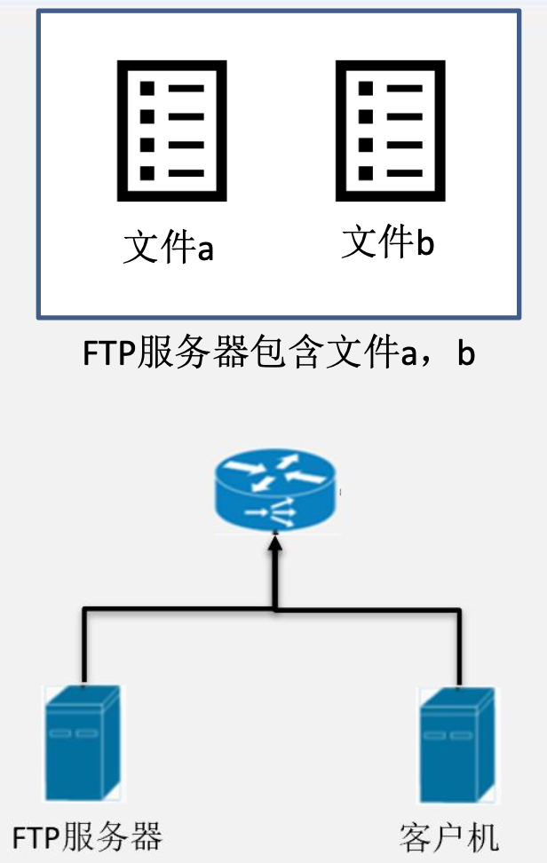

### FTP的数据传输流程

&emsp;&emsp;&ensp;以连接 ${FTP}$ 服务器并下载文件a，b为例：

1. 客户机通过端口 ${12345}$ （假定） ${FTP}$ 向服务器 ${21}$ 端口发起 ${TCP}$ 连接请求，并建立连接（控制连接）。
2. 客户机 ${12345}$ 端口和 ${FTP}$ 服务器 ${21}$ 端口传输一些必要口令和用户信息，并完成登录。

3. 客户机发起对文件a的下载请求，并告知服务器，客户机采用 ${54321}$ 端口和 ${FTP}$ 进行数据连接。
4. ${FTP}$ 服务器的 ${20}$ 端口向 ${54321}$ 端口发起 ${TCP}$ 连接（数据连接）。
5. ${FTP}$ 服务器通过 ${20}$ 端口向客户机传输数据。
6. ${FTP}$ 服务器 ${20}$ 端口向客户机 ${54321}$ 端口断开连接，下载完毕。

7. 客户机发起对文件b的下载请求，并告知服务器，客户机采用 ${56789}$ 端口和 ${FTP}$ 进行数据连接
8. ${FTP}$ 服务器的 ${20}$ 端口向 ${56789}$ 端口发起 ${TCP}$ 连接
9. ${FTP}$ 服务器通过 ${20}$ 端口向客户机传输数据
10. ${FTP}$ 服务器 ${20}$ 端口向客户机 ${56789}$ 端口断开连接，下载完毕。

11. 客户机结束下载需求，通过 ${12345}$ 端口向服务器的 ${21}$ 端口发起断开连接请求。
12. ${FTP}$ 服务器的 ${21}$ 端口发起 ${FIN=1}$ 的帧，开始四次挥手过程，连接断开。

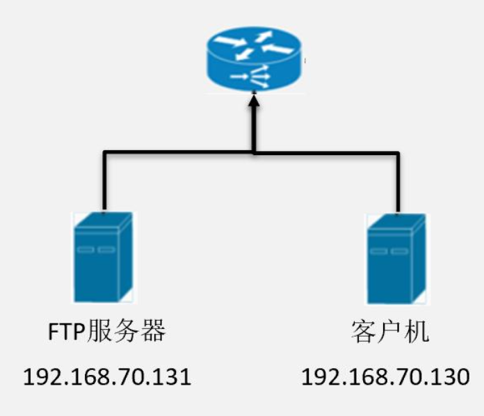

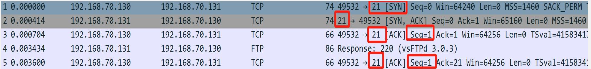

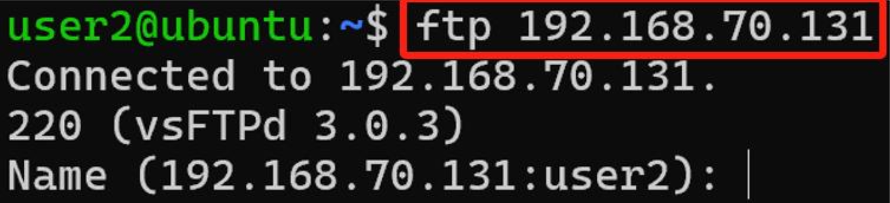

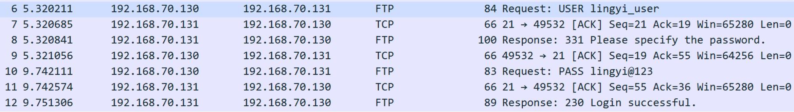

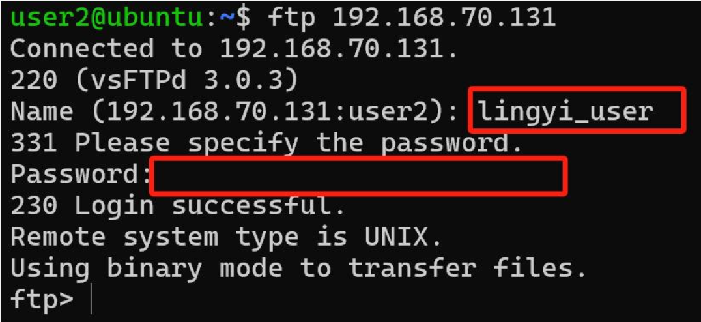

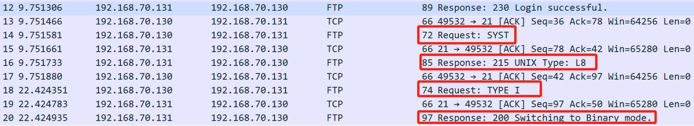

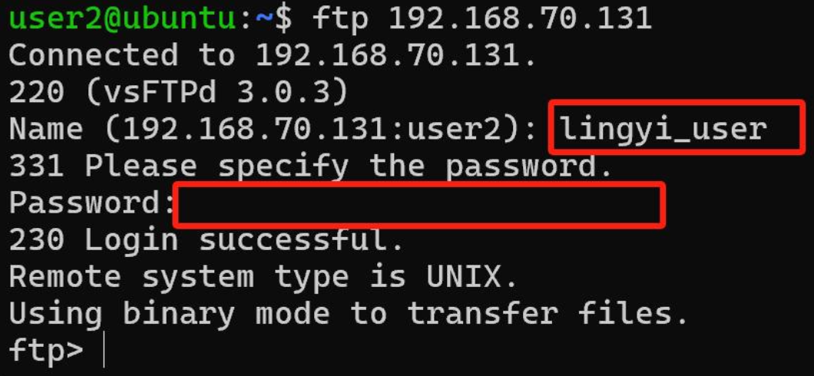

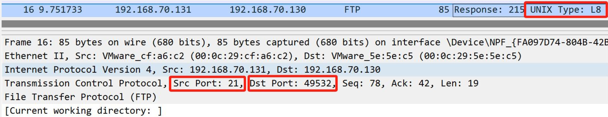

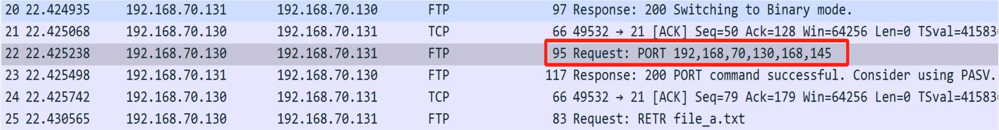

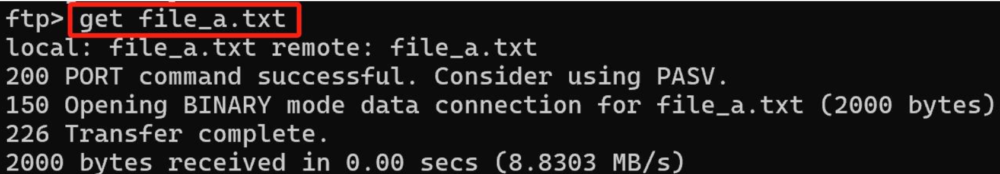

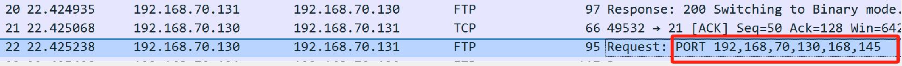

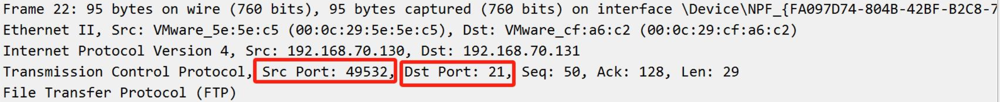

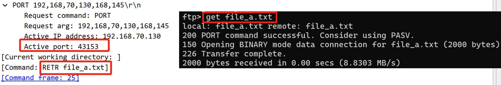

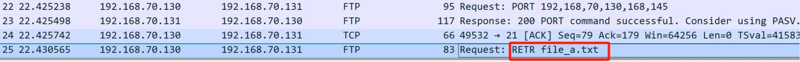

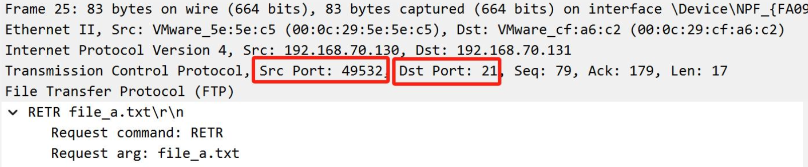

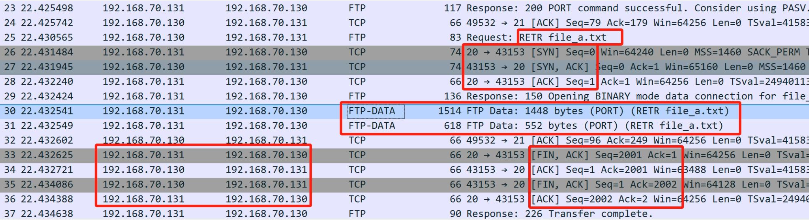

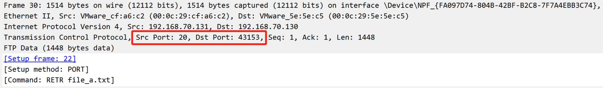

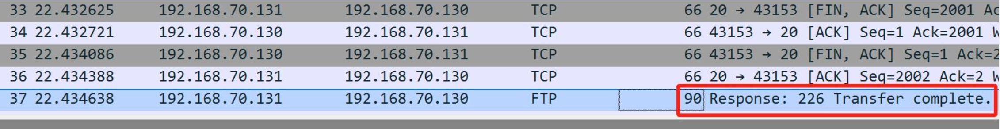

&emsp;&emsp;&ensp;此处由 ${FTP}$ 服务器发起的四次挥手断开 ${TCP}$ 连接的过程。断开连接后， ${FTP}$ 服务器将通过控制端口发送一个“${transfer\space complete}$”${response}$ 报文。

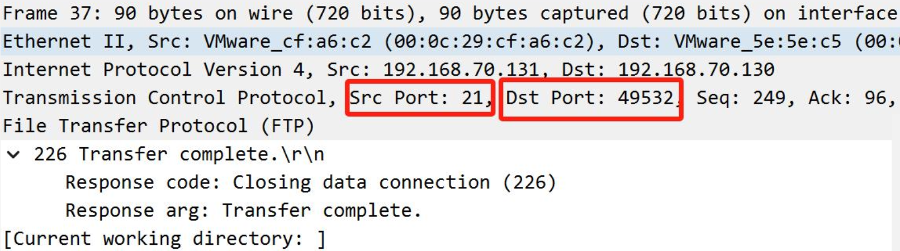

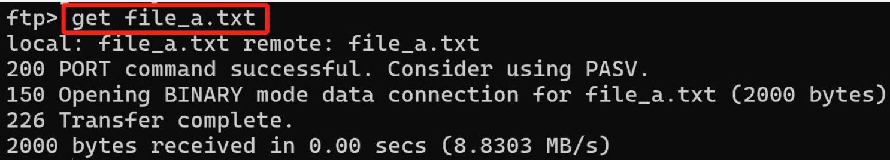

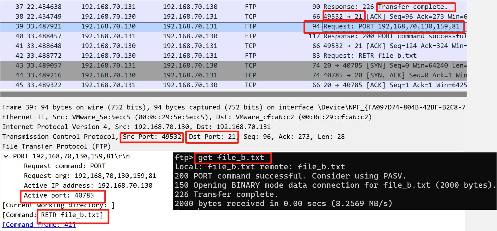

&emsp;&emsp;&ensp;此处可以注意到，两次数据连接，客户端提供的是不同的端口来给服务器的 ${20}$ 号端口进行连接。

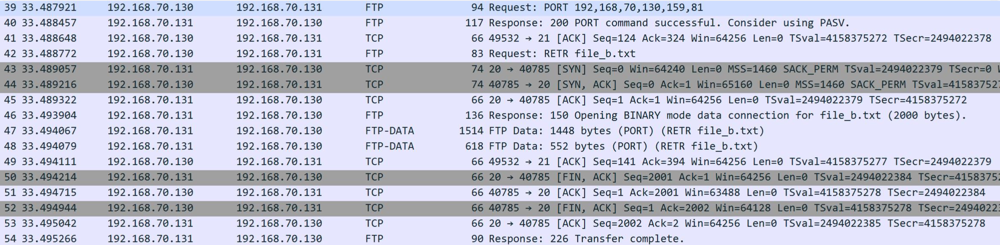

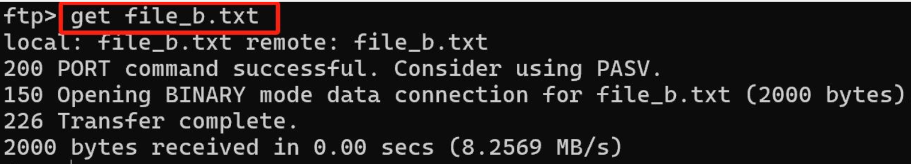

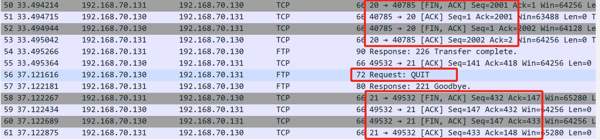

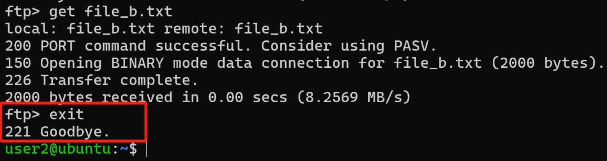

&emsp;&emsp;&ensp;此处注意 ${56}$ 条，在键盘按下 ${exit}$ 后，服务器返回一个 ${response}$“${221\space Goodbye}$”。此时，是**由 ${FTP}$ 服务器主动发起的**针对控制连接的断开 ${TCP}$ 连接请求（即四次挥手）。
&emsp;&emsp;&ensp;注意：无论是 ${port}$ 还是 ${pasv}$ 模式，数据连接的关闭默认都是由服务器进行的。如果在 ${pasv}$ 方式下需要用户进行关闭，需要使用 ${abnort}$ 命令进行关闭。

## 物理层

&emsp;&emsp;&ensp;物理层目的：让信号通过**编码或调制**，实现其在信道上进行传输。

&emsp;&emsp;&ensp;**物理层的功能**：

1. 提供信道中**信号的转换**，比如将数字信号调制成模拟信号，或将模拟信号编码成数字信号。
2. 定义低通信道中**最大码元传输速率**和有噪声情况下的**最大数据传输速率**。

&emsp;&emsp;&ensp;上述功能实现了信号在信道上进行传输，以及定义了传输的最大速率。
&emsp;&emsp;&ensp;注意：物理层中**所有你学到的计算公式或调制和编码，全部是基于信道之上，而非传输媒体之上**。
&emsp;&emsp;&ensp;**物理层考点**：

1. 编码与调制：对于数字信号**编码**成数字信号，数字信号**调制**为模拟信号，模拟信号**调制**成模拟信号，模拟信号**编码**成数字信号。这四种情况在**什么时候发生**，发生时**用什么公式**，这是必须清楚的。
2. 香农定理和奈氏准则
3. 物理层接口的性质
4. 虚电路的性值和辨析

### 传输媒体和信道

&emsp;&emsp;&ensp;传输媒体：传输媒体也称为传输介质或传输媒介，它就是数据传输系统中在发送器和接收器之间的物理通路。传输媒体。可分为两大类，即**导引型传输媒体和非导引型传输媒体**。

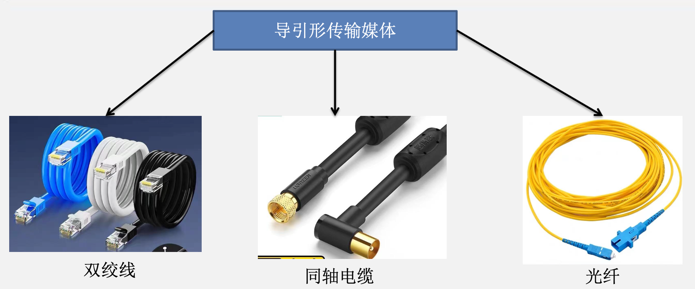

### 物理层接口特性

1） **机械特性**：指明接口所用接线器的形状和尺寸、引脚数目和排列、固定和锁定装置等。
2） **电气特性**：指明在接口电缆的各条线上**出现的电压的范围**。
3） **功能特性**：指明某条线上出现的某种电平的电压**表示何种意义**。
4） **过程特性**：或称**规程特性**。指明对于**不同功能的各种可能事件的出现顺序**。

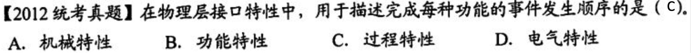

### 编码与调制

&emsp;&emsp;&ensp;**主机中的网卡**负责**数字信号到数字信号的转换**。转换方式主要有**曼彻斯特编码，归零编码**等。网卡设备把从内存收到的数据经过以下的几种编码法则，转换成另一种数字信号，通过**双绞线**传递给路由器。

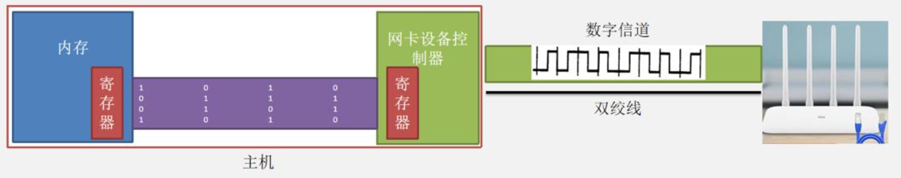

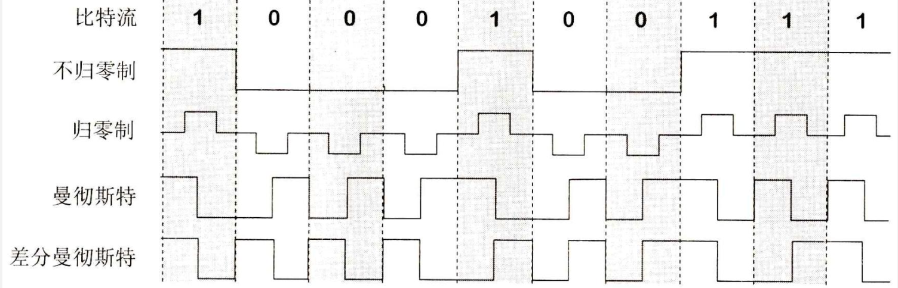

&emsp;&emsp;&ensp;路由器（**内置了光猫功能**）将收到的**数字信号调制成模拟信号**，若使用的路由器是光纤路由器，则将**数字信号调制成光信号**，再将光信号输出。

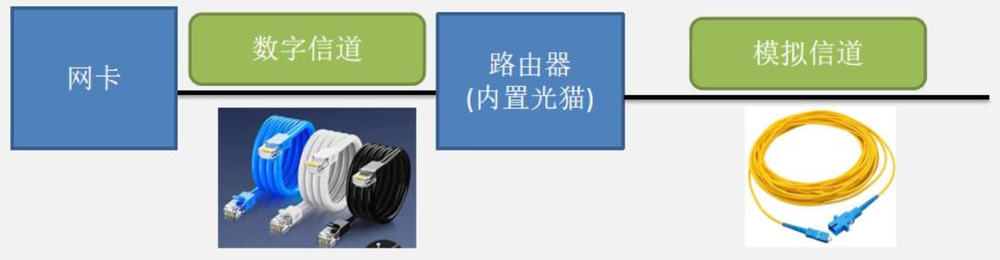

&emsp;&emsp;&ensp;调制的方法主要有幅移键控（${ASK}$），频移键控（${FSK}$），相移键控（${PSK}$），**正交振幅调制（QAM）**。考试主要考察的点为正交振幅调制：在频率相同的前提下，将 ${ASK}$ 与 ${PSK}$ 结合起来，**形成叠加信号**。设波特率为B，采用m个相位，每个相位有n种振幅，则该QAM技术的数据传输速率R为 ${R = Blog_2（mn）}$（单位为 ${b/s}$）。
&emsp;&emsp;&ensp;**模拟信号调制成模拟信号**考试考察的概率不大。其概念主要是：为了实现传输的有效性，可能需要较高的频率。这种调制方式还可以使用频分复用（${FDM}$）技术，充分利用带宽资源。电话机和本地局交换机采用模拟信号传输模拟数据的编码方式，模拟的声音数据是加载到模拟的载波信号中传输的。
&emsp;&emsp;&ensp;当目标主机的路由器（**内置光猫**）从光纤上收到数据后，需要把**模拟信号编码成数字信号**。将数字信号发送给目标主机。把模拟信号编码成数字信号的方式为**采样定理**。

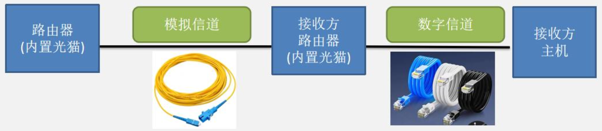

&emsp;&emsp;&ensp;采样定理：原始信号中的最大频率为f，**采样频率必须大于等于2f**，才能保证采样后的数字信号完整的保留原始的模拟信号的信息。

### 码元

&emsp;&emsp;&ensp;**码元的概念**：码元是指用一个固定时长的信号波形（数字脉冲）表示一位 ${k}$ 进制数字，代表不同离散数值的基本波形，是数字通信中数字信号的计量单位，这个时长内的信号称为 ${k}$ 进制码元，而该时长称为**码元宽度**。
&emsp;&emsp;&ensp;1码元可以携带若干比特的信息量。
&emsp;&emsp;&ensp;**注意：曼彻斯特编码是一个特例。因为曼彻斯特编码包含一个高，低电平表示一个bit的信息，而一次高低电平相当于两个码元。所以对于曼彻斯特编码，是两个码元用来传输1bit的消息**。
&emsp;&emsp;&ensp;码元，可以理解成计组中的**时钟周期**：假设1秒内会发出四个码元，相当于每0.25秒发出一个码元。相当于该计算机发送一次码元的时钟周期是0.25秒，也可以理解成频率为4HZ。假设用0.25秒的+3V电压表示0，+6V电压表示1，-3V电压表示2，-6V电压表示3。

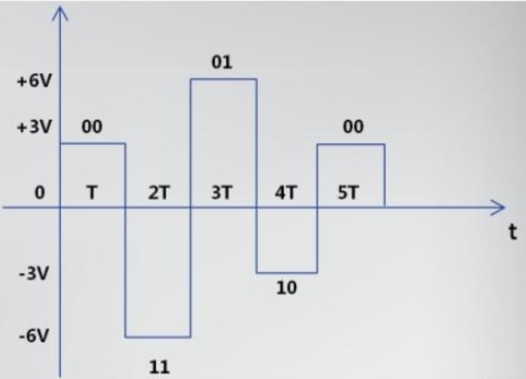

&emsp;&emsp;&ensp;在1.25秒内发出了5个码元，每连续的0.25秒内的电压分别是 ${+3V，-6V，+6V，-3V，+3V}$。相当于我发出了 ${00，11，01，10，00}$ 这10个 ${bit}$ 的数据。
&emsp;&emsp;&ensp;所以码元个数在这里就相当于你发送了多少个连续的电平，而每种连续的电平包含了四种变化。**每种变化相当于是2bit的信息**。
&emsp;&emsp;&ensp;所以如果题目给你一秒钟发送码元的个数m个，每个码元中包含4中变化，也就是 ${log_24 = 2}$。则发送的bit数是 ${2m\space bit}$。

### 波特率

&emsp;&emsp;&ensp;波特率又称**码元传输速率**，它表示单位时间内数字通信系统所传输的码元个数（也可称为脉冲个数或信号变化的次数），单位是波特（Baud）。1波特表示数字通信系统每秒传输一个码元。码元可以是多进制的，也可以是二进制的，**码元速率与进制数无关**。

### 奈氏准则

&emsp;&emsp;&ensp;**数字信道中信息的传送速率**（信息从源主机到目的主机的速率） 对于物理层信息传送速率的计算，主要有两公式，分别为香农定理和奈氏准则。
&emsp;&emsp;&ensp;**奈奎斯特定理**：研究**码元和带宽**之间的关系，又称奈氏准则，在带宽为W（Hz）的低通信道中，若不考虑噪声影响，则码元传输的最高速率是2W（码元/秒）。传输速率超过此上限，就会出现严重的**码间串扰**的问题，使接收端对码元的判决（即识别）成为不可能。例如，信道的带宽为4000Hz，那么最高码元传输速率就是每秒8000个码元。
&emsp;&emsp;&ensp;用V表示每个码元**离散电平的数目**（码元的离散电平数目是指有多少种不同的码元，比如有16种不同的码元，则需要4个二进制位，因此数据传输速率是码元传输速率的4倍），则**极限数据率公式**为 ${2Wlog_2V}$。

### 香农定理

&emsp;&emsp;&ensp;香农定理：是研究**带宽与信噪比**之间的关系。
&emsp;&emsp;&ensp;公式为 ${Wlog_2（1+S/N）}$
&emsp;&emsp;&ensp;式中，W为信道的带宽（以Hz为单位），S为信道内所传信号的平均功率，N为信道内部的高斯噪声功率。当 ${S/N= 10}$ 时，信噪比为10dB，而当 ${S/N= 1000}$ 时，信噪比为 ${30dB}$。
&emsp;&emsp;&ensp;若某**无噪声理想信道**采用 ${QAM}$ 调制，若该信道的最大数据传输速率不小于信噪比为 ${30db}$ 条件下的极限数据传输速率。则该信道采用的 ${QAM}$ 调制方案是（B）。
${A.\quad QAM-16}$
${B.\quad QAM-32}$
${C.\quad QAM-64}$
${D.\quad QAM-128}$

## 两个子网各层之间的关系

&emsp;&emsp;&ensp;问题：
&emsp;&emsp;&ensp;若要链接两个子网，则两个子网的**数据链路层协议**是否需要一致？两个子网链路层的**数据传输速率是否需要一致**？
&emsp;&emsp;&ensp;使用具有存储转发功能的路由器则可以不一致。
&emsp;&emsp;&ensp;若要链接两个**冲突域**，则两个**冲突域的数据链路层协议是否需要一致**？两个冲突域的**链路层的数据传输速率**是否需要一致？
&emsp;&emsp;&ensp;只有具有存储转发功能的交换机才可以，直通式交换机不行。
&emsp;&emsp;&ensp;若在子网A中的物理层设备，其两端的**链路层协议**是否需要一致？**数据传输速率**是否需要一致？
&emsp;&emsp;&ensp;必须要一致。

## 虚电路

&emsp;&emsp;&ensp;虚电路（网络层协议）的**基本概念总结**：

1. 虚电路可以确保**分组传输的顺序**。
2. 虚电路**建立时要进行路由选择**。
3. 虚电路**根据虚电路号 ${VCID}$ 进行转发**。

&emsp;&emsp;&ensp;一条虚电路的**组成**：

1. 源和目的主机之间的路径（即**一系列链路和路由器**）；
2.  ${VC}$ 号：沿着该路径的每段链路的一个号码；
3. 沿着该路径的每台路由器中的**转发表表项**。属于一条虚电路的分组将在它的首部携带一个 ${VC}$ 号。因为一条虚电路在每条链路上可能具有不同的 ${VC}$ 号，每台中间路由器必须用个新的 ${VC}$ 号替代每个传输分组的 ${VC}$ 号。**该新的 ${VC}$ 号从转发表获得**。

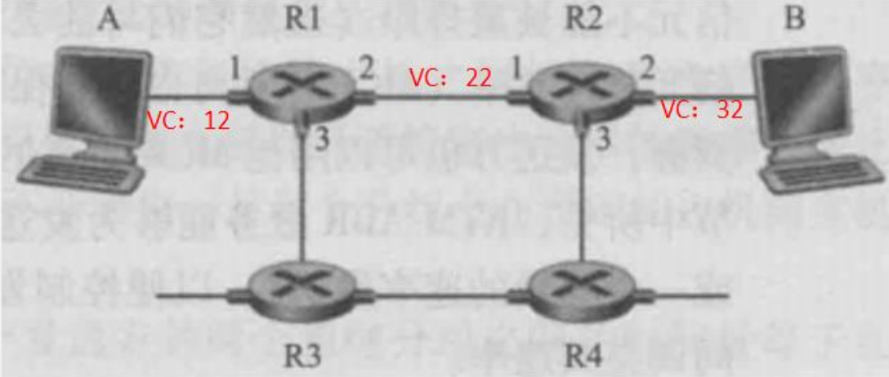

&emsp;&emsp;&ensp;路由器r1的**虚电路表**：
&emsp;&emsp;&ensp;从r1的1接口收到的数据报，如果要从接口2发出，则**相当于发到 ${VC}$ 号为22的链路上**（一个查表的过程）。

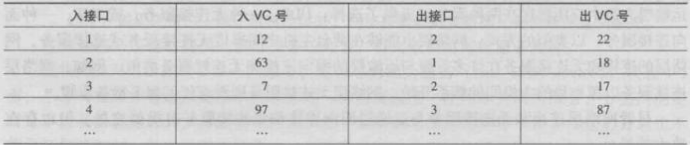

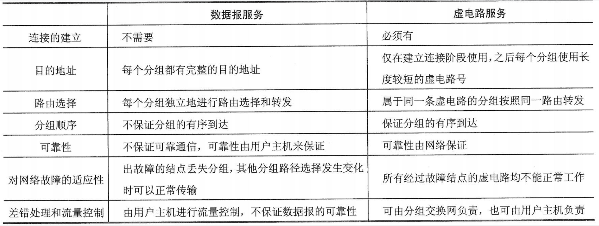

## VLAN协议

&emsp;&emsp;&ensp;支持 ${VLAN}$ 的交换机允许在一个**单一的物理局域网基础设施定义多个虚拟局域网**。在一个 ${VLAN}$ 内的主机彼此通信，交换机的端口（接口）由网络管理员划分为组。每个组构成一个 ${VLAN}$ ，在每个 ${VLAN}$ 中的端口形成一个**广播域**。若两个组需要相互通信，则将 ${VLAN}$ 交换机的一个端口**与一台外部的路由器相连，并且将该端口配置为分别属于两个组**。
&emsp;&emsp;&ensp; ${VLAN}$ 帧由标准以太网帧与加进首部的4字节 ${VLAN}$ 标签组成，而 ${VLAN}$ 标签承载着该帧所属的 ${VLAN}$ 标识符。 ${VLAN}$ 标签由**交换机**加进以太网帧中。 ${VLAN}$ 标签自身由一个2字节的标签协议标识符字段、一个2字节的标签控制信息字段和一个3比特优先权字段组成。

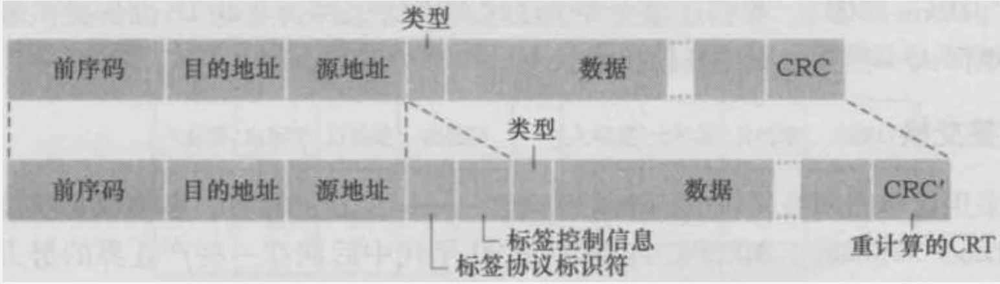

&emsp;&emsp;&ensp;在使用 ${VLAN}$ 交换机策略时，**不需要**在物理上区分哪个主机属于哪台交换机。**所有的交换机逻辑上属于一个大的虚拟交换机**。所有交换机上的主机在逻辑上属于这个大的虚拟交换机（ ${VLAN}$ 交换机内部）。VLAN交换机在整体的，进行虚拟划分出广播域。

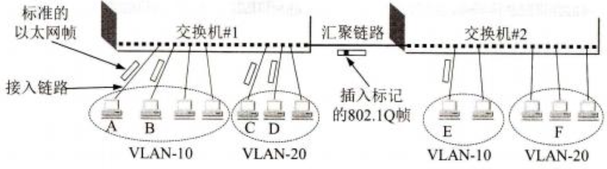

&emsp;&emsp;&ensp;在**同一个广播域内的主机仍然可以正常通信**。但如果两个主机被划分到不同的广播域中，此时两个主机已经属于两个不同的网络。即使物理上处于同一个交换机中，也无法进行相互通信。如果必须通信，则必须要借助网络层的设备-**路由器**来实现。

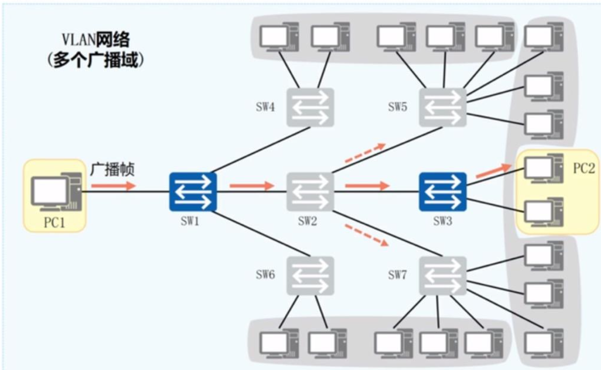

## CSAM/CD与CSMA/CA 

&emsp;&emsp;&ensp;**对于 ${CSMA/CD}$ 协议**，要求 ${传输时间≥2倍传播时间}$。其原因为以太网帧本身不采用确认机制。如果帧在由发送方发出后，在信道上发生碰撞，接收方收到受损的帧后丢弃。但是由于无确认的机制，无论是否正确接收，发送方都无法得知。为了解决发送方可以在无确认的情况下，知道发出的帧在信道上出现了冲突的问题，${CSMA/CD}$ 采用 ${传输时间≥2倍传播时间}$ 的办法，这样如果在传输时间内收到一个帧，则证明其发出的帧出现了冲突，然后停止发送。
&emsp;&emsp;&ensp;这个方法的思想就是发送方在发出帧的同时，也进行碰撞检测。
&emsp;&emsp;&ensp;**对于 ${CSMA/CA}$ 协议**，由于是无线传输，无法监听单一信道，所以无法进行碰撞检测。并且 ${CSMA/CA}$ 还存在隐蔽站问题。如果发送方与接收方相隔距离较远，则发送方无法判断接收方附近是否由其他站存在。
&emsp;&emsp;&ensp; ${CSMA/CD}$ 有两个要点。一是**发送前先检测信道**，信道忙就不发送。二是**边发送边检测信道**，发现碰撞就立即停止发送，并执行退避算法进行重传。因此偶尔发生的碰撞并不会使局域网的运行效率降低很多。
&emsp;&emsp;&ensp;无线局域网无法使用碰撞检测，一旦开始发送数据，就一定把整个帧发送完毕；一旦发生碰撞，整个信道资源的浪费就比较严重。
&emsp;&emsp;&ensp;所以 ${CSMA/CA}$ 协议提出了 ${RTS+CTS}$ 机制。采用上述机制的 ${CSMA/CA}$ 协议，相当于用 ${RTS+CTS}$ 机制建立了连接，只有建立连接后才可以进行数据的传输。所以说如果 ${CSMA/CA}$ 协议采用了 ${RTS+CTS}$ 机制，可以认为采用了上述机制的 ${CSMA/CA}$ 采用了面向连接的思想解决了隐蔽站的问题。

### CTS，RTS机制

&emsp;&emsp;&ensp;由于 ${802.11}$ 无线局域网不使用碰撞检测，一旦站点开始发送一个帧，它就完全地发送该帧。碰撞存在时仍发送整个数据帧将严重降低多路访问协议的性能。为了降低碰撞的可能性主要采取 ${CTS}$，${RTS}$ 信道预约机制。
&emsp;&emsp;&ensp; ${CSMA/CA}$ 协议工作原理：

1. 检测信道：发送数据前，检测信道**是否空闲**；
2. 信道空闲：发送端发出 ${RTS}$（${Request\space To\space Send}$），${RTS}$ 包括发射端地址，接收端地址，发送持续时间等信息；信道忙：等待；
3. 接收端收到 ${RTS}$：发送 ${CTS}$（${Clear\space To\space Send}$）响应;
4. 发送端收到 ${CTS}$：同时执行以下两个操作：
    发送数据：开始发送数据帧；
    预约信道：告知其它站点，自己要传输数据，并给出传输时间；
5. 接收方接收到数据后，使用 ${CRC}$ 循环冗余校验码校验数据是否正确，如果数据正确，返回 ${ACK}$ 确认帧；
6. 发送方**接收到 ${ACK}$ 确认帧后，才进行下一帧的发送**，如果没有收到，则一直重传（**二进制指数退避算法**）。

&emsp;&emsp;&ensp; ${802.11}$ 的二进制指数**退避算法**：${802.11}$ 由于是无线传播，其争用期不能采用类似于以太网 ${CSMA/CD}$ 协议所确定的两端点往返时间作为争用期。因此 ${802.11}$ 的争用窗口采用的是**时隙机制**。
&emsp;&emsp;&ensp;比如，假定一个时隙的长度是9us，假设此时争用窗口大小为15，**意味着该窗口中包含15个时隙**，每个时隙9us。 ${802.11}$ 未能规定争用窗口的大小，但建议最小为15，最大为1023。假定初始征用窗口 ${C_W=2^4–1=15}$，**首次争用信道时，随机退避时隙在0-15生成**。在重传时，第i次重传的 ${C_W=2^{4+i}–1}$。若是**第五次或五次以上，则 ${C_W}$ 在0-1023之间随机生成**。

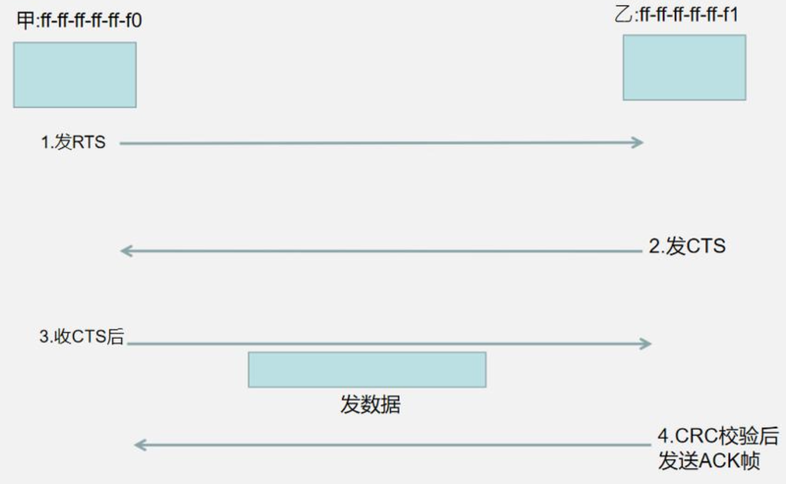

1. 如果题目中的语境考察的是**最长情况**，则隐蔽站应设置的 ${NAV}$ 最长时间为收到主机甲发出的 ${RTS}$ 帧后，根据 ${RTS}$ 帧上的时间字段 ${SIFS+CTS+SIFS+Data+SIFS+ACK}$（假定所有的 ${SIFS}$ 等长）。
2. 若题目考察隐蔽站接收到 ${CTS}$ 后应设置的 ${NAV}$ 时间，则 ${NAV=SIFS+Data+SIFS+ACK}$。
3. 若题目考察**收到 ${Data}$ 帧后**设置的 ${NAV}$ ，则 ${NAV=Data+SIFS+ACK}$。为什么此处仍需加上 ${Data}$ 的时间？防止出现以下情况：比如某站点A和B之间有一堵墙，A和B正在进行通信。而此时有站点C位于发送方A的近距离无阻隔的位置，A发送帧的时候，C会远比B收到的快，此时若收到 ${Data}$ 帧后的 ${NAV}$ 不加上一层 ${Data}$ 时间（这是为了尽可能确保B能够在这个时间收到 ${Data}$ ），可能会导致C提前预判信道结束使用的时间，导致冲突。

&emsp;&emsp;&ensp; ${802.11}$ 标准定义了比 ${SIFS}$ 更长的时间间隔 ${DIFS}$ ，并且规定，**凡在空闲时间想发送数据的站点，必须等待时间 ${DIFS}$ 后才能发送**。其原因是为了保证所有站点发出的确认帧 ${ACK}$ 得以优先发送。这个重要措施使得在这段 ${DIFS}$ 时（${DATA+SIFS+ACK}$），整个信道好像是发送方和接收方专用的，因为其他站点暂时都不能发送数据。

## LLC子层

&emsp;&emsp;&ensp;${LLC}$ 功能有：

1. 向**网络层**提供服务
2. 建立数据链路层的**逻辑连接**（有连接服务的**建立连接就是LLC层建立**）
3. **差错控制，给帧加序号**（三种滑动窗口协议的**帧的序号就是LLC层添加**）

&emsp;&emsp;&ensp; ${MAC}$ 层功能有：

1. **组帧**
2. 比特传输，差错检验，透明传输
3. 寻址， ${MAC}$ 地址就是定义在 ${MAC}$ 层

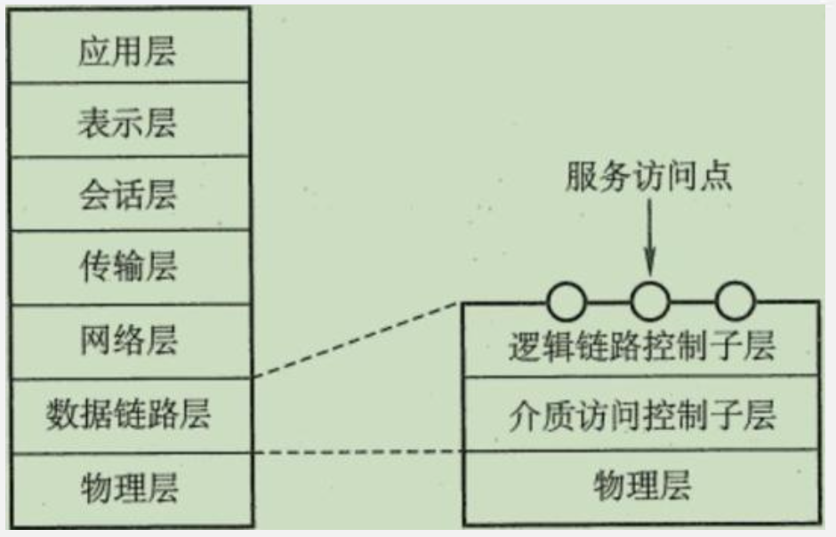

## 三种滑动窗口协议

1. 滑动窗就协议的帧序列号是在链路层的哪个子层添加？
2. 分别写出后退N帧和选择重传协议，帧序列号的比特数和发送窗口，接收窗口的关系。

### 数据链路层-后退N帧协议

&emsp;&emsp;&ensp;帧序号：发送方会维持一组“发送帧序号”，序号的个数取决于**题目跟你说用多少bit编码**。如果题目说用帧序号占用3个 ${bit}$，那么也就表示帧序号理论上最多只能有8种。

&emsp;&emsp;&ensp;发送方会根据帧序号的个数和每个帧的逻辑链路控制子层序号，确定每个帧的帧序号
&emsp;&emsp;&ensp;例如：发送序号字段为 ${3bit}$，代表共有8个帧序号，0-7。如果下一个帧是24号帧，其对应的发送序号为 ${24 \% 8 = 0}$。

&emsp;&emsp;&ensp;发送窗口：发送窗口指的就是发送方可以连续发送帧的个数。如发送窗口为7代表发送方最多可以连续发送7个帧。

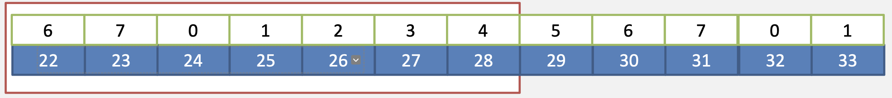

&emsp;&emsp;&ensp;发送窗口的计算公式：${W_{发送}+W_{接收}≤2^n}$
&emsp;&emsp;&ensp;其中W发送，代表发送窗口个数。W接收代表接收窗口的个数。n代表多少个 ${bit}$ 编写帧序号。例如在后退N帧协议下，用3bit来编写帧序号。帧序号最多为8种。由于接收窗口固定为1，那么发送窗口只能为7个。

### 数据链路层-选择重传协议

&emsp;&emsp;&ensp;为进一步提高信道的利用率，可设法只重传出现差错的数据帧或计时器超时的数据帧。所以，一种方案是加大接收窗口，以便先收下发送序号不连续但仍处在接收窗口中的那些数据帧。并给每个收到的帧发送确认。等到所缺序号的数据帧收到后再一并送交主机。 同样以3bit给帧编写帧序号为例：

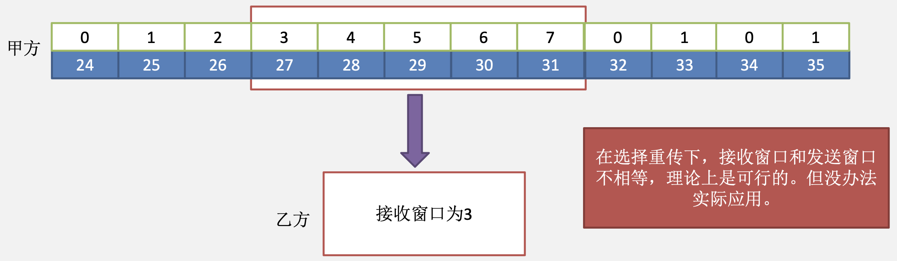

&emsp;&emsp;&ensp;**信道利用率**：也叫信道的效率，通常是从时间角度定义。对发送方而言，发送方在一个发送周期内，有效地发送数据所需要的时间占整个发送周期的比率。
&emsp;&emsp;&ensp;**发送周期**：发送方从发送第一个 ${bit}$ 开始，到接收到第一个确认帧为止。这段时间称为发送周期。
&emsp;&emsp;&ensp;设发送周期为T，这个周期内发送的数据量为L，发送方的速率是C，则发送方用于发送有效数据的时间是 ${L/C}$。在这种情况下，信道的利用率是：${\frac{（L/C）}{T}}$
&emsp;&emsp;&ensp;信道吞吐率：数据实际的传输速率。等于数据传输速率*信道利用率

## SDN

&emsp;&emsp;&ensp;传统网络层的主要任务是数据转发和路由选择。可以将网络层抽象地划分为**数据层面和控制层面**，转发是数据层面实现的功能，而路由选择是控制层面实现的功能。

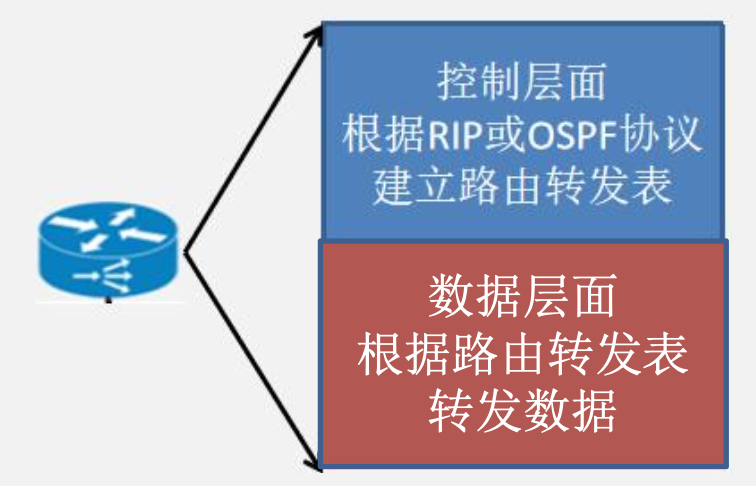

&emsp;&emsp;&ensp;路由器在**控制层面生成路由表**。根据路由表执行数据层面的转发任务。但这样做的一个问题，就是网络上会出现很多用于建立路由表的 ${IP}$ 数据报。
&emsp;&emsp;&ensp;软件定义网络（ ${SDN}$ ），它采用集中式的控制层面和分布式的数据层面，两个层面相互分离。控制层面利用**控制-数据接口**对数据层面上的节点进行集中式控制，方便软件来控制网络。网络中的节点统一由**分组交换机**担任，相比于传统的路由器，**不再需要通过路由协议生成转发表以及互相交换自己的转发表**。在网络的控制层面有一个逻辑上的远程控制器（可以由多个服务器组成）。远程控制器掌握各主机和整个网络的状态，为每个分组计算出最佳路径，通过 ${Openflow}$ 协议（也可以通过其他途径）将转发表（在 ${SDN}$ 中称为**流表**）下发给分组交换机。
&emsp;&emsp;&ensp;分组交换机的工作很单纯，即**收到分组、查找流表（转发表）、转发分组**。

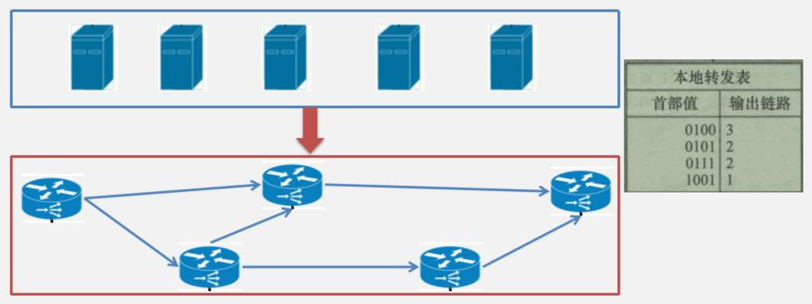

### SDN的工作方式

&emsp;&emsp;&ensp; ${SDN}$ 的可编程性通过为开发者们**提供强大的编程接口**，使得网络具有很好的编程性。对上层应用的开发者， ${SDN}$ 提供的编程接口称为**北向接口**，北向接口提供了一系列丰富的API。开发者可以在此基础上设计自己的应用，而不必关心底层的硬件细节。
&emsp;&emsp;&ensp; ${SDN}$ 控制器通过**南向接口**，把算出的流表（转发表）发给设备中的每个控制代理（分组交换机），由控制代理把流表装载下来。流表装入分组交换机后分组交换机对到来的分组匹配的表项做一些动作。

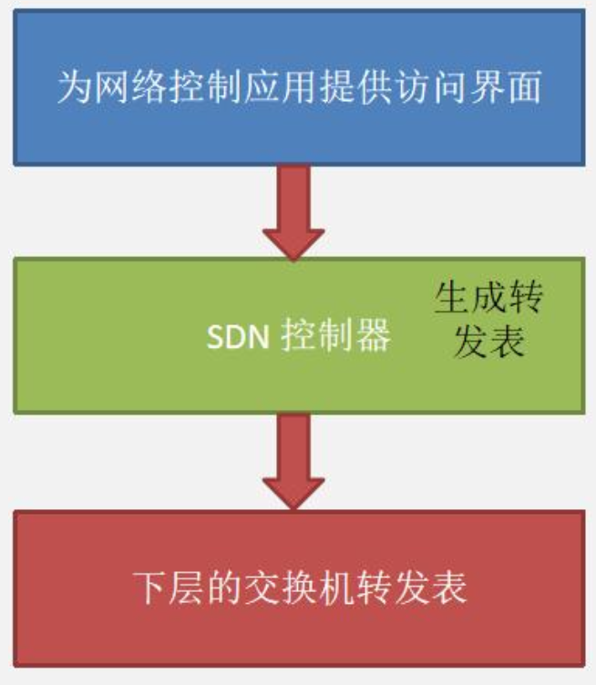

### SDN流表的表项

&emsp;&emsp;&ensp;传统方式下， ${IP}$ 地址根据路由转发表转发。 ${MAC}$ 地址根据链路层转发表转发。而** ${SDN}$ 方式整合了 ${IP}$ 地址， ${MAC}$ 地址和端口号**。 ${SDN}$ 方式下的分组交换机中的流表（转发表），既可以匹配 ${IP}$ 地址，也可以匹配 ${MAC}$ 地址，也可以匹配端口号。转发方式也可以根据以上信息进行转发。

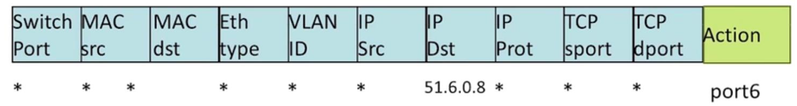

