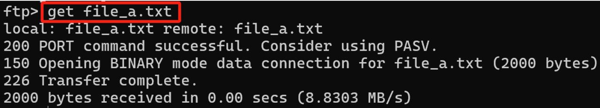

# 物理层+数据链路层+补充

## FTP

&emsp;&emsp;&ensp;FTP的通过**两种类型的TCP连接**完成数据传输过程：
&emsp;&emsp;&ensp;**控制连接**：用于在两主机之间传输控制信息，如1.用户标识信息，2.口令信息，3.改变远程目录命令，以及“存放(put)”和“获取(get)”文件的命令等。
&emsp;&emsp;&ensp;**数据连接**：仅用于实际发送一个文件数据的过程。

### FTP的数据传输流程

&emsp;&emsp;&ensp;以连接FTP服务器并下载文件a，b为例：

1. 客户机通过端口12345(假定)FTP向服务器21端口发起TCP连接请求，并建立连接（控制连接）。
2. 客户机12345端口和FTP服务器21端口传输一些必要口令和用户信息，并完成登录。

3. 客户机发起对文件a的下载请求，并告知服务器，客户机采用54321端口和FTP进行数据连接。
4. FTP服务器的20端口向54321端口发起TCP连接（数据连接）。
5. FTP服务器通过20端口向客户机传输数据。
6. FTP服务器20端口向客户机54321端口断开连接，下载完毕。

7. 客户机发起对文件b的下载请求，并告知服务器，客户机采用56789端口和FTP进行数据连接
8. FTP服务器的20端口向56789端口发起TCP连接
9. FTP服务器通过20端口向客户机传输数据
10. FTP服务器20端口向客户机56789端口断开连接，下载完毕。

11. 客户机结束下载需求，通过12345端口向服务器的21端口发起断开连接请求。
12. FTP服务器的21端口发起FIN=1的帧，开始四次挥手过程，连接断开。

&emsp;&emsp;&ensp;此处由FTP服务器发起的四次挥手断开TCP连接的过程。断开连接后，FTP服务器将通过控制端口发送一个“${transfer\space complete}$”${response}$ 报文。

&emsp;&emsp;&ensp;此处可以注意到，两次数据连接，客户端提供的是不同的端口来给服务器的20号端口进行连接。

&emsp;&emsp;&ensp;此处注意56条，在键盘按下exit后，服务器返回一个 ${response}$“${221\space Goodbye}$”。此时，是**由FTP服务器主动发起的**针对控制连接的断开TCP连接请求（即四次挥手）。

## 物理层

&emsp;&emsp;&ensp;物理层目的：让信号通过编码或调制，实现其在信道上进行传输。
&emsp;&emsp;&ensp;物理层的功能：

1. 提供信道中信号的转换，比如将数字信号调制成模拟信号，或将模拟信号编码成数字信号。
2. 定义低通信道中最大码元传输速率和有噪声情况下的最大数据传输速率。

&emsp;&emsp;&ensp;上述功能实现了信号在信道上进行传输，以及定义了传输的最大速率。
&emsp;&emsp;&ensp;注意：物理层中**所有你学到的计算公式或调制和编码，全部是基于信道之上，而非传输媒体之上**。
&emsp;&emsp;&ensp;物理层考点：

1. 编码与调制：对于数字信号编码成数字信号，数字信号调制为模拟信号，模拟信号调制成模拟信号，模拟信号编码成数字信号。这四种情况在什么时候发生，发生时用什么公式，这是必须清楚的。
2. 香浓定理和奈氏准则
3. 物理层接口的性质
4. 虚电路的性值和辨析

### 传输媒体和信道

&emsp;&emsp;&ensp;传输媒体：传输媒体也称为传输介质或传输媒介，它就是数据传输系统中在发送器和接收器之间的物理通路。传输媒体。可分为两大类，即导引型传输媒体和非导引型传输媒体。

### 物理层接口特性

1) **机械特性**：指明接口所用接线器的形状和尺寸、引脚数目和排列、固定和锁定装置等。
2) **电气特性**：指明在接口电缆的各条线上**出现的电压的范围**。
3) **功能特性**：指明某条线上出现的某种电平的电压**表示何种意义**。
4) **过程特性**：或称**规程特性**。指明对于**不同功能的各种可能事件的出现顺序**。

### 编码与调制

&emsp;&emsp;&ensp;主机中的网卡负责数字信号到数字信号的转换。转换方式主要有曼彻斯特编码，归零编码等。网卡设备把从内存收到的数据经过以下的几种编码法则，转换成另一种数字信号，通过双绞线传递给路由器。

&emsp;&emsp;&ensp;路由器(内置了光猫功能)将收到的数字信号调制成模拟信号，若使用的路由器是光纤路由器，则将数字信号调制成光信号，在将光信号输出。

&emsp;&emsp;&ensp;调制的方法主要有幅移键控(ASK)，频移键控(FSK)，相移键控(PSK)，正交振幅调制(QAM)。考试主要考察的点为正交振幅调制：在频率相同的前提下，将ASK与PSK结合起来，形成叠加信号。设波特率为B，采用m个相位，每个相位有n种振幅，则该QAM技术的数据传输速率R为R = Blog2(mn)(单位为b/s)。
&emsp;&emsp;&ensp;模拟信号调制成模拟信号考试考察的概率不大。其概念主要为 为了实现传输的有效性，可能需要较高的频率。这种调制方式还可以使用频分复用(FDM)技术，充分利用带宽资源。电话机和本地局交换机采用模拟信号传输模拟数据的编码方式，模拟的声音数据是加载到模拟的载波信号中传输的。
&emsp;&emsp;&ensp;当目标主机的路由器(内置光猫)从光纤上收到数据后，需要把模拟信号编码成数字信号。将数字信号发送给目标主机。把模拟信号编码成数字信号的方式为采样定理。

&emsp;&emsp;&ensp;采样定理：原始信号中的最大频率为f，采样频率必须大于等于2f，才能保证采样后的数字信号完整的保留原始的模拟信号的信息。

### 码元

&emsp;&emsp;&ensp;码元的概念：码元是指用一个固定时长的信号波形(数字脉冲)表示一位k进制数字，代表不同离散数值的基本波形，是数字通信中数字信号的计量单位，这个时长内的信号称为k进制码元，而该时长称为码元宽度。
&emsp;&emsp;&ensp;1码元可以携带若干比特的信息量。
&emsp;&emsp;&ensp;**注意：曼彻斯特编码是一个特例。因为曼彻斯特编码包含一个高，低电平表示一个bit的信息，而一次高低电平相当于两个码元。所以对于曼彻斯特编码，是两个码元用来传输1bit的消息**。
&emsp;&emsp;&ensp;码元，可以理解成计组中的时钟周期：假设1秒内会发出四个码元，相当于每0.25秒发出一个码元。相当于该计算机发送一次码元的时钟周期是0.25 秒，也可以理解成频率为4HZ。假设我用0.25秒的+3V电压表示0，+6V电压表示1，-3V电压表示2，-6V电压表示3。

&emsp;&emsp;&ensp;在1.25秒内发出了5个码元，每连续的0.25秒内的电压分别是+3V，-6V，+6V，-3V，+3V。相当于我发出了00， 11，01，10，00这10个bit的数据。
&emsp;&emsp;&ensp;所以码元个数在这里就相当于你发送了多少个连续的电平，而每种连续的电平包含了四种变化。每种变化相 当于是2bit的信息。
&emsp;&emsp;&ensp;所以如果题目给你一秒钟发送码元的个数m个，每个码元中包含4中变化，也就是log4 = 2(以2为底)。则发送的 bit数是2mbit。

### 波特率

&emsp;&emsp;&ensp;波特率又称码元传输速率，它表示单位时间内数字通信系统所传输的码元个数(也可称为脉冲个数或信号变化的次数)，单位是波特(Baud)。1波特表示数字通信系统每秒传输一个码元。码元可以是多进制的，也可以是二进制的，码元速率与进制数无关。

### 奈氏准则

&emsp;&emsp;&ensp;数字信道中信息的传送速率(信息从源主机到目的主机的速率) 对于物理层信息传送速率的计算，主要有两公式，分别为香浓定理和奈氏准则。
&emsp;&emsp;&ensp;奈奎斯特定理：研究码元和带宽之间的关系，又称奈氏准则，在带宽为W (Hz)的低通信道中，若不考虑噪声影响，则码元传输的最高速率是2W (码元/秒)。传输速率超过此上限，就会出现严重的码间串扰的问题，使接收端对码元的判决(即识别)成为不可能。例如，信道的带宽为4000Hz，那么最高码元传输速率就是每秒8000个码元。
&emsp;&emsp;&ensp;用V表示每个码元离散电平的数目(码元的离散电平数目是指有多少种不同的码元，比如有16种不同的码元，则需要4个二进制位，因此数据传输速率是码元传输速率的4倍)，则极限数据率公式为 ${2Wlog_2V}$。

### 香农定理

&emsp;&emsp;&ensp;香农定理：是研究带宽与信噪比之间的关系。
&emsp;&emsp;&ensp;公式为 ${Wlog_2(1+S/N)}$
&emsp;&emsp;&ensp;式中，W为信道的带宽(以Hz为单位)，S为信道内所传信号的平均功率，N为信道内部的高斯噪声功率。当S/N= 10时，信噪比为10dB， 而当S/N= 1000时，信噪比为30dB。
&emsp;&emsp;&ensp;若某无噪声理想信道采用QAM调制，若该信道的最大数据传输速率不小于信噪比为30db条件下的极限数据传输速率。则该信道采用的QAM调制方案是(B)。
A.QAM-16
B.QAM-32
C.QAM-64
D.QAM-128

## 两个子网各层之间的关系

&emsp;&emsp;&ensp;问题：若要链接两个子网，则两个子网的数据链路层协议是否需要一致?两个子网链路层的数据传输速率是否需要一致?若要链接两个冲突域，则两个冲突域的数据链路层协议是否需要一致?两个冲突域的链路层的数据传输速率是否需要一致?若在子网A中的物理层设备，其两端的链路层协议是否需要一致?数据传输速率是否需要一致?

## 虚电路

&emsp;&emsp;&ensp;虚电路的基本概念总结：

1. 虚电路可以确保分组传输的顺序。
2. 虚电路建立时要进行路由选择。
3. 虚电路根据虚电路号VCID进行转发。