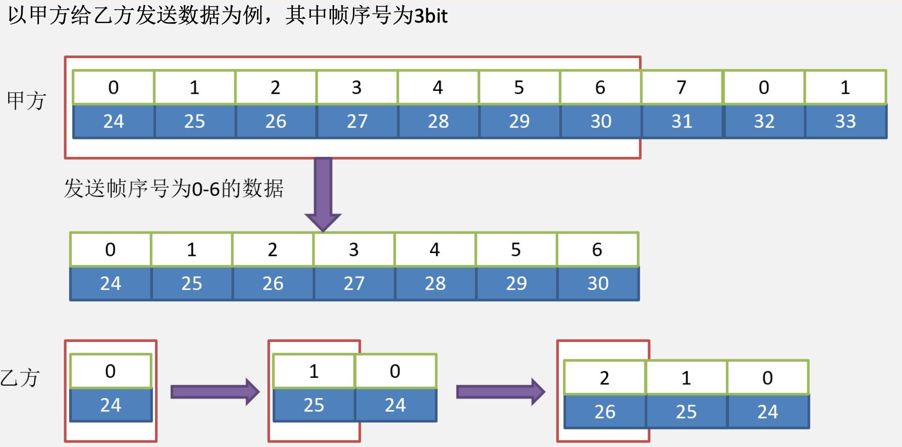
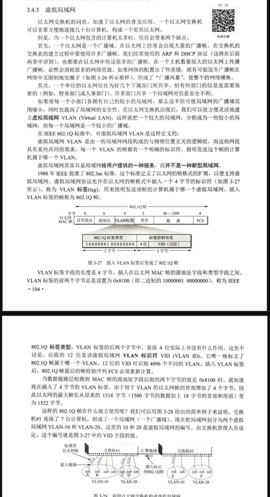

# 数据链路层

&emsp;&emsp;&ensp;数据链路层的目的是：提供相邻两节点之间，以帧为单位进行数据交互。
&emsp;&emsp;&ensp;链路中的节点可以分成两种：主机节点：表示主机或服务器；路由节点：表示路由器。

&emsp;&emsp;&ensp;为了达到数据链路层的目的，也就是提供相邻两节点之间，以帧为单位进行数据传输。需要具备如下几个功能：

1. **封装成帧、差错检测**：网卡把从内存收到的数据，加上网卡表示信息。同时为了让信息具备能检测是否出现 ${bit}$ 错的情况，就需要添加一个用于差错检测的字段。只要根据这个字段就能检测是否有 ${bit}$ 错误。
2. **传输服务**：将数据封装成帧后，对帧**在链路上传输**也要进行规定，如提供可靠的传输服务还是不可靠的传输服务。可靠的传输服务是提供面向连接的可靠传输，还是不面向连接的可靠传输。

## 封装成帧和差错校验

### 封装成帧

&emsp;&emsp;&ensp;把网络层数据添加部分信息组成**数据链路层帧**，该信息主要包括自身网卡地址，目的网卡地址以及差错校验字段。

&emsp;&emsp;&ensp;网卡从主存收到数据后，网卡会将数据添加自己的 ${MAC}$ 地址，添加要发往节点的 ${MAC}$ 地址，以及用于差错校验的 ${FCS}$ 字段。在 ${408}$ 范围内，需要学习的数据帧格式为**以太网帧和 ${VLAN}$ 帧**。

### 差错校验

&emsp;&emsp;&ensp;接收方和发送方双方采用 ${CRC}$ 校验算法给数据添加校验字段，也就是 ${FCS}$ 字段。采用 ${CRC}$ 校验能判断出帧是否发生 ${bit}$ 错误。若未发生 ${bit}$ 错误则网卡将帧上交给上层，若出现错误则将该帧丢弃。

## 检错编码和纠错编码

### 检错编码

&emsp;&emsp;&ensp;**奇偶校验码**：奇偶校验码是**奇校验码和偶校验码的统称**，是一种最基本的检错码。它由 ${n-1}$ 位信息元和 ${1}$ 位校验元组成，如果是奇校验码，那么在附加一个校验元后，码长为 ${n}$ 的码字中 ${1}$ 的个数为奇数；如果是偶校验码，那么在附加一个校验元以后，码长为 ${n}$ 的码字中 ${1}$ 的个数为偶数。它只能检测奇数位的出错情况，但并不知道哪些位错了，也不能发现偶数位的出错情况。
&emsp;&emsp;&ensp;**${CRC}$ 校验算法**

&emsp;&emsp;&ensp;采用模 ${2}$ 除和异或运算。在此题的背景下，生成多项式的最高次幂是 ${3}$，则 ${FCS}$ 字段占 ${3bit}$；首先给待发送序列后面添上 **${3}$ 个 ${0}$**，变成共 ${9}$ 位的序列；对这 ${9}$ 位序列进行模 ${2}$ 除（除数为生成多项式的系数）和异或运算；

&emsp;&emsp;&ensp;此时的余数 ${001}$ 即为**最后的 ${FCS}$ 字段**，最终就是**完整的 ${9bit}$ 信息**。
&emsp;&emsp;&ensp;在数据链路层若仅仅使用循环冗余检验 ${CRC}$ 差错检测技术，则**只能做到对帧的无差错接受**。若接收端发现该帧出错，则不会接收。以上所述的可以近似地表述为（通常都是这样认为）：“**凡是接收端数据链路层接受的帧均无差错，即帧本身的数据没有因为信道传输而出现 ${bit}$ 错误**”。
&emsp;&emsp;&ensp;比如接收到的数据为数据 ${101, 001, 001}$ 和 ${101, 011, 001}$。前者是无 ${bit}$ 错误的，后者的检测过程依旧为**对该序列进行模 ${2}$ 除和异或运算（除数为生成多项式的系数）**：

&emsp;&emsp;&ensp;若得到非零余数，则可判断数据出错；若余数为零，则没有出现 ${bit}$ 错。

### 纠错编码

&emsp;&emsp;&ensp;对于上文提到的 ${CRC}$ 编码，可以**检测出数据帧是否出现错误**，具有这种功能的编码叫做**检错编码**。如果想要把错误地方改成正确的，那么就需要纠错编码。**纠错编码的代表为海明码**。 

## 滑动窗口协议（重点）

&emsp;&emsp;&ensp;${OSI}$ 的观点是，必须让数据链路层向上**提供可靠传输**。因此在 ${CRC}$ 检错的基础上，增加了**帧编号、确认和重传机制**。接收方收到正确的帧后，向发送方发送确认。发送方在一定的期限内若没有收到对方的确认，认为出现了差错，随后进行重传。数据链路层存在三种协议可以在引导型传输媒体提供可靠传输。分别是：**停止等待协议、后退 ${N}$ 帧协议、选择重传协议**。
&emsp;&emsp;&ensp;比如题目说主机 ${G}$ 和主机 ${H}$ 使用后退 ${N}$ 帧协议，证明 ${G}$ 到 ${H}$ 这段链路的链路层**使用无连接，有确认的传输方式，是可靠连接**。

### 停止等待协议

&emsp;&emsp;&ensp;每发送完一个分组就停止发送，等待对方确认，在收到确认后再发送下一个分组。若未收到确认则进行超时重传。
&emsp;&emsp;&ensp;窗口大小：发送窗口和接收窗口均为 ${1}$。

&emsp;&emsp;&ensp;红框代表发送窗口，绿窗代表接收窗口。发送窗口和接收窗口的个数均为 ${1}$。

&emsp;&emsp;&ensp;缺点：一次只能发一个帧，效率太慢。

&emsp;&emsp;&ensp;对于数据链路层，广义上可以更详细的分成两个子层分别是**逻辑链路控制子层**和**介质访问控制子层**。 
&emsp;&emsp;&ensp;介质访问控制子层（也称 ${MAC}$ 层）功能有：

1. 给帧**添加 ${MAC}$ 地址和拆除帧的 ${MAC}$ 地址**；
2. 提供**差错检验**机制，并实现**透明传输**。

&emsp;&emsp;&ensp;逻辑链路控制子层（${LLC}$）功能有：

1. 有确认有连接的情况：建立数据链路层的逻辑连接。（有连接服务的建立连接是 ${LLC}$ 层建立）
2. 有确认无连接的情况：给帧加逻辑链路控制子层序号。（滑动窗口协议的帧的序号就是 ${LLC}$ 层添加）

### MAC子层和LLC子层

&emsp;&emsp;&ensp;介质访问控制子层（也称 ${MAC}$ 层）功能有：

1. 给帧**添加 ${MAC}$ 地址和拆除帧的 ${MAC}$ 地址**；
2. 提供**差错检验**机制，并实现**透明传输**。

&emsp;&emsp;&ensp;注意：如果只把内存传来的数据添加 ${MAC}$ 地址，是没办法从 ${MAC}$ 地址上区分出帧和帧的区别。因为可能多个帧的 ${MAC}$ 地址相同。除非你检索其中的内容才能发现帧和帧的区别，但这样做的效率是很低的。

&emsp;&emsp;&ensp;逻辑链路控制子层（${LLC}$）功能有：

1. 有确认有连接的情况：建立数据链路层的**逻辑连接**。（**有连接服务的建立连接是 ${LLC}$ 层建立**）
2. 有确认无连接的情况：给帧加**逻辑链路控制子层序号**。（滑动窗口协议的帧的序号就是 ${LLC}$ 层添加）

&emsp;&emsp;&ensp;当给帧加上逻辑链路控制子层序号后，相当于给帧加上了**逻辑顺序**。这样在不访问帧的内容的情况就可以区分出数据 ${2}$ 的帧和数据 ${1}$ 的帧。

### 后退N帧协议

&emsp;&emsp;&ensp;针对停止等待协议的弊端，提出**多个帧发送技术**。在该情况下，发送方可以连续发送多个帧，发送窗口由停止等待协议的 ${1}$ 个升级为多个发送窗口，也就是可以连续发送多个帧。**接收窗口保持不变，仍为 ${1}$**。
&emsp;&emsp;&ensp;**逻辑链路控制子层序号**：在有确认无连接的传输服务下，每个数据链路层的帧都要设置一个**自己的逻辑链路控制子层序号**，如发送方有 ${100}$ 个帧要发送，那么会给这 ${100}$ 个帧分别赋予 ${0-99}$ 的逻辑链路控制子层序号。
&emsp;&emsp;&ensp;**帧序号**：发送方会维持一组“**发送帧序号**”，序号的个数取决于题目**跟你说用多少 ${bit}$ 编码**。如果题目说用帧序号占用 ${3}$ 个 ${bit}$，那么也就表示帧序号理论上最多只能有 ${8}$ 种。（补充：有了 ${LLC}$ 子层序号，为什么还需要帧序号？因为每批要发送的帧的个数是不同的，若需要发送 ${100}$ 个帧，则需要用 ${7bit}$ 去编码；若需要发送 ${10}$ 个帧，则需要 ${4bit}$ 去编码。此时很明显会出现序号位数不固定的问题，此时收到的数据帧，**很难确认哪部分属于数据、哪部分属于 ${LLC}$ 序号，可能造成错误**。）
&emsp;&emsp;&ensp;发送方会根据帧序号的个数和每个帧的逻辑链路控制子层序号，确定每个帧的帧序号。滑动窗口协议会将由逻辑链路控制子层计算得来的帧序号与数据内容，共同构成数据部分。
&emsp;&emsp;&ensp;例如：发送序号字段为 ${3bit}$，代表共有 ${8}$ 个帧序号，${0-7}$。如果下一个帧是 ${24}$ 号帧，其对应的发送序号为 ${24 \% 8 = 0}$。

&emsp;&emsp;&ensp;发送窗口：发送窗口指的就是发送方可以连续发送帧的个数。如发送窗口为 ${7}$ 代表发送方最多可以连续发送 ${7}$ 个帧。

&emsp;&emsp;&ensp;发送窗口的计算公式：${W_{发送} + W_{接收} ≤ 2^n}$
&emsp;&emsp;&ensp;其中 ${W_{发送}}$，代表发送窗口个数；${W_{接收}}$ 代表接收窗口的个数。${n}$ 代表多少个 ${bit}$ 编写帧序号。例如在后退 ${N}$ 帧协议下，用 ${3bit}$ 来编写帧序号。帧序号最多为 ${8}$ 种。**由于接收窗口固定为 ${1}$，那么发送窗口最多为 ${7}$ 个**。

&emsp;&emsp;&ensp;如果乙方按序，无差错，无丢失的收到全部数据，会采用**累计确认**的方式，对帧序号 ${6}$ 发送确认帧。发送帧序号 ${6}$ 的确认代表：**从帧序号为 ${0}$ 的数据到帧序号为 ${6}$ 的数据全部按序，无差错，无丢失的接收**。（注意：乙方**只会识别数据的帧序号**，而不会识别数据的逻辑链路控制子层序号。）

&emsp;&emsp;&ensp;为什么在 ${3bit}$ 给帧序号编号的情况下，发送窗口最大只能是7。

&emsp;&emsp;&ensp;若出现这种情况，如果发送窗口为 ${8}$，接收方无法判断是这次的 ${8}$ 个数据从 ${帧序号为1-帧序号为0}$ 的数据全部收到，还是**数据全部出错**。

### 选择重传协议

&emsp;&emsp;&ensp;由于后退 ${N}$ 帧协议，若前一个帧接收时出现问题，则后续所有的帧即使没有出现任何问题，也均无法正确接收。为了提升接收方的接收效率，我们提出了**选择重传协议**。
&emsp;&emsp;&ensp;选择重传协议在后退N帧协议的基础上**增加了接收方的接收窗口**，这样即使中间某个帧出现问题，后续的帧如果不出错的话也能正常接收。 
&emsp;&emsp;&ensp;为进一步提高信道的利用率，可设法**只重传出现差错的数据帧或计时器超时的数据帧。**所以，一种方案是**加大接收窗口**，以便先收下发送序号不连续但仍处在接收窗口中的那些数据帧，并给每个收到的帧发送确认。等到所缺序号的数据帧收到后再一并送交主机。
&emsp;&emsp;&ensp;发送窗口的计算公式：${W_{发送} + W_{接收} ≤ 2^n}$
&emsp;&emsp;&ensp;在选择重传实际使用过程中，发送窗口必须等于接收窗口才能保证协议的正常传输数据。同样以 ${3bit}$ 给帧编写帧序号为例：

&emsp;&emsp;&ensp;若全部数据**均正确接收**，选择重传会给每个收到的帧发送一个**确认帧**。发送后将数据上传到上层（**从网卡发到内存**）。 

&emsp;&emsp;&ensp;若中间某个数据缺失，则缺失的帧不会返回确认，**只会对收到的帧返回确认**。发送方若经过一个超时时间后还没有收到 ${2}$ 号帧的确认，则**启动超时重传**。

&emsp;&emsp;&ensp;由于选择重传协议的接收窗口等于发送窗口，所以即使数据乱序接收，选择重传仍有足够的缓存用于接收乱序的帧，并将数据按顺序整理后发给上层。

&emsp;&emsp;&ensp;注意：若接收方发出的**某个确认帧丢失**，发送方由于未收到该确认产生超时重传事件，重传该数据帧。接收方收到后**会重新对这个帧发送一个确认，但并不会将数据传给上层，而是直接丢弃**。此外，该协议使用了比上述其他协议更有效的差错处理策略，**即一旦接收方怀疑帧出错，就会发一个否定帧 ${NAK}$ 给发送方，要求发送方对 ${NAK}$ 中指定的帧进行重传**。

&emsp;&emsp;&ensp;以甲方给乙方发送数据为例，其中帧序号为 ${3bit}$，若帧序号为 ${4}$ 的帧发生丢失。

### 信道利用率

&emsp;&emsp;&ensp;信道利用率：也叫信道的效率，通常是从时间角度定义。对发送方而言，发送方在一个发送周期内，**有效地发送数据所需要的时间占整个发送周期的比率**。
&emsp;&emsp;&ensp;发送周期：发送方从发送第一个 ${bit}$ 开始，到接收到第一个确认帧为止。这段时间称为发送周期。
&emsp;&emsp;&ensp;设发送周期为 ${T}$，这个周期内发送的数据量为 ${L}$，发送方的速率是 ${C}$，则发送方用于发送有效数据的时间是 ${L/C}$。
&emsp;&emsp;&ensp;在这种情况下，信道的利用率是：${(L / C)/T}$；信道吞吐率：**数据实际的传输速率**，即数据传输速率 * 信道利用率。

## 以太网（重点）

&emsp;&emsp;&ensp;无确认的无连接服务：源机器发送数据帧时不需先建立链路连接，目的机器收到数据帧时不需发回确认。对丢失的帧，数据链路层不负责重发而交给上层处理。
&emsp;&emsp;&ensp;以太网需要了解的三部分：以太网帧格式；介质访问控制协议；以太网交换机。

### 以太网帧的结构

&emsp;&emsp;&ensp;计算机网络规定，以太网帧的总长度不能小于 ${64B}$，不能大于 ${1518B}$。
&emsp;&emsp;&ensp;类型字段（${2}$ 个字节）：用来标志上一层使用的是什么协议，以便把收到的 ${MAC}$ 帧的数据上交给上一层的这个协议；
&emsp;&emsp;&ensp;数据字段（${46-1500}$）：正式名称是 ${MAC}$ 客户数据字段。数据部分的最小长度为 ${46}$ 字节，数据部分的最大长度为 ${1500}$ 字节。必须控制在这个范围内；
&emsp;&emsp;&ensp;${FCS}$ 字段（${4}$ 字节）：${CRC}$ 校验字段，需要校验**以太网帧的目的地址，源地址，类型部分以及数据部分**。

### 网卡细节

&emsp;&emsp;&ensp;计算机与外界局域网的连接是通过主机箱内**插入的一块网络接口卡（网卡）实现的**。网卡上装有处理器和存储器，是工作在**数据链路层**的网络组件。
&emsp;&emsp;&ensp;网卡和局域网的通信是通过**电缆或双绞线以串行方式**进行的。

&emsp;&emsp;&ensp;网卡不仅能实现与局域网传输介质之间的**物理连接和电信号匹配**，还涉及**帧的发送与接收、帧的封装与拆封、介质访问控制、数据的编码与解码及数据缓存功能**等。
&emsp;&emsp;&ensp;全世界的每块网卡在出厂时都有一个**唯一的代码**，称为介质访问控制（${MAC}$）地址，这个地址用于**控制主机在网络上的数据通信**。

### 以太网传输介质

&emsp;&emsp;&ensp;以太网传输介质的命名规则 ${10Base2}$（${IEEE 802.3a}$）
&emsp;&emsp;&ensp;${10}$：传输带宽（${Mbps}$）
&emsp;&emsp;&ensp;${Base}$：基带传输
&emsp;&emsp;&ensp;${2}$（或 ${5}$）：支持的分段长度（${100m}$ 为单位，四舍五入），此处为 ${200m}$ 传输距离。

### 以太网和局域网

&emsp;&emsp;&ensp;以太网**逻辑上采用总线形拓扑结构**，以太网中的所有计算机共享同一条总线，信息**以广播方式**发送。在 ${408}$ 计网考研中，会将**以太网组成的小型网络称为局域网**。

&emsp;&emsp;&ensp;和计组中寄存器经过总线发往另一个寄存器的原理类似。当逻辑上连接在同一个以太网（或局域网）中的主机。当主机 ${1}$ 发送一条消息时。主机 ${2, 3, 4}$ 实际上均能在总线上收到这个消息。只是会根据目的 ${MAC}$ 地址是否为自己而选择是否接收数据。
&emsp;&emsp;&ensp;由于以太网内的主机采用**异步传输**，而主机内部寄存器的数据传输采用**同步传输方式**，所以主机之间可以随意的发送消息到链路上。**这就很容易造成数据冲突的问题**。

### 以太网信道竞争问题

&emsp;&emsp;&ensp;在**有确认的链路环境**下，由于确认机制的存在，发送方只需要判断是否能在超时时间内收到确认帧，就能知道数据是否在信道上发生冲突。在有确认的链路环境下，接收方在收到一个帧之后，会给发送方返回一个确认帧。**发送方如果收到确认帧，证明数据在链路上没有出现问题**。若数据在信道上发生冲突，接收方则不会给出确认帧。所以**在有确认的链路环境下，就不需要在进行冲突检测方案，冲突检测由确认帧来完成**。

&emsp;&emsp;&ensp;以太网：采用**无确认，无连接**的方式。也就是说接收方收到帧后**无论帧是否正确接收，都不会给出确认**。所以在以太网环境下，发送方无法通过确认帧来判定自己的帧是否正确接收。
&emsp;&emsp;&ensp;因此，以太网需要采用一种机制，以保证发送方**在无确认机制的前提下，也能够知道自己发出的数据是否在信道上与其他帧发生冲突**。这种方式就是 ${CSMA/CD}$ 协议。 
&emsp;&emsp;&ensp;${CSMA/CD}$（载波侦听多路访问/冲突检测协议）的目的：保证逻辑上是总线拓扑，**信息以广播方式传输**的条件下，实现在**发送数据的过程中就可以检测到数据冲突**。并在发现冲突数据后立刻停止传输数据，${CSMA/CD}$ 的最重要的目的是**检测冲突**。

### 以太网介质访问控制

&emsp;&emsp;&ensp;**${CSMA/CD}$（载波监听多路访问/冲突检测）**：
&emsp;&emsp;&ensp;所谓载波监听，意思是网络上所有工作站在发送数据前都要**确认总线上有没有数据传输**。（谢书中定义，以太网规定了**帧间最小间隔为传输 ${96}$ 比特时间**。这样做是为了使刚到数据帧的站的接收缓存来得及清理，做好接收下一帧的准备。不过此点并未考过，大家了解即可。）
&emsp;&emsp;&ensp;所谓多路访问，意思是网络上所有工作站收发数据共同使用同一条总线，且**发送数据是广播式的**。所有主机都能收到信道上传来的数据。 
&emsp;&emsp;&ensp;${CSMA/CD}$ 通过让**传输时延和传播时延**维持一个关系，来完成检测冲突的目的。
&emsp;&emsp;&ensp;为了让发送站在发送数据的同时也能检测到发出的数据可能存在的碰撞，需要让**整个帧的传输时延 ≥ 端到端的传播时延 * 2**，才能保证**发送方在帧还未发送完就能检测到冲突**。 
&emsp;&emsp;&ensp;**传输时延**：数据从发送端口，发送到总线上所需要的时间
&emsp;&emsp;&ensp;**传播时延**：数据在总线上传播所需要的时间。
&emsp;&emsp;&ensp;**争用期**：以太网总线上两个端到端的节点，其**往返时间称为争用期，也称碰撞窗口**。
&emsp;&emsp;&ensp;**最长检测到冲突时间**：甲，乙双方为信道上距离最长的两个主机。若甲方发送的数据，在到达乙方那一刻，乙方发出了数据，此时数据冲突。假设从甲到乙的单向传播时延是 ${5}$ 秒，那么甲从发出这个帧开始，经过 ${5}$ 秒的时候数据到达乙并产生冲突。在经过 ${5}$ 秒的时间，乙发出的帧到达甲。甲从发出数据开始，到收到发生冲突的乙的数据为止。共用 ${10}$ 秒。

&emsp;&emsp;&ensp;在中间处冲突情况：若甲发出数据的同时，乙也发出数据。若单项传播时延仍为 ${5}$ 秒的情况，甲和乙发出的数据以同样的速度在信道上传播。那么在经过 ${2.5}$ 秒后，甲乙的数据冲突。而再经过 ${2.5}$ 秒后，乙的数据到达甲，甲的数据到达乙。双方均发现冲突。

&emsp;&emsp;&ensp;任意处检测到冲突时间：若甲到乙的单向传播时延为 ${τ}$，在甲发出 ${a}$ 秒后，乙发出数据。那么从甲发出数据开始，经过 ${τ+a}$ 的时间甲收到乙发出的已经冲突的数据。 
&emsp;&emsp;&ensp;乙在发出数据后，经过 ${τ-a}$ 的时间内发现数据碰撞。

### 以太网帧计算

&emsp;&emsp;&ensp;为了达到在发帧的过程中，可以检测到数据发生碰撞。所以要求：
&emsp;&emsp;&ensp;${数据的发送时延 ≥ 2*数据传播时延}$
&emsp;&emsp;&ensp;若满足如下条件。那么发送方在数据帧全部发送完之前，就能检测到是否冲突。从而判断出他发出的帧是否为一个有效帧。
&emsp;&emsp;&ensp;**最小帧长的计算公式**：${最小帧长 = 传播时延 * 2 * 数据传输速率}$
&emsp;&emsp;&ensp;**两个主机的最长距离**：最长距离 = ${传播时延 * 信号传播速度}$ = ${最小帧长 ÷ 数据传输速率 ÷ （2 * 信号传播速度）}$
&emsp;&emsp;&ensp;**传输时延**：数据从发送端口发送到总线上所需要的时间
&emsp;&emsp;&ensp;**传播时延**：数据在总线上传输所需要的时间

### 二进制退避算法

&emsp;&emsp;&ensp;若已经发生了帧碰撞，则双方在检测到碰撞后，并不会立刻重新发送这个帧，而是等待一定的时间后在发送，这个时间是靠二进制指数退避算法决定。
&emsp;&emsp;&ensp;二进制指数退避算法：

1. 确定基本退避时间，一般定为 ${2τ}$，${τ}$ = 传播时延，${2τ}$ 称为争用期。
2. 定义一个参数 ${K}$，表示重传次数，${K = min[重传次数, 10]}$，可见 ${K ≤ 10}$
3. 从离散型整数集合 ${[0，1，2，… ...，(2^k -1)]}$ 中，随机取出一个数记做 ${R}$。重传所需要的退避时间为 ${R}$ 倍的基本退避时间即：${T = R * 2τ}$。
4. 同时，重传也不是无休止的进行。**当重传 ${16}$ 次不成功，就丢弃该帧，传输失败**。报告给高层协议。

&emsp;&emsp;&ensp;举例：如果是第二次发生碰撞且单向传播时延为 ${5}$ 秒：${n = 2k = MIN(2, 10) = 2}$，${R = \{0, 1, 2, 3\}}$，双方的延迟时间 = ${\{0，10，20，30\}}$，其中任取一值。

### 高速以太网

#### ${100BASE-T}$ 以太网

&emsp;&emsp;&ensp;${100BASE-T}$ 是在双绞线上传送 ${100Mbit/s}$ 基带信号的星形拓扑以太网，仍使用 ${IEEE802.3}$ 的 ${CSMA/CD}$ 协议，它又称为**快速以太网**。用户只要使用 ${100Mbit/s}$ 的网卡和 ${100Mbit/s}$ 的集线器或交换机，就可很方便地由 ${10BASE-T}$ 以太网直接升级到 ${100Mbit/s}$，而**不必改变网络的拓扑结构**。
&emsp;&emsp;&ensp;${100BASE-T}$ **可使用以太网交换机，可以在全双工方式和半双工方式下提供服务**。 
&emsp;&emsp;&ensp;在**全双工方式**下工作，由于可以同时发送和接收，所以**不需要进行冲突避免策略**。因此，${CSMA/CD}$ 协议对全双工方式工作的快速以太网是不起作用的，在**半双工方式工作时**则一定要使用 ${CSMA/CD}$ 协议。通过 ${CSMA/CD}$ 协议提供的冲突检测方式，从而达到**半双工方式**的目的。

#### 吉比特以太网

&emsp;&emsp;&ensp;吉比特以太网有以下几个特点：
&emsp;&emsp;&ensp;允许在 ${1 Gbit/s}$ 下以**全双工和半双工**两种方式工作。
&emsp;&emsp;&ensp;**使用 ${IEEE 802.3}$ 协议规定的帧格式**。
&emsp;&emsp;&ensp;在半双工方式下使用 ${CSMA/CD}$ 协议，而在全双工方式不使用 ${CSMA/CD}$ 协议。 
&emsp;&emsp;&ensp;与 ${10BASE-T}$ 和 ${100BASE-T}$ 技术向后兼容。
&emsp;&emsp;&ensp;吉比特以太网还增加了一种功能称为**分组突发（${packet\quad bursting}$）**。当很多短帧（小于 ${512B}$）要发送时，**第一个短帧进行数据填充**，将随后的一些短帧填充进去，它们之间**只需留有必要的帧间最小间隔即可**。这样就形成一串分组的突发，直到达到 ${1500}$ 字节或稍多一些为止。
&emsp;&emsp;&ensp;当吉比特以太网工作在**全双工方式时（即通信双方可同时进行发送和接收数据），不使用分组突发方式**。

#### ${10}$ 吉比特以太网（${10 GbE}$）

&emsp;&emsp;&ensp;${10 GbE}$ 的帧格式与 ${10Mbit/s}$， ${100Mbit/s}$ 和 ${1 Gbit/s}$ 以太网的帧格式完全相同，并保留了 ${802.3}$ 标准规定的**以太网最小帧长和最大帧长**。${10 GbE}$ 只工作在**全双工方式**，因此不存在争用问题，当然也不使用 ${CSMA/CD}$ 协议。这就使得 ${10 GbE}$ 的传输距离大大提高了（因为**不再受必须进行碰撞检测的限制**）。

## 无线通讯

### CSMA/CA无线通讯（有确认无连接）

&emsp;&emsp;&ensp;${CSMA/CA}$ 协议，全称为载波监听多点接入/碰撞避免。目的是为了在无线通讯的情况下实现帧的传递。
&emsp;&emsp;&ensp;疑点1：为什么 ${CSMA/CA}$ 协议采用碰撞避免，而非采用 ${CSMA/CD}$ 的碰撞检测？
&emsp;&emsp;&ensp;检测到碰撞，就立即停止发送。但由于无线信道的传输条件特殊，其信号强度的动态范围非常大，因此在网卡上接收到的信号强度往往会远远小于发送信号的强度（信号强度可能相差百万倍）。因此**无线局域网的网卡无法实现碰撞检测，因为信号随着传播而衰减太过严重**。
&emsp;&emsp;&ensp;同时，电磁波很容易被物体格挡，使得信号的传播范围大大降低。因此在无线通讯传递下，无法做到碰撞检测，所以只能采用碰撞避免的策略。如图所示，如果 ${A}$ 和 ${B}$ 即使距离很近，但由于中间隔着墙壁，使得信号传递受阻。若没有墙壁的情况下，${A}$ 能感知到 ${B}$ 和 ${C}$。在有墙壁的情况下，${A}$ 只能感知到 ${B}$ 而无法感知到 ${C}$。**对于 ${A}$ 来说，${C}$ 就是隐蔽站**。

&emsp;&emsp;&ensp;为了解决隐蔽站和无法进行碰撞检测而带来的问题，**采用 ${RTS}$ 和 ${CTS}$ 策略进行信道预约**，从而解决隐蔽站和实现碰撞避免。

### CSMA/CA协议工作原理

&emsp;&emsp;&ensp;**检测信道**：发送数据前，检测信道是否空闲。若信道此时空闲，则等待一段 ${DIFS}$ 时间。若这段时间内仍空闲，则向上报告信道空闲。
&emsp;&emsp;&ensp;**信道空闲**：发送端发出 ${RTS（Request\quad To\quad Send）}$，目的是告诉其他主机，我要占用信道一段时间，具体的时间会写在 ${RTS}$ 帧的首部。**若信道忙**：等待，当信道空闲且经过 ${DIFS}$ 时间后仍空闲则认为信道空闲；
&emsp;&emsp;&ensp;**接收端收到RTS**：会进行 ${CRC}$ 帧校验，这段校验时间为 ${SIFS}$。通过帧校验后发送 ${CTS（Clear\quad To\quad Send）}$ 响应。目的不仅是告诉发送站：你可以发送数据了，而且也是告诉所有能够收到 ${CTS}$ 帧的站：${A}$ 站和我通信要占用信道一段时间。这段时间是写在控制帧 ${CTS}$ 的首部中，让发送方的隐蔽站也尽可能收到。
&emsp;&emsp;&ensp;**发送端收到CTS**：会先进行 ${CRC}$ 校验，需要一个 ${SIFS}$ 时间。经过这段时间后，发送数据并达到以下两个目的：**发送数据**：开始发送数据帧；**预约信道**：告知其它站点，自己要传输数据，并给出一段时间，这段时间会写在帧的首部；
&emsp;&emsp;&ensp;接收方接收到数据后，使用 ${CRC}$ 循环冗余校验码校验数据是否正确，需要一个 ${SIFS}$ 时间，如果数据正确，返回 ${ACK}$ 确认帧；
&emsp;&emsp;&ensp;发送方接收到 ${ACK}$ 确认帧后，才进行下一帧的发送，如果没有收到，则一直重传，直到 ${16}$ 次失败为止（退避算法）。

1. 甲方发出的 ${RTS}$ 中包含的时间是整个数据的传输时间包括：${SIFS1 + CTS + SIFS2 + Data + SIFS3 + ACK}$，目的是告诉其他主机，我要占用信道一段时间。
2. 乙方发出的 ${CTS}$ 中包含的时间：${SIFS2 + Data + SIFS3 + ACK}$，目的不仅是告诉发送站：你可以发送数据了，而且也是告诉所有能够收到 ${CTS}$ 帧的站：${A}$ 站和我通信要占用信道一段时间。
3. 甲方收到 ${CTS}$ 后，进行 ${CRC}$ 校验后，发出 ${Data}$。${Data}$ 中包含的时间：${Data + SIFS3 + ACK}$。如果有的站没有收到 ${RTS}$ 和 ${CTS}$ 帧，那么收到 ${DATA}$ 帧后，也能知道时间。
4. 甲发送数据帧 ${DATA}$ 开始，到收到确认 ${ACK}$ 为止的这段时间：${DATA + SIFS + ACK}$，**必须不允许任何其他站发送数据**，这样才不会发生碰撞。为此，${802.11}$ 标准规定了每个站必须同时使用以下的两个方法。
   1. 用**软件实现的虛拟载波监听**。让源站甲把要占用信道的时间（${DATA + SIFS + ACK}$）写入其数据帧 ${DATA}$ 的首部。所有处在甲的广播范围内的各站，都能够收到这一信息。并创建自己的**网络分配向量 ${NAV}$**。${NAV}$ 指出了信道忙的持续时间，意思是：“甲和乙以外的站点都不能在这段时间发送数据”。
   2. 是在**物理层用硬件实现载波监听**。每个站检查收到的信号强度是否超过一定的门限数值，用此判断是否有其他移动站在信道上发送数据。任何站要发送数据之前，必须监听信道。只要监听到信道忙，就不能发送数据。

&emsp;&emsp;&ensp;即使我们使用 ${RTS}$ 和 ${CTS}$ 对信道进行了预约，但**碰撞也有可能发生**。例如，有的站可能没有收到 ${RTS}$，在发送方 ${A}$ 发送 ${RTS}$ 时，给接收方 ${B}$ 发送了数据，结果必定与 ${RTS}$ 帧发生碰撞。${B}$ 站若收不到正确的 ${RTS}$，就不会发送 ${CTS}$。${A}$ 站若收不到 ${CTS}$ 帧，就不能发送数据帧，而必须重传 ${RTS}$ 帧。**${A}$ 站只有正确收到 ${CTS}$ 帧后才能发送数据帧**。
&emsp;&emsp;&ensp;**${DIFS}$ 的时间要比所有的 ${SIFS}$ 长**。原因是若 ${A}$ 已经给 ${B}$ 发送 ${RTS}$，但 ${C}$ 未收到 ${A}$ 的 ${RTS}$，在 ${B}$ 收到数据那一刻，${B}$ 经过 ${SIFS}$ 发送数据，由于 ${C}$ 需要等待 ${DIFS}$ 发送数据。当 ${DIFS}$ 时间长于 ${SIFS}$ 时，可以保证 ${B}$ 能先发出 ${CTS}$，这样 ${C}$ 在收到 ${B}$ 的 ${CTS}$ 后就会暂停发送。

## 以太网交换机

### 冲突域

&emsp;&emsp;&ensp;以太网上的主机之间的距离不能太远（例如，${10BASE-T}$ 以太网的两台主机之间的距离不超过 ${200m}$），否则主机发送的信号经过铜线的传输就会衰减到使 ${CSMA/CD}$ 协议无法正常工作。在过去广泛使用粗缆或细缆以太网时，**常使用工作在物理层的集线器来扩展以太网的地理覆盖范围，两个网段可用一个集线器器连接起来**。

&emsp;&emsp;&ensp;集线器的虽然能扩大连接范围，但**不能隔离冲突域**。也就是说，通过集线器连接的主机 ${1, 2, 3}$。若其中一方发送数据，其他两方都能在信道上收到数据。主机 ${1, 2, 3}$ 通过集线器构成一个冲突域。
&emsp;&emsp;&ensp;同样，由于处于同一个冲突域中，在某一主机发送数据时，其他两个主机无法发送数据。所以若主机 ${1}$ 原本的最大吞吐率是 ${10 Mbit/s}$，则主机 ${1, 2, 3}$ 构成的局域网的最大吞吐率仍为 ${10 Mbit/s}$。
&emsp;&emsp;&ensp;如果不同的主机使用**不同的以太网技术**（如**数据率不同**），那么就**不可能用集线器将它们互连起来**。比如主机 ${1}$ 使用 ${10 Mbit/s}$ 的网卡，而另外两个主机使用 ${100 Mbit/s}$ 的网卡，那么用集线器连接起来后，**大家都只能工作在 ${10 Mbit/s}$ 的速率**。集线器基本上是个多端口（也称为接口）的转发器，它并不能把帧进行缓存。
&emsp;&emsp;&ensp;注：**在没有任何措施的情况下，是不能连接两个不同的以太网协议的**，只有具备存储转发的中间连接设备或者具备存储转发功能的网卡部件，将其转化为同一协议后，才可以继续通信。也就是说，本质上来说，接收端和发送端还是要在分别与其相匹配的协议（比如相同速率）下工作。
&emsp;&emsp;&ensp;如：发送端是 ${100Mb/s}$，接收端是 ${10Mb/s}$，${hub}$ 只会无脑转发 ${bit}$，那么接收端就无法正确接受。由于现代的网卡有自适应性，还是会使其降速，那么他们通信还是一个技术，所以**不能连接不同的链路层协议，只能变成相同的再进行通信**。

### 以太网交换机

&emsp;&emsp;&ensp;以太网交换机和工作在物理层的集线器有很大的差别。以太网交换机的每个端口都直接与一个单台主机或冲突域或另一个以太网交换机相连，并且一般都工作在**全双工方式**。以太网交换机还具有**并行性**，即能同时连通多对端口，使多对主机能同时通信。相互通信的主机都**独占传输媒体，无碰撞地传输数据**。换句话说，**每一个端口和连接到端口的主机构成了一个冲突域，具有 ${N}$ 个端口的以太网交换机的冲突域共有 ${N}$ 个**。

&emsp;&emsp;&ensp;**以太网交换机的端口还有存储器**，能在输出端口繁忙时把到来的帧进行**缓存**。因此如果连接在以太网交换机上的两台主机，同时向另一台主机发送帧，那么当这台主机的端口繁忙时，发送帧的这两台主机的端口会把收到的帧暂存一下，以后再发送出去。

&emsp;&emsp;&ensp;以太网交换机是种**即插即用设备**，其内部的帧交换表（又称为**地址表**）是通过**自学习算法**自动地逐渐建立起来的。实际上，这种交换表就是一个内容可寻址存储器 ${CAM}$。以太网交换机由于使用了**专用的交换结构芯片，用硬件转发收到的帧**。对于传统的 ${10 Mbit/s}$ 的共享式以太网，若共有 ${10}$ 个用户，则每个用户占有的平均带宽只有 ${1 Mbit/s}$。若使用以太网交换机来连接这些主机，虽然在每个端口到主机的带宽还是 ${10 Mbit/s}$，但**由于一个用户在通信时是独占而不是和其他网络用户共享传输媒体的带宽**，因此对于拥有 ${10}$ 个端口的交换机的总容量则为 ${100 Mbit/s}$。以太网交换机**一般都具有多种速率的端口**，例如，可以具有 ${10 Mbit/s}$，${100 Mbit/s}$ 和 ${1 Gbit/s}$。

### 以太网交换机转发方式

&emsp;&emsp;&ensp;**存储转发式交换机**：将帧放入高速缓存，并检查否正确，正确则转发，错误则丢弃。
&emsp;&emsp;&ensp;**缺点**：延迟大，需要将整个帧进行检查。
&emsp;&emsp;&ensp;**优点**：可靠性高，可以支具有不同速率的端口的交换。
&emsp;&emsp;&ensp;不同端口速率可以不一致的原因。由于**内部存在存储器**，可以从一个速率得信道上，把帧缓存在存储器中。在以另一个速率把帧发送到另一个信道上。**若无存储器，则无法实现在不同速率得信道上转发得功能**。
&emsp;&emsp;&ensp;**直通式交换机**：查完**目的地址**（${6B}$）就立刻转发。
&emsp;&emsp;&ensp;**优点**：延迟小，只检查目的地址。
&emsp;&emsp;&ensp;**缺点**：可靠性低，无法支持具有不同速率的端口的交换。
&emsp;&emsp;&ensp;如果在交换机的内部采用**基于硬件的交叉矩阵**，交换时延就非常小。直通交换的一个缺点是它不检查差错就直接将帧转发出去，因此**有可能也将一些无效帧转发给其他的站**。

### 自学习算法

&emsp;&emsp;&ensp;交换机内部的转发表通过自学习算法产生。自学习算法示例如下：

&emsp;&emsp;&ensp;在有了转发表后，若 ${E}$ 给 ${D}$ 发送数据，交换机上方得端口收到数据后发现是发往上方的 ${D}$ 主机，**从而不会将数据转发到其他端口**。这样对于其他端口来说就不会收到这个数据，做到了**隔离冲突域**的作用。

### 广播域

&emsp;&emsp;&ensp;若一个帧得目的 ${MAC}$ 地址为 ${FF-FF-FF-FF-FF-FF}$，则该帧属于**广播帧**。交换机在收到广播帧后会**将数据发往到除了接收端口外的全部端口中**。而所有能收到这个广播帧得主机和设备共同构成一个**广播域**。

&emsp;&emsp;&ensp;以太网交换机会**根据转发表来决定是否对帧（单播帧）转发**。这个功能使得交换机具备可以**隔离冲突域**的能力。但交换机本身必须转发广播帧，所以**以太网交换机不具备隔离广播帧的能力**。 如果想要隔离广播帧，要么借助 ${VLAN}$ 交换机，或者由网络层设备路由器进行隔离（在 ${408}$ 范围只有这两种情况）。

### 广播域和冲突域

&emsp;&emsp;&ensp;冲突域：是**共享一个总线信道上所有节点的集合**。当信道上的**一个主机发送数据，所有其他主机都能收到数据**。 
&emsp;&emsp;&ensp;广播域：广播域是指**接收同样广播消息的结点集合**。也就是说，在该集合中的任何一个结点发送一个**广播帧**，其他能收到这个帧的结点都被认为是该广播域的一部分。

## VLAN交换机

### VLAN

&emsp;&emsp;&ensp;在典型交换网络中，当某台主机发送一个广播帧或未知单播帧时，该数据帧会被泛洪，甚至传递到整个广播域。广播域越大，产生的网络安全问题、垃圾流量问题就越严重。 除了采用网络层得路由器解决此问题，还可以使用链路层的 ${VLAN}$ 交换机来解决。

&emsp;&emsp;&ensp;在使用 ${VLAN}$ 交换机策略时，**不需要在物理上区分哪个主机属于哪台 ${VLAN}$ 交换机**。所有的交换机**逻辑上属于一个大的虚拟交换机**。所有交换机上的主机在逻辑上属于这个大的虚拟交换机（${VLAN}$ 交换机内部）。${VLAN}$ 交换机再整体的，进行虚拟划分出广播域。

&emsp;&emsp;&ensp;在**同一个广播域内的主机仍然可以正常通信**。但如果两个主机被划分到不同的广播域中，此时两个主机**已经属于两个不同的网络**。即使物理上处于同一个交换机中，也无法进行相互通信。如果必须通信，则**必须要借助网络层的设备-路由器来实现**。

### VLAN帧结构

&emsp;&emsp;&ensp;注意：${VLAN}$ 并**不应用于主机**，仅应用于交换机，所以 ${VLAN}$ 帧是由 **${VLAN}$ 交换机在普通的数据帧上添加 ${VID}$ 形成的**；在划分 ${VLAN}$ 后，同一个 ${VLAN}$ 中的主机**无论是广播帧还是单播帧**都只能在同一个 ${LAN}$ 中进行发送。如果想跨 ${LAN}$ 进行数据传输必须经过**网络层设备**。

&emsp;&emsp;&ensp;${access}$ 接口（和主机相连的接口）应用于同一个交换机中的不同 ${VLAN}$。
&emsp;&emsp;&ensp;步骤：

1. **${access}$ 接口**先把**从主机收到的普通数据帧添加 ${VID}$**（${VID}$ 的值取决于 ${PVID}$ 值，**${PVID}$ 值取决于交换机端口**）；
2. 交换机将带有 ${VID}$ 的帧发送到交换机的**每个端口**，如果端口所属的 ${LAN}$ 与帧上的 ${VID}$ 相同则转发，若不相同则不进行转发；
3. 在将带有 ${VID}$ 的帧转发给主机时，**先将带有 ${VID}$ 的帧变成普通的数据帧**，将普通的数据帧进行转发。

&emsp;&emsp;&ensp;${Trunk}$ 端口一般用于**交换机之间或交换机与路由器之间的互连**，${Trunk}$ 端口可以属于多个 ${VLAN}$；用户可以设置 ${Trunk}$ 端口的 ${PVID}$ 值。默认情况下，${Trunk}$ 端口的 ${PVID}$ 值为 ${1}$。

&emsp;&emsp;&ensp;${Trunk}$ 端口发送处理方法：

1. 对于数据帧中的 ${VID}$ 等于端口 ${PVID}$ 的数据帧，去掉“标签”再转发。
2. 对于数据帧中的 ${VID}$ 不等于端口 ${PVID}$ 的数据帧，直接转发。 

&emsp;&emsp;&ensp;${Trunk}$ 端口接收处理方法：

1. 接收“已打标签”的数据帧，不管数据帧中的 ${VID}$ 是否等于端口的 ${PVID}$，都进行转发。
2. 接收“未打标签”的数据帧，根据端口的 ${PVID}$ 值给帧“打标签”，即插入 ${4}$ 字节 ${VLAN\quad ID}$ 字段，字段中的 ${VID}$ 取值与端口 ${PVID}$ 取值相等。

## 广域网

&emsp;&emsp;&ensp;我们前文讲到的局域网，往往发生在一个很小的范围内。比如一个学校称作一个局域网。或者一个公司称作一个局域网。广域网，顾名思义，就是范围很广。比如从上海到洛杉矶的网络。
&emsp;&emsp;&ensp;我们先简单的把以太网帧应用于广域网看看会出现什么结果。

&emsp;&emsp;&ensp;按照以太网的计算方式，${传输时延 ≥ 2 * 传播时延}$ 的情况才能保证发送方在发出帧的时候，**能检测到是否出现碰撞**。但由于上海到洛杉矶非常远。如果要满足 ${CSMA/CD}$ 的条件：1. 以太网帧的长度要非常非常大（不考虑帧长度限制问题）；2. 若数据从上海发出，经过东京时，夏威夷向上海发出数据。若发生数据碰撞，进行二进制退避算法，时间延迟会非常长。即使检测出来碰撞，需要的时间也是很长。
&emsp;&emsp;&ensp;广域网的解决方案是**采用点对点的网络**，即链路上只存在发送方和接收方，不存在其他主机节点。在发送数据时，链路上不存在其他节点。可以有效的解决部分数据碰撞问题。
&emsp;&emsp;&ensp;在局域网的链路上，往往存在很多个节点共享一条总线（链路）所以**局域网又称为广播型传输**。
&emsp;&emsp;&ensp;虽然广域网采用点对点式网络，解决了其他节点发送数据的问题。但如果上海和洛杉矶同时发送数据，也会出现碰撞。对于这个问题的解决，我们采用**面向连接**的方式。谁先发数据，谁先建立连接。
&emsp;&emsp;&ensp;由于广域网采用点对点的连接方式，除了两端的节点外，没有其他节点连接。所以**只需要确定两端节点的数据发送顺序**，就可以避免发生数据碰撞问题。自然也就不需要类似局域网的 ${CSMA/CD}$ 协议来进行冲突避免。而确定发送顺序，主要采用建立连接的方式进行控制。我们来看广域网帧的一个具体实例，${PPP}$ 帧。

### PPP协议

&emsp;&emsp;&ensp;${PPP（Point-to-Point Protocol）}$：是使用串行线路通信的**面向字节**的协议，该协议应用在直接连接两个结点的链路上。目的主要是用来通过拨号或专线方式建立**点对点**连接发送数据。
&emsp;&emsp;&ensp;${PPP}$ 协议有三个组成部分：

1. 链路控制协议（${LCP}$）一种扩展链路控制协议，用于**建立、配置、测试和管理数据链路**。
2. 网络控制协议（${NCP}$）${PPP}$ 协议允许**同时采用多种网络层协议**，每个不同的网络层协议要**用一个相应的 ${NCP}$ 来配置**，为网络层协议建立和配置逻辑连接。
3. 一个将 ${IP}$ 数据报封装到**串行链路**的方法。${IP}$ 数据报在 ${PPP}$ 帧中就是**其信息部分**，这个信息部分的长度受**最大传送单元（${MTU}$）的限制**。
4. 标志字段（${F}$）为 ${7E\quad 0111, 1110}$。前后各占 ${1}$ 字节，若它出现在信息字段中，就必须做**字节填充**，使用的控制转义字节是 ${7D\quad 0111, 1101}$。
5. 控制字段（${C}$）占 ${1}$ 字节，规定为 ${0x03}$。
6. 地址字段（${A}$）为 ${FF}$。

#### PPP协议的填充方式

&emsp;&emsp;&ensp;**字节填充**：当信息字段中出现和标志字段一样的比特（${0x7E}$）组合时，就必须采取一些措施使这种形式上和标志字段一样的比特组合不出现在信息字段中。当 ${PPP}$ 使用异步传输时，它把转义符定义为 ${0x7D}$（即 ${0111, 1101}$），并使用字节填充，${.RFC 1662}$ 规定了如下所述的填充方法：

1. 把信息字段中出现的每一个 ${0x7E}$ 字节转变成为 ${2}$ 字节序列 ${(0x7D，0x5E)}$。
2. 若信息字段中出现一个 ${0x7D}$ 的字节（即出现了和转义字符一样的比特组合），则把 ${0x7D}$ 转变成为 ${2}$ 字节序列 ${(0x7D，0x5D)}$。
3. 若信息字段中出现 ${ASCII}$ 码的控制字符（即数值小于 ${0x20}$ 的字符），则在该字符前面要加入一个 ${0x7D}$ 字节，同时将该字符的编码加以改变。例如，出现 ${0x03}$（在控制字符中是“传输结束” ${ETX}$）就要把它转变为 ${2}$ 字节序列 ${(0x7D，0x23)}$。

&emsp;&emsp;&ensp;由于在发送端进行了字节填充，因此在链路上传送的信息字节数就超过了原来的信息字节数。但接收端在收到数据后再进行与发送端字节填充相反的变换，就可以正确地恢复出原来的信息。
&emsp;&emsp;&ensp;**比特填充**：${PPP}$ 协议用在 ${SONET/SDH}$ 链路时，使用**同步传输**（一连串的比特连续传送）而不是异步传输（逐个字符地传送）。在这种情况下，${PPP}$ 协议**采用零比特填充方法来实现透明传输**。
&emsp;&emsp;&ensp;**零比特填充**的具体做法是：在发送端，先扫描整个信息字段（**通常用硬件实现**）。**只要发现有 ${5}$ 个连续 ${1}$，则立即填入一个 ${0}$**。因此经过这种零比特填充后的数据，就可以保证在信息字段中不会出现 ${6}$ 个连续 ${1}$。接收端在收到一个帧时，先找到标志字段 ${F}$ 以**确定一个帧的边界**，接着再用硬件对其中的比特流进行扫描。每当发现 ${5}$ 个连续 ${1}$ 时，就把这 ${5}$ 个连续 ${1}$ 后的一个 ${0}$ 删除，以**还原成原来的信息比特流**。

## 介质访问控制

### ALOHA协议

&emsp;&emsp;&ensp;信道上的发送方只要有数据，则直接发送到信道上。不会监听信道上是否有数据传输，Aloha协议根据信号反馈判断是否发送成功。

&emsp;&emsp;&ensp;由于信道上的主机随时都能发送数据，所以非常容易造成冲突。AL0HA系统采用的重传策略是让各站等待一段随机的时间，然后再进行重传。若再次发生碰撞，则需要再等待一段随机的时间，直到重传成功为止。
&emsp;&emsp;&ensp;当主机A，主机B同时发出数据时，两方的数据在中间点冲突。如果双方超时重传的时间一致，到达超时时间后立刻重传，则仍会冲突。
&emsp;&emsp;&ensp;主机A和主机B在重传的时候，都会先随机延迟一部分时间，以防止双方再次同时重传数据。
&emsp;&emsp;&ensp;随机延迟一段时间的方式，虽然解决了部分重传时出现数据冲突的问题。但第一次发送数据时仍会很容易出现冲突。为了能降低第一次发送数据时候的冲突概率，提出了时隙ALOHA策略。

### 时隙ALOHA（自顶向下299页）

&emsp;&emsp;&ensp;区别于ALOHA协议随时发送数据，时隙ALOHA协议中所有的主机共享一个时间，并在时隙的开始才会发送数据。在对时隙ALOHA的描述中，我们做下列假设：

1. 所有帧等长，由L比特组成。 
2. 时间被划分成长度为L/R（传输速率）秒的时隙（这就是说，一个时隙可能等于2*信道上最远量节点的传播时间）。 
3. 结点只在时隙起点开始传输帧。
4. 结点是同步的，每个结点都知道时隙何时开始。
5. 如果在一个时隙中有两个或者更多个帧碰撞，则所有结点在该时隙结束之前检测到该碰撞事件。（通过检测信道上的电磁波幅度，一个节点发和两个节点发在信道上的幅度不同，所以发送的过程可以判断是否冲突。）

&emsp;&emsp;&ensp;冲突策略：令p是一个概率，即一个在0和1之间的数。在每个结点中，时隙ALOHA的操作是：

1. 当结点有一个新帧要发送时，它等到下一个时隙开始并在该时隙传输整个帧。
2. 如果没有碰撞，该结点成功地传输它的帧，从而不需要考虑重传该帧。
3. 如果有碰撞，该结点在时隙结束之前检测到这次碰撞。该结点以概率p在后续的每个时隙中重传它的帧，直到该帧被无碰撞地传输出去。

&emsp;&emsp;&ensp;ALOHA和时隙ALOHA的对比。

&emsp;&emsp;&ensp;由于不监听信道直接发送，往往会导致冲突产生。所以后续的一个改进方式是CSMA协议。

### CSMA协议（载波监听多路访问）

&emsp;&emsp;&ensp;若每个站点在发送前都先侦听一下共用信道，发现信道空闲后再发送，则就会大大降低冲突的可能，从而提高信道的利用率，载波侦听多路访问（CSMA）协议依据的正是这一思想。 CSMA协议是在ALOHA协议基础上提出的一种改进协议，它与ALOHA协议的主要区别是多了一个载波侦听装置。
&emsp;&emsp;&ensp;侦听的策略也是检查他接入点的信道。若接入点信道空闲，则认为信道空闲。如果接入点忙，则认为信道忙。
&emsp;&emsp;&ensp;根据侦听方式和侦听到信道忙后的处理方式不同，CSMA协议分为三种：1-坚持CSMA、非-坚持CSMA、P-坚持CSMA。

&emsp;&emsp;&ensp;**1-坚持CSMA**：一个结点要发送数据时，首先侦听信道：如果信道空闲，那么立即发送数据。如果信道忙，那么等待，同时继续侦听直至信道空闲。如果发生冲突，那么随机等待一段时间后，再重新开始侦听信道。传播延迟对1-坚持CSMA协议的性能影响较大。结点A开始发送数据时，结点B也正好有数据要发送，但这时结点A发出数据的信号还未到达结点B，结点B侦听到信道空闲，于是立即发送数据，结果必然导致冲突。即使不考虑延迟，1-坚持CSMA协议也可能产生冲突。例如，结点A正在发送数据时，结点B和C也准备发送数据，侦听到信道忙，于是坚持侦听，结果当结点A发送完毕，结点B和C就会立即发送数据，同样导致冲突。
&emsp;&emsp;&ensp;为了解决两个主机同时监听到信道空闲，立即发送数据造成冲突的问题，提出了非-坚持CSMA策略。
&emsp;&emsp;&ensp;**非坚持CSMA**：一个结点要发送数据时，首先侦听信道：如果信道空闲，那么立即发送数据；如果信道忙，那么放弃侦听，等待一个随机的时间后再重复上述过程。
&emsp;&emsp;&ensp;非坚持CSMA协议在侦听到信道忙后就放弃侦听，在等待随机时间后在监听的过程中，可能信道已经空闲一段时间了。其他主机监听到信道空闲会立刻发送数据，因此降低了多个结点等待信道空闲后同时发送数据导致冲突的概率，但也会增加数据在网络中的平均延迟。
&emsp;&emsp;&ensp;**p-坚持CSMA**：该协议同样引入了时隙的概念。一个结点要发送数据时，首先侦听信道。如果在时隙开始时信道忙，就持续侦听，直至信道空闲。如果信道空闲，那么以概率p发送，以概率1-P推迟到下个时隙发送。如果在下一个时隙信道仍然空闲，那么仍以概率p发送数据，以概率1-p推迟到下一个时隙。这个过程一直持续到数据发送成功或因其他结点发送数据而检测到信道忙为止。若是后者，则等待下一个时隙再重新开始侦听。
&emsp;&emsp;&ensp;p-坚持CSMA在检测到信道空闲后，以概率p发送数据，以概率1-p推迟到下一个时隙，其目的是降低1-坚持CSMA协议中多个结点检测到信道空闲后同时发送数据的冲突概率。采用坚持“侦听”的目的是，试图克服非坚持CSMA协议中由于随机等待而造成的延迟时间较长的缺点。

### 轮询协议

&emsp;&emsp;&ensp;**令牌传递协议**：在这种协议中没有主结点。一个称为令牌的特殊帧在结点之间以某种固定的次序进行交换。 例如，结点1可能总是把令牌发送给结点2，结点2可能总是把令牌发送给结点3，而结点N可能总是把令牌发送给结点1。
&emsp;&emsp;&ensp;当一个结点收到令牌时，仅当它有一些帧要发送时，它才持有这个令牌。否则，它立即向下一个结点转发该令牌。当一个结点收到令牌时，如果它确实有帧要传输，它发送最大数目的帧数，然后把令牌转发给下一个结点。
&emsp;&emsp;&ensp;令牌传递是分散的，并有很高的效率。但是它也有自己的一些问题。例如，一个结点 的故障可能会使整个信道崩溃。

