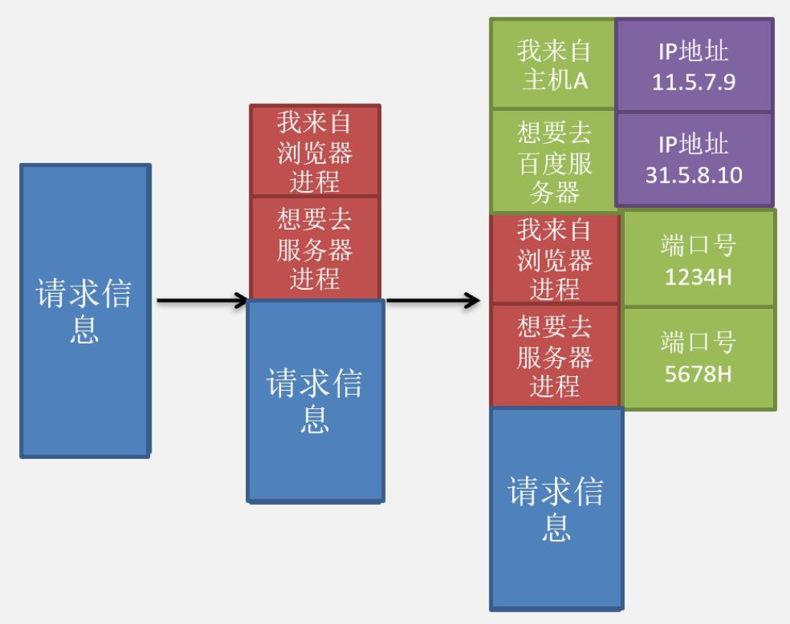
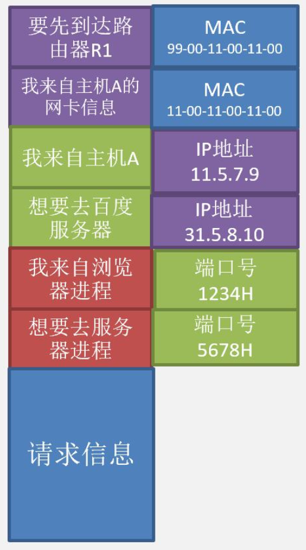

# 绪论

## 计网总览

&emsp;&emsp;&ensp;计算机网络学什么，考什么，怎么考? 
&emsp;&emsp;&ensp;408中计网考研的内容考察，以主机打开百度页面为例，可以总结为你主机中浏览器进程如何把请求信息发送到百度服务器中的进程。百度服务器中的进程如何把信息送达到主机中的浏览器进程。 而这其中数据传输过程，就是我们408考试所考察的内容。 

&emsp;&emsp;&ensp;以访问百度页面为例：当我们打开浏览器，访问百度页面时，主机中的浏览器进程 ${P1}$ 实际上和百度服务器中的进程 ${P2}$ 进行了一次通信，发出了一个请求信号，用来请求页面信息。

&emsp;&emsp;&ensp;主机中浏览器进程 ${P1}$ 发出的用来请求页面的请求信息是如何发送到网络上，该信息是如何通过网络到达百度服务器中的 ${P2}$ 进程。这其中的数据传输过程就是我们计算机网络这门课需要大家掌握的。

&emsp;&emsp;&ensp;以浏览器进程 ${P1}$ 发送页面请求信息，请求百度页面为例，简单了解下网络中数据的传输过程。
&emsp;&emsp;&ensp;步骤 ${1}$：计算机会先把浏览器进程 ${P1}$ 产生的请求信息添加一部分**标注信息**，该标注信息的作用是表明发送这段文档的是计算机中的**哪个进程**，需要发给远方主机（或服务器）中的**哪个进程**。

&emsp;&emsp;&ensp;注意：**进程的编号叫做端口号**。${408}$ 范围内，每个端口号**唯一地表示一个进程**。两个主机之间的端口号可以不同也就可以相同。
&emsp;&emsp;&ensp;由于信息是从一台主机中的一个进程发送到另一台主机（或者服务器）中的另一个进程，所以首先要表明**你是哪个进程，要发给哪个进程**。
&emsp;&emsp;&ensp;步骤 ${2}$：在步骤 ${1}$ 中我们给信息加上了**进程标签**，表明了信息从哪个进程来，要到哪个进程中去。在本步骤也要给信息添加一部分信息，标记出该信息**来自哪个主机，要去往哪个主机（或服务器）**。

&emsp;&emsp;&ensp;注意：每个主机都会通过 ${IP}$ 地址进行标识，一个 ${IP}$ 地址代表一个主机。
&emsp;&emsp;&ensp;在完成步骤 ${2}$ 后，信息已经具备了一定的**寻址能力**。首先包含了来自哪台主机，该主机中的哪个进程。同时包含了该信息要去往**哪个主机（或服务器），以及去往主机（或服务器）中哪个进程**。理论上该信息已经具备寻址能力，可以进行发送。此时，该信息**存储在主机中的主存中，准备发往网卡外设，由网卡外设发送到网络中**。

&emsp;&emsp;&ensp;网卡：是计算机中的一台 ${IO}$ 外设，是一台快速设备。**通过 ${DMA}$ 方式，将主存中的数据送到网卡控制器，并经由网卡外设发送到网络中**。

&emsp;&emsp;&ensp;若一段信息携带了本地主机 ${IP}$ 地址和目的主机 ${IP}$ 地址，这段信息从主机中的内存发送到**网卡外设（包含 ${IO}$ 接口）**，这个过程叫做**交付给下层数据链路层**。 
&emsp;&emsp;&ensp;若信息**由主存经由 ${IO}$ 接口**发送到网卡外设，这段信息叫做**网络层数据**。
&emsp;&emsp;&ensp;若信息由**网卡外设发送到链路中，这个信息叫做数据链路层数据**。

&emsp;&emsp;&ensp;相对应地，若网卡收到一个数据，该数据经由网卡，通过 ${DMA}$ 方式传输到主存中。这个过程通常叫做**数据交付给上层网络层**。
&emsp;&emsp;&ensp;若信息由网卡从网络链路上接收，这个信息叫做**数据链路层数据**。
&emsp;&emsp;&ensp;若信息由网卡经由外设的 ${IO}$ 接口，发给主机的内存，这个信息叫做网络层数据。

&emsp;&emsp;&ensp;我们目前使用的家用主机，每个主机一般会配置一个网卡外设。而类似于路由器这种设备，往往会配置多个网卡。如下路由器中就可能配置了四张网卡，用于通过网线连接主机。

&emsp;&emsp;&ensp;每个网卡，拥**有一个唯一的，${48bit}$ 的全球唯一的网卡编号**，用于标识网卡身份。比如 ${11-00-11-00-11-00}$ 这个网卡标识信息，又叫做 **${MAC}$ 地址**。
&emsp;&emsp;&ensp;步骤 ${3}$：网卡收到信息后会将网卡的**自身的识别信息加入到数据中**，并会标注出要发送给哪个网卡。因为主机 ${A}$ 需要经过路由器 ${R1}$ 和后续一系列的路由器才能到达百度服务器，所以第一步是先将数据从主机的网卡发送给路由器 ${R1}$ 中的网卡。那么添加的目标网卡信息则为 **${R1}$ 的网卡信息**。

&emsp;&emsp;&ensp;当主存中的数据经过网卡外设的 ${IO}$ 接口到达网卡外设时，网卡外设（包括其 ${IO}$ 接口）会将数据加上自己的标识信息，以及目的网卡的标识信息。**将添加标识信息后的数据，发送到链路上**。
&emsp;&emsp;&ensp;自己的标识信息：进程的信息（端口号），对应传输层；主机的信息（${IP}$ 地址），对应网络层；网卡的信息（${MAC}$ 地址），对应数据链路层。

&emsp;&emsp;&ensp;步骤 ${4}$：网卡会把从步骤 ${3}$ 获得的信息，编码成数字信号发出，该信号经过数字信道**先到达路由器 ${R1}$，在经过一次次的转发最终到达百度服务器的网卡**，百度服务器的网卡最终收到主机中浏览器进程 ${P1}$ 发出的请求信息。

&emsp;&emsp;&ensp;网卡收到信息后，会将**网卡标识字段去掉**，将去掉网卡标识字段后的数据经由网卡 ${IO}$ 控制器，发往主存。这个过程叫做数据交付给上层。

## 分层思想

&emsp;&emsp;&ensp;以上几个步骤，体现了计算机网络中最重要的思想：分层思想。
&emsp;&emsp;&ensp;分层思想实际上就是将一个过程分解成一个个更细节的事件，每个事件对应于计算机网络中的一个层。 当前408最常用五层分层体系，主要有如下分层方式。

&emsp;&emsp;&ensp;应用层：定义 ${360}$ 的浏览器进程如何和百度服务器中的进程进行交互。
&emsp;&emsp;&ensp;传输层：定义数据**从哪个进程中来，到哪个进程中去**，即最基础服务--添加**进程标签**。以及根据需求，选择对数据**是否进行可靠传输**。
&emsp;&emsp;&ensp;网络层：定义数据从哪个主机中来，到哪个主机（或服务器）中去，即最基础服务--添加**主机标识信息**。
&emsp;&emsp;&ensp;数据链路层：定义数据从哪个网卡中来，为了到达目的地需要先到哪个节点，并经过逐次转发最终到达目标节点，最基础服务--添加**设备标识信息**。
&emsp;&emsp;&ensp;物理层：把待传输的信息，编码成数字信号，在数字信道上进行传输。也可以根据需求调制成模拟信号，在模拟信道上传输。

### OSI参考模型各层的作用

&emsp;&emsp;&ensp;注意：${OSI}$ 模型曾一度想要让网络层承担可靠传输的服务，并将虚电路网络当作 ${OSI}$ 参考模型的网络层协议以达到可靠传输的目的。但这终究停留在理论部分，**网络层目前已经被 ${TCP/IP}$ 体系中的 ${IP}$ 协议所取代**。 

## 如何对之后的学习进行总结

&emsp;&emsp;&ensp;主要分为两部分：

1. 原理部分：
    功能：这一网络层次能提供的服务以及具体的实现方式。
    目的：本层所具备的功能，可以为提供哪些服务，以及可以为上层提供哪些服务。
2. 实例部分：本层为了实现自身的功能，所提供的具体协议。

## 协议、接口和服务的概念

### 协议

&emsp;&emsp;&ensp;为进行网络中的对等实体数据交换建立的规则、标准或约定称为协议。

#### 协议的组成部分

&emsp;&emsp;&ensp;语法：规定传输数据的格式；各个浏览器厂商之间规定，遵照 ${HTTP}$ 协议进行数据传输，按照 ${html}$ 语言编写网页。${html}$ 语言是一个网页编辑语言。几乎所有的浏览器供应商和所有的网页都是由 ${html}$ 语言编写，遵守 ${html}$ 协议。

&emsp;&emsp;&ensp;语义：规定所要**实现的功能**；需要发出何种**控制信息**，完成何种动作，以及做出**何种应答**。
&emsp;&emsp;&ensp;同步：规定执行各种操作的条件，时序关系等。也就是对**事件实现顺序**的详细说明。

### 接口（访问服务点 SAP）

&emsp;&emsp;&ensp;上层使用下层服务的入口。如主机想要发送的信息，通过网卡封装成以太网帧。

### 服务

&emsp;&emsp;&ensp;下层为相邻上层提供的功能调用服务分类：
&emsp;&emsp;&ensp;面向连接服务（建立连接、传输数据、释放连接）和无连接服务（直接发送数据）；
&emsp;&emsp;&ensp;可靠服务和不可靠服务；
&emsp;&emsp;&ensp;有应答服务和无应答服务。

## 分层思想

### 应用层

&emsp;&emsp;&ensp;应用层的目的：提供两个远程进程之间相互传输数据的的一套共同遵守的标准。
&emsp;&emsp;&ensp;功能应用（具体协议）：在网页传输服务上，提供比如  ${HTTP}$ 协议，使得一个使用谷歌浏览器的用户仍然可以和百度服务器进行通信。

### 传输层

&emsp;&emsp;&ensp;传输层的目的：为两个远程进程需要交互的数据提供传输服务。
&emsp;&emsp;&ensp;传输单位：**${TCP}$ 报文或 ${UDP}$ 报文**

#### TCP协议

&emsp;&emsp;&ensp;${TCP}$ 协议的目的：为两个远程进程之间提供可靠传输服务。
&emsp;&emsp;&ensp;可靠传输的原则：数据不出错；数据不乱序；数据不重复；数据不丢失。
&emsp;&emsp;&ensp;维持可靠性的代价：为 ${TCP}$ 报文进行**编号**（不乱序，不重复，不丢失）；**有确认**（证明接收方已经收到对应的数据）；发送方**保留数据副本**（一旦数据丢失或由于信道问题发生 ${bit}$ 错误，进行重传）。
&emsp;&emsp;&ensp;假设每个 ${TCP}$ 报文最多传输 ${5}$ 个汉字，先将该文档分成 ${4}$ 个 ${TCP}$ 报文。

&emsp;&emsp;&ensp;为了保证不乱序，不重复，不丢失。需要给每个 ${TCP}$ 报文编号。

&emsp;&emsp;&ensp;为了保证接收方已经收到了，接收方在收到一个 ${TCP}$ 报文后**需要给与确认**。

&emsp;&emsp;&ensp;同时也需要具备**超时重传**的能力，防止报文因为在信道中出现问题，接收方**未能收到或未收到无 ${bit}$ 错误的数据**，以及应对**接收方发回的返回报文丢失的问题**。 
&emsp;&emsp;&ensp;发送方会设定一个时间，叫做**超时时间**。若规定时间内发送方未收到接收方的返回报文，则要超时重传。

#### UDP协议

&emsp;&emsp;&ensp;${UDP}$ 协议的目的：提供不可靠的进程间数据传输服务。
&emsp;&emsp;&ensp;如果某段数据在信道中丢失或出现 ${bit}$ 错，不提供重传服务。
&emsp;&emsp;&ensp;如果收到的数据是乱序的，比如收到 ${1、3、2}$ 那么直接上传 ${1、3}$ 给上层，${2}$ 直接丢弃。

### 网络层

&emsp;&emsp;&ensp;网络层的目的：提供从源主机到目的主机，以数据报为单位的尽力交付（对于丢失，失序，出现 ${bit}$ 错等等问题不做处理）的通信协议。
&emsp;&emsp;&ensp;传输单位：${IP}$ 数据包或网络层数据报 

&emsp;&emsp;&ensp;为了实现建立路由表的功能，衍生出三种路由协议。

&emsp;&emsp;&ensp;${IP}$ 功能

&emsp;&emsp;&ensp;${IPV4}$：使用 ${IPV4}$ 方式给主机赋予一个唯一的 ${IP}$ 地址（不考虑私有 ${IP}$ 情况），每个地址在网络中代表一个主机或代表路由器的一个端口。当主机拥有 ${IP}$ 地址后，就可以和其他主机进行通信。

&emsp;&emsp;&ensp;网络层设备：
&emsp;&emsp;&ensp;路由器：网络层使用的中间设备。
&emsp;&emsp;&ensp;网关：网络层及以上使用的中间设备。传统意义上，我们把**负责网络层数据包传输的中间设备称为路由器**，而可以**使用传输层协议的设备叫做网关**。比如运行 ${NAT}$ 协议的路由器严格意义上**应该叫做网关而非路由器**，因为它可以运行网络层以上的协议。但我们考试中并不区分网关和路由器。所以当你看到一个可以**运行传输层协议的路由器**不要觉得惊讶，实际上那种路由器应该叫做**网关**，但由于我们不区分网关和路由器所以也可以称为路由器。

### 数据链路层

&emsp;&emsp;&ensp;数据链路层的目的：提供相邻两节点之间，以帧为单位的数据通信任务。
&emsp;&emsp;&ensp;传输单位：数据帧
&emsp;&emsp;&ensp;链路中的节点可以分成两种：
&emsp;&emsp;&ensp;主机节点：表示主机或服务器
&emsp;&emsp;&ensp;路由节点：表示路由器 

&emsp;&emsp;&ensp;数据传输策略：主机中的网卡设备会将信息加上源地址，目的地址以及校验信息，**封装成数据帧**并将数据帧发送到信道上。目的设备的网卡（下一跳设备的网卡信息）收到该数据帧后，取出其中的数据。

&emsp;&emsp;&ensp;数据链路层的目的

#### 802.11

&emsp;&emsp;&ensp;${802.11}$ 无线传输协议的目的：为两个无线设备提供可靠的数据传输服务。

&emsp;&emsp;&ensp;为了防止设备 ${A}$ 在给设备 ${B}$ 传输数据帧的中途，设备 ${C}$ 向设备 ${B}$ 传输数据从而导致两个数据**发生串扰**，所以 ${802.11}$ 协议采用 ${CTS}$ 和 ${RTS}$ 机制事先“建立连接”（**类似连接，但是不是真连接**），若 ${A}$ 和 ${B}$ 正在传输数据时，${A}$ 并未和 ${C}$ 通过 ${CTS，RTS}$ 机制“建立连接”，从而**不会接收 ${C}$ 传来的数据**。
&emsp;&emsp;&ensp;${802.11}$ 协议采用**确认机制**，确保每一条发出的数据，接收端都能收到。

#### 无连接有确认协议：

&emsp;&emsp;&ensp;停止等待：发送方的发送窗口大小为 ${1}$，接收方的接收窗口大小为 ${1}$。
&emsp;&emsp;&ensp;后退 ${N}$ 帧：发送方的发送窗口大小为 ${n}$，接收方的接收窗口大小为 ${1}$。
&emsp;&emsp;&ensp;选择重传：发送方的发送窗口大小为 ${n}$，接收方的接收窗口大小为 ${n}$。

#### 以太网协议

&emsp;&emsp;&ensp;以太网协议的目的：提供相邻两节点之间，以帧为单位的无差错数据传输任务。
&emsp;&emsp;&ensp;无差错：只需要保证接收方收到的数据不包含 ${bit}$ 错误。若数据在链路中丢失或一组数据未能按序到达接收方，在链路层上不做处理。

&emsp;&emsp;&ensp;为了完成以上目的，只需要添加**帧校验字段**，确定数据帧为发生 ${bit}$ 错误即可。 
&emsp;&emsp;&ensp;网络层和数据链路层的以太网协议在差错校验上的区别：
&emsp;&emsp;&ensp;以太网协议目的：提供相邻两节点之间，以帧为单位的无差错数据传输任务。
&emsp;&emsp;&ensp;无差错：只需要保证接收方收到的数据不包含 ${bit}$ 错误。若**数据在链路中丢失或一组数据未能按序到达接收方，在链路层上不做处理**。 
&emsp;&emsp;&ensp;网络层的目的：提供从源主机到目的主机，以数据报为单位的**尽力交付**（对于丢失，失序，出现 ${bit}$ 错等等问题不做处理）的通信协议（这里指的是不可靠的 ${IP}$，还有可靠的虚电路，但是不常考）。
&emsp;&emsp;&ensp;传输单位：${IP}$ 数据包或网络层数据报

&emsp;&emsp;&ensp;以太网帧和 ${IP}$ 数据包是如何配合的？
&emsp;&emsp;&ensp;网卡在从信道上接受链路层数据帧时，网卡需要检查接收到的帧**是否存在 ${bit}$ 错误**。若有 ${bit}$ 错误，网卡**丢弃该帧**。若无 ${bit}$ 错误，网卡会将收到的帧**去掉数据链路层标识**后，将其中的数据部分通过 ${io}$ 接口发往主存。在发往主存的过程中，**不会检查数据部分是否出现 ${bit}$ 错误**。
&emsp;&emsp;&ensp;如果是要求可靠传输，那么额外加上**不乱序、不重复、不丢失**。

### 物理层

&emsp;&emsp;&ensp;物理层的目的：让信号通过编码或调制，实现其在信道上进行传输。
&emsp;&emsp;&ensp;物理层的功能：

* 提供信道中信号的转换，比如将数字信号调制成模拟信号，或将模拟信号编码成数字信号；
*  定义低通信道中最大码元传输速率和有噪声情况下的最大数据传输速率。
* 上述功能实现了信号在信道上进行传输以及定义了传输的最大速率。

&emsp;&emsp;&ensp;当用网线连接主机和家用 ${wifi}$ 路由器时，网线上传输的多数是**数字信号**。
&emsp;&emsp;&ensp;当联网是使用入户箱使用光纤连接光猫，光猫使用网线连接路由器时，路由器通过网线连接主机，在这种情况下，光纤这段传输的是**模拟信号**，网线上主要是**数字信号**。

## 网络性能指标

### 速率

&emsp;&emsp;&ensp;计算机中数据量的单位，也是信息论中信息量的单位。一个比特就是二进制数字中的一个 ${1}$ 或 ${0}$。单位是 ${kb/s}$。 
&emsp;&emsp;&ensp;注意：当描述数据的大小时，${K}$ 代表 ${1024}$，${M}$ 表示 ${1024*1024}$。当描述数据传输快慢的时候 ${k}$ 表示 ${1000}$，${M}$ 表示 ${1000, 000}$。

### 带宽

&emsp;&emsp;&ensp;带宽的定义在**模拟信道和数字信道中的定义少有不同**。
&emsp;&emsp;&ensp;模拟信道带宽：信号所包含的**各种不同频率成分所占据的频率范围**。
&emsp;&emsp;&ensp;数字信道带宽：用来表示网络的通信线路所能传送数据的能力，因此网络带宽表示在单位时内从网络中的某一点到另一点所能通过的“**最高数据率**”。
&emsp;&emsp;&ensp;单位是 ${b/s，kb/s}$ 或 ${mb/s}$

&emsp;&emsp;&ensp;上图中模拟信道的带宽为 ${1005MHz - 995MHz = 10MHz}$

### 时延

&emsp;&emsp;&ensp;指的是数据经过设备过信道所造成的延迟。
&emsp;&emsp;&ensp;时延分为发送时延，传播时延：
&emsp;&emsp;&ensp;发送时延：又叫传输时延表示从设备发出第一个bit数据开始，到数据的最后一个bit发出为止的时间。

&emsp;&emsp;&ensp;假设数据大小为 ${1000B}$，数据传输速率为 ${100bit/s}$，则传输时延为 ${1000 * 8 ÷ 100 = 80s}$
&emsp;&emsp;&ensp;传播时延：表示数据从设备发出后在信道上传输所需要的时间。

&emsp;&emsp;&ensp;传播时延 = 信道长度 ÷ 电磁波的传输速度

### 往返时间RTT

&emsp;&emsp;&ensp;指的是数据从发送方发出开始，到达接收方后又返回到发送方的时间。

### 信道利用率（链路层会重点讲解信道利用率）

&emsp;&emsp;&ensp;用来表示某信道有百分之几的时间是被利用的（有数据通过）。
&emsp;&emsp;&ensp;信道利用率并不是越高越好。信道利用率高同时也代表网络的拥挤程度更高，因为拥挤会造成的数据丢失和延迟增加等情况。

### 丢包率

&emsp;&emsp;&ensp;也就是分组丢失率，是指在一定的时间范围内，传输过程中丢失的分组数量与总分组数量的比率。
&emsp;&emsp;&ensp;分组丢失主要有两种情况
&emsp;&emsp;&ensp;分组在传输过程中出现误码，被结点丢弃；
&emsp;&emsp;&ensp;分组到达一台队列已满的节点时被丢弃。在通信量较大时就可能造成网络拥塞。
&emsp;&emsp;&ensp;在 ${408}$ 计网考研中，丢包率主要反映网络的拥塞情况。一般来讲，无拥塞时丢包率为 ${0}$，轻度拥塞时丢包率为 ${1\% \~\ 4\%}$，严重拥塞时路径丢包率为 ${5\% \~\ 15\%}$。

