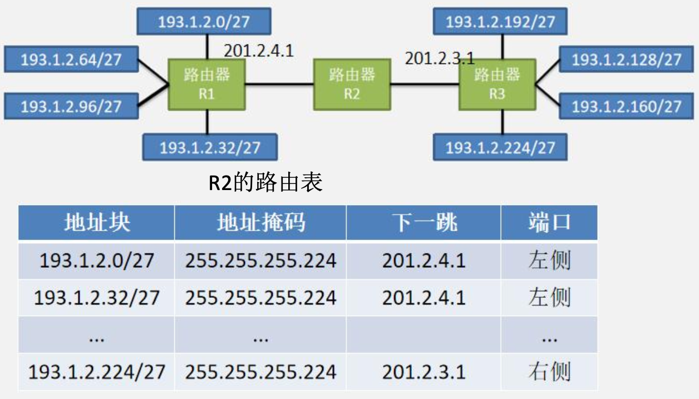
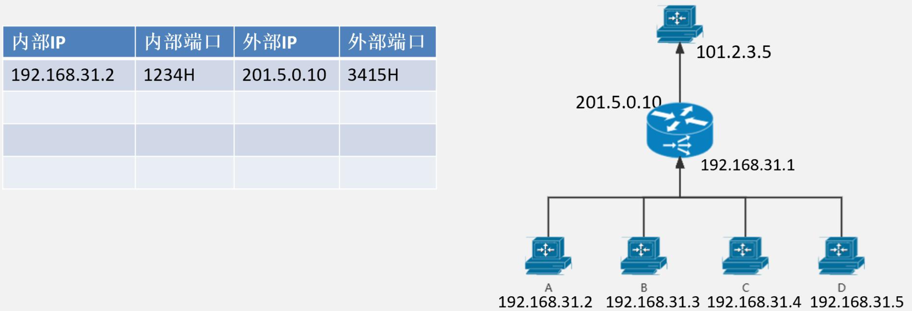
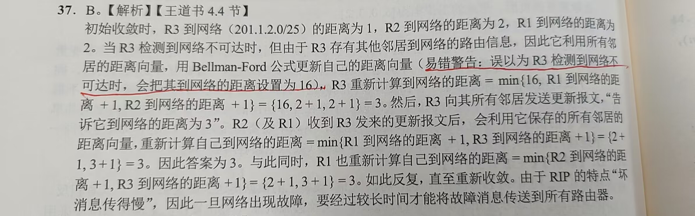
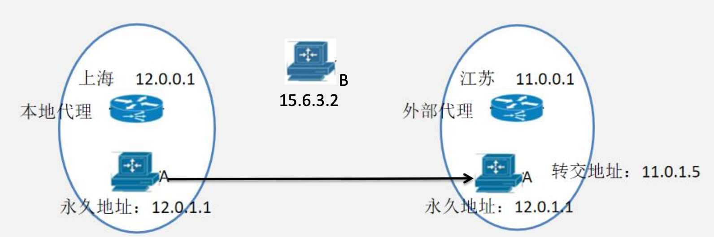

# 网络层

&emsp;&emsp;&ensp;网络层的目的：为两个**远程主机**之间提供数据传输服务：
1. 在发送主机和接收主机间传送  ${IP}$  数据报；（**传输服务**）
2. 网络层协议**存在于每一个路由器和主机中**，路由器在收到帧后，将其从网卡中获取并除去链路层帧的帧头，再对比路由表后选择对应的端口进行转发。（**转发服务**）

&emsp;&emsp;&ensp;**${TCP}$ / ${IP}$ 协议下的网络层**

&emsp;&emsp;&ensp;非重点内容：移动 ${IP}$ /组播/ ${IP}$ V6协议
&emsp;&emsp;&ensp;** ${OSI}$ 模型下的网络层**：与 ${TCP}$ / ${IP}$ 体系不同， ${OSI}$ 模型更希望在网络层**提供一个可靠传输服务**。以可靠传输为主体，兼顾不可靠传输。所以在 ${OSI}$ 体系下，网络层提供可靠传输和不可靠传输服务。可靠传输服务以虚电路为协议实体，不可靠传输以 ${IP}$ 协议为实体。

##  ${IP}$ 数据报分片

### 网络层数据的产生和存储

&emsp;&emsp;&ensp;以  ${TCP}$ / ${IP}$  体系下数据的发送为例：当某个进程产生数据，该数据会被进程赋予一个**端口号**，并将带着端口号的数据向下传递到主存中。主存收到数据后，将数据添加 ${IP}$ 地址，并将添加了 ${IP}$ 地址的数据向下传递到网卡外设。网卡外设从主存收到数据后，将数据加上  ${MAC}$  地址，并发送到链路上。其中，**端口号保存在进程中， ${IP}$  地址保存在主存中**。

&emsp;&emsp;&ensp;以  ${TCP}$ / ${IP}$  体系下数据的接收为例：当主机从链路上收到数据后，主机中的网卡外设**先将收到的数据初步进行  ${CRC}$  校验**，并去掉  ${MAC}$  地址字段和校验字段。将处理后的数据上传给主存。操作系统在将数据去掉 ${IP}$ 地址后，把数据**从主存分发给所对应的进程**。进程在核对端口号后，获取数据。

###  ${IP}$ 数据报的组成

&emsp;&emsp;&ensp;网络中的  ${IP}$  地址，是对网络中的主机进行标识。目前考试中考察次数最多的  ${IP}$  协议为  ${IPV4}$  协议构成的  ${IPV4}$  数据报。 ${IPV4}$  数据报是由进程发来的数据添加一个  ${IPV4}$  的首部字段组成。

&emsp;&emsp;&ensp; ${IP}$ 的首部字段的基本大小为20字节。其中包含该数据部分的源主机 ${IP}$ 地址，目的主机 ${IP}$ 地址， ${IP}$ 数据报首部长度， ${IP}$ 数据报的总长度， ${IP}$ 数据报的标识，是否分片，生存时间和首部字段的校验和。这些信息共同用来描述一个 ${IP}$ 数据报的基本内容。

###  ${IPV4}$ 数据报的首部字段

1. 版本：标识 ${IP}$ 协议版本；
2. **首部长度**：标识该 ${IP}$ 数据报首部字段多少字节，单位为**4B**。
3. **总长度**：表示整个 ${IP}$ 数据报的总长度（包含头部字段），单位为**1B**。
4. **生存时间（TTL）**： ${IP}$ 数据报不能无限制的在网络传输，需要规定他能经过的最多路由个数。路由表在转发时，会先将 ${TTL - 1}$，若减完 ${TTL == 0}$，则直接丢弃，不进行转发。
5. **协议**：表明该 ${IP}$ 数据报应该上交给哪个传输层协议。其中**6代表 ${TCP}$ ，17代表 ${UDP}$**。
6. 首部校验和：首部检验和用于帮助路由器（**对主机无意义**）检测收到的 ${IP}$ 数据报中首部的**比特错误**。路由器要对每个收到的 ${IP}$ 数据报校验其首部检验和，若计算结果不一致，路由器一般会丢弃此数据报。** ${IP}$ 数据报到每台路由器必须重新计算检验和，因为TTL字段以及可能的选项字段会改变**。
7. 标识：主机每产生一个 ${IP}$ 数据报，则给这个数据报赋予一个标识，比如第五个数据报的标识字段是5。（标识字段也可以是主机随机生成，生成方式了解即可）
8. **标志**：DF代表Don’t Fragment；MF代表More Fragment。
9. **片偏移**：代表这个 ${IP}$ 数据报分片的首字节，**相对于原 ${IP}$ 数据报的偏移值**，单位为**8B**。 
注意：**标识，标志，片偏移**字段主要用于对 ${IP}$ 数据报分片；**一总八片首饰**。

###  ${IP}$ 数据报分片

&emsp;&emsp;&ensp;MTU的定义：首先，我们回顾一下，上节课讲的以太网帧。上节课我们说，**以太网帧的数据部分最小为46B，最大为1500B**。而在现实生活中，我们主机网卡发出的数据多为以太网帧。所以以太网帧能包含数据的大小，就决定了一个 ${IP}$ 数据报的最大能为多少。我们一般把链路层帧能承载的最大数据量称为最大传送单元MTU（自顶向下223页）。

&emsp;&emsp;&ensp;路由器进行 ${IP}$ 数据报分片：主机在发出 ${IP}$ 数据报时，会通过传输层进行限制，把每个 ${IP}$ 数据报的大小限制在链路层的 ${MTU}$ 范围内，从而防止在发出时就分片。这个原理我们会在传输层详细说明，**${IP}$ 数据报分片主要由路由器进行**。如果在链路上的路由器，在转发过程中， ${IP}$ 数据报大小 > 链路的 ${MTU}$，则需要对 ${IP}$ 数据报进行分片。

&emsp;&emsp;&ensp;当路由器S1从一个 ${MTU = 1500}$ 的链路上收到一个数据部分为1500B的以太网帧，转发到 ${MTU}$ 为500的链路上，路由器就必须将 ${IP}$ 数据报分片。这样才能转发到 ${MTU}$ 为500的链路上（**若不允许分片，则会丢弃该数据报**）。
&emsp;&emsp;&ensp;当某路由器需要对一个数据报分片时，形成的每个数据报具有**初始数据报的源地址、目的地址与标识号**。当目的地从同一发送主机收到一系列数据报时，它能够**检查数据报的标识号**以确定哪些数据报实际上是同一较大数据报的分片。

&emsp;&emsp;&ensp;首先，对一个 ${IP}$ 数据报进行分片后，数据报分片的**标识字段、源 ${IP}$ 、目的 ${IP}$ 不变**。标志字段占3位，其最低位为MF（More Fragment），${MF = 1}$ 表示后面还有分片，${MF = 0}$ 表示最后一个分片。标志字段中间的一位是DF（Don’t Fragment），只有当 ${DF = 0}$ 时才允许分片。偏移字段用于表示**该分片的第一个字节是未分割的 ${IP}$ 数据报中的第几字节**。如第一个分片是0，表示是0号字节。第二个分片的第一个字节应该是第480字节。偏移字段会先 ${÷ 8}$ 在将数据填入。${480 ÷ 8 = 60}$。所以第二个报文的偏移为60。而且要注意的是，偏移字段**必须是8的整数倍**才行。
&emsp;&emsp;&ensp;当目的主机收到这四个 ${IP}$ 数据报分片后，根据偏移字段就可以进行数据报重组。但**路由器并不会执行重组**，只能对每个分片进行转发。若 ${DF = 1}$ 且 ${IP}$ 数据报大小 > 链路MTU，则路由器直接丢弃该 ${IP}$ 数据报。

###  ${IP}$ 头部的变化

&emsp;&emsp;&ensp;思考下，如果一个1500B的 ${IP}$ 数据报经过路由器分片后， ${IP}$ 头部中，哪些字段会出现变化？

&emsp;&emsp;&ensp;其中**生存时间和首部校验和是百分百改变的**，若发生切片，则总长度一定改变，不一定改变的是标志和片偏移。

##  ${IPV4}$ 地址规范

&emsp;&emsp;&ensp;每个 ${IPV4}$ 地址长度为32比特，约有43亿个可能的 ${IP}$ 地址。这些地址按点分十进制记法书写，即地址中的每个字节用它的十进制形式书写，各字节间以句号隔开。例如， ${IP}$ 地址193.32.216.9，193是该地址第1个字节的十进制数，32是该地址第2个字节的十进制数，依次类推。因此，地址193.32.216.9的二进制记法是：

&emsp;&emsp;&ensp;对于早期 ${IPV4}$ 地址规范，在逻辑上将一个 ${IP}$ 地址分为两部分，分别是**网络号和主机号**。公司或组织会申请一个网络号，用网络号代指某个公司，公司再将归属次网络号下的主机号分配给公司中的主机。

### 传统 ${IPV4}$ 的5类地址

&emsp;&emsp;&ensp;对于最初版本的 ${IPV4}$ 协议，协议规定把32bit的 ${IP}$ 地址划分为5类网络。每一类网络中的一个网络号，会分配给一个公司或组织。该组织拿到一个网络号后，会给组织内的主机分配一个此网络号下的主机号。

&emsp;&emsp;&ensp;这5类网络中，由于D类和E类网络一个是用于**多播情景**，一个是**保留使用**。所以在日常生活中，主要是使用A、B、C三类网络作为实际传输的 ${IP}$ 地址使用。

### 公司如何申请 ${IPV4}$ 网络号

&emsp;&emsp;&ensp;如果一个公司申请了一个A类地址中的网络号，则这个A类网络号可以包含最多 ${224 - 2}$ 台主机 ${IP}$ 地址。比如公司申请网络号为27的A类网络号，那么这个A类网络号下的主机号都可以分配给公司的主机。
&emsp;&emsp;&ensp;如果是申请了C类网络中的一个网络号，则该网络号可以给 ${28 - 2 = 254}$ 台主机提供  ${IP}$  地址。也就是说一个拥有C类网络号的公司，最多只能使用254台主机。同样如果是申请了一个B类网络的网络号，等于该公司可以分配 ${216-2}$ 个 ${IP}$ 地址。

### 主机号分配的注意点

&emsp;&emsp;&ensp;无论A，B，C哪类网络，**主机号全0和主机号全1的这个  ${IP}$  地址，是不可以分配给网络中的主机**。
&emsp;&emsp;&ensp;**主机号全0代表这个网络号本身**。如一个公司获得了C类网络，网络号222.15.18。那么222.15.18.0的这个  ${IP}$  代表的就是网路号222.15.8，故不能分配给主机。
&emsp;&emsp;&ensp;如果主机号全1也不能分配，**主机号全1代表发给网络号的广播信息**。就是一个目的  ${IP}$  为222.15.18.255的  ${IP}$  数据报，所有从属于222.15.8这个网络的主机都能收到这个  ${IP}$  数据报。

#### A类网络号的注意点

&emsp;&emsp;&ensp;A类地址的网络号字段占1个字节，**只有7位可供使用**。但要注意：
&emsp;&emsp;&ensp;网络号为全0的  ${IP}$  地址有特殊的用途，它表示“**本网络**”。
&emsp;&emsp;&ensp;网络号为127，作为**本地软件环回测试本主机的进程之间的通信**。若主机发送一个目的地址为环回地址（例如127.0.0.1）的  ${IP}$  数据报，则本主机中的协议软件就处理数据报中的数据，而不**会把数据报发送到任何网络**。
&emsp;&emsp;&ensp;因此**A类地址可指派的网络号是126个(即 ${2^7-2}$)**。

#### B类，C类网络号

&emsp;&emsp;&ensp;B类地址的网络号字段有2个字节，因此B类地址可指派的网络数为 ${2^{14}}$，B类地址的每一个网络上的最大主机数是 ${2^{16}-2}$。C类地址有3个字节的网络号字段，因此C类地址可指派的网络总数是 ${2^{21}}$，每一个C类地址的最大主机数是 ${2^8-2}$。
&emsp;&emsp;&ensp;注意：曾经，B类地址中的网络地址 ${128.0.0.0}$ 和C类地址中的网络地址 ${192.0.0.0}$ 都是规定不指派的。但现在这两个网络地址都已经可以指派了 ${[RFC 6890]}$。

#### 不能分配的

&emsp;&emsp;&ensp;不能分配给组织或公司的网络号：A类地址全0的网络号不能分配给组织或公司；A类地址127的网络号不能使用。
&emsp;&emsp;&ensp;哪些主机号不能进行分配：主机号为全0；主机号为全1。
&emsp;&emsp;&ensp;特殊的  ${IP}$  地址：
1. ${127.0.0.1}$ 可以作为  ${IP}$  数据报的**目的  ${IP}$  地址**，理论上也可以作为源  ${IP}$  地址，但**做源  ${IP}$  会被防火墙隔离**。而且无法发送到网络上。
2.  ${255.255.255.255}$ （**对范围内所有主机发送**）和主机号全1（对**该网络号下的所有主机**）的  ${IP}$  地址**不能用作源  ${IP}$ ，只能作为目的  ${IP}$ **。
3.  ${0.0.0.0}$ （若出现在  ${IP}$  数据报上，则代表**本主机**，用于**还未分配  ${IP}$  的情况下**；若出现在**路由表**上，则代表**发往互联网（默认路由）**）只能用作**源  ${IP}$ **，不能用作目的  ${IP}$ 。

## CIDR、子网划分、路由聚合

### 无分类编址-CIDR

&emsp;&emsp;&ensp;早期的  ${IPV4}$  协议中 A、B、C 三类地址中网络号的位数固定。但随着互联网迅速发展，使可分配的网络号面临枯竭的危险。
&emsp;&emsp;&ensp;例如，一个 A 类网络地址块的主机号数目超过了 1677 万个，早期美国的很多大学都可以分配到一个 A 类网络地址块，一个大学不可能需要这样多的  ${IP}$  地址。又如，一个 C 类网络地址块可指派的主机号只有 254 个。但不少单位需要有 300 个以上的  ${IP}$  地址，那么干脆申请一个 B 类网络地址块（可以指派的主机号有 65534 个）。这样就浪费了不少的地址资源。 
&emsp;&emsp;&ensp;在 20 世纪 90 年代，当发现  ${IP}$  地址在不久后将会枯竭时，一种新的无分类编址方法 CIDR 问世了。这种方法虽然也无法解决  ${IP}$  地址枯竭的问题，可以推迟  ${IP}$  地址用尽的日子。
&emsp;&emsp;&ensp;**网络前缀**：CIDR **把网络号改称为“网络前缀”用来指明网络**，剩下的后面部分仍然是主机号，用来指明主机。CIDR 的记法是：** ${IP}$  地址：网络前缀（n位），主机号（32-n位）**。
&emsp;&emsp;&ensp;CIDR 和传统分类的最大的区别就是网络前缀的位数 n 不是固定的数。CIDR 分类方式打破了传统的 A、B、C 类地址，不再采用传统方式定义  ${IP}$  地址。
&emsp;&emsp;&ensp;CIDR 使用“**斜线记法**”，或称为 CIDR 记法，即在  ${IP}$  地址后面加上斜线”/”，斜线后面是网络前缀所占的位数。例如，CIDR 表示的一个  ${IP}$  地址 128.14.35.7/20，二进制  ${IP}$  地址的前 20 位是网络前缀，剩下后面 12 位是主机号。
&emsp;&emsp;&ensp;**地址块（也就是网络号）**：CIDR 把网络前缀都相同的所有连续的 ${IP}$ 地址组成一个“CIDR 地址块”。一个 CIDR 地址块包含的  ${IP}$  地址数目，**取决于网络前缀的位数**。我们只要知道 CIDR 地址块中的任何一个地址，就可以知道这个地址块的起始地址和最大地址，以及地址块中的地址数。 例如，已知  ${IP}$  地址 128.14.35.7/20，是某 CIDR 地址块中的一个地址，现在把它写成二进制表示形式，其中的前 20 位是网络前缀（用红色和下划线表示出），而前缀后面的 12 位是主机号。 
&emsp;&emsp;&ensp;128.14.35.7/20 = **10000000 00001110 0010**0011 00000111
&emsp;&emsp;&ensp;**地址块中的最大最小地址**：128.14.35.7/20 = 10000000 00001110 00100011 00000111 
&emsp;&emsp;&ensp;最小地址：128.14.32.0/20 = **10000000 00001110 0010**0000 00000000
&emsp;&emsp;&ensp;最大地址：128.14.47.255/20 = **10000000 00001110 0010**1111 11111111
&emsp;&emsp;&ensp;这个地址块的  ${IP}$  地址共有 ${2^{12}}$ 个，扣除主机号为全 0 和全 1 的地址后，可指派的地址数是 ${2^{12}-2}$ 个。
&emsp;&emsp;&ensp;CIDR 地址块的注意点：

1. 128.14.32.7 是  ${IP}$  地址，但未指明网络前缀长度，因此不知道网络地址是什么。 
2. 128.14.32.7/20 是 CIDR 记法的  ${IP}$  地址，同时指明了网络前缀为 20 位，由此可导出网络地址。
3. 128.14.32.0/20 的主机号全 0，表示一个地址块（网络）。 

&emsp;&emsp;&ensp;注意：128.14.32.0/20 地址块中 4 段十进制数字最后的 0 有时可以省略，即简写为 128.14.32/20。
&emsp;&emsp;&ensp;我们不能仅用 128.14.32.0 表示一个地址块，因为不清楚网络前缀是多少。早期使用网络号固定的  ${IP}$  地址，A 类网络的前缀是 8 位，B 类网络的前缀是 16 位，而 C 类网络的前缀是 24 位，都是固定值，因此不需要重复指明其网络前缀。
&emsp;&emsp;&ensp;**地址掩码 CIDR**：使用斜线记法可以让我们知道网络前缀的数值。但是计算机看不见斜线记法，使用二进制来进行各种计算时就必须使用 32 位的地址掩码，从而从  ${IP}$  地址迅速算出网络地址。 
&emsp;&emsp;&ensp;**地址掩码由一连串 1 和接着的一连串 0 组成**，而 1 的个数就是网络前缀的长度。**地址掩码又称为子网掩码 D**。在 CIDR 记法中，斜线后面的数字就是地址掩码中 1 的个数。例如，/20 地址块的地址掩码是：11111111 11111111 11110000 00000000 。用 CIDR 记法表示：255.255.240.0/20。**对于早期使用的分类  ${IP}$  地址，其地址掩码是固定的**，常常不用专门指出。例如：A 类网络，地址掩码为 255.0.0.0 或 255.0.0.0/8（CIDR 写法）；B 类网络，地址掩码为 255.255.0.0 或 255.255.0.0/16（CIDR 写法）；C 类网络，地址掩码为 255.255.255.0 或 255.255.255.0/24（CIDR 写法）。
&emsp;&emsp;&ensp;**CIDR 的意义**：在采用 CIDR 方式后，公司、组织和高校不会在争抢这申请 A 类或 B 类网络号了，而是根据自身需求申请。如在 CIDR 方式出现前，很多高校去申请 A 类网络号，在 CIDR 方式出现后，很多国内的高校一般会申请 19 位或 20 位网络号。如中国人民大学的  ${IP}$  地址 202.112.112.0 - 202.112.127.255，地址块为 202.112.112.0/20，掩码为 255.255.240.0。
&emsp;&emsp;&ensp;**CIDR在路由表中的应用**：CIDR 记法**不能**用在  ${IP}$  数据报的源  ${IP}$  和目的  ${IP}$  字段上。因为  ${IP}$  数据报的首部字段格式已经固定，无法容纳掩码字段的位置，也就无法标记出网络前缀的位数。其次， ${IP}$  数据报**一定是由某个主机发出，发往某个主机**。所以  ${IP}$  数据报中的源  ${IP}$  和目的  ${IP}$  一定是特指某个主机。

&emsp;&emsp;&ensp;CIDR 记法**主要应用在路由表中**，作为路由表表项中目的地址字段的内容。
&emsp;&emsp;&ensp;现代路由器中的路由表中的地址字段，采用 CIDR 记法表示一个地址块信息。如下图，一个路由器 r2 可以通往 8 个地址块，每个地址块中最多包含 30 台主机的  ${IP}$  地址。路由表会**单独设置一个地址掩码字段**，用于保存地址块的掩码信息。

&emsp;&emsp;&ensp;若此时路由器 r2 上侧直连了一台主机，此时路由表地址块为 ${168.2.3.4}$，掩码字段为  ${255.255.255.255}$ ，下一跳为直连，端口为上侧。

### 子网划分

&emsp;&emsp;&ensp;如果一个具有 240 个主机的公司，申请了一个地址块  ${193.1.2.0/24}$。假定公司中有 8个部门每个部门有 30 个主机。 若部门 A 的主管给本部门内的 30 个主机广播发送一个  ${IP}$  数据报， ${IP}$  数据报的目的  ${IP}$  只能是 ${193.1.2.255}$。但这样会导致公司内所有的主机都收到这个   ${IP}$   数据报。因此需要一种方式将不同部门之间的信息隔离，这种方式称为子网划分。 
&emsp;&emsp;&ensp;该公司有 8 个部门，应将每个部门通过**子网划分**方式，单独形成一个小型局域网，属于同一部门的信息在同一部门内传递。

&emsp;&emsp;&ensp;子网划分是在原本的主机号字段上进行划分。将二级  ${IP}$  地址的主机号进一步划分成子网号和主机号两部分。
&emsp;&emsp;&ensp;在子网划分后，每个子网的网络前缀长度 = 原网络前缀 + 子网号。
&emsp;&emsp;&ensp;以公司地址块为 ${193.1.2.0/24}$ 为例，如果想要将其平均划分成 8 个子网，相当于对这个地址块中，原本的 8bit 的主机号字段进行如下划分。

&emsp;&emsp;&ensp;${193.1.2.0/24}$：代指公司这个地址块
&emsp;&emsp;&ensp;${193.1.2.0/27}$：代指公司内的某个部门地址块 
&emsp;&emsp;&ensp;${193.1.2.32/27}$：代指公司内的某个部门地址块
&emsp;&emsp;&ensp;其中，**主机号全 0 代表该子网，全 1 代表该子网的广播地址**。
&emsp;&emsp;&ensp;在这种划分方式下，比如 001 的子网，一般表示为 193.1.2.32/27。/27 表示其中的前 27 位是网络前缀。子网号为 25、26、27 三个 bit。
&emsp;&emsp;&ensp;如果一个子网地址为 193.1.2.224/27 表示前 27 位为网络前缀，子网号为 111。

&emsp;&emsp;&ensp;**子网掩码**：&emsp;&emsp;&ensp;子网的划分实际上是一个大号地址块内部的自主划分。而网络内部的路由器需要通过**子网掩码**来知道人类是如何对网络号中的主机进行子网划分的。

&emsp;&emsp;&ensp;路由器只需要根据子网掩码，就知道要发送的主机处于地址块 193.1.2.0/24 的哪个子网之中。并将  ${IP}$  数据报发送到对应的子网中。**子网掩码的功能和地址掩码功能一致**，只是在不同的场景中的名称不同。
&emsp;&emsp;&ensp;**非平均子网划分**：实际上现实生活中往往不会采用平均子网划分的方式。因为每个子网需要的主机数量各不相同。如果只是采用平均划分的方式，则每个子网中的主机数量一样，但每个子网的需求是完全不同的。
&emsp;&emsp;&ensp;如果不采用平均划分的方式，那么最重要的就是**保证子网号不重复**。而计网中保证子网号不重复的方法，是采用了数据结构中的**哈夫曼编码**策略。我们知道哈夫曼编码具有唯一性，而在非平均子网划分方式，则采用了哈夫曼编码的思想，进行子网划分。

### 路由聚合

&emsp;&emsp;&ensp;回到地址块 193.1.2.0/24 划分 8 个子网的例子。当该地址块平均划分成 8 个更小的子网时，如果给每个更小的子网都分配一个表项，则路由表中的表项起码要分配 8 个。但是路由器中可以存储路由表的空间并不是无限的。所以路由器会**将几个小的子网聚合在一个表项之中**，来减少路由表的大小。

&emsp;&emsp;&ensp;左侧子网和右侧子网，进行路由聚合后的路由表如下所示：

&emsp;&emsp;&ensp;如果路由器如果收到两个  ${IP}$  地址，分别为 193.1.2.130 和 193.1.2.5 要转发到哪个端口呢，这就需要用到**最长前缀匹配原则**。
&emsp;&emsp;&ensp;最长前缀匹配：使用 CIDR 时，在查找路由表时可能会得到不止一个匹配结果。此时，应当从匹配结果中**选择具有最长网络前缀的路由**，因为**网络前缀越长，其地址块就越小，因而路由就越具体**。

&emsp;&emsp;&ensp;当路由器收到一个目的  ${IP}$  为 ${193.1.2.130}$ 的  ${IP}$  数据报时，${193.1.2.130 = 193.1.2.10000010}$；其第 25 位为 1，需要转发到路由器右侧的聚合网络 ${193.1.2.128/25}$。当路由器收到一个目的  ${IP}$  为 ${193.1.2.5}$ 的  ${IP}$  数据报时，${193.1.2.5 = 193.1.2.00000101}$。虽然其前 24 位与 ${193.1.2.0/24}$ 一致，但同时其前 25 位与 ${193.1.2.0/25}$ 一致，所以转发到左侧的聚合子网 ${193.1.2.0/25}$。

## 私有 ${IP}$ 和 ${NAT}$ 协议

### 私有 ${IP}$ 

&emsp;&emsp;&ensp;私有  ${IP}$  地址进一步减少  ${IPV4}$  的消耗：前文介绍的几种方法，虽然 CIDR 方式可以延缓全部  ${IPV4}$  地址用完。但随着互联网设备的增加，给每个设备一个  ${IP}$  地址仍然会让  ${IPV4}$  地址块快速消耗。所以提出了私有  ${IP}$ ，用于进一步延缓  ${IP}$  地址的消耗。
&emsp;&emsp;&ensp;私有  ${IP}$  由三个特殊地址块组成。实际可使用的分别是 
&emsp;&emsp;&ensp;${10.0.0.1 - 10.255.255.254}$；
&emsp;&emsp;&ensp;${172.16.0.1 - 172.31.255.254}$；
&emsp;&emsp;&ensp;${192.168.0.1 - 192.168.255.254}$。
&emsp;&emsp;&ensp;在因特网中的所有路由器，**对目的地址是私有地址的数据报一律不会转发到外部因特网上**。这种采用私有  ${IP}$  地址的互联网络称为**专用互联网或本地互联网**，**私有  ${IP}$  地址也称可重用地址**。
&emsp;&emsp;&ensp;我们以现实生活中家庭使用路由器为例：
&emsp;&emsp;&ensp;比如你向移动申请办理了一上网服务，移动公司会分配你一个路由器和一个  ${IP}$  地址。假设你家所在的小区处于地址块 ${201.5.0.0/16}$ 中，移动公司会在地址块中选一个  ${IP}$  地址 ${201.5.0.10}$ 分配给你家，你家的路由器对外的  ${IP}$  地址就是 ${201.5.0.10}$。而你家庭中的四台主机，只要连接到路由器，就会被路由器依次分配一个私有  ${IP}$  地址。假设路由器采用地址块 ${192.168.31.0/24}$ 进行分配，依次给路由器对家庭内部的端口和四台主机分配私有  ${IP}$  地址。

&emsp;&emsp;&ensp;对于家庭中的四台电脑，路由器的内网  ${IP}$  地址 ${192.168.31.1}$（一般取第一个主机号）叫做主机的**默认网关  ${IP}$  地址**，而 ${201.5.0.10}$ 代表你家在互联网上的  ${IP}$  地址。私有  ${IP}$  是没办法在互联网上进行传播的。只可以在你家内部的小网络进行传播。所以如果你想要和外部的主机（如百度服务器）进行通信，就需要一种  ${IP}$  地址转换协议，把家庭内部的私有  ${IP}$  转换成公网  ${IP}$  在互联网上进行传输。这种转换协议叫做  ${NAT}$  协议。

###  ${NAT}$ 协议

&emsp;&emsp;&ensp;网关和路由器的联系：运行了  ${NAT}$  协议的路由器能让该路由器对于外部世界来说表现的不像一台路由器，更像一个**具有单一  ${IP}$  地址的单一设备**。路由器会生成一张  ${NAT}$  转发表用于将私有地址与公网地址进行转换。且使用私有地址的整个子网**对外表现为一台主机**，而子网内的一台主机**对外表现为一个进程端口号**。 
&emsp;&emsp;&ensp;运行了  ${NAT}$  协议的路由器原则上讲，应该叫**网关**。因为他已经**看见了进程的端口号**。但由于路由器和网关并不做区分，所以大多数还是称为路由器。
&emsp;&emsp;&ensp; ${NAT}$  协议是把你整个家庭**当作一台逻辑主机**，逻辑主机的  ${IP}$  地址是 ${201.5.0.10}$。而内部的四台主机，每台主机的一个端口都会对外看作此逻辑主机的一个端口。路由器内部会维持一个  ${NAT}$  转发表，用于进行私有地址和公网地址的转换。 ${NAT}$  转发表中包含四个字段，分别是内部  ${IP}$ ，内部端口，外部  ${IP}$ ，外部端口。
&emsp;&emsp;&ensp;若主机 A 的 1234H 想要给百度服务器 ${101.2.3.5}$ 中的 5678H 端口发送数据：

&emsp;&emsp;&ensp;主机 A 会先发送一个  ${IP}$  数据报，该  ${IP}$  数据报封装在一个以太网帧中。到达路由器后进行一些处理；
&emsp;&emsp;&ensp;路由器收到该以太网帧，获取帧中  ${IP}$  数据报后，会根据  ${IP}$  数据报中的源  ${IP}$  以及数据报中传输层信息中的源端口填写路由器的  ${NAT}$  转发表。同时为这个内部端口随机分配一个**虚拟的端口作为此内部端口的外部端口**，并写入  ${NAT}$  转发表。

&emsp;&emsp;&ensp;路由器会根据  ${NAT}$  转发表，**将  ${IP}$  数据报以及传输层信息进行修改**。其中  ${IP}$  数据报的的源  ${IP}$  修改为外部地址，**目的  ${IP}$  不变**。传输层信息的源端口改为外部端口，**目的端口不变**。

&emsp;&emsp;&ensp;服务器收到后对主机 A 发回一个响应报文时，其目的  ${IP}$  地址是  ${NAT}$  路由器的公网  ${IP}$  地址 ${201.5.0.10}$，目的端口是 ${3415H}$。

&emsp;&emsp;&ensp;当该报文到达  ${NAT}$  路由器时，路由器使用目的  ${IP}$  地址与目的端口号从  ${NAT}$  转换表中检索出私有  ${IP}$  地址（${192.168.31.2}$）和目的端口号（${1234H}$）。路由器改写该数据报的目的  ${IP}$  地址与目的端口号，转发该数据报。

## DHCP协议

&emsp;&emsp;&ensp;${DHCP}$ 协议的目的：给主机分配  ${IP}$  地址。
&emsp;&emsp;&ensp;无论是手机还是笔记本，在没有连接到网络之前，**都是没有  ${IP}$  地址的**。设备想要获取一个  ${IP}$  地址，需要向 ${DHCP}$ 服务器（内置在路由器之中）申请一个  ${IP}$  地址。${DHCP}$ 服务器主要采用 ${DHCP}$ 协议进行  ${IP}$  地址分配。${DHCP}$ 协议分配  ${IP}$  地址具体又分为两种分配方式，静态分配方式和自动分配方式：
&emsp;&emsp;&ensp;**静态分配**（了解）通过网络管理员手工配置某台客户端特定的  ${IP}$  地址，当客户端请求分配时，${DHCP}$ 服务器就将**手动配置**的  ${IP}$  地址分配给客户端。
&emsp;&emsp;&ensp;**自动分配**（重点）当 ${DHCP}$ 客户端第一次向服务端租用到第一个  ${IP}$  地址后，**将这个  ${IP}$  地址永久分配给客户端使用，直到这个客户端关机或离开 ${DHCP}$ 服务器的负责区域**。
&emsp;&emsp;&ensp;当主机刚接入一个路由器时，通过 ${DHCP}$ 协议获取  ${IP}$  地址 ${DHCP}$ 服务器和 ${DHCP}$ 客户端的交换过程如下：
&emsp;&emsp;&ensp;${DHCP}$ 客户机广播“${DHCP\quad Discover}$”消息，试图找到网络中的 ${DHCP}$ 服务器，以便从 ${DHCP}$ 服务器获得一个  ${IP}$  地址。 
&emsp;&emsp;&ensp;${DHCP}$ 服务器收到“${DHCP\quad Discover}$"消息后，广播“${DHCP\quad Offer}$”消息，其中包括提供给 ${DHCP}$ 客户机的  ${IP}$  地址。 
&emsp;&emsp;&ensp;${DHCP}$ 客户机收到“${DHCP\quad Offer}$”消息，如果接受该  ${IP}$  地址，那么就广播“${DHCP\quad Request}$”消息向 ${DHCP}$ 服务器请求提供  ${IP}$  地址。 
&emsp;&emsp;&ensp;${DHCP}$ 服务器广播“${DHCP\quad Acknowledge}$”消息，将 ${IP}$ 地址分配给 ${DHCP}$ 客户机。

### ${DHCP}$ 详细过程

&emsp;&emsp;&ensp;${DHCP}$ 客户机广播“${DHCP\quad Discover}$”消息，试图找到网络中的 ${DHCP}$ 服务器，从 ${DHCP}$ 服务器获得一个  ${IP}$  地址。其中源地址为 ${0.0.0.0}$ ，目的地址为 ${255.255.255.255}$。
&emsp;&emsp;&ensp;${DHCP}$ 服务器收到“${DHCP\quad Discover}$"消息后，广播“${DHCP\quad Offer}$” 消息，包括提供给 ${DHCP}$ 客户机的  ${IP}$  地址。源地址为 ${DHCP}$ 服务器地址，目的地址为 ${255.255.255.255}$。

&emsp;&emsp;&ensp;${DHCP}$ 客户机收到“${DHCP\quad Offer}$”消息，如果接受该  ${IP}$  地址，那么就广播“${DHCP\quad Request}$”消息向 ${DHCP}$ 服务器请求提供  ${IP}$  地址。源地址为  ${0.0.0.0}$ ，目的地址为 ${255.255.255.255}$。
&emsp;&emsp;&ensp;${DHCP}$ 服务器广播“${DHCP\quad ACKnowledge}$”消息，将  ${IP}$  地址分配给 ${DHCP}$ 客户机。源地址为 ${DHCP}$ 服务器地址，目的地址为 ${255.255.255.255}$。只有发出这个消息后，**该设备才真正拥有了  ${IP}$  地址**。

&emsp;&emsp;&ensp;注意：
&emsp;&emsp;&ensp;在一台主机在尚未分配  ${IP}$  地址时，主机**只能使用 ${0.0.0.0}$ 作为源  ${IP}$  地址，代表本主机**。**目的  ${IP}$  地址也只能使用 ${255.255.255.255}$ 这个广播地址**。原因如下：由于你的主机还没有  ${IP}$  地址，所以只能用 ${0.0.0.0}$ 作为代指本主机的  ${IP}$  地址，来当作发出  ${IP}$  数据报的源  ${IP}$ 。${DHCP}$ 服务器会在分配给你  ${IP}$  地址的同时，会把默认网关地址、子网掩码同时发送给你。**所以在拿到  ${IP}$  地址之前，你根本不知道链路上都有哪些主机，也不知道 ${DHCP}$ 服务器的  ${IP}$  地址**。所以只能以 ${255.255.255.255}$ 这个广播地址作为目的  ${IP}$  地址。
&emsp;&emsp;&ensp; ${IP}$  地址 ${0.0.0.0}$ 在 ${DHCP}$ 协议中和路由表中的意思是不同。在 ${DHCP}$ 中表示**本主机**，在路由表中  ${0.0.0.0}$  表示**默认路由**。默认路由为当实在不知道转发到何处时，会转发到  ${0.0.0.0}$  这个表项**对应的端口**。
&emsp;&emsp;&ensp;${255.255.255.255}$ 和主机号全 ${1}$ 的  ${IP}$  地址都是**广播地址**。如果你已知该子网的地址块，则使用主机号全 ${1}$ 形式的广播  ${IP}$  地址。如果你对链路信息完全不清楚时，采用 ${255.255.255.255}$。在 ${408}$ 中，**只有 ${DHCP}$ 协议需要你用到广播地址 ${255.255.255.255}$**。	
&emsp;&emsp;&ensp;不管是主机号全 ${1}$ 的广播  ${IP}$  地址，还是 ${255.255.255.255}$ 这个广播  ${IP}$  地址，其**对应的链路层目的  ${MAC}$  地址统一都是 ${ff-ff-ff-ff-ff-ff}$**。
&emsp;&emsp;&ensp;**默认路由和默认网关**的区别：比如家用的连接了四台家里主机的路由器，主机 A 发出以太网帧后，都需要到达路由器再转发出去，这个路由器叫做**默认网关**；若是在**路由表**中，则**默认路由为路由表中为  ${0.0.0.0}$  的  ${IP}$  地址的端口**。
&emsp;&emsp;&ensp;当 ${DHCP}$ 服务器分配  ${IP}$  地址后，除了  ${IP}$  地址还会**包含主机所在子网中的基本信息**：

&emsp;&emsp;&ensp;主机拥有这些基本信息后，就可以连接互联网了。

## ARP

&emsp;&emsp;&ensp; ${ARP}$  协议的目的：**如果只知道  ${IP}$  地址而不知道  ${MAC}$  地址**，则需要使用  ${ARP}$  协议**通过  ${IP}$  地址获取  ${MAC}$  地址**。
&emsp;&emsp;&ensp; ${ARP}$  协议出现的原因：在以太网环境中，**数据的传输所依赖的是  ${MAC}$  地址而非  ${IP}$  地址**，而将已知  ${IP}$  地址转换为  ${MAC}$  地址的工作是由  ${ARP}$  协议来完成的。
&emsp;&emsp;&ensp;在任何时候，一台主机有  ${IP}$  数据报文发送给另一台主机，它都要知道接收方的  ${IP}$  地址。但是 **${IP}$  地址必须封装成帧才能通过物理网络**。这就意味着发送方**必须有下一节点的  ${MAC}$  地址**，因此**需要完成  ${IP}$  地址到  ${MAC}$  地址的映射**。 
&emsp;&emsp;&ensp;而  ${ARP}$  协议可以根据来自  ${IP}$  数据报的  ${IP}$  地址，将其转换成需要发送的  ${MAC}$  地址，从而**封装成帧**，把该  ${IP}$  数据报发送到对应的节点进行后续的转发。
&emsp;&emsp;&ensp;以主机 ${A}$ 给主机 ${B}$ 和主机 ${A}$ 给主机 ${C}$ 发  ${IP}$  数据报为例：
&emsp;&emsp;&ensp;首先，每台主机都会在自己的  ${ARP}$  缓冲区中**建立一个  ${ARP}$  列表**，以表示  ${IP}$  地址和  ${MAC}$  地址的对应关系。 
&emsp;&emsp;&ensp;数据发送前，会首先**检查自己  ${ARP}$  列表中是否存在该  ${IP}$  地址对应的  ${MAC}$  地址**，如果有，就直接将数据包发送到这个  ${MAC}$  地址；如果没有，就向**本地网段发起一个  ${ARP}$  请求的广播帧**，查询此目的主机对应的  ${MAC}$  地址。此  ${ARP}$  请求数据帧里**包括源主机的  ${IP}$  地址、硬件地址、以及目的主机的  ${IP}$  地址**。

&emsp;&emsp;&ensp;**主机 ${A}$ 给主机 ${B}$ 发送  ${IP}$  数据报**：
&emsp;&emsp;&ensp;主机 ${A}$ 先检查主机 ${B}$ 的  ${IP}$  地址，发现主机 ${A、B}$ 在**同一个子网中**。主机 ${A}$ 检查自己的  ${ARP}$  转发表，发现并无主机 ${B}$ 的  ${MAC}$  地址。**则主机 ${A}$ 发送一个  ${ARP}$  请求帧，帧的目标  ${MAC}$  全 ${1}$，并将主机 ${B}$ 的  ${IP}$  地址信息写入其中。**

&emsp;&emsp;&ensp;该**子网**中的所有主机以及路由器均收到这条广播帧，但由于数据部分的  ${IP}$  地址为 ${192.168.1.3}$。所以其他主机丢弃这个帧，主机 ${B}$ 向主机 ${A}$ 发送  **${ARP}$  响应帧（单播帧）**。

&emsp;&emsp;&ensp;主机 ${A}$ 拿到主机 ${B}$ 的  ${MAC}$  地址后写入  ${ARP}$  转发表并准备发送  ${IP}$  数据报。

&emsp;&emsp;&ensp;主机 ${A}$ 给主机 ${C}$ 发送  ${IP}$  数据报（若此时主机 ${A}$ 的转发表只有主机 ${B}$ 的 ${MAC}$ 地址）

&emsp;&emsp;&ensp;主机 ${A}$ 先检查主机 ${C}$ 的  ${IP}$  地址，发现主机 ${A、C}$ 并**不在同一个子网中**。那么主机 ${A}$ 就需要把这个  ${IP}$  数据报**发送给默认网关，由网关路由器代为转发**。
&emsp;&emsp;&ensp;主机 ${A}$ 检查自己的  ${ARP}$  转发表，发现并无路由器左侧端口的  ${MAC}$  地址。则主机 ${A}$ 发送一个  ${ARP}$  请求帧，帧的目标  ${MAC}$  全 ${1}$，并将路由器 ${r1}$ 的私有  ${IP}$  地址放入其中。

&emsp;&emsp;&ensp;该子网中的所有主机以及路由器均收到这条广播帧，但由于数据部分的  ${IP}$  地址为 ${192.168.1.1}$。所以其他主机丢弃这个帧，路由器 ${R1}$ 向主机 ${A}$ 发送  ${ARP}$  响应帧。

&emsp;&emsp;&ensp;主机 ${A}$ 拿到路由器 ${R1}$ 的  ${MAC}$  地址后把  ${IP}$  数据报封装在链路层转发给路由器。同时也要把 ${R1}$ 的  ${MAC}$  地址信息**写入转发表**。
&emsp;&emsp;&ensp;主机 ${A}$ 在把封装了  ${IP}$  数据报的帧给到路由器 ${R1}$ 后，主机 ${A}$ 不再管这个  ${IP}$  数据报后续是如何在链路层转发的。对于主机 ${A}$ 来说，他的**发送使命已经完成**。

&emsp;&emsp;&ensp;路由器 ${R1}$ 收到这个帧后，检查内部的  ${IP}$  地址。发现并不是发给自己的，而是发给主机 ${201.2.1.2}$。查询路由表后，发现该主机在路由器 ${R1}$ 的右侧。先查询  ${ARP}$  转发表看是否有其  ${MAC}$  地址。若有则将  ${IP}$  数据报封装成帧后转发，若无则继续发送  ${ARP}$  请求帧请求 ${MAC}$  地址。

&emsp;&emsp;&ensp;${R1}$ 查询后发现其转发表中只有主机 ${A}$ 的  ${MAC}$  地址，${R1}$ 开始发送  ${ARP}$  请求帧请求  ${IP}$  地址 ${201.2.1.2}$ 对应的  ${MAC}$  地址。

&emsp;&emsp;&ensp;路由器 ${R2}$ 收到这个帧后，检查内部的  ${IP}$  地址。发现是发给自己的。${201.2.1.2}$ 所在的路由器 ${R2}$ 会发出一条  ${ARP}$  响应帧。

&emsp;&emsp;&ensp;路由器 ${R1}$ 右侧的端口收到  ${ARP}$  响应帧后，把  ${IP}$  数据报封装成帧进行转发。
&emsp;&emsp;&ensp;路由器 ${R1}$ 在把封装了  ${IP}$  数据报的帧给到路由器 ${R2}$ 后，路由器 ${R1}$ 不在管这个  ${IP}$  数据报后续是如何在链路层转发的。对于路由器 ${R1}$ 来说，他的发送使命已经完成。

&emsp;&emsp;&ensp;最后，路由器 ${R2}$ 将该数据转发给主机 ${C}$（实际上是需要**根据外部端口号和  ${NAT}$  来找到主机 ${C}$ 的**）。

## ${ICMP}$

&emsp;&emsp;&ensp;${ICMP}$  报告主要用于，路由器如果**主动丢弃**了某些  ${IP}$  数据报，则向源主机**报告差错和异常情况**，减少源主机知悉差错的时间。 
&emsp;&emsp;&ensp;如下几种情况是路由器发送 ${ICMP}$ 报告的原因：
&emsp;&emsp;&ensp;**终点不可达**：当路由器或主机**不能交付数据报**时，就向源点发送终点不可达报文。如链路断开了，则发送链路不可达；但若是经过网卡时**没有通过  ${CRC}$  校验，则此时不发送终点不可达**。网卡把  ${IP}$  数据报给到路由器内存，检查目的  ${IP}$  发现不可达，此时才发送  ${ICMP}$  报文。也就是说，一定是**网络层发现的终点不可达**，而不是链路层。
&emsp;&emsp;&ensp;**源点抑制**：当路由器或主机**由于拥塞而丢弃**数据报时，就向源点发送源点抑制报文。 
&emsp;&emsp;&ensp;**时间超过**：当路由器收到生存时间（${TTL}$）为零的数据报时，除丢弃该数据报外，还要向源点发送时间超过报文。
&emsp;&emsp;&ensp;当终点**在预先规定的时间内**不能收到一个数据报的全部数据报片时，就把**已收到的数据报片都丢弃**，并向源点发送时间超过报文。
&emsp;&emsp;&ensp;**参数问题**：当路由器或目的主机收到的数据报的首部中有的**字段的值不正确**时，就丢弃该数据报，并向源点发送参数问题报文。这里参数问题有一种可能性，就是**网络层自己的参数就填错了**，或者是网络层交付网卡（即 ${MAC}$ 网卡）的时候在总线上传输数据时候出现了电磁干扰，出现了**比特错**。所以本身交给链路层的就是个错的东西，然后链路层用这个错误的计算的 ${CRC}$ ，链路层不知道网络层传来的是个错误的东西。所以他‘正确’的把这个数据，传到了目标主机。然后网络层收到这个‘正确’的数据后发现参数不对，就会发送这个参数问题 ${ICMP}$ 报文
&emsp;&emsp;&ensp;**改变路由（重定向）**：路由器把改变路由报文发送给主机，让主机知道**下次应将数据报发送给另外的路由器**（可通过更好的路由）。
&emsp;&emsp;&ensp;当路由器丢弃如下几种 ${IP}$ 数据报时，**无需发送 ${ICMP}$ 报告给源主机**：
&emsp;&emsp;&ensp;对  **${ICMP}$  差错报告报文**不再发送  ${ICMP}$  差错报告报文。
&emsp;&emsp;&ensp;对第一个分片的数据报片的**所有后续数据报片**都不发送  ${ICMP}$  差错报告报文。
&emsp;&emsp;&ensp;对具有**组播地址**的数据报都不发送  ${ICMP}$  差错报告报文。
&emsp;&emsp;&ensp;对具有**特殊地址**（如 ${127.0.0.0}$、 ${0.0.0.0}$ ）的数据报不发送  ${ICMP}$  差错报告报文。
&emsp;&emsp;&ensp;问题：当路由器利用  ${IP}$  数据报首部中的“首部检验和”字段检测出在传输过程中出现了差错时，就简单地将其丢弃。为什么不发送一个 ${ICMP}$ 报文给源主机呢？
&emsp;&emsp;&ensp;解答： ${IP}$  协议并不要求源主机重传有差错的  ${IP}$  数据报。**保证无差错传输是由  ${TCP}$  协议完成的**。另一方面，首部检验和只能检验出  ${IP}$  数据报的首部是否出现差错，但不知道首部中的源地址字段有没有出错。如果源地址出现了差错，那么将这种  ${IP}$  数据报传送到错误的地址也是没有任何意义的。

&emsp;&emsp;&ensp;注意： ${ICMP}$  的目的是**为网络层提供服务**，当路由器丢弃某些数据报时告知源主机。封装了  ${ICMP}$  报文的  ${IPV4}$  数据报的协议字段为 ${1}$。当路由器收到这个  ${IP}$  数据报，检查  ${IP}$  数据报头部，**发现协议字段为 ${1}$，从而获悉内部封装了  ${ICMP}$  报文**。

## 报文交换与分组交换

### 报文交换

&emsp;&emsp;&ensp;**数据交换的单位是报文**，报文携带有目标地址、源地址等信息。报文交换在交换结点采用的是**存储转发的传输方式**。报文交换对报文的大小没有限制，这就要求网络结点**需要有较大的缓存空间**。报文交换主要使用在早期的电报通信网中，现在较少使用，通常被较先进的分组交换方式所取代。

### 分组交换

&emsp;&emsp;&ensp;分组交换也采用**存储转发**方式，但解决了报文交换中大报文传输的问题。分组交换限制了每次传送的数据块大小的上限，把大的数据块划分为合理的小数据块，再加上一些必要的控制信息（如**源地址、目的地址和编号信息**等），构成分组。网络结点根据控制信息把分组送到下一个结点，下一个结点接收到分组后，暂时保存并排队等待传输，然后根据分组控制信息选择它的下一个结点，直到到达目的结点。
&emsp;&emsp;&ensp;分组交换由可以分为**数据报和虚电路**两种方式。其中数据报方式用于  **${IP}$  协议**，虚电路方式用于**虚电路协议**。
&emsp;&emsp;&ensp;分组交换不考虑传播时间情况：

&emsp;&emsp;&ensp;分组交换考虑传播时间情况：

### 虚电路

&emsp;&emsp;&ensp;对于  ${TCP}$ / ${IP}$  协议，其网络层的目的是提供一个**无确认、无连接的、主机之间**的数据传输服务。该服务的**功能实体是  ${IP}$  协议**。而对于  ${OSI}$  体系下， ${OSI}$  的网络层打算提供既可以进行**有连接的传输服务**，也可以实现**无确认无连接的传输服务**，并**以有连接的传输服务为主体。而这个目的的具体功能实现就是虚电路网络**。

&emsp;&emsp;&ensp;虚电路采用**面向连接**的方式，先在发送方和接收方之间建立一个**虚拟的通路**。所有的分组**沿着固定的通路顺序传送**。虚电路建立在建立阶段，指定接收方地址，等待网络建立虚电路。网络层决定发送方与接收方之间的路径，即该虚电路的所有分组要通过的一系列链路与路由器。网络层也为沿着该路径的每条链路**决定一个  ${VC}$  号**。最后，网络层在沿着路径的每台路由器的转发表中增加一个表项。

&emsp;&emsp;&ensp;**数据传送**：一旦创建了虚电路，分组就可以开始沿该虚电路流动了。分组沿着规定的虚电路进行按序传输。
&emsp;&emsp;&ensp;**虚电路拆除**：当发送方（或接收方）通知网络层它希望终止该虚电路时，就启动这个阶段。然后网络层通常将通知网络另一侧的端系统结束呼叫，并更新路径上每台分组路由器中的转发表以表明该虚电路已不存在了。
&emsp;&emsp;&ensp;一条虚电路的组成如下：
&emsp;&emsp;&ensp;源和目的主机之间的路径（即一系列链路和路由器）；	&emsp;&emsp;&ensp;${VC}$ 号（有方向的），沿着该路径的每段链路的一个号码；
&emsp;&emsp;&ensp;沿着该路径的每台路由器中的转发表表项。属于一条虚电路的分组将在它的首部携带一个  ${VC}$  号。因为一条虚电路在每条链路上可能具有不同的  ${VC}$  号，每台中间路由器必须用个新的  ${VC}$  号替代每个传输分组的  ${VC}$  号。 该新的  ${VC}$  号从转发表获得。
&emsp;&emsp;&ensp;假定 ${A}$ 和 ${B}$ 连接虚电路，该网络为该虚电路选择路径 ${A-R1-R2-B}$ 并为这条路径上的这 ${3}$ 条链路分配  ${VC}$  号 ${12、22}$ 和 ${32}$。
&emsp;&emsp;&ensp;注意：虚电路建立后，所有分组的头部不包含目的  ${IP}$  地址，而是一个较短的  ${VC}$  号。

&emsp;&emsp;&ensp;从 ${r1}$ 的 ${1}$ 接口收到的数据报，如果要从接口 ${2}$ 发出，则相当于发到  ${VC}$  号为 ${22}$ 的链路上。

## 路由协议

&emsp;&emsp;&ensp;路由器根据路由器内部的转发表对 ${IP}$ 数据报进行转发，而**路由表建立的依据就是路由协议**。我们会学习三种路由协议建立路由表。

### 自治系统

&emsp;&emsp;&ensp;互联网是由多个自治系统组成的，每个自治系统可以理解为一个局域网。 
&emsp;&emsp;&ensp;自治系统**内部的路由器**一般采用  ${RIP}$   或  ${OSPF}$  协议建立路由表，路由表内**包含本自治系统内的路由信息**。
&emsp;&emsp;&ensp;每个自治系统会有一个**边界路由器**，用于和其他自治系统进行  ${IP}$  数据报交互。将本自治系统内的  ${IP}$  数据报发往其他自治系统。
&emsp;&emsp;&ensp;两个自治系统之间建立路由表的方式叫做**外部网关协议**，采用  ${BGP}$  路由协议建立路由表。

### RIP协议

&emsp;&emsp;&ensp;**${RIP}$ 协议中心思想**：${RIP}$ 协议要求网络中**每一个路由器**都维护从它自己到其他每一个目的网络的**唯一最佳距离记录**（距离最短）。每经过一个路由器跳数 ${+1}$。特别的，**从一路由器到直接连接的网络距离为 ${1}$**。${RIP}$ 允许一条路由最多只能包含 ${15}$ 个路由器，因此**距离为 ${16}$ 表示网络不可达**。 

&emsp;&emsp;&ensp;${RIP}$ 建立路由表的交互报文：
&emsp;&emsp;&ensp;**${RIP}$   请求消息**：在  ${RIP}$   路由器开始启动之后，立即向它的**所有的邻居路由器**发送 ${RIP}$ 请求消息，以便快速获得关于整个 ${RIP}$ 网络的路由信息；运行中的  ${RIP}$   路由器也可以**随时的根据自身的需要**向它的所有的邻居发出  ${RIP}$   请求消息。 
&emsp;&emsp;&ensp;**${RIP}$ 响应消息**：
&emsp;&emsp;&ensp;${RIP}$ 路由器在接收到 ${RIP}$ 请求消息后，会**立即发出  ${RIP}$   响应消息**进行回应。
&emsp;&emsp;&ensp;${RIP}$   路由器总是会**每隔 ${30}$ 秒**的时间向它的所有的邻居路由器**周期性的发送  ${RIP}$   响应消息**，而该消息中携带了**该路由器的  ${RIP}$   路由表**中的最新的路由信息。
&emsp;&emsp;&ensp;一个路由器路由信息发生变化，一般会主动发送响应给所有邻居路由器。但题目也出现过**只给一个邻居单独发送响应**，这一点需要注意。
&emsp;&emsp;&ensp;注：每个路由器**发送请求消息的时间是不同的**。
&emsp;&emsp;&ensp;${RIP}$ 建立路由表的方式：
&emsp;&emsp;&ensp;路由器 ${B}$ 刚接入网络后，给 ${A}$ 和 ${C}$ 发出 **${RIP}$ 请求**，${C}$ 和 ${A}$ 都会发出 ${RIP}$ 响应（但并不是同时发出响应）。假设此时 ${C}$ 先发出 ${RIP}$ 报文。
&emsp;&emsp;&ensp;对地址为 ${X}$ 的相邻路由器发来的  ${RIP}$   报文，先**修改此报文中的所有项目**：把“下一跳”字段中的地址都改为 ${x}$，并把**所有“距离”字段的值加 ${1}$**。

&emsp;&emsp;&ensp;对修改后的 ${RIP}$ 报文中的每个项目，执行如下步骤：
&emsp;&emsp;&ensp;当原来的路由表中没有目的网络 ${N}$ 时，把该项目添加到路由表中。

&emsp;&emsp;&ensp;当原来的路由表中有目的网络 ${N}$，且下一跳路由器的地址**是 ${X}$ 时**，用**收到的项目替换原路由表中的项目**。
&emsp;&emsp;&ensp;当原来的路由表中有目的网络 ${N}$，且下一跳路由器的地址**不是 ${X}$ 时**，如果收到的项目中的距离 ${d}$ 小于路由表中的距离，那么就用收到的项目**替换**原路由表中的项目；否则什么也不做。
&emsp;&emsp;&ensp;如果 ${180}$ 秒（${RIP}$ 默认超时时间为 ${180}$ 秒）**还没有收到相邻路由器的更新路由表**，那么把此相邻路由器记为**不可达路由器**，即把距离设置为 ${16}$（距离为 ${16}$ 表示不可达）。 
&emsp;&emsp;&ensp;**${RIP}$ 路由器收敛**：当一个自治系统中**所有的路由器均拥有整个网络的信息**，知晓到达每个网络所需要经过的下一跳路由器，并在**几次接收其他路由器 ${RIP}$ 报文后数据不变，则所有路由器收敛**。

&emsp;&emsp;&ensp;**${RIP}$ 路由器更新（更新可以从两个方面理解）**：

1. 路由器收到其他路由器的数据后，会根据情况对自己的路由表进行**局部修改**。
2. 路由器从其他路由器获取路由表并更新后，或许此时表中的表项**并不是最近的**。只有收到链路上**所有路由器的 ${RIP}$ 报文**后，才能让所有表项都实现距离最近这个要求。这种**路由表更新**，**发生在收到所有路由器的 ${RIP}$ 报文后**。

&emsp;&emsp;&ensp;此处，自顶向下的描述与真题一致，谢书与第一种更新方式一致。

### ${OSPF}$ 协议

&emsp;&emsp;&ensp;**${OSPF}$ 协议的思想**：向本自治系统中**所有路由器**发送信息。这里使用的方法是**洪泛法**。路由器**通过所有输出端口向所有相邻的路由器发送状态信息**。而每一个相邻路由器又再将此信息发往其所有的相邻路由器（但不再发送给刚刚发来信息的那个路由器）。这样，最终整个区域中所有的路由器都得到了整个自治系统的链路状态。再根据链路状态通过 ${Dijkstra}$ 算法建立路由表。

&emsp;&emsp;&ensp;${OSPF}$ 发送的信息：发送的信息就是**与本路由器相邻的所有路由器的链路状态**，但这只是路由器所知道的**部分信息**。
&emsp;&emsp;&ensp;所谓“链路状态”就是**说明本路由器都和哪些路由器相邻，以及该链路的“度量”**。${OSPF}$ 将这个“度量”用来表示费用、距离、时延、带宽，等等。这些都由网络管理人员来决定，因此较为灵活。有时为了方便就称这个度量为“代价”。
&emsp;&emsp;&ensp;当**链路状态发生变化**或**每隔一段时间**（如 ${30}$ 分钟），路由器向所有路由器用**洪泛法**发送链路状态信息。
&emsp;&emsp;&ensp;一个区域内部的路由器**只知道本区域的完整网络拓扑**，而不知道其他区域的网络拓扑的情况。为了使每一个区域能够和本区域以外的区域进行通信，${OSPF}$ 使用**层次结构**的区域划分。在上层的区域叫作**主干区域**。主干区域的**标识符规定为 ${0.0.0.0}$**。主干区域的作用是用来连通其他在下层的区域。
&emsp;&emsp;&ensp;从其他区域来的信息都**由区域边界路由器进行概括**。路由器 R7、R3 和 R4 分别是区域 1、2、3 的边界路由器。每一个区域至少应当有一个区域边界路由器。在主干区域内的路由器叫作主干路由器，如 R3、R4、R5、R6 和 R7。一个主干路由器可以同时是区域边界路由器，如 R3、R4 和 R7。在主干区域内还要有一个路由器专门和本自治系统外的其他自治系统交换路由信息。这样的路由器叫作自治系统边界路由器，如 R6。

&emsp;&emsp;&ensp;${OSPF}$ 协议工作流程：
${建立邻接关系 → 链路状态数据库 → 最短路径树（Dijkstra）→路由表}$

&emsp;&emsp;&ensp;得到整个链路的全部信息后，通过迪杰斯特拉算法算出到每个网络或路由器的**最佳路径**。
&emsp;&emsp;&ensp;当一个路由器刚开始工作时，它只能通过**问候分组**得知它有哪些相邻的路由器在工作，以及将数据发往相邻路由器所需的“代价”。如果所有的路由器都把自己的本地链路状态信息对全网进行广播，那么各路由器只要将这些链路状态信息综合起来，就可得出链路状态数据库。但这样做开销太大，因此 ${OSPF}$ 采用下面的办法。 
&emsp;&emsp;&ensp;${OSPF}$ 让每一个路由器用**数据库描述分组**和相邻路由器**交换本数据库中已有的链路状态摘要信息**。摘要信息主要就是指出有哪些路由器的链路状态信息（以及其序号）已经写入了数据库。经过与相邻路由器交换数据库描述分组后，路由器就使用**链路状态请求分组**，向对方请求发送自己**所缺少**的某些链路状态项目的详细信息。
&emsp;&emsp;&ensp;通过一系列的这种分组交换，全网同步的**链路数据库就建立了**。

&emsp;&emsp;&ensp;在网络运行的过程中，只要一个路由器的链路状态发生变化，该路由器就要使用**链路状态更新分组**，用洪泛法向全网更新链路状态。（**收到重复的更新分组只需要发送一次确认**）

### 网络层 ${BGP}$ （了解）

### 路由协议的封装问题

&emsp;&emsp;&ensp;${RIP}$ 和 ${BGP}$ 的数据部分是**路由器（网关）中的进程**产生 ${RIP}$ 或  ${BGP}$ 的数据，由于进程产生数据，所以数据需要**先在传输层的  ${UDP}$  和  ${TCP}$  封装**，再被网络层封装。虽然  ${RIP}$（${UDP}$）和  ${BGP}$（${TCP}$）是**为网络层服务**，但他毕竟是进程产生的数据，需要**先直接调用传输层封装**。

&emsp;&emsp;&ensp;${OSPF}$  分组是**作为  ${IP}$  数据报的数据部分来传送的**。${OSPF}$  不用  ${UDP}$  和  ${TCP}$  而是**直接用  ${IP}$  数据报传送**（其  ${IP}$  数据报首部的协议字段值为 ${89}$）。 ${OSPF}$  构成的数据报很短，这样做**可减少路由信息的通信量**。数据报很短的另一好处是可以**不必将长的数据报分片传送**。分片传送的数据报只要丢失一个，就无法组装成原来的数据报，而整个数据报就必须重传。

## 移动 ${IP}$ 

&emsp;&emsp;&ensp;基于  ${IPV4}$  的移动  ${IP}$  定义三种功能实体：**移动结点、归属代理、移动代理**；
&emsp;&emsp;&ensp;**移动结点**：具有永久 ${IP}$ 地址的移动结点；
&emsp;&emsp;&ensp;**本地代理**：在一个网络环境中，一个移动结点的**永久“居所”被称为归属网络**，在归属网络中代表移动结点执行移动管理功能的实体称为归属代理，他根据移动用户的转交地址，采用隧道技术转交移动结点的数据包；
&emsp;&emsp;&ensp;**外部代理**：在外部网络中帮助移动结点完成移动管理功能的实体称为外部代理。外地代理的一个任务就是要为移动站 ${A}$ 创建一个临时地址，叫作**转交地址**。

&emsp;&emsp;&ensp;**主机 ${A}$ 进入外部网络（江苏）后**：
&emsp;&emsp;&ensp;**注册转交地址**：在外部代理注册一个转交地址：${11.0.1.5}$，**离开时注销**；
&emsp;&emsp;&ensp;**登记转交地址**：外部代理（江苏）向本地代理登记转交地址，本地代理（上海）记录主机 ${A}$ 的临时 ${IP}$ 地址。

&emsp;&emsp;&ensp;主机 ${B}$ 向主机 ${A}$ 发送数据报，这里的主机 ${B}$ 是任意主机，此时主机 ${A}$ 处于外部网络中，此时 ${B}$ 的目的  ${IP}$  地址仍然是 ${12.0.1.1}$。

1. **截获数据报**：本地代理（上海）截获数据报；
2. **封装数据报**：本地代理再封装数据报，新的数据报的目的地址是转交地址：${11.0.1.5}$，发送给外部代理（江苏）。
3. **拆封数据报**：外部代理拆封数据报，目的  ${IP}$  改成 ${A}$ 的永久  ${IP}$ ，发给主机 ${A}$。

&emsp;&emsp;&ensp;**主机 A 向主机 B 发送  ${IP}$  数据报**：
&emsp;&emsp;&ensp;直接发送（指  ${IP}$  层的）即可， ${IP}$  数据报的源地址设置成 A 的永久地址，目的地址是主机 B 的永久地址；
&emsp;&emsp;&ensp;注意：
&emsp;&emsp;&ensp;这个  ${IP}$  数据报就不需要先发送到主机 A 的本地代理上，由 A 的本地代理代为转发。
&emsp;&emsp;&ensp;移动  ${IP}$  的  ${IP}$  数据报仍然会封装在 802.11 无线局域网帧中，802.11 数据帧由四个字段组成。
&emsp;&emsp;&ensp;地址 1 永远是**接收地址**（即直接接收数据帧的节点地址）。
&emsp;&emsp;&ensp;地址 2 永远是**发送地址**（即实际发送数据帧的节点地址）。
&emsp;&emsp;&ensp;地址 3 和地址 4 取决于数据帧中的“来自 ${AP}$ ”和“去往 AP ”这两个字段的数值。
&emsp;&emsp;&ensp;这里的 AP 类似于无线信号收发器。 
&emsp;&emsp;&ensp;上述地址都是  ${MAC}$  地址，即硬件地址（在数据链路层不可能使用  ${IP}$  地址）。802.11 帧的地址字段最常用的两种情况（在有基础设施的网络中一般只使用前三种地址，很少使用仅在自组移动网络中使用的地址 4）。

&emsp;&emsp;&ensp;现假定在一个基本服务集中的站点 A 向站点 B 发送数据帧。
&emsp;&emsp;&ensp;在站点 A 发往接入点 AP 的数据帧中，“去往 AP = 1”而“来自 AP = 0”。
&emsp;&emsp;&ensp;A → AP 的数据帧首部：	地址 1：接收地址（不是目的地址）是 AP 的地址。
&emsp;&emsp;&ensp;地址 2：发送地址，即源地址，也就是站点 A 的地址。
&emsp;&emsp;&ensp;地址 3：目的地址（不是接收地址）是站点 B 的地址。

&emsp;&emsp;&ensp;接入点 AP 收到数据帧后，转发给站点 B，但在数据帧的帧控制字段中，“去往 AP =  0”而“来自 AP = 1”。
&emsp;&emsp;&ensp;AP - B 的数据帧首部：	地址 1：接收地址就是目的地址  ${MAC\_ B}$。
&emsp;&emsp;&ensp;地址 2：发送地址（不是源地址）是接入点 AP 的地址。
&emsp;&emsp;&ensp;地址 3：源地址（不是发送地址）是站点 A 的地址  ${MAC\_ A}$。
&emsp;&emsp;&ensp;**站点 A 向站点 B 发送数据帧**：
&emsp;&emsp;&ensp;现在 A 和 B 分别处在不同的两个子网 N1 和 N2 中，因此在网络层看，是地址为 ${IP\_ A}$ 的站点 A，把 ${IP}$  数据报从子网 N1，经过路由器 R1 转发到子网 N2。在网络层看不见链路层的接入点 AP1 和 AP2。 ${IP}$ 数据报必须装入链路层的帧才能在链路层发送。但链路层不认识 ${IP}$ 地址，只认识 ${MAC}$ 地址，即硬件地址。站点 A 使用协议  ${ARP}$  获得了默认路由器 R1 的接口 1 的地址  ${MAC\_ R1}$。这样，站点 A 先把 802.11 数据帧发到接入点 AP，然后 AP 把 802.11 帧转换为 802.3 帧， 发送到路由器 R 的接口 1。站点 A 发送的 802.11 帧的帧控制字段中，“去往 AP = 1”而“来自 AP = 0”。
&emsp;&emsp;&ensp;A → AP：的 **802.11 数据帧**首部：
&emsp;&emsp;&ensp;地址 1：接收地址（不是目的地址）是 AP1 的地址。
&emsp;&emsp;&ensp;地址 2：发送地址，即源地址，也就是站点 A 的地址  ${MAC\_ A}$。
&emsp;&emsp;&ensp;地址 3：目的地址（不是接收地址）是本子网中路由器 R1 接口 1 的地址  ${MAC\_ R1\_ 1}$。

&emsp;&emsp;&ensp;**站点 A 向站点 B 发送数据帧**
&emsp;&emsp;&ensp;当接入点 AP1 收到 802.11 数据帧后，就转换成 802.3 帧，其目的地址是  ${MAC\_ R1\_ 1}$，而源地址是  ${MAC\_ A}$（而不是接入点 AP1 的地址）。路由器 R1 收到 802.3 帧后，剥去首部和尾部，上交给网络层。网络层根据  ${IP}$  数据报首部中的目的地址  ${IP}$  查找转发表，知道应从接口 2 转发给地址为  ${IP\_ B}$ 的设备。再使用协议  ${ARP}$ ，获得此设备的硬件地址是  ${MAC\_ B}$，这个地址就是 802.3 帧的目的地址，路由器 R1 接口 2 的地址  ${MAC\_ R1\_ 2}$ 是这个 802.3 帧的源地址。 接入点 AP2 收到 802.3 帧，将其转换为 802.11 帧，其帧控制字段中，“去往 AP = 0”而“来自 AP = 1”。
&emsp;&emsp;&ensp;AP2 → B 的 802.11 帧首部：
&emsp;&emsp;&ensp;地址 1：接收地址（即目的地址）是站点 B 的地址  ${MAC\_ B}$。
&emsp;&emsp;&ensp;地址 2：发送地址是 AP2 的地址。
&emsp;&emsp;&ensp;地址 3：源地址（不是发送地址）是路由器 R1 接口 2 的地址  ${MAC\_ R2}$。

